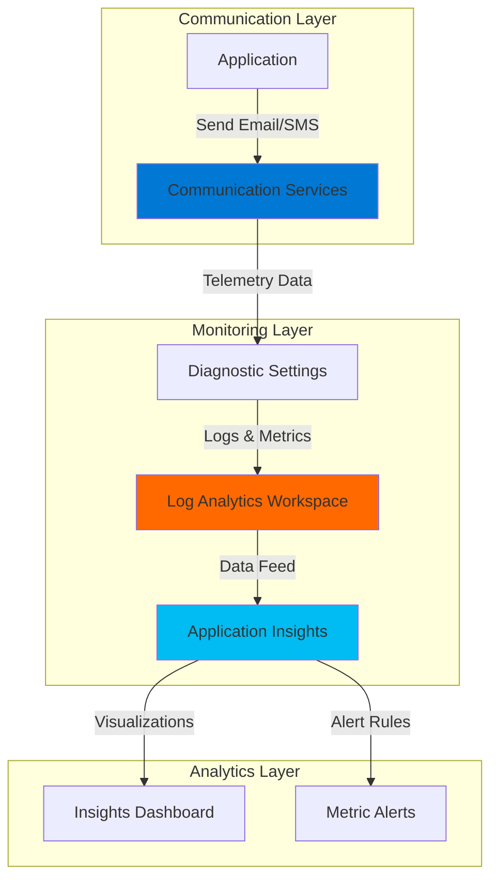

# Communication Monitoring with Communication Services and Application Insights

## Problem

Organizations sending transactional emails and SMS messages through Azure Communication Services lack comprehensive visibility into message delivery performance, failure rates, and user engagement metrics. Without proper monitoring, teams cannot proactively identify delivery issues, track bounce rates, or optimize communication strategies based on real-time telemetry data.

## Solution

Build a communication monitoring system using Azure Communication Services integrated with Application Insights to capture detailed telemetry about email and SMS delivery metrics. This solution provides real-time visibility into message performance, automated alerting for delivery failures, and comprehensive analytics dashboards for tracking communication effectiveness.

## Architecture Diagram



## Prerequisites

1. Azure subscription with permissions to create Communication Services and Application Insights resources
2. Azure CLI installed and configured (or Azure Cloud Shell)
3. Basic understanding of Azure monitoring concepts and Log Analytics
4. Email domain for testing (optional, can use console output)
5. Estimated cost: $5-10 USD for initial testing (most services have free tiers)

> **Note**: Communication Services charges per message sent, but includes free monthly quotas for SMS and email services. Log Analytics workspace charges for data ingestion and retention.

## Preparation

```bash
# Set environment variables for Azure resources
export RESOURCE_GROUP="rg-comm-monitor-${RANDOM_SUFFIX}"
export LOCATION="eastus"
export SUBSCRIPTION_ID=$(az account show --query id --output tsv)

# Generate unique suffix for resource names
RANDOM_SUFFIX=$(openssl rand -hex 3)

# Set resource names with unique suffix
export COMM_SERVICE_NAME="cs-monitor-${RANDOM_SUFFIX}"
export LOG_WORKSPACE_NAME="law-monitor-${RANDOM_SUFFIX}"
export APP_INSIGHTS_NAME="ai-monitor-${RANDOM_SUFFIX}"

# Create resource group
az group create \
    --name ${RESOURCE_GROUP} \
    --location ${LOCATION} \
    --tags purpose=recipe environment=demo

echo "✅ Resource group created: ${RESOURCE_GROUP}"
```

## Steps

1. **Create Log Analytics Workspace**:

   Log Analytics Workspace serves as the centralized data store for all monitoring telemetry from Azure Communication Services. This foundational component enables advanced querying, alerting, and visualization capabilities by collecting structured log data from multiple Azure services in a single location, following Azure Well-Architected Framework principles for operational excellence.

   ```bash
   # Create Log Analytics workspace for centralized monitoring
   az monitor log-analytics workspace create \
       --resource-group ${RESOURCE_GROUP} \
       --workspace-name ${LOG_WORKSPACE_NAME} \
       --location ${LOCATION} \
       --tags purpose=communication-monitoring
   
   # Get workspace ID for later configuration
   export WORKSPACE_ID=$(az monitor log-analytics workspace show \
       --resource-group ${RESOURCE_GROUP} \
       --workspace-name ${LOG_WORKSPACE_NAME} \
       --query id --output tsv)
   
   echo "✅ Log Analytics workspace created: ${LOG_WORKSPACE_NAME}"
   ```

   The workspace is now ready to receive telemetry data from Communication Services, providing the foundation for comprehensive monitoring and analytics with built-in security controls and retention policies.

2. **Create Application Insights Resource**:

   Application Insights provides advanced monitoring capabilities with built-in dashboards, alerting, and correlation features optimized for application performance monitoring. By linking it to the Log Analytics workspace, we create a unified monitoring solution that combines Communication Services telemetry with application performance insights using workspace-based architecture.

   ```bash
   # Create Application Insights linked to Log Analytics workspace
   az monitor app-insights component create \
       --app ${APP_INSIGHTS_NAME} \
       --resource-group ${RESOURCE_GROUP} \
       --location ${LOCATION} \
       --workspace ${WORKSPACE_ID} \
       --application-type web \
       --tags purpose=communication-monitoring
   
   # Get Application Insights connection string (modern approach)
   export AI_CONNECTION_STRING=$(az monitor app-insights component show \
       --app ${APP_INSIGHTS_NAME} \
       --resource-group ${RESOURCE_GROUP} \
       --query connectionString --output tsv)
   
   echo "✅ Application Insights created: ${APP_INSIGHTS_NAME}"
   echo "Connection String available for application integration"
   ```

   Application Insights is now configured with workspace-based architecture, enabling enhanced querying capabilities, unified access control, and improved correlation across services.

3. **Create Communication Services Resource**:

   Azure Communication Services provides enterprise-grade email and SMS capabilities with built-in telemetry generation and global scale. This resource automatically generates detailed metrics about message delivery, bounce rates, and user engagement that flows into our monitoring infrastructure through Azure Monitor integration.

   ```bash
   # Create Communication Services resource
   az communication create \
       --name ${COMM_SERVICE_NAME} \
       --resource-group ${RESOURCE_GROUP} \
       --location "Global" \
       --data-location "United States" \
       --tags purpose=communication environment=demo
   
   # Get resource ID for diagnostic settings
   export COMM_SERVICE_ID=$(az communication show \
       --name ${COMM_SERVICE_NAME} \
       --resource-group ${RESOURCE_GROUP} \
       --query id --output tsv)
   
   echo "✅ Communication Services created: ${COMM_SERVICE_NAME}"
   ```

   The Communication Services resource is ready to send emails and SMS messages while automatically generating telemetry data for monitoring, with built-in encryption and compliance features.

4. **Configure Diagnostic Settings**:

   Diagnostic settings enable the flow of telemetry data from Communication Services to Log Analytics workspace by capturing specific log categories. This configuration captures email delivery status, SMS metrics, and API request details, providing comprehensive visibility into communication performance with configurable retention policies.

   ```bash
   # Create diagnostic setting for Communication Services
   az monitor diagnostic-settings create \
       --name "CommServiceDiagnostics" \
       --resource ${COMM_SERVICE_ID} \
       --workspace ${WORKSPACE_ID} \
       --logs '[
         {
           "category": "EmailSendMailOperational",
           "enabled": true,
           "retentionPolicy": {"enabled": false, "days": 0}
         },
         {
           "category": "EmailStatusUpdateOperational", 
           "enabled": true,
           "retentionPolicy": {"enabled": false, "days": 0}
         },
         {
           "category": "SMSOperational",
           "enabled": true,
           "retentionPolicy": {"enabled": false, "days": 0}
         }
       ]' \
       --metrics '[
         {
           "category": "AllMetrics",
           "enabled": true,
           "retentionPolicy": {"enabled": false, "days": 0}
         }
       ]'
   
   echo "✅ Diagnostic settings configured for Communication Services"
   ```

   Telemetry data now flows from Communication Services to Log Analytics workspace, enabling monitoring and alerting capabilities with structured logging for optimal query performance.

5. **Create Custom Monitoring Query**:

   Custom KQL queries enable proactive monitoring of communication performance by analyzing telemetry data patterns and trends. This query monitors email delivery success rates and SMS failures, providing insights into communication effectiveness and potential issues using advanced analytics capabilities.

   ```bash
   # Create custom query for monitoring communication metrics
   cat > monitoring-query.kql << 'EOF'
   // Communication Services Monitoring Dashboard Query
   union 
   (
       ACSEmailSendMailOperational
       | where TimeGenerated >= ago(24h)
       | summarize 
           EmailsSent = count(),
           EmailsSuccessful = countif(Level == "Informational"),
           EmailsFailed = countif(Level == "Error")
       | extend ServiceType = "Email"
   ),
   (
       ACSSMSOperational  
       | where TimeGenerated >= ago(24h)
       | summarize 
           MessagesSent = count(),
           MessagesDelivered = countif(DeliveryStatus == "Delivered"),
           MessagesFailed = countif(DeliveryStatus == "Failed")
       | extend ServiceType = "SMS"
   )
   | project ServiceType, 
             TotalSent = coalesce(EmailsSent, MessagesSent),
             Successful = coalesce(EmailsSuccessful, MessagesDelivered), 
             Failed = coalesce(EmailsFailed, MessagesFailed)
   | extend SuccessRate = round((todouble(Successful) / todouble(TotalSent)) * 100, 2)
   EOF
   
   echo "✅ Custom monitoring query created: monitoring-query.kql"
   ```

   The monitoring query provides aggregated metrics for both email and SMS services, calculating success rates and identifying failure patterns with time-based analysis for trending.

6. **Set Up Metric Alerts**:

   Automated alerts enable proactive incident response by notifying teams when communication services experience delivery issues or performance degradation. These metric-based alerts monitor platform metrics and trigger notifications based on configurable thresholds to ensure reliable message delivery.

   ```bash
   # Create action group for alert notifications
   az monitor action-group create \
       --name "CommServiceAlerts" \
       --resource-group ${RESOURCE_GROUP} \
       --short-name "CommAlerts"
   
   # Get available metrics for Communication Services
   az monitor metrics list-definitions \
       --resource ${COMM_SERVICE_ID} \
       --query "[].{name:name.value, displayName:displayName}" \
       --output table
   
   # Create metric alert for API request failures (simplified condition)
   az monitor metrics alert create \
       --name "CommunicationServiceFailures" \
       --resource-group ${RESOURCE_GROUP} \
       --scopes ${COMM_SERVICE_ID} \
       --condition "total APIRequests > 10" \
       --description "Alert when Communication Services requests exceed threshold" \
       --evaluation-frequency 5m \
       --window-size 15m \
       --severity 2 \
       --action CommServiceAlerts
   
   echo "✅ Metric alerts configured for proactive monitoring"
   ```

   Alert rules now monitor Communication Services platform metrics and will trigger notifications when delivery issues occur, enabling rapid incident response with configurable severity levels.

## Validation & Testing

1. **Verify Log Analytics Workspace Integration**:

   ```bash
   # Check workspace is receiving data
   az monitor log-analytics workspace show \
       --resource-group ${RESOURCE_GROUP} \
       --workspace-name ${LOG_WORKSPACE_NAME} \
       --query "{name:name, location:location, provisioningState:provisioningState}"
   ```

   Expected output: Workspace shows "Succeeded" provisioning state and correct location.

2. **Validate Diagnostic Settings Configuration**:

   ```bash
   # Verify diagnostic settings are active
   az monitor diagnostic-settings list \
       --resource ${COMM_SERVICE_ID} \
       --query "[].{name:name, logs:logs[].{category:category, enabled:enabled}}"
   ```

   Expected output: Shows enabled diagnostic categories for Email and SMS operations.

3. **Test Application Insights Connection**:

   ```bash
   # Check Application Insights integration
   az monitor app-insights component show \
       --app ${APP_INSIGHTS_NAME} \
       --resource-group ${RESOURCE_GROUP} \
       --query "{appId:appId, connectionString:connectionString, workspaceResourceId:workspaceResourceId}"
   ```

   Expected output: Shows valid connection string and workspace resource ID linking.

4. **Validate Alert Rules**:

   ```bash
   # List configured metric alerts
   az monitor metrics alert list \
       --resource-group ${RESOURCE_GROUP} \
       --query "[].{name:name, enabled:enabled, severity:severity, targetResourceId:scopes[0]}"
   ```

   Expected output: Shows alert rules enabled with appropriate severity levels.

## Cleanup

1. **Remove Alert Rules**:

   ```bash
   # Delete metric alerts
   az monitor metrics alert delete \
       --name "CommunicationServiceFailures" \
       --resource-group ${RESOURCE_GROUP}
   
   # Delete action group
   az monitor action-group delete \
       --name "CommServiceAlerts" \
       --resource-group ${RESOURCE_GROUP}
   
   echo "✅ Alert rules and action groups deleted"
   ```

2. **Remove Monitoring Resources**:

   ```bash
   # Delete Application Insights
   az monitor app-insights component delete \
       --app ${APP_INSIGHTS_NAME} \
       --resource-group ${RESOURCE_GROUP}
   
   # Delete Communication Services
   az communication delete \
       --name ${COMM_SERVICE_NAME} \
       --resource-group ${RESOURCE_GROUP} \
       --yes
   
   echo "✅ Communication Services and Application Insights deleted"
   ```

3. **Remove Resource Group**:

   ```bash
   # Delete resource group and all remaining resources
   az group delete \
       --name ${RESOURCE_GROUP} \
       --yes \
       --no-wait
   
   echo "✅ Resource group deletion initiated: ${RESOURCE_GROUP}"
   echo "Note: Deletion may take several minutes to complete"
   
   # Clean up local files
   rm -f monitoring-query.kql
   ```

## Discussion

This communication monitoring solution addresses critical business needs for organizations relying on automated messaging systems. By integrating Azure Communication Services with Application Insights, teams gain comprehensive visibility into message delivery performance, enabling proactive issue resolution and optimization opportunities through a unified monitoring approach.

The architecture follows Azure Well-Architected Framework principles by implementing centralized logging through Log Analytics workspace, automated alerting for operational excellence, and detailed metrics collection for performance monitoring. The diagnostic settings capture three essential data streams: email operational logs, delivery status updates, and SMS operational metrics, providing complete visibility into communication workflows with proper data retention and security controls.

Key benefits include real-time monitoring of delivery success rates, automated alerting when failure thresholds are exceeded, and historical trend analysis through Log Analytics queries. The solution supports both reactive troubleshooting through detailed log analysis and proactive optimization through performance metrics and user engagement tracking. Organizations can extend this foundation by adding custom telemetry, integrating with Azure Monitor workbooks for advanced visualizations, and implementing automated remediation workflows using Azure Logic Apps or Azure Functions.

The monitoring queries demonstrate how to aggregate metrics across multiple communication channels, calculate success rates, and identify failure patterns using KQL (Kusto Query Language). This data-driven approach enables continuous improvement of communication strategies and ensures reliable message delivery for critical business processes. For more detailed information, see the [Azure Communication Services monitoring documentation](https://learn.microsoft.com/en-us/azure/communication-services/concepts/analytics/insights/insights-dashboard) and [Application Insights overview](https://learn.microsoft.com/en-us/azure/azure-monitor/app/app-insights-overview).

> **Tip**: Use Azure Monitor workbooks to create custom dashboards combining Communication Services metrics with application performance data for comprehensive observability and business intelligence.

## Challenge

Extend this monitoring solution by implementing these enhancements:

1. **Advanced Analytics Dashboard**: Create Azure Monitor workbooks with custom visualizations showing communication trends, regional delivery performance, and user engagement metrics across multiple time periods with drill-down capabilities.

2. **Automated Remediation**: Implement Azure Logic Apps to automatically respond to delivery failures by switching to backup communication channels or escalating incidents to operations teams through Microsoft Teams or ServiceNow integration.

3. **Cost Optimization Monitoring**: Add KQL queries to track Communication Services usage costs and set up budget alerts to prevent unexpected charges from high-volume messaging scenarios, integrating with Azure Cost Management APIs.

4. **Multi-Region Monitoring**: Extend the solution to monitor Communication Services across multiple Azure regions, implementing failover alerting and cross-region performance comparisons with geo-distributed dashboards.

5. **Customer Experience Metrics**: Integrate user engagement data from Communication Services with application telemetry to create end-to-end customer journey analytics and personalization insights using Azure Synapse Analytics.

## Infrastructure Code

*Infrastructure code will be generated after recipe approval.*