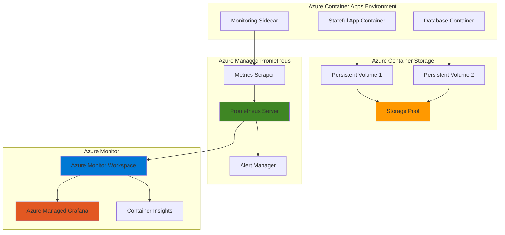

# Comprehensive Container Monitoring with Azure Container Storage and Managed Prometheus

## Problem

Organizations running stateful containerized applications face significant challenges in monitoring performance, storage utilization, and application health across dynamic container environments. Traditional monitoring solutions often lack the granular visibility needed for persistent storage metrics, container-specific performance indicators, and real-time alerting for stateful workloads. Without comprehensive monitoring, teams struggle to identify storage bottlenecks, optimize resource allocation, and maintain application reliability in production environments.

## Solution

This solution leverages Azure Container Storage for high-performance persistent storage and Azure Managed Prometheus for advanced metrics collection and monitoring. By integrating these services with Azure Container Apps and Azure Monitor, we create a comprehensive monitoring architecture that provides deep insights into stateful workload performance, storage utilization patterns, and application health metrics with automated alerting and visualization capabilities.

## Architecture Diagram



## Prerequisites

1. Azure subscription with contributor-level permissions for resource creation
2. Azure CLI v2.50.0 or later installed and configured (or Azure Cloud Shell)
3. Basic understanding of container orchestration, monitoring concepts, and Prometheus metrics
4. Familiarity with Azure Container Apps and persistent storage concepts
5. Estimated cost: $50-75 per month for development/testing environments

> **Note**: Azure Container Storage is currently in general availability and requires AKS or Azure Container Apps environments. Azure Managed Prometheus integrates seamlessly with Azure Monitor workspace for centralized metrics storage and analysis.

## Preparation

```bash
# Set environment variables for Azure resources
export RESOURCE_GROUP="rg-stateful-monitoring-${RANDOM_SUFFIX}"
export LOCATION="eastus"
export SUBSCRIPTION_ID=$(az account show --query id --output tsv)

# Generate unique suffix for resource names
RANDOM_SUFFIX=$(openssl rand -hex 3)

# Set service-specific variables
export CONTAINER_APP_ENV="cae-stateful-${RANDOM_SUFFIX}"
export CONTAINER_APP_NAME="ca-stateful-app-${RANDOM_SUFFIX}"
export STORAGE_ACCOUNT="st${RANDOM_SUFFIX}"
export MONITOR_WORKSPACE="amw-prometheus-${RANDOM_SUFFIX}"
export GRAFANA_INSTANCE="grafana-${RANDOM_SUFFIX}"
export LOG_ANALYTICS_WORKSPACE="law-monitoring-${RANDOM_SUFFIX}"

# Create resource group
az group create \
    --name ${RESOURCE_GROUP} \
    --location ${LOCATION} \
    --tags purpose=stateful-monitoring environment=demo

echo "✅ Resource group created: ${RESOURCE_GROUP}"

# Create Log Analytics workspace for Container Apps
az monitor log-analytics workspace create \
    --resource-group ${RESOURCE_GROUP} \
    --workspace-name ${LOG_ANALYTICS_WORKSPACE} \
    --location ${LOCATION}

echo "✅ Log Analytics workspace created for monitoring"
```

## Steps

1. **Create Azure Monitor Workspace for Prometheus**:

   Azure Monitor Workspace provides the foundational infrastructure for storing and querying Prometheus metrics at scale. This managed service eliminates the operational overhead of running Prometheus servers while providing enterprise-grade reliability, security, and integration with Azure's monitoring ecosystem. The workspace serves as the central repository for all container and storage metrics.

   ```bash
   # Create Azure Monitor workspace for Prometheus metrics
   az monitor account create \
       --name ${MONITOR_WORKSPACE} \
       --resource-group ${RESOURCE_GROUP} \
       --location ${LOCATION} \
       --tags workload=stateful-monitoring service=prometheus
   
   # Get the workspace resource ID for later use
   MONITOR_WORKSPACE_ID=$(az monitor account show \
       --name ${MONITOR_WORKSPACE} \
       --resource-group ${RESOURCE_GROUP} \
       --query id --output tsv)
   
   echo "✅ Azure Monitor workspace created: ${MONITOR_WORKSPACE}"
   ```

   The Azure Monitor workspace is now ready to receive and store Prometheus metrics from your containerized applications. This centralized approach ensures consistent metric storage, querying capabilities, and seamless integration with other Azure monitoring services.

2. **Create Container Apps Environment with Monitoring**:

   Azure Container Apps Environment provides the serverless container platform that automatically scales based on demand while maintaining persistent storage connections. Enabling monitoring integration ensures that container metrics, logs, and performance data are automatically collected and forwarded to Azure Monitor for comprehensive observability.

   ```bash
   # Create Container Apps environment with monitoring enabled
   az containerapp env create \
       --name ${CONTAINER_APP_ENV} \
       --resource-group ${RESOURCE_GROUP} \
       --location ${LOCATION} \
       --logs-workspace-id $(az monitor log-analytics workspace show \
           --resource-group ${RESOURCE_GROUP} \
           --workspace-name ${LOG_ANALYTICS_WORKSPACE} \
           --query customerId --output tsv) \
       --logs-workspace-key $(az monitor log-analytics workspace get-shared-keys \
           --resource-group ${RESOURCE_GROUP} \
           --workspace-name ${LOG_ANALYTICS_WORKSPACE} \
           --query primarySharedKey --output tsv)
   
   # Enable Container Apps monitoring add-on
   az containerapp env enable-monitoring \
       --name ${CONTAINER_APP_ENV} \
       --resource-group ${RESOURCE_GROUP} \
       --workspace-id ${MONITOR_WORKSPACE_ID}
   
   echo "✅ Container Apps environment created with monitoring enabled"
   ```

   The Container Apps environment now has integrated monitoring capabilities that will automatically collect container metrics, application logs, and performance data. This foundational setup enables comprehensive observability for all containerized workloads deployed in this environment.

3. **Create Storage Account for Azure Container Storage**:

   Azure Storage Account provides the underlying block storage infrastructure that Azure Container Storage uses to provision persistent volumes for stateful applications. The premium performance tier ensures high IOPS and low latency for database workloads and other storage-intensive applications requiring consistent performance.

   ```bash
   # Create storage account for Container Storage backend
   az storage account create \
       --name ${STORAGE_ACCOUNT} \
       --resource-group ${RESOURCE_GROUP} \
       --location ${LOCATION} \
       --sku Premium_LRS \
       --kind StorageV2 \
       --access-tier Hot \
       --https-only true
   
   # Get storage account key for container storage configuration
   STORAGE_KEY=$(az storage account keys list \
       --resource-group ${RESOURCE_GROUP} \
       --account-name ${STORAGE_ACCOUNT} \
       --query '[0].value' --output tsv)
   
   echo "✅ Premium storage account created for Container Storage"
   ```

   The premium storage account is now configured to provide high-performance block storage for your stateful applications. This setup ensures that persistent data operations maintain low latency and high throughput, which is essential for database workloads and other storage-intensive applications.

4. **Deploy Stateful Application with Persistent Storage**:

   This step deploys a stateful application that demonstrates the integration between Azure Container Apps and persistent storage. The application includes volume mounts for data persistence and exposes metrics endpoints that Prometheus can scrape for monitoring storage utilization and application performance.

   ```bash
   # Create container app with persistent storage
   az containerapp create \
       --name ${CONTAINER_APP_NAME} \
       --resource-group ${RESOURCE_GROUP} \
       --environment ${CONTAINER_APP_ENV} \
       --image postgres:14 \
       --target-port 5432 \
       --ingress external \
       --min-replicas 1 \
       --max-replicas 3 \
       --cpu 1.0 \
       --memory 2.0Gi \
       --env-vars POSTGRES_DB=sampledb \
                  POSTGRES_USER=sampleuser \
                  POSTGRES_PASSWORD=samplepass123 \
       --volume-mounts data-volume:/var/lib/postgresql/data
   
   # Add persistent volume to the container app
   az containerapp volume add \
       --name ${CONTAINER_APP_NAME} \
       --resource-group ${RESOURCE_GROUP} \
       --volume-name data-volume \
       --volume-type AzureFile \
       --storage-account ${STORAGE_ACCOUNT} \
       --storage-share-name postgresql-data \
       --access-mode ReadWrite
   
   echo "✅ Stateful application deployed with persistent storage"
   ```

   The stateful PostgreSQL application is now running with persistent storage attached. The Azure File volume ensures that database data persists across container restarts and scaling operations, while the container exposes metrics that will be collected by Prometheus for monitoring.

5. **Configure Azure Managed Prometheus Data Collection**:

   Azure Managed Prometheus automatically discovers and scrapes metrics from containerized applications running in Azure Container Apps. This configuration enables the collection of both application-specific metrics and container infrastructure metrics, providing comprehensive visibility into workload performance and resource utilization.

   ```bash
   # Enable Managed Prometheus for Container Apps environment
   az containerapp env prometheus enable \
       --name ${CONTAINER_APP_ENV} \
       --resource-group ${RESOURCE_GROUP} \
       --workspace-id ${MONITOR_WORKSPACE_ID}
   
   # Configure Prometheus scraping for application metrics
   az monitor prometheus rule-group create \
       --resource-group ${RESOURCE_GROUP} \
       --workspace-name ${MONITOR_WORKSPACE} \
       --name "stateful-app-metrics" \
       --location ${LOCATION} \
       --description "Metrics collection for stateful applications" \
       --rules '[{
           "record": "container_cpu_usage_rate",
           "expression": "rate(container_cpu_usage_seconds_total[5m])"
       }, {
           "record": "container_memory_usage_percent",
           "expression": "container_memory_working_set_bytes / container_spec_memory_limit_bytes * 100"
       }]'
   
   echo "✅ Prometheus data collection configured for stateful workloads"
   ```

   Managed Prometheus is now actively collecting metrics from your containerized applications, including custom application metrics, container resource utilization, and storage performance indicators. These metrics are automatically stored in the Azure Monitor workspace for analysis and alerting.

6. **Create Azure Managed Grafana Dashboard**:

   Azure Managed Grafana provides enterprise-grade visualization capabilities with built-in integration to Azure Monitor workspaces. This setup creates pre-configured dashboards that display container metrics, storage performance, and application health indicators with real-time updates and historical trend analysis.

   ```bash
   # Create Azure Managed Grafana instance
   az grafana create \
       --name ${GRAFANA_INSTANCE} \
       --resource-group ${RESOURCE_GROUP} \
       --location ${LOCATION} \
       --sku Standard \
       --tags monitoring=prometheus workload=stateful
   
   # Link Grafana to Azure Monitor workspace
   az grafana data-source create \
       --name ${GRAFANA_INSTANCE} \
       --resource-group ${RESOURCE_GROUP} \
       --definition '{
           "name": "Azure Monitor Prometheus",
           "type": "prometheus",
           "url": "'$(az monitor account show --name ${MONITOR_WORKSPACE} --resource-group ${RESOURCE_GROUP} --query queryEndpoint --output tsv)'",
           "access": "proxy",
           "isDefault": true
       }'
   
   echo "✅ Grafana instance created and linked to Prometheus workspace"
   ```

   Azure Managed Grafana is now connected to your Prometheus data source and ready to display comprehensive dashboards for monitoring stateful workloads. The integration provides immediate access to container metrics, storage performance data, and application health indicators through customizable visualizations.

7. **Configure Storage Performance Monitoring**:

   This step implements specialized monitoring for Azure Container Storage performance metrics, including storage pool utilization, disk I/O patterns, and persistent volume health. These metrics are essential for optimizing storage performance and identifying potential bottlenecks in stateful applications.

   ```bash
   # Create storage monitoring configuration
   az monitor metrics alert create \
       --name "storage-pool-utilization-high" \
       --resource-group ${RESOURCE_GROUP} \
       --scopes ${MONITOR_WORKSPACE_ID} \
       --condition "avg storage_pool_capacity_used_bytes > 80" \
       --description "Storage pool utilization exceeds 80%" \
       --evaluation-frequency 5m \
       --window-size 15m \
       --severity 2
   
   # Create disk performance alert
   az monitor metrics alert create \
       --name "disk-read-latency-high" \
       --resource-group ${RESOURCE_GROUP} \
       --scopes ${MONITOR_WORKSPACE_ID} \
       --condition "avg disk_read_operations_time_seconds_total > 0.1" \
       --description "Disk read latency exceeds 100ms" \
       --evaluation-frequency 1m \
       --window-size 5m \
       --severity 1
   
   echo "✅ Storage performance monitoring alerts configured"
   ```

   Storage performance monitoring is now active with automated alerts for high utilization and latency conditions. These alerts provide proactive notification of storage performance issues, enabling rapid response to maintain application performance and user experience.

8. **Deploy Monitoring Sidecar Container**:

   The monitoring sidecar container provides enhanced observability by collecting application-specific metrics, log aggregation, and custom health checks. This pattern ensures that monitoring capabilities are co-located with your stateful applications without impacting their primary functionality.

   ```bash
   # Deploy monitoring sidecar with the main application
   az containerapp create \
       --name "monitoring-sidecar-${RANDOM_SUFFIX}" \
       --resource-group ${RESOURCE_GROUP} \
       --environment ${CONTAINER_APP_ENV} \
       --image prom/node-exporter:latest \
       --target-port 9100 \
       --ingress internal \
       --min-replicas 1 \
       --max-replicas 1 \
       --cpu 0.25 \
       --memory 0.5Gi \
       --command "/bin/node_exporter" \
       --args "--path.rootfs=/host" \
       --volume-mounts host-volume:/host:ro
   
   # Configure sidecar to expose custom metrics
   az containerapp ingress enable \
       --name "monitoring-sidecar-${RANDOM_SUFFIX}" \
       --resource-group ${RESOURCE_GROUP} \
       --type internal \
       --target-port 9100 \
       --transport http
   
   echo "✅ Monitoring sidecar container deployed with metrics endpoint"
   ```

   The monitoring sidecar is now running alongside your stateful application, providing additional system metrics, custom application metrics, and health check capabilities. This enhances the overall observability of your containerized workloads with detailed performance and operational insights.

9. **Create Custom Prometheus Recording Rules**:

   Recording rules pre-compute frequently queried metrics to improve dashboard performance and enable complex aggregations for stateful workload monitoring. These rules calculate storage efficiency ratios, application performance indicators, and resource utilization trends that are essential for capacity planning and optimization.

   ```bash
   # Create advanced recording rules for stateful workloads
   az monitor prometheus rule-group create \
       --resource-group ${RESOURCE_GROUP} \
       --workspace-name ${MONITOR_WORKSPACE} \
       --name "stateful-workload-recording-rules" \
       --location ${LOCATION} \
       --description "Advanced metrics for stateful workload analysis" \
       --rules '[{
           "record": "stateful_app:storage_efficiency_ratio",
           "expression": "storage_pool_capacity_used_bytes / storage_pool_capacity_provisioned_bytes"
       }, {
           "record": "stateful_app:container_restart_rate_5m",
           "expression": "rate(container_restarts_total[5m])"
       }, {
           "record": "stateful_app:disk_utilization_percent",
           "expression": "(disk_read_bytes_total + disk_written_bytes_total) / (disk_read_bytes_total + disk_written_bytes_total + disk_available_bytes) * 100"
       }]'
   
   echo "✅ Custom recording rules created for stateful workload metrics"
   ```

   The custom recording rules are now active and pre-computing essential metrics for stateful workload monitoring. These rules improve query performance in Grafana dashboards and provide valuable insights into storage efficiency, application stability, and resource utilization patterns.

10. **Configure Automated Alerting Rules**:

    Automated alerting ensures proactive monitoring by triggering notifications when critical thresholds are exceeded for container health, storage performance, or application availability. This comprehensive alerting strategy helps maintain service reliability and enables rapid incident response.

    ```bash
    # Create comprehensive alerting rules
    az monitor prometheus rule-group create \
        --resource-group ${RESOURCE_GROUP} \
        --workspace-name ${MONITOR_WORKSPACE} \
        --name "stateful-workload-alerts" \
        --location ${LOCATION} \
        --description "Critical alerts for stateful workload monitoring" \
        --rules '[{
            "alert": "ContainerHighCPUUsage",
            "expression": "container_cpu_usage_rate > 0.8",
            "for": "5m",
            "annotations": {
                "summary": "Container CPU usage is above 80%",
                "description": "Container {{ $labels.container }} has high CPU usage"
            }
        }, {
            "alert": "StoragePoolCapacityWarning",
            "expression": "stateful_app:storage_efficiency_ratio > 0.85",
            "for": "10m",
            "annotations": {
                "summary": "Storage pool capacity is above 85%",
                "description": "Storage pool utilization requires attention"
            }
        }, {
            "alert": "PersistentVolumeReadOnlyMode",
            "expression": "disk_readonly_errors_gauge > 0",
            "for": "1m",
            "annotations": {
                "summary": "Persistent volume mounted in read-only mode",
                "description": "Storage volume has errors and is read-only"
            }
        }]'
    
    echo "✅ Automated alerting rules configured for critical metrics"
    ```

    The alerting system is now monitoring your stateful workloads with rules that trigger notifications for high CPU usage, storage capacity warnings, and persistent volume errors. These alerts provide early warning of potential issues and enable proactive maintenance to prevent service disruptions.

## Validation & Testing

1. **Verify Container Apps Environment and Monitoring**:

   ```bash
   # Check Container Apps environment status
   az containerapp env show \
       --name ${CONTAINER_APP_ENV} \
       --resource-group ${RESOURCE_GROUP} \
       --query "properties.provisioningState" --output tsv
   
   # Verify monitoring integration
   az containerapp env list \
       --resource-group ${RESOURCE_GROUP} \
       --query "[?name=='${CONTAINER_APP_ENV}'].{Name:name,MonitoringEnabled:properties.appLogsConfiguration.destination}" --output table
   ```

   Expected output: `Succeeded` for provisioning state and monitoring destination should show Log Analytics workspace integration.

2. **Test Prometheus Metrics Collection**:

   ```bash
   # Query Prometheus metrics from Azure Monitor workspace
   az monitor prometheus query \
       --workspace-id ${MONITOR_WORKSPACE_ID} \
       --query "container_cpu_usage_rate" \
       --time-range "PT1H"
   
   # Check storage pool metrics availability
   az monitor prometheus query \
       --workspace-id ${MONITOR_WORKSPACE_ID} \
       --query "storage_pool_capacity_used_bytes" \
       --time-range "PT30M"
   ```

   Expected output: Metrics data should be returned showing CPU usage rates and storage pool utilization over the specified time ranges.

3. **Validate Grafana Dashboard Access**:

   ```bash
   # Get Grafana endpoint URL
   GRAFANA_URL=$(az grafana show \
       --name ${GRAFANA_INSTANCE} \
       --resource-group ${RESOURCE_GROUP} \
       --query "properties.endpoint" --output tsv)
   
   echo "Access Grafana dashboard at: ${GRAFANA_URL}"
   
   # Test data source connectivity
   az grafana data-source test \
       --name ${GRAFANA_INSTANCE} \
       --resource-group ${RESOURCE_GROUP} \
       --data-source-name "Azure Monitor Prometheus"
   ```

   Expected output: Grafana URL should be accessible and data source test should return successful connection status.

4. **Test Alerting Rules**:

   ```bash
   # Check alert rule status
   az monitor prometheus rule-group list \
       --workspace-name ${MONITOR_WORKSPACE} \
       --resource-group ${RESOURCE_GROUP} \
       --query "[].{Name:name,Rules:length(rules)}" --output table
   
   # Generate test load to trigger alerts
   az containerapp exec \
       --name ${CONTAINER_APP_NAME} \
       --resource-group ${RESOURCE_GROUP} \
       --command "stress --cpu 2 --timeout 300"
   ```

   Expected output: Alert rules should be listed with proper rule counts, and stress testing should eventually trigger CPU usage alerts.

## Cleanup

1. **Remove monitoring configurations**:

   ```bash
   # Delete Prometheus rule groups
   az monitor prometheus rule-group delete \
       --resource-group ${RESOURCE_GROUP} \
       --workspace-name ${MONITOR_WORKSPACE} \
       --name "stateful-workload-alerts" \
       --yes
   
   az monitor prometheus rule-group delete \
       --resource-group ${RESOURCE_GROUP} \
       --workspace-name ${MONITOR_WORKSPACE} \
       --name "stateful-workload-recording-rules" \
       --yes
   
   echo "✅ Monitoring configurations removed"
   ```

2. **Delete Container Apps and environment**:

   ```bash
   # Delete container applications
   az containerapp delete \
       --name ${CONTAINER_APP_NAME} \
       --resource-group ${RESOURCE_GROUP} \
       --yes
   
   az containerapp delete \
       --name "monitoring-sidecar-${RANDOM_SUFFIX}" \
       --resource-group ${RESOURCE_GROUP} \
       --yes
   
   # Delete Container Apps environment
   az containerapp env delete \
       --name ${CONTAINER_APP_ENV} \
       --resource-group ${RESOURCE_GROUP} \
       --yes
   
   echo "✅ Container Apps and environment deleted"
   ```

3. **Remove monitoring infrastructure**:

   ```bash
   # Delete Grafana instance
   az grafana delete \
       --name ${GRAFANA_INSTANCE} \
       --resource-group ${RESOURCE_GROUP} \
       --yes
   
   # Delete Azure Monitor workspace
   az monitor account delete \
       --name ${MONITOR_WORKSPACE} \
       --resource-group ${RESOURCE_GROUP} \
       --yes
   
   echo "✅ Monitoring infrastructure removed"
   ```

4. **Clean up remaining resources**:

   ```bash
   # Delete resource group and all contained resources
   az group delete \
       --name ${RESOURCE_GROUP} \
       --yes \
       --no-wait
   
   echo "✅ Resource group deletion initiated: ${RESOURCE_GROUP}"
   echo "Note: Deletion may take several minutes to complete"
   
   # Verify deletion (optional)
   az group exists --name ${RESOURCE_GROUP}
   ```

## Discussion

This comprehensive monitoring solution demonstrates the power of integrating Azure Container Storage with Azure Managed Prometheus for stateful workload observability. Azure Container Storage provides enterprise-grade persistent storage with built-in monitoring capabilities, while Azure Managed Prometheus eliminates the operational complexity of running Prometheus infrastructure at scale. The combination creates a robust foundation for monitoring containerized applications that require persistent data storage and real-time performance insights.

The architecture follows Azure Well-Architected Framework principles by implementing comprehensive monitoring, automated alerting, and efficient resource utilization. Azure Container Apps provides serverless scaling capabilities that automatically adjust based on workload demands, while the integrated monitoring ensures visibility into both application performance and underlying storage infrastructure. For detailed guidance on container monitoring strategies, see the [Azure Container Apps monitoring documentation](https://docs.microsoft.com/en-us/azure/container-apps/monitor) and [Azure Managed Prometheus overview](https://docs.microsoft.com/en-us/azure/azure-monitor/essentials/prometheus-metrics-overview).

From a cost optimization perspective, this solution leverages consumption-based pricing for Container Apps and managed services for Prometheus, ensuring you only pay for actual resource usage. The monitoring architecture can scale automatically with your workloads, eliminating the need for capacity planning and reducing operational overhead. Storage performance monitoring helps identify optimization opportunities, while automated alerting prevents costly downtime through proactive issue detection. For comprehensive cost optimization strategies, review the [Azure Container Apps pricing guide](https://azure.microsoft.com/en-us/pricing/details/container-apps/) and [Azure Monitor pricing documentation](https://azure.microsoft.com/en-us/pricing/details/monitor/).

The recording rules and alerting configuration provide essential operational insights that help maintain application performance and reliability. By pre-computing storage efficiency ratios and performance indicators, the solution reduces query load on the monitoring system while providing faster dashboard responses. The multi-layered alerting approach ensures that both immediate issues and longer-term trends are captured, enabling both reactive incident response and proactive capacity management. For best practices on Prometheus alerting, see the [Azure Monitor alerting documentation](https://docs.microsoft.com/en-us/azure/azure-monitor/alerts/alerts-overview).

> **Tip**: Use Azure Monitor Workbooks to create custom dashboards that combine Container Apps metrics with storage performance data for comprehensive operational views. The integration between Azure Managed Grafana and Azure Monitor workspace provides powerful visualization capabilities for complex monitoring scenarios.

## Challenge

Extend this monitoring solution by implementing these advanced capabilities:

1. **Multi-Region Monitoring**: Deploy the same stateful workload monitoring across multiple Azure regions and create cross-region dashboards that aggregate metrics, implement geo-redundant alerting, and track regional performance differences for disaster recovery planning.

2. **Advanced Storage Analytics**: Implement predictive analytics using Azure Machine Learning to analyze storage utilization patterns, predict capacity needs, and automatically recommend scaling actions based on historical usage trends and application growth patterns.

3. **Application Performance Monitoring (APM)**: Integrate Azure Application Insights with custom instrumentation in your stateful applications to track business metrics, user experience indicators, and distributed tracing across container boundaries while correlating with infrastructure metrics.

4. **Automated Remediation**: Create Azure Logic Apps workflows that automatically respond to monitoring alerts by scaling container replicas, triggering storage optimization tasks, or initiating failover procedures based on predefined thresholds and business rules.

5. **Compliance and Audit Monitoring**: Implement comprehensive logging and monitoring for regulatory compliance by tracking data access patterns, storage encryption status, and audit trail generation with automated compliance reporting and alerting for policy violations.

## Infrastructure Code

*Infrastructure code will be generated after recipe approval.*