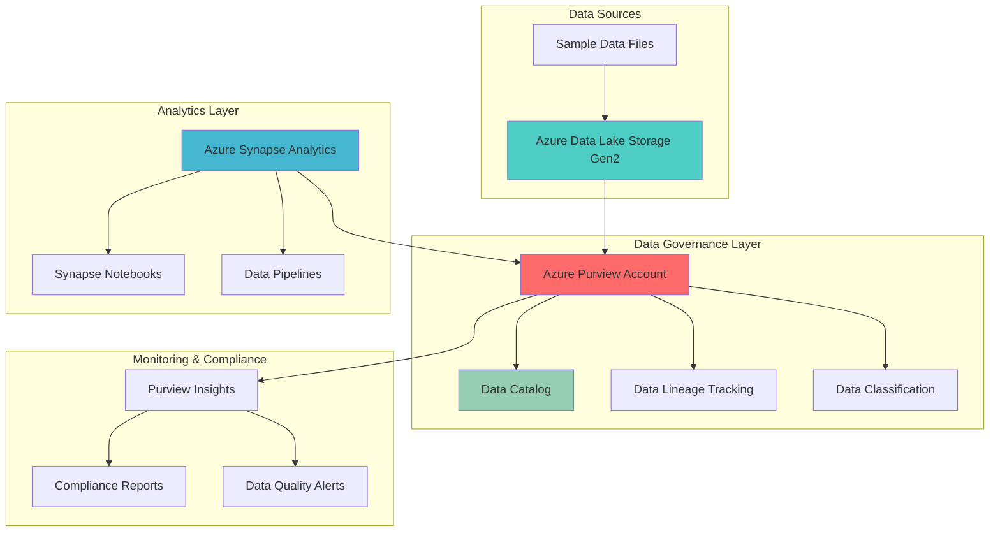

# Comprehensive Data Governance Pipeline with Purview Discovery

## Problem

Organizations struggle with managing data governance across distributed data lakes, leading to compliance violations, data quality issues, and inability to track data lineage. Manual data cataloging and classification processes are time-consuming and error-prone, creating blind spots in data discovery and increasing regulatory risks. Without automated governance frameworks, enterprises face challenges in maintaining data standards, ensuring proper access controls, and demonstrating compliance with privacy regulations.

## Solution

Build a comprehensive automated data governance pipeline using Azure Purview to discover, catalog, and classify data across Azure Data Lake Storage with integrated Azure Synapse Analytics for advanced analytics and compliance reporting. This solution leverages Azure Purview's AI-powered data discovery capabilities to automatically scan and classify sensitive data, establish data lineage tracking, and create a unified data catalog that enables self-service data discovery while maintaining enterprise-grade security and compliance controls.

## Architecture Diagram



## Prerequisites

1. Azure subscription with Owner or Contributor permissions
2. Azure CLI version 2.50.0 or later installed and configured
3. Basic understanding of data governance concepts and Azure storage
4. Familiarity with Azure Synapse Analytics and data pipeline concepts
5. Estimated cost: $50-100 USD for testing environment (depends on data volume and scan frequency)

> **Note**: Azure Purview follows consumption-based pricing for data scanning and catalog operations. For existing Azure Purview accounts, this recipe works with classic accounts. New customers should consider upgrading to the [Microsoft Purview Unified Catalog](https://docs.microsoft.com/en-us/purview/unified-catalog) experience. Review the [Azure Purview pricing guide](https://azure.microsoft.com/pricing/details/purview/) to understand cost implications before proceeding.

## Preparation

```bash
# Set environment variables for Azure resources
export RESOURCE_GROUP="rg-purview-governance-${RANDOM_SUFFIX}"
export LOCATION="eastus"
export SUBSCRIPTION_ID=$(az account show --query id --output tsv)

# Generate unique suffix for resource names
RANDOM_SUFFIX=$(openssl rand -hex 3)

# Set unique resource names
export PURVIEW_ACCOUNT="purview-${RANDOM_SUFFIX}"
export STORAGE_ACCOUNT="datalake${RANDOM_SUFFIX}"
export SYNAPSE_WORKSPACE="synapse-${RANDOM_SUFFIX}"

# Create resource group
az group create \
    --name ${RESOURCE_GROUP} \
    --location ${LOCATION} \
    --tags purpose=data-governance environment=demo

echo "✅ Resource group created: ${RESOURCE_GROUP}"

# Register required Azure resource providers
az provider register --namespace Microsoft.Purview
az provider register --namespace Microsoft.Storage
az provider register --namespace Microsoft.Synapse

echo "✅ Required resource providers registered"
```

## Steps

1. **Create Azure Data Lake Storage Gen2 Account**:

   Azure Data Lake Storage Gen2 provides the foundational storage layer for enterprise data lakes, combining the scalability of Azure Blob Storage with hierarchical namespace capabilities. This storage solution is optimized for big data analytics workloads and provides the necessary structure for automated data governance through Azure Purview integration.

   ```bash
   # Create storage account with hierarchical namespace enabled
   az storage account create \
       --name ${STORAGE_ACCOUNT} \
       --resource-group ${RESOURCE_GROUP} \
       --location ${LOCATION} \
       --sku Standard_LRS \
       --kind StorageV2 \
       --hierarchical-namespace true \
       --enable-versioning true \
       --tags purpose=data-lake environment=demo
   
   # Get storage account key for later use
   STORAGE_KEY=$(az storage account keys list \
       --resource-group ${RESOURCE_GROUP} \
       --account-name ${STORAGE_ACCOUNT} \
       --query '[0].value' --output tsv)
   
   echo "✅ Data Lake Storage Gen2 account created: ${STORAGE_ACCOUNT}"
   ```

   The storage account is now configured with hierarchical namespace and versioning enabled, providing the foundation for structured data organization and governance tracking. This configuration enables POSIX-compliant file system operations while maintaining blob storage compatibility for diverse data processing workloads.

2. **Create Container and Sample Data Structure**:

   Establishing a well-organized data structure is crucial for effective data governance. This step creates logical containers and directory structures that align with data governance best practices, enabling Azure Purview to effectively discover and catalog data assets across different business domains.

   ```bash
   # Create containers for different data domains
   az storage container create \
       --name raw-data \
       --account-name ${STORAGE_ACCOUNT} \
       --account-key ${STORAGE_KEY} \
       --auth-mode key
   
   az storage container create \
       --name processed-data \
       --account-name ${STORAGE_ACCOUNT} \
       --account-key ${STORAGE_KEY} \
       --auth-mode key
   
   az storage container create \
       --name sensitive-data \
       --account-name ${STORAGE_ACCOUNT} \
       --account-key ${STORAGE_KEY} \
       --auth-mode key
   
   # Create sample data files for governance testing
   echo "customer_id,name,email,phone,address" > customers.csv
   echo "1,John Doe,john@company.com,555-0123,123 Main St" >> customers.csv
   echo "2,Jane Smith,jane@company.com,555-0124,456 Oak Ave" >> customers.csv
   
   echo "order_id,customer_id,product,amount,date" > orders.csv
   echo "101,1,Laptop,999.99,2024-01-15" >> orders.csv
   echo "102,2,Mouse,29.99,2024-01-16" >> orders.csv
   
   # Upload sample data files
   az storage blob upload \
       --file customers.csv \
       --container-name sensitive-data \
       --name customers/customers.csv \
       --account-name ${STORAGE_ACCOUNT} \
       --account-key ${STORAGE_KEY}
   
   az storage blob upload \
       --file orders.csv \
       --container-name raw-data \
       --name orders/orders.csv \
       --account-name ${STORAGE_ACCOUNT} \
       --account-key ${STORAGE_KEY}
   
   echo "✅ Data containers and sample files created"
   ```

   The data structure now includes dedicated containers for raw, processed, and sensitive data, along with sample datasets that demonstrate different data classification scenarios. This organization enables Azure Purview to apply appropriate governance policies and sensitivity labels based on data location and content.

3. **Create Azure Purview Account**:

   Azure Purview serves as the central hub for data governance, providing automated data discovery, cataloging, and classification capabilities. The Purview account creates a unified data map that spans across your entire data estate, enabling comprehensive governance and compliance management.

   ```bash
   # Create Azure Purview account (Note: For existing tenants with classic accounts)
   az purview account create \
       --resource-group ${RESOURCE_GROUP} \
       --name ${PURVIEW_ACCOUNT} \
       --location ${LOCATION} \
       --managed-resource-group-name "managed-rg-${PURVIEW_ACCOUNT}" \
       --tags purpose=data-governance environment=demo
   
   # Wait for Purview account to be fully provisioned
   echo "⏳ Waiting for Purview account provisioning..."
   az purview account wait \
       --resource-group ${RESOURCE_GROUP} \
       --name ${PURVIEW_ACCOUNT} \
       --created
   
   # Get Purview account details
   PURVIEW_ENDPOINT=$(az purview account show \
       --resource-group ${RESOURCE_GROUP} \
       --name ${PURVIEW_ACCOUNT} \
       --query 'properties.endpoints.catalog' \
       --output tsv)
   
   echo "✅ Azure Purview account created: ${PURVIEW_ACCOUNT}"
   echo "Purview Catalog Endpoint: ${PURVIEW_ENDPOINT}"
   ```

   The Purview account is now operational with its managed resource group and catalog endpoint configured. This service provides the foundation for automated data governance across your Azure data estate and enables advanced features like AI-powered data classification and automated lineage tracking.

4. **Configure Data Source Registration**:

   Registering data sources in Azure Purview enables the service to discover and catalog data assets automatically. This step establishes the connection between Purview and your Data Lake Storage, configuring the necessary permissions and scan settings for comprehensive data governance.

   ```bash
   # Get current user's object ID for role assignment
   USER_OBJECT_ID=$(az ad signed-in-user show --query id --output tsv)
   
   # Get storage account resource ID
   STORAGE_RESOURCE_ID=$(az storage account show \
       --resource-group ${RESOURCE_GROUP} \
       --name ${STORAGE_ACCOUNT} \
       --query 'id' --output tsv)
   
   # Assign Storage Blob Data Reader role to Purview managed identity
   PURVIEW_IDENTITY=$(az purview account show \
       --resource-group ${RESOURCE_GROUP} \
       --name ${PURVIEW_ACCOUNT} \
       --query 'identity.principalId' --output tsv)
   
   az role assignment create \
       --assignee ${PURVIEW_IDENTITY} \
       --role "Storage Blob Data Reader" \
       --scope ${STORAGE_RESOURCE_ID}
   
   # Assign Purview Data Curator role to current user
   PURVIEW_RESOURCE_ID=$(az purview account show \
       --resource-group ${RESOURCE_GROUP} \
       --name ${PURVIEW_ACCOUNT} \
       --query 'id' --output tsv)
   
   az role assignment create \
       --assignee ${USER_OBJECT_ID} \
       --role "Purview Data Curator" \
       --scope ${PURVIEW_RESOURCE_ID}
   
   echo "✅ Data source permissions configured"
   echo "Note: Data source registration must be completed in Azure portal"
   ```

   The necessary permissions are now established between Purview and your storage account, enabling automated scanning and cataloging. The Purview managed identity can read data from the storage account, while your user account has curator permissions to manage the data catalog and governance policies.

5. **Create Azure Synapse Analytics Workspace**:

   Azure Synapse Analytics integrates seamlessly with Azure Purview to provide advanced analytics capabilities while maintaining data lineage tracking. This integration enables end-to-end data governance from ingestion through transformation to consumption, ensuring compliance throughout the analytics lifecycle.

   ```bash
   # Create file system for Synapse workspace
   az storage fs create \
       --name synapse \
       --account-name ${STORAGE_ACCOUNT} \
       --account-key ${STORAGE_KEY}
   
   # Create Azure Synapse workspace
   az synapse workspace create \
       --name ${SYNAPSE_WORKSPACE} \
       --resource-group ${RESOURCE_GROUP} \
       --storage-account ${STORAGE_ACCOUNT} \
       --file-system synapse \
       --location ${LOCATION} \
       --sql-admin-login-user sqladminuser \
       --sql-admin-login-password "ComplexP@ssw0rd123!" \
       --tags purpose=analytics environment=demo
   
   # Wait for workspace creation
   echo "⏳ Waiting for Synapse workspace provisioning..."
   az synapse workspace wait \
       --resource-group ${RESOURCE_GROUP} \
       --workspace-name ${SYNAPSE_WORKSPACE} \
       --created
   
   # Get Synapse workspace details
   SYNAPSE_ENDPOINT=$(az synapse workspace show \
       --resource-group ${RESOURCE_GROUP} \
       --name ${SYNAPSE_WORKSPACE} \
       --query 'connectivityEndpoints.web' \
       --output tsv)
   
   echo "✅ Synapse workspace created: ${SYNAPSE_WORKSPACE}"
   echo "Synapse Studio URL: ${SYNAPSE_ENDPOINT}"
   ```

   The Synapse workspace is now ready with integrated storage and authentication configured. This workspace provides the platform for advanced analytics while automatically tracking data lineage and maintaining integration with Azure Purview for comprehensive data governance.

6. **Configure Firewall Rules for Development**:

   Configuring appropriate firewall rules enables secure access to your analytics resources while maintaining governance compliance. This step establishes necessary network access for development and testing while following Azure security best practices.

   ```bash
   # Allow Azure services access to Synapse workspace
   az synapse workspace firewall-rule create \
       --name AllowAllWindowsAzureIps \
       --resource-group ${RESOURCE_GROUP} \
       --workspace-name ${SYNAPSE_WORKSPACE} \
       --start-ip-address 0.0.0.0 \
       --end-ip-address 0.0.0.0
   
   # Get current public IP for client access
   CURRENT_IP=$(curl -s https://api.ipify.org)
   
   # Allow current IP access to Synapse workspace
   az synapse workspace firewall-rule create \
       --name AllowCurrentIP \
       --resource-group ${RESOURCE_GROUP} \
       --workspace-name ${SYNAPSE_WORKSPACE} \
       --start-ip-address ${CURRENT_IP} \
       --end-ip-address ${CURRENT_IP}
   
   echo "✅ Firewall rules configured for development access"
   echo "Current IP allowed: ${CURRENT_IP}"
   ```

   Network access is now configured to enable secure development access while maintaining compliance with enterprise security policies. These rules can be refined for production environments based on specific organizational requirements and security standards.

7. **Create Data Pipeline for Governance Testing**:

   Building a data pipeline that integrates with Purview demonstrates automated lineage tracking and governance monitoring. This pipeline processes sample data while maintaining full traceability through Purview's data lineage capabilities, showcasing how governance integrates with operational data workflows.

   ```bash
   # Create a simple data pipeline definition
   cat > data-pipeline.json << 'EOF'
   {
     "name": "GovernanceTestPipeline",
     "properties": {
       "activities": [
         {
           "name": "CopyRawToProcessed",
           "type": "Copy",
           "inputs": [
             {
               "referenceName": "RawDataSource",
               "type": "DatasetReference"
             }
           ],
           "outputs": [
             {
               "referenceName": "ProcessedDataSink",
               "type": "DatasetReference"
             }
           ],
           "typeProperties": {
             "source": {
               "type": "DelimitedTextSource"
             },
             "sink": {
               "type": "DelimitedTextSink"
             }
           }
         }
       ]
     }
   }
   EOF
   
   # Create linked service for Data Lake Storage
   cat > linked-service.json << 'EOF'
   {
     "name": "DataLakeLinkedService",
     "properties": {
       "type": "AzureBlobFS",
       "typeProperties": {
         "url": "https://STORAGE_ACCOUNT.dfs.core.windows.net/",
         "accountKey": {
           "type": "SecureString",
           "value": "STORAGE_KEY"
         }
       }
     }
   }
   EOF
   
   # Replace placeholders in linked service
   sed -i.bak "s/STORAGE_ACCOUNT/${STORAGE_ACCOUNT}/g" linked-service.json
   sed -i.bak "s/STORAGE_KEY/${STORAGE_KEY}/g" linked-service.json
   
   echo "✅ Data pipeline configuration created"
   echo "Pipeline files ready for Synapse Studio deployment"
   ```

   The data pipeline configuration is now ready for deployment in Synapse Studio. This pipeline will automatically generate data lineage information in Purview when executed, demonstrating how governance tracking integrates seamlessly with operational data processes.

8. **Configure Data Classification Rules**:

   Setting up automated data classification rules enables Purview to identify and label sensitive data automatically. This configuration implements governance policies that ensure consistent data handling and compliance with privacy regulations across your entire data estate.

   ```bash
   # Create sample classification rules configuration
   cat > classification-rules.json << 'EOF'
   {
     "customClassificationRules": [
       {
         "name": "CustomerEmailClassification",
         "description": "Identifies customer email addresses",
         "classificationName": "Email Address",
         "ruleType": "Regex",
         "pattern": "^[a-zA-Z0-9._%+-]+@[a-zA-Z0-9.-]+\\.[a-zA-Z]{2,}$",
         "columnNames": ["email", "email_address", "customer_email"],
         "severity": "High"
       },
       {
         "name": "CustomerPhoneClassification",
         "description": "Identifies customer phone numbers",
         "classificationName": "Phone Number",
         "ruleType": "Regex",
         "pattern": "^\\+?[1-9]\\d{1,14}$|^\\(?\\d{3}\\)?[-\\s.]?\\d{3}[-\\s.]?\\d{4}$",
         "columnNames": ["phone", "phone_number", "customer_phone"],
         "severity": "Medium"
       },
       {
         "name": "CustomerAddressClassification",
         "description": "Identifies customer addresses",
         "classificationName": "Address",
         "ruleType": "KeywordList",
         "keywords": ["address", "street", "city", "state", "zip"],
         "columnNames": ["address", "street_address", "mailing_address"],
         "severity": "Medium"
       }
     ]
   }
   EOF
   
   # Create sensitivity labels configuration
   cat > sensitivity-labels.json << 'EOF'
   {
     "sensitivityLabels": [
       {
         "name": "Public",
         "description": "Data that can be shared publicly",
         "color": "#00FF00"
       },
       {
         "name": "Internal",
         "description": "Data for internal use only",
         "color": "#FFFF00"
       },
       {
         "name": "Confidential",
         "description": "Sensitive data requiring protection",
         "color": "#FFA500"
       },
       {
         "name": "Restricted",
         "description": "Highly sensitive data with strict access controls",
         "color": "#FF0000"
       }
     ]
   }
   EOF
   
   echo "✅ Classification rules and sensitivity labels configured"
   echo "Rules will be applied during data scanning process"
   ```

   The automated classification system is now configured with custom rules that identify sensitive data patterns including email addresses, phone numbers, and addresses. These rules enable consistent data labeling and ensure appropriate governance policies are applied based on data sensitivity levels.

## Validation & Testing

1. **Verify Azure Purview Account Status**:

   ```bash
   # Check Purview account status
   az purview account show \
       --resource-group ${RESOURCE_GROUP} \
       --name ${PURVIEW_ACCOUNT} \
       --query '{name:name,state:properties.provisioningState,endpoint:properties.endpoints.catalog}' \
       --output table
   ```

   Expected output: Account should show "Succeeded" provisioning state with a valid catalog endpoint.

2. **Validate Data Lake Storage Configuration**:

   ```bash
   # List containers in storage account
   az storage container list \
       --account-name ${STORAGE_ACCOUNT} \
       --account-key ${STORAGE_KEY} \
       --query '[].name' \
       --output table
   
   # Verify sample data files
   az storage blob list \
       --container-name sensitive-data \
       --account-name ${STORAGE_ACCOUNT} \
       --account-key ${STORAGE_KEY} \
       --query '[].name' \
       --output table
   ```

   Expected output: Should show containers (raw-data, processed-data, sensitive-data) and uploaded sample files.

3. **Test Synapse Analytics Integration**:

   ```bash
   # Check Synapse workspace status
   az synapse workspace show \
       --resource-group ${RESOURCE_GROUP} \
       --name ${SYNAPSE_WORKSPACE} \
       --query '{name:name,state:provisioningState,endpoint:connectivityEndpoints.web}' \
       --output table
   ```

   Expected output: Workspace should show "Succeeded" status with accessible web endpoint.

4. **Verify Role Assignments**:

   ```bash
   # Check Purview managed identity permissions
   az role assignment list \
       --assignee ${PURVIEW_IDENTITY} \
       --scope ${STORAGE_RESOURCE_ID} \
       --query '[].{Role:roleDefinitionName,Scope:scope}' \
       --output table
   ```

   Expected output: Should show "Storage Blob Data Reader" role assigned to Purview managed identity.

## Cleanup

1. **Remove Synapse workspace and related resources**:

   ```bash
   # Delete Synapse workspace
   az synapse workspace delete \
       --resource-group ${RESOURCE_GROUP} \
       --name ${SYNAPSE_WORKSPACE} \
       --yes
   
   echo "✅ Synapse workspace deleted"
   ```

2. **Remove Azure Purview account**:

   ```bash
   # Delete Purview account
   az purview account delete \
       --resource-group ${RESOURCE_GROUP} \
       --name ${PURVIEW_ACCOUNT} \
       --yes
   
   echo "✅ Purview account deleted"
   ```

3. **Remove storage account and data**:

   ```bash
   # Delete storage account
   az storage account delete \
       --resource-group ${RESOURCE_GROUP} \
       --name ${STORAGE_ACCOUNT} \
       --yes
   
   echo "✅ Storage account deleted"
   ```

4. **Remove resource group**:

   ```bash
   # Delete resource group and all remaining resources
   az group delete \
       --name ${RESOURCE_GROUP} \
       --yes \
       --no-wait
   
   echo "✅ Resource group deletion initiated"
   echo "Note: Complete deletion may take several minutes"
   ```

5. **Clean up local files**:

   ```bash
   # Remove temporary files
   rm -f customers.csv orders.csv data-pipeline.json
   rm -f linked-service.json classification-rules.json
   rm -f sensitivity-labels.json linked-service.json.bak
   
   echo "✅ Local configuration files cleaned up"
   ```

## Discussion

Azure Purview provides a comprehensive data governance solution that addresses the critical challenges of managing distributed data assets at enterprise scale. The integration between Azure Purview, Data Lake Storage, and Synapse Analytics creates a unified governance framework that automatically discovers, catalogs, and classifies data while maintaining complete lineage tracking throughout the analytics lifecycle. This approach significantly reduces manual governance overhead while ensuring consistent compliance with regulatory requirements such as GDPR, HIPAA, and industry-specific standards.

The automated data classification capabilities demonstrated in this recipe leverage machine learning algorithms to identify sensitive data patterns and apply appropriate governance policies automatically. This AI-driven approach scales effectively across large data estates and adapts to evolving data patterns without requiring constant manual intervention. For organizations managing petabytes of data across multiple business units, this automation becomes essential for maintaining governance consistency and compliance effectiveness. The [Azure Purview data governance documentation](https://docs.microsoft.com/en-us/purview/concept-data-governance) provides comprehensive guidance on implementing enterprise-scale governance strategies.

The seamless integration with Azure Synapse Analytics enables organizations to maintain governance controls throughout the entire data processing pipeline, from raw data ingestion through complex transformations to business intelligence reporting. This end-to-end lineage tracking ensures that compliance requirements are met at every stage of the analytics process while providing data engineers and analysts with the visibility needed to understand data origins and transformations. The [Azure Synapse Analytics integration guide](https://docs.microsoft.com/en-us/azure/synapse-analytics/catalog-and-governance/quickstart-connect-azure-purview) details advanced configuration options for production environments.

From a cost optimization perspective, Azure Purview's consumption-based pricing model ensures that organizations only pay for actual scanning and cataloging activities, making it cost-effective for both small-scale implementations and enterprise-wide deployments. For new implementations, Microsoft recommends considering the [Microsoft Purview Unified Catalog](https://docs.microsoft.com/en-us/purview/unified-catalog) experience, which provides enhanced capabilities and simplified billing. The service's ability to schedule scans and focus on specific data sources helps optimize costs while maintaining comprehensive governance coverage.

> **Tip**: Implement incremental scanning strategies to minimize costs and processing time while maintaining current governance information. Use Azure Purview's built-in scheduling capabilities to scan frequently changing data sources more often than static reference data, optimizing both performance and cost effectiveness.

## Challenge

Extend this data governance solution by implementing these advanced capabilities:

1. **Implement Custom Data Quality Rules**: Create automated data quality monitoring using Azure Data Factory and Purview APIs to identify and flag data quality issues automatically, with integration to Azure Monitor for alerting.

2. **Build Advanced Compliance Reporting**: Develop Power BI dashboards that consume Purview metadata to create executive-level compliance reports showing data governance metrics, classification coverage, and policy compliance across business units.

3. **Create Multi-Cloud Governance**: Extend the governance framework to include non-Azure data sources such as AWS S3 or Google Cloud Storage, demonstrating Purview's hybrid and multi-cloud capabilities for comprehensive data estate management.

4. **Implement Automated Privacy Impact Assessments**: Build workflows that automatically assess privacy impact when new data sources are added, using Azure Logic Apps to trigger compliance reviews and approval processes based on Purview classification results.

5. **Deploy Advanced Lineage Tracking**: Integrate with Azure Data Factory, Azure Databricks, and other data processing services to create comprehensive lineage maps that track data transformations across complex multi-step analytics pipelines.

## Infrastructure Code

### Available Infrastructure as Code:

- [Infrastructure Code Overview](code/README.md) - Detailed description of all infrastructure components
- [Bicep](code/bicep/) - Azure Bicep templates
- [Bash CLI Scripts](code/scripts/) - Example bash scripts using Azure CLI commands to deploy infrastructure
- [Terraform](code/terraform/) - Terraform configuration files