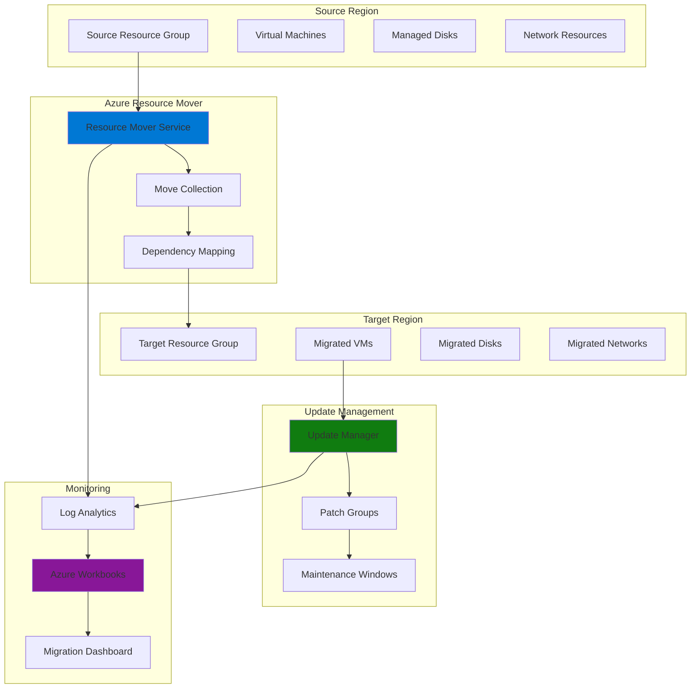

# Comprehensive Infrastructure Migration with Resource Mover and Update Manager

## Problem

Organizations often need to migrate critical infrastructure between Azure regions for business continuity, compliance, or performance optimization. However, traditional migration approaches create operational challenges including coordinating patch schedules, maintaining security compliance during migration, and providing visibility into migration progress. Manual migration processes are error-prone, time-consuming, and lack the comprehensive monitoring required for enterprise-scale deployments.

## Solution

Azure Resource Mover provides orchestrated cross-region resource migration with dependency tracking and validation, while Azure Update Manager ensures migrated resources maintain security compliance through automated patch management. Combined with Azure Workbooks for monitoring, this solution creates an integrated migration workflow that maintains security posture, provides real-time visibility, and enables predictable migration outcomes at scale.

## Architecture Diagram



## Prerequisites

1. Azure subscription with appropriate permissions (Resource Mover Contributor, Update Manager Contributor)
2. Azure CLI v2.60.0 or later installed and configured
3. Two Azure regions configured for migration testing
4. Virtual machines and associated resources in source region
5. Estimated cost: $50-150 for testing resources over 2 hours

> **Note**: Azure Resource Mover supports moving VMs, disks, NICs, availability sets, and virtual networks. Review the [supported resources documentation](https://learn.microsoft.com/en-us/azure/resource-mover/support-matrix-move-region-azure-vm) for current limitations.

## Preparation

```bash
# Set environment variables for the migration workflow
export SOURCE_REGION="eastus"
export TARGET_REGION="westus2"
export SUBSCRIPTION_ID=$(az account show --query id --output tsv)

# Generate unique suffix for resource names
RANDOM_SUFFIX=$(openssl rand -hex 3)
export RESOURCE_GROUP="rg-migration-${RANDOM_SUFFIX}"
export MOVE_COLLECTION_NAME="move-collection-${RANDOM_SUFFIX}"

# Create resource groups in both regions
az group create \
    --name ${RESOURCE_GROUP} \
    --location ${SOURCE_REGION} \
    --tags purpose=migration-demo environment=test

az group create \
    --name "${RESOURCE_GROUP}-target" \
    --location ${TARGET_REGION} \
    --tags purpose=migration-target environment=test

# Create Log Analytics workspace for monitoring
export LOG_WORKSPACE_NAME="law-migration-${RANDOM_SUFFIX}"
az monitor log-analytics workspace create \
    --resource-group ${RESOURCE_GROUP} \
    --workspace-name ${LOG_WORKSPACE_NAME} \
    --location ${SOURCE_REGION} \
    --sku pergb2018

echo "✅ Resource groups and Log Analytics workspace created"
```

## Steps

1. **Create Test Infrastructure in Source Region**:

   Before implementing the migration workflow, we need representative infrastructure to migrate. This step creates a virtual machine with associated networking and storage resources that demonstrate common enterprise migration scenarios. The infrastructure includes managed disks, network security groups, and proper resource tagging to simulate real-world migration complexity.

   ```bash
   # Create virtual network and subnet
   az network vnet create \
       --resource-group ${RESOURCE_GROUP} \
       --name vnet-source \
       --address-prefix 10.0.0.0/16 \
       --subnet-name subnet-default \
       --subnet-prefix 10.0.1.0/24 \
       --location ${SOURCE_REGION}
   
   # Create network security group
   az network nsg create \
       --resource-group ${RESOURCE_GROUP} \
       --name nsg-source \
       --location ${SOURCE_REGION}
   
   # Create virtual machine for migration testing
   az vm create \
       --resource-group ${RESOURCE_GROUP} \
       --name vm-source-test \
       --image Ubuntu2204 \
       --size Standard_B2s \
       --vnet-name vnet-source \
       --subnet subnet-default \
       --nsg nsg-source \
       --generate-ssh-keys \
       --location ${SOURCE_REGION} \
       --tags environment=test purpose=migration-source
   
   echo "✅ Test infrastructure created in source region"
   ```

   The virtual machine is now ready for migration testing with all necessary dependencies configured. This infrastructure represents a common enterprise scenario with network isolation, security groups, and managed storage that will be preserved during the migration process.

2. **Configure Azure Resource Mover Collection**:

   Azure Resource Mover organizes migration operations through move collections that track resource dependencies and coordinate the migration process. Creating a move collection establishes the foundation for orchestrated migration with built-in validation and rollback capabilities. This centralized approach ensures consistent migration behavior and provides comprehensive tracking throughout the migration lifecycle.

   ```bash
   # Install Azure Resource Mover CLI extension
   az extension add --name resource-mover
   
   # Create move collection for orchestrating the migration
   az resource-mover move-collection create \
       --resource-group ${RESOURCE_GROUP} \
       --move-collection-name ${MOVE_COLLECTION_NAME} \
       --source-region ${SOURCE_REGION} \
       --target-region ${TARGET_REGION} \
       --location ${SOURCE_REGION} \
       --move-type RegionToRegion \
       --tags purpose=migration-orchestration
   
   # Get the move collection resource ID for future operations
   MOVE_COLLECTION_ID=$(az resource-mover move-collection show \
       --resource-group ${RESOURCE_GROUP} \
       --move-collection-name ${MOVE_COLLECTION_NAME} \
       --query id --output tsv)
   
   echo "✅ Move collection created: ${MOVE_COLLECTION_NAME}"
   ```

   The move collection now provides a unified interface for managing resource dependencies and migration state. This enables predictable migration outcomes by automatically resolving resource relationships and ensuring proper sequencing of migration operations.

3. **Add Resources to Move Collection**:

   Adding resources to the move collection enables Azure Resource Mover to analyze dependencies and create an optimal migration plan. The service automatically detects relationships between resources and ensures they are migrated in the correct order. This automated dependency resolution eliminates manual coordination and reduces migration complexity for interconnected resources.

   ```bash
   # Get resource IDs for the resources to migrate
   VM_ID=$(az vm show \
       --resource-group ${RESOURCE_GROUP} \
       --name vm-source-test \
       --query id --output tsv)
   
   VNET_ID=$(az network vnet show \
       --resource-group ${RESOURCE_GROUP} \
       --name vnet-source \
       --query id --output tsv)
   
   NSG_ID=$(az network nsg show \
       --resource-group ${RESOURCE_GROUP} \
       --name nsg-source \
       --query id --output tsv)
   
   # Add VM to move collection (this will automatically detect dependencies)
   az resource-mover move-resource create \
       --resource-group ${RESOURCE_GROUP} \
       --move-collection-name ${MOVE_COLLECTION_NAME} \
       --name vm-source-test \
       --source-id ${VM_ID} \
       --target-resource-group "${RESOURCE_GROUP}-target"
   
   # Add network resources to move collection
   az resource-mover move-resource create \
       --resource-group ${RESOURCE_GROUP} \
       --move-collection-name ${MOVE_COLLECTION_NAME} \
       --name vnet-source \
       --source-id ${VNET_ID} \
       --target-resource-group "${RESOURCE_GROUP}-target"
   
   az resource-mover move-resource create \
       --resource-group ${RESOURCE_GROUP} \
       --move-collection-name ${MOVE_COLLECTION_NAME} \
       --name nsg-source \
       --source-id ${NSG_ID} \
       --target-resource-group "${RESOURCE_GROUP}-target"
   
   echo "✅ Resources added to move collection with dependency tracking"
   ```

   The move collection now contains all necessary resources with their dependencies mapped and validated. Resource Mover has automatically identified additional dependencies like managed disks and network interfaces, ensuring a complete migration scope.

4. **Validate and Prepare Migration**:

   The validation phase ensures all resources can be successfully migrated to the target region by checking quotas, naming conflicts, and regional availability. This proactive validation prevents migration failures and provides early feedback on any configuration issues. The preparation phase creates target region resources in a stopped state, enabling rapid cutover when migration is initiated.

   ```bash
   # Validate that all resources can be moved
   az resource-mover move-collection validate \
       --resource-group ${RESOURCE_GROUP} \
       --move-collection-name ${MOVE_COLLECTION_NAME}
   
   # Check validation status
   az resource-mover move-collection show \
       --resource-group ${RESOURCE_GROUP} \
       --move-collection-name ${MOVE_COLLECTION_NAME} \
       --query "provisioningState" --output tsv
   
   # Prepare resources for migration (creates target resources in stopped state)
   az resource-mover move-resource prepare \
       --resource-group ${RESOURCE_GROUP} \
       --move-collection-name ${MOVE_COLLECTION_NAME} \
       --move-resource-name vm-source-test
   
   # Wait for preparation to complete
   echo "Waiting for resource preparation to complete..."
   sleep 60
   
   echo "✅ Migration validation and preparation completed"
   ```

   The resources are now prepared for migration with all dependencies validated and target region resources created. This preparation phase significantly reduces migration time by pre-creating resources and enables rapid cutover with minimal downtime.

5. **Configure Update Manager for Target Region**:

   Azure Update Manager provides centralized patch management for migrated resources, ensuring security compliance is maintained throughout the migration process. Configuring Update Manager before migration completion enables immediate security management of migrated resources. This proactive approach prevents security gaps and ensures migrated infrastructure meets organizational compliance requirements.

   ```bash
   # Enable Update Manager for the target resource group
   az config set extension.use_dynamic_install=yes_without_prompt
   
   # Create maintenance configuration for update management
   export MAINTENANCE_CONFIG_NAME="maint-migration-${RANDOM_SUFFIX}"
   az maintenance configuration create \
       --resource-group "${RESOURCE_GROUP}-target" \
       --name ${MAINTENANCE_CONFIG_NAME} \
       --location ${TARGET_REGION} \
       --maintenance-scope "InGuestPatch" \
       --duration "02:00" \
       --recur-every "1Week" \
       --start-date-time "2025-08-01 03:00:00" \
       --time-zone "UTC" \
       --linux-parameters classifications="Critical Security" \
       --reboot-setting "IfRequired"
   
   # Get maintenance configuration ID
   MAINTENANCE_CONFIG_ID=$(az maintenance configuration show \
       --resource-group "${RESOURCE_GROUP}-target" \
       --name ${MAINTENANCE_CONFIG_NAME} \
       --query id --output tsv)
   
   echo "✅ Update Manager maintenance configuration created"
   ```

   The maintenance configuration establishes automated patch management for migrated resources with enterprise-appropriate scheduling and reboot policies. This ensures security compliance is maintained immediately after migration completion without manual intervention.

6. **Create Migration Monitoring Dashboard**:

   Azure Workbooks provides comprehensive monitoring and visualization for the migration workflow, combining Resource Mover metrics with Update Manager compliance data. This integrated monitoring enables real-time visibility into migration progress, resource health, and security compliance status. The dashboard provides stakeholders with actionable insights and enables proactive issue resolution during migration.

   ```bash
   # Create custom workbook for migration monitoring
   cat > migration-workbook.json << 'EOF'
   {
     "version": "Notebook/1.0",
     "items": [
       {
         "type": 1,
         "content": {
           "json": "# Infrastructure Migration Dashboard\n\nThis workbook provides comprehensive monitoring for Azure Resource Mover migration workflows and Update Manager compliance status."
         }
       },
       {
         "type": 3,
         "content": {
           "version": "KqlItem/1.0",
           "query": "AzureActivity\n| where TimeGenerated > ago(24h)\n| where OperationNameValue contains \"ResourceMover\"\n| summarize OperationCount = count() by OperationNameValue, ResourceGroup\n| order by OperationCount desc",
           "size": 0,
           "title": "Resource Mover Operations",
           "timeContext": {
             "durationMs": 86400000
           },
           "queryType": 0,
           "resourceType": "microsoft.operationalinsights/workspaces"
         }
       },
       {
         "type": 3,
         "content": {
           "version": "KqlItem/1.0",
           "query": "AzureActivity\n| where TimeGenerated > ago(7d)\n| where OperationNameValue contains \"Maintenance\"\n| summarize ComplianceCount = count() by OperationNameValue\n| order by ComplianceCount desc",
           "size": 0,
           "title": "Update Compliance Activity",
           "timeContext": {
             "durationMs": 604800000
           },
           "queryType": 0,
           "resourceType": "microsoft.operationalinsights/workspaces"
         }
       }
     ]
   }
   EOF
   
   # Deploy the workbook
   az monitor workbook create \
       --resource-group ${RESOURCE_GROUP} \
       --name "migration-monitoring-${RANDOM_SUFFIX}" \
       --display-name "Infrastructure Migration Monitoring" \
       --location ${SOURCE_REGION} \
       --workbook-source-id "/subscriptions/${SUBSCRIPTION_ID}/resourceGroups/${RESOURCE_GROUP}/providers/Microsoft.OperationalInsights/workspaces/${LOG_WORKSPACE_NAME}" \
       --workbook-template-file migration-workbook.json \
       --tags purpose=migration-monitoring
   
   echo "✅ Migration monitoring dashboard created"
   ```

   The monitoring dashboard now provides real-time visibility into migration progress, resource health, and compliance status. This comprehensive monitoring enables proactive issue identification and ensures stakeholders have complete visibility into the migration workflow.

7. **Execute Migration Workflow**:

   The migration execution phase initiates the actual resource movement between regions while maintaining monitoring and compliance capabilities. This orchestrated approach ensures proper sequencing, minimizes downtime, and provides rollback capabilities if issues occur. The integrated workflow maintains security compliance throughout the migration process.

   ```bash
   # Initiate the migration process
   az resource-mover move-resource initiate-move \
       --resource-group ${RESOURCE_GROUP} \
       --move-collection-name ${MOVE_COLLECTION_NAME} \
       --move-resource-name vm-source-test
   
   # Monitor migration progress
   echo "Monitoring migration progress..."
   for i in {1..10}; do
       STATUS=$(az resource-mover move-resource show \
           --resource-group ${RESOURCE_GROUP} \
           --move-collection-name ${MOVE_COLLECTION_NAME} \
           --move-resource-name vm-source-test \
           --query "moveStatus" --output tsv)
       
       echo "Migration status: ${STATUS}"
       
       if [ "${STATUS}" = "MoveInProgress" ]; then
           sleep 30
       else
           break
       fi
   done
   
   # Commit the migration (makes it permanent)
   az resource-mover move-resource commit \
       --resource-group ${RESOURCE_GROUP} \
       --move-collection-name ${MOVE_COLLECTION_NAME} \
       --move-resource-name vm-source-test
   
   echo "✅ Migration workflow executed successfully"
   ```

   The migration is now complete with resources successfully moved to the target region. The commit operation makes the migration permanent and enables cleanup of source region resources, completing the migration workflow.

8. **Apply Update Management to Migrated Resources**:

   Applying Update Manager to migrated resources ensures immediate security compliance and establishes ongoing patch management. This final step integrates the migrated infrastructure into the organization's security management framework and provides automated compliance monitoring. The update management configuration ensures migrated resources maintain security posture without manual intervention.

   ```bash
   # Get the migrated VM resource ID in target region
   MIGRATED_VM_ID=$(az vm show \
       --resource-group "${RESOURCE_GROUP}-target" \
       --name vm-source-test \
       --query id --output tsv)
   
   # Assign maintenance configuration to migrated VM
   az maintenance assignment create \
       --resource-group "${RESOURCE_GROUP}-target" \
       --resource-name vm-source-test \
       --resource-type virtualMachines \
       --provider-name Microsoft.Compute \
       --configuration-assignment-name "assignment-${RANDOM_SUFFIX}" \
       --maintenance-configuration-id ${MAINTENANCE_CONFIG_ID}
   
   # Trigger immediate assessment of migrated resources
   az vm run-command invoke \
       --resource-group "${RESOURCE_GROUP}-target" \
       --name vm-source-test \
       --command-id RunShellScript \
       --scripts "sudo apt update && sudo apt list --upgradable"
   
   # Enable monitoring for the migrated VM
   az vm extension set \
       --resource-group "${RESOURCE_GROUP}-target" \
       --vm-name vm-source-test \
       --name AzureMonitorLinuxAgent \
       --publisher Microsoft.Azure.Monitor
   
   echo "✅ Update management applied to migrated resources"
   ```

   The migrated resources are now fully integrated into the organization's update management framework with automated patch scheduling and compliance monitoring. This ensures security posture is maintained and provides ongoing visibility into the health of migrated infrastructure.

## Validation & Testing

1. **Verify migration completion and resource status**:

   ```bash
   # Check migration collection status
   az resource-mover move-collection show \
       --resource-group ${RESOURCE_GROUP} \
       --move-collection-name ${MOVE_COLLECTION_NAME} \
       --query "{State:provisioningState, Region:targetRegion}" \
       --output table
   
   # Verify migrated VM is running in target region
   az vm show \
       --resource-group "${RESOURCE_GROUP}-target" \
       --name vm-source-test \
       --query "{Name:name, Location:location, PowerState:powerState}" \
       --output table
   ```

   Expected output: VM should show as running in the target region with proper location and power state.

2. **Test update management configuration**:

   ```bash
   # Check maintenance configuration assignment
   az maintenance assignment list \
       --resource-group "${RESOURCE_GROUP}-target" \
       --query "[].{Name:name, MaintenanceConfig:maintenanceConfigurationId}" \
       --output table
   
   # Verify update compliance status
   az vm run-command invoke \
       --resource-group "${RESOURCE_GROUP}-target" \
       --name vm-source-test \
       --command-id RunShellScript \
       --scripts "sudo apt list --upgradable | wc -l"
   ```

   Expected output: Maintenance configuration should be assigned and update assessment should complete successfully.

3. **Validate monitoring dashboard functionality**:

   ```bash
   # Check workbook deployment
   az monitor workbook show \
       --resource-group ${RESOURCE_GROUP} \
       --name "migration-monitoring-${RANDOM_SUFFIX}" \
       --query "{Name:name, Location:location, ProvisioningState:provisioningState}" \
       --output table
   
   # Verify Log Analytics workspace connectivity
   az monitor log-analytics workspace show \
       --resource-group ${RESOURCE_GROUP} \
       --workspace-name ${LOG_WORKSPACE_NAME} \
       --query "{Name:name, ProvisioningState:provisioningState}" \
       --output table
   ```

   Expected output: Workbook should be deployed successfully with proper connectivity to Log Analytics workspace.

## Cleanup

1. **Remove migrated resources from target region**:

   ```bash
   # Delete target resource group and all migrated resources
   az group delete \
       --name "${RESOURCE_GROUP}-target" \
       --yes \
       --no-wait
   
   echo "✅ Target region resources cleanup initiated"
   ```

2. **Clean up migration infrastructure**:

   ```bash
   # Delete move collection
   az resource-mover move-collection delete \
       --resource-group ${RESOURCE_GROUP} \
       --move-collection-name ${MOVE_COLLECTION_NAME} \
       --yes
   
   # Delete source region resources
   az group delete \
       --name ${RESOURCE_GROUP} \
       --yes \
       --no-wait
   
   echo "✅ Migration infrastructure cleanup completed"
   ```

3. **Remove CLI extensions and temporary files**:

   ```bash
   # Remove Resource Mover extension
   az extension remove --name resource-mover
   
   # Clean up temporary files
   rm -f migration-workbook.json
   
   echo "✅ All resources and artifacts cleaned up"
   ```

## Discussion

Azure Resource Mover provides enterprise-grade infrastructure migration capabilities that address common challenges in cross-region resource movement. The service automatically resolves resource dependencies, validates migration feasibility, and provides rollback capabilities for complex migration scenarios. When combined with Azure Update Manager, organizations can maintain security compliance throughout the migration process while gaining comprehensive visibility through Azure Workbooks monitoring. This integrated approach follows [Azure Well-Architected Framework](https://learn.microsoft.com/en-us/azure/architecture/framework/) principles of reliability and operational excellence.

The Resource Mover service supports a wide range of Azure resources including virtual machines, managed disks, network interfaces, and availability sets. The dependency mapping capability ensures that related resources are migrated together, preventing configuration drift and maintaining application functionality. For comprehensive guidance on supported resources and limitations, see the [Azure Resource Mover documentation](https://learn.microsoft.com/en-us/azure/resource-mover/overview) and [migration support matrix](https://learn.microsoft.com/en-us/azure/resource-mover/support-matrix-move-region-azure-vm).

Azure Update Manager's integration with the migration workflow provides immediate security compliance for migrated resources through automated patch management and compliance monitoring. The maintenance configuration approach enables organizations to maintain consistent security posture across regions while providing flexibility for different patch schedules and reboot policies. The service supports both Windows and Linux environments with extensive customization options for patch classifications and installation timing. For detailed configuration guidance, review the [Update Manager documentation](https://learn.microsoft.com/en-us/azure/update-manager/overview).

> **Tip**: Use Azure Resource Mover's test migration capability to validate migration workflows before executing production migrations. This enables identification of issues and optimization of migration procedures without impacting production resources.

## Challenge

Extend this solution by implementing these enhancements:

1. **Multi-region migration orchestration** - Create workflows that migrate resources across multiple target regions simultaneously with coordinated patch management and monitoring
2. **Automated compliance validation** - Implement Azure Policy integration to ensure migrated resources meet organizational compliance requirements before migration completion
3. **Application-aware migration** - Integrate Application Insights and Azure Monitor to ensure application performance is maintained during migration with automated rollback triggers
4. **Cost optimization integration** - Add Azure Cost Management integration to track migration costs and optimize resource configurations based on usage patterns in the target region
5. **Disaster recovery automation** - Implement Azure Site Recovery integration to automatically establish disaster recovery for migrated resources with coordinated update management across primary and secondary regions

## Infrastructure Code

*Infrastructure code will be generated after recipe approval.*