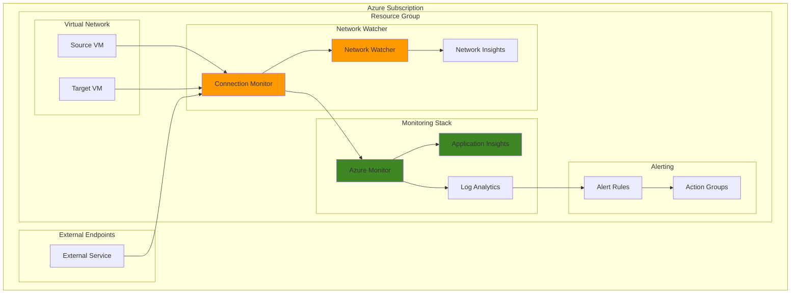

# Comprehensive Network Performance Monitoring Solution

## Problem

Modern distributed applications rely heavily on network connectivity between multiple services, endpoints, and cloud resources. Network performance issues like high latency, packet loss, and intermittent connectivity can significantly impact application performance and user experience, but traditional monitoring tools often lack the comprehensive visibility needed to correlate network metrics with application performance data. Organizations struggle to proactively identify network bottlenecks, diagnose root causes of performance degradation, and maintain optimal network performance across their Azure infrastructure.

## Solution

Azure Network Watcher combined with Application Insights provides a comprehensive network performance monitoring solution that tracks network connectivity, latency, and packet loss while correlating this data with application performance metrics. This integrated approach enables proactive network monitoring, rapid issue identification, and detailed performance analysis through Azure Monitor's unified observability platform. The solution leverages connection monitoring capabilities to continuously test network paths and automatically alerts on performance thresholds.

## Architecture Diagram



## Prerequisites

1. Azure subscription with Network Watcher enabled in target regions
2. Azure CLI 2.0.74 or later installed and configured
3. Contributor or Network Contributor permissions on the subscription
4. Basic understanding of Azure networking concepts and monitoring
5. At least two Azure VMs or endpoints for connection testing
6. Estimated cost: $10-20 per month for monitoring resources and data ingestion

> **Note**: Network Watcher is automatically enabled when you create a virtual network. Connection Monitor usage charges apply based on the number of tests and monitoring frequency.

## Preparation

```bash
# Set environment variables for Azure resources
export RESOURCE_GROUP="rg-network-monitoring-${RANDOM_SUFFIX}"
export LOCATION="eastus"
export SUBSCRIPTION_ID=$(az account show --query id --output tsv)
export VNET_NAME="vnet-monitoring"
export SUBNET_NAME="subnet-monitoring"

# Generate unique suffix for resource names
RANDOM_SUFFIX=$(openssl rand -hex 3)

# Create resource group
az group create \
    --name ${RESOURCE_GROUP} \
    --location ${LOCATION} \
    --tags purpose=network-monitoring environment=demo

echo "✅ Resource group created: ${RESOURCE_GROUP}"

# Create virtual network and subnet
az network vnet create \
    --name ${VNET_NAME} \
    --resource-group ${RESOURCE_GROUP} \
    --location ${LOCATION} \
    --address-prefixes 10.0.0.0/16 \
    --subnet-name ${SUBNET_NAME} \
    --subnet-prefixes 10.0.1.0/24

echo "✅ Virtual network created: ${VNET_NAME}"

# Ensure Network Watcher is enabled in the region
az network watcher configure \
    --resource-group NetworkWatcherRG \
    --location ${LOCATION} \
    --enabled true

echo "✅ Network Watcher enabled in region: ${LOCATION}"
```

## Steps

1. **Create Log Analytics Workspace and Application Insights**:

   Azure Log Analytics serves as the centralized data platform for storing and analyzing network performance metrics, while Application Insights provides application performance monitoring capabilities. Creating these foundational components first ensures that all network monitoring data can be properly ingested, stored, and correlated with application telemetry for comprehensive observability.

   ```bash
   # Create Log Analytics workspace
   export LOG_ANALYTICS_WORKSPACE="law-network-monitoring-${RANDOM_SUFFIX}"
   
   az monitor log-analytics workspace create \
       --resource-group ${RESOURCE_GROUP} \
       --workspace-name ${LOG_ANALYTICS_WORKSPACE} \
       --location ${LOCATION} \
       --sku PerGB2018
   
   # Get workspace ID and key for later use
   export WORKSPACE_ID=$(az monitor log-analytics workspace show \
       --resource-group ${RESOURCE_GROUP} \
       --workspace-name ${LOG_ANALYTICS_WORKSPACE} \
       --query customerId --output tsv)
   
   echo "✅ Log Analytics workspace created: ${LOG_ANALYTICS_WORKSPACE}"
   
   # Create Application Insights instance
   export APP_INSIGHTS_NAME="ai-network-monitoring-${RANDOM_SUFFIX}"
   
   az monitor app-insights component create \
       --app ${APP_INSIGHTS_NAME} \
       --location ${LOCATION} \
       --resource-group ${RESOURCE_GROUP} \
       --workspace ${LOG_ANALYTICS_WORKSPACE}
   
   # Get instrumentation key
   export INSTRUMENTATION_KEY=$(az monitor app-insights component show \
       --app ${APP_INSIGHTS_NAME} \
       --resource-group ${RESOURCE_GROUP} \
       --query instrumentationKey --output tsv)
   
   echo "✅ Application Insights created: ${APP_INSIGHTS_NAME}"
   ```

   The Log Analytics workspace now serves as the central repository for all network monitoring data, while Application Insights provides the framework for correlating network performance with application metrics. This integration enables comprehensive analysis of how network issues impact application performance.

2. **Create Virtual Machines for Connection Testing**:

   Virtual machines serve as source and destination endpoints for connection monitoring tests. Azure Network Watcher requires actual compute resources to generate network traffic and measure performance metrics like latency, packet loss, and connectivity status. These VMs represent typical application workloads and network endpoints in enterprise environments.

   ```bash
   # Create source VM
   export SOURCE_VM_NAME="vm-source-${RANDOM_SUFFIX}"
   
   az vm create \
       --resource-group ${RESOURCE_GROUP} \
       --name ${SOURCE_VM_NAME} \
       --image Ubuntu2204 \
       --vnet-name ${VNET_NAME} \
       --subnet ${SUBNET_NAME} \
       --admin-username azureuser \
       --generate-ssh-keys \
       --size Standard_B2s \
       --public-ip-sku Standard
   
   echo "✅ Source VM created: ${SOURCE_VM_NAME}"
   
   # Create destination VM
   export DEST_VM_NAME="vm-dest-${RANDOM_SUFFIX}"
   
   az vm create \
       --resource-group ${RESOURCE_GROUP} \
       --name ${DEST_VM_NAME} \
       --image Ubuntu2204 \
       --vnet-name ${VNET_NAME} \
       --subnet ${SUBNET_NAME} \
       --admin-username azureuser \
       --generate-ssh-keys \
       --size Standard_B2s \
       --public-ip-sku Standard
   
   echo "✅ Destination VM created: ${DEST_VM_NAME}"
   
   # Install Network Watcher extension on source VM
   az vm extension set \
       --resource-group ${RESOURCE_GROUP} \
       --vm-name ${SOURCE_VM_NAME} \
       --name NetworkWatcherAgentLinux \
       --publisher Microsoft.Azure.NetworkWatcher \
       --version 1.4
   
   echo "✅ Network Watcher extension installed on source VM"
   ```

   The VMs are now configured with Network Watcher extensions that enable advanced network monitoring capabilities. These extensions provide the necessary agents to perform connection tests, measure network metrics, and report performance data to Azure Monitor.

3. **Configure Connection Monitor**:

   Connection Monitor provides continuous network connectivity and performance monitoring between specified endpoints. This service automatically tests network paths at regular intervals, measuring latency, packet loss, and reachability while storing results in Azure Monitor for analysis and alerting. The configuration defines test groups that specify source and destination endpoints along with test protocols and thresholds.

   ```bash
   # Get VM resource IDs
   export SOURCE_VM_ID=$(az vm show \
       --resource-group ${RESOURCE_GROUP} \
       --name ${SOURCE_VM_NAME} \
       --query id --output tsv)
   
   export DEST_VM_ID=$(az vm show \
       --resource-group ${RESOURCE_GROUP} \
       --name ${DEST_VM_NAME} \
       --query id --output tsv)
   
   # Create connection monitor using Azure CLI v2 commands
   export CONNECTION_MONITOR_NAME="cm-network-performance-${RANDOM_SUFFIX}"
   
   az network watcher connection-monitor create \
       --name ${CONNECTION_MONITOR_NAME} \
       --location ${LOCATION} \
       --endpoint-source-name "source-endpoint" \
       --endpoint-source-resource-id ${SOURCE_VM_ID} \
       --endpoint-dest-name "dest-endpoint" \
       --endpoint-dest-resource-id ${DEST_VM_ID} \
       --test-config-name "tcp-test" \
       --test-config-frequency 30 \
       --test-config-protocol TCP \
       --test-config-tcp-port 80 \
       --test-config-preferred-ip-version IPv4 \
       --test-group-name "vm-to-vm-tests" \
       --output-type Workspace \
       --workspace-ids ${LOG_ANALYTICS_WORKSPACE}
   
   echo "✅ Connection Monitor created: ${CONNECTION_MONITOR_NAME}"
   
   # Add external endpoint test
   az network watcher connection-monitor endpoint add \
       --connection-monitor ${CONNECTION_MONITOR_NAME} \
       --location ${LOCATION} \
       --name "external-endpoint" \
       --type ExternalAddress \
       --address "www.microsoft.com"
   
   # Add test configuration for ICMP
   az network watcher connection-monitor test-configuration add \
       --connection-monitor ${CONNECTION_MONITOR_NAME} \
       --location ${LOCATION} \
       --name "icmp-test" \
       --test-frequency 60 \
       --protocol ICMP \
       --preferred-ip-version IPv4 \
       --threshold-checks-failed-percent 10 \
       --threshold-round-trip-time-ms 500
   
   # Add test group for external connectivity
   az network watcher connection-monitor test-group add \
       --connection-monitor ${CONNECTION_MONITOR_NAME} \
       --location ${LOCATION} \
       --name "vm-to-external-tests" \
       --test-configurations "tcp-test" "icmp-test" \
       --sources "source-endpoint" \
       --destinations "external-endpoint"
   
   echo "✅ External endpoint tests configured"
   ```

   The Connection Monitor is now actively testing network connectivity between the configured endpoints every 30-60 seconds. It measures TCP and ICMP connectivity, round-trip times, and packet loss while automatically storing results in the Log Analytics workspace for analysis and alerting.

4. **Configure Network Monitoring Alerts**:

   Azure Monitor alerts provide proactive notification when network performance degrades beyond acceptable thresholds. By creating metric-based alerts for connection monitor data, administrators can respond quickly to network issues before they impact users. The alerts use Log Analytics queries to analyze connection monitor results and trigger notifications based on configurable conditions.

   ```bash
   # Create action group for network alerts
   az monitor action-group create \
       --name "NetworkAlerts" \
       --resource-group ${RESOURCE_GROUP} \
       --short-name "NetAlert" \
       --email-receiver name="Admin" email="admin@company.com"
   
   echo "✅ Network monitoring action group created"
   
   # Create scheduled query alert for high latency
   az monitor scheduled-query create \
       --name "High Network Latency Alert" \
       --resource-group ${RESOURCE_GROUP} \
       --scopes "/subscriptions/${SUBSCRIPTION_ID}/resourceGroups/${RESOURCE_GROUP}/providers/Microsoft.OperationalInsights/workspaces/${LOG_ANALYTICS_WORKSPACE}" \
       --condition "avg(AverageRoundtripMs) > 1000" \
       --condition-query "NWConnectionMonitorTestResult | where TimeGenerated > ago(5m) | summarize avg(AverageRoundtripMs) by bin(TimeGenerated, 1m)" \
       --description "Alert when network latency exceeds 1000ms" \
       --evaluation-frequency "PT1M" \
       --window-size "PT5M" \
       --severity 2 \
       --action-groups ${RESOURCE_GROUP}/providers/microsoft.insights/actionGroups/NetworkAlerts \
       --auto-mitigation
   
   echo "✅ High latency alert created"
   
   # Create scheduled query alert for connectivity failures
   az monitor scheduled-query create \
       --name "Network Connectivity Failure" \
       --resource-group ${RESOURCE_GROUP} \
       --scopes "/subscriptions/${SUBSCRIPTION_ID}/resourceGroups/${RESOURCE_GROUP}/providers/Microsoft.OperationalInsights/workspaces/${LOG_ANALYTICS_WORKSPACE}" \
       --condition "min(TestResult) == 0" \
       --condition-query "NWConnectionMonitorTestResult | where TimeGenerated > ago(5m) | summarize min(TestResult) by bin(TimeGenerated, 1m)" \
       --description "Alert when network connectivity fails" \
       --evaluation-frequency "PT1M" \
       --window-size "PT5M" \
       --severity 1 \
       --action-groups ${RESOURCE_GROUP}/providers/microsoft.insights/actionGroups/NetworkAlerts \
       --auto-mitigation
   
   echo "✅ Connectivity failure alert created"
   ```

   Network monitoring alerts are now configured to proactively notify administrators when network performance degrades beyond acceptable thresholds. The alerts use Log Analytics queries to analyze real-time connection monitor data and trigger appropriate responses.

5. **Integrate Application Insights with Network Metrics**:

   Application Insights integration enables correlation between network performance metrics and application behavior. By configuring custom telemetry collection and linking network events with application performance data, you can identify how network issues impact user experience and application responsiveness. This integration provides end-to-end visibility across the entire application stack.

   ```bash
   # Create custom telemetry collection for network metrics
   cat > network-telemetry-config.json << EOF
   {
       "ApplicationInsights": {
           "ConnectionString": "InstrumentationKey=${INSTRUMENTATION_KEY}",
           "EnableDependencyTracking": true,
           "EnablePerformanceCounterCollection": true,
           "EnableRequestTracking": true
       },
       "NetworkMonitoring": {
           "EnableConnectionMonitoring": true,
           "LogAnalyticsWorkspaceId": "${WORKSPACE_ID}",
           "CustomMetrics": [
               "NetworkLatency",
               "PacketLoss",
               "ConnectionSuccess",
               "RouteHopCount"
           ]
       }
   }
   EOF
   
   # Create Log Analytics query for network-application correlation
   cat > network-app-correlation-query.kusto << EOF
   // Network Performance Impact on Application Response Time
   let NetworkData = NWConnectionMonitorTestResult
   | where TimeGenerated > ago(1h)
   | summarize AvgLatency = avg(AverageRoundtripMs), AvgPacketLoss = avg(LossPercentage) by bin(TimeGenerated, 5m);
   
   let AppData = requests
   | where timestamp > ago(1h)
   | summarize AvgResponseTime = avg(duration) by bin(timestamp, 5m);
   
   NetworkData
   | join kind=inner (AppData) on \$left.TimeGenerated == \$right.timestamp
   | project TimeGenerated, AvgLatency, AvgPacketLoss, AvgResponseTime
   | render timechart
   EOF
   
   echo "✅ Application Insights network correlation configured"
   
   # Create workbook for network performance visualization
   cat > network-performance-workbook.json << EOF
   {
       "version": "Notebook/1.0",
       "items": [
           {
               "type": 1,
               "content": {
                   "json": "# Network Performance Monitoring Dashboard\n\nThis dashboard provides comprehensive network performance metrics collected from Azure Network Watcher and Application Insights."
               }
           },
           {
               "type": 3,
               "content": {
                   "version": "KqlItem/1.0",
                   "query": "NWConnectionMonitorTestResult\n| where TimeGenerated > ago(1h)\n| summarize AvgLatency = avg(AverageRoundtripMs), AvgPacketLoss = avg(LossPercentage) by bin(TimeGenerated, 5m)\n| render timechart",
                   "size": 0,
                   "title": "Network Latency and Packet Loss Trends"
               }
           }
       ]
   }
   EOF
   
   echo "✅ Network performance workbook template created"
   ```

   Application Insights is now configured to collect and correlate network performance data with application telemetry. The custom queries enable analysis of how network latency and packet loss impact application response times and user experience.

6. **Configure Advanced Network Diagnostics**:

   Advanced network diagnostics provide deeper insights into network behavior through packet capture, flow logs, and detailed connectivity analysis. These capabilities enable root cause analysis of network issues and provide the granular data needed for performance optimization. The configuration includes automated diagnostic triggers and data retention policies.

   ```bash
   # Enable Network Security Group flow logs
   export NSG_NAME="nsg-monitoring-${RANDOM_SUFFIX}"
   export STORAGE_ACCOUNT_NAME="stanetmon${RANDOM_SUFFIX}"
   
   # Create storage account for flow logs
   az storage account create \
       --name ${STORAGE_ACCOUNT_NAME} \
       --resource-group ${RESOURCE_GROUP} \
       --location ${LOCATION} \
       --sku Standard_LRS \
       --kind StorageV2
   
   # Get storage account ID
   export STORAGE_ACCOUNT_ID=$(az storage account show \
       --name ${STORAGE_ACCOUNT_NAME} \
       --resource-group ${RESOURCE_GROUP} \
       --query id --output tsv)
   
   # Create NSG for network monitoring
   az network nsg create \
       --resource-group ${RESOURCE_GROUP} \
       --name ${NSG_NAME} \
       --location ${LOCATION}
   
   # Get NSG ID
   export NSG_ID=$(az network nsg show \
       --resource-group ${RESOURCE_GROUP} \
       --name ${NSG_NAME} \
       --query id --output tsv)
   
   # Configure NSG flow logs with updated command
   az network watcher flow-log create \
       --resource-group NetworkWatcherRG \
       --name "flow-log-${RANDOM_SUFFIX}" \
       --nsg ${NSG_ID} \
       --storage-account ${STORAGE_ACCOUNT_ID} \
       --location ${LOCATION} \
       --format JSON \
       --log-version 2 \
       --retention 30 \
       --workspace ${LOG_ANALYTICS_WORKSPACE}
   
   echo "✅ NSG flow logs configured"
   
   # Create packet capture configuration
   cat > packet-capture-config.json << EOF
   {
       "properties": {
           "target": "${SOURCE_VM_ID}",
           "totalBytesPerSession": 1073741824,
           "timeLimitInSeconds": 3600,
           "storageLocation": {
               "storageId": "${STORAGE_ACCOUNT_ID}",
               "storagePath": "https://${STORAGE_ACCOUNT_NAME}.blob.core.windows.net/packet-captures/"
           },
           "filters": [
               {
                   "protocol": "TCP",
                   "remoteIPAddress": "0.0.0.0/0",
                   "localPort": "80;443;8080"
               }
           ]
       }
   }
   EOF
   
   echo "✅ Packet capture configuration created"
   ```

   Advanced network diagnostics are now enabled with NSG flow logs capturing detailed network traffic patterns and packet capture capabilities for deep troubleshooting. These tools provide comprehensive visibility into network behavior for performance optimization and security analysis.

## Validation & Testing

1. **Verify Connection Monitor Status**:

   ```bash
   # Check connection monitor status
   az network watcher connection-monitor show \
       --name ${CONNECTION_MONITOR_NAME} \
       --location ${LOCATION} \
       --query "properties.provisioningState"
   
   echo "Expected output: 'Succeeded'"
   ```

2. **Test Network Connectivity**:

   ```bash
   # Test connectivity between VMs
   az network watcher test-connectivity \
       --resource-group NetworkWatcherRG \
       --source-resource ${SOURCE_VM_ID} \
       --dest-resource ${DEST_VM_ID} \
       --dest-port 80 \
       --protocol TCP
   
   echo "Expected output: Connection status and latency metrics"
   ```

3. **Query Network Monitoring Data**:

   ```bash
   # Query connection monitor results
   az monitor log-analytics query \
       --workspace ${WORKSPACE_ID} \
       --analytics-query "NWConnectionMonitorTestResult | where TimeGenerated > ago(10m) | summarize by TestName, SourceName, DestinationName, TestResult"
   
   echo "Expected output: Recent network test results"
   ```

4. **Validate Application Insights Integration**:

   ```bash
   # Check Application Insights telemetry
   az monitor app-insights query \
       --app ${APP_INSIGHTS_NAME} \
       --analytics-query "customMetrics | where name contains 'Network' | summarize count() by name"
   
   echo "Expected output: Network-related custom metrics count"
   ```

## Cleanup

1. **Remove Connection Monitor and Associated Resources**:

   ```bash
   # Delete connection monitor
   az network watcher connection-monitor delete \
       --name ${CONNECTION_MONITOR_NAME} \
       --location ${LOCATION}
   
   echo "✅ Connection monitor deleted"
   ```

2. **Remove Monitoring Resources**:

   ```bash
   # Delete alerts
   az monitor scheduled-query delete \
       --name "High Network Latency Alert" \
       --resource-group ${RESOURCE_GROUP}
   
   az monitor scheduled-query delete \
       --name "Network Connectivity Failure" \
       --resource-group ${RESOURCE_GROUP}
   
   echo "✅ Monitoring alerts deleted"
   ```

3. **Remove Virtual Machines and Network Resources**:

   ```bash
   # Delete VMs
   az vm delete \
       --resource-group ${RESOURCE_GROUP} \
       --name ${SOURCE_VM_NAME} \
       --yes
   
   az vm delete \
       --resource-group ${RESOURCE_GROUP} \
       --name ${DEST_VM_NAME} \
       --yes
   
   echo "✅ Virtual machines deleted"
   ```

4. **Remove Storage and Monitoring Infrastructure**:

   ```bash
   # Delete storage account
   az storage account delete \
       --name ${STORAGE_ACCOUNT_NAME} \
       --resource-group ${RESOURCE_GROUP} \
       --yes
   
   # Delete Application Insights
   az monitor app-insights component delete \
       --app ${APP_INSIGHTS_NAME} \
       --resource-group ${RESOURCE_GROUP}
   
   # Delete Log Analytics workspace
   az monitor log-analytics workspace delete \
       --resource-group ${RESOURCE_GROUP} \
       --workspace-name ${LOG_ANALYTICS_WORKSPACE} \
       --yes
   
   echo "✅ Monitoring infrastructure deleted"
   ```

5. **Remove Resource Group**:

   ```bash
   # Delete resource group and all contained resources
   az group delete \
       --name ${RESOURCE_GROUP} \
       --yes \
       --no-wait
   
   echo "✅ Resource group deletion initiated: ${RESOURCE_GROUP}"
   echo "Note: Deletion may take several minutes to complete"
   ```

## Discussion

Azure Network Watcher combined with Application Insights provides a comprehensive network performance monitoring solution that addresses the critical need for end-to-end visibility across network infrastructure and applications. This integration enables organizations to proactively identify network performance issues, understand their impact on application behavior, and implement targeted optimizations. The solution is particularly valuable for distributed applications, hybrid cloud environments, and scenarios where network performance directly impacts user experience. For comprehensive guidance on network monitoring best practices, see the [Azure Network Watcher documentation](https://docs.microsoft.com/en-us/azure/network-watcher/) and [Application Insights integration patterns](https://docs.microsoft.com/en-us/azure/azure-monitor/app/app-insights-overview).

Connection Monitor provides continuous, automated testing of network paths with configurable test frequencies and success thresholds. This approach enables early detection of network degradation before it impacts end users, supporting proactive infrastructure management and service level agreement compliance. The service automatically correlates network metrics with Azure Monitor, enabling sophisticated alerting and automated response capabilities that align with the [Azure Well-Architected Framework](https://docs.microsoft.com/en-us/azure/architecture/framework/) principles of reliability and operational excellence.

From a cost optimization perspective, the solution provides significant value by enabling predictive maintenance and reducing mean time to resolution for network-related issues. The integration with Log Analytics enables long-term trend analysis and capacity planning, while custom metrics and alerts help optimize resource utilization. For detailed cost optimization strategies, review the [Azure Monitor pricing documentation](https://azure.microsoft.com/en-us/pricing/details/monitor/) and [Network Watcher pricing guide](https://azure.microsoft.com/en-us/pricing/details/network-watcher/).

The correlation between network performance and application metrics provides actionable insights for performance optimization. By identifying patterns between network latency, packet loss, and application response times, organizations can implement targeted improvements such as content delivery network optimization, regional resource placement, and network architecture refinements. This data-driven approach to network optimization significantly improves application performance and user satisfaction.

> **Tip**: Use Azure Monitor Workbooks to create custom dashboards that combine network performance metrics with application telemetry. The [Azure Monitor Workbooks documentation](https://docs.microsoft.com/en-us/azure/azure-monitor/visualize/workbooks-overview) provides templates and best practices for creating effective monitoring visualizations.

## Challenge

Extend this network performance monitoring solution by implementing these enhancements:

1. **Multi-Region Monitoring**: Configure connection monitors across multiple Azure regions to test global network performance and implement geo-distributed monitoring with cross-region connectivity testing and latency analysis.

2. **Advanced Alerting and Automation**: Create sophisticated alerting rules with dynamic thresholds, implement automated remediation workflows using Azure Logic Apps, and integrate with IT service management systems for incident tracking.

3. **Custom Performance Metrics**: Develop custom application performance indicators that correlate network metrics with business KPIs, implement synthetic transaction monitoring, and create performance baselines for proactive threshold management.

4. **Network Security Integration**: Integrate Network Watcher with Azure Security Center for security-focused network monitoring, implement threat detection based on network behavior patterns, and create compliance reporting dashboards.

5. **Machine Learning Analytics**: Implement Azure Machine Learning models to predict network performance issues, create anomaly detection algorithms for network behavior analysis, and develop predictive maintenance recommendations for network infrastructure.

## Infrastructure Code

### Available Infrastructure as Code:

- [Infrastructure Code Overview](code/README.md) - Detailed description of all infrastructure components
- [Bicep](code/bicep/) - Azure Bicep templates
- [Bash CLI Scripts](code/scripts/) - Example bash scripts using Azure CLI commands to deploy infrastructure
- [Terraform](code/terraform/) - Terraform configuration files