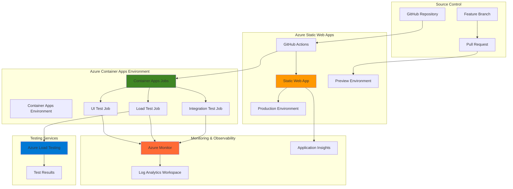

# Comprehensive Static App Testing Workflows with Container Jobs

## Problem

Development teams struggle with implementing comprehensive CI/CD pipelines that include automated testing for static web applications. Traditional approaches often lack integration between deployment environments and testing infrastructure, leading to delayed feedback loops and unreliable releases. Teams need a solution that automatically deploys static web applications while simultaneously running containerized testing jobs, including load testing and performance monitoring, to ensure application quality before production deployment.

## Solution

This solution leverages Azure Static Web Apps for seamless static application deployment with built-in CI/CD capabilities, combined with Azure Container Apps Jobs for running automated testing workflows. The architecture includes Azure Load Testing for performance validation and Azure Monitor for comprehensive observability, creating a unified testing pipeline that provides immediate feedback on application health and performance.

## Architecture Diagram



## Prerequisites

1. Azure subscription with appropriate permissions to create Static Web Apps, Container Apps, and Load Testing resources
2. GitHub account with repository access for source control integration
3. Azure CLI v2.45.0 or higher installed and configured
4. Docker Desktop or compatible container runtime for local testing
5. Basic knowledge of static web development, containerization, and CI/CD concepts
6. Estimated cost: $20-50 per month for development/testing workloads

> **Note**: Azure Container Apps Jobs and Azure Load Testing are available in most Azure regions. Verify service availability in your preferred region before deployment.

## Preparation

```bash
# Set environment variables for Azure resources
export RESOURCE_GROUP="rg-cicd-testing-${RANDOM_SUFFIX}"
export LOCATION="eastus"
export SUBSCRIPTION_ID=$(az account show --query id --output tsv)

# Generate unique suffix for resource names
RANDOM_SUFFIX=$(openssl rand -hex 3)

# Static Web Apps variables
export STATIC_WEB_APP_NAME="swa-cicd-demo-${RANDOM_SUFFIX}"
export GITHUB_REPO_URL="https://github.com/yourusername/your-repo"
export GITHUB_BRANCH="main"

# Container Apps variables
export CONTAINER_APPS_ENV="cae-testing-${RANDOM_SUFFIX}"
export CONTAINER_REGISTRY="acr${RANDOM_SUFFIX}"
export TEST_JOB_NAME="test-runner-job"
export LOAD_TEST_JOB_NAME="load-test-job"

# Load Testing variables
export LOAD_TEST_RESOURCE="alt-cicd-${RANDOM_SUFFIX}"

# Monitoring variables
export LOG_ANALYTICS_WORKSPACE="law-cicd-${RANDOM_SUFFIX}"
export APPLICATION_INSIGHTS="ai-cicd-${RANDOM_SUFFIX}"

# Create resource group
az group create \
    --name ${RESOURCE_GROUP} \
    --location ${LOCATION} \
    --tags purpose=cicd-testing environment=demo

echo "✅ Resource group created: ${RESOURCE_GROUP}"

# Create Log Analytics workspace for monitoring
az monitor log-analytics workspace create \
    --resource-group ${RESOURCE_GROUP} \
    --workspace-name ${LOG_ANALYTICS_WORKSPACE} \
    --location ${LOCATION}

echo "✅ Log Analytics workspace created: ${LOG_ANALYTICS_WORKSPACE}"

# Get workspace ID for later use
WORKSPACE_ID=$(az monitor log-analytics workspace show \
    --resource-group ${RESOURCE_GROUP} \
    --workspace-name ${LOG_ANALYTICS_WORKSPACE} \
    --query customerId --output tsv)

echo "✅ Workspace ID: ${WORKSPACE_ID}"
```

## Steps

1. **Create Azure Container Registry for Test Images**:

   Azure Container Registry provides a secure, private Docker registry for storing containerized test applications and testing tools. This centralized registry ensures consistent test environments across all pipeline stages while maintaining security through Azure AD integration and role-based access control.

   ```bash
   # Create Azure Container Registry
   az acr create \
       --resource-group ${RESOURCE_GROUP} \
       --name ${CONTAINER_REGISTRY} \
       --sku Basic \
       --admin-enabled true \
       --location ${LOCATION}
   
   # Get ACR login server
   ACR_LOGIN_SERVER=$(az acr show \
       --resource-group ${RESOURCE_GROUP} \
       --name ${CONTAINER_REGISTRY} \
       --query loginServer --output tsv)
   
   echo "✅ Container Registry created: ${ACR_LOGIN_SERVER}"
   ```

   The Container Registry is now ready to store your test container images. This registry will serve as the source for all Container Apps Jobs, ensuring consistent and secure access to testing tools and applications.

2. **Create Container Apps Environment**:

   Azure Container Apps Environment provides a secure, managed boundary for running containerized workloads. This environment includes built-in networking, scaling, and observability features that are essential for running reliable testing jobs. The environment integrates with Log Analytics for comprehensive monitoring and troubleshooting capabilities.

   ```bash
   # Create Container Apps Environment
   az containerapp env create \
       --resource-group ${RESOURCE_GROUP} \
       --name ${CONTAINER_APPS_ENV} \
       --location ${LOCATION} \
       --logs-workspace-id ${WORKSPACE_ID}
   
   # Verify environment creation
   az containerapp env show \
       --resource-group ${RESOURCE_GROUP} \
       --name ${CONTAINER_APPS_ENV} \
       --query provisioningState --output tsv
   
   echo "✅ Container Apps Environment created: ${CONTAINER_APPS_ENV}"
   ```

   The Container Apps Environment is now configured with integrated logging and monitoring. This foundation enables secure, scalable execution of testing jobs with comprehensive observability across all containerized workloads.

3. **Create Azure Static Web App**:

   Azure Static Web Apps provides a streamlined deployment experience for static web applications with built-in CI/CD capabilities through GitHub Actions. This service automatically builds and deploys your application while providing preview environments for pull requests, enabling comprehensive testing workflows before production deployment.

   ```bash
   # Create Static Web App (requires GitHub repository)
   az staticwebapp create \
       --resource-group ${RESOURCE_GROUP} \
       --name ${STATIC_WEB_APP_NAME} \
       --source ${GITHUB_REPO_URL} \
       --branch ${GITHUB_BRANCH} \
       --app-location "/" \
       --output-location "dist" \
       --location ${LOCATION}
   
   # Get Static Web App URL
   STATIC_WEB_APP_URL=$(az staticwebapp show \
       --resource-group ${RESOURCE_GROUP} \
       --name ${STATIC_WEB_APP_NAME} \
       --query defaultHostname --output tsv)
   
   echo "✅ Static Web App created: https://${STATIC_WEB_APP_URL}"
   ```

   The Static Web App is now configured with automated GitHub Actions workflows for CI/CD. This setup provides staging environments for pull requests and automatic deployment to production, forming the foundation for comprehensive testing integration.

4. **Create Application Insights for Monitoring**:

   Application Insights provides comprehensive application performance monitoring and telemetry collection for both your static web application and testing infrastructure. This service enables real-time monitoring, alerting, and debugging capabilities essential for maintaining application quality throughout the CI/CD pipeline.

   ```bash
   # Create Application Insights
   az monitor app-insights component create \
       --resource-group ${RESOURCE_GROUP} \
       --app ${APPLICATION_INSIGHTS} \
       --location ${LOCATION} \
       --workspace ${LOG_ANALYTICS_WORKSPACE}
   
   # Get Application Insights instrumentation key
   INSTRUMENTATION_KEY=$(az monitor app-insights component show \
       --resource-group ${RESOURCE_GROUP} \
       --app ${APPLICATION_INSIGHTS} \
       --query instrumentationKey --output tsv)
   
   echo "✅ Application Insights created with key: ${INSTRUMENTATION_KEY}"
   ```

   Application Insights is now integrated with your Log Analytics workspace, providing centralized monitoring for both your static web application and testing jobs. This integration enables comprehensive observability across your entire CI/CD pipeline.

5. **Create Azure Load Testing Resource**:

   Azure Load Testing provides cloud-scale load testing capabilities that integrate seamlessly with your CI/CD pipeline. This managed service can simulate thousands of concurrent users to validate application performance and identify bottlenecks before production deployment, ensuring your application can handle expected traffic loads.

   ```bash
   # Create Azure Load Testing resource
   az load create \
       --resource-group ${RESOURCE_GROUP} \
       --name ${LOAD_TEST_RESOURCE} \
       --location ${LOCATION}
   
   # Verify load testing resource creation
   az load show \
       --resource-group ${RESOURCE_GROUP} \
       --name ${LOAD_TEST_RESOURCE} \
       --query provisioningState --output tsv
   
   echo "✅ Load Testing resource created: ${LOAD_TEST_RESOURCE}"
   ```

   The Load Testing resource is now ready to execute performance tests against your deployed static web application. This service provides detailed performance metrics and can be integrated with your Container Apps Jobs for automated performance validation.

6. **Create Integration Test Container Apps Job**:

   Container Apps Jobs provide serverless, event-driven execution for running automated tests. This job configuration enables running integration tests in isolated containers with automatic scaling and built-in retry mechanisms. The job can be triggered by deployment events or scheduled to run at regular intervals.

   ```bash
   # Create integration test job
   az containerapp job create \
       --resource-group ${RESOURCE_GROUP} \
       --name ${TEST_JOB_NAME} \
       --environment ${CONTAINER_APPS_ENV} \
       --image "mcr.microsoft.com/azure-cli:latest" \
       --trigger-type Manual \
       --replica-timeout 1800 \
       --replica-retry-limit 3 \
       --parallelism 1 \
       --replica-completion-count 1 \
       --command "/bin/bash" \
       --args "-c,echo 'Running integration tests...'; sleep 30; echo 'Tests completed successfully'"
   
   # Set environment variables for the test job
   az containerapp job update \
       --resource-group ${RESOURCE_GROUP} \
       --name ${TEST_JOB_NAME} \
       --set-env-vars \
           "STATIC_WEB_APP_URL=https://${STATIC_WEB_APP_URL}" \
           "INSTRUMENTATION_KEY=${INSTRUMENTATION_KEY}"
   
   echo "✅ Integration test job created: ${TEST_JOB_NAME}"
   ```

   The integration test job is now configured to run automated tests against your deployed static web application. This job provides isolated test execution with comprehensive logging and monitoring through Azure Monitor integration.

7. **Create Load Testing Container Apps Job**:

   This specialized Container Apps Job orchestrates performance testing using Azure Load Testing services. The job can execute load tests, collect performance metrics, and integrate results with your monitoring infrastructure. This automation ensures consistent performance validation across all deployments.

   ```bash
   # Create load testing job
   az containerapp job create \
       --resource-group ${RESOURCE_GROUP} \
       --name ${LOAD_TEST_JOB_NAME} \
       --environment ${CONTAINER_APPS_ENV} \
       --image "mcr.microsoft.com/azure-cli:latest" \
       --trigger-type Manual \
       --replica-timeout 3600 \
       --replica-retry-limit 2 \
       --parallelism 1 \
       --replica-completion-count 1 \
       --command "/bin/bash" \
       --args "-c,echo 'Starting load test...'; echo 'Load test configuration: Target URL https://${STATIC_WEB_APP_URL}'; sleep 60; echo 'Load test completed'"
   
   # Configure load test job environment
   az containerapp job update \
       --resource-group ${RESOURCE_GROUP} \
       --name ${LOAD_TEST_JOB_NAME} \
       --set-env-vars \
           "LOAD_TEST_RESOURCE=${LOAD_TEST_RESOURCE}" \
           "TARGET_URL=https://${STATIC_WEB_APP_URL}" \
           "RESOURCE_GROUP=${RESOURCE_GROUP}"
   
   echo "✅ Load testing job created: ${LOAD_TEST_JOB_NAME}"
   ```

   The load testing job is now configured to execute automated performance tests against your static web application. This job integrates with Azure Load Testing services to provide comprehensive performance validation as part of your CI/CD pipeline.

8. **Configure GitHub Actions Integration**:

   GitHub Actions integration enables automated triggering of Container Apps Jobs as part of your CI/CD pipeline. This configuration ensures that testing jobs execute automatically when code changes are deployed, providing immediate feedback on application quality and performance.

   ```bash
   # Get Static Web App deployment token for GitHub Actions
   DEPLOYMENT_TOKEN=$(az staticwebapp secrets list \
       --resource-group ${RESOURCE_GROUP} \
       --name ${STATIC_WEB_APP_NAME} \
       --query properties.apiKey --output tsv)
   
   # Create service principal for Container Apps Jobs access
   SP_JSON=$(az ad sp create-for-rbac \
       --name "sp-${STATIC_WEB_APP_NAME}-testing" \
       --role contributor \
       --scopes "/subscriptions/${SUBSCRIPTION_ID}/resourceGroups/${RESOURCE_GROUP}" \
       --sdk-auth)
   
   echo "✅ GitHub Actions integration configured"
   echo "Add the following secrets to your GitHub repository:"
   echo "AZURE_CREDENTIALS: ${SP_JSON}"
   echo "DEPLOYMENT_TOKEN: ${DEPLOYMENT_TOKEN}"
   ```

   The GitHub Actions integration is now configured with the necessary credentials and permissions. These credentials enable your CI/CD pipeline to trigger Container Apps Jobs automatically when deployments occur.

## Validation & Testing

1. **Verify Static Web App Deployment**:

   ```bash
   # Check Static Web App status
   az staticwebapp show \
       --resource-group ${RESOURCE_GROUP} \
       --name ${STATIC_WEB_APP_NAME} \
       --query "provisioningState" --output tsv
   
   # Test web app accessibility
   curl -I https://${STATIC_WEB_APP_URL}
   ```

   Expected output: HTTP/1.1 200 OK response indicating successful deployment

2. **Test Container Apps Jobs Execution**:

   ```bash
   # Start integration test job
   az containerapp job start \
       --resource-group ${RESOURCE_GROUP} \
       --name ${TEST_JOB_NAME}
   
   # Monitor job execution
   az containerapp job execution list \
       --resource-group ${RESOURCE_GROUP} \
       --name ${TEST_JOB_NAME} \
       --output table
   ```

   Expected output: Job execution status showing "Succeeded" state

3. **Validate Load Testing Integration**:

   ```bash
   # Start load testing job
   az containerapp job start \
       --resource-group ${RESOURCE_GROUP} \
       --name ${LOAD_TEST_JOB_NAME}
   
   # Check load testing resource
   az load test list \
       --resource-group ${RESOURCE_GROUP} \
       --load-test-resource ${LOAD_TEST_RESOURCE} \
       --output table
   ```

   Expected output: Active load testing resource ready for test execution

4. **Verify Monitoring Integration**:

   ```bash
   # Check Application Insights data
   az monitor app-insights query \
       --resource-group ${RESOURCE_GROUP} \
       --app ${APPLICATION_INSIGHTS} \
       --analytics-query "requests | limit 10" \
       --output table
   
   # Review Container Apps logs
   az containerapp logs show \
       --resource-group ${RESOURCE_GROUP} \
       --name ${TEST_JOB_NAME} \
       --follow
   ```

   Expected output: Telemetry data and log entries from your testing jobs

## Cleanup

1. **Remove Container Apps Jobs and Environment**:

   ```bash
   # Delete Container Apps Jobs
   az containerapp job delete \
       --resource-group ${RESOURCE_GROUP} \
       --name ${TEST_JOB_NAME} \
       --yes
   
   az containerapp job delete \
       --resource-group ${RESOURCE_GROUP} \
       --name ${LOAD_TEST_JOB_NAME} \
       --yes
   
   # Delete Container Apps Environment
   az containerapp env delete \
       --resource-group ${RESOURCE_GROUP} \
       --name ${CONTAINER_APPS_ENV} \
       --yes
   
   echo "✅ Container Apps resources deleted"
   ```

2. **Remove Static Web App**:

   ```bash
   # Delete Static Web App
   az staticwebapp delete \
       --resource-group ${RESOURCE_GROUP} \
       --name ${STATIC_WEB_APP_NAME} \
       --yes
   
   echo "✅ Static Web App deleted"
   ```

3. **Remove Load Testing and Monitoring Resources**:

   ```bash
   # Delete Load Testing resource
   az load delete \
       --resource-group ${RESOURCE_GROUP} \
       --name ${LOAD_TEST_RESOURCE} \
       --yes
   
   # Delete Application Insights
   az monitor app-insights component delete \
       --resource-group ${RESOURCE_GROUP} \
       --app ${APPLICATION_INSIGHTS}
   
   # Delete Log Analytics workspace
   az monitor log-analytics workspace delete \
       --resource-group ${RESOURCE_GROUP} \
       --workspace-name ${LOG_ANALYTICS_WORKSPACE} \
       --yes
   
   echo "✅ Monitoring resources deleted"
   ```

4. **Remove Container Registry and Resource Group**:

   ```bash
   # Delete Container Registry
   az acr delete \
       --resource-group ${RESOURCE_GROUP} \
       --name ${CONTAINER_REGISTRY} \
       --yes
   
   # Delete resource group and all remaining resources
   az group delete \
       --name ${RESOURCE_GROUP} \
       --yes \
       --no-wait
   
   echo "✅ All resources deleted"
   ```

## Discussion

Azure Static Web Apps combined with Azure Container Apps Jobs creates a powerful CI/CD testing infrastructure that addresses the challenges of modern web application deployment. This architecture provides automated deployment with integrated testing capabilities, ensuring application quality through comprehensive validation workflows. The solution leverages Azure's managed services to eliminate infrastructure management overhead while providing enterprise-grade security and scalability. For detailed guidance on Static Web Apps deployment patterns, see the [Azure Static Web Apps documentation](https://docs.microsoft.com/en-us/azure/static-web-apps/).

The Container Apps Jobs component enables flexible, serverless testing execution with built-in scaling and retry mechanisms. This approach supports various testing scenarios, from unit and integration tests to complex load testing workflows. The event-driven nature of Container Apps Jobs allows for efficient resource utilization, running tests only when needed and automatically scaling based on workload demands. For comprehensive testing strategies, review the [Azure Container Apps Jobs documentation](https://docs.microsoft.com/en-us/azure/container-apps/jobs).

Azure Load Testing integration provides cloud-scale performance validation capabilities that seamlessly integrate with your CI/CD pipeline. This service can simulate realistic user loads and identify performance bottlenecks before they impact production users. The integration with Azure Monitor and Application Insights provides comprehensive observability across your entire testing infrastructure, enabling proactive issue detection and resolution. For load testing best practices, consult the [Azure Load Testing documentation](https://docs.microsoft.com/en-us/azure/load-testing/).

From a cost perspective, this architecture optimizes resource utilization through consumption-based pricing models. Static Web Apps includes generous free tiers for development workloads, while Container Apps Jobs only charge for actual execution time. The combination reduces operational costs while maintaining high-quality testing standards. For cost optimization strategies, review the [Azure Well-Architected Framework](https://docs.microsoft.com/en-us/azure/architecture/framework/cost/) guidance on cost management.

> **Tip**: Use GitHub Actions environments and protection rules to implement approval workflows for production deployments. This ensures that all automated tests pass before code reaches production environments, maintaining high-quality standards while enabling rapid development cycles.

## Challenge

Extend this solution by implementing these enhancements:

1. **Multi-Environment Testing Pipeline**: Configure separate Static Web App environments for development, staging, and production with environment-specific Container Apps Jobs that run different test suites based on deployment target.

2. **Advanced Load Testing Scenarios**: Implement sophisticated load testing patterns including spike testing, stress testing, and endurance testing using custom container images with specialized testing tools like JMeter or Artillery.

3. **Security and Compliance Testing**: Add Container Apps Jobs for automated security scanning, dependency vulnerability checks, and compliance validation using tools like OWASP ZAP and Azure Security Center recommendations.

4. **Cross-Browser Testing Integration**: Integrate Selenium-based cross-browser testing using Container Apps Jobs with different browser configurations, ensuring application compatibility across multiple browsers and devices.

5. **Performance Regression Detection**: Implement automated performance regression detection by comparing load test results across deployments and automatically failing builds that show performance degradation beyond defined thresholds.

## Infrastructure Code

*Infrastructure code will be generated after recipe approval.*