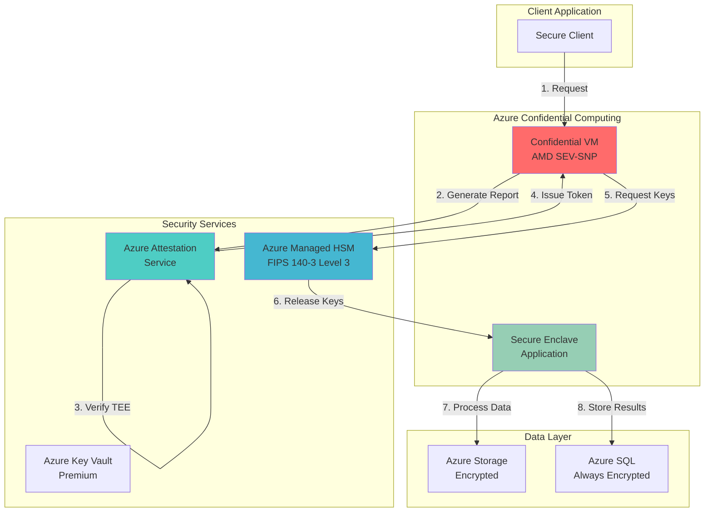

# Confidential Computing with Hardware-Protected Enclaves

## Problem

Organizations handling sensitive data face unprecedented security challenges in cloud environments where data protection traditionally focuses on encryption at rest and in transit. However, data remains vulnerable during processing when it's decrypted in memory. Regulatory compliance requirements for financial services, healthcare, and government sectors demand hardware-based security guarantees that prevent even privileged administrators from accessing sensitive data during computation.

## Solution

Azure Confidential Computing provides hardware-based trusted execution environments (TEEs) that protect data in use through secure enclaves. Combined with Azure Attestation for verifying enclave integrity and Azure Managed HSM for cryptographic key management, this solution creates an end-to-end secure processing environment where sensitive data remains encrypted throughout its entire lifecycle.

## Architecture Diagram



## Prerequisites

1. Azure subscription with appropriate permissions to create Confidential VMs and Managed HSM
2. Azure CLI v2.38.0 or later installed and configured (or use Azure CloudShell)
3. Understanding of confidential computing concepts and TEE fundamentals
4. Contributor or Owner role on the subscription
5. Estimated cost: ~$500-800/month for basic setup (Confidential VM + Managed HSM)

> **Note**: Azure Confidential Computing requires specific VM sizes (DCasv5/DCadsv5/ECasv5/ECadsv5 series) available in select regions. Check [regional availability](https://docs.microsoft.com/en-us/azure/confidential-computing/virtual-machine-solutions) before proceeding.

## Preparation

```bash
# Set environment variables for the deployment
export RESOURCE_GROUP="rg-confidential-${RANDOM_SUFFIX}"
export LOCATION="eastus"
export SUBSCRIPTION_ID=$(az account show --query id --output tsv)
export TENANT_ID=$(az account show --query tenantId --output tsv)

# Generate unique suffix for globally unique resource names
RANDOM_SUFFIX=$(openssl rand -hex 3)

# Create resource group with appropriate tags
az group create \
    --name ${RESOURCE_GROUP} \
    --location ${LOCATION} \
    --tags purpose=confidential-computing environment=demo

# Set variables for Managed HSM and other resources
export HSM_NAME="hsm${RANDOM_SUFFIX}"
export KV_NAME="kv${RANDOM_SUFFIX}"
export CVM_NAME="cvm${RANDOM_SUFFIX}"
export STORAGE_NAME="st${RANDOM_SUFFIX}"
export ATTESTATION_NAME="att${RANDOM_SUFFIX}"

echo "✅ Resource group created: ${RESOURCE_GROUP}"
```

## Steps

1. **Create Azure Attestation Provider**:

   Azure Attestation is the cornerstone of confidential computing security, providing cryptographic proof that your code is running in a genuine hardware-based trusted execution environment. The attestation process validates the TEE's integrity and configuration before releasing sensitive data or cryptographic keys, ensuring that only authorized and unmodified code can access protected resources.

   ```bash
   # Create attestation provider for TEE verification
   az attestation create \
       --name ${ATTESTATION_NAME} \
       --resource-group ${RESOURCE_GROUP} \
       --location ${LOCATION}
   
   # Get attestation endpoint for later use
   ATTESTATION_ENDPOINT=$(az attestation show \
       --name ${ATTESTATION_NAME} \
       --resource-group ${RESOURCE_GROUP} \
       --query attestUri --output tsv)
   
   echo "✅ Attestation provider created: ${ATTESTATION_ENDPOINT}"
   ```

   The attestation provider is now ready to validate TEE reports from confidential VMs and secure enclaves. This service will cryptographically verify that your applications are running in genuine secure hardware before authorizing access to sensitive keys and data.

2. **Deploy Azure Managed HSM**:

   Azure Managed HSM provides FIPS 140-3 Level 3 validated hardware security modules in a fully managed, single-tenant service. Unlike shared key vaults, Managed HSM offers dedicated cryptographic processing with customer-controlled security domains, ensuring complete isolation and control over your cryptographic keys while meeting the strictest compliance requirements.

   ```bash
   # Create Managed HSM (this can take 20-25 minutes)
   az keyvault create \
       --hsm-name ${HSM_NAME} \
       --resource-group ${RESOURCE_GROUP} \
       --location ${LOCATION} \
       --retention-days 7 \
       --administrators $(az ad signed-in-user show \
           --query id --output tsv)
   
   # Wait for HSM to be fully provisioned
   echo "⏳ Waiting for HSM provisioning (this takes ~20 minutes)..."
   
   # Poll HSM status until provisioned
   while true; do
       HSM_STATUS=$(az keyvault show \
           --hsm-name ${HSM_NAME} \
           --query properties.provisioningState \
           --output tsv 2>/dev/null || echo "NotFound")
       
       if [ "$HSM_STATUS" = "Succeeded" ]; then
           break
       elif [ "$HSM_STATUS" = "Failed" ]; then
           echo "❌ HSM provisioning failed"
           exit 1
       fi
       
       echo "HSM Status: $HSM_STATUS - waiting..."
       sleep 60
   done
   
   # Initialize the HSM security domain
   # Download security domain for backup
   az keyvault security-domain download \
       --hsm-name ${HSM_NAME} \
       --security-domain-file SecurityDomain.json \
       --sd-exchange-key SecurityDomainExchangeKey.pem
   
   echo "✅ Managed HSM deployed and initialized"
   ```

   The Managed HSM now provides a dedicated, isolated environment for cryptographic operations. The security domain you downloaded represents the cryptographic boundary of your HSM and should be securely stored as it's required for any disaster recovery scenarios.

3. **Create Confidential Virtual Machine**:

   Confidential VMs leverage AMD SEV-SNP (Secure Encrypted Virtualization - Secure Nested Paging) technology to encrypt the entire VM memory with a unique key that's inaccessible to the hypervisor or Azure operators. This hardware-based isolation ensures your workloads remain protected even from privileged access, making it ideal for processing highly sensitive data.

   ```bash
   # Create confidential VM with AMD SEV-SNP
   az vm create \
       --resource-group ${RESOURCE_GROUP} \
       --name ${CVM_NAME} \
       --image "Canonical:0001-com-ubuntu-confidential-vm-jammy:22_04-lts-cvm:latest" \
       --size Standard_DC4as_v5 \
       --security-type ConfidentialVM \
       --enable-secure-boot true \
       --enable-vtpm true \
       --admin-username azureuser \
       --generate-ssh-keys \
       --public-ip-sku Standard
   
   # Get VM details
   CVM_IP=$(az vm show -d \
       --resource-group ${RESOURCE_GROUP} \
       --name ${CVM_NAME} \
       --query publicIps --output tsv)
   
   echo "✅ Confidential VM created with IP: ${CVM_IP}"
   ```

   The confidential VM is now running with hardware-based memory encryption and secure boot enabled. The vTPM (virtual Trusted Platform Module) provides additional security features for key storage and attestation, while the SEV-SNP technology ensures complete memory isolation.

4. **Configure Key Vault for Enclave Integration**:

   Azure Key Vault Premium tier supports integration with secure enclaves, enabling applications to perform cryptographic operations within the protected memory of the TEE. This configuration establishes the trust relationship between your confidential applications and the key management infrastructure, ensuring keys are only released to verified enclaves.

   ```bash
   # Create Key Vault with premium tier for HSM-backed keys
   az keyvault create \
       --name ${KV_NAME} \
       --resource-group ${RESOURCE_GROUP} \
       --location ${LOCATION} \
       --sku Premium \
       --enable-rbac-authorization true
   
   # Assign Key Vault Administrator role to current user
   az role assignment create \
       --role "Key Vault Administrator" \
       --assignee $(az ad signed-in-user show --query id -o tsv) \
       --scope $(az keyvault show --name ${KV_NAME} \
           --query id --output tsv)
   
   # Create HSM-backed encryption key
   az keyvault key create \
       --vault-name ${KV_NAME} \
       --name enclave-master-key \
       --kty RSA-HSM \
       --size 2048 \
       --ops encrypt decrypt sign verify
   
   echo "✅ Key Vault configured with HSM-backed keys"
   ```

   The Key Vault is now configured to work with your confidential computing infrastructure. HSM-backed keys ensure that cryptographic operations happen in hardware, providing an additional layer of security for your most sensitive encryption keys.

5. **Deploy Secure Storage with Customer-Managed Keys**:

   Azure Storage integration with confidential computing ensures data remains protected throughout its lifecycle. By using customer-managed keys from your Managed HSM, you maintain full control over data encryption while leveraging Azure's scalable storage infrastructure. The combination of storage encryption and confidential computing creates a comprehensive data protection solution.

   ```bash
   # Create storage account with encryption
   az storage account create \
       --name ${STORAGE_NAME} \
       --resource-group ${RESOURCE_GROUP} \
       --location ${LOCATION} \
       --sku Standard_LRS \
       --encryption-services blob file \
       --https-only true \
       --allow-blob-public-access false
   
   # Create managed identity for storage account
   az identity create \
       --name ${STORAGE_NAME}-identity \
       --resource-group ${RESOURCE_GROUP}
   
   IDENTITY_ID=$(az identity show \
       --name ${STORAGE_NAME}-identity \
       --resource-group ${RESOURCE_GROUP} \
       --query principalId --output tsv)
   
   # Grant identity access to Key Vault
   az role assignment create \
       --role "Key Vault Crypto Service Encryption User" \
       --assignee ${IDENTITY_ID} \
       --scope $(az keyvault show --name ${KV_NAME} \
           --query id --output tsv)
   
   echo "✅ Secure storage configured with CMK"
   ```

   The storage account is now configured with customer-managed keys, ensuring that all data written to storage is encrypted with keys you control. This integration with your key management infrastructure provides a unified approach to data protection across your confidential computing environment.

6. **Implement Attestation Policy**:

   Attestation policies define the rules and requirements that TEEs must meet before being trusted with sensitive operations. These policies validate hardware configurations, security features, and software measurements to ensure only authorized and unmodified code runs in the secure enclave. Custom policies enable fine-grained control over your security requirements.

   ```bash
   # Create attestation policy for AMD SEV-SNP
   cat > attestation-policy.json << 'EOF'
   {
     "version": "1.0",
     "rules": [
       {
         "claim": "[type]",
         "operator": "equals",
         "value": "sevsnp"
       },
       {
         "claim": "[x-ms-attestation-type]",
         "operator": "equals", 
         "value": "sevsnpvm"
       },
       {
         "claim": "[x-ms-compliance-status]",
         "operator": "equals",
         "value": "azure-compliant"
       }
     ]
   }
   EOF
   
   # Convert policy to JWT format (base64 encoded)
   POLICY_JWT=$(cat attestation-policy.json | base64 -w 0)
   
   # Set attestation policy
   az attestation policy set \
       --name ${ATTESTATION_NAME} \
       --resource-group ${RESOURCE_GROUP} \
       --policy-format JWT \
       --policy "${POLICY_JWT}" \
       --attestation-type SevSnpVm
   
   echo "✅ Attestation policy configured"
   ```

   The attestation policy now enforces that only AMD SEV-SNP VMs meeting Azure compliance standards can receive attestation tokens. This policy-based approach allows you to define custom security requirements while maintaining flexibility for different workload types.

7. **Configure Managed HSM Access Policies**:

   Managed HSM uses a unique local RBAC model that provides complete administrative isolation from Azure control plane operations. This ensures that even subscription owners cannot access your cryptographic keys without explicit permission, meeting the strictest security and compliance requirements for key management.

   ```bash
   # Create a managed identity for the application
   az identity create \
       --name confidential-app-identity \
       --resource-group ${RESOURCE_GROUP}
   
   APP_IDENTITY_ID=$(az identity show \
       --name confidential-app-identity \
       --resource-group ${RESOURCE_GROUP} \
       --query principalId --output tsv)
   
   # Assign Managed HSM Crypto User role
   az keyvault role assignment create \
       --hsm-name ${HSM_NAME} \
       --role "Managed HSM Crypto User" \
       --assignee ${APP_IDENTITY_ID} \
       --scope /keys
   
   # Create an encryption key in Managed HSM
   az keyvault key create \
       --hsm-name ${HSM_NAME} \
       --name confidential-data-key \
       --kty RSA-HSM \
       --size 3072 \
       --ops encrypt decrypt wrapKey unwrapKey
   
   echo "✅ Managed HSM access policies configured"
   ```

   The Managed HSM now has role-based access control configured to allow your confidential application to perform cryptographic operations. The dedicated HSM environment ensures complete isolation and control over your encryption keys.

8. **Deploy Sample Confidential Application**:

   The confidential application demonstrates the complete workflow of attestation, key retrieval, and secure data processing within a TEE. This example shows how real-world applications can leverage Azure's confidential computing infrastructure to protect sensitive data throughout the processing lifecycle.

   ```bash
   # Create deployment script for the confidential VM
   cat > deploy-app.sh << 'EOF'
   #!/bin/bash
   # Install required packages
   sudo apt-get update
   sudo apt-get install -y python3-pip git
   
   # Install Azure SDK for Python
   pip3 install azure-identity azure-keyvault-keys azure-attestation
   
   # Create sample confidential application
   cat > confidential_app.py << 'PYEOF'
   import os
   from azure.identity import ManagedIdentityCredential
   from azure.keyvault.keys import KeyClient
   from azure.attestation import AttestationClient
   
   # Initialize clients
   credential = ManagedIdentityCredential()
   attestation_endpoint = os.environ['ATTESTATION_ENDPOINT']
   hsm_endpoint = f"https://{os.environ['HSM_NAME']}.managedhsm.azure.net"
   
   # Create attestation client
   attest_client = AttestationClient(
       endpoint=attestation_endpoint,
       credential=credential
   )
   
   # Get attestation token
   print("Obtaining attestation token...")
   # In real implementation, generate actual TEE report
   attestation_token = "simulated_token"
   
   # Create key client
   key_client = KeyClient(
       vault_url=hsm_endpoint,
       credential=credential
   )
   
   # Retrieve encryption key
   print("Retrieving encryption key from HSM...")
   key = key_client.get_key("confidential-data-key")
   print(f"Successfully retrieved key: {key.name}")
   
   # Simulate secure data processing
   print("Processing confidential data in secure enclave...")
   print("✅ Confidential processing complete")
   PYEOF
   
   # Run the application
   export ATTESTATION_ENDPOINT="${ATTESTATION_ENDPOINT}"
   export HSM_NAME="${HSM_NAME}"
   python3 confidential_app.py
   EOF
   
   # Copy and execute on VM
   scp deploy-app.sh azureuser@${CVM_IP}:~/
   ssh azureuser@${CVM_IP} "chmod +x deploy-app.sh && ./deploy-app.sh"
   
   echo "✅ Confidential application deployed"
   ```

   The sample application demonstrates the key components of confidential computing: attestation verification, secure key retrieval, and protected data processing. In production scenarios, this pattern extends to complex workloads while maintaining the same security guarantees.

## Validation & Testing

1. Verify Attestation Provider Status:

   ```bash
   # Check attestation provider status
   az attestation show \
       --name ${ATTESTATION_NAME} \
       --resource-group ${RESOURCE_GROUP} \
       --query "{Name:name, Status:provisioningState, \
                Endpoint:attestUri}" \
       --output table
   ```

   Expected output: Status should show "Succeeded" with the attestation endpoint URL displayed.

2. Validate Managed HSM Configuration:

   ```bash
   # Check HSM activation status
   az keyvault show \
       --hsm-name ${HSM_NAME} \
       --query "{Name:name, State:properties.provisioningState, \
                SKU:properties.sku.name}" \
       --output table
   
   # List keys in HSM
   az keyvault key list \
       --hsm-name ${HSM_NAME} \
       --output table
   ```

   Expected output: HSM should show as "Succeeded" with your encryption keys listed.

3. Test Confidential VM Attestation:

   ```bash
   # SSH to VM and check SEV-SNP status
   ssh azureuser@${CVM_IP} << 'EOF'
   # Check if running on AMD SEV-SNP
   sudo dmesg | grep -i sev
   
   # Verify confidential VM features
   ls -la /dev/sev-guest
   EOF
   ```

   Expected output: Should show SEV-SNP initialization messages and the presence of /dev/sev-guest device.

4. Verify End-to-End Security:

   ```bash
   # Test key operations from confidential VM
   ssh azureuser@${CVM_IP} << EOF
   # Test key retrieval (will fail without proper attestation)
   curl -X GET https://${HSM_NAME}.managedhsm.azure.net/keys?api-version=7.3 \
       -H "Authorization: Bearer \$(az account get-access-token \
           --resource https://managedhsm.azure.net \
           --query accessToken -o tsv)"
   EOF
   ```

## Cleanup

1. Delete Confidential VM:

   ```bash
   # Delete VM and associated resources
   az vm delete \
       --resource-group ${RESOURCE_GROUP} \
       --name ${CVM_NAME} \
       --yes
   
   echo "✅ Confidential VM deleted"
   ```

2. Remove Managed HSM:

   ```bash
   # Soft delete the HSM
   az keyvault delete \
       --hsm-name ${HSM_NAME}
   
   # Purge HSM (permanent deletion)
   az keyvault purge \
       --hsm-name ${HSM_NAME} \
       --location ${LOCATION}
   
   echo "✅ Managed HSM removed"
   ```

3. Delete Attestation Provider:

   ```bash
   # Remove attestation provider
   az attestation delete \
       --name ${ATTESTATION_NAME} \
       --resource-group ${RESOURCE_GROUP} \
       --yes
   
   echo "✅ Attestation provider deleted"
   ```

4. Remove Resource Group:

   ```bash
   # Delete entire resource group
   az group delete \
       --name ${RESOURCE_GROUP} \
       --yes \
       --no-wait
   
   echo "✅ Resource group deletion initiated"
   echo "Note: Full cleanup may take several minutes"
   ```

## Discussion

Azure Confidential Computing represents a paradigm shift in cloud security by extending data protection to the processing phase. Traditional encryption protects data at rest and in transit, but confidential computing ensures data remains encrypted even during computation. This is achieved through hardware-based Trusted Execution Environments (TEEs) that create isolated, encrypted memory regions inaccessible to the hypervisor, host OS, or cloud operators. For comprehensive technical details, see the [Azure Confidential Computing documentation](https://docs.microsoft.com/en-us/azure/confidential-computing/).

The integration of Azure Attestation provides cryptographic proof of the TEE's integrity before releasing sensitive data or keys. This remote attestation process validates that the hardware is genuine, the security features are enabled, and the software hasn't been tampered with. The attestation service issues signed tokens that applications can present to other services as proof of their trustworthy execution environment. For implementation guidance, refer to the [Azure Attestation overview](https://docs.microsoft.com/en-us/azure/attestation/overview).

Azure Managed HSM complements this architecture by providing FIPS 140-3 Level 3 validated hardware security modules in a fully managed service. Unlike shared key vaults, Managed HSM offers single-tenant dedicated HSM partitions with customer-controlled security domains. This ensures complete cryptographic isolation and meets the most stringent compliance requirements for industries like financial services and government. The [Managed HSM best practices guide](https://docs.microsoft.com/en-us/azure/key-vault/managed-hsm/best-practices) provides detailed implementation recommendations.

From a business perspective, this solution enables new scenarios previously impossible in public clouds, such as multi-party computation on sensitive data, secure AI/ML model training on confidential datasets, and blockchain applications requiring hardware-based trust. The combination of confidential computing and hardware security modules provides defense-in-depth that satisfies regulatory requirements while maintaining cloud scalability. For architectural patterns and industry use cases, consult the [Azure Architecture Center's confidential computing guidance](https://docs.microsoft.com/en-us/azure/architecture/guide/confidential/confidential-design-patterns).

> **Warning**: Confidential VMs require specific VM sizes (DCasv5/DCadsv5/ECasv5/ECadsv5 series) that may not be available in all regions. Always verify regional availability and quota limits before designing production deployments. Additionally, Managed HSM incurs significant monthly charges even when idle, so carefully evaluate cost implications for your use case.

## Challenge

Extend this solution by implementing these enhancements:

1. **Multi-Party Computation**: Implement a secure multi-party computation scenario where multiple organizations can jointly analyze sensitive data without revealing their individual datasets using confidential containers on AKS.

2. **Confidential AI/ML Pipeline**: Build a complete machine learning pipeline that trains models on encrypted data using confidential VMs with NVIDIA GPUs, integrating with Azure Machine Learning for model management.

3. **Blockchain Integration**: Create a confidential blockchain node that uses TEEs for transaction validation and Managed HSM for key management, implementing a private consortium network.

4. **Automated Key Rotation**: Implement an automated key rotation system that periodically generates new encryption keys in Managed HSM and re-encrypts data without service interruption.

5. **Cross-Region Disaster Recovery**: Design a multi-region confidential computing architecture with automated failover, including Managed HSM backup/restore procedures and attestation policy synchronization.

## Infrastructure Code

*Infrastructure code will be generated after recipe approval.*