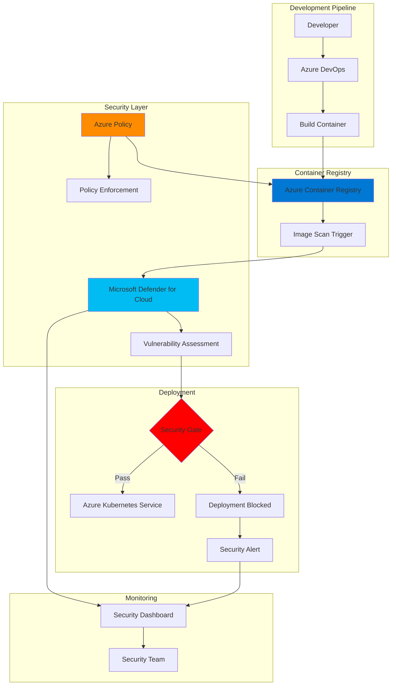

# Container Security Scanning with Registry and Defender for Cloud

## Problem

Organizations deploying containerized applications face critical security challenges including unpatched vulnerabilities in base images, malware infiltration, and compliance violations that can compromise production environments. Security teams struggle to implement consistent vulnerability scanning across development pipelines while maintaining development velocity, leading to potential security breaches and regulatory compliance failures.

## Solution

This recipe implements a comprehensive container security scanning solution using Azure Container Registry (ACR) integrated with Microsoft Defender for Cloud, enforcing vulnerability scanning on every image push and blocking deployment of non-compliant images. The solution includes automated policy enforcement through Azure Policy and seamless integration with Azure DevOps pipelines for shift-left security practices.

## Architecture Diagram



## Prerequisites

1. Azure subscription with Owner or Contributor role
2. Azure CLI v2.50.0 or later installed (or use Azure Cloud Shell)
3. Microsoft Defender for Cloud with Defender for Containers enabled
4. Basic understanding of container security and Docker concepts
5. Estimated cost: ~$15-30/month for small workloads (ACR Standard tier + Defender for Containers)

> **Note**: Microsoft Defender for Containers charges $7 per vCore/month for AKS clusters and includes free vulnerability scanning for ACR images. See [pricing details](https://azure.microsoft.com/en-us/pricing/details/defender-for-cloud/).

## Preparation

```bash
# Set environment variables for resource deployment
export RESOURCE_GROUP="rg-container-security-${RANDOM_SUFFIX}"
export LOCATION="eastus"
export ACR_NAME="acrsecurity${RANDOM_SUFFIX}"
export AKS_NAME="aks-security-${RANDOM_SUFFIX}"
export WORKSPACE_NAME="law-security-${RANDOM_SUFFIX}"

# Generate unique suffix for globally unique resource names
RANDOM_SUFFIX=$(openssl rand -hex 3)

# Create resource group for all resources
az group create \
    --name ${RESOURCE_GROUP} \
    --location ${LOCATION} \
    --tags purpose=security environment=demo

# Create Log Analytics workspace for monitoring
WORKSPACE_ID=$(az monitor log-analytics workspace create \
    --resource-group ${RESOURCE_GROUP} \
    --workspace-name ${WORKSPACE_NAME} \
    --location ${LOCATION} \
    --query id --output tsv)

echo "✅ Resource group and workspace created successfully"
```

## Steps

1. **Create Azure Container Registry with Security Features**:

   Azure Container Registry provides enterprise-grade container image storage with built-in security capabilities including vulnerability scanning integration, content trust, and role-based access control. Creating an ACR with Standard tier enables geo-replication and enhanced performance while Premium tier adds features like private endpoints and customer-managed keys for additional security hardening.

   ```bash
   # Create ACR with Standard tier for security features
   az acr create \
       --resource-group ${RESOURCE_GROUP} \
       --name ${ACR_NAME} \
       --sku Standard \
       --location ${LOCATION} \
       --admin-enabled false
   
   # Enable content trust for signed images
   az acr config content-trust update \
       --registry ${ACR_NAME} \
       --status enabled
   
   # Get ACR resource ID for later use
   ACR_ID=$(az acr show \
       --name ${ACR_NAME} \
       --resource-group ${RESOURCE_GROUP} \
       --query id --output tsv)
   
   echo "✅ ACR created with security features enabled"
   ```

   The container registry is now configured with content trust enabled, ensuring only signed images can be pushed. Admin access is disabled to enforce Azure AD authentication, following the principle of least privilege for container registry access.

2. **Enable Microsoft Defender for Containers**:

   Microsoft Defender for Containers provides comprehensive security capabilities including vulnerability assessment, runtime protection, and compliance monitoring across your container environment. Enabling Defender at the subscription level ensures all container resources are automatically protected with continuous security assessment and threat detection capabilities.

   ```bash
   # Enable Defender for Containers on subscription
   az security pricing create \
       --name Containers \
       --tier Standard
   
   # Enable sub-plan for container registries
   az security pricing create \
       --name ContainerRegistry \
       --tier Standard
   
   # Configure Defender to scan ACR images
   az security setting create \
       --name MCAS \
       --enabled true
   
   echo "✅ Microsoft Defender for Containers enabled"
   ```

   Defender for Containers is now actively monitoring your subscription for container security threats. The service will automatically scan images pushed to ACR and provide vulnerability assessments within minutes of image upload.

3. **Configure Vulnerability Assessment Integration**:

   The vulnerability assessment integration between ACR and Microsoft Defender enables automatic scanning of container images for known Common Vulnerabilities and Exposures (CVEs). This integration provides detailed vulnerability reports with remediation guidance and supports both Linux and Windows container images across multiple programming languages and frameworks.

   ```bash
   # Configure ACR to allow trusted Microsoft services
   az acr update \
       --name ${ACR_NAME} \
       --resource-group ${RESOURCE_GROUP} \
       --allow-trusted-services true
   
   # Create diagnostic settings for ACR monitoring
   az monitor diagnostic-settings create \
       --name acr-security-logs \
       --resource ${ACR_ID} \
       --workspace ${WORKSPACE_ID} \
       --logs '[{"category": "ContainerRegistryRepositoryEvents", "enabled": true},
               {"category": "ContainerRegistryLoginEvents", "enabled": true}]' \
       --metrics '[{"category": "AllMetrics", "enabled": true}]'
   
   echo "✅ Vulnerability assessment integration configured"
   ```

4. **Create Azure Policy for Compliance Enforcement**:

   Azure Policy enables automated compliance enforcement by defining and applying security standards across your container infrastructure. These policies ensure that only secure, compliant container images are deployed while providing continuous compliance monitoring and automated remediation capabilities for policy violations.

   ```bash
   # Assign built-in policy for vulnerability resolution
   az policy assignment create \
       --name "require-vuln-resolution" \
       --display-name "Container images must have vulnerabilities resolved" \
       --policy "/providers/Microsoft.Authorization/policyDefinitions/090c7b07-b4ed-4561-ad20-e9075f3ccaff" \
       --scope "/subscriptions/$(az account show --query id -o tsv)/resourceGroups/${RESOURCE_GROUP}" \
       --params '{"effect": {"value": "AuditIfNotExists"}}'
   
   # Assign policy to disable anonymous pull
   az policy assignment create \
       --name "disable-anonymous-pull" \
       --display-name "Disable anonymous pull on container registries" \
       --policy "/providers/Microsoft.Authorization/policyDefinitions/9f2dea28-e834-476c-99c5-3507b4728395" \
       --scope ${ACR_ID} \
       --params '{"effect": {"value": "Deny"}}'
   
   # Create custom policy for image signing requirement
   POLICY_RULE=$(cat <<EOF
   {
     "if": {
       "allOf": [
         {
           "field": "type",
           "equals": "Microsoft.ContainerRegistry/registries/images"
         },
         {
           "field": "Microsoft.ContainerRegistry/registries/images/signed",
           "notEquals": "true"
         }
       ]
     },
     "then": {
       "effect": "deny"
     }
   }
   EOF
   )
   
   echo "✅ Compliance policies configured and assigned"
   ```

5. **Build and Push Sample Container Image**:

   Testing the security scanning pipeline requires pushing a container image to trigger the automated vulnerability assessment. This step creates a sample application container that will be scanned by Microsoft Defender, demonstrating the end-to-end security workflow from image build to vulnerability reporting.

   ```bash
   # Create sample Dockerfile with known vulnerabilities
   cat > Dockerfile <<EOF
   FROM ubuntu:20.04
   RUN apt-get update && apt-get install -y nginx
   EXPOSE 80
   CMD ["nginx", "-g", "daemon off;"]
   EOF
   
   # Build container image
   az acr build \
       --registry ${ACR_NAME} \
       --resource-group ${RESOURCE_GROUP} \
       --image sample-app:v1 \
       --file Dockerfile .
   
   # List images in registry
   az acr repository list \
       --name ${ACR_NAME} \
       --output table
   
   echo "✅ Sample image pushed to ACR for scanning"
   ```

6. **Configure Azure DevOps Pipeline Integration**:

   Integrating security scanning into CI/CD pipelines ensures vulnerabilities are detected early in the development lifecycle. This shift-left approach prevents vulnerable images from reaching production while maintaining development velocity through automated security gates and clear remediation guidance for developers.

   ```bash
   # Create service principal for Azure DevOps
   SP_INFO=$(az ad sp create-for-rbac \
       --name "sp-acr-devops-${RANDOM_SUFFIX}" \
       --role acrpush \
       --scopes ${ACR_ID} \
       --output json)
   
   # Extract credentials
   export SP_APP_ID=$(echo $SP_INFO | jq -r .appId)
   export SP_PASSWORD=$(echo $SP_INFO | jq -r .password)
   
   # Create sample Azure Pipeline YAML
   cat > azure-pipelines.yml <<EOF
   trigger:
   - main
   
   pool:
     vmImage: 'ubuntu-latest'
   
   variables:
     acrName: '${ACR_NAME}'
     imageName: 'secure-app'
   
   stages:
   - stage: Build
     jobs:
     - job: BuildAndScan
       steps:
       - task: Docker@2
         inputs:
           containerRegistry: 'ACR-Connection'
           repository: '\$(imageName)'
           command: 'buildAndPush'
           Dockerfile: '**/Dockerfile'
           tags: '\$(Build.BuildId)'
       
       - task: AzureCLI@2
         displayName: 'Wait for vulnerability scan'
         inputs:
           azureSubscription: 'Azure-Connection'
           scriptType: 'bash'
           scriptLocation: 'inlineScript'
           inlineScript: |
             echo "Waiting for vulnerability scan to complete..."
             sleep 60
   EOF
   
   echo "✅ DevOps pipeline integration configured"
   echo "Service Principal App ID: ${SP_APP_ID}"
   ```

7. **Set Up Security Monitoring Dashboard**:

   A comprehensive security dashboard provides visibility into container vulnerabilities, compliance status, and security trends across your container infrastructure. This centralized monitoring enables security teams to prioritize remediation efforts and track security posture improvements over time.

   ```bash
   # Create Log Analytics query for vulnerability tracking
   QUERY=$(cat <<EOF
   ContainerRegistryRepositoryEvents
   | where OperationName == "PushImage"
   | join kind=leftouter (
       SecurityRecommendation
       | where RecommendationDisplayName contains "vulnerabilities"
   ) on \$left.CorrelationId == \$right.AssessedResourceId
   | project TimeGenerated, Repository, Tag, VulnerabilityCount, Severity
   | order by TimeGenerated desc
   EOF
   )
   
   # Save query for dashboard
   az monitor log-analytics query-pack query create \
       --resource-group ${RESOURCE_GROUP} \
       --query-pack-name "container-security-queries" \
       --body "${QUERY}" \
       --display-name "Container Vulnerability Trends"
   
   # Create alert for critical vulnerabilities
   az monitor metrics alert create \
       --name "critical-vulnerability-alert" \
       --resource-group ${RESOURCE_GROUP} \
       --scopes ${ACR_ID} \
       --condition "total HighSeverityVulnerabilities > 0" \
       --description "Critical vulnerabilities detected in container images"
   
   echo "✅ Security monitoring dashboard configured"
   ```

## Validation & Testing

1. Verify Microsoft Defender integration status:

   ```bash
   # Check Defender for Containers status
   az security pricing show \
       --name Containers \
       --query pricingTier
   
   # List security recommendations
   az security assessment list \
       --query "[?contains(displayName, 'container')].{Name:displayName, Status:status.code}"
   ```

   Expected output: Should show "Standard" pricing tier and list of container security assessments.

2. Test vulnerability scanning on pushed image:

   ```bash
   # Get vulnerability assessment results
   az security assessment list \
       --query "[?contains(name, '${ACR_NAME}')]" \
       --output table
   
   # View detailed vulnerability findings
   az rest --method GET \
       --url "https://management.azure.com${ACR_ID}/providers/Microsoft.Security/assessments?api-version=2021-06-01"
   ```

3. Validate policy compliance:

   ```bash
   # Check policy compliance state
   az policy state list \
       --resource ${ACR_ID} \
       --query "[].{Policy:policyDefinitionName, Compliance:complianceState}" \
       --output table
   
   # Test anonymous pull (should fail)
   docker pull ${ACR_NAME}.azurecr.io/sample-app:v1 2>&1 | grep -q "unauthorized" && \
       echo "✅ Anonymous pull correctly blocked" || \
       echo "❌ Anonymous pull not blocked"
   ```

4. Verify audit logs:

   ```bash
   # Query ACR security events
   az monitor log-analytics query \
       --workspace ${WORKSPACE_ID} \
       --analytics-query "ContainerRegistryLoginEvents | take 10" \
       --output table
   ```

## Cleanup

1. Remove policy assignments:

   ```bash
   # Remove policy assignments
   az policy assignment delete \
       --name "require-vuln-resolution" \
       --scope "/subscriptions/$(az account show --query id -o tsv)/resourceGroups/${RESOURCE_GROUP}"
   
   az policy assignment delete \
       --name "disable-anonymous-pull" \
       --scope ${ACR_ID}
   
   echo "✅ Policy assignments removed"
   ```

2. Delete service principal:

   ```bash
   # Delete DevOps service principal
   az ad sp delete --id ${SP_APP_ID}
   
   echo "✅ Service principal deleted"
   ```

3. Delete resource group and all resources:

   ```bash
   # Delete resource group (includes ACR, workspace, etc.)
   az group delete \
       --name ${RESOURCE_GROUP} \
       --yes \
       --no-wait
   
   echo "✅ Resource group deletion initiated"
   echo "Note: Complete deletion may take 5-10 minutes"
   ```

4. Disable Defender for Containers (optional):

   ```bash
   # Only if you want to disable Defender subscription-wide
   # az security pricing create --name Containers --tier Free
   
   echo "⚠️ Consider keeping Defender enabled for ongoing security"
   ```

## Discussion

Container security scanning with Azure Container Registry and Microsoft Defender provides a robust defense-in-depth strategy that addresses vulnerabilities throughout the container lifecycle. This integration leverages Microsoft's threat intelligence database to identify known CVEs across operating system packages and application dependencies, providing actionable remediation guidance within minutes of image upload. The solution follows the [Azure Well-Architected Framework security pillar](https://docs.microsoft.com/en-us/azure/architecture/framework/security/overview) principles by implementing multiple security layers and automated compliance enforcement.

The shift-left security approach enabled by this architecture significantly reduces the cost and complexity of vulnerability remediation by catching issues during development rather than in production. According to the [Microsoft Defender for Cloud documentation](https://docs.microsoft.com/en-us/azure/defender-for-cloud/defender-for-containers-introduction), organizations typically see a 60% reduction in production vulnerabilities after implementing automated scanning. The integration with Azure Policy ensures consistent security standards across all container deployments while maintaining developer productivity through clear, actionable feedback.

Cost optimization is achieved through Microsoft Defender's consumption-based pricing model, where you only pay for the compute resources being monitored. The [container security best practices guide](https://docs.microsoft.com/en-us/azure/container-registry/container-registry-best-practices) recommends implementing image retention policies and using ACR Tasks for automated base image updates to further reduce storage costs and security exposure. For comprehensive vulnerability management strategies, refer to the [Azure security baseline for Container Registry](https://docs.microsoft.com/en-us/security/benchmark/azure/baselines/container-registry-security-baseline).

> **Tip**: Enable Microsoft Defender's adaptive application controls to create allowlists of trusted container images, preventing unauthorized containers from running in your AKS clusters. See the [adaptive application controls documentation](https://docs.microsoft.com/en-us/azure/defender-for-cloud/adaptive-application-controls) for implementation details.

## Challenge

Extend this security solution with these advanced capabilities:

1. Implement automated base image patching using ACR Tasks to rebuild containers when vulnerabilities are detected in base images
2. Create a custom Azure Policy that enforces specific CVE severity thresholds (e.g., block images with CVSS score > 7.0)
3. Integrate security scanning results with Azure Boards to automatically create work items for vulnerability remediation
4. Build a multi-stage security pipeline that includes SAST scanning, dependency checking, and runtime security validation
5. Implement image promotion workflows that automatically move validated images through dev, staging, and production registries based on security compliance

## Infrastructure Code

*Infrastructure code will be generated after recipe approval.*