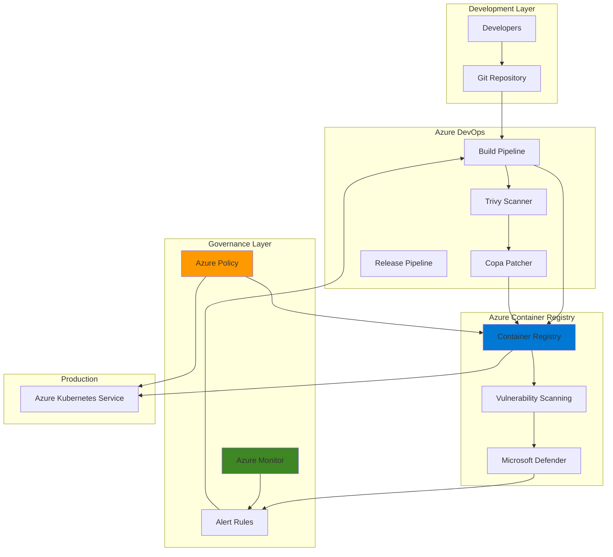

# Container Vulnerability Remediation Pipeline with DevSecOps

## Problem

Modern containerized applications face an increasing risk from security vulnerabilities in base images and dependencies. Development teams struggle to maintain secure container images across multiple repositories while vulnerabilities are discovered and exploited at an accelerating pace. Manual vulnerability scanning and remediation processes create significant delays between vulnerability discovery and patch deployment, leaving production workloads exposed to potential exploits.

## Solution

Build an automated vulnerability remediation pipeline using Azure Container Registry's integrated scanning capabilities, Azure DevOps for automated patching workflows, Azure Policy for enforcement, and Azure Monitor for comprehensive tracking. This solution automatically detects vulnerabilities in container images, triggers remediation pipelines that patch base images, rebuilds affected containers, and ensures only compliant images are deployed to production environments.

## Architecture Diagram



## Prerequisites

1. Azure subscription with Owner or Contributor access
2. Azure CLI v2.50.0 or later installed and configured (or use Azure Cloud Shell)
3. Azure DevOps organization with project creation permissions
4. Basic knowledge of container security and CI/CD pipelines
5. Docker CLI installed for local image testing
6. Estimated cost: ~$150/month (ACR Premium tier + Azure DevOps agents)

> **Note**: This recipe requires Azure Container Registry Premium tier for advanced vulnerability scanning features. Standard tier provides basic scanning but lacks automated remediation triggers.

## Preparation

```bash
# Set environment variables for Azure resources
export RESOURCE_GROUP="rg-container-security"
export LOCATION="eastus"
export ACR_NAME="acrcontainersec"
export KEYVAULT_NAME="kv-containersec"
export WORKSPACE_NAME="law-container-security"

# Generate unique suffix for globally unique resource names
RANDOM_SUFFIX=$(openssl rand -hex 3)
export ACR_NAME="${ACR_NAME}${RANDOM_SUFFIX}"
export KEYVAULT_NAME="${KEYVAULT_NAME}-${RANDOM_SUFFIX}"

# Create resource group for all resources
az group create \
    --name ${RESOURCE_GROUP} \
    --location ${LOCATION} \
    --tags purpose=security environment=demo

# Create Log Analytics workspace for monitoring
export WORKSPACE_ID=$(az monitor log-analytics workspace create \
    --resource-group ${RESOURCE_GROUP} \
    --workspace-name ${WORKSPACE_NAME} \
    --location ${LOCATION} \
    --query id --output tsv)

echo "✅ Resource group and monitoring workspace created"
```

## Steps

1. **Create Azure Container Registry with Advanced Security Features**:

   Azure Container Registry Premium tier provides enterprise-grade security features including vulnerability scanning powered by Microsoft Defender for Cloud, content trust for image signing, and private endpoint support. The integrated vulnerability scanning automatically analyzes pushed images for known CVEs and security misconfigurations, providing the foundation for our automated remediation pipeline.

   ```bash
   # Create Azure Container Registry with Premium tier
   az acr create \
       --resource-group ${RESOURCE_GROUP} \
       --name ${ACR_NAME} \
       --sku Premium \
       --location ${LOCATION} \
       --workspace ${WORKSPACE_ID}
   
   # Enable Microsoft Defender for container registries
   az security auto-provisioning-setting update \
       --auto-provision "On" \
       --name "default"
   
   # Enable content trust for signed images
   az acr config content-trust update \
       --name ${ACR_NAME} \
       --status enabled
   
   echo "✅ Container Registry created with security features enabled"
   ```

   The Container Registry is now configured with comprehensive security scanning that triggers automatically when images are pushed. This creates the security foundation needed for automated vulnerability detection and remediation workflows.

2. **Configure Azure Key Vault for Secure Credential Storage**:

   Azure Key Vault provides centralized, secure storage for service principal credentials, API tokens, and connection strings required by the remediation pipeline. This eliminates hardcoded secrets in pipeline configurations and ensures compliance with security best practices for credential management in CI/CD workflows.

   ```bash
   # Create Key Vault for storing secrets
   az keyvault create \
       --name ${KEYVAULT_NAME} \
       --resource-group ${RESOURCE_GROUP} \
       --location ${LOCATION} \
       --enable-rbac-authorization true
   
   # Create service principal for Azure DevOps
   export SP_NAME="sp-devops-container-security"
   export SP_CREDENTIALS=$(az ad sp create-for-rbac \
       --name ${SP_NAME} \
       --role "Contributor" \
       --scopes "/subscriptions/$(az account show --query id -o tsv)/resourceGroups/${RESOURCE_GROUP}" \
       --output json)
   
   # Store service principal credentials in Key Vault
   az keyvault secret set \
       --vault-name ${KEYVAULT_NAME} \
       --name "devops-sp-appid" \
       --value "$(echo $SP_CREDENTIALS | jq -r .appId)"
   
   az keyvault secret set \
       --vault-name ${KEYVAULT_NAME} \
       --name "devops-sp-password" \
       --value "$(echo $SP_CREDENTIALS | jq -r .password)"
   
   echo "✅ Key Vault configured with service principal credentials"
   ```

3. **Deploy Azure Policy for Container Security Compliance**:

   Azure Policy enforces organizational security standards by preventing deployment of vulnerable container images. These policies create a security gate that blocks non-compliant images from reaching production environments, ensuring only patched and validated containers run in your Azure Kubernetes Service clusters.

   ```bash
   # Assign built-in policy for vulnerability assessment
   az policy assignment create \
       --name "container-vulnerability-assessment" \
       --display-name "Container images should have vulnerability findings resolved" \
       --policy "5f0f936f-2f01-4bf5-b6be-d423792fa562" \
       --scope "/subscriptions/$(az account show --query id -o tsv)/resourceGroups/${RESOURCE_GROUP}" \
       --params '{
           "effect": {
               "value": "Deny"
           },
           "excludedImagePrefixes": {
               "value": ["mcr.microsoft.com", "docker.io/library"]
           }
       }'
   
   # Create custom policy for image age compliance
   az policy definition create \
       --name "container-image-age-limit" \
       --display-name "Container images must be rebuilt within 30 days" \
       --mode "All" \
       --rules '{
           "if": {
               "field": "type",
               "equals": "Microsoft.ContainerRegistry/registries/images"
           },
           "then": {
               "effect": "deny",
               "details": {
                   "message": "Container images older than 30 days must be rebuilt"
               }
           }
       }'
   
   echo "✅ Security policies deployed and assigned"
   ```

4. **Create Azure DevOps Project and Service Connections**:

   Azure DevOps provides the CI/CD orchestration layer for automated vulnerability remediation. The project structure includes build pipelines for scanning and patching, release pipelines for deployment, and service connections that securely authenticate with Azure resources using the stored Key Vault credentials.

   ```bash
   # Install Azure DevOps extension if not already installed
   az extension add --name azure-devops --upgrade
   
   # Configure Azure DevOps defaults
   export AZURE_DEVOPS_ORG_URL="https://dev.azure.com/$(az account show --query user.name -o tsv | cut -d'@' -f1)"
   az devops configure --defaults organization=${AZURE_DEVOPS_ORG_URL}
   
   # Create new DevOps project
   export PROJECT_NAME="container-security-automation"
   az devops project create \
       --name ${PROJECT_NAME} \
       --description "Automated container vulnerability remediation" \
       --visibility private
   
   # Set service principal secret for Azure DevOps authentication
   export AZURE_DEVOPS_EXT_AZURE_RM_SERVICE_PRINCIPAL_KEY="$(echo $SP_CREDENTIALS | jq -r .password)"
   
   # Create service connection to Azure
   export SERVICE_ENDPOINT_ID=$(az devops service-endpoint azurerm create \
       --azure-rm-service-principal-id "$(echo $SP_CREDENTIALS | jq -r .appId)" \
       --azure-rm-subscription-id "$(az account show --query id -o tsv)" \
       --azure-rm-subscription-name "$(az account show --query name -o tsv)" \
       --azure-rm-tenant-id "$(az account show --query tenantId -o tsv)" \
       --name "azure-container-security" \
       --project ${PROJECT_NAME} \
       --query id -o tsv)
   
   echo "✅ Azure DevOps project created with service connections"
   ```

5. **Implement Automated Vulnerability Scanning Pipeline**:

   The vulnerability scanning pipeline integrates Trivy, an industry-standard container scanner, with Azure DevOps to perform deep vulnerability analysis. This pipeline triggers automatically when new images are pushed to the registry, generating detailed reports that feed into the remediation workflow while maintaining audit trails for compliance.

   ```bash
   # Create pipeline YAML for vulnerability scanning
   cat > vulnerability-scan-pipeline.yml << 'EOF'
   trigger:
     branches:
       include:
       - main
   
   pool:
     vmImage: 'ubuntu-latest'
   
   variables:
     - group: container-security-vars
   
   stages:
   - stage: ScanImages
     displayName: 'Scan Container Images'
     jobs:
     - job: TrivyScan
       displayName: 'Trivy Vulnerability Scan'
       steps:
       - task: Docker@2
         displayName: 'Pull Image from ACR'
         inputs:
           containerRegistry: 'azure-container-security'
           command: 'pull'
           arguments: '$(ACR_NAME).azurecr.io/$(Build.Repository.Name):$(Build.BuildId)'
       
       - script: |
           # Install Trivy scanner
           sudo apt-get update
           sudo apt-get install -y wget apt-transport-https gnupg lsb-release
           wget -qO - https://aquasecurity.github.io/trivy-repo/deb/public.key | sudo apt-key add -
           echo "deb https://aquasecurity.github.io/trivy-repo/deb $(lsb_release -cs) main" | sudo tee /etc/apt/sources.list.d/trivy.list
           sudo apt-get update && sudo apt-get install -y trivy
           
           # Run vulnerability scan
           trivy image --severity HIGH,CRITICAL \
                       --format json \
                       --output scan-results.json \
                       $(ACR_NAME).azurecr.io/$(Build.Repository.Name):$(Build.BuildId)
         displayName: 'Run Trivy Scan'
       
       - task: PublishBuildArtifacts@1
         inputs:
           pathToPublish: 'scan-results.json'
           artifactName: 'vulnerability-report'
   EOF
   
   # Create pipeline in Azure DevOps
   az pipelines create \
       --name "vulnerability-scanning" \
       --description "Automated container vulnerability scanning" \
       --repository ${PROJECT_NAME} \
       --branch main \
       --yml-path vulnerability-scan-pipeline.yml \
       --project ${PROJECT_NAME}
   
   echo "✅ Vulnerability scanning pipeline created"
   ```

6. **Configure Automated Remediation Pipeline with Copa**:

   The remediation pipeline leverages Copa (Copacetic) to directly patch vulnerable container images without requiring a full rebuild. This approach significantly reduces remediation time from hours to minutes, enabling rapid response to critical vulnerabilities while maintaining image integrity and minimizing storage overhead through efficient layer management.

   ```bash
   # Create remediation pipeline YAML
   cat > remediation-pipeline.yml << 'EOF'
   trigger: none  # Triggered by vulnerability detection
   
   pool:
     vmImage: 'ubuntu-latest'
   
   variables:
     - group: container-security-vars
   
   stages:
   - stage: RemediateVulnerabilities
     displayName: 'Patch Container Images'
     jobs:
     - job: CopaPatch
       displayName: 'Apply Security Patches with Copa'
       steps:
       - task: DownloadBuildArtifacts@0
         inputs:
           buildType: 'specific'
           project: '$(System.TeamProject)'
           pipeline: 'vulnerability-scanning'
           buildVersionToDownload: 'latest'
           downloadType: 'single'
           artifactName: 'vulnerability-report'
       
       - script: |
           # Install Copa for direct image patching
           COPA_VERSION="v0.6.1"
           wget https://github.com/project-copacetic/copacetic/releases/download/${COPA_VERSION}/copa_${COPA_VERSION#v}_linux_amd64.tar.gz
           tar -xzf copa_${COPA_VERSION#v}_linux_amd64.tar.gz
           sudo mv copa /usr/local/bin/
           
           # Install buildkit for Copa operations
           docker run --detach --rm --privileged \
                      --name buildkitd \
                      --entrypoint buildkitd \
                      moby/buildkit:latest
         displayName: 'Install Copa and Dependencies'
       
       - script: |
           # Parse vulnerabilities and generate patch
           export IMAGE_NAME="$(ACR_NAME).azurecr.io/$(Build.Repository.Name):$(Build.BuildId)"
           export PATCHED_TAG="${IMAGE_NAME}-patched-$(date +%Y%m%d%H%M%S)"
           
           # Apply patches using Copa
           copa patch -i ${IMAGE_NAME} \
                      -r vulnerability-report/scan-results.json \
                      -t ${PATCHED_TAG} \
                      --addr docker-container://buildkitd
           
           # Push patched image to registry
           docker push ${PATCHED_TAG}
         displayName: 'Patch Image with Copa'
       
       - task: AzureCLI@2
         displayName: 'Update Image Tags'
         inputs:
           azureSubscription: 'azure-container-security'
           scriptType: 'bash'
           scriptLocation: 'inlineScript'
           inlineScript: |
             # Tag patched image as latest
             az acr repository update \
                 --name $(ACR_NAME) \
                 --image $(Build.Repository.Name):latest \
                 --delete-enabled false \
                 --write-enabled false
   EOF
   
   # Create remediation pipeline
   az pipelines create \
       --name "vulnerability-remediation" \
       --description "Automated container patching with Copa" \
       --repository ${PROJECT_NAME} \
       --branch main \
       --yml-path remediation-pipeline.yml \
       --project ${PROJECT_NAME}
   
   echo "✅ Remediation pipeline configured"
   ```

7. **Set Up Azure Monitor Alerts for Vulnerability Detection**:

   Azure Monitor provides real-time alerting when vulnerabilities are detected in container images, triggering the automated remediation workflow. These alerts integrate with Microsoft Defender for Cloud recommendations to create a closed-loop security system that continuously monitors, detects, and remediates container vulnerabilities across your entire registry.

   ```bash
   # Create action group for vulnerability alerts
   az monitor action-group create \
       --name "ag-container-vulnerabilities" \
       --resource-group ${RESOURCE_GROUP} \
       --short-name "ContVuln" \
       --action webhook "remediation-webhook" \
               "https://dev.azure.com/${AZURE_DEVOPS_ORG_URL}/_apis/pipelines/$(az pipelines show --name vulnerability-remediation --project ${PROJECT_NAME} --query id -o tsv)/runs?api-version=6.0"
   
   # Create alert rule for high/critical vulnerabilities
   az monitor metrics alert create \
       --name "container-critical-vulnerabilities" \
       --resource-group ${RESOURCE_GROUP} \
       --scopes ${WORKSPACE_ID} \
       --condition "avg SecurityRecommendation where RecommendationDisplayName == 'Container registry images should have vulnerability findings resolved' > 0" \
       --description "Critical vulnerabilities detected in container images" \
       --severity 1 \
       --action "ag-container-vulnerabilities"
   
   # Create scheduled query for vulnerability trends
   az monitor scheduled-query create \
       --name "vulnerability-trend-analysis" \
       --resource-group ${RESOURCE_GROUP} \
       --scopes ${WORKSPACE_ID} \
       --condition "count > 10" \
       --query "ContainerRegistryVulnerabilityAssessment 
                | where Severity in ('High', 'Critical')
                | summarize count() by bin(TimeGenerated, 1h), ImageName" \
       --severity 2
   
   echo "✅ Monitoring and alerting configured"
   ```

8. **Create Validation and Deployment Pipeline**:

   The validation pipeline ensures patched images maintain functionality while meeting security requirements before production deployment. This final stage includes automated testing, compliance verification, and controlled rollout to Azure Kubernetes Service, completing the secure container lifecycle from vulnerability detection through remediation to deployment.

   ```bash
   # Create validation and deployment pipeline
   cat > validation-deployment-pipeline.yml << 'EOF'
   trigger: none  # Triggered after remediation
   
   pool:
     vmImage: 'ubuntu-latest'
   
   stages:
   - stage: ValidatePatches
     displayName: 'Validate Patched Images'
     jobs:
     - job: SecurityValidation
       displayName: 'Security and Functional Testing'
       steps:
       - script: |
           # Install Trivy for verification
           sudo apt-get update
           sudo apt-get install -y wget apt-transport-https gnupg lsb-release
           wget -qO - https://aquasecurity.github.io/trivy-repo/deb/public.key | sudo apt-key add -
           echo "deb https://aquasecurity.github.io/trivy-repo/deb $(lsb_release -cs) main" | sudo tee /etc/apt/sources.list.d/trivy.list
           sudo apt-get update && sudo apt-get install -y trivy
           
           # Re-scan patched image to verify remediation
           IMAGE_NAME="$(ACR_NAME).azurecr.io/$(Build.Repository.Name):latest-patched"
           
           trivy image --severity HIGH,CRITICAL \
                       --exit-code 1 \
                       ${IMAGE_NAME}
           
           if [ $? -eq 0 ]; then
             echo "✅ Image successfully patched - no critical vulnerabilities found"
           else
             echo "❌ Critical vulnerabilities still present"
             exit 1
           fi
         displayName: 'Verify Vulnerability Remediation'
       
       - task: Docker@2
         displayName: 'Run Functional Tests'
         inputs:
           command: 'run'
           arguments: '--rm $(ACR_NAME).azurecr.io/$(Build.Repository.Name):latest-patched /app/tests/run-tests.sh'
   
   - stage: DeployToProduction
     displayName: 'Deploy to AKS'
     dependsOn: ValidatePatches
     condition: succeeded()
     jobs:
     - deployment: DeployPatchedImage
       displayName: 'Rolling Deployment to AKS'
       environment: 'production'
       strategy:
         canary:
           increments: [10, 50, 100]
           preDeploy:
             steps:
             - script: echo "Starting canary deployment"
           postRouteTraffic:
             steps:
             - script: |
                 # Monitor error rates during canary
                 kubectl logs -l app=$(Build.Repository.Name) --tail=100
   EOF
   
   # Create the validation pipeline
   az pipelines create \
       --name "validation-deployment" \
       --description "Validate and deploy patched containers" \
       --repository ${PROJECT_NAME} \
       --branch main \
       --yml-path validation-deployment-pipeline.yml \
       --project ${PROJECT_NAME}
   
   echo "✅ Validation and deployment pipeline created"
   ```

## Validation & Testing

1. **Push a vulnerable test image to trigger the scanning workflow**:

   ```bash
   # Pull a known vulnerable image for testing
   docker pull vulnerables/web-dvwa:latest
   
   # Tag and push to ACR
   docker tag vulnerables/web-dvwa:latest \
       ${ACR_NAME}.azurecr.io/test/vulnerable-app:v1.0
   
   az acr login --name ${ACR_NAME}
   docker push ${ACR_NAME}.azurecr.io/test/vulnerable-app:v1.0
   ```

   Expected output: Push successful, vulnerability scan triggered automatically

2. **Verify vulnerability detection in Microsoft Defender**:

   ```bash
   # Check Defender recommendations
   az security assessment list \
       --query "[?name=='5f0f936f-2f01-4bf5-b6be-d423792fa562'].{Status:status.code, Description:displayName}" \
       --output table
   
   # View specific vulnerabilities found
   az acr repository show \
       --name ${ACR_NAME} \
       --repository test/vulnerable-app \
       --query "imageManifests[0].vulnerabilities"
   ```

3. **Monitor pipeline execution and remediation**:

   ```bash
   # Check pipeline runs
   az pipelines runs list \
       --project ${PROJECT_NAME} \
       --pipeline-ids $(az pipelines list --project ${PROJECT_NAME} --query "[].id" -o tsv) \
       --status inProgress \
       --output table
   
   # View remediation logs
   az pipelines runs show \
       --id $(az pipelines runs list --project ${PROJECT_NAME} --query "[0].id" -o tsv) \
       --project ${PROJECT_NAME} \
       --query "logs"
   ```

4. **Validate patched image compliance**:

   ```bash
   # List patched images
   az acr repository show-tags \
       --name ${ACR_NAME} \
       --repository test/vulnerable-app \
       --query "[?contains(@, 'patched')]" \
       --output table
   
   # Verify policy compliance
   az policy state list \
       --resource-group ${RESOURCE_GROUP} \
       --query "[?policyDefinitionName=='container-vulnerability-assessment'].{Resource:resourceId, Compliance:complianceState}" \
       --output table
   ```

## Cleanup

1. **Remove Azure DevOps resources**:

   ```bash
   # Delete pipelines
   az pipelines delete \
       --id $(az pipelines list --project ${PROJECT_NAME} --query "[].id" -o tsv) \
       --project ${PROJECT_NAME} \
       --yes
   
   # Delete project
   az devops project delete \
       --id $(az devops project show --project ${PROJECT_NAME} --query id -o tsv) \
       --yes
   
   echo "✅ Azure DevOps resources removed"
   ```

2. **Remove Azure Policy assignments**:

   ```bash
   # Remove policy assignments
   az policy assignment delete \
       --name "container-vulnerability-assessment" \
       --scope "/subscriptions/$(az account show --query id -o tsv)/resourceGroups/${RESOURCE_GROUP}"
   
   # Delete custom policy definition
   az policy definition delete \
       --name "container-image-age-limit"
   
   echo "✅ Policy assignments removed"
   ```

3. **Delete monitoring resources**:

   ```bash
   # Delete alerts
   az monitor metrics alert delete \
       --name "container-critical-vulnerabilities" \
       --resource-group ${RESOURCE_GROUP}
   
   # Delete action group
   az monitor action-group delete \
       --name "ag-container-vulnerabilities" \
       --resource-group ${RESOURCE_GROUP}
   
   echo "✅ Monitoring resources deleted"
   ```

4. **Remove all Azure resources**:

   ```bash
   # Delete resource group and all contained resources
   az group delete \
       --name ${RESOURCE_GROUP} \
       --yes \
       --no-wait
   
   # Delete service principal
   az ad sp delete \
       --id $(echo $SP_CREDENTIALS | jq -r .appId)
   
   echo "✅ Resource group deletion initiated: ${RESOURCE_GROUP}"
   echo "Note: Complete deletion may take 5-10 minutes"
   ```

## Discussion

Container security represents a critical challenge in modern cloud-native architectures where the attack surface continuously expands through base image vulnerabilities, dependency updates, and configuration drift. The automated remediation pipeline addresses this challenge by implementing a shift-left security approach that integrates vulnerability detection and patching directly into the CI/CD workflow. This approach aligns with the [Azure Well-Architected Framework](https://docs.microsoft.com/en-us/azure/architecture/framework/security/overview) security pillar by implementing defense in depth through multiple security layers.

The integration of Copa (Copacetic) for direct image patching provides a significant operational advantage over traditional rebuild approaches. Rather than waiting for upstream base image updates or coordinating complex rebuild cycles across development teams, Copa enables immediate patching at the binary level while preserving image layer integrity. This capability is particularly valuable for addressing zero-day vulnerabilities where rapid response times directly correlate with reduced exposure risk. For detailed implementation patterns, refer to the [Microsoft Defender for container registries documentation](https://docs.microsoft.com/en-us/azure/defender-for-cloud/defender-for-containers-va-acr).

From a cost optimization perspective, the solution leverages Azure's consumption-based pricing models to minimize operational expenses. The use of Azure DevOps hosted agents eliminates infrastructure management overhead while providing elastic scaling for parallel scanning operations. Additionally, Copa's efficient patching mechanism reduces storage costs by creating minimal patch layers rather than complete image rebuilds, which is especially beneficial for organizations managing hundreds of container images. The [Azure Container Registry best practices guide](https://docs.microsoft.com/en-us/azure/container-registry/container-registry-best-practices) provides additional optimization strategies.

The Azure Container Registry [Continuous Patching feature](https://docs.microsoft.com/en-us/azure/container-registry/key-concept-continuous-patching) represents an evolution of this approach, providing native support for automated OS-level vulnerability patching using Trivy and Copa directly within the registry service. This managed service approach further reduces operational complexity while maintaining the same rapid remediation capabilities demonstrated in this recipe.

> **Warning**: While Copa effectively patches OS-level vulnerabilities, it does not address application-level dependencies or runtime vulnerabilities. Organizations should implement additional scanning tools for comprehensive coverage including SAST, DAST, and runtime protection capabilities through [Azure Defender for Kubernetes](https://docs.microsoft.com/en-us/azure/defender-for-cloud/defender-for-kubernetes-introduction).

## Challenge

Extend this solution by implementing these advanced security capabilities:

1. **Multi-Stage Supply Chain Security**: Implement container image signing using Azure Container Registry content trust with Notary v2, creating a complete chain of custody from development through production deployment
2. **Advanced Threat Detection**: Integrate Azure Sentinel with custom KQL queries to correlate vulnerability patterns across registries and identify potential supply chain attacks
3. **Automated Rollback Mechanisms**: Build intelligent rollback pipelines that automatically revert to previous image versions when patched images fail runtime behavior analysis
4. **Cross-Registry Replication**: Implement geo-distributed registry replication with region-specific compliance policies for multi-national deployments requiring data sovereignty
5. **Machine Learning Optimization**: Deploy Azure Machine Learning models to predict vulnerability likelihood based on base image selection and optimize patching schedules

## Infrastructure Code

*Infrastructure code will be generated after recipe approval.*