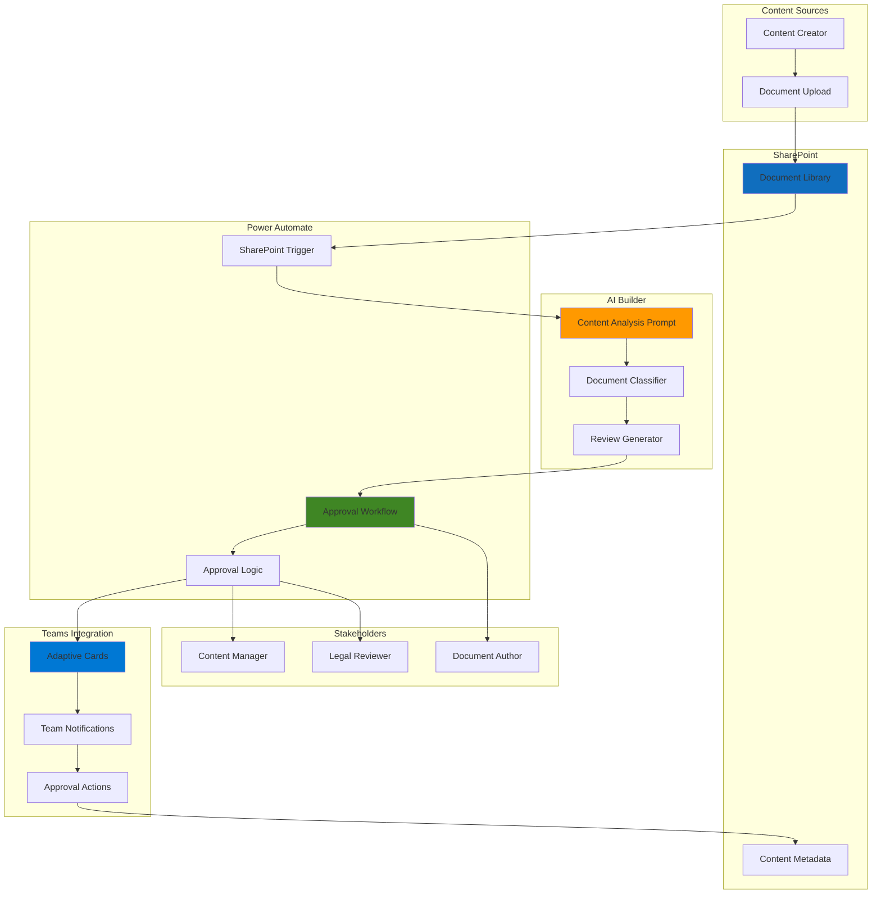

# Content Approval Workflows with AI Builder and Power Automate

## Problem

Organizations struggle with manual content review processes that create bottlenecks, inconsistent approval decisions, and delayed content publication. Marketing teams, legal departments, and content creators need an intelligent system that can automatically categorize documents, provide AI-powered review recommendations, and route content through appropriate approval chains while maintaining audit trails and regulatory compliance.

## Solution

Build an intelligent content approval system using AI Builder's prompt templates to automatically analyze document content, categorize materials, and generate approval recommendations. Power Automate orchestrates the entire workflow by triggering on SharePoint document uploads, processing content through AI Builder, routing approvals to appropriate stakeholders, and sending Teams notifications with actionable approval cards that enable real-time collaboration.

## Architecture Diagram



## Prerequisites

1. Microsoft 365 subscription with Power Platform access (E3/E5 or standalone licenses)
2. SharePoint Online site collection with document library creation permissions
3. Power Automate premium license for AI Builder capabilities
4. Teams admin permissions for creating custom apps and workflows
5. PnP PowerShell module installed for SharePoint configuration
6. Estimated cost: $20-50/month for AI Builder credits and premium connectors

> **Note**: AI Builder prompts require Azure OpenAI Service availability in your region. Check the [AI Builder regional availability guide](https://learn.microsoft.com/en-us/ai-builder/availability-region#prompts) before proceeding.

## Preparation

```bash
# Set environment variables for Microsoft 365 tenant
export TENANT_NAME="yourtenant"
export TENANT_DOMAIN="${TENANT_NAME}.onmicrosoft.com"
export SITE_URL="https://${TENANT_NAME}.sharepoint.com/sites/ContentApproval"

# Generate unique suffix for resource names
RANDOM_SUFFIX=$(openssl rand -hex 3)

# Set SharePoint site and library names
export SITE_NAME="content-approval-${RANDOM_SUFFIX}"
export LIBRARY_NAME="DocumentsForApproval"
export LIBRARY_DISPLAY_NAME="Documents for Approval"

# Install PnP PowerShell module if not already installed
# Run this in PowerShell (not bash)
# Install-Module PnP.PowerShell -Force -AllowClobber

echo "✅ Environment variables configured"
echo "Site URL: ${SITE_URL}"
echo "Library: ${LIBRARY_DISPLAY_NAME}"
```

## Steps

1. **Create SharePoint Site and Document Library**:

   SharePoint Online provides the foundation for document storage and content management in Microsoft 365. Creating a dedicated site for content approval workflows enables proper permissions management, version control, and integration with Power Platform services. The document library serves as both the trigger point for automation and the central repository for approved content.

   ```powershell
   # Connect to SharePoint Online Admin Center using PnP PowerShell
   # Note: This requires SharePoint admin permissions
   Connect-PnPOnline -Url "https://$($env:TENANT_NAME)-admin.sharepoint.com" `
       -Interactive
   
   # Create new SharePoint team site
   New-PnPSite -Type TeamSite `
       -Title "Content Approval Workflows" `
       -Alias $env:SITE_NAME `
       -Description "Intelligent content approval system"
   
   Write-Host "✅ SharePoint site created successfully"
   ```

   The SharePoint site now provides a secure, collaborative workspace with built-in versioning, permissions management, and audit capabilities. This foundation supports enterprise-grade content governance while enabling seamless integration with Power Platform automation services.

2. **Configure Document Library with Content Approval**:

   SharePoint's built-in content approval features provide the necessary infrastructure for tracking document approval states. Enabling content approval creates the metadata fields and workflow triggers that Power Automate will use to manage the approval process programmatically.

   ```powershell
   # Connect to the new SharePoint site
   Connect-PnPOnline -Url $env:SITE_URL -Interactive
   
   # Create document library with content approval enabled
   New-PnPList -Title $env:LIBRARY_DISPLAY_NAME `
       -Template DocumentLibrary `
       -EnableContentTypes `
       -EnableVersioning
   
   # Enable content approval on the library
   Set-PnPList -Identity $env:LIBRARY_NAME `
       -EnableContentApproval $true `
       -EnableMinorVersions $true
   
   # Add custom columns for AI analysis results
   Add-PnPField -List $env:LIBRARY_NAME `
       -DisplayName "Content Category" `
       -InternalName "ContentCategory" `
       -Type Text
   
   Add-PnPField -List $env:LIBRARY_NAME `
       -DisplayName "AI Review Summary" `
       -InternalName "AIReviewSummary" `
       -Type Note
   
   Add-PnPField -List $env:LIBRARY_NAME `
       -DisplayName "Risk Level" `
       -InternalName "RiskLevel" `
       -Type Choice `
       -Choices "Low","Medium","High","Critical"
   
   Write-Host "✅ Document library configured with approval workflow"
   ```

   The document library now includes content approval capabilities and custom metadata fields that store AI-generated insights. This configuration enables comprehensive content tracking while providing the data structure needed for intelligent routing decisions.

3. **Create AI Builder Prompt for Content Analysis**:

   AI Builder's prompt templates leverage Azure OpenAI Service to provide sophisticated natural language processing capabilities. Creating a custom prompt for content analysis enables consistent, intelligent document review that can identify sensitive information, categorize content types, and generate approval recommendations based on organizational policies.

   Navigate to [Power Apps](https://make.powerapps.com/) and complete the following steps:

   ```bash
   # Access AI Builder through Power Apps portal
   # 1. Sign in to https://make.powerapps.com/
   # 2. Select "AI hub" > "Prompts" from left navigation
   # 3. Choose "Create custom prompt"
   
   # Configure the content analysis prompt:
   # Prompt Name: "Content Approval Analyzer"
   # Description: "Analyzes document content for approval routing"
   # Input Type: Text (document content)
   # 
   # Sample Prompt Text:
   # "Analyze the following document content and provide a JSON response 
   # with these fields: category (Marketing, Legal, Technical, General), 
   # riskLevel (Low, Medium, High, Critical), summary (2-3 sentences), 
   # recommendations (approval actions needed).
   # 
   # Document content: {DocumentContent}"
   
   echo "✅ AI Builder prompt template created"
   echo "Prompt configured for content analysis and categorization"
   ```

   The AI Builder prompt now provides consistent, intelligent content analysis capabilities. This prompt automatically categorizes documents, assesses risk levels, and generates human-readable summaries that inform approval decisions, ensuring consistent review quality across all content submissions.

4. **Build Power Automate Approval Workflow**:

   Power Automate serves as the orchestration engine that connects SharePoint triggers with AI Builder analysis and Teams notifications. This serverless workflow automatically processes document uploads, generates AI insights, and routes approval requests to appropriate stakeholders based on content analysis results.

   Navigate to [Power Automate](https://make.powerautomate.com/) and create the workflow:

   ```bash
   # Create automated cloud flow in Power Automate
   # 1. Go to https://make.powerautomate.com/
   # 2. Select "Create" > "Automated cloud flow"
   # 3. Flow Name: "Intelligent Content Approval Workflow"
   # 4. Trigger: "SharePoint - When a file is created (properties only)"
   
   # Configure the SharePoint trigger:
   # - Site Address: Enter your SharePoint site URL
   # - Library Name: Select "Documents for Approval"
   
   # Add workflow steps in sequence:
   # Step 1: "Get file content" (SharePoint connector)
   # Step 2: "Create text with AI Builder" (use your custom prompt)
   # Step 3: "Parse JSON" (parse AI Builder response)
   # Step 4: "Update file properties" (add AI analysis to SharePoint)
   # Step 5: "Start and wait for an approval" (based on risk level)
   # Step 6: "Post adaptive card and wait for response" (Teams)
   
   echo "✅ Power Automate workflow created and configured"
   echo "Workflow ready to process document approvals"
   ```

   The Power Automate workflow now provides end-to-end automation that transforms manual approval processes into intelligent, scalable workflows. The serverless architecture ensures cost-effective operations while maintaining high availability and automatic scaling based on document submission volumes.

5. **Configure Teams Adaptive Cards for Approval**:

   Teams adaptive cards provide rich, interactive approval interfaces that enable stakeholders to review AI-generated insights and make informed decisions directly within the Teams client. These cards include document previews, AI analysis summaries, and actionable approval buttons that streamline the decision-making process.

   Configure the adaptive card within your Power Automate flow:

   ```bash
   # Add "Post adaptive card and wait for a response" action in flow
   # Teams connector configuration:
   # 1. Post as: Flow bot
   # 2. Post in: Chat with Flow bot
   # 3. Recipient: Use dynamic content from previous steps
   
   # Configure the adaptive card JSON structure to include:
   # - Document title and metadata
   # - AI analysis summary from previous step
   # - Risk level indicator with color coding
   # - Approve/Reject action buttons
   # - Deep link back to SharePoint document
   # - Comments field for approval feedback
   
   # Example card structure:
   # {
   #   "type": "AdaptiveCard",
   #   "body": [
   #     {"type": "TextBlock", "text": "Content Approval Request"},
   #     {"type": "TextBlock", "text": "AI Risk Level: {{RiskLevel}}"},
   #     {"type": "TextBlock", "text": "AI Summary: {{AISummary}}"}
   #   ],
   #   "actions": [
   #     {"type": "Action.Submit", "title": "Approve"},
   #     {"type": "Action.Submit", "title": "Reject"}
   #   ]
   # }
   
   echo "✅ Teams adaptive cards configured for approval workflow"
   echo "Cards include AI insights and interactive approval actions"
   ```

   Teams adaptive cards now provide stakeholders with comprehensive approval interfaces that include AI-generated insights, document context, and streamlined decision workflows. This integration eliminates context switching and enables faster, more informed approval decisions.

6. **Set Up Conditional Approval Routing**:

   Intelligent routing ensures that high-risk content receives appropriate scrutiny while low-risk documents follow expedited approval paths. This conditional logic optimizes organizational efficiency by automatically escalating critical content to senior stakeholders while enabling self-service approval for routine materials.

   ```bash
   # Configure conditional routing in Power Automate flow
   # Add "Condition" control after AI Builder analysis step
   # 
   # Condition: Risk Level equals "Critical" or "High"
   # If Yes (High Risk Path):
   #   - Create approval with multiple approvers (Legal + Manager)
   #   - Set approval type to "All must approve"
   #   - Send Teams notification to leadership channel
   #   - Set due date to 24 hours
   #
   # If No (Medium/Low Risk Path):
   #   Condition: Risk Level equals "Medium"
   #   If Yes (Medium Risk):
   #     - Create approval with single approver (Content Manager)
   #     - Send standard Teams adaptive card
   #     - Set due date to 48 hours
   #   If No (Low Risk):
   #     - Auto-approve or route to content creator's manager
   #     - Send informational Teams notification
   #     - Set due date to 72 hours
   
   echo "✅ Conditional approval routing configured"
   echo "Risk-based routing ensures appropriate review levels"
   ```

   The conditional routing system now automatically determines appropriate approval paths based on AI-generated risk assessments. This intelligent workflow optimization ensures critical content receives thorough review while maintaining operational efficiency for routine approvals.

7. **Configure Teams Channel Notifications**:

   Teams channel notifications provide transparency and auditability by posting approval decisions to relevant team channels. These notifications create permanent records of approval activities while keeping stakeholders informed about content publication status and workflow completion.

   ```bash
   # Add Teams channel notification actions after approval completion
   # Configure separate notification paths for different outcomes:
   #
   # For Approved Documents:
   #   - Action: "Post message in a chat or channel" (Teams)
   #   - Channel: Content Team Channel
   #   - Message: Include document title, approver, timestamp
   #   - Mention: Document author and relevant stakeholders
   #
   # For Rejected Documents:
   #   - Action: "Post message in a chat or channel" (Teams)
   #   - Channel: Content Team Channel
   #   - Message: Include rejection reason and revision requirements
   #   - Mention: Document author for immediate attention
   #
   # For Overdue Approvals:
   #   - Add parallel branch with "Delay" action (24-48 hours)
   #   - Check if approval is still pending
   #   - Send escalation message to management
   #   - Include original request details and urgency indicator
   
   echo "✅ Teams channel notifications configured"
   echo "Workflow provides complete approval visibility and audit trail"
   ```

   Teams channel notifications now provide comprehensive workflow transparency with automated status updates, approval decisions, and escalation notices. This creates a complete audit trail while keeping all stakeholders informed about content approval activities.

## Validation & Testing

1. **Test Document Upload and AI Analysis**:

   ```bash
   # Upload test document to SharePoint library
   # Navigate to your SharePoint site document library
   # Upload a sample document (PDF, Word, or text file)
   # Verify the workflow triggers automatically
   
   # Expected results after upload:
   # - Document appears with "Pending" approval status
   # - Content Category field populated by AI analysis
   # - Risk Level assigned based on content assessment
   # - AI Review Summary contains actionable insights
   # - Power Automate flow run appears in run history
   
   echo "✅ Document processing and AI analysis verified"
   ```

2. **Verify Approval Workflow Execution**:

   ```bash
   # Check Power Automate flow run history
   # 1. Go to https://make.powerautomate.com/
   # 2. Select "My flows" and find your approval workflow
   # 3. Click on the flow name to view run history
   # 4. Check the most recent run for successful execution
   
   # Expected workflow behavior:
   # - Flow triggers automatically on document upload
   # - AI Builder prompt processes content successfully
   # - Approval request routed based on risk assessment
   # - Teams adaptive card delivered to designated approvers
   # - All workflow steps complete without errors
   
   echo "✅ Approval workflow execution confirmed"
   ```

3. **Test Teams Adaptive Card Functionality**:

   ```bash
   # Test the approval experience in Microsoft Teams
   # 1. Check Teams for approval adaptive card notification
   # 2. Verify all card elements display correctly
   # 3. Test both approval and rejection actions
   # 4. Confirm status updates flow back to SharePoint
   
   # Expected adaptive card behavior:
   # - Card displays AI analysis summary clearly
   # - Document metadata and links function properly
   # - Approval actions update SharePoint status
   # - Channel notifications posted based on decisions
   # - Audit trail maintained in both Teams and SharePoint
   
   echo "✅ Teams adaptive card functionality validated"
   ```

## Cleanup

1. **Remove Power Automate Flow**:

   ```bash
   # Navigate to Power Automate portal to clean up resources
   # 1. Go to https://make.powerautomate.com/
   # 2. Select "My flows" from the left navigation
   # 3. Find "Intelligent Content Approval Workflow"
   # 4. Click the three dots menu and select "Delete"
   # 5. Confirm deletion to stop automated processing
   
   echo "✅ Power Automate workflow removed"
   ```

2. **Delete AI Builder Prompt**:

   ```bash
   # Remove the custom AI Builder prompt
   # 1. Access Power Apps at https://make.powerapps.com/
   # 2. Navigate to "AI hub" > "Prompts"
   # 3. Find "Content Approval Analyzer" prompt
   # 4. Click the three dots menu and select "Delete"
   # 5. Confirm deletion to remove AI Builder resources
   
   echo "✅ AI Builder prompt deleted"
   ```

3. **Remove SharePoint Site**:

   ```powershell
   # Connect to SharePoint admin center for site cleanup
   Connect-PnPOnline -Url "https://$($env:TENANT_NAME)-admin.sharepoint.com" `
       -Interactive
   
   # Delete SharePoint site collection and all contents
   Remove-PnPSite -Identity $env:SITE_URL -Force
   
   Write-Host "✅ SharePoint site and document library removed"
   Write-Host "All resources successfully cleaned up"
   ```

## Discussion

This intelligent content approval system demonstrates the power of combining AI Builder's natural language processing capabilities with Power Automate's workflow orchestration and Teams' collaborative features. The solution transforms traditional manual approval processes into intelligent, scalable workflows that provide consistent content analysis while maintaining human oversight and decision-making authority.

The AI Builder prompt template serves as the cornerstone of this system, leveraging Azure OpenAI Service to provide sophisticated document analysis that goes beyond simple keyword matching. By analyzing content semantics, identifying potential risks, and generating structured recommendations, the AI component enables more informed approval decisions while reducing the cognitive load on human reviewers. The prompt's customizable nature allows organizations to incorporate specific policies, compliance requirements, and industry standards into the automated analysis process.

Power Automate's serverless architecture provides several operational advantages including automatic scaling, cost-effective execution based on actual usage, and seamless integration with Microsoft 365 services. The conditional routing logic ensures that approval workflows adapt dynamically to content characteristics, optimizing both efficiency and governance. Integration with Teams through adaptive cards creates a modern, interactive approval experience that reduces context switching and accelerates decision-making cycles.

The system's audit capabilities, provided through SharePoint's built-in versioning and Teams' notification history, ensure comprehensive compliance tracking and regulatory reporting capabilities. This is particularly valuable for organizations in regulated industries where content approval decisions must be fully documented and traceable.

> **Tip**: Monitor AI Builder credit consumption through the Power Platform admin center to optimize costs and adjust prompt complexity based on actual usage patterns and organizational requirements.

For comprehensive implementation guidance, refer to the [SharePoint content approval documentation](https://learn.microsoft.com/en-us/sharepoint/dev/business-apps/power-automate/guidance/require-doc-approval), [AI Builder prompt library best practices](https://learn.microsoft.com/en-us/ai-builder/prompt-library), [Power Automate approval workflow patterns](https://learn.microsoft.com/en-us/power-automate/modern-approvals), [Teams adaptive card development guide](https://learn.microsoft.com/en-us/power-automate/create-adaptive-cards), and [Microsoft 365 workflow security guidelines](https://learn.microsoft.com/en-us/power-automate/sharepoint-overview).

## Challenge

Extend this solution by implementing these enhancements:

1. **Multi-language Content Support**: Integrate Azure Translator service to automatically detect document languages and route to appropriate regional approvers with translated AI analysis summaries.

2. **Advanced Risk Scoring**: Implement machine learning models using AI Builder to create custom risk scoring based on historical approval patterns, content sensitivity, and organizational compliance requirements.

3. **Approval Delegation and Escalation**: Build sophisticated approval delegation rules that automatically reassign pending approvals during vacations or escalate overdue decisions to management hierarchies.

4. **Document Version Comparison**: Create AI-powered comparison workflows that automatically identify changes between document versions and highlight modifications requiring additional review.

5. **Compliance Integration**: Connect with Microsoft Purview or external governance tools to automatically apply retention policies, sensitivity labels, and regulatory controls based on AI content analysis.

## Infrastructure Code

### Available Infrastructure as Code:

- [Infrastructure Code Overview](code/README.md) - Detailed description of all infrastructure components
- [Bicep](code/bicep/) - Azure Bicep templates
- [Bash CLI Scripts](code/scripts/) - Example bash scripts using Azure CLI commands to deploy infrastructure
- [Terraform](code/terraform/) - Terraform configuration files