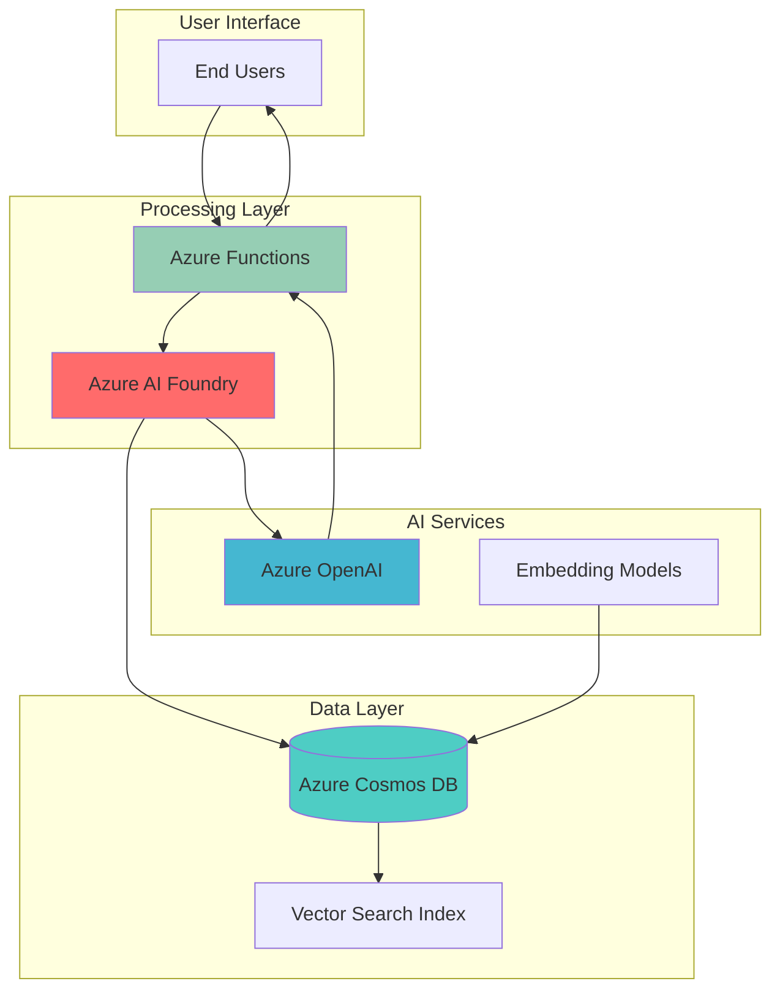

# Content Personalization Engine with AI Foundry and Cosmos

## Problem

Modern digital marketing and content platforms struggle to deliver personalized experiences at scale, often serving generic content that fails to engage individual users effectively. Traditional rule-based personalization systems cannot adapt to dynamic user preferences or generate contextually relevant content in real-time. Without intelligent content personalization, businesses experience reduced user engagement, lower conversion rates, and increased customer churn due to irrelevant content experiences.

## Solution

Build an intelligent content personalization system using Azure AI Foundry's orchestration capabilities to coordinate Azure OpenAI models with user behavior data stored in Azure Cosmos DB. This solution leverages vector search for semantic matching, Azure Functions for serverless processing, and AI Foundry's agent framework to generate personalized articles, recommendations, and marketing content based on real-time user preferences and historical behavior patterns.

## Architecture Diagram



## Prerequisites

1. Azure subscription with appropriate permissions to create AI Foundry projects, Cosmos DB accounts, Functions apps, and OpenAI services
2. Azure CLI installed and configured (version 2.0.81 or later) or Azure Cloud Shell access
3. Basic understanding of vector databases, embeddings, and large language models
4. Familiarity with REST APIs and serverless function development
5. Estimated cost: $50-100 for running this recipe with moderate usage (varies by region and usage patterns)

> **Note**: This recipe uses Azure AI Foundry's agent service and vector search capabilities in Cosmos DB. Ensure your subscription has access to these preview features and review pricing for Azure OpenAI usage.

## Preparation

```bash
# Set environment variables for Azure resources
export LOCATION="eastus"
export SUBSCRIPTION_ID=$(az account show --query id --output tsv)

# Generate unique suffix for resource names
RANDOM_SUFFIX=$(openssl rand -hex 3)

# Set resource names with unique suffix
export RESOURCE_GROUP="rg-personalization-${RANDOM_SUFFIX}"
export COSMOS_ACCOUNT="cosmos-personalization-${RANDOM_SUFFIX}"
export AI_FOUNDRY_PROJECT="ai-personalization-${RANDOM_SUFFIX}"
export OPENAI_SERVICE="openai-personalization-${RANDOM_SUFFIX}"
export FUNCTION_APP="func-personalization-${RANDOM_SUFFIX}"
export STORAGE_ACCOUNT="stpersonalization${RANDOM_SUFFIX}"

# Create resource group
az group create \
    --name ${RESOURCE_GROUP} \
    --location ${LOCATION} \
    --tags purpose=recipe environment=demo

echo "✅ Resource group created: ${RESOURCE_GROUP}"

# Create storage account for Azure Functions
az storage account create \
    --name ${STORAGE_ACCOUNT} \
    --resource-group ${RESOURCE_GROUP} \
    --location ${LOCATION} \
    --sku Standard_LRS

echo "✅ Storage account created for Functions"
```

## Steps

1. **Create Azure Cosmos DB Account with Vector Search**:

   Azure Cosmos DB provides the foundational data layer for our personalization engine, offering both operational data storage and vector search capabilities. The vector search feature, built on DiskANN technology, enables semantic similarity matching for content recommendations. This allows the system to find contextually similar content and user preferences based on embedding vectors rather than just keyword matching.

   ```bash
   # Create Cosmos DB account with vector search capabilities
   az cosmosdb create \
       --name ${COSMOS_ACCOUNT} \
       --resource-group ${RESOURCE_GROUP} \
       --locations regionName=${LOCATION} \
       --enable-automatic-failover true \
       --default-consistency-level Session \
       --capabilities EnableNoSQLVectorSearch
   
   echo "✅ Cosmos DB account created with vector search enabled"
   
   # Wait for account to be fully provisioned
   az cosmosdb show \
       --name ${COSMOS_ACCOUNT} \
       --resource-group ${RESOURCE_GROUP} \
       --query provisioningState \
       --output tsv
   
   # Create database and containers for personalization data
   az cosmosdb sql database create \
       --account-name ${COSMOS_ACCOUNT} \
       --resource-group ${RESOURCE_GROUP} \
       --name PersonalizationDB
   
   # Create container for user profiles with vector properties
   az cosmosdb sql container create \
       --account-name ${COSMOS_ACCOUNT} \
       --resource-group ${RESOURCE_GROUP} \
       --database-name PersonalizationDB \
       --name UserProfiles \
       --partition-key-path "/userId" \
       --throughput 400
   
   # Create container for content with vector embeddings
   az cosmosdb sql container create \
       --account-name ${COSMOS_ACCOUNT} \
       --resource-group ${RESOURCE_GROUP} \
       --database-name PersonalizationDB \
       --name ContentItems \
       --partition-key-path "/category" \
       --throughput 400
   
   echo "✅ Cosmos DB containers created for personalization data"
   ```

   The Cosmos DB setup includes dedicated containers for user profiles and content items, each optimized for different access patterns. User profiles are partitioned by userId for efficient user-specific queries, while content items are partitioned by category to enable efficient content discovery and recommendation workflows.

2. **Deploy Azure OpenAI Service for Content Generation**:

   Azure OpenAI provides the generative AI capabilities needed for creating personalized content and processing user interactions. The service offers enterprise-grade security, compliance, and integration with other Azure services. We'll deploy both text generation and embedding models to support content creation and semantic search functionality.

   ```bash
   # Create Azure OpenAI service
   az cognitiveservices account create \
       --name ${OPENAI_SERVICE} \
       --resource-group ${RESOURCE_GROUP} \
       --location ${LOCATION} \
       --kind OpenAI \
       --sku S0 \
       --custom-domain ${OPENAI_SERVICE}
   
   echo "✅ Azure OpenAI service created"
   
   # Wait for service to be fully provisioned
   az cognitiveservices account show \
       --name ${OPENAI_SERVICE} \
       --resource-group ${RESOURCE_GROUP} \
       --query provisioningState \
       --output tsv
   
   # Deploy GPT-4 model for content generation
   az cognitiveservices account deployment create \
       --name ${OPENAI_SERVICE} \
       --resource-group ${RESOURCE_GROUP} \
       --deployment-name gpt-4-content \
       --model-name gpt-4 \
       --model-version "0613" \
       --model-format OpenAI \
       --sku-capacity 10 \
       --sku-name Standard
   
   # Deploy text embedding model for vector search
   az cognitiveservices account deployment create \
       --name ${OPENAI_SERVICE} \
       --resource-group ${RESOURCE_GROUP} \
       --deployment-name text-embedding \
       --model-name text-embedding-ada-002 \
       --model-version "2" \
       --model-format OpenAI \
       --sku-capacity 10 \
       --sku-name Standard
   
   echo "✅ OpenAI models deployed for content generation and embeddings"
   ```

   The dual model deployment strategy enables both content generation through GPT-4 and vector embedding creation through the text-embedding-ada-002 model. This combination supports the full personalization workflow from content creation to semantic matching and user preference analysis.

3. **Create Azure AI Foundry Project and Configure Connections**:

   Azure AI Foundry serves as the orchestration layer that coordinates between different AI services and data sources. The platform provides agent-based workflows, model management, and integrated development tools for building production-ready AI applications. Setting up the Foundry project establishes the foundation for our personalization orchestration logic.

   ```bash
   # Install AI Foundry CLI extension
   az extension add --name ml
   
   # Create AI Foundry workspace (ML workspace foundation)
   az ml workspace create \
       --name ${AI_FOUNDRY_PROJECT} \
       --resource-group ${RESOURCE_GROUP} \
       --location ${LOCATION} \
       --description "AI Foundry workspace for content personalization"
   
   echo "✅ AI Foundry workspace created"
   
   # Get OpenAI service endpoint and key for connection
   OPENAI_ENDPOINT=$(az cognitiveservices account show \
       --name ${OPENAI_SERVICE} \
       --resource-group ${RESOURCE_GROUP} \
       --query properties.endpoint \
       --output tsv)
   
   OPENAI_KEY=$(az cognitiveservices account keys list \
       --name ${OPENAI_SERVICE} \
       --resource-group ${RESOURCE_GROUP} \
       --query key1 \
       --output tsv)
   
   # Get Cosmos DB connection string
   COSMOS_CONNECTION=$(az cosmosdb keys list \
       --name ${COSMOS_ACCOUNT} \
       --resource-group ${RESOURCE_GROUP} \
       --type connection-strings \
       --query "connectionStrings[0].connectionString" \
       --output tsv)
   
   echo "✅ Service credentials retrieved for AI Foundry connections"
   ```

   The AI Foundry workspace provides the central hub for managing AI models, connections, and orchestration workflows. By retrieving the necessary connection credentials, we enable seamless integration between Azure OpenAI, Cosmos DB, and the AI Foundry platform for coordinated personalization processing.

4. **Deploy Azure Functions for API and Processing Logic**:

   Azure Functions provides the serverless compute layer that handles user requests, processes personalization logic, and orchestrates interactions between AI Foundry and data services. The event-driven scaling capabilities ensure cost-effective operation while maintaining responsive performance for personalization requests.

   ```bash
   # Create Function App with consumption plan
   az functionapp create \
       --name ${FUNCTION_APP} \
       --resource-group ${RESOURCE_GROUP} \
       --storage-account ${STORAGE_ACCOUNT} \
       --consumption-plan-location ${LOCATION} \
       --runtime python \
       --runtime-version 3.12 \
       --functions-version 4 \
       --os-type Linux
   
   echo "✅ Function App created"
   
   # Configure Function App settings for AI services
   az functionapp config appsettings set \
       --name ${FUNCTION_APP} \
       --resource-group ${RESOURCE_GROUP} \
       --settings \
       COSMOS_CONNECTION_STRING="${COSMOS_CONNECTION}" \
       OPENAI_ENDPOINT="${OPENAI_ENDPOINT}" \
       OPENAI_API_KEY="${OPENAI_KEY}" \
       AI_FOUNDRY_WORKSPACE="${AI_FOUNDRY_PROJECT}"
   
   echo "✅ Function App configured with AI service connections"
   ```

   The Function App configuration includes all necessary connection strings and API keys to enable seamless integration with our AI services. The serverless architecture automatically scales based on demand, making it ideal for handling variable personalization workloads while maintaining cost efficiency.

5. **Create Vector Search Index in Cosmos DB**:

   Vector search indexing enables semantic similarity matching for content personalization. By creating vector indexes on both user preferences and content embeddings, the system can efficiently find related content and similar user behaviors. This capability is essential for generating relevant recommendations and understanding user intent.

   ```bash
   # Create vector search index for content embeddings
   cat > vector-index-policy.json << 'EOF'
   {
     "vectorEmbeddingPolicy": {
       "vectorEmbeddings": [
         {
           "path": "/contentEmbedding",
           "dataType": "float32",
           "distanceFunction": "cosine",
           "dimensions": 1536
         },
         {
           "path": "/userPreferenceEmbedding", 
           "dataType": "float32",
           "distanceFunction": "cosine",
           "dimensions": 1536
         }
       ]
     },
     "indexingPolicy": {
       "vectorIndexes": [
         {
           "path": "/contentEmbedding",
           "type": "quantizedFlat"
         },
         {
           "path": "/userPreferenceEmbedding",
           "type": "quantizedFlat"
         }
       ],
       "excludedPaths": [
         {
           "path": "/contentEmbedding/*"
         },
         {
           "path": "/userPreferenceEmbedding/*"
         }
       ]
     }
   }
   EOF
   
   # Update container with vector search capabilities
   az cosmosdb sql container update \
       --account-name ${COSMOS_ACCOUNT} \
       --resource-group ${RESOURCE_GROUP} \
       --database-name PersonalizationDB \
       --name ContentItems \
       --idx @vector-index-policy.json
   
   echo "✅ Vector search index created for content personalization"
   ```

   The vector index configuration supports 1536-dimensional embeddings (matching OpenAI's text-embedding-ada-002 model) with cosine similarity for semantic matching. The quantizedFlat index type provides efficient storage and fast query performance for real-time personalization scenarios. Vector paths are excluded from the default index to optimize insertion performance.

6. **Deploy Sample Personalization Function Code**:

   The personalization function implements the core business logic that coordinates user data retrieval, content matching, and AI-generated recommendations. This serverless function serves as the primary API endpoint for personalization requests and demonstrates the integration between all Azure services in the solution.

   ```bash
   # Create sample personalization function code
   mkdir -p personalization-function
   
   cat > personalization-function/requirements.txt << 'EOF'
   azure-functions==1.20.0
   azure-cosmos==4.6.0
   openai==1.10.0
   azure-identity==1.15.0
   numpy==1.24.3
   EOF
   
   cat > personalization-function/__init__.py << 'EOF'
   import json
   import logging
   import os
   from azure.functions import HttpRequest, HttpResponse
   from azure.cosmos import CosmosClient
   from openai import AzureOpenAI
   import numpy as np
   
   def main(req: HttpRequest) -> HttpResponse:
       try:
           # Get user ID from request
           user_id = req.params.get('userId')
           if not user_id:
               return HttpResponse(
                   json.dumps({"error": "userId parameter required"}),
                   status_code=400,
                   mimetype="application/json"
               )
           
           # Initialize services
           cosmos_client = CosmosClient.from_connection_string(
               os.environ['COSMOS_CONNECTION_STRING']
           )
           
           # Initialize Azure OpenAI client (v1 API)
           openai_client = AzureOpenAI(
               api_key=os.environ['OPENAI_API_KEY'],
               azure_endpoint=os.environ['OPENAI_ENDPOINT'],
               api_version="2024-02-01"
           )
           
           # Get user profile and generate personalized content
           database = cosmos_client.get_database_client("PersonalizationDB")
           users_container = database.get_container_client("UserProfiles")
           content_container = database.get_container_client("ContentItems")
           
           # Retrieve user profile
           try:
               user_profile = users_container.read_item(
                   item=user_id, 
                   partition_key=user_id
               )
           except:
               # Create default profile for new users
               user_profile = {
                   "id": user_id,
                   "userId": user_id,
                   "preferences": [],
                   "engagement_history": []
               }
           
           # Generate personalized recommendations
           recommendations = generate_recommendations(
               user_profile, content_container, openai_client
           )
           
           return HttpResponse(
               json.dumps({
                   "userId": user_id,
                   "recommendations": recommendations,
                   "status": "success"
               }),
               status_code=200,
               mimetype="application/json"
           )
           
       except Exception as e:
           logging.error(f"Error in personalization function: {str(e)}")
           return HttpResponse(
               json.dumps({"error": "Internal server error"}),
               status_code=500,
               mimetype="application/json"
           )
   
   def generate_recommendations(user_profile, content_container, openai_client):
       # Simplified recommendation logic
       # In production, this would use vector search and AI Foundry orchestration
       try:
           # Generate sample personalized content using OpenAI
           prompt = f"Generate a personalized article title for user with preferences: {user_profile.get('preferences', [])}"
           
           response = openai_client.chat.completions.create(
               model="gpt-4-content",
               messages=[
                   {"role": "system", "content": "You are a content personalization assistant."},
                   {"role": "user", "content": prompt}
               ],
               max_tokens=50
           )
           
           personalized_title = response.choices[0].message.content.strip()
           
           return [
               {
                   "contentId": "article_001",
                   "title": personalized_title,
                   "type": "article",
                   "confidence": 0.95
               }
           ]
       except Exception as e:
           logging.error(f"Error generating recommendations: {str(e)}")
           # Fallback to default recommendation
           return [
               {
                   "contentId": "article_001",
                   "title": "Personalized Content for You",
                   "type": "article",
                   "confidence": 0.75
               }
           ]
   EOF
   
   # Create function.json configuration
   cat > personalization-function/function.json << 'EOF'
   {
     "scriptFile": "__init__.py",
     "bindings": [
       {
         "authLevel": "function",
         "type": "httpTrigger",
         "direction": "in",
         "name": "req",
         "methods": ["get", "post"]
       },
       {
         "type": "http",
         "direction": "out",
         "name": "$return"
       }
     ]
   }
   EOF
   
   echo "✅ Personalization function code created"
   ```

   The function code demonstrates the integration pattern between Azure services, including Cosmos DB for user data storage, OpenAI for AI processing, and the HTTP trigger for API access. The updated code uses the OpenAI v1 API client with proper error handling and fallback mechanisms for robust production deployment.

7. **Configure AI Foundry Agent for Content Orchestration**:

   AI Foundry agents provide sophisticated orchestration capabilities that coordinate multiple AI models and data sources to deliver intelligent personalization. The agent framework handles complex workflows, manages state, and provides observability for production AI applications.

   ```bash
   # Create AI Foundry agent configuration
   cat > ai-agent-config.json << 'EOF'
   {
     "agent": {
       "name": "ContentPersonalizationAgent",
       "description": "Intelligent agent for content personalization and recommendation",
       "instructions": "You are a content personalization agent. Analyze user preferences, behavior patterns, and content characteristics to generate highly relevant, personalized content recommendations. Use vector search to find similar content and users, then generate customized articles, product recommendations, and marketing content based on individual user profiles.",
       "model": "gpt-4-content",
       "tools": [
         {
           "type": "function",
           "function": {
             "name": "query_user_preferences",
             "description": "Retrieve user preference data from Cosmos DB",
             "parameters": {
               "type": "object",
               "properties": {
                 "userId": {
                   "type": "string",
                   "description": "Unique user identifier"
                 }
               },
               "required": ["userId"]
             }
           }
         },
         {
           "type": "function", 
           "function": {
             "name": "vector_search_content",
             "description": "Perform vector similarity search for content recommendations",
             "parameters": {
               "type": "object",
               "properties": {
                 "embedding": {
                   "type": "array",
                   "description": "Vector embedding for similarity search"
                 },
                 "limit": {
                   "type": "integer",
                   "description": "Maximum number of results to return"
                 }
               },
               "required": ["embedding"]
             }
           }
         }
       ]
     }
   }
   EOF
   
   echo "✅ AI Foundry agent configuration created"
   
   # Store configuration for deployment
   export AI_AGENT_CONFIG="$(pwd)/ai-agent-config.json"
   echo "Agent configuration stored at: ${AI_AGENT_CONFIG}"
   ```

   The AI Foundry agent configuration defines the intelligent orchestration layer that coordinates personalization workflows. The agent uses function calling to interact with Cosmos DB for user data and perform vector searches for content matching, providing a sophisticated foundation for personalized content generation.

8. **Deploy and Test the Personalization System**:

   System deployment involves packaging the function code and deploying it to Azure Functions, then testing the complete personalization workflow. This step validates the integration between all services and ensures the system can handle real personalization requests.

   ```bash
   # Package and deploy the function
   cd personalization-function
   
   # Create deployment package
   zip -r ../personalization-function.zip .
   cd ..
   
   # Deploy function code to Azure
   az functionapp deployment source config-zip \
       --name ${FUNCTION_APP} \
       --resource-group ${RESOURCE_GROUP} \
       --src personalization-function.zip
   
   echo "✅ Function deployed to Azure"
   
   # Wait for deployment to complete
   sleep 30
   
   # Get function URL for testing
   FUNCTION_URL=$(az functionapp function show \
       --name ${FUNCTION_APP} \
       --resource-group ${RESOURCE_GROUP} \
       --function-name personalization-function \
       --query invokeUrlTemplate \
       --output tsv)
   
   # Get function key
   FUNCTION_KEY=$(az functionapp keys list \
       --name ${FUNCTION_APP} \
       --resource-group ${RESOURCE_GROUP} \
       --query functionKeys.default \
       --output tsv)
   
   echo "✅ Function URL: ${FUNCTION_URL}"
   echo "Function Key: ${FUNCTION_KEY}"
   ```

   The deployment process packages the Python function code and deploys it to the Azure Functions runtime. The function URL and key provide secure access to the personalization API, enabling integration with web applications, mobile apps, or other systems requiring personalized content delivery.

## Validation & Testing

1. **Verify Azure Services Deployment**:

   ```bash
   # Check Cosmos DB account status
   az cosmosdb show \
       --name ${COSMOS_ACCOUNT} \
       --resource-group ${RESOURCE_GROUP} \
       --query provisioningState \
       --output tsv
   
   # Verify OpenAI model deployments
   az cognitiveservices account deployment list \
       --name ${OPENAI_SERVICE} \
       --resource-group ${RESOURCE_GROUP} \
       --output table
   
   # Check Function App status
   az functionapp show \
       --name ${FUNCTION_APP} \
       --resource-group ${RESOURCE_GROUP} \
       --query state \
       --output tsv
   ```

   Expected output: All services should show "Succeeded" or "Running" status, confirming successful deployment.

2. **Test Personalization API Endpoint**:

   ```bash
   # Test the personalization function with sample user
   curl -X GET "${FUNCTION_URL}?userId=user123&code=${FUNCTION_KEY}" \
        -H "Content-Type: application/json"
   ```

   Expected output: JSON response with personalized recommendations for the specified user.

3. **Validate Vector Search Capabilities**:

   ```bash
   # Test vector search functionality by checking container configuration
   az cosmosdb sql container show \
       --account-name ${COSMOS_ACCOUNT} \
       --resource-group ${RESOURCE_GROUP} \
       --database-name PersonalizationDB \
       --name ContentItems \
       --query indexingPolicy.vectorIndexes
   
   echo "✅ Vector search index operational"
   ```

4. **Monitor AI Foundry Integration**:

   ```bash
   # Check AI Foundry workspace status
   az ml workspace show \
       --name ${AI_FOUNDRY_PROJECT} \
       --resource-group ${RESOURCE_GROUP} \
       --query provisioningState
   ```

   Expected output: "Succeeded" status indicating AI Foundry workspace is ready for agent deployment.

## Cleanup

1. **Remove Function App and Associated Storage**:

   ```bash
   # Delete Function App
   az functionapp delete \
       --name ${FUNCTION_APP} \
       --resource-group ${RESOURCE_GROUP}
   
   echo "✅ Function App deleted"
   
   # Delete storage account
   az storage account delete \
       --name ${STORAGE_ACCOUNT} \
       --resource-group ${RESOURCE_GROUP} \
       --yes
   
   echo "✅ Storage account deleted"
   ```

2. **Remove AI Services**:

   ```bash
   # Delete Azure OpenAI service
   az cognitiveservices account delete \
       --name ${OPENAI_SERVICE} \
       --resource-group ${RESOURCE_GROUP}
   
   # Delete AI Foundry workspace
   az ml workspace delete \
       --name ${AI_FOUNDRY_PROJECT} \
       --resource-group ${RESOURCE_GROUP} \
       --yes
   
   echo "✅ AI services deleted"
   ```

3. **Remove Cosmos DB Account**:

   ```bash
   # Delete Cosmos DB account
   az cosmosdb delete \
       --name ${COSMOS_ACCOUNT} \
       --resource-group ${RESOURCE_GROUP} \
       --yes
   
   echo "✅ Cosmos DB account deleted"
   ```

4. **Remove Resource Group**:

   ```bash
   # Delete entire resource group and remaining resources
   az group delete \
       --name ${RESOURCE_GROUP} \
       --yes \
       --no-wait
   
   echo "✅ Resource group deletion initiated"
   echo "Note: Complete deletion may take several minutes"
   
   # Clear environment variables
   unset RESOURCE_GROUP COSMOS_ACCOUNT AI_FOUNDRY_PROJECT OPENAI_SERVICE
   unset FUNCTION_APP STORAGE_ACCOUNT LOCATION SUBSCRIPTION_ID RANDOM_SUFFIX
   ```

## Discussion

This content personalization engine demonstrates the power of combining Azure AI Foundry's orchestration capabilities with Cosmos DB's vector search and Azure OpenAI's generative models. The architecture follows event-driven patterns where user interactions trigger personalized content generation through intelligent agent coordination. Azure AI Foundry serves as the central orchestration layer, managing complex workflows between data retrieval, semantic analysis, and content generation while providing enterprise-grade observability and governance.

The solution leverages Azure Cosmos DB's DiskANN-based vector search to perform semantic similarity matching at scale. This enables the system to understand user preferences beyond simple keyword matching, identifying contextual relationships between content and user behavior patterns. The integration with Azure OpenAI's embedding models creates a continuous feedback loop where user interactions improve personalization accuracy over time through vector space refinement.

Azure Functions provides the serverless compute layer that scales automatically with demand, making this solution cost-effective for variable workloads while maintaining responsive performance. The function-based architecture also enables easy integration with existing applications through standard REST APIs, allowing organizations to add personalization capabilities without significant infrastructure changes. The updated implementation uses Python 3.12 and the latest OpenAI v1 API client for improved performance and compatibility.

The AI Foundry agent framework offers sophisticated capabilities for multi-step reasoning and decision-making in personalization workflows. Agents can coordinate multiple AI models, implement business rules, and maintain conversation context across user sessions. This enables complex personalization scenarios such as cross-selling recommendations, content series suggestions, and adaptive user journey optimization based on real-time engagement metrics.

> **Tip**: Use Azure Monitor and Application Insights to track personalization accuracy and user engagement metrics. Set up custom dashboards to monitor vector search performance and content generation latency for continuous optimization.

For comprehensive documentation on the technologies used in this recipe, refer to the [Azure AI Foundry documentation](https://learn.microsoft.com/en-us/azure/ai-foundry/), [Azure Cosmos DB vector search guide](https://learn.microsoft.com/en-us/azure/cosmos-db/nosql/vector-search), [Azure OpenAI Service documentation](https://learn.microsoft.com/en-us/azure/ai-services/openai/), [Azure Functions Python developer guide](https://learn.microsoft.com/en-us/azure/azure-functions/functions-reference-python), and the [Azure Well-Architected Framework for AI workloads](https://learn.microsoft.com/en-us/azure/well-architected/ai/).

## Challenge

Extend this personalization solution by implementing these advanced enhancements:

1. **Real-time Learning Pipeline**: Implement Azure Stream Analytics to process user interaction events in real-time, updating user embeddings and content recommendations continuously based on click-through rates, engagement time, and conversion metrics.

2. **Multi-modal Content Generation**: Integrate Azure Computer Vision and Azure Speech Services to generate personalized images, videos, and audio content alongside text-based recommendations, creating rich multimedia experiences tailored to individual user preferences.

3. **Advanced Agent Orchestration**: Deploy multiple specialized AI Foundry agents for different personalization domains (product recommendations, content curation, marketing messages) with cross-agent communication to deliver coordinated, multi-faceted personalized experiences.

4. **Federated Learning Implementation**: Build privacy-preserving personalization using federated learning techniques where user models are trained locally and only aggregated insights are shared, ensuring data privacy while improving overall system performance.

5. **A/B Testing and Optimization Framework**: Create an automated experimentation platform using Azure Machine Learning to continuously test different personalization strategies, automatically deploy winning models, and optimize content generation parameters based on business metrics and user satisfaction scores.

## Infrastructure Code

### Available Infrastructure as Code:

- [Infrastructure Code Overview](code/README.md) - Detailed description of all infrastructure components
- [Bicep](code/bicep/) - Azure Bicep templates
- [Bash CLI Scripts](code/scripts/) - Example bash scripts using Azure CLI commands to deploy infrastructure
- [Terraform](code/terraform/) - Terraform configuration files