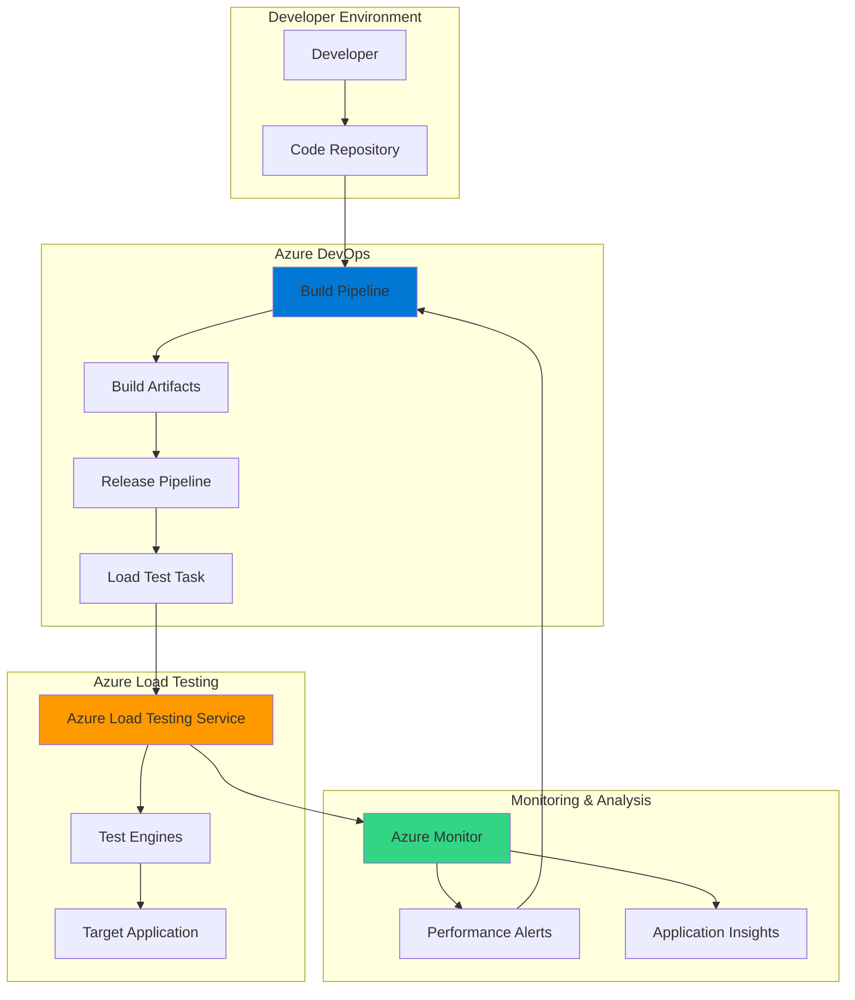

# Continuous Performance Testing with Azure Load Testing and Azure DevOps

## Problem

Organizations struggle to maintain consistent application performance as they deploy new features and updates. Manual performance testing is time-consuming, prone to human error, and often happens too late in the development cycle. Without automated performance validation, teams frequently discover performance degradations only after deployment to production, resulting in poor user experience and costly rollbacks.

## Solution

Integrate Azure Load Testing into Azure DevOps CI/CD pipelines to automatically execute performance tests with every deployment. This approach enables continuous performance validation, automated test execution, and performance regression detection using Azure Monitor alerts, ensuring applications meet performance requirements before reaching production.

## Architecture Diagram



## Prerequisites

1. Azure subscription with appropriate permissions to create resources
2. Azure DevOps organization and project with Azure Load Testing extension installed
3. Azure CLI v2.60 or later installed and configured (or use Azure Cloud Shell)
4. Basic knowledge of Azure DevOps pipelines and YAML
5. Target application deployed in Azure for testing
6. Estimated cost: $50-100 for test execution (varies by test duration and scale)

> **Note**: Ensure your Azure DevOps organization is connected to the same Microsoft Entra ID tenant as your Azure subscription for seamless authentication. Install the [Azure Load Testing extension](https://marketplace.visualstudio.com/items?itemName=AzloadTest.AzloadTesting) from the Azure DevOps Marketplace.

## Preparation

```bash
# Set environment variables for Azure resources
export RESOURCE_GROUP="rg-loadtest-devops-${RANDOM_SUFFIX}"
export LOCATION="eastus"
export SUBSCRIPTION_ID=$(az account show --query id --output tsv)

# Generate unique suffix for resource names
RANDOM_SUFFIX=$(openssl rand -hex 3)

# Set resource names with proper naming conventions
export LOAD_TEST_NAME="alt-perftest-${RANDOM_SUFFIX}"
export APP_INSIGHTS_NAME="ai-perftest-${RANDOM_SUFFIX}"
export TARGET_APP_URL="https://your-app.azurewebsites.net"

# Create resource group
az group create \
    --name ${RESOURCE_GROUP} \
    --location ${LOCATION} \
    --tags purpose=performance-testing environment=demo

# Create Application Insights for monitoring
az monitor app-insights component create \
    --app ${APP_INSIGHTS_NAME} \
    --location ${LOCATION} \
    --resource-group ${RESOURCE_GROUP} \
    --application-type web

# Store Application Insights connection string
export AI_CONNECTION_STRING=$(az monitor app-insights component show \
    --app ${APP_INSIGHTS_NAME} \
    --resource-group ${RESOURCE_GROUP} \
    --query connectionString \
    --output tsv)

echo "✅ Preparation completed successfully"
```

## Steps

1. **Create Azure Load Testing Resource**:

   Azure Load Testing is a fully managed service that generates high-scale load to validate application performance. Creating this resource provides the infrastructure needed to execute JMeter-based performance tests at scale, with built-in integration for Azure services monitoring and automatic metrics collection.

   ```bash
   # Create Azure Load Testing resource
   az load create \
       --name ${LOAD_TEST_NAME} \
       --resource-group ${RESOURCE_GROUP} \
       --location ${LOCATION} \
       --tags environment=demo purpose=cicd
   
   # Get the Load Testing resource ID for RBAC assignment
   export LOAD_TEST_ID=$(az load show \
       --name ${LOAD_TEST_NAME} \
       --resource-group ${RESOURCE_GROUP} \
       --query id \
       --output tsv)
   
   echo "✅ Azure Load Testing resource created: ${LOAD_TEST_NAME}"
   ```

   The Load Testing resource is now ready to execute performance tests. This managed service handles test infrastructure provisioning, scaling, and result aggregation automatically, eliminating the operational overhead of managing load testing infrastructure.

2. **Create JMeter Test Script**:

   JMeter test scripts define the load patterns and scenarios for performance testing. Creating a comprehensive test script that simulates realistic user behavior is crucial for obtaining meaningful performance insights. This script will be version-controlled and executed automatically in the CI/CD pipeline.

   ```bash
   # Create test script directory
   mkdir -p ./loadtest-scripts
   
   # Create a sample JMeter test script
   cat > ./loadtest-scripts/performance-test.jmx << 'EOF'
   <?xml version="1.0" encoding="UTF-8"?>
   <jmeterTestPlan version="1.2" properties="5.0">
     <hashTree>
       <TestPlan guiclass="TestPlanGui" testclass="TestPlan" testname="API Performance Test">
         <elementProp name="TestPlan.user_defined_variables" elementType="Arguments">
           <collectionProp name="Arguments.arguments">
             <elementProp name="HOST" elementType="Argument">
               <stringProp name="Argument.name">HOST</stringProp>
               <stringProp name="Argument.value">${__P(host,example.com)}</stringProp>
             </elementProp>
           </collectionProp>
         </elementProp>
       </TestPlan>
       <hashTree>
         <ThreadGroup guiclass="ThreadGroupGui" testclass="ThreadGroup" testname="Users">
           <intProp name="ThreadGroup.num_threads">50</intProp>
           <intProp name="ThreadGroup.ramp_time">30</intProp>
           <longProp name="ThreadGroup.duration">180</longProp>
         </ThreadGroup>
         <hashTree>
           <HTTPSamplerProxy guiclass="HttpTestSampleGui" testclass="HTTPSamplerProxy" testname="GET Homepage">
             <stringProp name="HTTPSampler.domain">${HOST}</stringProp>
             <stringProp name="HTTPSampler.protocol">https</stringProp>
             <stringProp name="HTTPSampler.path">/</stringProp>
             <stringProp name="HTTPSampler.method">GET</stringProp>
           </HTTPSamplerProxy>
         </hashTree>
       </hashTree>
     </hashTree>
   </jmeterTestPlan>
   EOF
   
   echo "✅ JMeter test script created"
   ```

3. **Configure Load Test with YAML**:

   The load test configuration YAML file defines test parameters, pass/fail criteria, and monitoring settings. This configuration-as-code approach ensures consistency across environments and enables version control of performance requirements alongside application code.

   ```bash
   # Create load test configuration
   cat > ./loadtest-scripts/loadtest-config.yaml << EOF
   version: v0.1
   testId: performance-baseline
   displayName: API Performance Baseline Test
   testPlan: performance-test.jmx
   description: Validates API performance meets SLA requirements
   engineInstances: 1
   
   configurationFiles:
   - performance-test.jmx
   
   failureCriteria:
   - avg(response_time_ms) > 1000
   - percentage(error) > 5
   - avg(requests_per_sec) < 100
   
   env:
   - name: host
     value: \${TARGET_APP_URL#https://}
   
   autoStop:
     errorPercentage: 90
     timeWindow: 60
   EOF
   
   echo "✅ Load test configuration created"
   ```

   This configuration establishes performance baselines and automatically fails tests that exceed response time thresholds or error rates, preventing deployment of underperforming code to production.

4. **Create Azure DevOps Pipeline**:

   Azure DevOps pipelines orchestrate the entire CI/CD process, including performance testing. This YAML pipeline definition integrates load testing as a quality gate, ensuring every deployment meets performance standards before progressing through environments.

   ```bash
   # Create Azure Pipeline YAML
   cat > ./azure-pipelines.yml << 'EOF'
   trigger:
   - main
   
   pool:
     vmImage: 'ubuntu-latest'
   
   variables:
     loadTestResource: 'alt-perftest-demo'
     loadTestResourceGroup: 'rg-loadtest-devops'
   
   stages:
   - stage: Build
     jobs:
     - job: BuildApplication
       steps:
       - task: UseDotNet@2
         inputs:
           packageType: 'sdk'
           version: '8.x'
       
       - script: |
           echo "Building application..."
           # Add your build commands here
         displayName: 'Build Application'
       
       - publish: $(System.DefaultWorkingDirectory)
         artifact: drop
   
   - stage: PerformanceTest
     dependsOn: Build
     jobs:
     - job: RunLoadTest
       steps:
       - checkout: self
       
       - task: AzureLoadTest@1
         displayName: 'Execute Load Test'
         inputs:
           azureSubscription: 'Azure-Service-Connection'
           loadTestConfigFile: './loadtest-scripts/loadtest-config.yaml'
           loadTestResource: $(loadTestResource)
           resourceGroup: $(loadTestResourceGroup)
           env: |
             webapp=$(TARGET_APP_URL)
       
       - publish: $(System.DefaultWorkingDirectory)/loadTest
         artifact: loadTestResults
   EOF
   
   echo "✅ Azure DevOps pipeline YAML created"
   ```

5. **Configure Service Connection in Azure DevOps**:

   Service connections enable Azure DevOps to authenticate with Azure resources securely. Creating a service principal with appropriate permissions ensures the pipeline can execute load tests while maintaining security best practices through role-based access control.

   ```bash
   # Create service principal for Azure DevOps
   SP_NAME="sp-loadtest-devops-${RANDOM_SUFFIX}"
   SP_OUTPUT=$(az ad sp create-for-rbac \
       --name ${SP_NAME} \
       --role "Load Test Contributor" \
       --scopes ${LOAD_TEST_ID} \
       --output json)
   
   echo "✅ Service principal created"
   echo "Use this information in Azure DevOps service connection:"
   echo "${SP_OUTPUT}"
   
   # Note: Manual step required in Azure DevOps
   echo ""
   echo "📝 Next steps in Azure DevOps:"
   echo "1. Go to Project Settings > Service Connections"
   echo "2. Create new Azure Resource Manager connection"
   echo "3. Choose 'Service Principal (manual)'"
   echo "4. Use the JSON output above to configure"
   echo "5. Test the connection and save"
   ```

6. **Implement Performance Monitoring and Alerts**:

   Azure Monitor integration provides real-time visibility into performance metrics and enables automated alerting when performance degrades. Setting up proactive monitoring ensures teams are immediately notified of performance issues, enabling rapid response and maintaining application reliability.

   ```bash
   # Create action group for alerts
   az monitor action-group create \
       --name "ag-perftest-alerts" \
       --resource-group ${RESOURCE_GROUP} \
       --short-name "PerfAlerts" \
       --email-receiver \
           name="DevOpsTeam" \
           email="devops@example.com" \
           use-common-alert-schema=true
   
   # Create metric alert for response time
   az monitor metrics alert create \
       --name "alert-high-response-time" \
       --resource-group ${RESOURCE_GROUP} \
       --scopes ${LOAD_TEST_ID} \
       --condition "avg response_time_ms > 1000" \
       --window-size 5m \
       --evaluation-frequency 1m \
       --action "ag-perftest-alerts" \
       --description "Alert when average response time exceeds 1 second"
   
   # Create alert for error rate
   az monitor metrics alert create \
       --name "alert-high-error-rate" \
       --resource-group ${RESOURCE_GROUP} \
       --scopes ${LOAD_TEST_ID} \
       --condition "avg error_percentage > 5" \
       --window-size 5m \
       --evaluation-frequency 1m \
       --action "ag-perftest-alerts" \
       --description "Alert when error rate exceeds 5%"
   
   echo "✅ Performance monitoring and alerts configured"
   ```

   These alerts provide immediate feedback on performance regressions, enabling the team to respond quickly to issues and maintain service level objectives.

## Validation & Testing

1. Verify Azure Load Testing resource creation:

   ```bash
   # Check Load Testing resource status
   az load show \
       --name ${LOAD_TEST_NAME} \
       --resource-group ${RESOURCE_GROUP} \
       --output table
   ```

   Expected output: Resource details showing "Succeeded" provisioning state

2. Test load test execution manually:

   ```bash
   # Create a test run manually
   TEST_RUN=$(az load test create \
       --test-id "manual-test" \
       --load-test-resource ${LOAD_TEST_NAME} \
       --resource-group ${RESOURCE_GROUP} \
       --test-plan "./loadtest-scripts/performance-test.jmx" \
       --display-name "Manual Validation Test" \
       --engine-instances 1 \
       --query testId \
       --output tsv)
   
   echo "Test created: ${TEST_RUN}"
   
   # Run the test
   TEST_RUN_ID=$(az load test-run create \
       --test-id ${TEST_RUN} \
       --load-test-resource ${LOAD_TEST_NAME} \
       --resource-group ${RESOURCE_GROUP} \
       --display-name "Manual Run" \
       --query testRunId \
       --output tsv)
   
   echo "Test run ID: ${TEST_RUN_ID}"
   ```

3. Verify Application Insights integration:

   ```bash
   # Query recent performance data
   az monitor app-insights query \
       --app ${APP_INSIGHTS_NAME} \
       --resource-group ${RESOURCE_GROUP} \
       --analytics-query "requests | summarize avg(duration) by bin(timestamp, 5m) | order by timestamp desc | take 10"
   ```

## Cleanup

1. Remove load test runs and data:

   ```bash
   # List all test runs
   az load test-run list \
       --load-test-resource ${LOAD_TEST_NAME} \
       --resource-group ${RESOURCE_GROUP} \
       --output table
   
   echo "✅ Test run data will be automatically cleaned up after retention period"
   ```

2. Delete Azure Monitor alerts:

   ```bash
   # Delete metric alerts
   az monitor metrics alert delete \
       --name "alert-high-response-time" \
       --resource-group ${RESOURCE_GROUP}
   
   az monitor metrics alert delete \
       --name "alert-high-error-rate" \
       --resource-group ${RESOURCE_GROUP}
   
   # Delete action group
   az monitor action-group delete \
       --name "ag-perftest-alerts" \
       --resource-group ${RESOURCE_GROUP}
   
   echo "✅ Monitoring alerts deleted"
   ```

3. Remove service principal:

   ```bash
   # Get service principal ID
   SP_ID=$(az ad sp list \
       --display-name ${SP_NAME} \
       --query "[0].id" \
       --output tsv)
   
   # Delete service principal
   az ad sp delete --id ${SP_ID}
   
   echo "✅ Service principal deleted"
   ```

4. Delete resource group and all resources:

   ```bash
   # Delete resource group
   az group delete \
       --name ${RESOURCE_GROUP} \
       --yes \
       --no-wait
   
   echo "✅ Resource group deletion initiated"
   echo "Note: Complete deletion may take several minutes"
   ```

## Discussion

Azure Load Testing integrated with Azure DevOps creates a powerful automated performance validation framework that shifts performance testing left in the development lifecycle. This approach follows the principles outlined in the [Azure Well-Architected Framework](https://learn.microsoft.com/en-us/azure/architecture/framework/), particularly focusing on performance efficiency and operational excellence. By embedding performance tests in CI/CD pipelines, teams can detect and address performance issues before they impact production users.

The combination of Azure Load Testing's managed infrastructure and Azure DevOps' pipeline orchestration eliminates the traditional barriers to continuous performance testing. As documented in the [Azure Load Testing best practices guide](https://learn.microsoft.com/en-us/azure/load-testing/overview-what-is-azure-load-testing), this integration enables teams to maintain consistent performance standards across releases while reducing the operational overhead of managing load testing infrastructure. The Azure Load Testing extension for Azure DevOps provides seamless integration through the [AzureLoadTest@1 task](https://learn.microsoft.com/en-us/azure/devops/pipelines/tasks/test/azure-load-testing).

From a cost optimization perspective, the consumption-based pricing model of Azure Load Testing ensures you only pay for actual test execution time. The service automatically provisions and de-provisions test infrastructure, eliminating idle resource costs. For detailed pricing guidance, refer to the [Azure Load Testing pricing documentation](https://azure.microsoft.com/en-us/pricing/details/load-testing/).

The integration with Azure Monitor and Application Insights provides comprehensive observability into both test execution and application performance. This unified monitoring approach, as described in the [Azure Monitor documentation](https://learn.microsoft.com/en-us/azure/azure-monitor/), enables correlation between load test results and application metrics, facilitating rapid root cause analysis of performance issues. For advanced scenarios, consider implementing custom metrics as outlined in the [Application Insights custom metrics guide](https://learn.microsoft.com/en-us/azure/azure-monitor/app/api-custom-events-metrics).

> **Tip**: Use Azure Load Testing's comparison features to track performance trends across multiple test runs. This helps identify gradual performance degradation that might not trigger immediate alerts but could impact user experience over time.

## Challenge

Extend this solution by implementing these enhancements:

1. Create multi-region load tests that simulate global user traffic patterns and validate application performance across different Azure regions using the `regionwise-engines` parameter
2. Implement automated baseline testing that dynamically adjusts pass/fail criteria based on historical performance data using Azure Data Explorer queries
3. Add integration with Azure Chaos Studio to combine load testing with chaos engineering for comprehensive resilience validation
4. Build a custom dashboard using Azure Workbooks that correlates load test results with application telemetry and deployment history
5. Develop a feedback loop that automatically scales application resources based on load test results and performance predictions using Azure Automation

## Infrastructure Code

### Available Infrastructure as Code:

- [Infrastructure Code Overview](code/README.md) - Detailed description of all infrastructure components
- [Bicep](code/bicep/) - Azure Bicep templates
- [Bash CLI Scripts](code/scripts/) - Example bash scripts using Azure CLI commands to deploy infrastructure
- [Terraform](code/terraform/) - Terraform configuration files