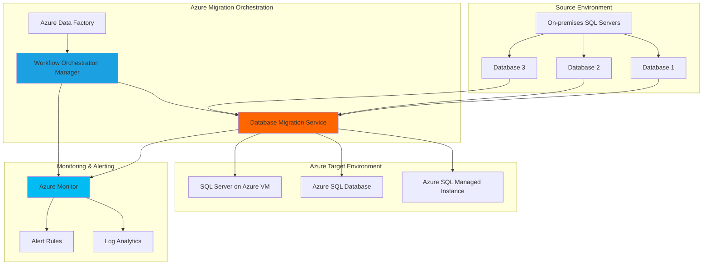

# Coordinated Database Migration with Airflow Workflows

## Problem

Enterprise organizations managing complex multi-database environments face significant challenges when migrating on-premises databases to Azure. Manual migration processes lack coordination between multiple databases, provide insufficient visibility into migration progress, and offer limited error handling capabilities. Without automated orchestration, database migrations often experience extended downtime, data inconsistencies, and require extensive manual intervention to coordinate dependencies between related databases.

## Solution

This solution creates an intelligent database migration orchestration system using Azure Data Factory's Workflow Orchestration Manager (Apache Airflow) combined with Azure Database Migration Service. The Apache Airflow workflows coordinate multi-database migrations, implement dependency management, provide real-time monitoring through Azure Monitor, and enable automated rollback capabilities. This approach minimizes downtime, ensures data consistency, and provides comprehensive visibility throughout the migration process.

## Architecture Diagram



## Prerequisites

1. Azure subscription with appropriate permissions for Azure Data Factory, Database Migration Service, and Azure Monitor
2. Azure CLI v2.50.0 or later installed and configured (or Azure CloudShell)
3. On-premises SQL Server instances with network connectivity to Azure
4. Understanding of Apache Airflow DAG concepts and Python programming
5. Estimated cost: $150-300/month for development environment (varies by migration volume and target services)

> **Note**: This recipe uses Azure Data Factory's Workflow Orchestration Manager for Apache Airflow. Microsoft recommends migrating to Apache Airflow in Microsoft Fabric for new projects, but existing ADF users can continue using this service.

## Preparation

```bash
# Set environment variables for Azure resources
export RESOURCE_GROUP="rg-db-migration-orchestration"
export LOCATION="eastus"
export SUBSCRIPTION_ID=$(az account show --query id --output tsv)

# Generate unique suffix for resource names
RANDOM_SUFFIX=$(openssl rand -hex 3)

# Set resource names with unique suffix
export DATA_FACTORY_NAME="adf-migration-${RANDOM_SUFFIX}"
export DMS_NAME="dms-migration-${RANDOM_SUFFIX}"
export LOG_ANALYTICS_NAME="law-migration-${RANDOM_SUFFIX}"
export STORAGE_ACCOUNT_NAME="st${RANDOM_SUFFIX}migration"

# Create resource group
az group create \
    --name ${RESOURCE_GROUP} \
    --location ${LOCATION} \
    --tags purpose=database-migration environment=demo

echo "✅ Resource group created: ${RESOURCE_GROUP}"

# Create Log Analytics workspace for monitoring
az monitor log-analytics workspace create \
    --resource-group ${RESOURCE_GROUP} \
    --workspace-name ${LOG_ANALYTICS_NAME} \
    --location ${LOCATION} \
    --sku PerGB2018

LOG_ANALYTICS_ID=$(az monitor log-analytics workspace show \
    --resource-group ${RESOURCE_GROUP} \
    --workspace-name ${LOG_ANALYTICS_NAME} \
    --query id --output tsv)

echo "✅ Log Analytics workspace created: ${LOG_ANALYTICS_NAME}"

# Create storage account for Airflow DAGs and migration artifacts
az storage account create \
    --name ${STORAGE_ACCOUNT_NAME} \
    --resource-group ${RESOURCE_GROUP} \
    --location ${LOCATION} \
    --sku Standard_LRS \
    --kind StorageV2 \
    --access-tier Hot

echo "✅ Storage account created: ${STORAGE_ACCOUNT_NAME}"
```

## Steps

1. **Create Azure Data Factory with Workflow Orchestration Manager**:

   Azure Data Factory's Workflow Orchestration Manager provides a fully managed Apache Airflow environment that eliminates infrastructure management while providing enterprise-grade security and monitoring. This managed service automatically scales Airflow workers based on workload demands and integrates seamlessly with Azure monitoring services, making it ideal for orchestrating complex database migration workflows.

   ```bash
   # Create Azure Data Factory
   az datafactory create \
       --resource-group ${RESOURCE_GROUP} \
       --factory-name ${DATA_FACTORY_NAME} \
       --location ${LOCATION}
   
   echo "✅ Azure Data Factory created: ${DATA_FACTORY_NAME}"
   
   # Create managed virtual network for secure connectivity
   az datafactory managed-virtual-network create \
       --factory-name ${DATA_FACTORY_NAME} \
       --resource-group ${RESOURCE_GROUP} \
       --name "default"
   
   echo "✅ Managed virtual network configured"
   ```

   The Data Factory is now established with a secure managed virtual network that enables private connectivity to on-premises systems and Azure services. This foundation provides the orchestration platform for coordinating complex multi-database migration workflows with built-in security and monitoring capabilities.

2. **Configure Database Migration Service**:

   Azure Database Migration Service provides a reliable, scalable platform for migrating databases with minimal downtime. The service supports both online and offline migration modes, handles schema and data migration, and provides detailed progress tracking through Azure Monitor integration.

   ```bash
   # Create Database Migration Service
   az dms create \
       --resource-group ${RESOURCE_GROUP} \
       --name ${DMS_NAME} \
       --location ${LOCATION} \
       --sku Standard_4vCores
   
   DMS_RESOURCE_ID=$(az dms show \
       --resource-group ${RESOURCE_GROUP} \
       --name ${DMS_NAME} \
       --query id --output tsv)
   
   echo "✅ Database Migration Service created: ${DMS_NAME}"
   
   # Configure diagnostic settings for DMS monitoring
   az monitor diagnostic-settings create \
       --resource ${DMS_RESOURCE_ID} \
       --name "dms-diagnostics" \
       --workspace ${LOG_ANALYTICS_ID} \
       --logs '[{"category":"DataMigration","enabled":true}]' \
       --metrics '[{"category":"AllMetrics","enabled":true}]'
   
   echo "✅ DMS monitoring configured"
   ```

   The Database Migration Service is now ready to handle multiple concurrent migrations with comprehensive logging and metrics collection. This configuration enables automated monitoring of migration progress, performance metrics, and error detection through Azure Monitor integration.

3. **Create Airflow DAG for Migration Orchestration**:

   Apache Airflow DAGs (Directed Acyclic Graphs) define the migration workflow as code, enabling version control, testing, and automated execution. This DAG coordinates multiple database migrations, implements dependency management, and provides retry logic for resilient migration operations.

   ```bash
   # Create DAG storage container
   STORAGE_KEY=$(az storage account keys list \
       --resource-group ${RESOURCE_GROUP} \
       --account-name ${STORAGE_ACCOUNT_NAME} \
       --query '[0].value' --output tsv)
   
   az storage container create \
       --name "airflow-dags" \
       --account-name ${STORAGE_ACCOUNT_NAME} \
       --account-key ${STORAGE_KEY}
   
   # Create the migration orchestration DAG
   cat > migration_orchestration_dag.py << 'EOF'
   from datetime import datetime, timedelta
   from airflow import DAG
   from airflow.operators.python import PythonOperator
   from airflow.operators.bash import BashOperator
   from airflow.utils.trigger_rule import TriggerRule
   import json
   import logging
   
   # DAG configuration
   default_args = {
       'owner': 'migration-team',
       'depends_on_past': False,
       'start_date': datetime(2025, 1, 1),
       'email_on_failure': True,
       'email_on_retry': False,
       'retries': 2,
       'retry_delay': timedelta(minutes=5)
   }
   
   dag = DAG(
       'database_migration_orchestration',
       default_args=default_args,
       description='Intelligent database migration workflow',
       schedule_interval=None,  # Triggered manually
       catchup=False,
       tags=['migration', 'database', 'orchestration']
   )
   
   def validate_migration_readiness(**context):
       """Validate source databases are ready for migration"""
       logging.info("Validating migration readiness...")
       # Implementation would include connectivity checks,
       # backup verification, and dependency analysis
       return {"status": "ready", "databases": ["db1", "db2", "db3"]}
   
   def start_database_migration(database_name, **context):
       """Initiate migration for specific database"""
       logging.info(f"Starting migration for {database_name}")
       # Implementation would call Azure CLI or REST API
       # to start DMS migration
       return f"Migration started for {database_name}"
   
   def monitor_migration_progress(database_name, **context):
       """Monitor migration progress and handle errors"""
       logging.info(f"Monitoring migration progress for {database_name}")
       # Implementation would check DMS status
       return f"Migration progress monitored for {database_name}"
   
   # Task definitions
   validate_readiness = PythonOperator(
       task_id='validate_migration_readiness',
       python_callable=validate_migration_readiness,
       dag=dag
   )
   
   # Database migration tasks with dependencies
   migrate_db1 = PythonOperator(
       task_id='migrate_database_1',
       python_callable=start_database_migration,
       op_kwargs={'database_name': 'database_1'},
       dag=dag
   )
   
   migrate_db2 = PythonOperator(
       task_id='migrate_database_2',
       python_callable=start_database_migration,
       op_kwargs={'database_name': 'database_2'},
       dag=dag
   )
   
   migrate_db3 = PythonOperator(
       task_id='migrate_database_3',
       python_callable=start_database_migration,
       op_kwargs={'database_name': 'database_3'},
       dag=dag
   )
   
   # Monitoring tasks
   monitor_db1 = PythonOperator(
       task_id='monitor_database_1',
       python_callable=monitor_migration_progress,
       op_kwargs={'database_name': 'database_1'},
       dag=dag
   )
   
   monitor_db2 = PythonOperator(
       task_id='monitor_database_2',
       python_callable=monitor_migration_progress,
       op_kwargs={'database_name': 'database_2'},
       dag=dag
   )
   
   monitor_db3 = PythonOperator(
       task_id='monitor_database_3',
       python_callable=monitor_migration_progress,
       op_kwargs={'database_name': 'database_3'},
       dag=dag
   )
   
   # Define dependencies
   validate_readiness >> [migrate_db1, migrate_db2]
   migrate_db1 >> monitor_db1 >> migrate_db3
   migrate_db2 >> monitor_db2 >> migrate_db3
   migrate_db3 >> monitor_db3
   EOF
   
   # Upload DAG to storage
   az storage blob upload \
       --container-name "airflow-dags" \
       --file migration_orchestration_dag.py \
       --name "migration_orchestration_dag.py" \
       --account-name ${STORAGE_ACCOUNT_NAME} \
       --account-key ${STORAGE_KEY}
   
   echo "✅ Migration orchestration DAG created and uploaded"
   ```

   The Airflow DAG now defines a comprehensive migration workflow with task dependencies, error handling, and monitoring capabilities. This code-based approach enables version control, testing, and collaborative development of migration processes while providing detailed execution tracking and retry logic.

4. **Configure Azure Monitor Alerts for Migration Monitoring**:

   Azure Monitor provides real-time visibility into migration progress, performance metrics, and error conditions. Setting up comprehensive alerting ensures immediate notification of migration issues, enabling rapid response to problems and maintaining migration SLA compliance.

   ```bash
   # Create action group for notifications
   az monitor action-group create \
       --resource-group ${RESOURCE_GROUP} \
       --name "migration-alerts" \
       --short-name "migration" \
       --action email migration-team admin@company.com
   
   ACTION_GROUP_ID=$(az monitor action-group show \
       --resource-group ${RESOURCE_GROUP} \
       --name "migration-alerts" \
       --query id --output tsv)
   
   # Create alert rule for migration failures
   az monitor metrics alert create \
       --name "migration-failure-alert" \
       --resource-group ${RESOURCE_GROUP} \
       --scopes ${DMS_RESOURCE_ID} \
       --condition "count static.microsoft.datamigration/services.MigrationErrors > 0" \
       --window-size 5m \
       --evaluation-frequency 1m \
       --severity 1 \
       --action ${ACTION_GROUP_ID} \
       --description "Alert when database migration errors occur"
   
   # Create alert rule for high migration duration
   az monitor metrics alert create \
       --name "long-migration-alert" \
       --resource-group ${RESOURCE_GROUP} \
       --scopes ${DMS_RESOURCE_ID} \
       --condition "average static.microsoft.datamigration/services.MigrationDuration > 3600" \
       --window-size 15m \
       --evaluation-frequency 5m \
       --severity 2 \
       --action ${ACTION_GROUP_ID} \
       --description "Alert when migration duration exceeds 1 hour"
   
   echo "✅ Azure Monitor alerts configured for migration monitoring"
   ```

   The monitoring system now provides automated alerting for migration failures and performance issues. This proactive monitoring enables rapid response to problems, reducing downtime and ensuring migration success through early detection of issues.

5. **Create Self-Hosted Integration Runtime for Secure Connectivity**:

   Self-hosted Integration Runtime enables secure connectivity between on-premises databases and Azure services without exposing databases to the public internet. This component provides the network bridge required for Database Migration Service to access on-premises SQL Server instances while maintaining enterprise security requirements.

   ```bash
   # Create integration runtime
   az datafactory integration-runtime self-hosted create \
       --factory-name ${DATA_FACTORY_NAME} \
       --resource-group ${RESOURCE_GROUP} \
       --name "OnPremisesIR" \
       --description "Self-hosted IR for database migration"
   
   # Get authentication key for IR installation
   IR_AUTH_KEY=$(az datafactory integration-runtime list-auth-key \
       --factory-name ${DATA_FACTORY_NAME} \
       --resource-group ${RESOURCE_GROUP} \
       --integration-runtime-name "OnPremisesIR" \
       --query authKey1 --output tsv)
   
   echo "✅ Integration Runtime created"
   echo "Integration Runtime Auth Key: ${IR_AUTH_KEY}"
   echo "Install this IR on your on-premises server using this key"
   
   # Create linked service for on-premises SQL Server
   cat > sqlserver_linked_service.json << EOF
   {
       "name": "OnPremisesSqlServer",
       "properties": {
           "type": "SqlServer",
           "connectVia": {
               "referenceName": "OnPremisesIR",
               "type": "IntegrationRuntimeReference"
           },
           "typeProperties": {
               "connectionString": "Server=your-onprem-server;Database=master;Integrated Security=True;",
               "encryptedCredential": ""
           }
       }
   }
   EOF
   
   echo "✅ Linked service configuration created for on-premises connectivity"
   ```

   The Integration Runtime configuration establishes secure connectivity between your on-premises environment and Azure. This hybrid connectivity model ensures that sensitive database traffic never traverses the public internet while enabling Azure services to orchestrate and monitor migration operations.

6. **Deploy Workflow Orchestration Manager Environment**:

   The Workflow Orchestration Manager provides a fully managed Apache Airflow environment within Azure Data Factory. This service handles Airflow infrastructure, scaling, security, and monitoring, allowing you to focus on developing migration workflows without managing underlying infrastructure.

   ```bash
   # Create Workflow Orchestration Manager (Note: This is done via Azure portal)
   # The following shows the expected configuration
   cat > airflow_config.json << EOF
   {
       "airflowVersion": "2.6.3",
       "nodeSize": "Standard_D2s_v3",
       "nodeCount": {
           "minimum": 1,
           "maximum": 3,
           "current": 1
       },
       "environment": {
           "variables": {
               "MIGRATION_STORAGE_ACCOUNT": "${STORAGE_ACCOUNT_NAME}",
               "DMS_RESOURCE_GROUP": "${RESOURCE_GROUP}",
               "LOG_ANALYTICS_WORKSPACE": "${LOG_ANALYTICS_NAME}"
           }
       },
       "packages": [
           "azure-identity",
           "azure-mgmt-datamigration",
           "azure-monitor-query"
       ]
   }
   EOF
   
   echo "✅ Airflow environment configuration prepared"
   echo "Complete the Workflow Orchestration Manager setup in Azure portal"
   echo "Use the configuration in airflow_config.json"
   
   # Configure diagnostic settings for Airflow monitoring
   DATA_FACTORY_ID=$(az datafactory show \
       --resource-group ${RESOURCE_GROUP} \
       --name ${DATA_FACTORY_NAME} \
       --query id --output tsv)
   
   az monitor diagnostic-settings create \
       --resource ${DATA_FACTORY_ID} \
       --name "airflow-diagnostics" \
       --workspace ${LOG_ANALYTICS_ID} \
       --logs '[{"category":"PipelineRuns","enabled":true},{"category":"TriggerRuns","enabled":true},{"category":"ActivityRuns","enabled":true}]' \
       --metrics '[{"category":"AllMetrics","enabled":true}]'
   
   echo "✅ Airflow monitoring configured"
   ```

   The Workflow Orchestration Manager environment is now configured with proper monitoring, scaling, and security settings. This managed Airflow service provides enterprise-grade orchestration capabilities while eliminating the operational overhead of managing Airflow infrastructure.

## Validation & Testing

1. **Verify Data Factory and Workflow Orchestration Manager setup**:

   ```bash
   # Check Data Factory status
   az datafactory show \
       --resource-group ${RESOURCE_GROUP} \
       --name ${DATA_FACTORY_NAME} \
       --output table
   
   # Verify integration runtime status
   az datafactory integration-runtime show \
       --factory-name ${DATA_FACTORY_NAME} \
       --resource-group ${RESOURCE_GROUP} \
       --name "OnPremisesIR" \
       --output table
   ```

   Expected output: Data Factory status should show "Succeeded" and Integration Runtime should show "Online" status.

2. **Test Database Migration Service connectivity**:

   ```bash
   # Verify DMS service status
   az dms show \
       --resource-group ${RESOURCE_GROUP} \
       --name ${DMS_NAME} \
       --output table
   
   # Check diagnostic settings
   az monitor diagnostic-settings list \
       --resource ${DMS_RESOURCE_ID} \
       --output table
   ```

   Expected output: DMS should show "Running" state with diagnostic settings enabled.

3. **Validate monitoring and alerting configuration**:

   ```bash
   # Check alert rules
   az monitor metrics alert list \
       --resource-group ${RESOURCE_GROUP} \
       --output table
   
   # Verify action group configuration
   az monitor action-group show \
       --resource-group ${RESOURCE_GROUP} \
       --name "migration-alerts" \
       --output table
   ```

   Expected output: Alert rules should be enabled with proper action group assignments.

4. **Test Airflow DAG deployment**:

   ```bash
   # Verify DAG upload to storage
   az storage blob list \
       --container-name "airflow-dags" \
       --account-name ${STORAGE_ACCOUNT_NAME} \
       --account-key ${STORAGE_KEY} \
       --output table
   ```

   Expected output: migration_orchestration_dag.py should be listed in the storage container.

## Cleanup

1. **Remove Database Migration Service**:

   ```bash
   # Delete DMS instance
   az dms delete \
       --resource-group ${RESOURCE_GROUP} \
       --name ${DMS_NAME} \
       --yes
   
   echo "✅ Database Migration Service deleted"
   ```

2. **Remove Data Factory and Airflow environment**:

   ```bash
   # Delete Data Factory (includes Workflow Orchestration Manager)
   az datafactory delete \
       --resource-group ${RESOURCE_GROUP} \
       --name ${DATA_FACTORY_NAME} \
       --yes
   
   echo "✅ Data Factory and Airflow environment deleted"
   ```

3. **Remove monitoring and storage resources**:

   ```bash
   # Delete storage account
   az storage account delete \
       --name ${STORAGE_ACCOUNT_NAME} \
       --resource-group ${RESOURCE_GROUP} \
       --yes
   
   # Delete Log Analytics workspace
   az monitor log-analytics workspace delete \
       --resource-group ${RESOURCE_GROUP} \
       --workspace-name ${LOG_ANALYTICS_NAME} \
       --yes
   
   echo "✅ Storage and monitoring resources deleted"
   ```

4. **Remove resource group**:

   ```bash
   # Delete resource group and all remaining resources
   az group delete \
       --name ${RESOURCE_GROUP} \
       --yes \
       --no-wait
   
   echo "✅ Resource group deletion initiated: ${RESOURCE_GROUP}"
   echo "Note: Complete cleanup may take several minutes"
   ```

## Discussion

This intelligent database migration orchestration solution demonstrates how Azure's managed services can transform complex, error-prone manual processes into automated, reliable workflows. By combining Azure Data Factory's Workflow Orchestration Manager with Database Migration Service, organizations gain the benefits of Apache Airflow's powerful workflow orchestration without the operational overhead of managing infrastructure. The solution follows Azure Well-Architected Framework principles by implementing proper monitoring, security, and reliability patterns. For comprehensive guidance on migration best practices, see the [Azure Database Migration Guide](https://docs.microsoft.com/en-us/azure/dms/) and [Data Factory Workflow Orchestration documentation](https://docs.microsoft.com/en-us/azure/data-factory/concepts-workflow-orchestration-manager).

The architectural pattern implemented here enables organizations to handle complex migration scenarios involving database dependencies, custom validation logic, and automated rollback capabilities. Apache Airflow's DAG-based approach provides version control for migration processes, enabling testing and collaborative development of migration workflows. This is particularly valuable for large enterprises managing hundreds of databases with complex interdependencies. For detailed Airflow development guidance, refer to the [Apache Airflow documentation](https://airflow.apache.org/docs/apache-airflow/stable/) and [Azure Monitor integration patterns](https://docs.microsoft.com/en-us/azure/azure-monitor/platform/monitoring-solutions).

From a cost perspective, this solution optimizes expenses through serverless execution models and managed services that scale based on actual usage. The Workflow Orchestration Manager automatically scales Airflow workers based on workload demands, while Database Migration Service charges only for active migration operations. Azure Monitor provides comprehensive observability with pay-per-use pricing for logs and metrics. For cost optimization strategies, review the [Azure Cost Management documentation](https://docs.microsoft.com/en-us/azure/cost-management-billing/) and consider implementing automated resource scheduling for non-production environments.

> **Tip**: Use Azure DevOps or GitHub Actions to implement CI/CD pipelines for your Airflow DAGs, enabling automated testing and deployment of migration workflows. This approach ensures migration processes are properly tested before production use and maintains version control for critical migration logic.

## Challenge

Extend this intelligent migration orchestration solution with these advanced capabilities:

1. **Implement automated database dependency discovery** using Azure SQL Assessment API to automatically map table relationships and foreign key constraints, then dynamically generate migration order in Airflow DAGs.

2. **Add real-time data validation and quality checks** by integrating Azure Data Factory data flows with custom validation logic that compares source and target data during migration, with automatic rollback on validation failures.

3. **Create automated migration testing environments** using Azure Container Instances to spin up temporary database replicas for migration testing, with automated cleanup and reporting through Azure Logic Apps.

4. **Develop intelligent migration scheduling** using Azure Machine Learning to analyze historical migration patterns and automatically optimize migration timing based on database size, complexity, and network performance predictions.

5. **Implement cross-region disaster recovery orchestration** by extending the Airflow workflows to coordinate database migrations across multiple Azure regions with automated failover testing and documentation generation.

## Infrastructure Code

*Infrastructure code will be generated after recipe approval.*