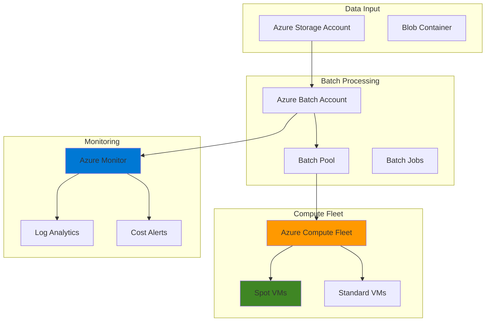

# Cost-Efficient Batch Processing with Azure Compute Fleet and Azure Batch

## Problem

Organizations processing large datasets face significant compute costs when using traditional dedicated virtual machines for batch workloads. These workloads often require substantial compute resources for short periods, leading to overprovisioning and wasted capacity. Without intelligent resource management, companies experience unpredictable costs, underutilized infrastructure, and poor processing efficiency across varying workload demands.

## Solution

Azure Compute Fleet combined with Azure Batch provides an intelligent, cost-optimized solution that dynamically provisions mixed VM pricing models including spot instances to minimize costs while maintaining processing reliability. This architecture automatically scales compute resources based on workload demands, leverages unused Azure capacity at up to 90% cost savings, and implements fault-tolerant processing patterns that handle spot instance interruptions gracefully.

## Architecture Diagram



## Prerequisites

1. Azure subscription with appropriate permissions for creating compute, storage, and monitoring resources
2. Azure CLI v2.75.0 or later installed and configured (or Azure Cloud Shell)
3. Basic understanding of batch processing concepts and Azure resource management
4. Familiarity with Azure cost management and optimization principles
5. Estimated cost: $50-100 for testing resources (can be minimized with spot instances)

> **Note**: Azure Compute Fleet is currently in preview and requires feature registration. See [Azure Compute Fleet documentation](https://docs.microsoft.com/en-us/azure/azure-compute-fleet/) for current availability.

## Preparation

```bash
# Set environment variables for Azure resources
export RESOURCE_GROUP="rg-batch-fleet-${RANDOM_SUFFIX}"
export LOCATION="eastus"
export SUBSCRIPTION_ID=$(az account show --query id --output tsv)

# Generate unique suffix for resource names
RANDOM_SUFFIX=$(openssl rand -hex 3)

# Set resource names
export STORAGE_ACCOUNT="stbatch${RANDOM_SUFFIX}"
export BATCH_ACCOUNT="batchacct${RANDOM_SUFFIX}"
export FLEET_NAME="compute-fleet-${RANDOM_SUFFIX}"
export LOG_WORKSPACE="log-batch-${RANDOM_SUFFIX}"

# Register Azure Compute Fleet provider (if not already registered)
az provider register --namespace 'Microsoft.AzureFleet'

# Create resource group
az group create \
    --name ${RESOURCE_GROUP} \
    --location ${LOCATION} \
    --tags purpose=batch-processing environment=demo

echo "✅ Resource group created: ${RESOURCE_GROUP}"

# Create storage account for batch data
az storage account create \
    --name ${STORAGE_ACCOUNT} \
    --resource-group ${RESOURCE_GROUP} \
    --location ${LOCATION} \
    --sku Standard_LRS \
    --kind StorageV2

echo "✅ Storage account created: ${STORAGE_ACCOUNT}"
```

## Steps

1. **Create Azure Batch Account with Storage Integration**:

   Azure Batch provides managed batch processing capabilities that automatically handle job scheduling, resource provisioning, and fault tolerance. By integrating with Azure Storage, we establish the foundation for scalable data processing while maintaining secure access to input data and processing results.

   ```bash
   # Create Azure Batch account
   az batch account create \
       --name ${BATCH_ACCOUNT} \
       --resource-group ${RESOURCE_GROUP} \
       --location ${LOCATION} \
       --storage-account ${STORAGE_ACCOUNT}
   
   # Authenticate with the Batch account
   az batch account login \
       --name ${BATCH_ACCOUNT} \
       --resource-group ${RESOURCE_GROUP}
   
   echo "✅ Batch account created with storage integration"
   ```

   The Batch account is now configured with integrated storage capabilities and ready for pool creation. This foundation enables automatic data management, job scheduling, and resource provisioning while maintaining secure access to processing data and results.

2. **Configure Azure Compute Fleet with Mixed Pricing Models**:

   Azure Compute Fleet enables intelligent VM provisioning across multiple pricing models, including spot instances that offer up to 90% cost savings. This service automatically handles instance interruptions and maintains workload availability by diversifying across different VM types and pricing tiers.

   ```bash
   # Create compute fleet with cost-optimized configuration
   az compute-fleet create \
       --fleet-name ${FLEET_NAME} \
       --resource-group ${RESOURCE_GROUP} \
       --location ${LOCATION} \
       --spot-priority-profile '{"capacity": 8, "minCapacity": 0, "maxPricePerVM": 0.05, "evictionPolicy": "Delete", "allocationStrategy": "LowestPrice"}' \
       --regular-priority-profile '{"capacity": 2, "minCapacity": 1, "allocationStrategy": "LowestPrice"}' \
       --vm-sizes-profile '[{"name": "Standard_D2s_v3"}, {"name": "Standard_D4s_v3"}]'
   
   echo "✅ Compute Fleet created with 80% spot, 20% standard capacity"
   ```

   The Compute Fleet is now configured to prioritize cost efficiency by allocating 80% of capacity to spot instances while maintaining 20% standard instances for reliability. This configuration automatically handles spot instance interruptions and ensures continuous processing capability.

3. **Create Batch Pool with Auto-Scaling and Low-Priority Nodes**:

   Azure Batch pools define the compute resources available for job execution. By using low-priority nodes and auto-scaling, the pool optimizes costs while maintaining processing reliability through intelligent resource allocation based on workload demands.

   ```bash
   # Set pool ID
   export POOL_ID="batch-pool-${RANDOM_SUFFIX}"
   
   # Create batch pool with cost optimization
   az batch pool create \
       --id ${POOL_ID} \
       --vm-size Standard_D2s_v3 \
       --image canonical:0001-com-ubuntu-server-focal:20_04-lts \
       --node-agent-sku-id "batch.node.ubuntu 20.04" \
       --target-dedicated-nodes 0 \
       --target-low-priority-nodes 5 \
       --enable-auto-scale \
       --auto-scale-formula '$TargetLowPriorityNodes = min(10, $PendingTasks.GetSample(1 * TimeInterval_Minute, 0).GetAverage() * 2);' \
       --auto-scale-evaluation-interval PT5M
   
   echo "✅ Batch pool created with auto-scaling and low-priority nodes"
   ```

   The Batch pool is now configured with automatic scaling based on pending tasks and optimized for cost efficiency using low-priority nodes. This setup ensures optimal resource utilization while maintaining processing capability for varying workload demands.

4. **Setup Azure Monitor for Cost and Performance Tracking**:

   Azure Monitor provides comprehensive visibility into batch processing costs, performance metrics, and resource utilization patterns. This monitoring foundation enables proactive cost optimization and performance tuning based on actual workload characteristics.

   ```bash
   # Create Log Analytics workspace
   az monitor log-analytics workspace create \
       --workspace-name ${LOG_WORKSPACE} \
       --resource-group ${RESOURCE_GROUP} \
       --location ${LOCATION} \
       --sku PerGB2018
   
   # Get workspace ID for diagnostic settings
   WORKSPACE_ID=$(az monitor log-analytics workspace show \
       --workspace-name ${LOG_WORKSPACE} \
       --resource-group ${RESOURCE_GROUP} \
       --query customerId --output tsv)
   
   # Enable diagnostic settings for batch account
   az monitor diagnostic-settings create \
       --name batch-diagnostics \
       --resource ${BATCH_ACCOUNT} \
       --resource-group ${RESOURCE_GROUP} \
       --resource-type Microsoft.Batch/batchAccounts \
       --workspace ${WORKSPACE_ID} \
       --logs '[{"category":"ServiceLog","enabled":true}]' \
       --metrics '[{"category":"AllMetrics","enabled":true}]'
   
   echo "✅ Azure Monitor configured for cost and performance tracking"
   ```

   Azure Monitor is now capturing detailed metrics and logs from the batch processing environment. This telemetry enables cost analysis, performance optimization, and proactive alerting for both operational issues and cost overruns.

5. **Create Sample Batch Job for Testing**:

   A sample batch job demonstrates the cost-efficient processing capabilities of the integrated Azure Compute Fleet and Azure Batch solution. This job processes data while leveraging spot instances for cost optimization and automatic scaling for performance.

   ```bash
   # Set job ID
   export JOB_ID="sample-processing-job-${RANDOM_SUFFIX}"
   
   # Create batch job
   az batch job create \
       --id ${JOB_ID} \
       --pool-id ${POOL_ID}
   
   # Add sample tasks to demonstrate processing
   for i in {1..5}; do
     az batch task create \
         --job-id ${JOB_ID} \
         --task-id "task-${i}" \
         --command-line "/bin/bash -c 'echo Processing task ${i} on cost-optimized compute && sleep 60 && echo Task ${i} completed'"
   done
   
   # Set job to terminate when all tasks complete
   az batch job set \
       --job-id ${JOB_ID} \
       --on-all-tasks-complete terminateJob
   
   echo "✅ Sample batch job created with 5 processing tasks"
   ```

   The sample batch job is now running with tasks distributed across the cost-optimized compute resources. This demonstrates how the solution automatically provisions resources, executes tasks, and manages costs through intelligent resource allocation.

6. **Configure Cost Alerts and Budget Management**:

   Azure Cost Management provides essential cost control capabilities that monitor spending patterns and trigger alerts when costs approach defined thresholds. This proactive cost management ensures batch processing remains within budget while optimizing for performance.

   ```bash
   # Create cost alert for compute resources
   az monitor metrics alert create \
       --name "batch-resource-alert" \
       --resource-group ${RESOURCE_GROUP} \
       --scopes "/subscriptions/${SUBSCRIPTION_ID}/resourceGroups/${RESOURCE_GROUP}" \
       --condition "avg 'Percentage CPU' > 80" \
       --description "Alert when batch processing resources exceed threshold" \
       --evaluation-frequency 5m \
       --window-size 15m \
       --severity 2
   
   # Create action group for cost notifications
   az monitor action-group create \
       --name "batch-cost-actions" \
       --resource-group ${RESOURCE_GROUP} \
       --short-name "batchcost"
   
   echo "✅ Cost alerts and budget management configured"
   ```

   Cost management is now actively monitoring batch processing expenses with automated alerts. This ensures proactive cost optimization while maintaining processing capability and performance requirements.

## Validation & Testing

1. **Verify Batch Pool Status and Scaling**:

   ```bash
   # Check batch pool status
   az batch pool show \
       --pool-id ${POOL_ID} \
       --query "{State:state,CurrentNodes:currentLowPriorityNodes,TargetNodes:targetLowPriorityNodes,AutoScale:enableAutoScale}" \
       --output table
   
   # Verify auto-scaling configuration
   az batch pool show \
       --pool-id ${POOL_ID} \
       --query "autoScaleFormula" \
       --output tsv
   ```

   Expected output: Pool should show steady state with auto-scaling enabled and nodes provisioning based on workload.

2. **Test Job Execution and Cost Optimization**:

   ```bash
   # Check job status
   az batch job show \
       --job-id ${JOB_ID} \
       --query "{State:state,Priority:priority,PoolInfo:poolInfo.poolId}" \
       --output table
   
   # List task execution status
   az batch task list \
       --job-id ${JOB_ID} \
       --query "[].{TaskId:id,State:state,ExitCode:executionInfo.exitCode}" \
       --output table
   ```

   Expected output: Job should show completed state with all tasks successfully executed on cost-optimized compute resources.

3. **Validate Cost Monitoring and Alerts**:

   ```bash
   # Check compute fleet status
   az compute-fleet show \
       --fleet-name ${FLEET_NAME} \
       --resource-group ${RESOURCE_GROUP} \
       --query "{Name:name,State:properties.provisioningState}" \
       --output table
   
   # Verify monitoring workspace
   az monitor log-analytics workspace show \
       --workspace-name ${LOG_WORKSPACE} \
       --resource-group ${RESOURCE_GROUP} \
       --query "{Name:name,Sku:sku.name,RetentionInDays:retentionInDays}" \
       --output table
   ```

   Expected output: Compute Fleet should show successful provisioning with monitoring workspace active and collecting telemetry.

## Cleanup

1. **Delete Batch Jobs and Pools**:

   ```bash
   # Delete batch job
   az batch job delete \
       --job-id ${JOB_ID} \
       --yes
   
   # Delete batch pool
   az batch pool delete \
       --pool-id ${POOL_ID} \
       --yes
   
   echo "✅ Batch jobs and pools deleted"
   ```

2. **Remove Compute Fleet and Associated Resources**:

   ```bash
   # Delete compute fleet
   az compute-fleet delete \
       --fleet-name ${FLEET_NAME} \
       --resource-group ${RESOURCE_GROUP} \
       --yes \
       --no-wait
   
   # Delete batch account
   az batch account delete \
       --name ${BATCH_ACCOUNT} \
       --resource-group ${RESOURCE_GROUP} \
       --yes
   
   echo "✅ Compute fleet and batch account deleted"
   ```

3. **Remove Monitoring and Storage Resources**:

   ```bash
   # Delete Log Analytics workspace
   az monitor log-analytics workspace delete \
       --workspace-name ${LOG_WORKSPACE} \
       --resource-group ${RESOURCE_GROUP} \
       --yes \
       --force
   
   # Delete storage account
   az storage account delete \
       --name ${STORAGE_ACCOUNT} \
       --resource-group ${RESOURCE_GROUP} \
       --yes
   
   echo "✅ Monitoring and storage resources deleted"
   ```

4. **Remove Resource Group**:

   ```bash
   # Delete resource group and all contained resources
   az group delete \
       --name ${RESOURCE_GROUP} \
       --yes \
       --no-wait
   
   echo "✅ Resource group deletion initiated: ${RESOURCE_GROUP}"
   echo "Note: Deletion may take several minutes to complete"
   ```

## Discussion

Azure Compute Fleet and Azure Batch create a powerful combination for cost-efficient batch processing by intelligently managing mixed VM pricing models and automatic scaling. This architecture is particularly effective for workloads like data processing, scientific computing, and media rendering where cost optimization is critical and processing can tolerate brief interruptions. The solution leverages Azure's unused capacity through spot instances while maintaining reliability through standard instances, following [Azure Well-Architected Framework](https://docs.microsoft.com/en-us/azure/architecture/framework/) principles for cost optimization and operational excellence.

The integration of Azure Compute Fleet with Azure Batch enables sophisticated resource allocation strategies that automatically adapt to workload demands and cost constraints. Spot instances provide significant cost savings (up to 90%) while the fleet's intelligent allocation ensures processing continuity during capacity fluctuations. This approach is documented in the [Azure Compute Fleet documentation](https://docs.microsoft.com/en-us/azure/azure-compute-fleet/) and [Azure Batch best practices](https://docs.microsoft.com/en-us/azure/batch/best-practices) guides.

From a cost management perspective, this solution provides multiple optimization layers including spot instance utilization, automatic scaling based on workload demand, and comprehensive monitoring through Azure Monitor. The combination of proactive cost alerts, budget management, and resource right-sizing ensures predictable costs while maintaining processing performance. Organizations can achieve 60-90% cost reduction compared to traditional dedicated compute approaches while maintaining processing reliability and scalability.

> **Tip**: Use Azure Cost Management and Billing to analyze historical usage patterns and optimize your spot instance pricing strategy. The [Azure cost optimization guide](https://docs.microsoft.com/en-us/azure/cost-management-billing/costs/cost-analysis-common-uses) provides detailed strategies for batch processing workloads.

## Challenge

Extend this solution by implementing these enhancements:

1. **Multi-Region Processing**: Configure Azure Compute Fleet across multiple regions to optimize for capacity availability and further reduce costs by leveraging regional pricing differences.

2. **Advanced Workload Scheduling**: Implement intelligent job scheduling that considers cost patterns, capacity availability, and processing priorities to optimize both cost and performance.

3. **Container-Based Processing**: Integrate Azure Container Instances or Azure Kubernetes Service for containerized batch workloads with improved portability and resource efficiency.

4. **Data Pipeline Integration**: Connect with Azure Data Factory or Azure Synapse Analytics to create end-to-end data processing pipelines with automated triggering and dependency management.

5. **Machine Learning Optimization**: Implement Azure Machine Learning to predict optimal resource allocation patterns and automatically adjust compute fleet configurations based on historical processing patterns.

## Infrastructure Code

*Infrastructure code will be generated after recipe approval.*