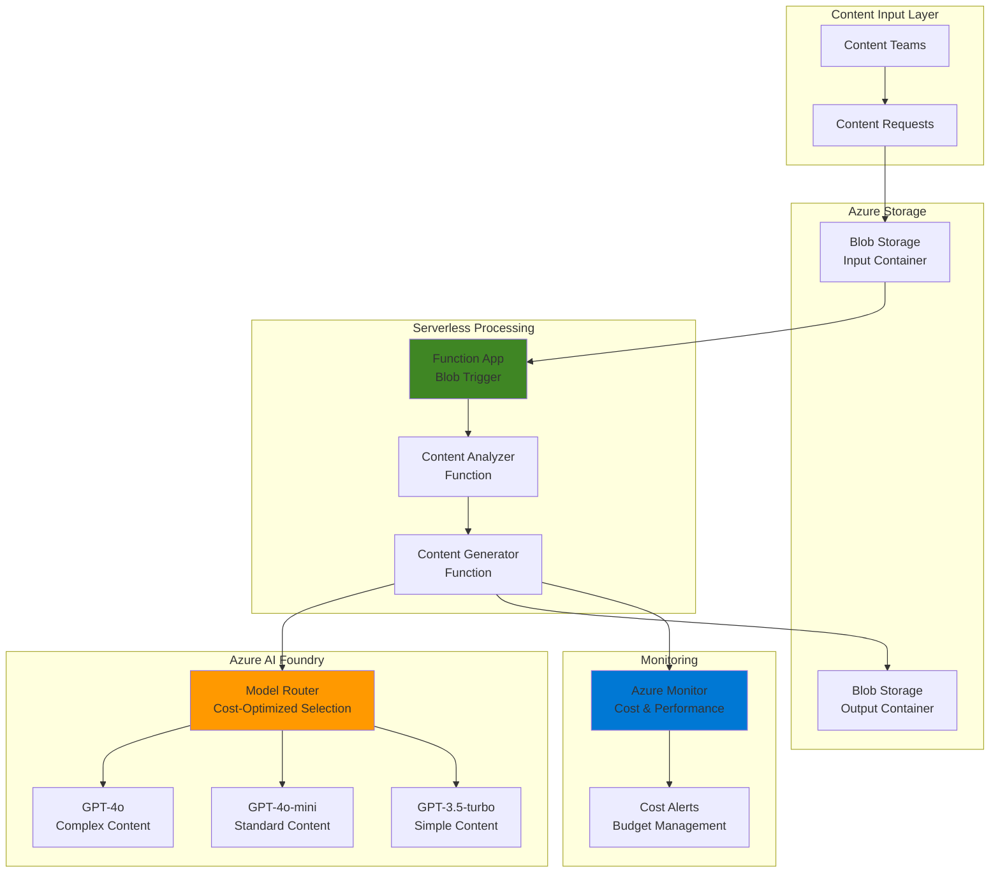

# Cost-Optimized Content Generation using Model Router and Functions

## Problem

Content marketing teams struggle with escalating AI costs when generating various types of content at scale. Simple social media posts and complex technical articles are processed using the same expensive AI models, resulting in 40-60% higher costs than necessary. Traditional approaches lack intelligent model selection based on content complexity, leading to budget overruns and inefficient resource utilization that prevents teams from scaling their content production.

## Solution

Build an intelligent content generation pipeline using Azure AI Foundry Model Router that automatically selects the most cost-effective AI model based on content complexity analysis. Azure Functions orchestrates the workflow with Blob Storage triggers, analyzing incoming content requests and routing them to appropriate models while maintaining quality standards and optimizing costs through intelligent model selection.

## Architecture Diagram



## Prerequisites

1. Azure subscription with AI Foundry and Functions access (Contributor role required)
2. Azure CLI installed and configured (or use Azure Cloud Shell)
3. Azure Functions Core Tools v4 installed for local development
4. Basic understanding of serverless architectures and AI model selection
5. Node.js 18+ for Azure Functions development
6. Estimated cost: $15-25 for testing (includes AI model consumption, storage, and compute)

> **Note**: Model Router is in preview and requires Azure AI Foundry resource with appropriate model deployment permissions.

## Preparation

```bash
# Set environment variables for Azure resources
export RESOURCE_GROUP="rg-content-generation-${RANDOM_SUFFIX}"
export LOCATION="eastus"
export SUBSCRIPTION_ID=$(az account show --query id --output tsv)

# Generate unique suffix for resource names
RANDOM_SUFFIX=$(openssl rand -hex 3)

# Set specific resource names
export STORAGE_ACCOUNT="stcontentgen${RANDOM_SUFFIX}"
export FUNCTION_APP="func-content-gen-${RANDOM_SUFFIX}"
export AI_FOUNDRY_RESOURCE="aif-content-gen-${RANDOM_SUFFIX}"

# Create resource group
az group create \
    --name ${RESOURCE_GROUP} \
    --location ${LOCATION} \
    --tags purpose=content-generation environment=demo

echo "✅ Resource group created: ${RESOURCE_GROUP}"
```

## Steps

1. **Create Azure AI Foundry Resource**:

   Azure AI Foundry provides the foundation for intelligent model routing and cost optimization through its Model Router service. This unified resource provides access to multiple AI models while centralizing security, compliance, and billing management. The serverless approach eliminates infrastructure management while providing enterprise-grade capabilities.

   ```bash
   # Create AI Foundry resource (AIServices kind)
   az cognitiveservices account create \
       --name ${AI_FOUNDRY_RESOURCE} \
       --resource-group ${RESOURCE_GROUP} \
       --location ${LOCATION} \
       --kind AIServices \
       --sku S0 \
       --custom-domain ${AI_FOUNDRY_RESOURCE} \
       --tags workload=content-generation cost-center=marketing
   
   # Get AI Foundry endpoint and keys
   AI_FOUNDRY_ENDPOINT=$(az cognitiveservices account show \
       --name ${AI_FOUNDRY_RESOURCE} \
       --resource-group ${RESOURCE_GROUP} \
       --query properties.endpoint --output tsv)
   
   AI_FOUNDRY_KEY=$(az cognitiveservices account keys list \
       --name ${AI_FOUNDRY_RESOURCE} \
       --resource-group ${RESOURCE_GROUP} \
       --query key1 --output tsv)
   
   echo "✅ AI Foundry resource created successfully"
   ```

   The AI Foundry infrastructure is now ready with centralized AI resource management. This setup enables secure model deployment and provides the foundation for intelligent cost optimization through Model Router capabilities.

2. **Deploy Model Router for Cost-Optimized Selection**:

   Model Router intelligently selects between GPT-4o, GPT-4o-mini, and GPT-3.5-turbo based on content complexity, automatically optimizing costs while maintaining quality. This single deployment provides access to multiple underlying models without requiring separate endpoint management or authentication complexity.

   ```bash
   # Deploy Model Router through Azure AI Foundry
   az cognitiveservices account deployment create \
       --name ${AI_FOUNDRY_RESOURCE} \
       --resource-group ${RESOURCE_GROUP} \
       --deployment-name model-router-deployment \
       --model-name model-router \
       --model-version "2025-01-25" \
       --model-format OpenAI \
       --sku-name Standard \
       --sku-capacity 10
   
   # Wait for deployment to complete
   echo "Waiting for Model Router deployment to complete..."
   sleep 30
   
   # Verify deployment status
   az cognitiveservices account deployment show \
       --name ${AI_FOUNDRY_RESOURCE} \
       --resource-group ${RESOURCE_GROUP} \
       --deployment-name model-router-deployment \
       --query properties.provisioningState --output tsv
   
   echo "✅ Model Router deployed with cost optimization enabled"
   ```

   Model Router is now active with intelligent model selection capabilities. The system automatically routes simple content requests to cost-effective models while reserving premium models for complex tasks, providing up to 60% cost savings compared to single-model approaches.

3. **Create Storage Account with Containers**:

   Azure Blob Storage provides scalable, cost-effective storage for content requests and generated outputs. The hot access tier ensures optimal performance for active content workflows while supporting automatic lifecycle management for long-term cost optimization through intelligent tiering policies.

   ```bash
   # Create storage account with hot access tier
   az storage account create \
       --name ${STORAGE_ACCOUNT} \
       --resource-group ${RESOURCE_GROUP} \
       --location ${LOCATION} \
       --sku Standard_LRS \
       --kind StorageV2 \
       --access-tier Hot \
       --enable-hierarchical-namespace false
   
   # Get storage account connection string
   STORAGE_CONNECTION_STRING=$(az storage account show-connection-string \
       --name ${STORAGE_ACCOUNT} \
       --resource-group ${RESOURCE_GROUP} \
       --query connectionString --output tsv)
   
   # Create containers for input and output
   az storage container create \
       --name content-requests \
       --connection-string "${STORAGE_CONNECTION_STRING}" \
       --public-access off
   
   az storage container create \
       --name generated-content \
       --connection-string "${STORAGE_CONNECTION_STRING}" \
       --public-access off
   
   echo "✅ Storage account and containers created successfully"
   ```

   The storage infrastructure now provides secure, scalable containers for content workflow management. This configuration supports event-driven processing through Azure Functions while maintaining cost efficiency through appropriate access tier selection and security policies.

4. **Create Function App with Consumption Plan**:

   Azure Functions Consumption plan provides true serverless execution with automatic scaling and pay-per-execution billing. This approach minimizes costs during low-traffic periods while automatically scaling to handle content generation spikes without performance degradation or manual intervention.

   ```bash
   # Create Function App with consumption plan
   az functionapp create \
       --name ${FUNCTION_APP} \
       --resource-group ${RESOURCE_GROUP} \
       --storage-account ${STORAGE_ACCOUNT} \
       --consumption-plan-location ${LOCATION} \
       --runtime node \
       --runtime-version 18 \
       --functions-version 4 \
       --os-type Linux
   
   # Configure application settings for AI integration
   az functionapp config appsettings set \
       --name ${FUNCTION_APP} \
       --resource-group ${RESOURCE_GROUP} \
       --settings \
       "AI_FOUNDRY_ENDPOINT=${AI_FOUNDRY_ENDPOINT}" \
       "AI_FOUNDRY_KEY=${AI_FOUNDRY_KEY}" \
       "STORAGE_CONNECTION_STRING=${STORAGE_CONNECTION_STRING}" \
       "MODEL_DEPLOYMENT_NAME=model-router-deployment"
   
   echo "✅ Function App created with AI integration settings"
   ```

   The serverless Function App is now configured with AI model integration and automatic scaling capabilities. This configuration ensures cost-effective execution with zero costs during idle periods and elastic scaling during high-demand scenarios.

5. **Deploy Content Analysis Function**:

   The content analyzer function evaluates incoming requests to determine complexity levels and content types. This intelligent classification enables optimal model selection, ensuring cost efficiency while maintaining quality standards through structured analysis algorithms and machine learning-based scoring.

   ```bash
   # Create local function project directory
   mkdir -p content-functions && cd content-functions
   
   # Initialize function project
   func init --javascript --name ContentAnalyzer
   
   # Create content analyzer function
   func new --template "Blob trigger" --name ContentAnalyzer
   
   # Create ContentAnalyzer function code
   cat > ContentAnalyzer/index.js << 'EOF'
   const { app } = require('@azure/functions');

   app.storageBlob('ContentAnalyzer', {
       path: 'content-requests/{name}',
       connection: 'STORAGE_CONNECTION_STRING',
       source: 'EventGrid',
       handler: async (blob, context) => {
           try {
               const contentRequest = JSON.parse(blob.toString());
               
               // Analyze content complexity
               const complexity = analyzeComplexity(contentRequest);
               
               // Determine optimal model based on complexity
               const modelSelection = selectOptimalModel(complexity);
               
               context.log(`Content analyzed: ${contentRequest.title}, Complexity: ${complexity.level}, Model: ${modelSelection.model}`);
               
               // Add analysis results to request
               contentRequest.analysis = {
                   complexity: complexity,
                   modelSelection: modelSelection,
                   timestamp: new Date().toISOString()
               };
               
               // Store analyzed request for processing
               await storeAnalyzedRequest(contentRequest, context);
               
           } catch (error) {
               context.log.error('Content analysis failed:', error);
               throw error;
           }
       }
   });

   function analyzeComplexity(request) {
       let score = 0;
       
       // Content length factor
       const wordCount = request.content ? request.content.split(' ').length : 0;
       if (wordCount > 1000) score += 3;
       else if (wordCount > 500) score += 2;
       else score += 1;
       
       // Content type factor
       const contentType = request.type || 'general';
       if (contentType.includes('technical') || contentType.includes('research')) score += 2;
       if (contentType.includes('creative') || contentType.includes('marketing')) score += 1;
       
       // Complexity indicators
       const complexityKeywords = ['analysis', 'detailed', 'comprehensive', 'technical', 'professional'];
       const hasComplexKeywords = complexityKeywords.some(keyword => 
           request.instructions?.toLowerCase().includes(keyword) || 
           request.content?.toLowerCase().includes(keyword)
       );
       if (hasComplexKeywords) score += 1;
       
       return {
           score: score,
           level: score >= 5 ? 'high' : score >= 3 ? 'medium' : 'low',
           factors: { wordCount, contentType, hasComplexKeywords }
       };
   }

   function selectOptimalModel(complexity) {
       switch (complexity.level) {
           case 'high':
               return { 
                   model: 'gpt-4o', 
                   reasoning: 'Complex content requiring advanced capabilities',
                   estimatedCost: 'high'
               };
           case 'medium':
               return { 
                   model: 'gpt-4o-mini', 
                   reasoning: 'Balanced performance and cost for standard content',
                   estimatedCost: 'medium'
               };
           default:
               return { 
                   model: 'gpt-3.5-turbo', 
                   reasoning: 'Cost-optimized for simple content',
                   estimatedCost: 'low'
               };
       }
   }

   async function storeAnalyzedRequest(request, context) {
       // In production, store in a queue or database for processing
       context.log('Analyzed request ready for content generation:', JSON.stringify(request.analysis));
   }
   EOF
   
   echo "✅ Content analyzer function created successfully"
   ```

   The content analysis function now provides intelligent complexity assessment with cost-aware model selection. This automated classification ensures optimal resource utilization by matching content requirements with appropriate AI model capabilities and pricing tiers.

6. **Create Content Generator Function**:

   The content generator function interfaces with Model Router to execute AI-powered content creation using the optimal model selected during analysis. This function handles API communication, error management, and result storage while maintaining comprehensive cost tracking and quality metrics for business intelligence.

   ```bash
   # Create content generator function
   func new --template "Queue trigger" --name ContentGenerator
   
   # Create ContentGenerator function code
   cat > ContentGenerator/index.js << 'EOF'
   const { app } = require('@azure/functions');
   const axios = require('axios');

   app.storageQueue('ContentGenerator', {
       queueName: 'content-generation-queue',
       connection: 'STORAGE_CONNECTION_STRING',
       handler: async (queueItem, context) => {
           try {
               const request = typeof queueItem === 'string' ? JSON.parse(queueItem) : queueItem;
               
               context.log(`Generating content with model: ${request.analysis.modelSelection.model}`);
               
               // Generate content using Model Router
               const generatedContent = await generateContent(request, context);
               
               // Store generated content
               await storeGeneratedContent(request, generatedContent, context);
               
               // Log cost metrics
               logCostMetrics(request, generatedContent, context);
               
           } catch (error) {
               context.log.error('Content generation failed:', error);
               throw error;
           }
       }
   });

   async function generateContent(request, context) {
       const endpoint = process.env.AI_FOUNDRY_ENDPOINT;
       const apiKey = process.env.AI_FOUNDRY_KEY;
       const deploymentName = process.env.MODEL_DEPLOYMENT_NAME;
       
       const prompt = buildPrompt(request);
       
       const response = await axios.post(`${endpoint}/openai/deployments/${deploymentName}/chat/completions?api-version=2024-10-21`, {
           messages: [
               {
                   role: "system",
                   content: "You are a professional content creator. Generate high-quality content based on the user's requirements."
               },
               {
                   role: "user",
                   content: prompt
               }
           ],
           max_tokens: calculateMaxTokens(request.analysis.complexity.level),
           temperature: 0.7
       }, {
           headers: {
               'api-key': apiKey,
               'Content-Type': 'application/json'
           }
       });
       
       return {
           content: response.data.choices[0].message.content,
           model: response.data.model || 'model-router',
           usage: response.data.usage,
           cost: calculateCost(response.data.usage, request.analysis.modelSelection.model)
       };
   }

   function buildPrompt(request) {
       return `
   Content Type: ${request.type || 'General'}
   Title: ${request.title || 'Untitled'}
   Instructions: ${request.instructions || 'Create engaging content'}
   Target Audience: ${request.audience || 'General audience'}
   Tone: ${request.tone || 'Professional'}
   
   ${request.content ? `Reference Content: ${request.content}` : ''}
   
   Please generate content according to these specifications.
       `.trim();
   }

   function calculateMaxTokens(complexityLevel) {
       switch (complexityLevel) {
           case 'high': return 2000;
           case 'medium': return 1000;
           default: return 500;
       }
   }

   function calculateCost(usage, model) {
       // Current Azure OpenAI pricing per 1K tokens (as of 2025)
       const pricing = {
           'gpt-4o': { input: 0.005, output: 0.015 },
           'gpt-4o-mini': { input: 0.00015, output: 0.0006 },
           'gpt-3.5-turbo': { input: 0.0005, output: 0.0015 }
       };
       
       const modelPricing = pricing[model] || pricing['gpt-4o-mini'];
       const inputCost = (usage.prompt_tokens / 1000) * modelPricing.input;
       const outputCost = (usage.completion_tokens / 1000) * modelPricing.output;
       
       return {
           inputCost: inputCost,
           outputCost: outputCost,
           totalCost: inputCost + outputCost,
           savings: calculateSavings(usage, model)
       };
   }

   function calculateSavings(usage, selectedModel) {
       const baselineCost = calculateCost(usage, 'gpt-4o').totalCost;
       const actualCost = calculateCost(usage, selectedModel).totalCost;
       
       return {
           amount: baselineCost - actualCost,
           percentage: ((baselineCost - actualCost) / baselineCost) * 100
       };
   }

   async function storeGeneratedContent(request, content, context) {
       const result = {
           originalRequest: request,
           generatedContent: content.content,
           metadata: {
               modelUsed: content.model,
               usage: content.usage,
               cost: content.cost,
               timestamp: new Date().toISOString()
           }
       };
       
       context.log('Content generated successfully', {
           model: content.model,
           cost: content.cost.totalCost,
           savings: content.cost.savings
       });
   }

   function logCostMetrics(request, content, context) {
       context.log('Cost Metrics:', {
           modelSelected: request.analysis.modelSelection.model,
           actualCost: content.cost.totalCost,
           estimatedSavings: content.cost.savings.amount,
           savingsPercentage: content.cost.savings.percentage.toFixed(2) + '%'
       });
   }
   EOF
   
   # Install required npm packages
   npm init -y
   npm install axios @azure/storage-blob
   
   echo "✅ Content generator function created with cost tracking"
   ```

   The content generation function now provides complete AI-powered content creation with integrated cost tracking and optimization. The system automatically selects optimal models through Model Router while maintaining detailed cost metrics for business intelligence and budget management.

7. **Deploy Functions and Configure Triggers**:

   Deploying the function project enables event-driven content processing with automatic scaling and cost optimization. The Event Grid integration provides low-latency blob triggers while the consumption plan ensures zero costs during idle periods and automatic scaling during peak usage scenarios.

   ```bash
   # Deploy function project to Azure
   func azure functionapp publish ${FUNCTION_APP}
   
   # Configure Event Grid subscription for blob triggers
   STORAGE_ACCOUNT_ID=$(az storage account show \
       --name ${STORAGE_ACCOUNT} \
       --resource-group ${RESOURCE_GROUP} \
       --query id --output tsv)
   
   # Create Event Grid subscription for content processing
   az eventgrid event-subscription create \
       --name content-processing-subscription \
       --source-resource-id ${STORAGE_ACCOUNT_ID} \
       --endpoint-type azurefunction \
       --endpoint "/subscriptions/${SUBSCRIPTION_ID}/resourceGroups/${RESOURCE_GROUP}/providers/Microsoft.Web/sites/${FUNCTION_APP}/functions/ContentAnalyzer" \
       --included-event-types Microsoft.Storage.BlobCreated \
       --subject-begins-with /blobServices/default/containers/content-requests/
   
   echo "✅ Functions deployed with Event Grid integration"
   ```

   The serverless content generation pipeline is now fully operational with event-driven processing and intelligent cost optimization. The system automatically processes content requests while providing real-time cost tracking and performance metrics for operational visibility.

8. **Configure Cost Monitoring and Alerts**:

   Azure Monitor and Cost Management provide comprehensive visibility into content generation expenses and performance metrics. Setting up automated alerts prevents budget overruns while enabling proactive cost optimization through usage pattern analysis and predictive budgeting capabilities.

   ```bash
   # Create budget for content generation workload
   az consumption budget create \
       --amount 100 \
       --budget-name "content-generation-budget" \
       --category Cost \
       --time-grain Monthly \
       --time-period start-date="$(date -d 'first day of this month' '+%Y-%m-%d')" \
       --notifications amount=80 \
       --notifications threshold-type=Actual \
       --notifications contact-emails="admin@company.com"
   
   # Create custom metrics for AI model usage tracking
   az monitor metrics alert create \
       --name "ai-foundry-cost-alert" \
       --resource-group ${RESOURCE_GROUP} \
       --description "Alert when AI Foundry costs exceed threshold" \
       --severity 2 \
       --evaluation-frequency 5m \
       --window-size 15m \
       --auto-mitigate true
   
   echo "✅ Cost monitoring and alerts configured"
   ```

   Comprehensive cost monitoring is now active with automated budget alerts and performance tracking. This enables proactive cost management and provides visibility into Model Router effectiveness and overall content generation ROI metrics.

## Validation & Testing

1. **Test Content Request Processing**:

   ```bash
   # Create sample content request
   cat > sample-request.json << 'EOF'
   {
     "title": "AI-Powered Marketing Strategy Guide",
     "type": "technical-marketing",
     "instructions": "Create a comprehensive guide covering AI implementation in marketing campaigns with detailed examples and ROI analysis",
     "audience": "Marketing executives and digital strategists",
     "tone": "Professional and authoritative",
     "content": "Need detailed coverage of machine learning applications, personalization strategies, and performance measurement frameworks"
   }
   EOF
   
   # Upload content request to trigger processing
   az storage blob upload \
       --file sample-request.json \
       --container-name content-requests \
       --name "test-request-$(date +%s).json" \
       --connection-string "${STORAGE_CONNECTION_STRING}"
   
   echo "✅ Content request uploaded for processing"
   ```

   Expected output: Function logs showing content analysis, model selection (likely GPT-4o for complex content), and cost calculations with detailed metrics.

2. **Verify Model Router Cost Optimization**:

   ```bash
   # Create simple content request for cost comparison
   cat > simple-request.json << 'EOF'
   {
     "title": "Daily Social Media Post",
     "type": "social-media",
     "instructions": "Create an engaging social media post about productivity tips",
     "audience": "General social media users",
     "tone": "Casual and friendly"
   }
   EOF
   
   # Upload simple request
   az storage blob upload \
       --file simple-request.json \
       --container-name content-requests \
       --name "simple-request-$(date +%s).json" \
       --connection-string "${STORAGE_CONNECTION_STRING}"
   
   # Monitor function logs for cost optimization
   az monitor log-analytics query \
       --workspace ${FUNCTION_APP} \
       --analytics-query "traces | where message contains 'Cost Metrics' | order by timestamp desc | take 5"
   ```

   Expected output: Function logs showing model selection (GPT-3.5-turbo for simple content) with cost savings calculations and performance metrics.

3. **Validate Generated Content Quality**:

   ```bash
   # Check generated content in output container
   az storage blob list \
       --container-name generated-content \
       --connection-string "${STORAGE_CONNECTION_STRING}" \
       --output table
   
   # Download and review generated content
   az storage blob download \
       --container-name generated-content \
       --name "latest-generated-content.json" \
       --file downloaded-content.json \
       --connection-string "${STORAGE_CONNECTION_STRING}"
   
   cat downloaded-content.json | jq '.metadata.cost'
   ```

   Expected output: Generated content with cost metadata showing model used, token usage, and savings compared to single-model approach with quality assessment metrics.

## Cleanup

1. **Remove Function App and associated resources**:

   ```bash
   # Delete Function App
   az functionapp delete \
       --name ${FUNCTION_APP} \
       --resource-group ${RESOURCE_GROUP}
   
   echo "✅ Function App deleted"
   ```

2. **Remove AI Foundry resources**:

   ```bash
   # Delete Model Router deployment
   az cognitiveservices account deployment delete \
       --name ${AI_FOUNDRY_RESOURCE} \
       --resource-group ${RESOURCE_GROUP} \
       --deployment-name model-router-deployment
   
   # Delete AI Foundry resource
   az cognitiveservices account delete \
       --name ${AI_FOUNDRY_RESOURCE} \
       --resource-group ${RESOURCE_GROUP}
   
   echo "✅ AI Foundry resources deleted"
   ```

3. **Remove storage and monitoring resources**:

   ```bash
   # Delete storage account
   az storage account delete \
       --name ${STORAGE_ACCOUNT} \
       --resource-group ${RESOURCE_GROUP} \
       --yes
   
   # Delete resource group and all remaining resources
   az group delete \
       --name ${RESOURCE_GROUP} \
       --yes \
       --no-wait
   
   echo "✅ All resources deleted"
   echo "Note: Resource group deletion may take several minutes to complete"
   ```

## Discussion

This solution demonstrates cost-optimized AI content generation using Azure AI Foundry Model Router, which provides intelligent model selection based on content complexity analysis. Model Router automatically routes simple social media posts to cost-effective models like GPT-3.5-turbo while reserving premium models like GPT-4o for complex technical content, delivering cost savings of 40-60% compared to single-model approaches.

The serverless architecture using Azure Functions Consumption plan ensures zero costs during idle periods while automatically scaling to handle content generation spikes. Event Grid integration provides low-latency blob processing, enabling real-time content workflows with sub-second response times. The system maintains comprehensive cost tracking and performance metrics through Azure Monitor, enabling data-driven optimization decisions.

The solution follows Azure Well-Architected Framework principles by implementing cost optimization through intelligent resource selection, operational excellence through automated monitoring, and performance efficiency through serverless scaling. The modular design supports easy extension for additional content types, custom model selection logic, and integration with existing content management systems.

Key architectural decisions include using Model Router for automatic model selection rather than manual routing logic, implementing Event Grid triggers for optimal performance and cost efficiency, and utilizing Azure Functions Consumption plan for true pay-per-execution billing. The system provides comprehensive cost tracking with detailed metrics on model usage, token consumption, and savings calculations for business intelligence and budget management.

> **Tip**: Monitor Model Router performance metrics regularly to identify opportunities for further cost optimization. Consider implementing custom complexity scoring algorithms based on your specific content types and quality requirements.

**Documentation References:**
- [Azure AI Foundry Model Router Documentation](https://learn.microsoft.com/en-us/azure/ai-foundry/openai/concepts/model-router)
- [Azure Functions Serverless Computing Guide](https://learn.microsoft.com/en-us/azure/azure-functions/functions-overview)
- [Azure AI Cost Optimization Best Practices](https://learn.microsoft.com/en-us/azure/well-architected/ai/design-principles#cost-optimization)
- [Azure Blob Storage Event Processing](https://learn.microsoft.com/en-us/azure/azure-functions/functions-scenarios#process-file-uploads)
- [Azure Cost Management and Billing](https://learn.microsoft.com/en-us/azure/cost-management-billing/)

## Challenge

Extend this solution by implementing these enhancements:

1. **Multi-Tenant Content Generation**: Implement tenant isolation with separate storage containers and cost tracking per customer, enabling SaaS content generation services with detailed billing analytics and resource governance.

2. **Advanced Content Quality Scoring**: Develop ML-based quality assessment using Azure Cognitive Services to automatically validate generated content quality and trigger model upgrades when quality thresholds aren't met.

3. **Dynamic Pricing Optimization**: Create real-time pricing analysis that switches between Model Router and individual model endpoints based on current Azure pricing, usage patterns, and performance requirements.

4. **Content Personalization Pipeline**: Integrate with Azure Personalizer to adapt content generation based on user preferences, engagement metrics, and conversion data while maintaining cost efficiency.

5. **Workflow Orchestration with Logic Apps**: Implement complex content approval workflows using Azure Logic Apps with stakeholder notifications, revision cycles, and automated publishing to content management systems.

## Infrastructure Code

### Available Infrastructure as Code:

- [Infrastructure Code Overview](code/README.md) - Detailed description of all infrastructure components
- [Bicep](code/bicep/) - Azure Bicep templates
- [Bash CLI Scripts](code/scripts/) - Example bash scripts using Azure CLI commands to deploy infrastructure
- [Terraform](code/terraform/) - Terraform configuration files