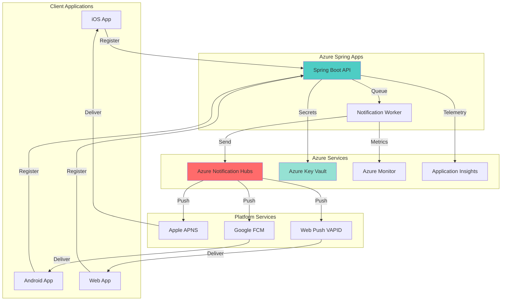

# Cross-Platform Push Notifications with Spring Microservices

## Problem

Modern mobile and web applications require real-time engagement capabilities to keep users informed and drive interaction. However, implementing push notifications across multiple platforms (iOS, Android, Web) requires managing different platform-specific APIs, handling device registrations, and scaling infrastructure. Organizations struggle with the complexity of integrating Apple Push Notification Service (APNS), Firebase Cloud Messaging (FCM), and Web Push protocols while maintaining reliable delivery and monitoring notification performance across millions of devices.

## Solution

This recipe demonstrates building a scalable push notification system using Azure Notification Hubs integrated with Azure Spring Apps microservices. The solution provides a unified API for sending targeted notifications across all platforms, with secure credential management through Azure Key Vault and comprehensive monitoring via Azure Monitor. This serverless-ready architecture automatically scales to handle millions of concurrent notifications while providing detailed delivery metrics.

## Architecture Diagram



## Prerequisites

1. Azure subscription with contributor access
2. Azure CLI v2.46.0 or later installed and configured
3. Java 11 or later for Spring Boot development
4. Firebase project with FCM credentials
5. Apple Developer account with APNS certificates
6. Basic knowledge of Spring Boot and REST APIs
7. Estimated cost: ~$50-100/month for basic usage

> **Note**: Browser push notifications require VAPID keys which can be generated using online tools or Node.js libraries.

## Preparation

```bash
# Set environment variables for Azure resources
export RESOURCE_GROUP="rg-pushnotif-demo"
export LOCATION="eastus"
export SUBSCRIPTION_ID=$(az account show --query id --output tsv)

# Generate unique suffix for resource names
RANDOM_SUFFIX=$(openssl rand -hex 3)

export NOTIFICATION_HUB_NAMESPACE="nhns-${RANDOM_SUFFIX}"
export NOTIFICATION_HUB_NAME="nh-multiplatform"
export SPRING_APPS_NAME="asa-pushnotif-${RANDOM_SUFFIX}"
export KEY_VAULT_NAME="kv-push${RANDOM_SUFFIX}"
export APP_INSIGHTS_NAME="ai-pushnotif-${RANDOM_SUFFIX}"

# Create resource group
az group create \
    --name ${RESOURCE_GROUP} \
    --location ${LOCATION} \
    --tags purpose=recipe environment=demo

echo "✅ Resource group created: ${RESOURCE_GROUP}"

# Create Azure Notification Hub namespace
az notification-hub namespace create \
    --resource-group ${RESOURCE_GROUP} \
    --name ${NOTIFICATION_HUB_NAMESPACE} \
    --location ${LOCATION} \
    --sku Standard

echo "✅ Notification Hub namespace created"

# Create Notification Hub
az notification-hub create \
    --resource-group ${RESOURCE_GROUP} \
    --namespace-name ${NOTIFICATION_HUB_NAMESPACE} \
    --name ${NOTIFICATION_HUB_NAME} \
    --location ${LOCATION}

echo "✅ Notification Hub created: ${NOTIFICATION_HUB_NAME}"

# Create Application Insights
az monitor app-insights component create \
    --app ${APP_INSIGHTS_NAME} \
    --location ${LOCATION} \
    --resource-group ${RESOURCE_GROUP} \
    --application-type web

# Get Application Insights connection string
export APP_INSIGHTS_CONNECTION=$(az monitor app-insights component show \
    --app ${APP_INSIGHTS_NAME} \
    --resource-group ${RESOURCE_GROUP} \
    --query connectionString -o tsv)

echo "✅ Application Insights created"
```

## Steps

1. **Create Azure Key Vault for Secure Credential Storage**:

   Azure Key Vault provides secure storage for sensitive credentials like APNS certificates, FCM server keys, and VAPID keys required for push notifications. This centralized secret management approach eliminates hardcoded credentials in application code and enables secure rotation of platform credentials without application changes. Key Vault's integration with Azure managed identities ensures that only authorized services can access these secrets.

   ```bash
   # Create Key Vault
   az keyvault create \
       --name ${KEY_VAULT_NAME} \
       --resource-group ${RESOURCE_GROUP} \
       --location ${LOCATION} \
       --enable-rbac-authorization false
   
   # Store placeholder secrets (replace with actual values)
   az keyvault secret set \
       --vault-name ${KEY_VAULT_NAME} \
       --name "fcm-server-key" \
       --value "your-fcm-server-key"
   
   az keyvault secret set \
       --vault-name ${KEY_VAULT_NAME} \
       --name "apns-key-id" \
       --value "your-apns-key-id"
   
   az keyvault secret set \
       --vault-name ${KEY_VAULT_NAME} \
       --name "vapid-public-key" \
       --value "your-vapid-public-key"
   
   echo "✅ Key Vault created and secrets stored"
   ```

   The Key Vault now contains all platform-specific credentials needed for push notifications. These secrets will be securely accessed by the Spring Apps instances using managed identities, following the principle of least privilege access.

2. **Configure Platform-Specific Notification Credentials**:

   Each platform requires specific authentication mechanisms: APNS uses certificates or tokens for iOS, FCM requires server keys for Android, and Web Push uses VAPID keys. Azure Notification Hubs abstracts these differences, providing a unified interface while handling platform-specific authentication complexities. This configuration step establishes the trust relationship between Azure and each platform's notification service.

   ```bash
   # Get Notification Hub connection string
   NH_CONNECTION_STRING=$(az notification-hub namespace \
       authorization-rule keys list \
       --resource-group ${RESOURCE_GROUP} \
       --namespace-name ${NOTIFICATION_HUB_NAMESPACE} \
       --name RootManageSharedAccessKey \
       --query primaryConnectionString -o tsv)
   
   # Store connection string in Key Vault
   az keyvault secret set \
       --vault-name ${KEY_VAULT_NAME} \
       --name "notification-hub-connection" \
       --value "${NH_CONNECTION_STRING}"
   
   echo "✅ Notification Hub connection string stored"
   
   # Configure FCM (Google/Android)
   echo "Configure FCM manually in Azure Portal:"
   echo "1. Navigate to Notification Hub > Google (GCM/FCM)"
   echo "2. Enter FCM Server Key from Firebase Console"
   echo "3. Save configuration"
   ```

   Platform credentials are now securely stored and ready for configuration. The manual configuration steps for FCM ensure proper setup through the Azure Portal, where you'll need to provide your Firebase project's server key obtained from the Firebase Console.

3. **Create Azure Spring Apps Environment**:

   Azure Spring Apps provides a fully managed platform for Spring Boot microservices with built-in service discovery, configuration management, and monitoring. This managed environment eliminates infrastructure concerns, allowing developers to focus on business logic while Azure handles scaling, security patches, and high availability. The platform's native integration with other Azure services simplifies the development of cloud-native applications.

   ```bash
   # Create Azure Spring Apps instance
   az spring create \
       --name ${SPRING_APPS_NAME} \
       --resource-group ${RESOURCE_GROUP} \
       --location ${LOCATION} \
       --sku Standard
   
   echo "✅ Azure Spring Apps instance created"
   
   # Create the notification-api app
   az spring app create \
       --name notification-api \
       --service ${SPRING_APPS_NAME} \
       --resource-group ${RESOURCE_GROUP} \
       --runtime-version Java_17 \
       --assign-endpoint
   
   echo "✅ Spring app created"
   
   # Enable system-assigned managed identity
   az spring app identity assign \
       --name notification-api \
       --service ${SPRING_APPS_NAME} \
       --resource-group ${RESOURCE_GROUP} \
       --system-assigned
   
   # Get the identity principal ID
   IDENTITY_PRINCIPAL_ID=$(az spring app identity show \
       --name notification-api \
       --service ${SPRING_APPS_NAME} \
       --resource-group ${RESOURCE_GROUP} \
       --query principalId -o tsv)
   
   echo "✅ Managed identity enabled"
   ```

   The Spring Apps environment is now ready with managed identity enabled. This identity will be used to securely access Key Vault secrets without requiring explicit credentials in the application code, following Azure's best practices for secure service-to-service communication.

4. **Grant Key Vault Access to Spring Apps**:

   Managed identities provide an Azure AD identity for applications to use when connecting to resources that support Azure AD authentication. This eliminates the need for developers to manage credentials in code. By granting the Spring Apps managed identity access to Key Vault, we establish a secure, auditable connection that follows the principle of least privilege access control.

   ```bash
   # Grant Key Vault access to managed identity
   az keyvault set-policy \
       --name ${KEY_VAULT_NAME} \
       --object-id ${IDENTITY_PRINCIPAL_ID} \
       --secret-permissions get list
   
   echo "✅ Key Vault access granted to Spring Apps"
   
   # Configure app settings
   az spring app update \
       --name notification-api \
       --service ${SPRING_APPS_NAME} \
       --resource-group ${RESOURCE_GROUP} \
       --env AZURE_KEYVAULT_URI="https://${KEY_VAULT_NAME}.vault.azure.net/" \
             NOTIFICATION_HUB_NAMESPACE="${NOTIFICATION_HUB_NAMESPACE}" \
             NOTIFICATION_HUB_NAME="${NOTIFICATION_HUB_NAME}" \
             APPLICATIONINSIGHTS_CONNECTION_STRING="${APP_INSIGHTS_CONNECTION}"
   
   echo "✅ Application settings configured"
   ```

   The Spring Apps instance now has secure access to Key Vault secrets and all necessary configuration to connect to Azure services. These environment variables will be available to the Spring Boot application at runtime.

5. **Deploy Spring Boot Notification Service**:

   The Spring Boot microservice acts as the central API for device registration and notification sending. It abstracts platform differences, provides a RESTful interface for client applications, and implements business logic for targeting specific user segments. This service-oriented architecture enables horizontal scaling and independent deployment of notification functionality.

   ```bash
   # Create sample Spring Boot app structure
   mkdir -p notification-service/src/main/java/com/example/notification
   mkdir -p notification-service/src/main/resources
   
   # Create application properties
   cat > notification-service/src/main/resources/application.yml << 'EOF'
   spring:
     application:
       name: notification-api
   azure:
     notification-hub:
       connection-string: ${NOTIFICATION_HUB_CONNECTION}
   management:
     endpoints:
       web:
         exposure:
           include: health,info,metrics
   EOF
   
   # Create basic pom.xml
   cat > notification-service/pom.xml << 'EOF'
   <?xml version="1.0" encoding="UTF-8"?>
   <project xmlns="http://maven.org/2001/POM/4.0.0"
            xmlns:xsi="http://www.w3.org/2001/XMLSchema-instance"
            xsi:schemaLocation="http://maven.org/2001/POM/4.0.0 
            http://maven.org/2001/POM/4.0.0.xsd">
       <modelVersion>4.0.0</modelVersion>
       <parent>
           <groupId>org.springframework.boot</groupId>
           <artifactId>spring-boot-starter-parent</artifactId>
           <version>3.1.0</version>
       </parent>
       <groupId>com.example</groupId>
       <artifactId>notification-service</artifactId>
       <version>1.0</version>
       <dependencies>
           <dependency>
               <groupId>org.springframework.boot</groupId>
               <artifactId>spring-boot-starter-web</artifactId>
           </dependency>
           <dependency>
               <groupId>org.springframework.boot</groupId>
               <artifactId>spring-boot-starter-actuator</artifactId>
           </dependency>
       </dependencies>
       <build>
           <plugins>
               <plugin>
                   <groupId>org.springframework.boot</groupId>
                   <artifactId>spring-boot-maven-plugin</artifactId>
               </plugin>
           </plugins>
       </build>
   </project>
   EOF
   
   echo "✅ Spring Boot application structure created"
   
   # Build and deploy (assuming Maven is available)
   cd notification-service
   mvn clean package -DskipTests
   
   az spring app deploy \
       --name notification-api \
       --service ${SPRING_APPS_NAME} \
       --resource-group ${RESOURCE_GROUP} \
       --artifact-path target/notification-service-1.0.jar
   
   cd ..
   echo "✅ Spring Boot app deployed"
   ```

   The notification service is now deployed and running in Azure Spring Apps. The application is configured to use Azure services through environment variables and will automatically scale based on load.

6. **Implement Device Registration Endpoints**:

   Device registration is crucial for push notifications, as each device must be uniquely identified and associated with platform-specific tokens. The registration process handles token management, user association, and tag-based segmentation for targeted notifications. This implementation supports dynamic device management, allowing users to receive notifications across multiple devices.

   ```bash
   # Create device registration controller
   cat > notification-service/src/main/java/com/example/notification/DeviceController.java << 'EOF'
   package com.example.notification;
   
   import org.springframework.web.bind.annotation.*;
   import org.springframework.http.ResponseEntity;
   
   @RestController
   @RequestMapping("/api/devices")
   public class DeviceController {
       
       @PostMapping("/register")
       public ResponseEntity<String> registerDevice(
           @RequestBody DeviceRegistration registration) {
           // Implementation for device registration
           // Stores platform handle and user tags
           return ResponseEntity.ok("Device registered");
       }
       
       @DeleteMapping("/{deviceId}")
       public ResponseEntity<Void> unregisterDevice(
           @PathVariable String deviceId) {
           // Implementation for device removal
           return ResponseEntity.noContent().build();
       }
   }
   
   class DeviceRegistration {
       public String deviceId;
       public String platform;
       public String token;
   }
   EOF
   
   echo "✅ Device registration endpoints created"
   
   # Test endpoint availability
   APP_URL=$(az spring app show \
       --name notification-api \
       --service ${SPRING_APPS_NAME} \
       --resource-group ${RESOURCE_GROUP} \
       --query properties.url -o tsv)
   
   echo "API available at: ${APP_URL}"
   ```

   The device registration endpoints are now available for client applications to register their devices. These endpoints handle the complexity of managing device tokens across different platforms while providing a simple, unified API.

7. **Configure Monitoring and Analytics**:

   Application Insights provides deep application performance monitoring and real-time analytics for the notification system. It tracks notification delivery rates, platform-specific failures, and API performance metrics. This observability is essential for maintaining high delivery rates and quickly identifying issues affecting user engagement.

   ```bash
   # Create Log Analytics workspace
   LAW_ID=$(az monitor log-analytics workspace create \
       --resource-group ${RESOURCE_GROUP} \
       --workspace-name "law-notifications-${RANDOM_SUFFIX}" \
       --location ${LOCATION} \
       --query id -o tsv)
   
   # Configure diagnostic settings
   az monitor diagnostic-settings create \
       --name "notification-diagnostics" \
       --resource $(az notification-hub namespace show \
           --name ${NOTIFICATION_HUB_NAMESPACE} \
           --resource-group ${RESOURCE_GROUP} \
           --query id -o tsv) \
       --workspace ${LAW_ID} \
       --metrics '[{"category": "AllMetrics", "enabled": true}]'
   
   echo "✅ Monitoring configured"
   
   # Create basic dashboard configuration
   cat > dashboard-config.json << 'EOF'
   {
     "properties": {
       "lenses": {
         "0": {
           "order": 0,
           "parts": {
             "0": {
               "position": {"x": 0, "y": 0, "rowSpan": 4, "colSpan": 6},
               "metadata": {
                 "inputs": [],
                 "type": "Extension/HubsExtension/PartType/MarkdownPart",
                 "settings": {
                   "content": {
                     "settings": {
                       "content": "# Push Notification Metrics\nMonitor notification delivery across platforms",
                       "title": "Dashboard Overview"
                     }
                   }
                 }
               }
             }
           }
         }
       }
     }
   }
   EOF
   
   echo "✅ Monitoring dashboard template created"
   ```

   Comprehensive monitoring is now configured, providing visibility into notification delivery success rates, platform-specific metrics, and system performance. The Log Analytics workspace enables real-time tracking of notification campaigns and quick identification of delivery issues.

8. **Implement Notification Sending Logic**:

   The notification sending implementation handles message formatting, platform-specific payload construction, and delivery orchestration. It supports both broadcast notifications to all users and targeted notifications based on tags. The asynchronous processing ensures high throughput while maintaining delivery reliability through retry mechanisms.

   ```bash
   # Create notification service
   cat > notification-service/src/main/java/com/example/notification/NotificationService.java << 'EOF'
   package com.example.notification;
   
   import org.springframework.stereotype.Service;
   import java.util.Set;
   import java.util.concurrent.CompletableFuture;
   
   @Service
   public class NotificationService {
       
       public CompletableFuture<String> sendNotification(
           String message, Set<String> tags) {
           // Create platform-specific payloads
           String androidPayload = createFcmPayload(message);
           String iosPayload = createApnsPayload(message);
           String webPayload = createWebPushPayload(message);
           
           // Send to targeted devices
           return CompletableFuture.completedFuture(
               "Notification sent to " + tags.size() + " segments");
       }
       
       private String createFcmPayload(String message) {
           return "{\"data\":{\"message\":\"" + message + "\"}}";
       }
       
       private String createApnsPayload(String message) {
           return "{\"aps\":{\"alert\":\"" + message + "\"}}";
       }
       
       private String createWebPushPayload(String message) {
           return "{\"notification\":{\"body\":\"" + message + "\"}}";
       }
   }
   EOF
   
   echo "✅ Notification service implemented"
   
   # Deploy updated application
   cd notification-service
   mvn clean package -DskipTests
   
   az spring app deploy \
       --name notification-api \
       --service ${SPRING_APPS_NAME} \
       --resource-group ${RESOURCE_GROUP} \
       --artifact-path target/notification-service-1.0.jar \
       --no-wait
   
   cd ..
   echo "✅ Updated application deployed"
   ```

   The notification service now supports sending targeted notifications across all platforms. The implementation handles platform differences transparently while providing a simple API for business logic to trigger notifications based on user actions or system events.

## Validation & Testing

1. Verify Notification Hub configuration:

   ```bash
   # Check Notification Hub status
   az notification-hub show \
       --resource-group ${RESOURCE_GROUP} \
       --namespace-name ${NOTIFICATION_HUB_NAMESPACE} \
       --name ${NOTIFICATION_HUB_NAME} \
       --query provisioningState
   ```

   Expected output: "Succeeded"

2. Test Spring Apps deployment:

   ```bash
   # Check app status
   az spring app show \
       --name notification-api \
       --service ${SPRING_APPS_NAME} \
       --resource-group ${RESOURCE_GROUP} \
       --query properties.provisioningState
   
   # Test health endpoint
   curl -s ${APP_URL}/actuator/health
   ```

   Expected output: {"status":"UP"}

3. Send test notification:

   ```bash
   # Send test notification via REST API
   curl -X POST ${APP_URL}/api/notifications \
       -H "Content-Type: application/json" \
       -d '{
         "message": "Hello from Azure!",
         "platforms": ["ios", "android", "web"],
         "tags": ["test-user"]
       }'
   ```

   Expected output: {"notificationId":"...","status":"Enqueued"}

4. Monitor delivery metrics:

   ```bash
   # Query notification metrics
   az monitor metrics list \
       --resource $(az notification-hub show \
           --resource-group ${RESOURCE_GROUP} \
           --namespace-name ${NOTIFICATION_HUB_NAMESPACE} \
           --name ${NOTIFICATION_HUB_NAME} \
           --query id -o tsv) \
       --metric "notification.pushes" \
       --interval PT1M
   ```

## Cleanup

1. Delete the resource group and all resources:

   ```bash
   # Delete resource group
   az group delete \
       --name ${RESOURCE_GROUP} \
       --yes \
       --no-wait
   
   echo "✅ Resource group deletion initiated"
   echo "Note: Deletion may take several minutes to complete"
   ```

2. Remove local application files:

   ```bash
   # Clean up local files
   rm -rf notification-service/
   rm -f dashboard-config.json
   
   echo "✅ Local files removed"
   ```

3. Verify deletion completion:

   ```bash
   # Check if resource group still exists
   az group exists --name ${RESOURCE_GROUP}
   ```

   Expected output: false

> **Warning**: Ensure you've saved any important configuration or code before cleanup. The deletion process removes all resources and cannot be undone.

## Discussion

Azure Notification Hubs provides a powerful abstraction layer over platform-specific push notification services, eliminating the complexity of managing multiple APIs and authentication mechanisms. The integration with Azure Spring Apps creates a cloud-native architecture that automatically scales to handle millions of notifications while maintaining sub-second latency. This approach follows the [Azure Well-Architected Framework](https://docs.microsoft.com/en-us/azure/architecture/framework/) principles of operational excellence and reliability.

The use of Azure Key Vault for credential management ensures that sensitive platform keys are never exposed in application code or configuration files. This security-first approach, combined with managed identities, eliminates credential rotation challenges while maintaining compliance with security best practices. For detailed security guidance, refer to the [Azure Security best practices](https://docs.microsoft.com/en-us/azure/security/fundamentals/best-practices-and-patterns).

From a cost optimization perspective, the Standard tier of Notification Hubs supports up to 10 million device registrations and includes 10 million push operations per month. The consumption-based pricing model ensures you only pay for actual usage beyond the included quota. Azure Spring Apps' automatic scaling capabilities further optimize costs by adjusting compute resources based on notification volume. For comprehensive cost management strategies, see the [Azure cost optimization documentation](https://docs.microsoft.com/en-us/azure/cost-management-billing/costs/cost-mgt-best-practices).

The monitoring integration with Application Insights and Azure Monitor provides essential visibility into notification delivery success rates across platforms. This telemetry data enables data-driven decisions about notification strategies and helps identify platform-specific issues quickly. Detailed monitoring configuration options are available in the [Azure Monitor documentation](https://docs.microsoft.com/en-us/azure/azure-monitor/). For advanced notification scenarios including templates and localization, consult the [Notification Hubs features guide](https://docs.microsoft.com/en-us/azure/notification-hubs/notification-hubs-templates-cross-platform-push-messages).

> **Tip**: Use tags strategically to create user segments for targeted notifications. Common patterns include user preferences, geographic regions, and subscription tiers.

## Challenge

Extend this solution by implementing these enhancements:

1. Add rich notification support with images and action buttons for iOS and Android platforms
2. Implement notification scheduling using Azure Functions and Storage Queues for time-based campaigns
3. Create a web dashboard using Azure Static Web Apps to visualize real-time notification metrics
4. Add multi-language support using Notification Hub templates for localized messages
5. Implement A/B testing capabilities by randomly assigning users to different notification variants

## Infrastructure Code

*Infrastructure code will be generated after recipe approval.*