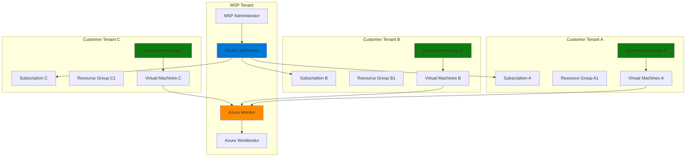

# Cross-Tenant Governance Framework with Lighthouse and Automanage

## Problem

Managed Service Providers (MSPs) struggle with efficiently managing and governing resources across multiple customer tenants while maintaining security boundaries, compliance standards, and operational consistency. Without centralized management capabilities, MSPs face challenges in implementing unified monitoring, automated patching, configuration management, and compliance reporting across their customer base, leading to increased operational overhead and potential security vulnerabilities.

## Solution

Azure Lighthouse enables delegated resource management across multiple tenants from a single MSP tenant, while Azure Automanage provides automated virtual machine configuration, patching, and compliance monitoring. This combination creates a scalable governance framework that allows MSPs to centrally manage customer resources while maintaining proper security boundaries and automated operational tasks.

## Architecture Diagram



## Prerequisites

1. Azure account with Global Administrator permissions for MSP tenant
2. Customer tenant access with Owner or Contributor permissions on target subscriptions
3. Azure CLI v2.30.0 or later installed and configured
4. PowerShell 5.1 or later (for ARM template deployment)
5. Basic understanding of Azure Resource Manager templates and RBAC
6. Estimated cost: $50-100 per month for monitoring and automation resources

> **Note**: This recipe requires coordination between MSP administrators and customer tenant owners for proper delegation setup and permissions configuration.

## Preparation

```bash
# Set environment variables for MSP tenant
export MSP_TENANT_ID="your-msp-tenant-id"
export MSP_SUBSCRIPTION_ID="your-msp-subscription-id"
export MSP_RESOURCE_GROUP="rg-msp-lighthouse-management"
export LOCATION="eastus"

# Set environment variables for customer tenant configuration
export CUSTOMER_TENANT_ID="customer-tenant-id"
export CUSTOMER_SUBSCRIPTION_ID="customer-subscription-id"
export CUSTOMER_RESOURCE_GROUP="rg-customer-workloads"

# Generate unique identifiers for resources
RANDOM_SUFFIX=$(openssl rand -hex 3)
export LIGHTHOUSE_DEFINITION_NAME="lighthouse-definition-${RANDOM_SUFFIX}"
export AUTOMANAGE_PROFILE_NAME="automanage-profile-${RANDOM_SUFFIX}"
export LOG_ANALYTICS_WORKSPACE="law-lighthouse-${RANDOM_SUFFIX}"

# Login to Azure and set MSP tenant context
az login --tenant ${MSP_TENANT_ID}
az account set --subscription ${MSP_SUBSCRIPTION_ID}

# Create MSP resource group for management resources
az group create \
    --name ${MSP_RESOURCE_GROUP} \
    --location ${LOCATION} \
    --tags purpose=lighthouse-management environment=production

echo "✅ MSP tenant environment configured"
```

## Steps

1. **Create Azure Lighthouse Delegation Template**:

   Azure Lighthouse uses Azure Resource Manager templates to define the delegation relationship between service provider and customer tenants. The template specifies which users or groups in the MSP tenant will have access to customer resources and what permissions they'll have. This delegation model ensures secure, auditable access while maintaining proper separation of concerns.

   ```bash
   # Create the ARM template for Lighthouse delegation
   cat > lighthouse-delegation.json << 'EOF'
   {
       "$schema": "https://schema.management.azure.com/schemas/2019-04-01/deploymentTemplate.json#",
       "contentVersion": "1.0.0.0",
       "parameters": {
           "mspTenantId": {
               "type": "string",
               "metadata": {
                   "description": "The tenant ID of the MSP"
               }
           },
           "mspOfferName": {
               "type": "string",
               "metadata": {
                   "description": "The name of the MSP offer"
               }
           },
           "mspOfferDescription": {
               "type": "string",
               "metadata": {
                   "description": "Description of the MSP offer"
               }
           },
           "managedByTenantId": {
               "type": "string",
               "metadata": {
                   "description": "The tenant ID of the MSP managing tenant"
               }
           },
           "authorizations": {
               "type": "array",
               "metadata": {
                   "description": "Array of authorization objects"
               }
           }
       },
       "variables": {
           "mspRegistrationName": "[guid(parameters('mspOfferName'))]",
           "mspAssignmentName": "[guid(parameters('mspOfferName'))]"
       },
       "resources": [
           {
               "type": "Microsoft.ManagedServices/registrationDefinitions",
               "apiVersion": "2020-02-01-preview",
               "name": "[variables('mspRegistrationName')]",
               "properties": {
                   "registrationDefinitionName": "[parameters('mspOfferName')]",
                   "description": "[parameters('mspOfferDescription')]",
                   "managedByTenantId": "[parameters('managedByTenantId')]",
                   "authorizations": "[parameters('authorizations')]"
               }
           },
           {
               "type": "Microsoft.ManagedServices/registrationAssignments",
               "apiVersion": "2020-02-01-preview",
               "name": "[variables('mspAssignmentName')]",
               "dependsOn": [
                   "[resourceId('Microsoft.ManagedServices/registrationDefinitions/', variables('mspRegistrationName'))]"
               ],
               "properties": {
                   "registrationDefinitionId": "[resourceId('Microsoft.ManagedServices/registrationDefinitions/', variables('mspRegistrationName'))]"
               }
           }
       ],
       "outputs": {
           "mspRegistrationName": {
               "type": "string",
               "value": "[variables('mspRegistrationName')]"
           },
           "mspAssignmentName": {
               "type": "string",
               "value": "[variables('mspAssignmentName')]"
           }
       }
   }
   EOF
   
   echo "✅ Lighthouse delegation template created"
   ```

   The ARM template defines the foundational structure for multi-tenant resource delegation. This template creates a registration definition that establishes the relationship between the MSP and customer tenants, enabling secure cross-tenant access while maintaining proper audit trails and permission boundaries.

2. **Configure Authorization Parameters for MSP Team**:

   Role-based access control (RBAC) in Azure Lighthouse provides granular access control by assigning specific Azure built-in roles to MSP users and groups. This step defines the authorization structure that determines what actions MSP personnel can perform on customer resources, following the principle of least privilege.

   ```bash
   # Get MSP tenant service principal or user object IDs
   # Replace with actual MSP team member object IDs
   MSP_ADMIN_GROUP_ID=$(az ad group show \
       --group "MSP-Administrators" \
       --query id --output tsv)
   
   MSP_ENGINEER_GROUP_ID=$(az ad group show \
       --group "MSP-Engineers" \
       --query id --output tsv)
   
   # Create authorization parameters file
   cat > lighthouse-parameters.json << EOF
   {
       "\$schema": "https://schema.management.azure.com/schemas/2019-04-01/deploymentParameters.json#",
       "contentVersion": "1.0.0.0",
       "parameters": {
           "mspTenantId": {
               "value": "${MSP_TENANT_ID}"
           },
           "mspOfferName": {
               "value": "Cross-Tenant Resource Governance"
           },
           "mspOfferDescription": {
               "value": "Managed services for automated VM configuration, patching, and compliance monitoring"
           },
           "managedByTenantId": {
               "value": "${MSP_TENANT_ID}"
           },
           "authorizations": {
               "value": [
                   {
                       "principalId": "${MSP_ADMIN_GROUP_ID}",
                       "principalIdDisplayName": "MSP Administrators",
                       "roleDefinitionId": "b24988ac-6180-42a0-ab88-20f7382dd24c"
                   },
                   {
                       "principalId": "${MSP_ENGINEER_GROUP_ID}",
                       "principalIdDisplayName": "MSP Engineers",
                       "roleDefinitionId": "9980e02c-c2be-4d73-94e8-173b1dc7cf3c"
                   },
                   {
                       "principalId": "${MSP_ADMIN_GROUP_ID}",
                       "principalIdDisplayName": "MSP Administrators - Automanage",
                       "roleDefinitionId": "cdfd5644-ae35-4c17-bb47-ac720c1b0b59"
                   }
               ]
           }
       }
   }
   EOF
   
   echo "✅ Authorization parameters configured with proper RBAC roles"
   ```

   The authorization configuration establishes a tiered access model where MSP administrators receive Contributor permissions for full resource management, while MSP engineers get Virtual Machine Contributor access for specific VM operations. The Automanage Contributor role enables automated configuration management across customer tenants.

3. **Deploy Lighthouse Delegation to Customer Tenant**:

   The deployment process establishes the delegation relationship by creating registration definitions and assignments in the customer tenant. This step requires coordination with the customer tenant owner to ensure proper permissions and deployment success.

   ```bash
   # Switch to customer tenant context
   az login --tenant ${CUSTOMER_TENANT_ID}
   az account set --subscription ${CUSTOMER_SUBSCRIPTION_ID}
   
   # Deploy the Lighthouse delegation template
   DEPLOYMENT_NAME="lighthouse-delegation-${RANDOM_SUFFIX}"
   
   az deployment sub create \
       --name ${DEPLOYMENT_NAME} \
       --location ${LOCATION} \
       --template-file lighthouse-delegation.json \
       --parameters @lighthouse-parameters.json
   
   # Verify deployment status
   az deployment sub show \
       --name ${DEPLOYMENT_NAME} \
       --query "properties.provisioningState" \
       --output tsv
   
   echo "✅ Lighthouse delegation deployed to customer tenant"
   ```

   The deployment creates the managed services registration that enables MSP tenant users to access customer resources. This establishes the foundation for cross-tenant governance while maintaining security boundaries and proper audit logging for all delegated operations.

4. **Switch Back to MSP Tenant and Verify Delegation**:

   Verification ensures that the delegation relationship has been properly established and that MSP users can access customer resources through the Azure Lighthouse interface. This step confirms the successful setup of cross-tenant management capabilities.

   ```bash
   # Switch back to MSP tenant
   az login --tenant ${MSP_TENANT_ID}
   az account set --subscription ${MSP_SUBSCRIPTION_ID}
   
   # Verify delegation by listing managed customers
   az managedservices assignment list \
       --include-definition \
       --output table
   
   # Check delegation details
   az managedservices definition list \
       --output table
   
   # Verify cross-tenant access to customer resources
   az resource list \
       --subscription ${CUSTOMER_SUBSCRIPTION_ID} \
       --output table
   
   echo "✅ Cross-tenant delegation verified successfully"
   ```

   Successful verification confirms that the MSP tenant can now manage customer resources through delegated access. The output shows the managed customer relationships and available resources, indicating that the governance framework is operational.

5. **Create Azure Automanage Configuration Profile**:

   Azure Automanage provides automated configuration management for virtual machines, including security updates, monitoring setup, and compliance enforcement. Creating a custom configuration profile allows MSPs to standardize VM management across all customer tenants with consistent policies and practices.

   ```bash
   # Create Log Analytics workspace for centralized monitoring
   az monitor log-analytics workspace create \
       --resource-group ${MSP_RESOURCE_GROUP} \
       --workspace-name ${LOG_ANALYTICS_WORKSPACE} \
       --location ${LOCATION} \
       --sku pergb2018
   
   # Get workspace ID for Automanage configuration
   WORKSPACE_ID=$(az monitor log-analytics workspace show \
       --resource-group ${MSP_RESOURCE_GROUP} \
       --workspace-name ${LOG_ANALYTICS_WORKSPACE} \
       --query id --output tsv)
   
   # Create custom Automanage configuration profile
   cat > automanage-configuration.json << EOF
   {
       "Antimalware/Enable": "true",
       "AzureSecurityCenter/Enable": "true",
       "Backup/Enable": "true",
       "BootDiagnostics/Enable": "true",
       "ChangeTrackingAndInventory/Enable": "true",
       "GuestConfiguration/Enable": "true",
       "LogAnalytics/Enable": "true",
       "LogAnalytics/WorkspaceId": "${WORKSPACE_ID}",
       "UpdateManagement/Enable": "true",
       "VMInsights/Enable": "true"
   }
   EOF
   
   # Deploy Automanage configuration profile
   az automanage configuration-profile create \
       --resource-group ${MSP_RESOURCE_GROUP} \
       --configuration-profile-name ${AUTOMANAGE_PROFILE_NAME} \
       --location ${LOCATION} \
       --configuration @automanage-configuration.json
   
   echo "✅ Automanage configuration profile created"
   ```

   The configuration profile standardizes VM management across all customer tenants by enabling essential services like antimalware protection, backup, security monitoring, and update management. This ensures consistent security and compliance standards regardless of which customer tenant hosts the virtual machines.

6. **Deploy Virtual Machines in Customer Tenant with Automanage**:

   This step demonstrates deploying virtual machines in the customer tenant with Automanage enabled from the beginning. The VMs will automatically receive configuration management, monitoring, and security updates according to the defined profile.

   ```bash
   # Switch to customer tenant for VM deployment
   az login --tenant ${CUSTOMER_TENANT_ID}
   az account set --subscription ${CUSTOMER_SUBSCRIPTION_ID}
   
   # Create customer resource group
   az group create \
       --name ${CUSTOMER_RESOURCE_GROUP} \
       --location ${LOCATION} \
       --tags customer=tenant-a purpose=workload-vms
   
   # Create virtual network for customer VMs
   VNET_NAME="vnet-customer-${RANDOM_SUFFIX}"
   az network vnet create \
       --resource-group ${CUSTOMER_RESOURCE_GROUP} \
       --name ${VNET_NAME} \
       --address-prefix 10.0.0.0/16 \
       --subnet-name default \
       --subnet-prefix 10.0.1.0/24
   
   # Create virtual machines with Automanage enabled
   VM_NAME="vm-customer-${RANDOM_SUFFIX}"
   
   az vm create \
       --resource-group ${CUSTOMER_RESOURCE_GROUP} \
       --name ${VM_NAME} \
       --image "Win2019Datacenter" \
       --admin-username azureuser \
       --admin-password "P@ssw0rd123!" \
       --size Standard_B2s \
       --vnet-name ${VNET_NAME} \
       --subnet default \
       --tags automanage=enabled environment=production
   
   # Get VM resource ID for Automanage assignment
   VM_RESOURCE_ID=$(az vm show \
       --resource-group ${CUSTOMER_RESOURCE_GROUP} \
       --name ${VM_NAME} \
       --query id --output tsv)
   
   echo "✅ Virtual machines deployed in customer tenant"
   ```

   The virtual machines are now deployed with proper network configuration and ready for Automanage enrollment. This approach ensures that new VMs automatically receive governance and management capabilities as part of their initial deployment process.

7. **Enable Automanage on Customer Virtual Machines**:

   Enrolling VMs in Automanage activates automated configuration management, security updates, and monitoring. This process applies the previously created configuration profile to ensure consistent management standards across all customer virtual machines.

   ```bash
   # Switch back to MSP tenant for cross-tenant management
   az login --tenant ${MSP_TENANT_ID}
   az account set --subscription ${MSP_SUBSCRIPTION_ID}
   
   # Get configuration profile resource ID
   PROFILE_RESOURCE_ID="/subscriptions/${MSP_SUBSCRIPTION_ID}/resourceGroups/${MSP_RESOURCE_GROUP}/providers/Microsoft.Automanage/configurationProfiles/${AUTOMANAGE_PROFILE_NAME}"
   
   # Enable Automanage on customer VMs using cross-tenant access
   az automanage configuration-profile-assignment create \
       --resource-group ${CUSTOMER_RESOURCE_GROUP} \
       --vm-name ${VM_NAME} \
       --configuration-profile-assignment-name "default" \
       --configuration-profile ${PROFILE_RESOURCE_ID} \
       --subscription ${CUSTOMER_SUBSCRIPTION_ID}
   
   # Verify Automanage assignment
   az automanage configuration-profile-assignment show \
       --resource-group ${CUSTOMER_RESOURCE_GROUP} \
       --vm-name ${VM_NAME} \
       --configuration-profile-assignment-name "default" \
       --subscription ${CUSTOMER_SUBSCRIPTION_ID} \
       --output table
   
   echo "✅ Automanage enabled on customer virtual machines"
   ```

   Automanage is now actively managing the customer VMs with automated patching, security configuration, and monitoring. This ensures that all managed virtual machines maintain consistent security and compliance standards without manual intervention.

8. **Configure Cross-Tenant Monitoring and Alerting**:

   Centralized monitoring enables MSPs to track the health, performance, and compliance status of resources across all customer tenants. This unified monitoring approach provides operational visibility and enables proactive management of multi-tenant environments.

   ```bash
   # Create action group for alerting
   ACTION_GROUP_NAME="ag-lighthouse-alerts-${RANDOM_SUFFIX}"
   
   az monitor action-group create \
       --resource-group ${MSP_RESOURCE_GROUP} \
       --name ${ACTION_GROUP_NAME} \
       --short-name "LighthouseAlerts" \
       --email-receivers name="MSP-Ops" email="ops@msp-company.com"
   
   # Create alert rule for VM availability across tenants
   ALERT_RULE_NAME="vm-availability-cross-tenant"
   
   az monitor metrics alert create \
       --resource-group ${MSP_RESOURCE_GROUP} \
       --name ${ALERT_RULE_NAME} \
       --description "Alert when VMs are unavailable across customer tenants" \
       --scopes ${VM_RESOURCE_ID} \
       --condition "avg Percentage CPU > 80" \
       --window-size 5m \
       --evaluation-frequency 1m \
       --action ${ACTION_GROUP_NAME} \
       --severity 2
   
   # Create Azure Workbook for cross-tenant reporting
   cat > lighthouse-workbook.json << 'EOF'
   {
       "version": "Notebook/1.0",
       "items": [
           {
               "type": 3,
               "content": {
                   "version": "KqlItem/1.0",
                   "query": "Heartbeat\r\n| where TimeGenerated > ago(5m)\r\n| summarize LastHeartbeat = max(TimeGenerated) by Computer\r\n| extend Status = case(LastHeartbeat > ago(2m), \"Healthy\", \"Unhealthy\")\r\n| summarize Healthy = countif(Status == \"Healthy\"), Unhealthy = countif(Status == \"Unhealthy\")",
                   "size": 1,
                   "title": "VM Health Status Across Tenants",
                   "queryType": 0,
                   "resourceType": "microsoft.operationalinsights/workspaces"
               }
           }
       ]
   }
   EOF
   
   echo "✅ Cross-tenant monitoring and alerting configured"
   ```

   The monitoring configuration provides real-time visibility into the health and performance of resources across all managed customer tenants. Automated alerting ensures that the MSP operations team receives immediate notifications about any issues requiring attention.

## Validation & Testing

1. **Verify Lighthouse Delegation Status**:

   ```bash
   # Check delegation status from MSP tenant
   az managedservices assignment list \
       --include-definition \
       --query "[].{Name:name, Customer:properties.registrationDefinition.properties.registrationDefinitionName, Status:properties.provisioningState}" \
       --output table
   ```

   Expected output: Active delegations showing "Succeeded" status for all customer tenants.

2. **Test Cross-Tenant Resource Access**:

   ```bash
   # Verify ability to manage customer resources
   az resource list \
       --subscription ${CUSTOMER_SUBSCRIPTION_ID} \
       --resource-type "Microsoft.Compute/virtualMachines" \
       --output table
   
   # Test VM operations across tenants
   az vm get-instance-view \
       --resource-group ${CUSTOMER_RESOURCE_GROUP} \
       --name ${VM_NAME} \
       --subscription ${CUSTOMER_SUBSCRIPTION_ID} \
       --output table
   ```

   Expected output: Successful retrieval of customer VM information and instance details.

3. **Validate Automanage Configuration**:

   ```bash
   # Check Automanage status on customer VMs
   az automanage configuration-profile-assignment list \
       --resource-group ${CUSTOMER_RESOURCE_GROUP} \
       --subscription ${CUSTOMER_SUBSCRIPTION_ID} \
       --output table
   
   # Verify compliance status
   az automanage configuration-profile-assignment show \
       --resource-group ${CUSTOMER_RESOURCE_GROUP} \
       --vm-name ${VM_NAME} \
       --configuration-profile-assignment-name "default" \
       --subscription ${CUSTOMER_SUBSCRIPTION_ID} \
       --query "properties.status" \
       --output tsv
   ```

   Expected output: "Succeeded" status indicating successful Automanage enrollment and configuration.

4. **Test Monitoring and Alerting**:

   ```bash
   # Query Log Analytics for cross-tenant data
   az monitor log-analytics query \
       --workspace ${LOG_ANALYTICS_WORKSPACE} \
       --analytics-query "Heartbeat | where TimeGenerated > ago(1h) | summarize count() by Computer" \
       --output table
   
   # Check alert rule status
   az monitor metrics alert show \
       --resource-group ${MSP_RESOURCE_GROUP} \
       --name ${ALERT_RULE_NAME} \
       --query "enabled" \
       --output tsv
   ```

   Expected output: Active monitoring data from customer VMs and enabled alert rules.

## Cleanup

1. **Remove Automanage Configuration**:

   ```bash
   # Remove Automanage assignments
   az automanage configuration-profile-assignment delete \
       --resource-group ${CUSTOMER_RESOURCE_GROUP} \
       --vm-name ${VM_NAME} \
       --configuration-profile-assignment-name "default" \
       --subscription ${CUSTOMER_SUBSCRIPTION_ID} \
       --yes
   
   echo "✅ Automanage assignments removed"
   ```

2. **Delete Customer Virtual Machines**:

   ```bash
   # Switch to customer tenant
   az login --tenant ${CUSTOMER_TENANT_ID}
   az account set --subscription ${CUSTOMER_SUBSCRIPTION_ID}
   
   # Delete customer resource group and all resources
   az group delete \
       --name ${CUSTOMER_RESOURCE_GROUP} \
       --yes \
       --no-wait
   
   echo "✅ Customer resources deleted"
   ```

3. **Remove Lighthouse Delegation**:

   ```bash
   # Remove delegation assignment
   az managedservices assignment delete \
       --assignment $(az managedservices assignment list \
           --query "[0].name" --output tsv) \
       --subscription ${CUSTOMER_SUBSCRIPTION_ID}
   
   echo "✅ Lighthouse delegation removed"
   ```

4. **Clean Up MSP Management Resources**:

   ```bash
   # Switch back to MSP tenant
   az login --tenant ${MSP_TENANT_ID}
   az account set --subscription ${MSP_SUBSCRIPTION_ID}
   
   # Delete MSP resource group
   az group delete \
       --name ${MSP_RESOURCE_GROUP} \
       --yes \
       --no-wait
   
   echo "✅ MSP management resources cleaned up"
   ```

## Discussion

Azure Lighthouse provides a powerful framework for MSPs to manage customer resources across multiple tenants while maintaining security boundaries and operational efficiency. The service uses Azure Resource Manager's delegated access model to enable cross-tenant resource management without requiring guest user accounts or credential sharing. This approach ensures that MSPs can deliver consistent services while customers retain full control over their environments and can revoke access at any time.

Azure Automanage complements Lighthouse by providing automated configuration management, security updates, and compliance monitoring for virtual machines. The service follows Azure Well-Architected Framework principles by implementing automated governance policies, security configurations, and monitoring capabilities that reduce operational overhead while improving security posture. For comprehensive guidance on automated governance, see the [Azure Automanage documentation](https://docs.microsoft.com/en-us/azure/automanage/) and [Azure Lighthouse architecture guide](https://docs.microsoft.com/en-us/azure/lighthouse/concepts/architecture).

The integration of these services enables MSPs to scale their operations efficiently while maintaining high service quality standards. Cross-tenant monitoring through Azure Monitor and Log Analytics provides unified visibility into resource health and performance across all managed tenants. This centralized approach to monitoring and alerting ensures that MSPs can proactively identify and resolve issues before they impact customer operations. For detailed monitoring strategies, review the [Azure Monitor cross-tenant guidance](https://docs.microsoft.com/en-us/azure/lighthouse/how-to/monitor-at-scale).

> **Tip**: Use Azure Policy assignments through Lighthouse to enforce compliance standards across all customer tenants. This ensures consistent security configurations and governance policies while reducing manual oversight requirements.

From a business perspective, this solution enables MSPs to offer value-added services such as 24/7 monitoring, automated patch management, and compliance reporting while maintaining cost efficiency through centralized operations. The automated nature of Automanage reduces the need for manual intervention while providing consistent security and operational standards across all managed environments. For additional best practices and enterprise scenarios, see the [Azure Lighthouse enterprise guidance](https://docs.microsoft.com/en-us/azure/lighthouse/concepts/enterprise) and [Azure governance documentation](https://docs.microsoft.com/en-us/azure/governance/).

## Challenge

Extend this solution by implementing these enhancements:

1. **Implement Azure Policy for Compliance Governance**: Deploy custom policy definitions through Lighthouse to enforce security baselines, tagging standards, and resource configurations across all customer tenants automatically.

2. **Create Advanced Monitoring Dashboards**: Build comprehensive Azure Workbooks that provide real-time visibility into resource utilization, security compliance, and cost optimization opportunities across the multi-tenant environment.

3. **Integrate with Azure Sentinel for Security Operations**: Connect customer environments to a centralized Azure Sentinel workspace for unified security monitoring, threat detection, and incident response across all managed tenants.

4. **Develop Automated Remediation Workflows**: Create Azure Logic Apps or Azure Functions that automatically respond to monitoring alerts by performing remediation actions like scaling resources, applying security patches, or restarting services.

5. **Implement Cost Management and Optimization**: Deploy Azure Cost Management APIs and Azure Advisor recommendations to provide automated cost optimization suggestions and budget alerts across all customer tenants.

## Infrastructure Code

*Infrastructure code will be generated after recipe approval.*