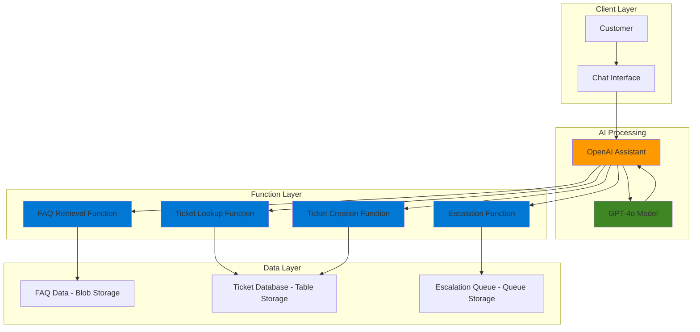

# Customer Support Assistant with OpenAI Assistants and Functions

## Problem

Customer support teams struggle with managing high volumes of inquiries, frequently asked questions, and complex ticket routing workflows. Traditional support systems lack the intelligence to understand context, retrieve relevant information, and perform automated actions like ticket creation or escalation. This leads to longer response times, decreased customer satisfaction, and increased operational costs as human agents spend time on routine tasks that could be automated.

## Solution

Build an intelligent customer support assistant using Azure OpenAI Assistants API with custom function calling capabilities integrated with Azure Functions. The assistant can understand natural language queries, retrieve relevant information from Azure Storage, create support tickets, look up existing cases, and escalate issues automatically. This serverless architecture provides cost-effective scaling while maintaining conversational context and enabling complex multi-step workflows through function calling.

## Architecture Diagram



## Prerequisites

1. Azure subscription with appropriate permissions to create Azure OpenAI Service, Functions, and Storage resources
2. Azure CLI installed and configured (or use Azure Cloud Shell)
3. Basic understanding of REST APIs, JavaScript/Node.js, and serverless computing concepts
4. Node.js 20+ installed locally for testing (if running locally)
5. Estimated cost: $15-25 for completion (includes GPT-4o API calls, Function Apps consumption, and storage)

> **Note**: Azure OpenAI Service requires approved access. Ensure you have been granted access to deploy GPT-4o models in your region.

## Preparation

```bash
# Set environment variables for Azure resources
export RESOURCE_GROUP="rg-support-assistant-${RANDOM_SUFFIX}"
export LOCATION="eastus"
export SUBSCRIPTION_ID=$(az account show --query id --output tsv)

# Generate unique suffix for resource names
RANDOM_SUFFIX=$(openssl rand -hex 3)

# Set resource names with unique suffixes
export STORAGE_ACCOUNT="supportdata${RANDOM_SUFFIX}"
export FUNCTION_APP="support-functions-${RANDOM_SUFFIX}"
export OPENAI_ACCOUNT="support-openai-${RANDOM_SUFFIX}"

# Create resource group
az group create \
    --name ${RESOURCE_GROUP} \
    --location ${LOCATION} \
    --tags purpose=recipe environment=demo

echo "✅ Resource group created: ${RESOURCE_GROUP}"
```

## Steps

1. **Create Azure Storage Account for Support Data**:

   Azure Storage provides the foundational data layer for our customer support system. We'll use Table Storage for structured ticket data, Blob Storage for FAQ documents, and Queue Storage for escalation workflows. This multi-service approach enables efficient data access patterns while maintaining cost-effectiveness and scalability.

   ```bash
   # Create storage account with all required services
   az storage account create \
       --name ${STORAGE_ACCOUNT} \
       --resource-group ${RESOURCE_GROUP} \
       --location ${LOCATION} \
       --sku Standard_LRS \
       --kind StorageV2 \
       --access-tier Hot
   
   # Get storage connection string for Functions
   export STORAGE_CONNECTION=$(az storage account show-connection-string \
       --name ${STORAGE_ACCOUNT} \
       --resource-group ${RESOURCE_GROUP} \
       --query connectionString --output tsv)
   
   echo "✅ Storage account created: ${STORAGE_ACCOUNT}"
   ```

   The storage account now provides the persistent data layer for our support system. This configuration uses locally redundant storage (LRS) for cost optimization while maintaining high availability within a single region.

2. **Initialize Support Data Structures**:

   ```bash
   # Create Table Storage for tickets
   az storage table create \
       --name tickets \
       --connection-string "${STORAGE_CONNECTION}"
   
   # Create Table Storage for customer data
   az storage table create \
       --name customers \
       --connection-string "${STORAGE_CONNECTION}"
   
   # Create Blob container for FAQ documents
   az storage container create \
       --name faqs \
       --connection-string "${STORAGE_CONNECTION}" \
       --public-access off
   
   # Create Queue for escalations
   az storage queue create \
       --name escalations \
       --connection-string "${STORAGE_CONNECTION}"
   
   echo "✅ Support data structures initialized"
   ```

3. **Create Azure OpenAI Service**:

   Azure OpenAI Service provides enterprise-grade AI capabilities with built-in security, compliance, and regional data residency. The GPT-4o model will power our assistant's natural language understanding and generation, while the Assistants API enables persistent conversation state and function calling capabilities.

   ```bash
   # Create Azure OpenAI Service
   az cognitiveservices account create \
       --name ${OPENAI_ACCOUNT} \
       --resource-group ${RESOURCE_GROUP} \
       --location ${LOCATION} \
       --kind OpenAI \
       --sku S0 \
       --custom-domain ${OPENAI_ACCOUNT}
   
   # Get OpenAI endpoint and key
   export OPENAI_ENDPOINT=$(az cognitiveservices account show \
       --name ${OPENAI_ACCOUNT} \
       --resource-group ${RESOURCE_GROUP} \
       --query properties.endpoint --output tsv)
   
   export OPENAI_KEY=$(az cognitiveservices account keys list \
       --name ${OPENAI_ACCOUNT} \
       --resource-group ${RESOURCE_GROUP} \
       --query key1 --output tsv)
   
   echo "✅ Azure OpenAI Service created: ${OPENAI_ACCOUNT}"
   ```

   The OpenAI service is now configured with standard pricing tier (S0) to support production workloads. This provides access to GPT-4o models and the Assistants API with function calling capabilities.

4. **Deploy GPT-4o Model**:

   ```bash
   # Deploy GPT-4o model for the assistant
   az cognitiveservices account deployment create \
       --name ${OPENAI_ACCOUNT} \
       --resource-group ${RESOURCE_GROUP} \
       --deployment-name gpt-4o \
       --model-name gpt-4o \
       --model-version "2024-11-20" \
       --model-format OpenAI \
       --scale-settings-scale-type Standard
   
   # Wait for deployment to complete
   sleep 30
   
   echo "✅ GPT-4o model deployed successfully"
   ```

5. **Create Function App for Custom Actions**:

   Azure Functions provides the serverless compute layer that enables our OpenAI Assistant to perform actions beyond text generation. Each function represents a specific customer support capability that the assistant can invoke dynamically based on conversation context.

   ```bash
   # Create Function App with Node.js runtime
   az functionapp create \
       --name ${FUNCTION_APP} \
       --resource-group ${RESOURCE_GROUP} \
       --storage-account ${STORAGE_ACCOUNT} \
       --consumption-plan-location ${LOCATION} \
       --runtime node \
       --runtime-version 20 \
       --functions-version 4
   
   # Configure Function App settings
   az functionapp config appsettings set \
       --name ${FUNCTION_APP} \
       --resource-group ${RESOURCE_GROUP} \
       --settings \
           "STORAGE_CONNECTION=${STORAGE_CONNECTION}" \
           "OPENAI_ENDPOINT=${OPENAI_ENDPOINT}" \
           "OPENAI_KEY=${OPENAI_KEY}"
   
   echo "✅ Function App created: ${FUNCTION_APP}"
   ```

   The Function App uses consumption-based pricing, automatically scaling from zero to handle assistant function calls. This serverless approach ensures cost efficiency while providing reliable execution for support operations.

6. **Deploy Support Functions**:

   ```bash
   # Create local function project directory
   mkdir support-functions && cd support-functions
   
   # Initialize Function App project with v4 programming model
   func init --javascript --worker-runtime node
   
   # Create ticket lookup function
   func new --name ticketLookup --template "HTTP trigger" --authlevel function
   
   # Create FAQ retrieval function  
   func new --name faqRetrieval --template "HTTP trigger" --authlevel function
   
   # Create ticket creation function
   func new --name ticketCreation --template "HTTP trigger" --authlevel function
   
   # Create escalation function
   func new --name escalation --template "HTTP trigger" --authlevel function
   
   echo "✅ Function templates created"
   ```

7. **Implement Ticket Lookup Function**:

   ```bash
   # Write ticket lookup function code
   cat > ticketLookup/index.js << 'EOF'
const { TableClient } = require("@azure/data-tables");

module.exports = async function (context, req) {
    const ticketId = req.body.ticketId;
    
    if (!ticketId) {
        context.res = {
            status: 400,
            body: { error: "Ticket ID is required" }
        };
        return;
    }

    try {
        const tableClient = TableClient.fromConnectionString(
            process.env.STORAGE_CONNECTION,
            "tickets"
        );

        const ticket = await tableClient.getEntity("ticket", ticketId);
        
        context.res = {
            status: 200,
            body: {
                ticketId: ticket.rowKey,
                status: ticket.status,
                priority: ticket.priority,
                subject: ticket.subject,
                description: ticket.description,
                createdDate: ticket.createdDate,
                lastUpdated: ticket.lastUpdated
            }
        };
    } catch (error) {
        if (error.statusCode === 404) {
            context.res = {
                status: 404,
                body: { error: "Ticket not found" }
            };
        } else {
            context.res = {
                status: 500,
                body: { error: "Internal server error" }
            };
        }
    }
};
EOF

   # Update function.json for proper HTTP trigger
   cat > ticketLookup/function.json << 'EOF'
{
  "bindings": [
    {
      "authLevel": "function",
      "type": "httpTrigger",
      "direction": "in",
      "name": "req",
      "methods": ["post"]
    },
    {
      "type": "http",
      "direction": "out",
      "name": "res"
    }
  ]
}
EOF

   echo "✅ Ticket lookup function implemented"
   ```

8. **Implement FAQ Retrieval Function**:

   ```bash
   # Write FAQ retrieval function code
   cat > faqRetrieval/index.js << 'EOF'
const { BlobServiceClient } = require("@azure/storage-blob");

module.exports = async function (context, req) {
    const query = req.body.query || "";
    
    try {
        const blobServiceClient = BlobServiceClient.fromConnectionString(
            process.env.STORAGE_CONNECTION
        );
        
        const containerClient = blobServiceClient.getContainerClient("faqs");
        
        // Simple FAQ matching based on query keywords
        const faqs = [
            {
                question: "How do I reset my password?",
                answer: "Click 'Forgot Password' on the login page and follow the email instructions.",
                category: "account"
            },
            {
                question: "What are your business hours?",
                answer: "We're open Monday-Friday 9am-6pm EST. Weekend support available via chat.",
                category: "general"
            },
            {
                question: "How do I cancel my subscription?",
                answer: "Go to Account Settings > Billing > Cancel Subscription. Contact support if you need assistance.",
                category: "billing"
            },
            {
                question: "Is my data secure?",
                answer: "Yes, we use enterprise-grade encryption and comply with SOC2 and GDPR standards.",
                category: "security"
            }
        ];
        
        // Filter FAQs based on query
        const matchingFaqs = faqs.filter(faq => 
            faq.question.toLowerCase().includes(query.toLowerCase()) ||
            faq.answer.toLowerCase().includes(query.toLowerCase()) ||
            faq.category.toLowerCase().includes(query.toLowerCase())
        );
        
        context.res = {
            status: 200,
            body: {
                query: query,
                results: matchingFaqs.slice(0, 3) // Return top 3 matches
            }
        };
    } catch (error) {
        context.res = {
            status: 500,
            body: { error: "Failed to retrieve FAQs" }
        };
    }
};
EOF

   echo "✅ FAQ retrieval function implemented"
   ```

9. **Deploy Functions to Azure**:

   ```bash
   # Install required dependencies
   npm init -y
   npm install @azure/data-tables @azure/storage-blob @azure/storage-queue
   
   # Deploy to Azure
   func azure functionapp publish ${FUNCTION_APP}
   
   # Get function app hostname
   export FUNCTION_HOST=$(az functionapp show \
       --name ${FUNCTION_APP} \
       --resource-group ${RESOURCE_GROUP} \
       --query defaultHostName --output tsv)
   
   # Get function key for authentication
   export FUNCTION_KEY=$(az functionapp keys list \
       --name ${FUNCTION_APP} \
       --resource-group ${RESOURCE_GROUP} \
       --query functionKeys.default --output tsv)
   
   cd ..
   echo "✅ Functions deployed to: https://${FUNCTION_HOST}"
   ```

10. **Create OpenAI Assistant with Function Definitions**:

    The OpenAI Assistant with function calling enables our support system to understand user intents and automatically invoke the appropriate Azure Functions. This creates a conversational interface that can perform complex workflows while maintaining natural dialogue flow.

    ```bash
    # Create assistant configuration script
    cat > create-assistant.js << 'EOF'
const { OpenAI } = require('openai');

const client = new OpenAI({
    apiKey: process.env.OPENAI_KEY,
    baseURL: `${process.env.OPENAI_ENDPOINT}/openai/deployments/gpt-4o`,
    defaultQuery: { 'api-version': '2024-10-21' },
    defaultHeaders: {
        'api-key': process.env.OPENAI_KEY,
    },
});

async function createAssistant() {
    const assistant = await client.beta.assistants.create({
        name: "Customer Support Assistant",
        instructions: `You are a helpful customer support assistant. You can help customers with:
        - Looking up existing support tickets
        - Finding answers in our FAQ database  
        - Creating new support tickets
        - Escalating urgent issues
        
        Always be polite, professional, and try to resolve issues efficiently. 
        Use the available functions when customers need specific actions performed.`,
        model: "gpt-4o",
        tools: [
            {
                type: "function",
                function: {
                    name: "lookup_ticket",
                    description: "Look up information about an existing support ticket",
                    parameters: {
                        type: "object",
                        properties: {
                            ticketId: {
                                type: "string",
                                description: "The ticket ID to look up"
                            }
                        },
                        required: ["ticketId"]
                    }
                }
            },
            {
                type: "function", 
                function: {
                    name: "search_faq",
                    description: "Search the FAQ database for answers to common questions",
                    parameters: {
                        type: "object",
                        properties: {
                            query: {
                                type: "string",
                                description: "Search query for FAQ lookup"
                            }
                        },
                        required: ["query"]
                    }
                }
            }
        ]
    });
    
    console.log('Assistant created:', assistant.id);
    return assistant.id;
}

createAssistant().catch(console.error);
EOF

    # Install OpenAI SDK and create assistant
    npm init -y
    npm install openai
    export ASSISTANT_ID=$(node create-assistant.js | grep "Assistant created:" | cut -d' ' -f3)
    
    echo "✅ OpenAI Assistant created: ${ASSISTANT_ID}"
    ```

## Validation & Testing

1. Verify Function App deployment:

   ```bash
   # Test ticket lookup function
   curl -X POST "https://${FUNCTION_HOST}/api/ticketLookup?code=${FUNCTION_KEY}" \
        -H "Content-Type: application/json" \
        -d '{"ticketId": "test-123"}'
   ```

   Expected output: Should return a 404 error for non-existent ticket (normal behavior).

2. Test FAQ retrieval function:

   ```bash
   # Test FAQ search
   curl -X POST "https://${FUNCTION_HOST}/api/faqRetrieval?code=${FUNCTION_KEY}" \
        -H "Content-Type: application/json" \
        -d '{"query": "password"}'
   ```

   Expected output: Should return FAQ entries related to password reset.

3. Verify OpenAI Assistant configuration:

   ```bash
   # Create test conversation script
   cat > test-assistant.js << 'EOF'
const { OpenAI } = require('openai');

const client = new OpenAI({
    apiKey: process.env.OPENAI_KEY,
    baseURL: `${process.env.OPENAI_ENDPOINT}/openai/deployments/gpt-4o`,
    defaultQuery: { 'api-version': '2024-10-21' },
    defaultHeaders: {
        'api-key': process.env.OPENAI_KEY,
    },
});

async function testAssistant() {
    const thread = await client.beta.threads.create();
    
    await client.beta.threads.messages.create(thread.id, {
        role: "user",
        content: "I need help with password reset"
    });
    
    const run = await client.beta.threads.runs.create(thread.id, {
        assistant_id: process.env.ASSISTANT_ID
    });
    
    console.log('Test conversation initiated:', run.id);
}

testAssistant().catch(console.error);
EOF

   # Run assistant test
   node test-assistant.js
   ```

   Expected output: Should create a thread and initiate a conversation run successfully.

## Cleanup

1. Remove Function App and associated resources:

   ```bash
   # Delete Function App
   az functionapp delete \
       --name ${FUNCTION_APP} \
       --resource-group ${RESOURCE_GROUP}
   
   echo "✅ Function App deleted"
   ```

2. Remove OpenAI Service:

   ```bash
   # Delete OpenAI Service
   az cognitiveservices account delete \
       --name ${OPENAI_ACCOUNT} \
       --resource-group ${RESOURCE_GROUP}
   
   echo "✅ OpenAI Service deleted"
   ```

3. Remove Storage Account:

   ```bash
   # Delete Storage Account
   az storage account delete \
       --name ${STORAGE_ACCOUNT} \
       --resource-group ${RESOURCE_GROUP} \
       --yes
   
   echo "✅ Storage Account deleted"
   ```

4. Remove Resource Group:

   ```bash
   # Delete resource group and all remaining resources
   az group delete \
       --name ${RESOURCE_GROUP} \
       --yes \
       --no-wait
   
   echo "✅ Resource group deletion initiated: ${RESOURCE_GROUP}"
   echo "Note: Deletion may take several minutes to complete"
   ```

5. Clean up local files:

   ```bash
   # Remove local development files
   rm -rf support-functions
   rm -f create-assistant.js test-assistant.js package.json package-lock.json node_modules
   
   echo "✅ Local files cleaned up"
   ```

## Discussion

This customer support assistant implementation demonstrates the power of combining Azure OpenAI's Assistants API with serverless Azure Functions to create intelligent, actionable conversational AI. The architecture follows microservices principles, with each function handling specific support operations while the assistant orchestrates the overall conversation flow.

The **Azure OpenAI Assistants API** provides several key advantages over traditional chatbot implementations. Unlike simple completion APIs, assistants maintain conversation state, support complex multi-turn interactions, and can invoke custom functions dynamically based on user intents. This enables more natural conversations where the assistant can remember context and perform actions without requiring users to explicitly trigger specific commands. The GPT-4o model brings enhanced multimodal capabilities, superior performance in non-English languages, and improved accuracy for vision tasks.

**Function calling integration** bridges the gap between conversational AI and business operations. When a customer asks to "look up my ticket #12345," the assistant automatically parses the intent, extracts the ticket ID, and calls the appropriate Azure Function. This seamless integration eliminates the need for complex intent recognition systems or rigid command structures that plague traditional chatbots.

The **serverless architecture** using Azure Functions provides cost-effective scaling and simplified maintenance. Functions only execute when called by the assistant, resulting in minimal costs during low-usage periods while automatically scaling to handle high-volume scenarios. This approach aligns operational costs directly with customer support activity levels, making it ideal for businesses with variable support loads. The latest Azure Functions runtime version 4.x with Node.js 20 provides enhanced performance and security features.

> **Tip**: Consider implementing conversation analytics using Azure Application Insights to track function call patterns, response times, and customer satisfaction metrics. This data can inform both technical optimizations and business process improvements.

The solution demonstrates enterprise-ready patterns including proper error handling, authentication, and data separation. Each storage service (Table, Blob, Queue) serves a specific purpose optimized for its data access patterns, while the OpenAI service provides the intelligence layer with built-in safety controls and content filtering.

For production deployments, consider implementing additional features such as conversation logging, sentiment analysis, and integration with existing CRM systems. The modular architecture supports these enhancements without requiring significant refactoring of the core assistant logic.

**Sources:**
- [Azure OpenAI Assistants function calling](https://learn.microsoft.com/en-us/azure/ai-foundry/openai/how-to/assistant-functions)
- [Use AI tools and models in Azure Functions](https://learn.microsoft.com/en-us/azure/azure-functions/functions-create-ai-enabled-apps)
- [Get started with Azure OpenAI with Assistants and function calling](https://learn.microsoft.com/en-us/azure/developer/javascript/ai/get-started-app-chat-assistants-function-calling)
- [Azure Storage introduction](https://learn.microsoft.com/en-us/azure/storage/common/storage-introduction)
- [Azure OpenAI Models](https://learn.microsoft.com/en-us/azure/ai-foundry/openai/concepts/models)

## Challenge

Extend this customer support assistant by implementing these enhancements:

1. **Multi-channel Integration**: Add support for Microsoft Teams, Slack, or web chat interfaces using Azure Bot Framework to expand the assistant's reach across communication platforms.

2. **Advanced Analytics Dashboard**: Implement Azure Stream Analytics and Power BI integration to create real-time dashboards showing support metrics, conversation trends, and function call analytics.

3. **Sentiment-based Escalation**: Integrate Azure Cognitive Services Text Analytics to detect customer frustration and automatically trigger escalation workflows when negative sentiment is detected.

4. **Knowledge Base RAG**: Enhance the FAQ system using Azure AI Search and document intelligence to create a retrieval-augmented generation system that can answer questions from uploaded knowledge base documents.

5. **Multi-language Support**: Add Azure Translator integration to provide customer support in multiple languages while maintaining context and function calling capabilities across language barriers.

## Infrastructure Code

*Infrastructure code will be generated after recipe approval.*