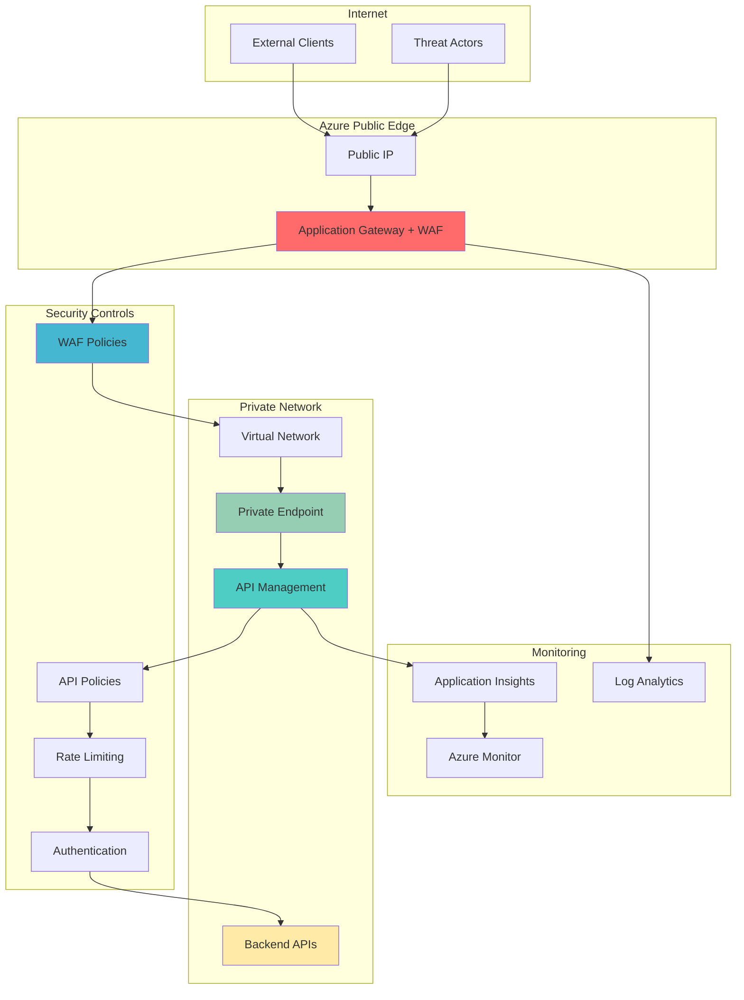

# Defense-in-Depth API Security with Azure API Management and Web Application Firewall

## Problem

Organizations exposing microservices APIs to external consumers face increasingly sophisticated security threats including DDoS attacks, SQL injection, cross-site scripting, and bot-driven abuse. Traditional perimeter-based security models are insufficient for modern API architectures where APIs are accessed from multiple locations and devices. Without comprehensive zero-trust security controls, organizations risk data breaches, service disruptions, and regulatory compliance violations that can result in significant financial and reputational damage.

## Solution

Azure API Management combined with Azure Web Application Firewall creates a comprehensive zero-trust API security architecture that validates every request, applies threat protection policies, and isolates API traffic through private network connectivity. This solution implements defense-in-depth security with Azure Application Gateway providing load balancing and SSL termination, while Azure Private Link ensures secure, private connectivity between components, eliminating exposure to the public internet.

## Architecture Diagram



## Prerequisites

1. Azure account with Contributor permissions on a subscription
2. Azure CLI v2.50.0 or later installed and configured
3. Basic understanding of API security concepts and zero-trust architecture
4. Existing backend API services or sample APIs for testing
5. Estimated cost: $150-300/month for Standard tier resources (varies by usage)

> **Note**: This recipe uses Azure API Management Standard tier and Application Gateway Standard v2 with WAF enabled. Review the [Azure API Management pricing](https://azure.microsoft.com/pricing/details/api-management/) and [Application Gateway pricing](https://azure.microsoft.com/pricing/details/application-gateway/) for cost planning.

## Preparation

```bash
# Set environment variables for Azure resources
export RESOURCE_GROUP="rg-zero-trust-api-${RANDOM_SUFFIX}"
export LOCATION="eastus"
export SUBSCRIPTION_ID=$(az account show --query id --output tsv)

# Generate unique suffix for resource names
RANDOM_SUFFIX=$(openssl rand -hex 3)

# Set resource names with unique suffix
export VNET_NAME="vnet-zerotrust-${RANDOM_SUFFIX}"
export APIM_NAME="apim-zerotrust-${RANDOM_SUFFIX}"
export AGW_NAME="agw-zerotrust-${RANDOM_SUFFIX}"
export WAF_POLICY_NAME="waf-zerotrust-${RANDOM_SUFFIX}"
export LOG_WORKSPACE_NAME="log-zerotrust-${RANDOM_SUFFIX}"
export APP_INSIGHTS_NAME="ai-zerotrust-${RANDOM_SUFFIX}"

# Create resource group
az group create \
    --name ${RESOURCE_GROUP} \
    --location ${LOCATION} \
    --tags purpose=zero-trust-api-security environment=demo

echo "✅ Resource group created: ${RESOURCE_GROUP}"
```

## Steps

1. **Create Virtual Network with Security Subnets**:

   Azure Virtual Network provides the foundation for zero-trust network segmentation by creating isolated network boundaries for different security zones. This network design separates Application Gateway from API Management using dedicated subnets, enabling granular network security controls and private connectivity patterns that are essential for zero-trust architecture.

   ```bash
   # Create virtual network with address space
   az network vnet create \
       --resource-group ${RESOURCE_GROUP} \
       --name ${VNET_NAME} \
       --address-prefixes 10.0.0.0/16 \
       --location ${LOCATION}
   
   # Create subnet for Application Gateway
   az network vnet subnet create \
       --resource-group ${RESOURCE_GROUP} \
       --vnet-name ${VNET_NAME} \
       --name agw-subnet \
       --address-prefixes 10.0.1.0/24
   
   # Create subnet for API Management
   az network vnet subnet create \
       --resource-group ${RESOURCE_GROUP} \
       --vnet-name ${VNET_NAME} \
       --name apim-subnet \
       --address-prefixes 10.0.2.0/24
   
   # Create subnet for private endpoints
   az network vnet subnet create \
       --resource-group ${RESOURCE_GROUP} \
       --vnet-name ${VNET_NAME} \
       --name pe-subnet \
       --address-prefixes 10.0.3.0/24
   
   echo "✅ Virtual network created with security-segmented subnets"
   ```

   The network is now configured with three dedicated subnets following zero-trust principles of network segmentation. Each subnet serves a specific security role: Application Gateway for public-facing traffic processing, API Management for API orchestration, and private endpoints for secure backend connectivity.

2. **Create Log Analytics Workspace and Application Insights**:

   Comprehensive monitoring and logging are fundamental to zero-trust security, providing visibility into all API interactions, security events, and threat detection. Azure Log Analytics and Application Insights together create a unified observability platform that enables security teams to monitor, analyze, and respond to potential threats in real-time.

   ```bash
   # Create Log Analytics workspace
   az monitor log-analytics workspace create \
       --resource-group ${RESOURCE_GROUP} \
       --workspace-name ${LOG_WORKSPACE_NAME} \
       --location ${LOCATION} \
       --retention-time 30
   
   # Get workspace ID for later use
   WORKSPACE_ID=$(az monitor log-analytics workspace show \
       --resource-group ${RESOURCE_GROUP} \
       --workspace-name ${LOG_WORKSPACE_NAME} \
       --query id --output tsv)
   
   # Create Application Insights
   az monitor app-insights component create \
       --resource-group ${RESOURCE_GROUP} \
       --app ${APP_INSIGHTS_NAME} \
       --location ${LOCATION} \
       --workspace ${WORKSPACE_ID}
   
   # Get Application Insights instrumentation key
   APPINSIGHTS_KEY=$(az monitor app-insights component show \
       --resource-group ${RESOURCE_GROUP} \
       --app ${APP_INSIGHTS_NAME} \
       --query instrumentationKey --output tsv)
   
   echo "✅ Monitoring infrastructure created with centralized logging"
   ```

   The monitoring foundation is established with centralized logging and application performance monitoring. This creates the observability layer required for zero-trust security monitoring, enabling detection of anomalous behavior, security incidents, and performance issues across the entire API security stack.

3. **Create Web Application Firewall Policy**:

   Azure Web Application Firewall provides the first line of defense against web-based attacks, implementing OWASP Core Rule Set protections and custom security rules. The WAF policy enforces zero-trust security by inspecting all incoming requests before they reach API Management, blocking malicious traffic patterns and protecting against common web vulnerabilities.

   ```bash
   # Create WAF policy with OWASP rules
   az network application-gateway waf-policy create \
       --resource-group ${RESOURCE_GROUP} \
       --name ${WAF_POLICY_NAME} \
       --location ${LOCATION} \
       --type OWASP \
       --version 3.2
   
   # Configure WAF policy settings
   az network application-gateway waf-policy policy-setting update \
       --resource-group ${RESOURCE_GROUP} \
       --policy-name ${WAF_POLICY_NAME} \
       --state Enabled \
       --mode Prevention \
       --max-request-body-size-in-kb 128 \
       --file-upload-limit-in-mb 100 \
       --request-body-check true
   
   # Add custom rule for API rate limiting
   az network application-gateway waf-policy custom-rule create \
       --resource-group ${RESOURCE_GROUP} \
       --policy-name ${WAF_POLICY_NAME} \
       --name RateLimitRule \
       --priority 100 \
       --rule-type RateLimitRule \
       --action Block \
       --rate-limit-duration OneMinute \
       --rate-limit-threshold 100
   
   echo "✅ WAF policy created with OWASP protection and rate limiting"
   ```

   The WAF policy is configured with comprehensive threat protection including OWASP Core Rule Set for common web vulnerabilities, rate limiting to prevent abuse, and prevention mode to actively block malicious requests. This creates a robust security perimeter that aligns with zero-trust principles of never trusting, always verifying.

4. **Create API Management Service with Virtual Network Integration**:

   Azure API Management serves as the central policy enforcement point in zero-trust architecture, applying authentication, authorization, rate limiting, and transformation policies to all API requests. Deploying API Management in internal mode within the virtual network ensures that APIs are not directly accessible from the internet, requiring all traffic to flow through the Application Gateway security controls.

   ```bash
   # Create API Management service (this takes 20-30 minutes)
   az apim create \
       --resource-group ${RESOURCE_GROUP} \
       --name ${APIM_NAME} \
       --publisher-email "admin@contoso.com" \
       --publisher-name "Contoso API Security" \
       --sku-name Standard \
       --location ${LOCATION} \
       --enable-managed-identity \
       --virtual-network Internal \
       --vnet-name ${VNET_NAME} \
       --vnet-subnet apim-subnet
   
   # Wait for API Management provisioning
   az apim wait \
       --resource-group ${RESOURCE_GROUP} \
       --name ${APIM_NAME} \
       --created \
       --timeout 2400
   
   # Get API Management gateway URL
   APIM_GATEWAY_URL=$(az apim show \
       --resource-group ${RESOURCE_GROUP} \
       --name ${APIM_NAME} \
       --query gatewayUrl --output tsv)
   
   echo "✅ API Management created with internal virtual network integration"
   ```

   API Management is now deployed in internal mode, accessible only through the private network. This configuration enforces zero-trust principles by eliminating direct internet access to APIs and requiring all traffic to pass through the Application Gateway's security controls, creating a secure API gateway architecture.

5. **Configure Application Insights Integration**:

   Integrating Application Insights with API Management enables comprehensive monitoring of API performance, security events, and user behavior patterns. This integration provides the telemetry data necessary for zero-trust security monitoring, allowing security teams to identify threats, monitor compliance, and optimize API performance based on real-world usage patterns.

   ```bash
   # Create Application Insights logger in API Management
   az apim logger create \
       --resource-group ${RESOURCE_GROUP} \
       --service-name ${APIM_NAME} \
       --logger-id appInsights \
       --logger-type applicationInsights \
       --description "Application Insights Logger" \
       --credentials "instrumentationKey=${APPINSIGHTS_KEY}"
   
   # Enable diagnostic logging for API Management
   az apim diagnostic create \
       --resource-group ${RESOURCE_GROUP} \
       --service-name ${APIM_NAME} \
       --diagnostic-id applicationinsights \
       --logger-id appInsights \
       --always-log allErrors \
       --sampling-percentage 100
   
   echo "✅ Application Insights integration configured for comprehensive monitoring"
   ```

   API Management now streams security and performance telemetry to Application Insights, providing real-time visibility into API operations. This monitoring foundation enables security teams to detect anomalies, track security events, and maintain compliance with zero-trust security principles through continuous monitoring and analysis.

6. **Create Application Gateway with WAF Integration**:

   Azure Application Gateway serves as the secure entry point for all API traffic, providing SSL termination, load balancing, and WAF protection. This configuration creates a secure reverse proxy that terminates public internet connections and forwards verified traffic to API Management through private network connectivity, implementing zero-trust network access principles.

   ```bash
   # Create public IP for Application Gateway
   az network public-ip create \
       --resource-group ${RESOURCE_GROUP} \
       --name ${AGW_NAME}-pip \
       --location ${LOCATION} \
       --allocation-method Static \
       --sku Standard
   
   # Get public IP address
   PUBLIC_IP=$(az network public-ip show \
       --resource-group ${RESOURCE_GROUP} \
       --name ${AGW_NAME}-pip \
       --query ipAddress --output tsv)
   
   # Extract hostname from APIM gateway URL for backend pool
   APIM_HOSTNAME=$(echo ${APIM_GATEWAY_URL} | sed 's|https://||' | sed 's|http://||')
   
   # Create Application Gateway with WAF
   az network application-gateway create \
       --resource-group ${RESOURCE_GROUP} \
       --name ${AGW_NAME} \
       --location ${LOCATION} \
       --capacity 2 \
       --sku WAF_v2 \
       --vnet-name ${VNET_NAME} \
       --subnet agw-subnet \
       --public-ip-address ${AGW_NAME}-pip \
       --waf-policy ${WAF_POLICY_NAME} \
       --frontend-port 80 \
       --routing-rule-type Basic \
       --servers ${APIM_HOSTNAME} \
       --priority 100
   
   echo "✅ Application Gateway created with WAF protection at IP: ${PUBLIC_IP}"
   ```

   The Application Gateway now provides secure, load-balanced access to API Management with integrated WAF protection. This architecture ensures that all API traffic is inspected and filtered before reaching the internal API Management service, creating a zero-trust security boundary at the network edge.

7. **Create Sample API with Security Policies**:

   Creating a sample API with comprehensive security policies demonstrates zero-trust API security implementation, including authentication, authorization, rate limiting, and request validation. These policies ensure that every API request is authenticated, authorized, and validated before reaching backend services, implementing the core zero-trust principle of never trusting, always verifying.

   ```bash
   # Create a sample API
   az apim api create \
       --resource-group ${RESOURCE_GROUP} \
       --service-name ${APIM_NAME} \
       --api-id sample-api \
       --display-name "Sample Secure API" \
       --path "/secure" \
       --service-url "https://httpbin.org" \
       --protocols https
   
   # Add GET operation
   az apim api operation create \
       --resource-group ${RESOURCE_GROUP} \
       --service-name ${APIM_NAME} \
       --api-id sample-api \
       --operation-id get-secure-data \
       --display-name "Get Secure Data" \
       --method GET \
       --url-template "/data"
   
   # Create comprehensive security policy
   cat > security-policy.xml << 'EOF'
   <policies>
       <inbound>
           <base />
           <validate-jwt header-name="Authorization" failed-validation-httpcode="401" failed-validation-error-message="Unauthorized">
               <openid-config url="https://login.microsoftonline.com/common/v2.0/.well-known/openid_configuration" />
               <required-claims>
                   <claim name="aud" match="any">
                       <value>api://your-api-id</value>
                   </claim>
               </required-claims>
           </validate-jwt>
           <rate-limit calls="100" renewal-period="60" />
           <rate-limit-by-key calls="10" renewal-period="60" counter-key="@(context.Request.IpAddress)" />
           <ip-filter action="allow">
               <address-range from="0.0.0.0" to="255.255.255.255" />
           </ip-filter>
           <log-to-eventhub logger-id="appInsights" partition-id="0">
               @{
                   return new JObject(
                       new JProperty("timestamp", DateTime.UtcNow.ToString()),
                       new JProperty("operation", context.Operation.Name),
                       new JProperty("clientIp", context.Request.IpAddress),
                       new JProperty("userAgent", context.Request.Headers.GetValueOrDefault("User-Agent", "")),
                       new JProperty("requestId", context.RequestId)
                   ).ToString();
               }
           </log-to-eventhub>
       </inbound>
       <backend>
           <base />
       </backend>
       <outbound>
           <base />
           <set-header name="X-Powered-By" exists-action="delete" />
           <set-header name="Server" exists-action="delete" />
       </outbound>
       <on-error>
           <base />
       </on-error>
   </policies>
   EOF
   
   # Apply security policy to API
   az apim api policy create \
       --resource-group ${RESOURCE_GROUP} \
       --service-name ${APIM_NAME} \
       --api-id sample-api \
       --policy-content @security-policy.xml
   
   echo "✅ Sample API created with comprehensive zero-trust security policies"
   ```

   The API is now configured with comprehensive security policies including JWT validation, rate limiting, IP filtering, and security logging. These policies implement zero-trust security principles by validating every request, limiting access based on identity and behavior, and providing detailed audit trails for security monitoring.

8. **Configure Private Link for Backend Connectivity**:

   Azure Private Link enables secure, private connectivity between API Management and backend services, eliminating exposure to the public internet. This configuration completes the zero-trust architecture by ensuring that all communication between API Management and backend services occurs over private network connections, preventing data exfiltration and unauthorized access.

   ```bash
   # Create private endpoint for API Management gateway
   az network private-endpoint create \
       --resource-group ${RESOURCE_GROUP} \
       --name pe-apim-gateway \
       --vnet-name ${VNET_NAME} \
       --subnet pe-subnet \
       --private-connection-resource-id "/subscriptions/${SUBSCRIPTION_ID}/resourceGroups/${RESOURCE_GROUP}/providers/Microsoft.ApiManagement/service/${APIM_NAME}" \
       --group-ids gateway \
       --connection-name apim-gateway-connection
   
   # Create private DNS zone for name resolution
   az network private-dns zone create \
       --resource-group ${RESOURCE_GROUP} \
       --name privatelink.azure-api.net
   
   # Link private DNS zone to VNet
   az network private-dns link vnet create \
       --resource-group ${RESOURCE_GROUP} \
       --zone-name privatelink.azure-api.net \
       --name dns-link \
       --virtual-network ${VNET_NAME} \
       --registration-enabled false
   
   echo "✅ Private Link configured for secure backend connectivity"
   ```

   Private connectivity is established between API Management and backend services through Azure Private Link, ensuring that all API traffic remains within the private network boundary. This configuration eliminates internet exposure of backend services and completes the zero-trust architecture with end-to-end private connectivity.

## Validation & Testing

1. **Verify WAF Protection is Active**:

   ```bash
   # Test WAF protection with malicious request
   curl -X GET "http://${PUBLIC_IP}/secure/data" \
        -H "User-Agent: <script>alert('xss')</script>" \
        -v
   
   # Expected: 403 Forbidden response from WAF
   ```

   Expected output: The WAF should block the request and return a 403 Forbidden status code due to the malicious script in the User-Agent header.

2. **Test API Management Rate Limiting**:

   ```bash
   # Test rate limiting with rapid requests
   for i in {1..15}; do
       curl -X GET "http://${PUBLIC_IP}/secure/data" \
            -H "Authorization: Bearer test-token" \
            -w "%{http_code}\n" \
            -s -o /dev/null
   done
   
   # Expected: First 10 requests succeed, subsequent requests return 429 Too Many Requests
   ```

3. **Verify Security Logging**:

   ```bash
   # Check Application Insights for security events
   az monitor log-analytics query \
       --workspace ${WORKSPACE_ID} \
       --analytics-query "requests | where timestamp > ago(1h) | project timestamp, name, url, resultCode, duration" \
       --output table
   
   # Verify WAF logs
   az monitor log-analytics query \
       --workspace ${WORKSPACE_ID} \
       --analytics-query "AzureDiagnostics | where Category == 'ApplicationGatewayFirewallLog' | project TimeGenerated, ruleId_s, action_s, Message" \
       --output table
   ```

4. **Test Private Network Connectivity**:

   ```bash
   # Verify API Management is not accessible directly from internet
   curl -X GET "${APIM_GATEWAY_URL}/secure/data" \
        --connect-timeout 10 \
        --max-time 30
   
   # Expected: Connection timeout or unreachable error
   ```

## Cleanup

1. **Remove Application Gateway and Public IP**:

   ```bash
   # Delete Application Gateway
   az network application-gateway delete \
       --resource-group ${RESOURCE_GROUP} \
       --name ${AGW_NAME}
   
   # Delete public IP
   az network public-ip delete \
       --resource-group ${RESOURCE_GROUP} \
       --name ${AGW_NAME}-pip
   
   echo "✅ Application Gateway and public IP deleted"
   ```

2. **Remove API Management Service**:

   ```bash
   # Delete API Management (this takes 10-15 minutes)
   az apim delete \
       --resource-group ${RESOURCE_GROUP} \
       --name ${APIM_NAME} \
       --no-wait
   
   echo "✅ API Management deletion initiated"
   ```

3. **Remove WAF Policy and Network Resources**:

   ```bash
   # Delete WAF policy
   az network application-gateway waf-policy delete \
       --resource-group ${RESOURCE_GROUP} \
       --name ${WAF_POLICY_NAME}
   
   # Delete private endpoints and DNS zones
   az network private-endpoint delete \
       --resource-group ${RESOURCE_GROUP} \
       --name pe-apim-gateway
   
   az network private-dns zone delete \
       --resource-group ${RESOURCE_GROUP} \
       --name privatelink.azure-api.net \
       --yes
   
   echo "✅ WAF policy and network resources deleted"
   ```

4. **Remove monitoring and resource group**:

   ```bash
   # Delete resource group and all remaining resources
   az group delete \
       --name ${RESOURCE_GROUP} \
       --yes \
       --no-wait
   
   echo "✅ Resource group deletion initiated: ${RESOURCE_GROUP}"
   echo "Note: Complete cleanup may take 30-45 minutes"
   
   # Clean up local files
   rm -f security-policy.xml
   
   # Verify deletion (optional)
   az group exists --name ${RESOURCE_GROUP}
   ```

## Discussion

This zero-trust API security architecture demonstrates how Azure API Management and Azure Web Application Firewall work together to create comprehensive API protection that follows the principle of "never trust, always verify." The solution implements multiple layers of security controls that inspect, validate, and monitor every API request before it reaches backend services. For detailed guidance on zero-trust security principles, see the [Azure Zero Trust documentation](https://docs.microsoft.com/en-us/security/zero-trust/) and [API Management security best practices](https://docs.microsoft.com/en-us/azure/api-management/api-management-security-controls).

The architecture's strength lies in its defense-in-depth approach, where each layer provides specific security capabilities: WAF protects against web-based attacks, API Management enforces authentication and authorization policies, and Private Link ensures secure backend connectivity. This layered security model aligns with the [Azure Well-Architected Framework security pillar](https://docs.microsoft.com/en-us/azure/architecture/framework/security/overview) principles of implementing multiple security controls and minimizing attack surface area.

From an operational perspective, the integrated monitoring and logging capabilities provide security teams with comprehensive visibility into API traffic patterns, security events, and potential threats. Application Insights and Log Analytics create a unified security operations center that enables proactive threat detection and incident response. The solution's scalability ensures that security controls can adapt to changing traffic patterns while maintaining consistent protection levels. For monitoring best practices, review the [Azure Monitor documentation](https://docs.microsoft.com/en-us/azure/azure-monitor/overview) and [Application Insights security monitoring](https://docs.microsoft.com/en-us/azure/azure-monitor/app/app-insights-overview).

The economic benefits of this architecture include reduced security incidents, improved compliance posture, and lower operational overhead through managed services. Azure's consumption-based pricing model for API Management and Application Gateway ensures that organizations only pay for actual usage while maintaining enterprise-grade security capabilities. For cost optimization strategies, see the [Azure Cost Management documentation](https://docs.microsoft.com/en-us/azure/cost-management-billing/cost-management-billing-overview).

> **Tip**: Use Azure Policy to enforce consistent security configurations across multiple API Management instances and Application Gateway deployments. The [Azure Policy for API Management](https://docs.microsoft.com/en-us/azure/api-management/policy-samples) provides templates for common security requirements and compliance standards.

## Challenge

Extend this zero-trust API security solution by implementing these advanced security enhancements:

1. **Implement Azure AD B2C Integration**: Add consumer identity management with multi-factor authentication and conditional access policies for API access control.

2. **Deploy Azure Sentinel Integration**: Configure advanced threat detection and automated incident response using Azure Sentinel's AI-powered security analytics.

3. **Add API Versioning and Blue-Green Deployment**: Implement secure API versioning with automated testing and gradual rollout capabilities using Azure DevOps integration.

4. **Implement Certificate-Based Authentication**: Configure mutual TLS authentication for high-security API endpoints using Azure Key Vault certificate management.

5. **Deploy Multi-Region High Availability**: Extend the architecture across multiple Azure regions with Traffic Manager for global load balancing and disaster recovery capabilities.

## Infrastructure Code

### Available Infrastructure as Code:

- [Infrastructure Code Overview](code/README.md) - Detailed description of all infrastructure components
- [Bicep](code/bicep/) - Azure Bicep templates
- [Bash CLI Scripts](code/scripts/) - Example bash scripts using Azure CLI commands to deploy infrastructure
- [Terraform](code/terraform/) - Terraform configuration files