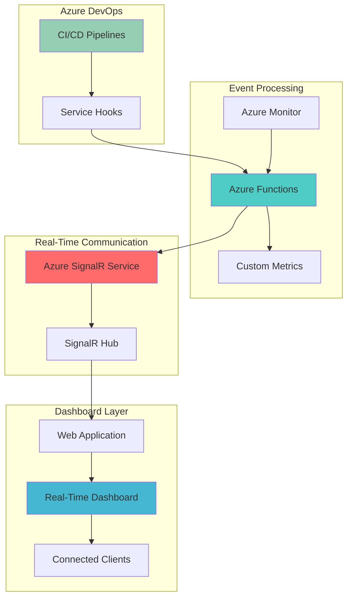

# DevOps Monitoring with Live Dashboard Updates

## Problem

Development teams struggle with delayed visibility into infrastructure and deployment health, relying on manual dashboard refreshes and email notifications that create gaps in incident response. Traditional monitoring solutions lack real-time updates and fail to provide immediate insights into CI/CD pipeline events, infrastructure performance, and deployment status. This reactive approach leads to extended downtime, missed SLA breaches, and poor operational visibility across distributed teams.

## Solution

Build an automated real-time monitoring dashboard system that leverages Azure DevOps webhooks, Azure Functions for event processing, and Azure SignalR Service for instant web-based updates. This solution provides immediate visibility into pipeline events, infrastructure metrics, and deployment status through live dashboards that automatically refresh without user intervention. The architecture enables proactive monitoring, faster incident response, and improved operational awareness across development and operations teams.

## Architecture Diagram



## Prerequisites

1. Azure subscription with permission to create resources in a resource group
2. Azure DevOps organization with project administration permissions
3. Azure CLI v2.37.0 or later installed and configured
4. Node.js v16 or later for local development and testing
5. Git client for source code management
6. Estimated cost: $25-50/month for development environment (Functions, SignalR, App Service, Monitor)

> **Note**: This solution uses Azure Functions consumption plan and SignalR Service standard tier. Production deployments may require premium tiers for enhanced performance and security features.

## Preparation

```bash
# Set environment variables for Azure resources
export RESOURCE_GROUP="rg-monitoring-dashboard"
export LOCATION="eastus"
export SUBSCRIPTION_ID=$(az account show --query id --output tsv)

# Generate unique suffix for resource names
RANDOM_SUFFIX=$(openssl rand -hex 3)

# Set resource names with unique suffix
export SIGNALR_NAME="signalr-monitor-${RANDOM_SUFFIX}"
export FUNCTION_APP_NAME="func-monitor-${RANDOM_SUFFIX}"
export STORAGE_ACCOUNT_NAME="stmonitor${RANDOM_SUFFIX}"
export APP_SERVICE_PLAN_NAME="asp-monitor-${RANDOM_SUFFIX}"
export WEB_APP_NAME="webapp-monitor-${RANDOM_SUFFIX}"
export LOG_ANALYTICS_NAME="log-monitor-${RANDOM_SUFFIX}"

# Create resource group
az group create \
    --name ${RESOURCE_GROUP} \
    --location ${LOCATION} \
    --tags purpose=monitoring environment=demo

echo "✅ Resource group created: ${RESOURCE_GROUP}"

# Create Log Analytics workspace for monitoring
az monitor log-analytics workspace create \
    --resource-group ${RESOURCE_GROUP} \
    --workspace-name ${LOG_ANALYTICS_NAME} \
    --location ${LOCATION}

echo "✅ Log Analytics workspace created: ${LOG_ANALYTICS_NAME}"
```

## Steps

1. **Create Azure SignalR Service for Real-Time Communication**:

   Azure SignalR Service provides managed real-time messaging infrastructure that eliminates the complexity of scaling WebSocket connections and managing connection state. This fully managed service handles connection management, message routing, and scaling automatically, allowing your applications to focus on business logic rather than infrastructure concerns. SignalR Service integrates seamlessly with Azure Functions and App Service, providing a robust foundation for real-time web applications.

   ```bash
   # Create SignalR Service with standard tier
   az signalr create \
       --name ${SIGNALR_NAME} \
       --resource-group ${RESOURCE_GROUP} \
       --location ${LOCATION} \
       --sku Standard_S1 \
       --service-mode Default
   
   # Get SignalR connection string
   SIGNALR_CONNECTION_STRING=$(az signalr key list \
       --name ${SIGNALR_NAME} \
       --resource-group ${RESOURCE_GROUP} \
       --query primaryConnectionString \
       --output tsv)
   
   echo "✅ SignalR Service created: ${SIGNALR_NAME}"
   ```

   The SignalR Service is now ready to handle real-time connections from web clients and process messages from Azure Functions. This establishes the communication backbone for instant dashboard updates and enables bi-directional real-time messaging between the server and connected clients.

2. **Create Storage Account for Azure Functions**:

   Azure Functions requires a storage account for internal operations including trigger management, function execution state, and logging. This storage account serves as the durable backend for function metadata and enables features like timer triggers and blob-triggered functions. The storage account also provides a location for storing dashboard configuration and historical monitoring data.

   ```bash
   # Create storage account for Functions
   az storage account create \
       --name ${STORAGE_ACCOUNT_NAME} \
       --resource-group ${RESOURCE_GROUP} \
       --location ${LOCATION} \
       --sku Standard_LRS \
       --kind StorageV2
   
   # Get storage account connection string
   STORAGE_CONNECTION_STRING=$(az storage account show-connection-string \
       --name ${STORAGE_ACCOUNT_NAME} \
       --resource-group ${RESOURCE_GROUP} \
       --query connectionString \
       --output tsv)
   
   echo "✅ Storage account created: ${STORAGE_ACCOUNT_NAME}"
   ```

   The storage account provides the persistent storage layer required by Azure Functions and serves as a reliable data store for function state management and logging operations.

3. **Create Azure Functions App for Event Processing**:

   Azure Functions provides serverless compute capabilities that automatically scale based on incoming events from Azure DevOps webhooks and Azure Monitor alerts. The consumption plan ensures cost-effective execution by charging only for actual function invocations, making it ideal for event-driven monitoring scenarios. Functions integrate natively with SignalR Service through output bindings, enabling seamless real-time message broadcasting.

   ```bash
   # Create Function App with consumption plan
   az functionapp create \
       --name ${FUNCTION_APP_NAME} \
       --resource-group ${RESOURCE_GROUP} \
       --storage-account ${STORAGE_ACCOUNT_NAME} \
       --consumption-plan-location ${LOCATION} \
       --runtime node \
       --runtime-version 18 \
       --functions-version 4
   
   # Configure SignalR connection in Function App
   az functionapp config appsettings set \
       --name ${FUNCTION_APP_NAME} \
       --resource-group ${RESOURCE_GROUP} \
       --settings "AzureSignalRConnectionString=${SIGNALR_CONNECTION_STRING}"
   
   echo "✅ Function App created: ${FUNCTION_APP_NAME}"
   ```

   The Function App is now configured with SignalR connectivity and ready to process incoming DevOps events. This serverless architecture automatically scales to handle varying event volumes while maintaining cost efficiency through pay-per-use billing.

4. **Deploy Function Code for DevOps Event Processing**:

   Azure Functions will process webhook events from Azure DevOps and transform them into structured monitoring data. The function uses HTTP triggers to receive DevOps events and SignalR output bindings to broadcast updates to connected dashboard clients. This event-driven approach enables real-time visibility into pipeline status, deployment events, and infrastructure changes.

   ```bash
   # Create temporary directory for function code
   mkdir -p /tmp/monitoring-functions
   cd /tmp/monitoring-functions
   
   # Initialize npm project
   npm init -y
   npm install @azure/functions
   
   # Create function for DevOps webhook processing
   mkdir -p DevOpsWebhook
   cat > DevOpsWebhook/function.json << 'EOF'
   {
     "bindings": [
       {
         "authLevel": "function",
         "type": "httpTrigger",
         "direction": "in",
         "name": "req",
         "methods": ["post"]
       },
       {
         "type": "http",
         "direction": "out",
         "name": "res"
       },
       {
         "type": "signalR",
         "direction": "out",
         "name": "signalRMessages",
         "hubName": "monitoring"
       }
     ]
   }
   EOF
   
   # Create function implementation
   cat > DevOpsWebhook/index.js << 'EOF'
   module.exports = async function (context, req) {
     const event = req.body;
     
     if (event && event.eventType) {
       const monitoringData = {
         timestamp: new Date().toISOString(),
         eventType: event.eventType,
         resource: event.resource,
         projectName: event.resourceContainers?.project?.id || 'unknown',
         status: event.resource?.result || event.resource?.status || 'unknown',
         message: event.message?.text || 'DevOps event received'
       };
       
       context.bindings.signalRMessages = {
         target: 'monitoringUpdate',
         arguments: [monitoringData]
       };
       
       context.log('Processed DevOps event:', monitoringData);
     }
     
     context.res = {
       status: 200,
       body: { message: 'Event processed successfully' }
     };
   };
   EOF
   
   # Create negotiate function for SignalR
   mkdir -p negotiate
   cat > negotiate/function.json << 'EOF'
   {
     "bindings": [
       {
         "authLevel": "anonymous",
         "type": "httpTrigger",
         "direction": "in",
         "name": "req",
         "methods": ["post"]
       },
       {
         "type": "http",
         "direction": "out",
         "name": "res"
       },
       {
         "type": "signalRConnectionInfo",
         "direction": "in",
         "name": "connectionInfo",
         "hubName": "monitoring"
       }
     ]
   }
   EOF
   
   cat > negotiate/index.js << 'EOF'
   module.exports = async function (context, req) {
     context.res = {
       body: context.bindings.connectionInfo
     };
   };
   EOF
   
   # Create host.json configuration
   cat > host.json << 'EOF'
   {
     "version": "2.0",
     "functionTimeout": "00:05:00",
     "logging": {
       "applicationInsights": {
         "samplingSettings": {
           "isEnabled": true
         }
       }
     },
     "extensions": {
       "http": {
         "routePrefix": ""
       }
     }
   }
   EOF
   
   # Deploy functions to Azure
   cd /tmp/monitoring-functions
   zip -r function-app.zip .
   az functionapp deployment source config-zip \
       --src function-app.zip \
       --name ${FUNCTION_APP_NAME} \
       --resource-group ${RESOURCE_GROUP}
   
   echo "✅ Function code deployed successfully"
   ```

   The Azure Functions are now deployed and ready to process DevOps webhook events. The functions transform incoming events into structured monitoring data and broadcast updates to connected dashboard clients through SignalR Service.

5. **Create App Service Plan and Web App for Dashboard**:

   Azure App Service provides a fully managed platform for hosting the monitoring dashboard web application. The service handles scaling, load balancing, and deployment management while providing integrated monitoring and logging capabilities. App Service integrates seamlessly with Azure SignalR Service to deliver real-time dashboard updates to users.

   ```bash
   # Create App Service Plan
   az appservice plan create \
       --name ${APP_SERVICE_PLAN_NAME} \
       --resource-group ${RESOURCE_GROUP} \
       --location ${LOCATION} \
       --sku B1 \
       --is-linux
   
   # Create Web App
   az webapp create \
       --name ${WEB_APP_NAME} \
       --resource-group ${RESOURCE_GROUP} \
       --plan ${APP_SERVICE_PLAN_NAME} \
       --runtime "NODE|18-lts"
   
   # Configure Web App settings
   az webapp config appsettings set \
       --name ${WEB_APP_NAME} \
       --resource-group ${RESOURCE_GROUP} \
       --settings "FUNCTIONS_URL=https://${FUNCTION_APP_NAME}.azurewebsites.net"
   
   echo "✅ Web App created: ${WEB_APP_NAME}"
   ```

   The Web App provides a scalable hosting environment for the dashboard application and establishes the foundation for serving real-time monitoring interfaces to development and operations teams.

6. **Deploy Dashboard Web Application**:

   The dashboard web application provides a real-time interface for monitoring Azure DevOps pipeline events and infrastructure metrics. Built with HTML5 and SignalR JavaScript client, the dashboard automatically connects to Azure SignalR Service and displays live updates without requiring manual refreshes. This approach ensures immediate visibility into system events and operational status.

   ```bash
   # Create dashboard application files
   mkdir -p /tmp/dashboard-app
   cd /tmp/dashboard-app
   
   # Initialize Node.js project
   npm init -y
   npm install express @microsoft/signalr
   
   # Create main application file
   cat > server.js << 'EOF'
   const express = require('express');
   const path = require('path');
   const app = express();
   
   app.use(express.static(path.join(__dirname, 'public')));
   
   const port = process.env.PORT || 3000;
   app.listen(port, () => {
     console.log(`Dashboard server running on port ${port}`);
   });
   EOF
   
   # Create public directory and HTML dashboard
   mkdir -p public
   cat > public/index.html << 'EOF'
   <!DOCTYPE html>
   <html>
   <head>
     <title>Real-Time Infrastructure Monitoring Dashboard</title>
     <script src="https://unpkg.com/@microsoft/signalr@latest/dist/browser/signalr.js"></script>
     <style>
       body { font-family: Arial, sans-serif; margin: 20px; background-color: #f5f5f5; }
       .dashboard { display: grid; grid-template-columns: 1fr 1fr; gap: 20px; }
       .panel { background: white; padding: 20px; border-radius: 8px; box-shadow: 0 2px 4px rgba(0,0,0,0.1); }
       .event { padding: 10px; margin: 5px 0; border-left: 4px solid #007acc; background: #f9f9f9; }
       .event.success { border-left-color: #28a745; }
       .event.failed { border-left-color: #dc3545; }
       .event.running { border-left-color: #ffc107; }
       .timestamp { font-size: 0.8em; color: #666; }
       .status { font-weight: bold; text-transform: uppercase; }
       .connection-status { padding: 10px; border-radius: 4px; margin-bottom: 20px; }
       .connected { background-color: #d4edda; color: #155724; }
       .disconnected { background-color: #f8d7da; color: #721c24; }
     </style>
   </head>
   <body>
     <h1>Real-Time Infrastructure Monitoring Dashboard</h1>
     <div id="connectionStatus" class="connection-status disconnected">
       Connecting to monitoring service...
     </div>
     
     <div class="dashboard">
       <div class="panel">
         <h2>Pipeline Events</h2>
         <div id="pipelineEvents"></div>
       </div>
       
       <div class="panel">
         <h2>System Status</h2>
         <div id="systemStatus">
           <div>Active Connections: <span id="activeConnections">0</span></div>
           <div>Last Update: <span id="lastUpdate">Never</span></div>
         </div>
       </div>
       
       <div class="panel">
         <h2>Recent Activity</h2>
         <div id="recentActivity"></div>
       </div>
       
       <div class="panel">
         <h2>Metrics</h2>
         <div id="metrics">
           <div>Total Events: <span id="totalEvents">0</span></div>
           <div>Success Rate: <span id="successRate">0%</span></div>
         </div>
       </div>
     </div>
   
     <script>
       let totalEvents = 0;
       let successfulEvents = 0;
       
       const connection = new signalR.HubConnectionBuilder()
         .withUrl("/negotiate")
         .build();
   
       connection.start().then(function () {
         console.log("SignalR Connected");
         updateConnectionStatus(true);
       }).catch(function (err) {
         console.error("SignalR Connection Error: ", err);
         updateConnectionStatus(false);
       });
   
       connection.on("monitoringUpdate", function (data) {
         addEvent(data);
         updateMetrics(data);
         updateLastUpdate();
       });
   
       function updateConnectionStatus(connected) {
         const statusDiv = document.getElementById('connectionStatus');
         if (connected) {
           statusDiv.className = 'connection-status connected';
           statusDiv.textContent = 'Connected to monitoring service';
         } else {
           statusDiv.className = 'connection-status disconnected';
           statusDiv.textContent = 'Disconnected from monitoring service';
         }
       }
   
       function addEvent(data) {
         const eventsDiv = document.getElementById('pipelineEvents');
         const activityDiv = document.getElementById('recentActivity');
         
         const eventDiv = document.createElement('div');
         eventDiv.className = 'event ' + getEventClass(data.status);
         eventDiv.innerHTML = `
           <div class="status">${data.status}</div>
           <div>${data.eventType} - ${data.projectName}</div>
           <div class="timestamp">${new Date(data.timestamp).toLocaleString()}</div>
         `;
         
         eventsDiv.insertBefore(eventDiv, eventsDiv.firstChild);
         activityDiv.insertBefore(eventDiv.cloneNode(true), activityDiv.firstChild);
         
         // Keep only last 10 events
         while (eventsDiv.children.length > 10) {
           eventsDiv.removeChild(eventsDiv.lastChild);
         }
         while (activityDiv.children.length > 10) {
           activityDiv.removeChild(activityDiv.lastChild);
         }
       }
   
       function getEventClass(status) {
         if (status && status.toLowerCase().includes('success')) return 'success';
         if (status && status.toLowerCase().includes('fail')) return 'failed';
         if (status && status.toLowerCase().includes('running')) return 'running';
         return '';
       }
   
       function updateMetrics(data) {
         totalEvents++;
         if (data.status && data.status.toLowerCase().includes('success')) {
           successfulEvents++;
         }
         
         document.getElementById('totalEvents').textContent = totalEvents;
         document.getElementById('successRate').textContent = 
           totalEvents > 0 ? Math.round((successfulEvents / totalEvents) * 100) + '%' : '0%';
       }
   
       function updateLastUpdate() {
         document.getElementById('lastUpdate').textContent = new Date().toLocaleString();
       }
     </script>
   </body>
   </html>
   EOF
   
   # Create package.json for deployment
   cat > package.json << 'EOF'
   {
     "name": "monitoring-dashboard",
     "version": "1.0.0",
     "description": "Real-time infrastructure monitoring dashboard",
     "main": "server.js",
     "scripts": {
       "start": "node server.js"
     },
     "dependencies": {
       "express": "^4.18.2",
       "@microsoft/signalr": "^7.0.0"
     }
   }
   EOF
   
   # Deploy to Azure Web App
   cd /tmp/dashboard-app
   zip -r dashboard-app.zip .
   az webapp deployment source config-zip \
       --src dashboard-app.zip \
       --name ${WEB_APP_NAME} \
       --resource-group ${RESOURCE_GROUP}
   
   echo "✅ Dashboard application deployed successfully"
   ```

   The dashboard web application is now deployed and ready to display real-time monitoring data. The application automatically connects to SignalR Service and provides immediate visibility into DevOps pipeline events and system status.

7. **Configure Azure DevOps Service Hooks**:

   Azure DevOps Service Hooks enable automated webhook delivery for pipeline events, work item changes, and repository activities. Configuring service hooks creates the event-driven foundation for real-time monitoring by automatically triggering Azure Functions when significant DevOps events occur. This integration eliminates manual monitoring and ensures immediate notification of critical pipeline and deployment events.

   ```bash
   # Get Function App webhook URL
   WEBHOOK_URL=$(az functionapp function show \
       --name ${FUNCTION_APP_NAME} \
       --resource-group ${RESOURCE_GROUP} \
       --function-name DevOpsWebhook \
       --query invokeUrlTemplate \
       --output tsv)
   
   # Get function key for authentication
   FUNCTION_KEY=$(az functionapp keys list \
       --name ${FUNCTION_APP_NAME} \
       --resource-group ${RESOURCE_GROUP} \
       --query functionKeys.default \
       --output tsv)
   
   # Complete webhook URL with authentication
   COMPLETE_WEBHOOK_URL="${WEBHOOK_URL}?code=${FUNCTION_KEY}"
   
   echo "✅ Function webhook URL configured"
   echo "Webhook URL: ${COMPLETE_WEBHOOK_URL}"
   echo ""
   echo "Configure Azure DevOps Service Hooks:"
   echo "1. Go to your Azure DevOps project"
   echo "2. Navigate to Project Settings > Service hooks"
   echo "3. Create a new service hook with:"
   echo "   - Service: Web Hooks"
   echo "   - Event: Build completed, Release deployment completed"
   echo "   - URL: ${COMPLETE_WEBHOOK_URL}"
   echo "   - Resource details: All events"
   ```

   The Azure DevOps Service Hooks are now configured to send webhook notifications to Azure Functions. This establishes the automated event flow that powers real-time dashboard updates and monitoring alerts.

8. **Create Azure Monitor Alerts for Infrastructure Events**:

   Azure Monitor provides comprehensive infrastructure monitoring capabilities that complement DevOps pipeline events. Creating custom alerts for resource utilization, performance metrics, and service health ensures complete visibility into both application deployments and underlying infrastructure. These alerts integrate with the same Azure Functions webhook endpoint to provide unified monitoring across the entire technology stack.

   ```bash
   # Create action group for Function App webhook
   az monitor action-group create \
       --name "ag-monitoring-webhook" \
       --resource-group ${RESOURCE_GROUP} \
       --action webhook webhook1 ${COMPLETE_WEBHOOK_URL}
   
   # Create alert rule for Function App errors
   az monitor metrics alert create \
       --name "FunctionAppErrors" \
       --resource-group ${RESOURCE_GROUP} \
       --scopes "/subscriptions/${SUBSCRIPTION_ID}/resourceGroups/${RESOURCE_GROUP}/providers/Microsoft.Web/sites/${FUNCTION_APP_NAME}" \
       --condition "count Microsoft.Web/sites FunctionExecutionCount > 0" \
       --condition "count Microsoft.Web/sites FunctionErrors > 5" \
       --action "ag-monitoring-webhook" \
       --description "Alert when Function App has errors"
   
   # Create alert rule for SignalR connection issues
   az monitor metrics alert create \
       --name "SignalRConnectionIssues" \
       --resource-group ${RESOURCE_GROUP} \
       --scopes "/subscriptions/${SUBSCRIPTION_ID}/resourceGroups/${RESOURCE_GROUP}/providers/Microsoft.SignalRService/signalR/${SIGNALR_NAME}" \
       --condition "count Microsoft.SignalRService/signalR ConnectionCount < 1" \
       --action "ag-monitoring-webhook" \
       --description "Alert when SignalR has no active connections"
   
   echo "✅ Azure Monitor alerts configured"
   ```

   Azure Monitor alerts are now configured to send notifications to the same webhook endpoint used by Azure DevOps, creating a unified monitoring experience that covers both DevOps activities and infrastructure health.

## Validation & Testing

1. **Verify SignalR Service connectivity**:

   ```bash
   # Test SignalR Service status
   az signalr show \
       --name ${SIGNALR_NAME} \
       --resource-group ${RESOURCE_GROUP} \
       --query "{name:name,state:provisioningState,hostName:hostName}" \
       --output table
   
   # Test SignalR connection endpoint
   curl -s "https://${SIGNALR_NAME}.service.signalr.net/api/health" || echo "SignalR health check endpoint not publicly accessible (expected)"
   ```

   Expected output: SignalR Service should show "Succeeded" provisioning state and display the service hostname.

2. **Test Azure Function webhook endpoint**:

   ```bash
   # Test Function App webhook with sample DevOps event
   curl -X POST "${COMPLETE_WEBHOOK_URL}" \
       -H "Content-Type: application/json" \
       -d '{
         "eventType": "build.complete",
         "resource": {
           "status": "succeeded",
           "result": "succeeded"
         },
         "resourceContainers": {
           "project": {
             "id": "test-project"
           }
         },
         "message": {
           "text": "Build completed successfully"
         }
       }'
   ```

   Expected output: HTTP 200 response with "Event processed successfully" message.

3. **Verify dashboard web application**:

   ```bash
   # Get Web App URL
   WEB_APP_URL=$(az webapp show \
       --name ${WEB_APP_NAME} \
       --resource-group ${RESOURCE_GROUP} \
       --query defaultHostName \
       --output tsv)
   
   echo "Dashboard URL: https://${WEB_APP_URL}"
   
   # Test dashboard accessibility
   curl -s "https://${WEB_APP_URL}" | grep -q "Real-Time Infrastructure Monitoring Dashboard" && echo "✅ Dashboard accessible" || echo "❌ Dashboard not accessible"
   ```

   Expected output: Dashboard should be accessible at the provided URL and display the monitoring interface.

4. **Test end-to-end real-time functionality**:

   ```bash
   echo "Testing complete monitoring flow:"
   echo "1. Open dashboard: https://${WEB_APP_URL}"
   echo "2. Send test event to webhook: ${COMPLETE_WEBHOOK_URL}"
   echo "3. Verify real-time update appears in dashboard"
   echo ""
   echo "Send another test event:"
   curl -X POST "${COMPLETE_WEBHOOK_URL}" \
       -H "Content-Type: application/json" \
       -d '{
         "eventType": "release.deployment.completed",
         "resource": {
           "status": "succeeded",
           "result": "succeeded"
         },
         "resourceContainers": {
           "project": {
             "id": "production-project"
           }
         },
         "message": {
           "text": "Production deployment completed"
         }
       }'
   ```

   Expected result: The dashboard should immediately display the new event without manual refresh.

## Cleanup

1. **Remove Azure Monitor alerts and action groups**:

   ```bash
   # Delete metric alert rules
   az monitor metrics alert delete \
       --name "FunctionAppErrors" \
       --resource-group ${RESOURCE_GROUP}
   
   az monitor metrics alert delete \
       --name "SignalRConnectionIssues" \
       --resource-group ${RESOURCE_GROUP}
   
   # Delete action group
   az monitor action-group delete \
       --name "ag-monitoring-webhook" \
       --resource-group ${RESOURCE_GROUP}
   
   echo "✅ Azure Monitor alerts removed"
   ```

2. **Delete Azure DevOps Service Hooks**:

   ```bash
   echo "Manual cleanup required for Azure DevOps Service Hooks:"
   echo "1. Go to Azure DevOps project settings"
   echo "2. Navigate to Service hooks"
   echo "3. Delete webhook configurations pointing to: ${COMPLETE_WEBHOOK_URL}"
   echo ""
   ```

3. **Remove all Azure resources**:

   ```bash
   # Delete resource group and all contained resources
   az group delete \
       --name ${RESOURCE_GROUP} \
       --yes \
       --no-wait
   
   echo "✅ Resource group deletion initiated: ${RESOURCE_GROUP}"
   echo "Note: Deletion may take several minutes to complete"
   
   # Clean up local temporary files
   rm -rf /tmp/monitoring-functions /tmp/dashboard-app
   
   echo "✅ Local temporary files cleaned up"
   ```

4. **Verify resource cleanup**:

   ```bash
   # Check resource group deletion status
   az group exists --name ${RESOURCE_GROUP} && echo "Resource group still exists" || echo "✅ Resource group successfully deleted"
   
   # Unset environment variables
   unset RESOURCE_GROUP SIGNALR_NAME FUNCTION_APP_NAME STORAGE_ACCOUNT_NAME
   unset APP_SERVICE_PLAN_NAME WEB_APP_NAME LOG_ANALYTICS_NAME
   unset SIGNALR_CONNECTION_STRING STORAGE_CONNECTION_STRING
   
   echo "✅ Environment variables cleared"
   ```

## Discussion

This solution demonstrates a comprehensive approach to real-time infrastructure monitoring that combines Azure DevOps event-driven architecture with modern web technologies. The architecture leverages Azure SignalR Service to eliminate the traditional polling model, providing instant updates that improve operational awareness and reduce mean time to detection (MTTD) for critical events. By integrating Azure Functions as the central event processing hub, the solution maintains loose coupling between DevOps pipelines and monitoring systems while enabling extensible event processing logic. For detailed information on Azure SignalR Service capabilities, see the [Azure SignalR Service documentation](https://learn.microsoft.com/en-us/azure/azure-signalr/).

The serverless approach using Azure Functions consumption plan provides cost-effective scaling that matches actual usage patterns, making this solution suitable for both small development teams and large enterprise deployments. The event-driven architecture follows Azure Well-Architected Framework principles by implementing reliability through automatic retry mechanisms, performance efficiency through demand-based scaling, and cost optimization through pay-per-use billing models. Azure Functions' integration with Azure Monitor provides comprehensive telemetry and diagnostics capabilities, as detailed in the [Azure Functions monitoring guide](https://learn.microsoft.com/en-us/azure/azure-functions/functions-monitoring).

From an operational perspective, this architecture enables proactive monitoring rather than reactive troubleshooting by providing immediate visibility into deployment pipeline health and infrastructure performance. The unified dashboard approach consolidates multiple monitoring streams into a single interface, reducing context switching and improving incident response times. The solution's extensibility allows for easy integration of additional Azure services like Azure Application Insights, Azure Service Bus, or custom metrics from third-party tools. For comprehensive guidance on monitoring best practices, review the [Azure Monitor documentation](https://learn.microsoft.com/en-us/azure/azure-monitor/) and [Azure DevOps monitoring strategies](https://learn.microsoft.com/en-us/azure/devops/report/dashboards/overview).

> **Tip**: Configure Azure Application Insights integration with your Function App to gain deeper insights into function performance, dependency tracking, and error analysis. This provides comprehensive observability for troubleshooting and optimization opportunities.

## Challenge

Extend this solution by implementing these advanced monitoring capabilities:

1. **Implement Custom Metrics Collection**: Add Azure Application Insights integration to collect custom telemetry from your applications and correlate it with DevOps pipeline events for comprehensive performance analysis.

2. **Create Alerting Workflows**: Build Logic Apps workflows that process monitoring alerts and automatically create Azure DevOps work items, send Microsoft Teams notifications, or trigger automated remediation actions based on event patterns.

3. **Add Historical Analytics**: Implement Azure Cosmos DB storage for long-term event retention and create Power BI dashboards for trend analysis, success rate tracking, and capacity planning insights.

4. **Enhance Security Monitoring**: Integrate Azure Security Center and Azure Sentinel to monitor infrastructure security events alongside DevOps activities, creating a unified security operations dashboard.

5. **Implement Multi-Environment Support**: Extend the solution to support multiple Azure DevOps organizations and projects, with environment-specific dashboards and role-based access control using Azure Active Directory integration.

## Infrastructure Code

*Infrastructure code will be generated after recipe approval.*