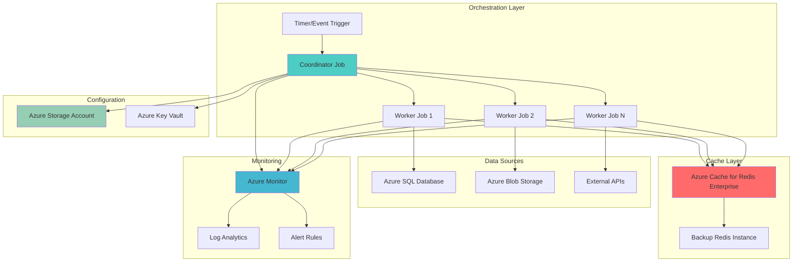

# Distributed Cache Warm-up Automation with Container Apps Jobs and Redis Enterprise

## Problem

Modern applications often experience performance degradation during cold starts or after cache expiration, leading to increased latency and poor user experience. Traditional cache warm-up strategies either run continuously consuming resources or fail to efficiently distribute workloads across multiple data sources, resulting in inconsistent performance and increased infrastructure costs.

## Solution

This solution implements an automated distributed cache warm-up system using Azure Container Apps Jobs to orchestrate parallel cache population workflows for Azure Cache for Redis Enterprise. The system triggers containerized jobs that efficiently populate cache with frequently accessed data, includes comprehensive monitoring through Azure Monitor, and provides failover capabilities to ensure cache availability across different scenarios.

## Architecture Diagram



## Prerequisites

1. Azure subscription with Container Apps and Cache for Redis Enterprise permissions
2. Azure CLI v2.50.0 or later installed and configured
3. Basic knowledge of containerization and Redis caching concepts
4. Docker installed for local container image building
5. Estimated cost: $200-400/month for Redis Enterprise cluster and Container Apps environment

> **Note**: This recipe uses Azure Cache for Redis Enterprise tier which provides advanced features like active geo-replication and Redis modules. Consider using Standard tier for development environments to reduce costs.

## Preparation

```bash
# Set environment variables for Azure resources
export RESOURCE_GROUP="rg-cache-warmup-${RANDOM_SUFFIX}"
export LOCATION="eastus"
export SUBSCRIPTION_ID=$(az account show --query id --output tsv)

# Generate unique suffix for resource names
RANDOM_SUFFIX=$(openssl rand -hex 3)

# Container Apps environment and job names
export CONTAINER_ENV_NAME="env-cache-warmup-${RANDOM_SUFFIX}"
export COORDINATOR_JOB_NAME="job-coordinator-${RANDOM_SUFFIX}"
export WORKER_JOB_NAME="job-worker-${RANDOM_SUFFIX}"

# Redis and storage names
export REDIS_NAME="redis-enterprise-${RANDOM_SUFFIX}"
export STORAGE_ACCOUNT_NAME="stcachewarmup${RANDOM_SUFFIX}"
export KEY_VAULT_NAME="kv-cache-warmup-${RANDOM_SUFFIX}"

# Monitoring resources
export LOG_ANALYTICS_NAME="log-cache-warmup-${RANDOM_SUFFIX}"

# Create resource group
az group create \
    --name ${RESOURCE_GROUP} \
    --location ${LOCATION} \
    --tags purpose=cache-warmup environment=demo

echo "✅ Resource group created: ${RESOURCE_GROUP}"

# Create Log Analytics workspace for monitoring
az monitor log-analytics workspace create \
    --resource-group ${RESOURCE_GROUP} \
    --workspace-name ${LOG_ANALYTICS_NAME} \
    --location ${LOCATION} \
    --sku PerGB2018

echo "✅ Log Analytics workspace created: ${LOG_ANALYTICS_NAME}"

# Get Log Analytics workspace ID for Container Apps environment
LOG_ANALYTICS_ID=$(az monitor log-analytics workspace show \
    --resource-group ${RESOURCE_GROUP} \
    --workspace-name ${LOG_ANALYTICS_NAME} \
    --query customerId --output tsv)

echo "✅ Log Analytics workspace ID retrieved: ${LOG_ANALYTICS_ID}"
```

## Steps

1. **Create Azure Container Apps Environment**:

   Azure Container Apps environments provide isolated, secure boundaries for running containerized applications and jobs. The environment integrates with Azure Monitor for comprehensive observability, enabling centralized logging and metrics collection across all container workloads. This foundational component supports both continuous applications and finite-duration jobs with shared networking and security policies.

   ```bash
   # Create Container Apps environment with monitoring
   az containerapp env create \
       --name ${CONTAINER_ENV_NAME} \
       --resource-group ${RESOURCE_GROUP} \
       --location ${LOCATION} \
       --logs-workspace-id ${LOG_ANALYTICS_ID} \
       --tags purpose=cache-warmup

   echo "✅ Container Apps environment created: ${CONTAINER_ENV_NAME}"
   ```

   The Container Apps environment is now ready to host cache warm-up jobs with integrated monitoring and logging. This managed environment automatically handles container orchestration, scaling, and health monitoring while providing secure networking boundaries for the cache population workloads.

2. **Create Azure Cache for Redis Enterprise Cluster**:

   Azure Cache for Redis Enterprise provides enterprise-grade caching with advanced features including active geo-replication, Redis modules support, and enhanced security. The Enterprise tier delivers superior performance compared to Standard Redis, with built-in high availability and automatic failover capabilities essential for production cache workloads.

   ```bash
   # Create Redis Enterprise cluster
   az redis create \
       --name ${REDIS_NAME} \
       --resource-group ${RESOURCE_GROUP} \
       --location ${LOCATION} \
       --sku Enterprise \
       --vm-size E10 \
       --enable-non-ssl-port false \
       --redis-version 6.0 \
       --tags purpose=cache-warmup

   echo "✅ Redis Enterprise cluster creation initiated: ${REDIS_NAME}"
   echo "Note: Redis Enterprise deployment may take 20-30 minutes"
   
   # Wait for Redis deployment to complete
   az redis wait \
       --name ${REDIS_NAME} \
       --resource-group ${RESOURCE_GROUP} \
       --created \
       --timeout 1800
   
   echo "✅ Redis Enterprise cluster ready: ${REDIS_NAME}"
   ```

   The Redis Enterprise cluster provides enterprise-grade caching capabilities with automatic scaling, persistence, and geographic distribution. This high-performance cache layer serves as the target for distributed warm-up operations, ensuring consistent low-latency data access for applications.

3. **Create Azure Storage Account for Configuration**:

   Azure Storage provides durable, scalable storage for configuration files, job coordination data, and warm-up progress tracking. The storage account serves as a central repository for job coordination, enabling multiple container jobs to share configuration and synchronize their cache population activities efficiently.

   ```bash
   # Create storage account for job coordination
   az storage account create \
       --name ${STORAGE_ACCOUNT_NAME} \
       --resource-group ${RESOURCE_GROUP} \
       --location ${LOCATION} \
       --sku Standard_LRS \
       --kind StorageV2 \
       --access-tier Hot \
       --tags purpose=cache-warmup

   echo "✅ Storage account created: ${STORAGE_ACCOUNT_NAME}"

   # Create blob container for job coordination
   az storage container create \
       --name coordination \
       --account-name ${STORAGE_ACCOUNT_NAME} \
       --public-access off

   echo "✅ Blob container created for job coordination"
   ```

   The storage account provides persistent storage for job coordination files, configuration data, and warm-up progress tracking. This enables efficient coordination between multiple container jobs and maintains state across job executions for consistent cache population.

4. **Create Azure Key Vault for Secrets Management**:

   Azure Key Vault provides secure, centralized management of application secrets, keys, and certificates. This security-first approach ensures that Redis connection strings, API keys, and other sensitive configuration data are protected and accessible only to authorized container jobs through managed identities.

   ```bash
   # Create Key Vault for secrets management
   az keyvault create \
       --name ${KEY_VAULT_NAME} \
       --resource-group ${RESOURCE_GROUP} \
       --location ${LOCATION} \
       --sku standard \
       --tags purpose=cache-warmup

   echo "✅ Key Vault created: ${KEY_VAULT_NAME}"

   # Store Redis connection string in Key Vault
   REDIS_CONNECTION_STRING=$(az redis list-keys \
       --name ${REDIS_NAME} \
       --resource-group ${RESOURCE_GROUP} \
       --query primaryKey --output tsv)

   az keyvault secret set \
       --vault-name ${KEY_VAULT_NAME} \
       --name redis-connection-string \
       --value "${REDIS_NAME}.redis.cache.windows.net:6380,password=${REDIS_CONNECTION_STRING},ssl=True,abortConnect=False"

   echo "✅ Redis connection string stored in Key Vault"
   ```

   The Key Vault now securely stores sensitive configuration data required for cache warm-up operations. This centralized secret management approach ensures consistent security policies across all container jobs while maintaining compliance with enterprise security requirements.

5. **Create Container Image for Cache Coordinator**:

   The coordinator container orchestrates distributed cache warm-up workflows by partitioning work across multiple worker jobs. This intelligent coordination ensures efficient data distribution, prevents duplicate work, and monitors overall progress while maintaining fault tolerance across the distributed warm-up process.

   ```bash
   # Create Dockerfile for coordinator container
   cat > Dockerfile.coordinator << 'EOF'
FROM mcr.microsoft.com/dotnet/runtime:8.0-alpine AS base
WORKDIR /app

FROM mcr.microsoft.com/dotnet/sdk:8.0-alpine AS build
WORKDIR /src
COPY coordinator.csproj .
RUN dotnet restore coordinator.csproj
COPY . .
RUN dotnet build coordinator.csproj -c Release -o /app/build

FROM build AS publish
RUN dotnet publish coordinator.csproj -c Release -o /app/publish

FROM base AS final
WORKDIR /app
COPY --from=publish /app/publish .
ENTRYPOINT ["dotnet", "coordinator.dll"]
EOF

   # Create coordinator application code
   cat > coordinator.csproj << 'EOF'
<Project Sdk="Microsoft.NET.Sdk">
  <PropertyGroup>
    <OutputType>Exe</OutputType>
    <TargetFramework>net8.0</TargetFramework>
    <Nullable>enable</Nullable>
  </PropertyGroup>
  <ItemGroup>
    <PackageReference Include="Azure.Storage.Blobs" Version="12.19.1" />
    <PackageReference Include="Azure.Security.KeyVault.Secrets" Version="4.5.0" />
    <PackageReference Include="Azure.Identity" Version="1.10.3" />
    <PackageReference Include="Microsoft.Extensions.Logging" Version="8.0.0" />
    <PackageReference Include="Microsoft.Extensions.Logging.Console" Version="8.0.0" />
  </ItemGroup>
</Project>
EOF

   # Create coordinator program
   cat > Program.cs << 'EOF'
using Azure.Storage.Blobs;
using Azure.Security.KeyVault.Secrets;
using Azure.Identity;
using Microsoft.Extensions.Logging;
using System.Text.Json;

var loggerFactory = LoggerFactory.Create(builder => builder.AddConsole());
var logger = loggerFactory.CreateLogger<Program>();

logger.LogInformation("Starting cache warm-up coordinator");

// Configuration
var resourceGroup = Environment.GetEnvironmentVariable("RESOURCE_GROUP") ?? "rg-cache-warmup";
var subscriptionId = Environment.GetEnvironmentVariable("SUBSCRIPTION_ID") ?? "";
var storageAccountName = Environment.GetEnvironmentVariable("STORAGE_ACCOUNT_NAME") ?? "";
var keyVaultName = Environment.GetEnvironmentVariable("KEY_VAULT_NAME") ?? "";
var workerJobName = Environment.GetEnvironmentVariable("WORKER_JOB_NAME") ?? "";

// Initialize Azure clients
var credential = new DefaultAzureCredential();
var blobServiceClient = new BlobServiceClient(
    new Uri($"https://{storageAccountName}.blob.core.windows.net"), 
    credential);
var secretClient = new SecretClient(
    new Uri($"https://{keyVaultName}.vault.azure.net"), 
    credential);

// Create work partitions
var workPartitions = new[]
{
    new { Id = 1, DataSource = "users", StartId = 1, EndId = 1000, Priority = "high" },
    new { Id = 2, DataSource = "products", StartId = 1, EndId = 5000, Priority = "medium" },
    new { Id = 3, DataSource = "orders", StartId = 1, EndId = 10000, Priority = "low" },
    new { Id = 4, DataSource = "inventory", StartId = 1, EndId = 2000, Priority = "high" }
};

// Upload work partitions to blob storage
var containerClient = blobServiceClient.GetBlobContainerClient("coordination");
foreach (var partition in workPartitions)
{
    var partitionJson = JsonSerializer.Serialize(partition);
    var blobClient = containerClient.GetBlobClient($"partition-{partition.Id}.json");
    await blobClient.UploadAsync(new BinaryData(partitionJson), overwrite: true);
    logger.LogInformation($"Uploaded partition {partition.Id} for {partition.DataSource}");
}

logger.LogInformation("Cache warm-up coordinator completed successfully");
EOF

   # Build coordinator image
   COORDINATOR_IMAGE="coordinator:latest"
   docker build -f Dockerfile.coordinator -t ${COORDINATOR_IMAGE} .
   
   echo "✅ Coordinator container image built: ${COORDINATOR_IMAGE}"
   ```

   The coordinator container is now ready to orchestrate distributed cache warm-up workflows. This intelligent coordinator partitions work across multiple data sources, manages job coordination through Azure Storage, and provides comprehensive logging for monitoring warm-up progress.

6. **Create Container Image for Cache Worker**:

   Worker containers execute the actual cache population tasks by retrieving data from various sources and populating Redis with structured, optimized data. Each worker handles specific data partitions, implements retry logic, and reports progress back to the coordination system for comprehensive monitoring.

   ```bash
   # Create Dockerfile for worker container
   cat > Dockerfile.worker << 'EOF'
FROM mcr.microsoft.com/dotnet/runtime:8.0-alpine AS base
WORKDIR /app

FROM mcr.microsoft.com/dotnet/sdk:8.0-alpine AS build
WORKDIR /src
COPY worker.csproj .
RUN dotnet restore worker.csproj
COPY . .
RUN dotnet build worker.csproj -c Release -o /app/build

FROM build AS publish
RUN dotnet publish worker.csproj -c Release -o /app/publish

FROM base AS final
WORKDIR /app
COPY --from=publish /app/publish .
ENTRYPOINT ["dotnet", "worker.dll"]
EOF

   # Create worker application code
   cat > worker.csproj << 'EOF'
<Project Sdk="Microsoft.NET.Sdk">
  <PropertyGroup>
    <OutputType>Exe</OutputType>
    <TargetFramework>net8.0</TargetFramework>
    <Nullable>enable</Nullable>
  </PropertyGroup>
  <ItemGroup>
    <PackageReference Include="Azure.Storage.Blobs" Version="12.19.1" />
    <PackageReference Include="Azure.Security.KeyVault.Secrets" Version="4.5.0" />
    <PackageReference Include="Azure.Identity" Version="1.10.3" />
    <PackageReference Include="StackExchange.Redis" Version="2.7.4" />
    <PackageReference Include="Microsoft.Extensions.Logging" Version="8.0.0" />
    <PackageReference Include="Microsoft.Extensions.Logging.Console" Version="8.0.0" />
  </ItemGroup>
</Project>
EOF

   # Create worker program
   cat > worker-Program.cs << 'EOF'
using Azure.Storage.Blobs;
using Azure.Security.KeyVault.Secrets;
using Azure.Identity;
using StackExchange.Redis;
using Microsoft.Extensions.Logging;
using System.Text.Json;

var loggerFactory = LoggerFactory.Create(builder => builder.AddConsole());
var logger = loggerFactory.CreateLogger<Program>();

logger.LogInformation("Starting cache warm-up worker");

// Configuration
var workerId = Environment.GetEnvironmentVariable("WORKER_ID") ?? "1";
var storageAccountName = Environment.GetEnvironmentVariable("STORAGE_ACCOUNT_NAME") ?? "";
var keyVaultName = Environment.GetEnvironmentVariable("KEY_VAULT_NAME") ?? "";

// Initialize Azure clients
var credential = new DefaultAzureCredential();
var blobServiceClient = new BlobServiceClient(
    new Uri($"https://{storageAccountName}.blob.core.windows.net"), 
    credential);
var secretClient = new SecretClient(
    new Uri($"https://{keyVaultName}.vault.azure.net"), 
    credential);

// Get Redis connection string
var redisConnectionSecret = await secretClient.GetSecretAsync("redis-connection-string");
var redis = ConnectionMultiplexer.Connect(redisConnectionSecret.Value.Value);
var database = redis.GetDatabase();

// Get work partition
var containerClient = blobServiceClient.GetBlobContainerClient("coordination");
var blobClient = containerClient.GetBlobClient($"partition-{workerId}.json");
var partitionData = await blobClient.DownloadContentAsync();
var partition = JsonSerializer.Deserialize<WorkPartition>(partitionData.Value.Content.ToString());

logger.LogInformation($"Worker {workerId} processing {partition.DataSource} from {partition.StartId} to {partition.EndId}");

// Simulate cache population based on data source
for (int i = partition.StartId; i <= partition.EndId; i++)
{
    var cacheKey = $"{partition.DataSource}:{i}";
    var cacheValue = $"{{\"id\":{i},\"type\":\"{partition.DataSource}\",\"lastUpdated\":\"{DateTime.UtcNow:yyyy-MM-ddTHH:mm:ssZ}\"}}";
    
    await database.StringSetAsync(cacheKey, cacheValue, TimeSpan.FromHours(24));
    
    if (i % 100 == 0)
    {
        logger.LogInformation($"Worker {workerId} processed {i - partition.StartId + 1} items");
    }
}

logger.LogInformation($"Worker {workerId} completed cache warm-up for {partition.DataSource}");

public class WorkPartition
{
    public int Id { get; set; }
    public string DataSource { get; set; } = "";
    public int StartId { get; set; }
    public int EndId { get; set; }
    public string Priority { get; set; } = "";
}
EOF

   # Build worker image
   WORKER_IMAGE="worker:latest"
   docker build -f Dockerfile.worker -t ${WORKER_IMAGE} .
   
   echo "✅ Worker container image built: ${WORKER_IMAGE}"
   ```

   The worker container is now ready to execute cache population tasks efficiently. Each worker processes specific data partitions, implements robust error handling, and maintains connection to Redis Enterprise for high-performance cache operations.

7. **Create Coordinator Container Apps Job**:

   Container Apps Jobs provide serverless, event-driven execution for finite-duration workloads. The coordinator job orchestrates the entire cache warm-up process by partitioning work, triggering worker jobs, and monitoring overall progress through Azure Monitor integration.

   ```bash
   # Create coordinator job
   az containerapp job create \
       --name ${COORDINATOR_JOB_NAME} \
       --resource-group ${RESOURCE_GROUP} \
       --environment ${CONTAINER_ENV_NAME} \
       --trigger-type Schedule \
       --cron-expression "0 */6 * * *" \
       --image ${COORDINATOR_IMAGE} \
       --cpu 0.5 \
       --memory 1.0Gi \
       --replica-timeout 1800 \
       --parallelism 1 \
       --replica-completion-count 1 \
       --env-vars \
           RESOURCE_GROUP=${RESOURCE_GROUP} \
           SUBSCRIPTION_ID=${SUBSCRIPTION_ID} \
           STORAGE_ACCOUNT_NAME=${STORAGE_ACCOUNT_NAME} \
           KEY_VAULT_NAME=${KEY_VAULT_NAME} \
           WORKER_JOB_NAME=${WORKER_JOB_NAME}

   echo "✅ Coordinator job created: ${COORDINATOR_JOB_NAME}"
   ```

   The coordinator job now automatically executes every 6 hours to orchestrate cache warm-up activities. This scheduled approach ensures consistent cache population without manual intervention while maintaining optimal cache performance for applications.

8. **Create Worker Container Apps Jobs**:

   Worker jobs execute the actual cache population tasks in parallel, processing different data partitions simultaneously. The parallel execution model significantly reduces cache warm-up time while maintaining efficient resource utilization through Azure Container Apps' automatic scaling capabilities.

   ```bash
   # Create worker job with parallel execution
   az containerapp job create \
       --name ${WORKER_JOB_NAME} \
       --resource-group ${RESOURCE_GROUP} \
       --environment ${CONTAINER_ENV_NAME} \
       --trigger-type Manual \
       --image ${WORKER_IMAGE} \
       --cpu 0.25 \
       --memory 0.5Gi \
       --replica-timeout 3600 \
       --parallelism 4 \
       --replica-completion-count 4 \
       --env-vars \
           STORAGE_ACCOUNT_NAME=${STORAGE_ACCOUNT_NAME} \
           KEY_VAULT_NAME=${KEY_VAULT_NAME}

   echo "✅ Worker job created: ${WORKER_JOB_NAME}"
   ```

   The worker jobs are now configured for parallel execution across multiple data partitions. This distributed approach maximizes cache population throughput while maintaining isolation between different data sources and ensuring fault tolerance.

9. **Configure Azure Monitor Alerts**:

   Azure Monitor provides comprehensive observability for cache warm-up operations through metrics, logs, and intelligent alerting. The monitoring configuration enables proactive identification of issues, performance optimization, and maintains high availability for cache warm-up workflows.

   ```bash
   # Create action group for alerts
   az monitor action-group create \
       --name ag-cache-warmup \
       --resource-group ${RESOURCE_GROUP} \
       --short-name CacheWarmup \
       --email-receivers name=admin email=admin@company.com

   # Create alert rule for job failures
   az monitor metrics alert create \
       --name "Cache Warmup Job Failures" \
       --resource-group ${RESOURCE_GROUP} \
       --scopes "/subscriptions/${SUBSCRIPTION_ID}/resourceGroups/${RESOURCE_GROUP}/providers/Microsoft.App/jobs/${COORDINATOR_JOB_NAME}" \
       --condition "count static GreaterThan 0 PT5M" \
       --description "Alert when cache warm-up job fails" \
       --evaluation-frequency PT1M \
       --window-size PT5M \
       --severity 2 \
       --action-groups ag-cache-warmup

   echo "✅ Azure Monitor alerts configured for cache warm-up jobs"
   ```

   The monitoring system now provides comprehensive visibility into cache warm-up operations with automatic alerting for failures. This proactive monitoring ensures rapid issue detection and resolution, maintaining optimal cache performance for production applications.

## Validation & Testing

1. **Verify Container Apps Environment and Jobs**:

   ```bash
   # Check Container Apps environment status
   az containerapp env show \
       --name ${CONTAINER_ENV_NAME} \
       --resource-group ${RESOURCE_GROUP} \
       --query "{name:name,provisioningState:provisioningState,location:location}" \
       --output table
   
   # List all jobs in the environment
   az containerapp job list \
       --resource-group ${RESOURCE_GROUP} \
       --query "[].{name:name,triggerType:properties.configuration.triggerType,provisioningState:properties.provisioningState}" \
       --output table
   ```

   Expected output: Both environment and jobs should show `provisioningState: Succeeded`

2. **Test Manual Job Execution**:

   ```bash
   # Start coordinator job manually
   az containerapp job start \
       --name ${COORDINATOR_JOB_NAME} \
       --resource-group ${RESOURCE_GROUP}
   
   # Monitor job execution
   az containerapp job execution list \
       --name ${COORDINATOR_JOB_NAME} \
       --resource-group ${RESOURCE_GROUP} \
       --query "[0].{name:name,status:properties.status,startTime:properties.startTime}" \
       --output table
   ```

   Expected output: Job execution should show `status: Running` then `Succeeded`

3. **Verify Redis Cache Population**:

   ```bash
   # Get Redis connection details
   REDIS_HOSTNAME=$(az redis show \
       --name ${REDIS_NAME} \
       --resource-group ${RESOURCE_GROUP} \
       --query hostName --output tsv)
   
   REDIS_KEY=$(az redis list-keys \
       --name ${REDIS_NAME} \
       --resource-group ${RESOURCE_GROUP} \
       --query primaryKey --output tsv)
   
   # Test Redis connectivity (requires redis-cli)
   redis-cli -h ${REDIS_HOSTNAME} -p 6380 -a ${REDIS_KEY} --tls ping
   
   # Check cache population
   redis-cli -h ${REDIS_HOSTNAME} -p 6380 -a ${REDIS_KEY} --tls \
       eval "return #redis.call('keys', 'users:*')" 0
   ```

   Expected output: Redis should respond with `PONG` and return count of cached keys

4. **Monitor Job Logs and Metrics**:

   ```bash
   # Query job logs in Log Analytics
   az monitor log-analytics query \
       --workspace ${LOG_ANALYTICS_ID} \
       --analytics-query "ContainerAppConsoleLogs_CL | where ContainerAppName_s contains 'coordinator' | project TimeGenerated, Log_s | order by TimeGenerated desc | take 10" \
       --output table
   
   # Check job execution metrics
   az monitor metrics list \
       --resource "/subscriptions/${SUBSCRIPTION_ID}/resourceGroups/${RESOURCE_GROUP}/providers/Microsoft.App/jobs/${COORDINATOR_JOB_NAME}" \
       --metrics "Executions" \
       --output table
   ```

   Expected output: Logs should show coordinator activity and metrics should display job execution counts

## Cleanup

1. **Stop Running Jobs**:

   ```bash
   # Get running job execution name if any exists
   RUNNING_EXECUTION=$(az containerapp job execution list \
       --name ${COORDINATOR_JOB_NAME} \
       --resource-group ${RESOURCE_GROUP} \
       --query "[?properties.status=='Running'].name" \
       --output tsv)
   
   # Stop running execution if it exists
   if [ ! -z "$RUNNING_EXECUTION" ]; then
       az containerapp job stop \
           --name ${COORDINATOR_JOB_NAME} \
           --resource-group ${RESOURCE_GROUP} \
           --job-execution-name ${RUNNING_EXECUTION} \
           --no-wait
   fi
   
   echo "✅ Job executions stopped"
   ```

2. **Delete Container Apps Environment**:

   ```bash
   # Delete Container Apps environment (removes all jobs)
   az containerapp env delete \
       --name ${CONTAINER_ENV_NAME} \
       --resource-group ${RESOURCE_GROUP} \
       --yes \
       --no-wait
   
   echo "✅ Container Apps environment deletion initiated"
   ```

3. **Delete Redis Enterprise Cluster**:

   ```bash
   # Delete Redis Enterprise cluster
   az redis delete \
       --name ${REDIS_NAME} \
       --resource-group ${RESOURCE_GROUP} \
       --yes \
       --no-wait
   
   echo "✅ Redis Enterprise cluster deletion initiated"
   ```

4. **Remove Storage and Key Vault Resources**:

   ```bash
   # Delete Key Vault
   az keyvault delete \
       --name ${KEY_VAULT_NAME} \
       --resource-group ${RESOURCE_GROUP}
   
   # Delete Storage Account
   az storage account delete \
       --name ${STORAGE_ACCOUNT_NAME} \
       --resource-group ${RESOURCE_GROUP} \
       --yes
   
   echo "✅ Storage and Key Vault resources deleted"
   ```

5. **Delete Resource Group**:

   ```bash
   # Delete resource group and all remaining resources
   az group delete \
       --name ${RESOURCE_GROUP} \
       --yes \
       --no-wait
   
   echo "✅ Resource group deletion initiated: ${RESOURCE_GROUP}"
   echo "Note: Complete deletion may take 10-15 minutes"
   ```

## Discussion

Azure Container Apps Jobs provide an ideal serverless platform for implementing distributed cache warm-up workflows, offering automatic scaling, integrated monitoring, and cost-effective execution for finite-duration workloads. The combination with Azure Cache for Redis Enterprise creates a powerful architecture that addresses common cache performance challenges while maintaining enterprise-grade security and reliability. For comprehensive guidance on Container Apps Jobs, see the [Azure Container Apps Jobs documentation](https://learn.microsoft.com/en-us/azure/container-apps/jobs) and [Redis Enterprise best practices](https://learn.microsoft.com/en-us/azure/azure-cache-for-redis/cache-best-practices).

The distributed architecture pattern enables efficient cache population across multiple data sources simultaneously, significantly reducing warm-up time compared to sequential approaches. Container Apps Jobs automatically handle container orchestration, failure recovery, and resource management, eliminating operational overhead while ensuring consistent cache population. This approach follows the [Azure Well-Architected Framework](https://learn.microsoft.com/en-us/azure/well-architected/) principles of reliability, performance efficiency, and cost optimization.

From a monitoring perspective, the integrated Azure Monitor solution provides comprehensive visibility into cache warm-up operations, enabling proactive issue detection and performance optimization. The combination of structured logging, metrics collection, and intelligent alerting ensures rapid response to cache warm-up failures while maintaining detailed audit trails for troubleshooting and optimization. For advanced monitoring strategies, review the [Container Apps observability documentation](https://learn.microsoft.com/en-us/azure/container-apps/observability) and [Redis monitoring best practices](https://learn.microsoft.com/en-us/azure/azure-cache-for-redis/cache-how-to-monitor).

The solution's security architecture leverages Azure Key Vault for secret management and Azure Storage for coordination, ensuring that sensitive configuration data remains protected while enabling efficient job coordination. This design supports enterprise compliance requirements while maintaining operational simplicity through managed identities and role-based access control integration.

> **Tip**: Use Azure Container Apps Jobs' parallel execution capabilities to optimize cache warm-up performance. Configure parallelism based on your data source capabilities and Redis Enterprise cluster capacity to maximize throughput while avoiding resource contention.

## Challenge

Extend this solution by implementing these enhancements:

1. **Implement intelligent cache prioritization** by analyzing application access patterns and dynamically adjusting warm-up priorities based on cache hit rates and business impact metrics.

2. **Add multi-region cache warm-up** using Azure Cache for Redis Enterprise's active geo-replication features to ensure consistent cache population across multiple geographic regions.

3. **Create adaptive scheduling** that adjusts warm-up frequency based on cache expiration patterns, application load, and business hours using Azure Logic Apps or Azure Functions.

4. **Implement cache validation workflows** that verify data integrity, test cache performance, and automatically trigger remediation actions when cache quality issues are detected.

5. **Add cost optimization features** using Azure Cost Management APIs to automatically adjust cache warm-up intensity based on budget constraints and resource utilization patterns.

## Infrastructure Code

*Infrastructure code will be generated after recipe approval.*