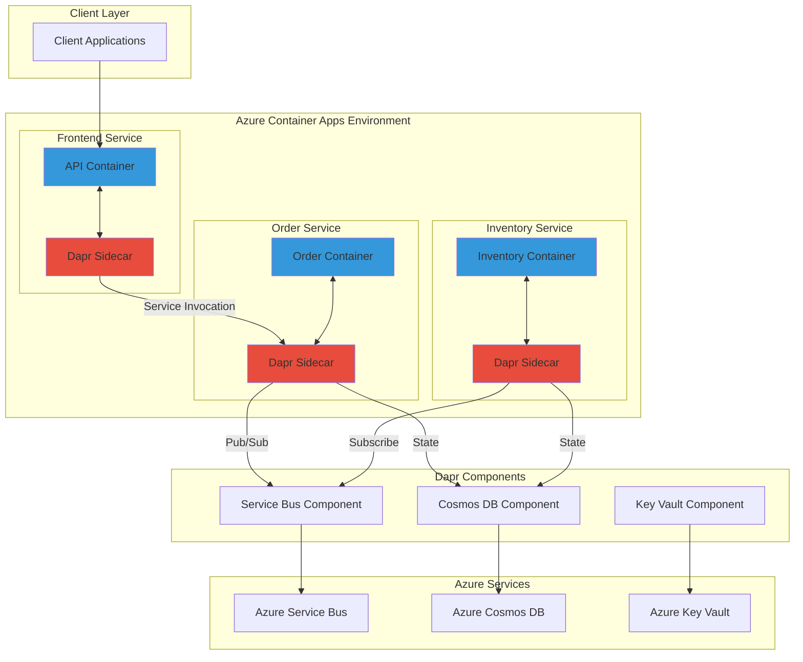

# Distributed Microservices Architecture with Container Apps and Dapr

## Problem

Modern distributed applications face complex challenges including service discovery, state management, publish-subscribe messaging, and distributed tracing. Developers spend significant time writing boilerplate code for these common patterns, resulting in tightly coupled architectures that are difficult to maintain and evolve. Additionally, switching between cloud providers or messaging systems requires extensive code changes, creating vendor lock-in and limiting architectural flexibility.

## Solution

Azure Container Apps with Dapr (Distributed Application Runtime) provides a serverless microservices platform that abstracts common distributed patterns into standardized APIs. This approach enables developers to build portable, resilient microservices using building blocks for service invocation, state management, pub/sub messaging, and observability without vendor-specific code, significantly reducing complexity and development time.

## Architecture Diagram



## Prerequisites

1. Azure subscription with Owner or Contributor access
2. Azure CLI (version 2.53.0 or later) installed and configured
3. Container Apps CLI extension installed (az extension add --name containerapp --upgrade)
4. Basic understanding of microservices architecture and containerization
5. Familiarity with REST APIs and event-driven patterns
6. Docker installed locally for container image building (optional)
7. Estimated cost: ~$50-100/month (depending on usage and scale)

> **Note**: This recipe uses consumption-based pricing for Container Apps. Costs scale with actual usage, making it ideal for development and production workloads.

## Preparation

```bash
# Set environment variables for Azure resources
export RESOURCE_GROUP="rg-dapr-microservices-${RANDOM_SUFFIX}"
export LOCATION="eastus"
export ENVIRONMENT_NAME="aca-env-dapr-${RANDOM_SUFFIX}"
export LOG_ANALYTICS_WORKSPACE="law-dapr-microservices-${RANDOM_SUFFIX}"
export SUBSCRIPTION_ID=$(az account show --query id --output tsv)

# Generate unique suffix for globally unique names
RANDOM_SUFFIX=$(openssl rand -hex 3)
export SERVICE_BUS_NAMESPACE="sb-dapr-${RANDOM_SUFFIX}"
export COSMOS_ACCOUNT="cosmos-dapr-${RANDOM_SUFFIX}"
export KEY_VAULT_NAME="kv-dapr-${RANDOM_SUFFIX}"

# Create resource group
az group create \
    --name ${RESOURCE_GROUP} \
    --location ${LOCATION} \
    --tags purpose=microservices-demo environment=development

echo "✅ Resource group created: ${RESOURCE_GROUP}"

# Create Log Analytics workspace for monitoring
az monitor log-analytics workspace create \
    --resource-group ${RESOURCE_GROUP} \
    --workspace-name ${LOG_ANALYTICS_WORKSPACE} \
    --location ${LOCATION}

LOG_ANALYTICS_ID=$(az monitor log-analytics workspace show \
    --resource-group ${RESOURCE_GROUP} \
    --workspace-name ${LOG_ANALYTICS_WORKSPACE} \
    --query id --output tsv)

LOG_ANALYTICS_KEY=$(az monitor log-analytics workspace get-shared-keys \
    --resource-group ${RESOURCE_GROUP} \
    --workspace-name ${LOG_ANALYTICS_WORKSPACE} \
    --query primarySharedKey --output tsv)

echo "✅ Log Analytics workspace created"
```

## Steps

1. **Create Container Apps Environment with Dapr**:

   Azure Container Apps provides a fully managed serverless platform for running containerized applications. The Container Apps environment serves as a secure boundary that groups multiple container apps together, enabling them to share the same virtual network and Log Analytics workspace. This managed environment automatically handles infrastructure concerns like networking, load balancing, and scaling, allowing developers to focus on application logic rather than operational complexity.

   ```bash
   # Create Container Apps environment
   az containerapp env create \
       --name ${ENVIRONMENT_NAME} \
       --resource-group ${RESOURCE_GROUP} \
       --location ${LOCATION} \
       --logs-workspace-id ${LOG_ANALYTICS_ID} \
       --logs-workspace-key ${LOG_ANALYTICS_KEY}
   
   echo "✅ Container Apps environment created: ${ENVIRONMENT_NAME}"
   ```

   The Container Apps environment is now ready to host Dapr-enabled microservices. This environment provides automatic Dapr sidecar injection and shared networking capabilities across all deployed applications.

2. **Configure Azure Service Bus for Pub/Sub Messaging**:

   Azure Service Bus provides enterprise-grade messaging capabilities with guaranteed delivery, message ordering, and dead-letter handling. When integrated with Dapr's pub/sub building block, it abstracts the messaging implementation details, allowing services to publish and subscribe to messages using a standard API. This decoupling enables you to switch messaging providers without changing application code.

   ```bash
   # Create Service Bus namespace
   az servicebus namespace create \
       --name ${SERVICE_BUS_NAMESPACE} \
       --resource-group ${RESOURCE_GROUP} \
       --location ${LOCATION} \
       --sku Standard
   
   # Create topic for order events
   az servicebus topic create \
       --name orders \
       --namespace-name ${SERVICE_BUS_NAMESPACE} \
       --resource-group ${RESOURCE_GROUP}
   
   # Create subscription for inventory service
   az servicebus topic subscription create \
       --name inventory-subscription \
       --topic-name orders \
       --namespace-name ${SERVICE_BUS_NAMESPACE} \
       --resource-group ${RESOURCE_GROUP}
   
   # Get Service Bus connection string
   SERVICE_BUS_CONNECTION=$(az servicebus namespace authorization-rule keys list \
       --name RootManageSharedAccessKey \
       --namespace-name ${SERVICE_BUS_NAMESPACE} \
       --resource-group ${RESOURCE_GROUP} \
       --query primaryConnectionString --output tsv)
   
   echo "✅ Service Bus namespace, topic, and subscription created"
   ```

   The Service Bus infrastructure is now configured to handle message routing between microservices. The topic-subscription pattern enables multiple services to receive copies of the same events for parallel processing.

3. **Create Azure Cosmos DB for State Management**:

   Azure Cosmos DB offers globally distributed, multi-model database services with guaranteed single-digit millisecond latency. As a Dapr state store, it provides ACID transactions and strong consistency for microservice state management. The serverless pricing model ensures cost-effectiveness for variable workloads while maintaining enterprise-grade reliability and performance.

   ```bash
   # Create Cosmos DB account with serverless capacity
   az cosmosdb create \
       --name ${COSMOS_ACCOUNT} \
       --resource-group ${RESOURCE_GROUP} \
       --locations regionName=${LOCATION} \
       --capabilities EnableServerless \
       --default-consistency-level Session
   
   # Create database and container
   az cosmosdb sql database create \
       --account-name ${COSMOS_ACCOUNT} \
       --resource-group ${RESOURCE_GROUP} \
       --name daprstate
   
   az cosmosdb sql container create \
       --account-name ${COSMOS_ACCOUNT} \
       --resource-group ${RESOURCE_GROUP} \
       --database-name daprstate \
       --name statestore \
       --partition-key-path /partitionKey
   
   # Get Cosmos DB connection details
   COSMOS_URL=$(az cosmosdb show \
       --name ${COSMOS_ACCOUNT} \
       --resource-group ${RESOURCE_GROUP} \
       --query documentEndpoint --output tsv)
   
   COSMOS_KEY=$(az cosmosdb keys list \
       --name ${COSMOS_ACCOUNT} \
       --resource-group ${RESOURCE_GROUP} \
       --query primaryMasterKey --output tsv)
   
   echo "✅ Cosmos DB account and state container created"
   ```

   The Cosmos DB state store is configured with serverless billing and session consistency, providing optimal performance for distributed microservices while maintaining cost efficiency.

4. **Create Azure Key Vault for Secrets Management**:

   Azure Key Vault provides centralized secrets management with hardware security module (HSM) protection, access policies, and audit logging. Integration with Dapr's secrets building block enables applications to retrieve secrets at runtime without hardcoding sensitive information. This approach enhances security by separating configuration from code and enabling secret rotation without application changes.

   ```bash
   # Create Key Vault
   az keyvault create \
       --name ${KEY_VAULT_NAME} \
       --resource-group ${RESOURCE_GROUP} \
       --location ${LOCATION} \
       --enable-rbac-authorization false
   
   # Store Service Bus and Cosmos DB secrets
   az keyvault secret set \
       --vault-name ${KEY_VAULT_NAME} \
       --name "servicebus-connectionstring" \
       --value "${SERVICE_BUS_CONNECTION}"
   
   az keyvault secret set \
       --vault-name ${KEY_VAULT_NAME} \
       --name "cosmosdb-url" \
       --value "${COSMOS_URL}"
   
   az keyvault secret set \
       --vault-name ${KEY_VAULT_NAME} \
       --name "cosmosdb-key" \
       --value "${COSMOS_KEY}"
   
   echo "✅ Key Vault created and secrets stored securely"
   ```

   All sensitive connection strings and credentials are now centrally managed in Key Vault, following Azure security best practices for secrets management.

5. **Configure Dapr Components**:

   Dapr components are pluggable building blocks that provide specific capabilities to your applications. By defining components at the Container Apps environment level, all services can share the same infrastructure resources while maintaining isolation through scoping. This declarative approach enables infrastructure-as-code practices and simplifies component management across multiple services.

   ```bash
   # Create Service Bus pub/sub component YAML
   cat > pubsub-servicebus.yaml <<EOF
   componentType: pubsub.azure.servicebus
   version: v1
   metadata:
     - name: connectionString
       secretKeyRef:
         name: servicebus-connectionstring
         key: servicebus-connectionstring
   secrets:
     - name: servicebus-connectionstring
       value: "${SERVICE_BUS_CONNECTION}"
   scopes:
     - order-service
     - inventory-service
   EOF
   
   # Deploy pub/sub component
   az containerapp env dapr-component set \
       --name ${ENVIRONMENT_NAME} \
       --resource-group ${RESOURCE_GROUP} \
       --dapr-component-name pubsub \
       --yaml pubsub-servicebus.yaml
   
   # Create Cosmos DB state store component YAML
   cat > statestore-cosmosdb.yaml <<EOF
   componentType: state.azure.cosmosdb
   version: v1
   metadata:
     - name: url
       value: "${COSMOS_URL}"
     - name: masterKey
       secretKeyRef:
         name: cosmosdb-key
         key: cosmosdb-key
     - name: database
       value: daprstate
     - name: collection
       value: statestore
   secrets:
     - name: cosmosdb-key
       value: "${COSMOS_KEY}"
   scopes:
     - order-service
     - inventory-service
   EOF
   
   # Deploy state store component
   az containerapp env dapr-component set \
       --name ${ENVIRONMENT_NAME} \
       --resource-group ${RESOURCE_GROUP} \
       --dapr-component-name statestore \
       --yaml statestore-cosmosdb.yaml
   
   echo "✅ Dapr components configured"
   ```

   The Dapr components are now configured and scoped to specific services, providing secure access to Azure Service Bus and Cosmos DB through standardized APIs.

6. **Deploy Order Service Microservice**:

   The order service demonstrates Dapr's service invocation and pub/sub capabilities. It receives orders through HTTP endpoints, stores order state in Cosmos DB, and publishes order events to Service Bus. The Dapr sidecar handles all distributed system concerns like retries, circuit breaking, and observability, allowing the service code to focus purely on business logic.

   ```bash
   # Deploy order service container app
   az containerapp create \
       --name order-service \
       --resource-group ${RESOURCE_GROUP} \
       --environment ${ENVIRONMENT_NAME} \
       --image mcr.microsoft.com/azuredocs/containerapps-helloworld:latest \
       --target-port 80 \
       --ingress external \
       --min-replicas 1 \
       --max-replicas 10 \
       --enable-dapr \
       --dapr-app-id order-service \
       --dapr-app-port 80 \
       --dapr-app-protocol http \
       --cpu 0.5 \
       --memory 1.0Gi \
       --env-vars \
           DAPR_HTTP_PORT=3500 \
           PUBSUB_NAME=pubsub \
           TOPIC_NAME=orders \
           STATE_STORE_NAME=statestore
   
   # Get order service URL
   ORDER_SERVICE_URL=$(az containerapp show \
       --name order-service \
       --resource-group ${RESOURCE_GROUP} \
       --query properties.configuration.ingress.fqdn \
       --output tsv)
   
   echo "✅ Order service deployed: https://${ORDER_SERVICE_URL}"
   ```

   The order service is now running with external ingress enabled, allowing client applications to submit orders via HTTPS endpoints.

7. **Deploy Inventory Service Microservice**:

   The inventory service showcases Dapr's event-driven architecture by subscribing to order events and maintaining inventory state. It automatically receives messages from Service Bus through Dapr's pub/sub subscription mechanism, processes them asynchronously, and updates inventory levels in Cosmos DB. This loosely coupled design enables independent scaling and evolution of services.

   ```bash
   # Deploy inventory service container app
   az containerapp create \
       --name inventory-service \
       --resource-group ${RESOURCE_GROUP} \
       --environment ${ENVIRONMENT_NAME} \
       --image mcr.microsoft.com/azuredocs/containerapps-helloworld:latest \
       --target-port 80 \
       --ingress internal \
       --min-replicas 1 \
       --max-replicas 10 \
       --enable-dapr \
       --dapr-app-id inventory-service \
       --dapr-app-port 80 \
       --dapr-app-protocol http \
       --cpu 0.5 \
       --memory 1.0Gi \
       --env-vars \
           DAPR_HTTP_PORT=3500 \
           PUBSUB_NAME=pubsub \
           TOPIC_NAME=orders \
           STATE_STORE_NAME=statestore
   
   echo "✅ Inventory service deployed"
   ```

   The inventory service operates with internal ingress, ensuring it only receives traffic from other services within the Container Apps environment while maintaining secure communication through Dapr sidecars.

8. **Configure Service-to-Service Communication**:

   Dapr's service invocation building block provides automatic service discovery, load balancing, and mutual TLS encryption between services. This eliminates the need for custom service registries or API gateways while ensuring secure communication. The sidecar pattern enables zero-trust networking by default, with each service authenticated and authorized for specific operations.

   ```bash
   # Create test script for service invocation
   cat > test-service-invocation.sh <<EOF
   #!/bin/bash
   # Example of service invocation using Dapr
   # This demonstrates how services communicate through Dapr sidecars
   curl -X POST http://localhost:3500/v1.0/invoke/inventory-service/method/check-inventory \
        -H "Content-Type: application/json" \
        -d '{"productId": "PROD-001", "quantity": 5}'
   EOF
   
   chmod +x test-service-invocation.sh
   
   echo "✅ Service invocation configuration complete"
   ```

   Services can now communicate directly using Dapr's service invocation API, which provides built-in resilience patterns like retries, timeouts, and circuit breakers without additional code complexity.

9. **Enable Distributed Tracing and Monitoring**:

   Observability is crucial for understanding distributed system behavior. Azure Container Apps automatically integrates with Azure Monitor and Application Insights, providing end-to-end tracing across Dapr-enabled services. This comprehensive monitoring solution captures metrics, logs, and distributed traces, enabling rapid troubleshooting and performance optimization.

   ```bash
   # Create Application Insights component
   az monitor app-insights component create \
       --app insights-dapr-demo \
       --location ${LOCATION} \
       --resource-group ${RESOURCE_GROUP} \
       --workspace ${LOG_ANALYTICS_ID}
   
   # Get connection string for Application Insights
   INSIGHTS_CONNECTION_STRING=$(az monitor app-insights component show \
       --app insights-dapr-demo \
       --resource-group ${RESOURCE_GROUP} \
       --query connectionString --output tsv)
   
   # Update container apps with Application Insights
   az containerapp update \
       --name order-service \
       --resource-group ${RESOURCE_GROUP} \
       --set-env-vars APPLICATIONINSIGHTS_CONNECTION_STRING="${INSIGHTS_CONNECTION_STRING}"
   
   az containerapp update \
       --name inventory-service \
       --resource-group ${RESOURCE_GROUP} \
       --set-env-vars APPLICATIONINSIGHTS_CONNECTION_STRING="${INSIGHTS_CONNECTION_STRING}"
   
   echo "✅ Distributed tracing enabled"
   ```

   Application Insights is now capturing telemetry data from both microservices, providing end-to-end visibility into request flows and performance metrics.

## Validation & Testing

1. Verify Container Apps environment and services:

   ```bash
   # Check environment status
   az containerapp env show \
       --name ${ENVIRONMENT_NAME} \
       --resource-group ${RESOURCE_GROUP} \
       --query "properties.provisioningState" --output tsv
   ```

   Expected output: `Succeeded`

2. Test Dapr component connectivity:

   ```bash
   # List configured Dapr components
   az containerapp env dapr-component list \
       --name ${ENVIRONMENT_NAME} \
       --resource-group ${RESOURCE_GROUP} \
       --output table
   ```

   Expected output: Table showing pubsub and statestore components

3. Verify service health and Dapr sidecar:

   ```bash
   # Check order service status
   az containerapp show \
       --name order-service \
       --resource-group ${RESOURCE_GROUP} \
       --query "properties.runningStatus" --output tsv
   
   # View Dapr sidecar logs
   az containerapp logs show \
       --name order-service \
       --resource-group ${RESOURCE_GROUP} \
       --container daprd \
       --follow false \
       --tail 20
   ```

4. Test end-to-end message flow:

   ```bash
   # Send test order to order service
   curl -X POST https://${ORDER_SERVICE_URL}/v1.0/invoke/order-service/method/orders \
        -H "Content-Type: application/json" \
        -d '{"orderId": "ORD-001", "customerId": "CUST-123", "items": [{"productId": "PROD-001", "quantity": 2}]}'
   
   # Check Service Bus subscription for messages
   az servicebus topic subscription show \
       --name inventory-subscription \
       --topic-name orders \
       --namespace-name ${SERVICE_BUS_NAMESPACE} \
       --resource-group ${RESOURCE_GROUP} \
       --query messageCount
   ```

## Cleanup

1. Remove container apps:

   ```bash
   # Delete container apps
   az containerapp delete \
       --name order-service \
       --resource-group ${RESOURCE_GROUP} \
       --yes
   
   az containerapp delete \
       --name inventory-service \
       --resource-group ${RESOURCE_GROUP} \
       --yes
   
   echo "✅ Container apps deleted"
   ```

2. Remove Container Apps environment:

   ```bash
   # Delete environment (also removes Dapr components)
   az containerapp env delete \
       --name ${ENVIRONMENT_NAME} \
       --resource-group ${RESOURCE_GROUP} \
       --yes
   
   echo "✅ Container Apps environment deleted"
   ```

3. Clean up Azure services:

   ```bash
   # Delete Service Bus namespace
   az servicebus namespace delete \
       --name ${SERVICE_BUS_NAMESPACE} \
       --resource-group ${RESOURCE_GROUP}
   
   # Delete Cosmos DB account
   az cosmosdb delete \
       --name ${COSMOS_ACCOUNT} \
       --resource-group ${RESOURCE_GROUP} \
       --yes
   
   # Delete Key Vault (soft delete)
   az keyvault delete \
       --name ${KEY_VAULT_NAME} \
       --resource-group ${RESOURCE_GROUP}
   
   echo "✅ Azure services cleanup initiated"
   ```

4. Remove resource group:

   ```bash
   # Delete entire resource group
   az group delete \
       --name ${RESOURCE_GROUP} \
       --yes \
       --no-wait
   
   echo "✅ Resource group deletion initiated"
   echo "Note: Complete deletion may take several minutes"
   ```

## Discussion

Azure Container Apps with Dapr represents a paradigm shift in building distributed applications by abstracting complex infrastructure patterns into simple, standardized APIs. This combination addresses the fundamental challenges of microservices development: service discovery, state management, messaging, and observability. The [Dapr documentation](https://docs.dapr.io/) provides comprehensive guidance on building blocks and best practices, while the [Azure Container Apps documentation](https://learn.microsoft.com/en-us/azure/container-apps/) covers platform-specific features and optimization strategies.

The sidecar pattern employed by Dapr provides significant architectural benefits. Each microservice gets a dedicated Dapr sidecar that handles all distributed systems concerns, allowing developers to write business logic in any language without worrying about infrastructure complexities. This approach aligns with the [Azure Well-Architected Framework](https://learn.microsoft.com/en-us/azure/architecture/framework/) principles of operational excellence and reliability by standardizing cross-cutting concerns across all services.

From a cost perspective, the serverless nature of Azure Container Apps ensures you only pay for actual resource consumption. The platform automatically scales containers based on HTTP traffic, CPU, or memory usage, and can scale to zero during idle periods. Combined with Dapr's efficient resource utilization, this creates a cost-effective solution for both development and production workloads. For detailed pricing guidance, consult the [Azure Container Apps pricing documentation](https://azure.microsoft.com/en-us/pricing/details/container-apps/).

The vendor-agnostic nature of Dapr components provides exceptional flexibility. While this recipe uses Azure Service Bus and Cosmos DB, you can easily switch to alternative implementations like Redis, PostgreSQL, or Kafka by simply updating the component configuration without changing application code. This portability is crucial for multi-cloud strategies and avoiding vendor lock-in. The [Dapr components reference](https://docs.dapr.io/reference/components-reference/) lists all supported component implementations across different cloud providers.

> **Tip**: Use Azure Monitor workbooks to create custom dashboards that visualize Dapr metrics alongside application logs. This provides comprehensive insights into service communication patterns, latency distributions, and error rates across your distributed system.

## Challenge

Extend this solution by implementing these enhancements:

1. Add a notification service that subscribes to order events and sends emails using Dapr's binding components with Azure Logic Apps or SendGrid
2. Implement the saga pattern for distributed transactions using Dapr's workflow building block to handle complex order fulfillment scenarios
3. Create a real-time dashboard using Azure SignalR Service integrated with Dapr's pub/sub to display live order statistics
4. Add Redis as a distributed cache using Dapr's state store component for improved performance on frequently accessed data
5. Implement multi-region deployment with Azure Traffic Manager and Cosmos DB global distribution for high availability

## Infrastructure Code

*Infrastructure code will be generated after recipe approval.*