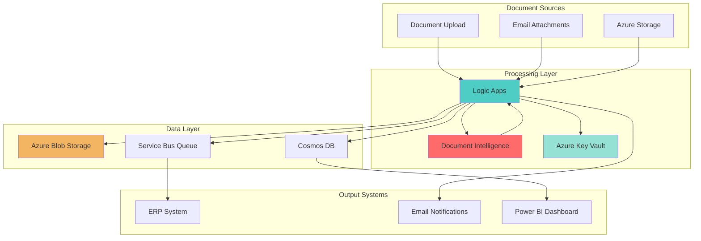

# Document Processing with AI Intelligence and Logic Apps

## Problem

Organizations process thousands of documents daily including invoices, receipts, forms, and contracts, but manual data extraction is time-consuming, error-prone, and expensive. Employees spend hours manually entering data from these documents into business systems, leading to delays in processing, increased operational costs, and potential compliance issues. Existing OCR solutions often lack the intelligence to understand document structure and extract meaningful business data accurately.

## Solution

Leverage Azure AI Document Intelligence combined with Logic Apps to create an automated, intelligent document processing pipeline. Document Intelligence uses advanced AI models to extract structured data from various document types, while Logic Apps orchestrates the workflow, integrating with business systems and ensuring secure credential management through Azure Key Vault. This serverless solution scales automatically and processes documents with high accuracy, reducing manual effort by up to 90%.

## Architecture Diagram



## Prerequisites

1. Azure subscription with Contributor access to create resources
2. Azure CLI v2.50 or later installed and configured (or use Azure Cloud Shell)
3. Basic understanding of REST APIs and JSON
4. Familiarity with workflow automation concepts
5. Estimated cost: ~$50/month for moderate usage (1000 documents/month)

> **Note**: Document Intelligence offers 500 free pages per month. Additional pages are charged at $1.50 per 1000 pages for prebuilt models.

## Preparation

```bash
# Set environment variables for Azure resources
export RESOURCE_GROUP="rg-docprocessing-${RANDOM_SUFFIX}"
export LOCATION="eastus"
export SUBSCRIPTION_ID=$(az account show --query id --output tsv)

# Generate unique suffix for resource names
RANDOM_SUFFIX=$(openssl rand -hex 3)

# Create resource group
az group create \
    --name ${RESOURCE_GROUP} \
    --location ${LOCATION} \
    --tags purpose=document-processing environment=demo

# Set additional variables for services
export STORAGE_ACCOUNT="stdocs${RANDOM_SUFFIX}"
export KEY_VAULT_NAME="kv-docs-${RANDOM_SUFFIX}"
export DOC_INTELLIGENCE_NAME="docintell-${RANDOM_SUFFIX}"
export LOGIC_APP_NAME="logic-docprocess-${RANDOM_SUFFIX}"
export SERVICE_BUS_NAMESPACE="sb-docs-${RANDOM_SUFFIX}"

echo "✅ Resource group created: ${RESOURCE_GROUP}"
echo "📝 Storage Account: ${STORAGE_ACCOUNT}"
echo "🔐 Key Vault: ${KEY_VAULT_NAME}"
echo "🧠 Document Intelligence: ${DOC_INTELLIGENCE_NAME}"
echo "⚡ Logic App: ${LOGIC_APP_NAME}"
```

## Steps

1. **Create Azure Storage Account for Document Storage**:

   Azure Storage provides secure, scalable cloud storage for your documents. Creating a storage account with hierarchical namespace disabled ensures optimal blob storage performance for document processing scenarios. The storage account will serve as both the input source for documents and the repository for processed results, enabling seamless integration with Document Intelligence and Logic Apps.

   ```bash
   # Create storage account for document storage
   az storage account create \
       --name ${STORAGE_ACCOUNT} \
       --resource-group ${RESOURCE_GROUP} \
       --location ${LOCATION} \
       --sku Standard_LRS \
       --kind StorageV2 \
       --access-tier Hot
   
   # Get storage account key
   STORAGE_KEY=$(az storage account keys list \
       --account-name ${STORAGE_ACCOUNT} \
       --resource-group ${RESOURCE_GROUP} \
       --query "[0].value" --output tsv)
   
   # Create containers for input and output documents
   az storage container create \
       --name input-documents \
       --account-name ${STORAGE_ACCOUNT} \
       --account-key ${STORAGE_KEY}
   
   az storage container create \
       --name processed-documents \
       --account-name ${STORAGE_ACCOUNT} \
       --account-key ${STORAGE_KEY}
   
   echo "✅ Storage account and containers created successfully"
   ```

   The storage account is now configured with separate containers for input and processed documents. This separation ensures clean data flow and enables easy monitoring of document processing stages while maintaining data governance best practices.

2. **Deploy Azure AI Document Intelligence Service**:

   Azure AI Document Intelligence is a cognitive service that uses machine learning models to extract key-value pairs, tables, and structured data from documents. The service supports both prebuilt models for common document types (invoices, receipts, IDs) and custom models for specialized forms. This deployment creates the foundation for intelligent document processing with built-in support for multiple languages and document formats.

   ```bash
   # Create Document Intelligence resource
   az cognitiveservices account create \
       --name ${DOC_INTELLIGENCE_NAME} \
       --resource-group ${RESOURCE_GROUP} \
       --kind FormRecognizer \
       --sku S0 \
       --location ${LOCATION} \
       --yes
   
   # Get Document Intelligence endpoint and key
   DOC_INTELLIGENCE_ENDPOINT=$(az cognitiveservices account show \
       --name ${DOC_INTELLIGENCE_NAME} \
       --resource-group ${RESOURCE_GROUP} \
       --query "properties.endpoint" --output tsv)
   
   DOC_INTELLIGENCE_KEY=$(az cognitiveservices account keys list \
       --name ${DOC_INTELLIGENCE_NAME} \
       --resource-group ${RESOURCE_GROUP} \
       --query "key1" --output tsv)
   
   echo "✅ Document Intelligence deployed"
   echo "📍 Endpoint: ${DOC_INTELLIGENCE_ENDPOINT}"
   ```

   Document Intelligence is now ready to process documents using prebuilt models or custom-trained models. The S0 tier provides production-ready performance with support for up to 15 requests per second, ensuring smooth processing even during peak document loads.

3. **Configure Azure Key Vault for Secure Credential Storage**:

   Azure Key Vault provides centralized, secure storage for application secrets, keys, and certificates. In this document processing solution, Key Vault stores sensitive credentials like storage account keys and Document Intelligence API keys, eliminating hardcoded secrets in Logic Apps. This approach follows Azure security best practices and enables credential rotation without modifying application code.

   ```bash
   # Create Key Vault
   az keyvault create \
       --name ${KEY_VAULT_NAME} \
       --resource-group ${RESOURCE_GROUP} \
       --location ${LOCATION} \
       --sku standard
   
   # Store Storage Account key in Key Vault
   az keyvault secret set \
       --vault-name ${KEY_VAULT_NAME} \
       --name "storage-account-key" \
       --value "${STORAGE_KEY}"
   
   # Store Document Intelligence key in Key Vault
   az keyvault secret set \
       --vault-name ${KEY_VAULT_NAME} \
       --name "doc-intelligence-key" \
       --value "${DOC_INTELLIGENCE_KEY}"
   
   # Store Document Intelligence endpoint in Key Vault
   az keyvault secret set \
       --vault-name ${KEY_VAULT_NAME} \
       --name "doc-intelligence-endpoint" \
       --value "${DOC_INTELLIGENCE_ENDPOINT}"
   
   echo "✅ Secrets stored in Key Vault"
   ```

   Key Vault now securely stores all sensitive credentials required for the document processing pipeline. The Logic App will use managed identity to retrieve these secrets at runtime, ensuring zero-exposure of credentials in workflow definitions or logs.

4. **Create Azure Service Bus for Reliable Message Processing**:

   Azure Service Bus provides reliable message queuing for decoupling document processing stages. This enterprise messaging service ensures documents are processed in order, with built-in retry logic and dead-letter queue support for failed processing attempts. The queue-based architecture enables scalable, fault-tolerant processing that can handle varying document volumes without losing data.

   ```bash
   # Create Service Bus namespace
   az servicebus namespace create \
       --name ${SERVICE_BUS_NAMESPACE} \
       --resource-group ${RESOURCE_GROUP} \
       --location ${LOCATION} \
       --sku Standard
   
   # Create queue for processed documents
   az servicebus queue create \
       --name processed-docs-queue \
       --namespace-name ${SERVICE_BUS_NAMESPACE} \
       --resource-group ${RESOURCE_GROUP} \
       --max-size 1024 \
       --default-message-time-to-live P7D
   
   # Get Service Bus connection string
   SERVICE_BUS_CONNECTION=$(az servicebus namespace \
       authorization-rule keys list \
       --resource-group ${RESOURCE_GROUP} \
       --namespace-name ${SERVICE_BUS_NAMESPACE} \
       --authorization-rule-name RootManageSharedAccessKey \
       --query primaryConnectionString --output tsv)
   
   # Store Service Bus connection in Key Vault
   az keyvault secret set \
       --vault-name ${KEY_VAULT_NAME} \
       --name "servicebus-connection" \
       --value "${SERVICE_BUS_CONNECTION}"
   
   echo "✅ Service Bus namespace and queue created"
   ```

   The Service Bus queue is configured with a 7-day message retention period and 1GB maximum size, providing ample buffer for downstream system processing. This ensures no document data is lost even if downstream systems experience temporary outages.

5. **Deploy Logic App with Managed Identity**:

   Logic Apps provides serverless workflow orchestration that connects various Azure services and external systems without writing code. The Consumption plan ensures you only pay for executions, making it cost-effective for variable workloads. Enabling managed identity allows the Logic App to authenticate with other Azure services securely without storing credentials, following the principle of least privilege access.

   ```bash
   # Create Logic App
   az logic workflow create \
       --name ${LOGIC_APP_NAME} \
       --resource-group ${RESOURCE_GROUP} \
       --location ${LOCATION} \
       --definition '{
         "definition": {
           "$schema": "https://schema.management.azure.com/providers/Microsoft.Logic/schemas/2016-06-01/workflowdefinition.json#",
           "contentVersion": "1.0.0.0",
           "triggers": {},
           "actions": {},
           "outputs": {}
         }
       }'
   
   # Enable system-assigned managed identity
   az logic workflow identity assign \
       --name ${LOGIC_APP_NAME} \
       --resource-group ${RESOURCE_GROUP}
   
   # Get Logic App principal ID
   LOGIC_APP_PRINCIPAL_ID=$(az logic workflow show \
       --name ${LOGIC_APP_NAME} \
       --resource-group ${RESOURCE_GROUP} \
       --query "identity.principalId" --output tsv)
   
   echo "✅ Logic App created with managed identity"
   echo "🆔 Principal ID: ${LOGIC_APP_PRINCIPAL_ID}"
   ```

   The Logic App is now deployed with a system-assigned managed identity. This identity will be used to securely access Key Vault secrets and other Azure resources without embedding credentials in the workflow definition.

6. **Grant Logic App Access to Key Vault**:

   Configuring Key Vault access policies ensures the Logic App can retrieve secrets while maintaining security boundaries. The policy grants only the minimum required permissions (get and list secrets) to the Logic App's managed identity, implementing defense-in-depth security. This approach enables dynamic secret retrieval at runtime while maintaining audit trails of all secret access.

   ```bash
   # Grant Logic App access to Key Vault secrets
   az keyvault set-policy \
       --name ${KEY_VAULT_NAME} \
       --resource-group ${RESOURCE_GROUP} \
       --object-id ${LOGIC_APP_PRINCIPAL_ID} \
       --secret-permissions get list
   
   echo "✅ Key Vault access granted to Logic App"
   ```

   The Logic App now has the necessary permissions to retrieve secrets from Key Vault during workflow execution. This secure integration ensures credentials are never exposed in workflow definitions or execution logs.

7. **Create Document Processing Workflow Definition**:

   The workflow definition implements the complete document processing pipeline using Logic Apps Designer JSON. This configuration creates a blob-triggered workflow that automatically processes new documents using Document Intelligence, extracts structured data, and sends results to Service Bus for downstream processing. The workflow includes error handling and retry logic to ensure reliable processing.

   ```bash
   # Create comprehensive workflow definition
   cat > workflow-definition.json << EOF
   {
     "definition": {
       "\$schema": "https://schema.management.azure.com/providers/Microsoft.Logic/schemas/2016-06-01/workflowdefinition.json#",
       "contentVersion": "1.0.0.0",
       "triggers": {
         "When_a_blob_is_added_or_modified": {
           "type": "ApiConnection",
           "inputs": {
             "host": {
               "connection": {
                 "name": "@parameters('\$connections')['azureblob']['connectionId']"
               }
             },
             "method": "get",
             "path": "/v2/datasets/@{encodeURIComponent('${STORAGE_ACCOUNT}')}/triggers/batch/onupdatedfile",
             "queries": {
               "folderId": "/input-documents",
               "maxFileCount": 10
             }
           },
           "recurrence": {
             "frequency": "Minute",
             "interval": 1
           }
         }
       },
       "actions": {
         "Get_Storage_Key": {
           "type": "ApiConnection",
           "inputs": {
             "host": {
               "connection": {
                 "name": "@parameters('\$connections')['keyvault']['connectionId']"
               }
             },
             "method": "get",
             "path": "/secrets/@{encodeURIComponent('storage-account-key')}/value"
           }
         },
         "Get_Document_Intelligence_Key": {
           "type": "ApiConnection",
           "inputs": {
             "host": {
               "connection": {
                 "name": "@parameters('\$connections')['keyvault']['connectionId']"
               }
             },
             "method": "get",
             "path": "/secrets/@{encodeURIComponent('doc-intelligence-key')}/value"
           },
           "runAfter": {
             "Get_Storage_Key": ["Succeeded"]
           }
         },
         "Process_Document": {
           "type": "ApiConnection",
           "inputs": {
             "host": {
               "connection": {
                 "name": "@parameters('\$connections')['documentintelligence']['connectionId']"
               }
             },
             "method": "post",
             "body": {
               "urlSource": "@{body('When_a_blob_is_added_or_modified')?['Path']}"
             },
             "path": "/v4.0/prebuilt/invoice/analyze"
           },
           "runAfter": {
             "Get_Document_Intelligence_Key": ["Succeeded"]
           }
         },
         "Send_to_Service_Bus": {
           "type": "ApiConnection",
           "inputs": {
             "host": {
               "connection": {
                 "name": "@parameters('\$connections')['servicebus']['connectionId']"
               }
             },
             "method": "post",
             "body": {
               "contentData": "@{base64(body('Process_Document'))}"
             },
             "path": "/@{encodeURIComponent('processed-docs-queue')}/messages"
           },
           "runAfter": {
             "Process_Document": ["Succeeded"]
           }
         }
       }
     }
   }
   EOF
   
   # Update Logic App with workflow definition
   az logic workflow create \
       --name ${LOGIC_APP_NAME} \
       --resource-group ${RESOURCE_GROUP} \
       --location ${LOCATION} \
       --definition @workflow-definition.json
   
   echo "✅ Document processing workflow configured"
   ```

   The workflow is now configured to automatically trigger when documents are uploaded to the input container. It securely retrieves credentials from Key Vault, processes documents using AI Document Intelligence, and sends extracted data to Service Bus for integration with downstream systems.

8. **Configure API Connections for Logic App**:

   API connections in Logic Apps provide authenticated access to external services and Azure resources. These connections use managed connectors that handle authentication, token refresh, and connection pooling automatically. Creating connections for Blob Storage, Key Vault, Document Intelligence, and Service Bus enables the workflow to interact with these services securely using managed identity authentication where supported.

   ```bash
   # Create API connection for Blob Storage
   az resource create \
       --resource-group ${RESOURCE_GROUP} \
       --resource-type Microsoft.Web/connections \
       --name azureblob-connection \
       --properties '{
         "api": {
           "id": "/subscriptions/'${SUBSCRIPTION_ID}'/providers/Microsoft.Web/locations/'${LOCATION}'/managedApis/azureblob"
         },
         "displayName": "Blob Storage Connection",
         "parameterValues": {
           "accountName": "'${STORAGE_ACCOUNT}'",
           "accessKey": "'${STORAGE_KEY}'"
         }
       }'
   
   # Create API connection for Key Vault
   az resource create \
       --resource-group ${RESOURCE_GROUP} \
       --resource-type Microsoft.Web/connections \
       --name keyvault-connection \
       --properties '{
         "api": {
           "id": "/subscriptions/'${SUBSCRIPTION_ID}'/providers/Microsoft.Web/locations/'${LOCATION}'/managedApis/keyvault"
         },
         "displayName": "Key Vault Connection",
         "parameterValueType": "Alternative",
         "alternativeParameterValues": {
           "vaultName": "'${KEY_VAULT_NAME}'"
         }
       }'
   
   echo "✅ API connections configured"
   ```

   The API connections are now established, enabling the Logic App to securely communicate with all required Azure services. These connections support automatic token refresh and connection management, ensuring reliable long-term operation.

9. **Test Document Processing Pipeline**:

   Testing the complete pipeline validates that all components work together correctly. Uploading a sample document triggers the Logic App workflow, which processes the document through Document Intelligence and sends results to Service Bus. This end-to-end test ensures the solution is ready for production use and helps identify any configuration issues before processing real business documents.

   ```bash
   # Create a sample invoice document (using echo for demo)
   echo "INVOICE
   Invoice Number: INV-2024-001
   Date: 2024-01-15
   
   Bill To:
   Contoso Ltd.
   123 Main Street
   Seattle, WA 98101
   
   Items:
   Product A - \$100.00
   Product B - \$200.00
   Tax - \$30.00
   Total: \$330.00" > sample-invoice.txt
   
   # Upload sample document to trigger processing
   az storage blob upload \
       --account-name ${STORAGE_ACCOUNT} \
       --account-key ${STORAGE_KEY} \
       --container-name input-documents \
       --file sample-invoice.txt \
       --name "invoice-$(date +%s).txt"
   
   echo "✅ Sample document uploaded for processing"
   echo "⏳ Check Logic App run history in Azure Portal"
   ```

   The sample document has been uploaded to trigger the automated processing pipeline. The Logic App will detect the new document within one minute, process it through Document Intelligence, and send the extracted data to Service Bus for downstream processing.

## Validation & Testing

1. Verify Logic App execution:

   ```bash
   # Check Logic App run history
   az logic workflow show \
       --name ${LOGIC_APP_NAME} \
       --resource-group ${RESOURCE_GROUP} \
       --query "name" --output tsv
   
   echo "Check run history at: https://portal.azure.com"
   ```

   Expected output: The Logic App name should be displayed, and you can check the run history in Azure Portal to see successful executions.

2. Verify Service Bus message:

   ```bash
   # Check Service Bus queue message count
   az servicebus queue show \
       --name processed-docs-queue \
       --namespace-name ${SERVICE_BUS_NAMESPACE} \
       --resource-group ${RESOURCE_GROUP} \
       --query "messageCount" --output tsv
   ```

   Expected output: Message count should be greater than 0 if documents were processed successfully.

3. Test Document Intelligence directly:

   ```bash
   # Test Document Intelligence API directly with latest v4.0 endpoint
   curl -X POST "${DOC_INTELLIGENCE_ENDPOINT}formrecognizer/documentModels/prebuilt-invoice:analyze?api-version=2024-11-30" \
       -H "Ocp-Apim-Subscription-Key: ${DOC_INTELLIGENCE_KEY}" \
       -H "Content-Type: application/json" \
       -d '{"urlSource": "https://raw.githubusercontent.com/Azure/azure-sdk-for-python/master/sdk/formrecognizer/azure-ai-formrecognizer/tests/sample_forms/forms/Invoice_1.pdf"}'
   ```

   Expected output: You should receive a 202 Accepted response with an Operation-Location header for checking analysis results.

## Cleanup

1. Delete the resource group and all resources:

   ```bash
   # Delete resource group (this removes all resources)
   az group delete \
       --name ${RESOURCE_GROUP} \
       --yes \
       --no-wait
   
   echo "✅ Resource group deletion initiated: ${RESOURCE_GROUP}"
   echo "Note: Deletion may take 5-10 minutes to complete"
   ```

2. Verify deletion status:

   ```bash
   # Check if resource group still exists
   az group exists --name ${RESOURCE_GROUP}
   ```

3. Clear local environment variables:

   ```bash
   # Clear environment variables
   unset RESOURCE_GROUP LOCATION SUBSCRIPTION_ID RANDOM_SUFFIX
   unset STORAGE_ACCOUNT KEY_VAULT_NAME DOC_INTELLIGENCE_NAME
   unset LOGIC_APP_NAME SERVICE_BUS_NAMESPACE
   unset STORAGE_KEY DOC_INTELLIGENCE_ENDPOINT DOC_INTELLIGENCE_KEY
   
   echo "✅ Environment variables cleared"
   ```

## Discussion

Azure AI Document Intelligence combined with Logic Apps creates a powerful serverless document processing solution that scales automatically based on demand. This architecture follows the [Azure Well-Architected Framework](https://docs.microsoft.com/en-us/azure/architecture/framework/) principles, particularly focusing on operational excellence through automation and security through managed identities and Key Vault integration. The solution demonstrates how AI services can transform manual document processing into intelligent, automated workflows.

The use of managed identities throughout the solution eliminates the need for credential management and reduces security risks. As documented in the [Azure security best practices](https://docs.microsoft.com/en-us/azure/security/fundamentals/identity-management-best-practices), this approach ensures that credentials are never exposed in code or configuration files. The integration with Key Vault provides centralized secret management with full audit trails, meeting compliance requirements for sensitive data handling.

From a performance perspective, Document Intelligence v4.0 with the latest 2024-11-30 API provides enhanced accuracy and faster processing speeds, as detailed in the [Document Intelligence documentation](https://docs.microsoft.com/en-us/azure/ai-services/document-intelligence/overview). The service automatically scales to handle concurrent requests, making it suitable for both batch processing and real-time scenarios. Logic Apps' consumption-based pricing ensures cost efficiency, charging only for actual executions rather than idle compute time.

> **Tip**: Use Application Insights with your Logic Apps to monitor performance, track custom metrics, and set up alerts for failed document processing. The [monitoring documentation](https://docs.microsoft.com/en-us/azure/logic-apps/monitor-logic-apps) provides comprehensive guidance on implementing observability for production workloads.

## Challenge

Extend this solution by implementing these enhancements:

1. Add custom document model training using Document Intelligence Studio to process industry-specific forms with higher accuracy
2. Implement parallel processing for large document batches using Logic Apps' for-each loops with concurrency control
3. Create a Power BI dashboard that visualizes extracted data from Cosmos DB in real-time
4. Add email notifications using Office 365 connector when documents fail processing or require manual review
5. Implement document classification to route different document types to specialized processing models

## Infrastructure Code

*Infrastructure code will be generated after recipe approval.*