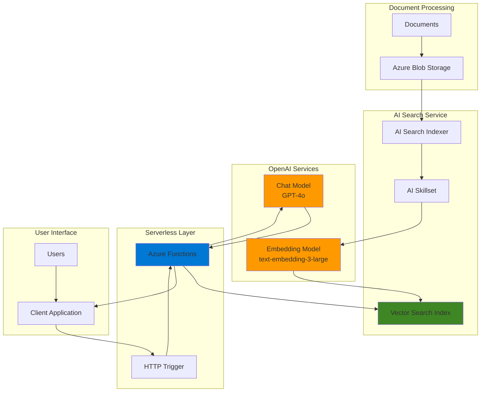

# Document Q&A with AI Search and OpenAI

## Problem

Organizations accumulate vast amounts of unstructured documents across various repositories, making it challenging for employees and customers to quickly find specific information. Traditional keyword-based search systems often fail to understand context and intent, resulting in poor search relevance and user frustration. Without an intelligent document question-answering system, businesses struggle with knowledge management, customer support inefficiencies, and missed opportunities to leverage their institutional knowledge effectively.

## Solution

Build an intelligent document question-answering system using Azure AI Search for semantic vector indexing, Azure OpenAI Service for natural language understanding and response generation, and Azure Functions for serverless orchestration. This solution automatically processes documents, creates searchable embeddings, and provides contextual answers with source citations using the Retrieval-Augmented Generation (RAG) pattern.

## Architecture Diagram



## Prerequisites

1. Azure account with Cognitive Services OpenAI Contributor permissions for model deployment
2. Azure CLI installed and configured (version 2.66.0 or later)
3. Basic knowledge of REST APIs and JSON document structures
4. Understanding of vector embeddings and semantic search concepts
5. Sample documents for testing (PDF, Word, or text files)
6. Estimated cost: $20-40 for testing resources (varies by usage and region)

> **Note**: Azure OpenAI Service availability varies by region. Choose a region that supports both embedding and chat completion models for optimal performance. Consider using eastus or eastus2 for the broadest model availability.

## Preparation

```bash
# Set environment variables for Azure resources
export RESOURCE_GROUP="rg-docqa-${RANDOM_SUFFIX}"
export LOCATION="eastus"
export SUBSCRIPTION_ID=$(az account show --query id --output tsv)

# Generate unique suffix for resource names
RANDOM_SUFFIX=$(openssl rand -hex 3)

# Create resource group
az group create \
    --name ${RESOURCE_GROUP} \
    --location ${LOCATION} \
    --tags purpose=recipe environment=demo

echo "✅ Resource group created: ${RESOURCE_GROUP}"

# Set additional resource names
export STORAGE_ACCOUNT="stdocqa${RANDOM_SUFFIX}"
export SEARCH_SERVICE="srch-docqa-${RANDOM_SUFFIX}"
export OPENAI_SERVICE="oai-docqa-${RANDOM_SUFFIX}"
export FUNCTION_APP="func-docqa-${RANDOM_SUFFIX}"
export CONTAINER_NAME="documents"
```

## Steps

1. **Create Azure Storage Account for Document Storage**:

   Azure Blob Storage provides scalable, secure storage for documents that will be processed by the AI Search indexer. The storage account serves as the primary data source, supporting various document formats including PDF, Word, and plain text files with built-in security and access control. Zone-redundant storage (ZRS) ensures high availability and durability for your document repository.

   ```bash
   # Create storage account with zone redundancy for high availability
   az storage account create \
       --name ${STORAGE_ACCOUNT} \
       --resource-group ${RESOURCE_GROUP} \
       --location ${LOCATION} \
       --sku Standard_ZRS \
       --kind StorageV2 \
       --access-tier Hot \
       --allow-blob-public-access false \
       --https-only true \
       --min-tls-version TLS1_2
   
   # Get storage account key for later use
   STORAGE_KEY=$(az storage account keys list \
       --account-name ${STORAGE_ACCOUNT} \
       --resource-group ${RESOURCE_GROUP} \
       --query '[0].value' --output tsv)
   
   echo "✅ Storage account created: ${STORAGE_ACCOUNT}"
   ```

2. **Create Document Container and Upload Sample Documents**:

   The container organizes documents for systematic processing by the AI Search indexer. This approach enables automatic document discovery and indexing, supporting various file formats while maintaining proper access controls and metadata tracking. Sample documents demonstrate the system's capability to process and answer questions about your content.

   ```bash
   # Create container for documents
   az storage container create \
       --name ${CONTAINER_NAME} \
       --account-name ${STORAGE_ACCOUNT} \
       --account-key ${STORAGE_KEY} \
       --public-access off
   
   # Create sample documents with comprehensive content for testing
   cat > sample-doc1.txt << 'EOF'
   Azure AI Search is a cloud search service that provides infrastructure, APIs, and 
   tools for building rich search experiences. It supports full-text search, vector 
   search, and hybrid search capabilities. Vector search enables semantic similarity 
   matching through AI-powered embeddings, allowing for context-aware information 
   retrieval that goes beyond keyword matching. The service includes built-in 
   AI skills for content extraction, language detection, and key phrase extraction.
   EOF
   
   cat > sample-doc2.txt << 'EOF'
   Azure OpenAI Service provides REST API access to OpenAI's language models including 
   GPT-4o, GPT-4o-mini, and embedding models like text-embedding-3-large. These models 
   enable advanced natural language processing tasks such as text generation, 
   summarization, and semantic search. The service supports responsible AI practices 
   with content filtering and usage monitoring. GPT-4o offers enhanced multimodal 
   capabilities, processing both text and images with superior performance in 
   non-English languages.
   EOF
   
   # Upload sample documents to blob storage
   az storage blob upload \
       --file sample-doc1.txt \
       --name "azure-ai-search-overview.txt" \
       --container-name ${CONTAINER_NAME} \
       --account-name ${STORAGE_ACCOUNT} \
       --account-key ${STORAGE_KEY}
   
   az storage blob upload \
       --file sample-doc2.txt \
       --name "azure-openai-overview.txt" \
       --container-name ${CONTAINER_NAME} \
       --account-name ${STORAGE_ACCOUNT} \
       --account-key ${STORAGE_KEY}
   
   echo "✅ Documents uploaded to container: ${CONTAINER_NAME}"
   ```

3. **Deploy Azure OpenAI Service and Models**:

   Azure OpenAI Service provides access to state-of-the-art language models for embedding generation and text completion. The text-embedding-3-large model creates high-quality vector representations of documents with 3,072 dimensions, while GPT-4o generates natural language responses based on retrieved context. This service follows responsible AI principles with built-in content filtering and monitoring capabilities.

   ```bash
   # Create Azure OpenAI Service
   az cognitiveservices account create \
       --name ${OPENAI_SERVICE} \
       --resource-group ${RESOURCE_GROUP} \
       --location ${LOCATION} \
       --kind OpenAI \
       --sku S0 \
       --yes
   
   # Get OpenAI endpoint and key
   OPENAI_ENDPOINT=$(az cognitiveservices account show \
       --name ${OPENAI_SERVICE} \
       --resource-group ${RESOURCE_GROUP} \
       --query "properties.endpoint" --output tsv)
   
   OPENAI_KEY=$(az cognitiveservices account keys list \
       --name ${OPENAI_SERVICE} \
       --resource-group ${RESOURCE_GROUP} \
       --query "key1" --output tsv)
   
   echo "✅ Azure OpenAI Service created: ${OPENAI_SERVICE}"
   ```

4. **Deploy Embedding and Chat Completion Models**:

   Model deployment makes specific AI capabilities available through dedicated endpoints. The text-embedding-3-large model processes documents and queries into 3,072-dimensional vector representations for semantic search, while the GPT-4o model generates contextual responses using retrieved documents as grounding data. These deployments provide the foundation for the RAG architecture.

   ```bash
   # Deploy text-embedding-3-large model for embeddings
   az cognitiveservices account deployment create \
       --name ${OPENAI_SERVICE} \
       --resource-group ${RESOURCE_GROUP} \
       --deployment-name "text-embedding-3-large" \
       --model-name "text-embedding-3-large" \
       --model-version "1" \
       --model-format OpenAI \
       --sku-capacity 30 \
       --sku-name Standard
   
   # Deploy GPT-4o model for chat completions (using latest stable version)
   az cognitiveservices account deployment create \
       --name ${OPENAI_SERVICE} \
       --resource-group ${RESOURCE_GROUP} \
       --deployment-name "gpt-4o" \
       --model-name "gpt-4o" \
       --model-version "2024-11-20" \
       --model-format OpenAI \
       --sku-capacity 10 \
       --sku-name Standard
   
   echo "✅ OpenAI models deployed successfully"
   ```

5. **Create Azure AI Search Service**:

   Azure AI Search provides the search infrastructure for indexing and querying vectorized documents. The service supports hybrid search combining traditional text search with semantic vector search, enabling accurate document retrieval based on semantic similarity rather than just keyword matching. The Basic tier includes semantic search capabilities and supports the vector indexing required for this solution.

   ```bash
   # Create Azure AI Search service with semantic search enabled
   az search service create \
       --name ${SEARCH_SERVICE} \
       --resource-group ${RESOURCE_GROUP} \
       --location ${LOCATION} \
       --sku Basic \
       --semantic-search free
   
   # Get search service admin key
   SEARCH_ADMIN_KEY=$(az search admin-key show \
       --service-name ${SEARCH_SERVICE} \
       --resource-group ${RESOURCE_GROUP} \
       --query "primaryKey" --output tsv)
   
   echo "✅ AI Search service created: ${SEARCH_SERVICE}"
   ```

6. **Configure Search Index with Vector Fields**:

   The search index schema defines how documents are stored and searchable. Vector fields enable semantic search capabilities with 3,072 dimensions for text-embedding-3-large, while traditional fields support metadata filtering and keyword search. The integrated vectorization configuration automates the embedding process during indexing and querying.

   ```bash
   # Create search index with vector fields and integrated vectorization
   cat > search-index.json << EOF
   {
     "name": "documents-index",
     "fields": [
       {
         "name": "id",
         "type": "Edm.String",
         "key": true,
         "searchable": false,
         "filterable": true,
         "sortable": false,
         "facetable": false
       },
       {
         "name": "content",
         "type": "Edm.String",
         "searchable": true,
         "filterable": false,
         "sortable": false,
         "facetable": false
       },
       {
         "name": "title",
         "type": "Edm.String",
         "searchable": true,
         "filterable": true,
         "sortable": true,
         "facetable": false
       },
       {
         "name": "contentVector",
         "type": "Collection(Edm.Single)",
         "searchable": true,
         "filterable": false,
         "sortable": false,
         "facetable": false,
         "dimensions": 3072,
         "vectorSearchProfile": "default-vector-profile"
       }
     ],
     "vectorSearch": {
       "algorithms": [
         {
           "name": "default-algorithm",
           "kind": "hnsw",
           "hnswParameters": {
             "metric": "cosine",
             "m": 4,
             "efConstruction": 400,
             "efSearch": 500
           }
         }
       ],
       "profiles": [
         {
           "name": "default-vector-profile",
           "algorithm": "default-algorithm",
           "vectorizer": "default-vectorizer"
         }
       ],
       "vectorizers": [
         {
           "name": "default-vectorizer",
           "kind": "azureOpenAI",
           "azureOpenAIParameters": {
             "resourceUri": "${OPENAI_ENDPOINT}",
             "deploymentId": "text-embedding-3-large",
             "apiKey": "${OPENAI_KEY}",
             "modelName": "text-embedding-3-large"
           }
         }
       ]
     }
   }
   EOF
   
   # Create the index using the latest stable API version
   curl -X POST "https://${SEARCH_SERVICE}.search.windows.net/indexes?api-version=2024-07-01" \
        -H "Content-Type: application/json" \
        -H "api-key: ${SEARCH_ADMIN_KEY}" \
        -d @search-index.json
   
   echo "✅ Search index created with vector fields"
   ```

7. **Create Skillset for Document Processing**:

   The skillset defines the AI enrichment pipeline that processes documents during indexing. It combines text splitting for optimal chunk sizes with embedding generation, enabling automatic vectorization of document content for semantic search capabilities. The AzureOpenAI embedding skill now supports the latest text-embedding-3-large model with proper dimension specification.

   ```bash
   # Create skillset for document processing and vectorization
   cat > skillset.json << EOF
   {
     "name": "documents-skillset",
     "description": "Skillset for processing documents with AI enrichment",
     "skills": [
       {
         "@odata.type": "#Microsoft.Skills.Text.SplitSkill",
         "name": "SplitSkill",
         "description": "Split text into chunks for better processing",
         "context": "/document",
         "defaultLanguageCode": "en",
         "textSplitMode": "pages",
         "maximumPageLength": 2000,
         "pageOverlapLength": 200,
         "inputs": [
           {
             "name": "text",
             "source": "/document/content"
           }
         ],
         "outputs": [
           {
             "name": "textItems",
             "targetName": "pages"
           }
         ]
       },
       {
         "@odata.type": "#Microsoft.Skills.Text.AzureOpenAIEmbeddingSkill",
         "name": "EmbeddingSkill",
         "description": "Generate embeddings using Azure OpenAI",
         "context": "/document/pages/*",
         "resourceUri": "${OPENAI_ENDPOINT}",
         "apiKey": "${OPENAI_KEY}",
         "deploymentId": "text-embedding-3-large",
         "modelName": "text-embedding-3-large",
         "dimensions": 3072,
         "inputs": [
           {
             "name": "text",
             "source": "/document/pages/*"
           }
         ],
         "outputs": [
           {
             "name": "embedding",
             "targetName": "contentVector"
           }
         ]
       }
     ]
   }
   EOF
   
   # Create the skillset
   curl -X POST "https://${SEARCH_SERVICE}.search.windows.net/skillsets?api-version=2024-07-01" \
        -H "Content-Type: application/json" \
        -H "api-key: ${SEARCH_ADMIN_KEY}" \
        -d @skillset.json
   
   echo "✅ Skillset created for document processing"
   ```

8. **Create Data Source and Indexer**:

   The data source connects Azure AI Search to the blob storage container, while the indexer orchestrates the document processing pipeline. The indexer automatically discovers new documents, processes them through the skillset, and updates the search index with vectorized content. The schedule ensures regular updates as new documents are added to storage.

   ```bash
   # Create data source pointing to blob storage
   cat > datasource.json << EOF
   {
     "name": "documents-datasource",
     "description": "Data source for document processing",
     "type": "azureblob",
     "credentials": {
       "connectionString": "DefaultEndpointsProtocol=https;AccountName=${STORAGE_ACCOUNT};AccountKey=${STORAGE_KEY};EndpointSuffix=core.windows.net"
     },
     "container": {
       "name": "${CONTAINER_NAME}",
       "query": null
     }
   }
   EOF
   
   # Create the data source
   curl -X POST "https://${SEARCH_SERVICE}.search.windows.net/datasources?api-version=2024-07-01" \
        -H "Content-Type: application/json" \
        -H "api-key: ${SEARCH_ADMIN_KEY}" \
        -d @datasource.json
   
   # Create indexer to process documents
   cat > indexer.json << EOF
   {
     "name": "documents-indexer",
     "description": "Indexer for processing documents with AI enrichment",
     "dataSourceName": "documents-datasource",
     "targetIndexName": "documents-index",
     "skillsetName": "documents-skillset",
     "schedule": {
       "interval": "PT5M"
     },
     "outputFieldMappings": [
       {
         "sourceFieldName": "/document/pages/*/contentVector",
         "targetFieldName": "contentVector"
       }
     ],
     "fieldMappings": [
       {
         "sourceFieldName": "metadata_storage_name",
         "targetFieldName": "title"
       },
       {
         "sourceFieldName": "content",
         "targetFieldName": "content"
       }
     ]
   }
   EOF
   
   # Create and run the indexer
   curl -X POST "https://${SEARCH_SERVICE}.search.windows.net/indexers?api-version=2024-07-01" \
        -H "Content-Type: application/json" \
        -H "api-key: ${SEARCH_ADMIN_KEY}" \
        -d @indexer.json
   
   echo "✅ Indexer created and processing documents"
   ```

9. **Create Azure Functions App for Q&A API**:

   Azure Functions provides serverless compute for the Q&A API, automatically scaling based on demand. The function orchestrates the RAG workflow by querying the search index for relevant documents and generating responses using the chat completion model with retrieved context. Python 3.12 is the latest stable runtime version for optimal performance.

   ```bash
   # Create Function App with Python 3.12 runtime
   az functionapp create \
       --name ${FUNCTION_APP} \
       --resource-group ${RESOURCE_GROUP} \
       --storage-account ${STORAGE_ACCOUNT} \
       --consumption-plan-location ${LOCATION} \
       --runtime python \
       --runtime-version 3.12 \
       --functions-version 4 \
       --os-type Linux \
       --https-only true
   
   # Configure Function App settings with proper configuration
   az functionapp config appsettings set \
       --name ${FUNCTION_APP} \
       --resource-group ${RESOURCE_GROUP} \
       --settings \
       "SEARCH_SERVICE_NAME=${SEARCH_SERVICE}" \
       "SEARCH_ADMIN_KEY=${SEARCH_ADMIN_KEY}" \
       "OPENAI_ENDPOINT=${OPENAI_ENDPOINT}" \
       "OPENAI_KEY=${OPENAI_KEY}" \
       "SEARCH_INDEX_NAME=documents-index"
   
   echo "✅ Function App created: ${FUNCTION_APP}"
   ```

10. **Deploy Q&A Function Code**:

    The function implements the complete RAG pipeline, handling query vectorization, similarity search, and response generation. This serverless approach provides cost-effective scaling while maintaining low latency for user queries through optimized search and AI model integration. The updated implementation uses the latest OpenAI SDK with improved error handling and response formatting.

    ```bash
    # Create function directory structure
    mkdir -p qa-function
    cd qa-function
    
    # Create requirements.txt with latest package versions
    cat > requirements.txt << 'EOF'
    azure-functions>=1.19.0
    azure-search-documents>=11.5.1
    openai>=1.50.0
    azure-identity>=1.15.0
    EOF
    
    # Create function.json configuration
    mkdir -p qa_function
    cat > qa_function/function.json << 'EOF'
    {
      "scriptFile": "__init__.py",
      "bindings": [
        {
          "authLevel": "function",
          "type": "httpTrigger",
          "direction": "in",
          "name": "req",
          "methods": ["post"],
          "route": "qa"
        },
        {
          "type": "http",
          "direction": "out",
          "name": "$return"
        }
      ]
    }
    EOF
    
    # Create function code with improved error handling
    cat > qa_function/__init__.py << 'EOF'
    import json
    import logging
    import os
    from azure.functions import HttpRequest, HttpResponse
    from azure.search.documents import SearchClient
    from azure.core.credentials import AzureKeyCredential
    from openai import AzureOpenAI
    
    # Initialize clients with environment variables
    search_client = SearchClient(
        endpoint=f"https://{os.environ['SEARCH_SERVICE_NAME']}.search.windows.net",
        index_name=os.environ['SEARCH_INDEX_NAME'],
        credential=AzureKeyCredential(os.environ['SEARCH_ADMIN_KEY'])
    )
    
    openai_client = AzureOpenAI(
        azure_endpoint=os.environ['OPENAI_ENDPOINT'],
        api_key=os.environ['OPENAI_KEY'],
        api_version="2024-10-21"
    )
    
    def main(req: HttpRequest) -> HttpResponse:
        logging.info('Processing Q&A request')
        
        try:
            # Parse request body
            req_body = req.get_json()
            if not req_body:
                return HttpResponse(
                    "Invalid request: JSON body required",
                    status_code=400
                )
            
            question = req_body.get('question')
            if not question or not question.strip():
                return HttpResponse(
                    "Question is required and cannot be empty",
                    status_code=400
                )
            
            # Search for relevant documents using hybrid search
            search_results = search_client.search(
                search_text=question,
                vector_queries=[{
                    "vector": get_embedding(question),
                    "k_nearest_neighbors": 3,
                    "fields": "contentVector"
                }],
                select=["title", "content"],
                top=3
            )
            
            # Prepare context from search results
            context_parts = []
            sources = []
            
            for result in search_results:
                title = result.get('title', 'Unknown Document')
                content = result.get('content', '')
                
                if content.strip():
                    context_parts.append(f"Document: {title}\nContent: {content}")
                    sources.append(title)
            
            if not context_parts:
                return HttpResponse(
                    json.dumps({
                        "answer": "I couldn't find any relevant documents to answer your question.",
                        "sources": [],
                        "confidence": "low"
                    }),
                    mimetype="application/json"
                )
            
            context = "\n\n".join(context_parts)
            
            # Generate response using GPT-4o with enhanced prompt
            system_message = """You are a helpful AI assistant that answers questions based on provided context. 
            
            Instructions:
            - Use only the information from the provided context to answer questions
            - If the context doesn't contain enough information, clearly state this limitation
            - Provide specific, accurate answers based on the available information
            - When possible, reference which document(s) contain the information
            - Be concise but comprehensive in your responses"""
            
            response = openai_client.chat.completions.create(
                model="gpt-4o",
                messages=[
                    {"role": "system", "content": system_message},
                    {"role": "user", "content": f"Context:\n{context}\n\nQuestion: {question}"}
                ],
                temperature=0.3,
                max_tokens=800,
                top_p=1.0
            )
            
            answer = response.choices[0].message.content
            
            return HttpResponse(
                json.dumps({
                    "answer": answer,
                    "sources": sources,
                    "confidence": "high" if len(sources) >= 2 else "medium"
                }),
                mimetype="application/json",
                headers={
                    "Content-Type": "application/json",
                    "Cache-Control": "no-cache"
                }
            )
            
        except Exception as e:
            logging.error(f"Error processing request: {str(e)}")
            return HttpResponse(
                json.dumps({
                    "error": "An error occurred while processing your request",
                    "details": str(e) if os.getenv('FUNCTIONS_WORKER_RUNTIME') == 'debug' else None
                }),
                status_code=500,
                mimetype="application/json"
            )
    
    def get_embedding(text):
        """Generate embedding for the given text"""
        try:
            response = openai_client.embeddings.create(
                model="text-embedding-3-large",
                input=text.strip(),
                dimensions=3072
            )
            return response.data[0].embedding
        except Exception as e:
            logging.error(f"Error generating embedding: {str(e)}")
            raise
    EOF
    
    # Create host.json with optimized settings
    cat > host.json << 'EOF'
    {
      "version": "2.0",
      "functionTimeout": "00:05:00",
      "extensions": {
        "http": {
          "routePrefix": "api",
          "maxConcurrentRequests": 100,
          "maxOutstandingRequests": 200
        }
      },
      "logging": {
        "logLevel": {
          "default": "Information"
        }
      }
    }
    EOF
    
    echo "✅ Function code prepared for deployment"
    cd ..
    ```

## Validation & Testing

1. **Verify Search Index Population**:

   ```bash
   # Check indexer status and execution history
   curl -X GET "https://${SEARCH_SERVICE}.search.windows.net/indexers/documents-indexer/status?api-version=2024-07-01" \
        -H "api-key: ${SEARCH_ADMIN_KEY}" | \
        jq '.lastResult.status, .executionHistory[0].status'
   
   # Query search index to verify documents are indexed
   curl -X POST "https://${SEARCH_SERVICE}.search.windows.net/indexes/documents-index/docs/search?api-version=2024-07-01" \
        -H "Content-Type: application/json" \
        -H "api-key: ${SEARCH_ADMIN_KEY}" \
        -d '{"search": "*", "count": true, "select": "title,content"}' | \
        jq '.["@odata.count"], .value[].title'
   ```

   Expected output: Should show document count and titles indicating successful indexing.

2. **Test Vector Search Functionality**:

   ```bash
   # Test semantic search with vector query
   curl -X POST "https://${SEARCH_SERVICE}.search.windows.net/indexes/documents-index/docs/search?api-version=2024-07-01" \
        -H "Content-Type: application/json" \
        -H "api-key: ${SEARCH_ADMIN_KEY}" \
        -d '{
          "search": "What is Azure AI Search?",
          "vectorQueries": [
            {
              "text": "What is Azure AI Search?",
              "fields": "contentVector",
              "kind": "text",
              "k": 3
            }
          ],
          "select": "title,content",
          "top": 3
        }' | jq '.value[] | {title, content}'
   ```

   Expected output: Relevant documents about Azure AI Search with semantic matching.

3. **Test Q&A Function** (after deployment):

   ```bash
   # Get function URL and key
   FUNCTION_URL=$(az functionapp function show \
       --name ${FUNCTION_APP} \
       --resource-group ${RESOURCE_GROUP} \
       --function-name qa_function \
       --query "invokeUrlTemplate" --output tsv)
   
   FUNCTION_KEY=$(az functionapp keys list \
       --name ${FUNCTION_APP} \
       --resource-group ${RESOURCE_GROUP} \
       --query "functionKeys" --output tsv)
   
   # Test Q&A endpoint with sample question
   curl -X POST "${FUNCTION_URL}?code=${FUNCTION_KEY}" \
        -H "Content-Type: application/json" \
        -d '{
          "question": "What capabilities does Azure AI Search provide for vector search?"
        }' | jq '.'
   ```

   Expected output: JSON response with generated answer, source citations, and confidence level.

## Cleanup

1. **Remove Azure Functions and Associated Resources**:

   ```bash
   # Delete Function App
   az functionapp delete \
       --name ${FUNCTION_APP} \
       --resource-group ${RESOURCE_GROUP}
   
   echo "✅ Function App deleted"
   ```

2. **Remove AI Search Service and Index**:

   ```bash
   # Delete AI Search service (includes all indexes, indexers, and skillsets)
   az search service delete \
       --name ${SEARCH_SERVICE} \
       --resource-group ${RESOURCE_GROUP} \
       --yes
   
   echo "✅ AI Search service deleted"
   ```

3. **Remove Azure OpenAI Service**:

   ```bash
   # Delete OpenAI service and all deployments
   az cognitiveservices account delete \
       --name ${OPENAI_SERVICE} \
       --resource-group ${RESOURCE_GROUP}
   
   echo "✅ Azure OpenAI service deleted"
   ```

4. **Remove Storage Account and Documents**:

   ```bash
   # Delete storage account and all containers
   az storage account delete \
       --name ${STORAGE_ACCOUNT} \
       --resource-group ${RESOURCE_GROUP} \
       --yes
   
   echo "✅ Storage account deleted"
   ```

5. **Remove Resource Group**:

   ```bash
   # Delete resource group and all remaining resources
   az group delete \
       --name ${RESOURCE_GROUP} \
       --yes \
       --no-wait
   
   echo "✅ Resource group deletion initiated: ${RESOURCE_GROUP}"
   echo "Note: Deletion may take several minutes to complete"
   
   # Clean up local files
   rm -f sample-doc*.txt search-index.json skillset.json \
         datasource.json indexer.json
   rm -rf qa-function
   ```

## Discussion

This document Q&A solution demonstrates the power of combining Azure AI Search's vector capabilities with Azure OpenAI's language models to create intelligent information retrieval systems. The Retrieval-Augmented Generation (RAG) pattern addresses a critical limitation of large language models by grounding responses in your specific document corpus, ensuring accuracy and relevance while providing source attribution. This approach significantly reduces the risk of hallucination and provides users with verifiable information sources.

Azure AI Search's integrated vectorization feature streamlines the entire pipeline from document ingestion to semantic search. The service automatically handles document chunking, embedding generation using the latest text-embedding-3-large model with 3,072 dimensions, and index management, significantly reducing the complexity of implementing production-grade vector search. The hybrid search approach combines semantic vector search with traditional keyword matching, providing comprehensive coverage for diverse query types and ensuring optimal search relevance across different use cases and languages.

The serverless architecture using Azure Functions provides several advantages for document Q&A systems. Functions automatically scale based on query volume, ensuring consistent performance during peak usage while minimizing costs during low-traffic periods. The pay-per-execution model makes this solution particularly cost-effective for organizations with variable or unpredictable query patterns. The updated Python 3.12 runtime provides enhanced performance and security, while the latest OpenAI SDK offers improved error handling and response formatting for better user experiences.

Security and compliance considerations are built into this architecture through Azure's identity and access management features. The solution leverages managed identities where possible, eliminating the need to store sensitive credentials in application code. Document access controls at the storage layer ensure that only authorized users can query specific content, while Azure AI Search's security features provide additional layers of protection for the indexed data. The implementation follows Azure Well-Architected Framework principles for reliability, security, and cost optimization.

> **Tip**: Use Azure Monitor and Application Insights to track query performance, token usage, and search relevance metrics. This data helps optimize embedding models, adjust search parameters, and monitor costs effectively. Consider implementing query caching for frequently asked questions to reduce API costs and improve response times.

**References:**
- [Azure AI Search Vector Search Overview](https://learn.microsoft.com/en-us/azure/search/vector-search-overview)
- [Integrated Vector Embedding in Azure AI Search](https://learn.microsoft.com/en-us/azure/search/vector-search-integrated-vectorization)
- [Azure OpenAI Service RAG with Azure AI Search](https://learn.microsoft.com/en-us/azure/search/tutorial-rag-build-solution-models)
- [Azure Functions Python Developer Guide](https://learn.microsoft.com/en-us/azure/azure-functions/functions-reference-python)
- [Retrieval Augmented Generation Overview](https://learn.microsoft.com/en-us/azure/search/retrieval-augmented-generation-overview)
- [Azure Well-Architected Framework](https://learn.microsoft.com/en-us/azure/architecture/framework/)

## Challenge

Extend this solution by implementing these enhancements:

1. **Multi-language Support**: Configure the skillset to detect document languages and use appropriate embedding models for multilingual document processing and query handling. Implement language-specific chunking strategies for optimal performance across different languages.

2. **Document Metadata Filtering**: Add metadata extraction skills to the skillset and implement filtered search capabilities that allow users to restrict queries to specific document types, authors, creation dates, or custom categories using Azure AI Search's filtering features.

3. **Conversation Memory**: Implement conversation tracking using Azure Cosmos DB to maintain chat history and context across multiple questions, enabling follow-up questions, clarifications, and more natural dialogue patterns with session management.

4. **Advanced Citation Formatting**: Enhance the function to return not just document titles but specific page numbers, sections, confidence scores, and highlighted text snippets for more detailed source attribution and transparency in responses.

5. **Real-time Document Processing**: Implement Azure Event Grid integration to automatically trigger document processing when new files are uploaded to blob storage, ensuring the search index stays current with minimal latency and supporting hot-path document ingestion.

## Infrastructure Code

### Available Infrastructure as Code:

- [Infrastructure Code Overview](code/README.md) - Detailed description of all infrastructure components
- [Bicep](code/bicep/) - Azure Bicep templates
- [Bash CLI Scripts](code/scripts/) - Example bash scripts using Azure CLI commands to deploy infrastructure
- [Terraform](code/terraform/) - Terraform configuration files