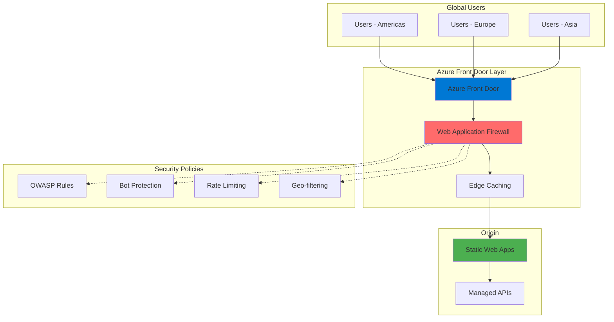

# Edge-Secured Web Applications with Azure Static Web Apps and Front Door WAF

## Problem

Modern web applications face constant security threats from SQL injection, cross-site scripting (XSS), and distributed denial-of-service (DDoS) attacks while needing to deliver content quickly to global users. Organizations struggle to balance security requirements with performance, often implementing point solutions that increase complexity and latency without providing comprehensive protection against evolving threats.

## Solution

Implement Azure Static Web Apps with Azure Front Door and Web Application Firewall (WAF) to create a secure, globally distributed web application infrastructure. This solution provides enterprise-grade edge security with OWASP Top 10 protection, bot management, and custom security rules while leveraging Azure's global CDN network for optimal performance and reliability across all regions.

## Architecture Diagram



## Prerequisites

1. Azure account with Owner or Contributor access to create resources
2. Azure CLI v2.53.0 or later installed and configured (or use Azure Cloud Shell)
3. Basic understanding of web security concepts and CDN principles
4. Git installed for source code management
5. Estimated cost: ~$15-30/month for Standard tier services (varies by traffic)

> **Note**: This recipe uses Azure Front Door Standard tier which includes basic WAF capabilities. For advanced WAF features, consider Premium tier.

## Preparation

```bash
# Set environment variables for consistent resource naming
export RESOURCE_GROUP="rg-secure-webapp-${RANDOM_SUFFIX}"
export LOCATION="eastus"
export SUBSCRIPTION_ID=$(az account show --query id --output tsv)

# Generate unique suffix for globally unique names
RANDOM_SUFFIX=$(openssl rand -hex 3)

# Create resource group for all resources
az group create \
    --name ${RESOURCE_GROUP} \
    --location ${LOCATION} \
    --tags purpose=security-demo environment=production

# Set additional variables for services
export SWA_NAME="swa-secure-${RANDOM_SUFFIX}"
export AFD_NAME="afd-secure-${RANDOM_SUFFIX}"
export WAF_POLICY_NAME="wafpolicy${RANDOM_SUFFIX}"

echo "✅ Resource group created: ${RESOURCE_GROUP}"
echo "✅ Static Web App name: ${SWA_NAME}"
echo "✅ Front Door name: ${AFD_NAME}"
```

## Steps

1. **Create Azure Static Web Apps Instance**:

   Azure Static Web Apps provides a streamlined hosting solution for modern web applications with built-in CI/CD from GitHub or Azure DevOps. This managed service automatically builds and deploys your web app from source code while providing global distribution, custom domains, and free SSL certificates. The Standard tier enables enterprise features including private endpoints and SLA guarantees.

   ```bash
   # Create Static Web App with Standard plan for enterprise features
   az staticwebapp create \
       --name ${SWA_NAME} \
       --resource-group ${RESOURCE_GROUP} \
       --location ${LOCATION} \
       --sku Standard \
       --source https://github.com/staticwebdev/vanilla-basic \
       --branch main \
       --app-location "/" \
       --output-location "public" \
       --tags security=enhanced deployment=automated

   # Retrieve the default hostname for later configuration
   SWA_HOSTNAME=$(az staticwebapp show \
       --name ${SWA_NAME} \
       --resource-group ${RESOURCE_GROUP} \
       --query defaultHostname \
       --output tsv)

   echo "✅ Static Web App created: https://${SWA_HOSTNAME}"
   ```

   The Static Web App is now deployed with automatic builds triggered on code changes. This provides the foundation for our secure web application that will be enhanced with Front Door's security capabilities.

2. **Create WAF Policy with Security Rules**:

   Azure Web Application Firewall (WAF) policy defines the security rules that protect your web application from common vulnerabilities and exploits. The managed rule sets include protection against OWASP Top 10 threats like SQL injection and cross-site scripting. Custom rules enable additional controls such as rate limiting and geo-filtering for defense-in-depth security.

   ```bash
   # Create WAF policy with managed OWASP rules
   az network front-door waf-policy create \
       --name ${WAF_POLICY_NAME} \
       --resource-group ${RESOURCE_GROUP} \
       --sku Standard_AzureFrontDoor \
       --mode Prevention \
       --tags purpose=security compliance=required

   # Enable Microsoft Default Rule Set (DRS) for OWASP protection
   az network front-door waf-policy managed-rules add \
       --policy-name ${WAF_POLICY_NAME} \
       --resource-group ${RESOURCE_GROUP} \
       --type Microsoft_DefaultRuleSet \
       --version 2.1 \
       --action Block

   # Enable Bot Manager Rule Set for bot protection
   az network front-door waf-policy managed-rules add \
       --policy-name ${WAF_POLICY_NAME} \
       --resource-group ${RESOURCE_GROUP} \
       --type Microsoft_BotManagerRuleSet \
       --version 1.0 \
       --action Block

   echo "✅ WAF policy created with OWASP and Bot protection rules"
   ```

   The WAF policy now actively blocks malicious requests based on Microsoft's threat intelligence and OWASP patterns. Prevention mode ensures immediate protection while managed rules are automatically updated as new threats emerge.

3. **Configure Custom Security Rules**:

   Custom WAF rules provide granular control over traffic patterns specific to your application. Rate limiting prevents abuse and DDoS attacks at the application layer by restricting requests per IP address. Geo-filtering enables compliance with data sovereignty requirements by controlling access based on geographic location.

   ```bash
   # Create rate limiting rule (100 requests per minute per IP)
   az network front-door waf-policy rule create \
       --name RateLimitRule \
       --policy-name ${WAF_POLICY_NAME} \
       --resource-group ${RESOURCE_GROUP} \
       --rule-type RateLimitRule \
       --rate-limit-duration 1 \
       --rate-limit-threshold 100 \
       --priority 1 \
       --action Block \
       --defer

   # Add match condition for rate limiting rule
   az network front-door waf-policy rule match-condition add \
       --match-variable RequestUri \
       --operator Contains \
       --values "/" \
       --name RateLimitRule \
       --policy-name ${WAF_POLICY_NAME} \
       --resource-group ${RESOURCE_GROUP}

   # Create geo-filtering rule (allow only specific regions)
   az network front-door waf-policy rule create \
       --name GeoFilterRule \
       --policy-name ${WAF_POLICY_NAME} \
       --resource-group ${RESOURCE_GROUP} \
       --rule-type MatchRule \
       --priority 2 \
       --action Allow \
       --defer

   # Add geo-filtering match condition
   az network front-door waf-policy rule match-condition add \
       --match-variable RemoteAddr \
       --operator GeoMatch \
       --values "US" "CA" "GB" "DE" "ZZ" \
       --name GeoFilterRule \
       --policy-name ${WAF_POLICY_NAME} \
       --resource-group ${RESOURCE_GROUP}

   echo "✅ Custom security rules configured for rate limiting and geo-filtering"
   ```

   These custom rules work alongside managed rules to provide comprehensive protection. Rate limiting prevents resource exhaustion while geo-filtering ensures compliance with regional access requirements. The "ZZ" country code handles IP addresses not yet mapped to avoid false positives.

4. **Create Azure Front Door with WAF Integration**:

   Azure Front Door acts as a global entry point for your web application, providing intelligent routing, SSL termination, and edge caching across Microsoft's global network. Integration with WAF ensures all traffic is inspected before reaching your origin, while the CDN capabilities improve performance through strategic content caching at edge locations worldwide.

   ```bash
   # Create Front Door profile with Standard tier
   az afd profile create \
       --profile-name ${AFD_NAME} \
       --resource-group ${RESOURCE_GROUP} \
       --sku Standard_AzureFrontDoor \
       --tags security=waf-enabled performance=optimized

   # Create Front Door endpoint
   ENDPOINT_NAME="endpoint-${RANDOM_SUFFIX}"
   az afd endpoint create \
       --endpoint-name ${ENDPOINT_NAME} \
       --profile-name ${AFD_NAME} \
       --resource-group ${RESOURCE_GROUP} \
       --enabled-state Enabled

   # Get endpoint hostname for configuration
   AFD_HOSTNAME=$(az afd endpoint show \
       --endpoint-name ${ENDPOINT_NAME} \
       --profile-name ${AFD_NAME} \
       --resource-group ${RESOURCE_GROUP} \
       --query hostName \
       --output tsv)

   echo "✅ Front Door created: https://${AFD_HOSTNAME}"
   ```

   Azure Front Door now provides a secure, globally distributed entry point for your application with automatic failover and optimal routing based on client location and endpoint health.

5. **Configure Origin Group and Origin**:

   Origin groups define how Front Door connects to your backend services with health probes ensuring high availability. The configuration includes connection timeouts, HTTP/HTTPS settings, and origin host headers that maintain proper request routing. Health probes continuously monitor origin availability to enable automatic failover during outages.

   ```bash
   # Create origin group for Static Web App
   az afd origin-group create \
       --origin-group-name "og-staticwebapp" \
       --profile-name ${AFD_NAME} \
       --resource-group ${RESOURCE_GROUP} \
       --probe-request-type GET \
       --probe-protocol Https \
       --probe-interval-in-seconds 30 \
       --probe-path "/" \
       --sample-size 4 \
       --successful-samples-required 3 \
       --additional-latency-in-milliseconds 50

   # Add Static Web App as origin
   az afd origin create \
       --origin-name "origin-swa" \
       --origin-group-name "og-staticwebapp" \
       --profile-name ${AFD_NAME} \
       --resource-group ${RESOURCE_GROUP} \
       --host-name ${SWA_HOSTNAME} \
       --origin-host-header ${SWA_HOSTNAME} \
       --priority 1 \
       --weight 1000 \
       --enabled-state Enabled \
       --http-port 80 \
       --https-port 443

   echo "✅ Origin group configured with health monitoring"
   ```

   The origin configuration ensures reliable connectivity to your Static Web App with automatic health monitoring detecting and routing around any failures within seconds.

6. **Create Routes and Apply WAF Policy**:

   Routes define how Front Door processes incoming requests including URL pattern matching, caching behavior, and security policy application. Associating the WAF policy with routes ensures all traffic undergoes security inspection before caching or origin forwarding. This configuration enables different security policies for different URL paths if needed.

   ```bash
   # Create route for all traffic with WAF policy
   az afd route create \
       --route-name "route-secure" \
       --endpoint-name ${ENDPOINT_NAME} \
       --profile-name ${AFD_NAME} \
       --resource-group ${RESOURCE_GROUP} \
       --origin-group "og-staticwebapp" \
       --supported-protocols Http Https \
       --patterns-to-match "/*" \
       --forwarding-protocol HttpsOnly \
       --link-to-default-domain Enabled \
       --https-redirect Enabled

   # Associate WAF policy with the endpoint
   WAF_POLICY_ID=$(az network front-door waf-policy show \
       --name ${WAF_POLICY_NAME} \
       --resource-group ${RESOURCE_GROUP} \
       --query id \
       --output tsv)

   az afd security-policy create \
       --security-policy-name "security-policy-waf" \
       --profile-name ${AFD_NAME} \
       --resource-group ${RESOURCE_GROUP} \
       --domains ${ENDPOINT_NAME} \
       --waf-policy-id ${WAF_POLICY_ID}

   echo "✅ Routes configured with WAF policy applied"
   ```

   All traffic now flows through the WAF for inspection before reaching your application. HTTPS redirect ensures encrypted connections while the forwarding protocol maintains security end-to-end.

7. **Configure Static Web App for Front Door Integration**:

   Static Web Apps must be configured to accept traffic only from your Front Door instance to prevent bypass attacks. This configuration uses Front Door's unique identifier header and restricts the allowed forwarded hosts. These settings ensure that all traffic flows through your WAF policy and cannot reach the origin directly.

   ```bash
   # Get Front Door ID for configuration
   FRONT_DOOR_ID=$(az afd profile show \
       --profile-name ${AFD_NAME} \
       --resource-group ${RESOURCE_GROUP} \
       --query frontDoorId \
       --output tsv)

   # Create configuration file for Static Web App
   cat > staticwebapp.config.json << EOF
   {
     "networking": {
       "allowedIpRanges": ["AzureFrontDoor.Backend"]
     },
     "forwardingGateway": {
       "requiredHeaders": {
         "X-Azure-FDID": "${FRONT_DOOR_ID}"
       },
       "allowedForwardedHosts": [
         "${AFD_HOSTNAME}"
       ]
     },
     "routes": [
       {
         "route": "/.auth/*",
         "headers": {
           "Cache-Control": "no-store"
         }
       }
     ]
   }
   EOF

   echo "✅ Static Web App configuration created for Front Door integration"
   echo "📝 Deploy this configuration file to your Static Web App repository"
   ```

   This configuration locks down your Static Web App to only accept traffic from your specific Front Door instance, preventing attackers from bypassing your WAF protection by accessing the origin directly.

8. **Enable Caching and Compression with Rule Sets**:

   Front Door's caching capabilities reduce origin load and improve performance by serving content from edge locations. Rule sets govern how content should be cached and compressed. These features work together to provide faster page loads while reducing infrastructure costs through decreased origin traffic.

   ```bash
   # Create rule set for caching and compression
   az afd rule-set create \
       --rule-set-name "ruleset-optimizations" \
       --profile-name ${AFD_NAME} \
       --resource-group ${RESOURCE_GROUP}

   # Create cache rule for static assets
   az afd rule create \
       --rule-name "rule-cache-static" \
       --profile-name ${AFD_NAME} \
       --resource-group ${RESOURCE_GROUP} \
       --rule-set-name "ruleset-optimizations" \
       --order 1 \
       --match-variable RequestUri \
       --operator Contains \
       --match-values ".css" ".js" ".jpg" ".png" ".gif" ".svg" ".woff" \
       --action-name CacheExpiration \
       --cache-behavior Override \
       --cache-duration "7.00:00:00"

   # Create compression rule for text content
   az afd rule create \
       --rule-name "rule-compression" \
       --profile-name ${AFD_NAME} \
       --resource-group ${RESOURCE_GROUP} \
       --rule-set-name "ruleset-optimizations" \
       --order 2 \
       --match-variable RequestHeader \
       --selector "Accept-Encoding" \
       --operator Contains \
       --match-values "gzip" \
       --action-name Compression \
       --enable-compression true

   # Associate rule set with the route
   az afd route update \
       --route-name "route-secure" \
       --endpoint-name ${ENDPOINT_NAME} \
       --profile-name ${AFD_NAME} \
       --resource-group ${RESOURCE_GROUP} \
       --rule-sets "ruleset-optimizations"

   echo "✅ Caching and compression optimizations configured"
   ```

   Static assets are now cached at edge locations for 7 days while dynamic content remains fresh. Compression automatically applies to supported content types when clients indicate support, reducing bandwidth usage and improving page load times.

## Validation & Testing

1. Verify Front Door endpoint is accessible:

   ```bash
   # Test Front Door endpoint
   curl -I https://${AFD_HOSTNAME}
   ```

   Expected output: You should see HTTP headers including `X-Azure-Ref` indicating Front Door processing.

2. Test WAF protection against common attacks:

   ```bash
   # Test SQL injection protection (should be blocked)
   curl -X GET "https://${AFD_HOSTNAME}/?id=1' OR '1'='1"

   # Test XSS protection (should be blocked)
   curl -X GET "https://${AFD_HOSTNAME}/?search=<script>alert('xss')</script>"
   ```

   Expected output: Both requests should return 403 Forbidden, confirming WAF is blocking malicious patterns.

3. Verify rate limiting functionality:

   ```bash
   # Send multiple requests to trigger rate limit
   for i in {1..150}; do
     curl -s -o /dev/null -w "%{http_code}\n" https://${AFD_HOSTNAME}
   done | sort | uniq -c
   ```

   Expected output: After 100 requests, subsequent requests should return 429 Too Many Requests.

4. Check WAF logs for blocked requests:

   ```bash
   # Query WAF logs (requires Log Analytics workspace setup)
   # Note: Replace ${LOG_ANALYTICS_WORKSPACE} with your workspace ID
   az monitor log-analytics query \
       --workspace ${LOG_ANALYTICS_WORKSPACE} \
       --analytics-query "AzureDiagnostics | where Category == 'FrontDoorWebApplicationFirewallLog' | where action_s == 'Block' | project TimeGenerated, clientIP_s, requestUri_s, ruleName_s | take 10" \
       --output table
   ```

## Cleanup

1. Delete Front Door profile (includes endpoints and routes):

   ```bash
   # Delete Front Door profile
   az afd profile delete \
       --profile-name ${AFD_NAME} \
       --resource-group ${RESOURCE_GROUP} \
       --yes

   echo "✅ Front Door profile deleted"
   ```

2. Delete WAF policy:

   ```bash
   # Delete WAF policy
   az network front-door waf-policy delete \
       --name ${WAF_POLICY_NAME} \
       --resource-group ${RESOURCE_GROUP}

   echo "✅ WAF policy deleted"
   ```

3. Delete Static Web App:

   ```bash
   # Delete Static Web App
   az staticwebapp delete \
       --name ${SWA_NAME} \
       --resource-group ${RESOURCE_GROUP} \
       --yes

   echo "✅ Static Web App deleted"
   ```

4. Delete resource group and all remaining resources:

   ```bash
   # Delete entire resource group
   az group delete \
       --name ${RESOURCE_GROUP} \
       --yes \
       --no-wait

   echo "✅ Resource group deletion initiated"
   echo "Note: Complete deletion may take several minutes"
   ```

## Discussion

Azure Front Door with WAF provides a comprehensive security solution that addresses modern web application threats while maintaining optimal performance. The integration follows the [Azure Well-Architected Framework](https://docs.microsoft.com/en-us/azure/architecture/framework/) security pillar by implementing defense-in-depth with multiple security layers. The managed OWASP rule sets protect against common vulnerabilities documented in the [OWASP Top 10](https://docs.microsoft.com/en-us/azure/web-application-firewall/afds/waf-front-door-drs), while custom rules address application-specific requirements.

The architecture leverages Azure's global network of over 192 edge locations to provide both security and performance benefits. By terminating SSL at the edge and inspecting traffic before it reaches your origin, the solution reduces attack surface while improving response times. The [Azure Front Door documentation](https://docs.microsoft.com/en-us/azure/frontdoor/front-door-overview) details how intelligent routing algorithms select optimal paths based on real-time network conditions.

From a cost optimization perspective, caching static content at edge locations significantly reduces origin bandwidth costs and compute requirements. The consumption-based pricing model ensures you only pay for actual usage while the Standard tier provides enterprise SLA guarantees. For detailed pricing guidance, consult the [Azure Front Door pricing documentation](https://docs.microsoft.com/en-us/azure/frontdoor/standard-premium/overview).

> **Tip**: Enable Azure Monitor diagnostic settings to stream WAF logs to Log Analytics for advanced threat hunting and compliance reporting. The [WAF monitoring guide](https://docs.microsoft.com/en-us/azure/web-application-firewall/afds/waf-front-door-monitor) provides query examples for common security scenarios.

## Challenge

Extend this solution by implementing these enhancements:

1. Add custom domain with managed SSL certificate and configure DNS records for production use
2. Implement Azure Sentinel integration for advanced security analytics and automated threat response
3. Create custom WAF rules based on application-specific patterns and business logic requirements
4. Configure multi-region Static Web Apps deployment with Front Door traffic management for disaster recovery
5. Enable Private Link connectivity between Front Door and premium Static Web Apps for network isolation

## Infrastructure Code

*Infrastructure code will be generated after recipe approval.*