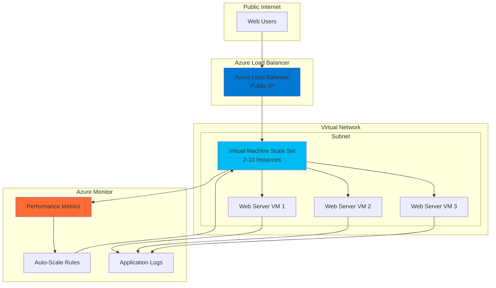

# Elastic Web Applications with VM Auto-Scaling

## Problem

Organizations running web applications face the challenge of maintaining optimal performance and availability while managing costs effectively. Traditional static infrastructure approaches often result in over-provisioning during low-traffic periods and under-provisioning during peak demand, leading to poor user experiences and inefficient resource utilization. Without proper load distribution and automatic scaling capabilities, applications cannot dynamically respond to changing traffic patterns, causing service degradation and potential downtime.

## Solution

This recipe demonstrates how to build a resilient, auto-scaling web application infrastructure using Azure Virtual Machine Scale Sets (VMSS) for elastic compute capacity and Azure Load Balancer for intelligent traffic distribution. The solution automatically scales compute resources up or down based on real-time demand metrics, while ensuring high availability through multi-instance deployment and health monitoring. Azure Monitor provides comprehensive observability and alerting capabilities to track performance and trigger scaling actions.

## Architecture Diagram



## Prerequisites

1. Azure account with appropriate permissions to create Virtual Machine Scale Sets, Load Balancers, and Monitor resources
2. Azure CLI v2.0.80 or later installed and configured (or Azure Cloud Shell)
3. Basic understanding of Azure networking concepts (Virtual Networks, subnets, security groups)
4. Familiarity with web server configuration and monitoring principles
5. Estimated cost: $50-150/month for development/testing environment (varies by instance size and scaling configuration)

> **Note**: This recipe creates resources that will incur Azure charges. The cost depends on the VM instance sizes, number of instances, and auto-scaling configuration. Review [Azure pricing documentation](https://azure.microsoft.com/pricing/) for current rates.

## Preparation

```bash
# Set environment variables for Azure resources
export RESOURCE_GROUP="rg-autoscale-web-app"
export LOCATION="East US"
export SUBSCRIPTION_ID=$(az account show --query id --output tsv)

# Generate unique suffix for resource names
RANDOM_SUFFIX=$(openssl rand -hex 3)
export VMSS_NAME="vmss-webapp-${RANDOM_SUFFIX}"
export LB_NAME="lb-webapp-${RANDOM_SUFFIX}"
export VNET_NAME="vnet-webapp-${RANDOM_SUFFIX}"
export SUBNET_NAME="subnet-webapp"
export NSG_NAME="nsg-webapp-${RANDOM_SUFFIX}"
export PUBLIC_IP_NAME="pip-webapp-${RANDOM_SUFFIX}"

# Create resource group
az group create \
    --name ${RESOURCE_GROUP} \
    --location "${LOCATION}" \
    --tags purpose=recipe environment=demo

echo "✅ Resource group created: ${RESOURCE_GROUP}"

# Create Virtual Network and subnet
az network vnet create \
    --resource-group ${RESOURCE_GROUP} \
    --name ${VNET_NAME} \
    --address-prefix 10.0.0.0/16 \
    --subnet-name ${SUBNET_NAME} \
    --subnet-prefix 10.0.1.0/24 \
    --location "${LOCATION}"

echo "✅ Virtual Network created: ${VNET_NAME}"

# Create Network Security Group with web traffic rules
az network nsg create \
    --resource-group ${RESOURCE_GROUP} \
    --name ${NSG_NAME} \
    --location "${LOCATION}"

# Allow HTTP traffic
az network nsg rule create \
    --resource-group ${RESOURCE_GROUP} \
    --nsg-name ${NSG_NAME} \
    --name Allow-HTTP \
    --protocol tcp \
    --priority 100 \
    --destination-port-range 80 \
    --access allow

# Allow HTTPS traffic
az network nsg rule create \
    --resource-group ${RESOURCE_GROUP} \
    --nsg-name ${NSG_NAME} \
    --name Allow-HTTPS \
    --protocol tcp \
    --priority 110 \
    --destination-port-range 443 \
    --access allow

echo "✅ Network Security Group configured: ${NSG_NAME}"
```

## Steps

1. **Create Public IP for Load Balancer**:

   A public IP address provides the external endpoint for your web application, allowing internet users to access your load-balanced service. Azure Load Balancer requires a static public IP to ensure consistent access and proper DNS resolution. The Standard SKU provides zone-redundancy and higher availability guarantees compared to Basic SKU.

   ```bash
   # Create public IP with static allocation
   az network public-ip create \
       --resource-group ${RESOURCE_GROUP} \
       --name ${PUBLIC_IP_NAME} \
       --allocation-method Static \
       --sku Standard \
       --location "${LOCATION}"
   
   # Get the public IP address for reference
   PUBLIC_IP_ADDRESS=$(az network public-ip show \
       --resource-group ${RESOURCE_GROUP} \
       --name ${PUBLIC_IP_NAME} \
       --query ipAddress \
       --output tsv)
   
   echo "✅ Public IP created: ${PUBLIC_IP_ADDRESS}"
   ```

   The public IP address is now allocated and ready for Load Balancer assignment. This static IP ensures that your web application maintains a consistent endpoint even during infrastructure changes or scaling operations.

2. **Create Azure Load Balancer**:

   Azure Load Balancer distributes incoming network traffic across multiple healthy VM instances in your scale set, providing high availability and fault tolerance. The Standard Load Balancer offers advanced features including availability zones support, health probes, and outbound connectivity rules. This configuration ensures optimal performance and resilience for your web application.

   ```bash
   # Create Standard Load Balancer
   az network lb create \
       --resource-group ${RESOURCE_GROUP} \
       --name ${LB_NAME} \
       --sku Standard \
       --public-ip-address ${PUBLIC_IP_NAME} \
       --frontend-ip-name frontend-ip \
       --backend-pool-name backend-pool \
       --location "${LOCATION}"
   
   # Create health probe for HTTP traffic
   az network lb probe create \
       --resource-group ${RESOURCE_GROUP} \
       --lb-name ${LB_NAME} \
       --name http-probe \
       --protocol http \
       --port 80 \
       --path /
   
   # Create load balancing rule
   az network lb rule create \
       --resource-group ${RESOURCE_GROUP} \
       --lb-name ${LB_NAME} \
       --name http-rule \
       --protocol tcp \
       --frontend-port 80 \
       --backend-port 80 \
       --frontend-ip-name frontend-ip \
       --backend-pool-name backend-pool \
       --probe-name http-probe \
       --load-distribution Default
   
   echo "✅ Load Balancer created and configured: ${LB_NAME}"
   ```

   The Load Balancer is now configured with health probes and load balancing rules. Health probes continuously monitor the availability of backend instances, automatically removing unhealthy VMs from the load balancing pool to maintain service availability.

3. **Create Virtual Machine Scale Set**:

   Virtual Machine Scale Sets provide the elastic compute foundation for your web application, allowing automatic scaling based on demand. This configuration deploys Ubuntu VMs with nginx web server pre-installed, creating a horizontally scalable web tier. The scale set integrates with the Load Balancer backend pool and applies the network security group for proper traffic filtering.

   ```bash
   # Create cloud-init script for web server setup
   cat > cloud-init.txt << 'EOF'
   #cloud-config
   package_upgrade: true
   packages:
     - nginx
   runcmd:
     - systemctl start nginx
     - systemctl enable nginx
     - echo "<h1>Web Server $(hostname)</h1><p>Server Time: $(date)</p>" > /var/www/html/index.html
     - systemctl restart nginx
   EOF
   
   # Create Virtual Machine Scale Set
   az vmss create \
       --resource-group ${RESOURCE_GROUP} \
       --name ${VMSS_NAME} \
       --image UbuntuLTS \
       --instance-count 2 \
       --admin-username azureuser \
       --generate-ssh-keys \
       --upgrade-policy-mode automatic \
       --vnet-name ${VNET_NAME} \
       --subnet ${SUBNET_NAME} \
       --nsg ${NSG_NAME} \
       --lb ${LB_NAME} \
       --backend-pool-name backend-pool \
       --custom-data cloud-init.txt \
       --vm-sku Standard_B2s \
       --location "${LOCATION}"
   
   # Clean up cloud-init file
   rm cloud-init.txt
   
   echo "✅ Virtual Machine Scale Set created: ${VMSS_NAME}"
   ```

   The Virtual Machine Scale Set is deployed with two initial instances running nginx web servers. Each instance automatically displays its hostname and current time, enabling you to verify load balancing functionality and monitor traffic distribution across instances.

4. **Configure Auto-Scaling Rules**:

   Auto-scaling rules automatically adjust the number of VM instances based on real-time performance metrics such as CPU utilization. This configuration creates scale-out rules for high CPU usage and scale-in rules for low CPU usage, ensuring optimal resource utilization and cost efficiency. The rules include cooldown periods to prevent rapid scaling fluctuations.

   ```bash
   # Create auto-scale profile with scale-out rule
   az monitor autoscale create \
       --resource-group ${RESOURCE_GROUP} \
       --resource ${VMSS_NAME} \
       --resource-type Microsoft.Compute/virtualMachineScaleSets \
       --name autoscale-profile \
       --min-count 2 \
       --max-count 10 \
       --count 2
   
   # Create scale-out rule (CPU > 70%)
   az monitor autoscale rule create \
       --resource-group ${RESOURCE_GROUP} \
       --autoscale-name autoscale-profile \
       --condition "Percentage CPU > 70 avg 5m" \
       --scale out 2 \
       --cooldown 5
   
   # Create scale-in rule (CPU < 30%)
   az monitor autoscale rule create \
       --resource-group ${RESOURCE_GROUP} \
       --autoscale-name autoscale-profile \
       --condition "Percentage CPU < 30 avg 5m" \
       --scale in 1 \
       --cooldown 5
   
   echo "✅ Auto-scaling rules configured for ${VMSS_NAME}"
   ```

   Auto-scaling is now active with intelligent rules that add instances when CPU usage exceeds 70% and remove instances when CPU usage drops below 30%. This ensures your application maintains optimal performance during traffic spikes while minimizing costs during low-traffic periods.

5. **Configure Application Insights and Monitoring**:

   Application Insights provides comprehensive monitoring and analytics for your web application, collecting performance metrics, dependency tracking, and user behavior data. This monitoring setup enables proactive issue detection, performance optimization, and scaling decision support through detailed telemetry and alerting capabilities.

   ```bash
   # Create Application Insights resource
   az monitor app-insights component create \
       --resource-group ${RESOURCE_GROUP} \
       --app webapp-insights-${RANDOM_SUFFIX} \
       --location "${LOCATION}" \
       --kind web \
       --application-type web
   
   # Get instrumentation key
   INSTRUMENTATION_KEY=$(az monitor app-insights component show \
       --resource-group ${RESOURCE_GROUP} \
       --app webapp-insights-${RANDOM_SUFFIX} \
       --query instrumentationKey \
       --output tsv)
   
   echo "✅ Application Insights configured with key: ${INSTRUMENTATION_KEY}"
   
   # Create alert rule for high CPU usage
   az monitor metrics alert create \
       --resource-group ${RESOURCE_GROUP} \
       --name high-cpu-alert \
       --scopes /subscriptions/${SUBSCRIPTION_ID}/resourceGroups/${RESOURCE_GROUP}/providers/Microsoft.Compute/virtualMachineScaleSets/${VMSS_NAME} \
       --condition "avg Percentage CPU > 80" \
       --description "Alert when CPU usage exceeds 80%" \
       --evaluation-frequency 1m \
       --window-size 5m \
       --severity 2
   
   echo "✅ High CPU alert configured"
   ```

   Application Insights and alerting are now configured to provide real-time monitoring of your web application. The monitoring solution tracks performance metrics, user interactions, and system health, while alerts notify you of potential issues before they impact users.

6. **Configure Load Balancer Health Probes and Backend Pool**:

   Load Balancer health probes continuously monitor the health of your web application instances, ensuring traffic is only routed to healthy VMs. This configuration creates custom health endpoints and implements advanced probe settings for optimal availability and performance monitoring. Proper health probe configuration is essential for maintaining high availability during scaling operations.

   ```bash
   # Update health probe with custom settings
   az network lb probe update \
       --resource-group ${RESOURCE_GROUP} \
       --lb-name ${LB_NAME} \
       --name http-probe \
       --interval 15 \
       --threshold 3 \
       --port 80 \
       --path /
   
   # Verify backend pool configuration
   az network lb address-pool show \
       --resource-group ${RESOURCE_GROUP} \
       --lb-name ${LB_NAME} \
       --name backend-pool \
       --query "backendIpConfigurations[].id" \
       --output table
   
   echo "✅ Load Balancer health probes optimized"
   ```

   The Load Balancer health probes are now configured with optimal settings for detecting instance health. The probes check every 15 seconds and require 3 consecutive failures before removing an instance from the load balancing pool, ensuring robust fault detection and minimal service disruption.

7. **Test Load Balancing and Auto-Scaling**:

   Testing validates that your auto-scaling web application responds correctly to traffic changes and maintains high availability. This step generates synthetic load to trigger scaling events and verifies that the Load Balancer distributes traffic evenly across healthy instances. The testing process demonstrates the complete end-to-end functionality of your resilient web application infrastructure.

   ```bash
   # Get the public IP address for testing
   PUBLIC_IP_ADDRESS=$(az network public-ip show \
       --resource-group ${RESOURCE_GROUP} \
       --name ${PUBLIC_IP_NAME} \
       --query ipAddress \
       --output tsv)
   
   # Test initial load balancing
   echo "Testing load balancing with public IP: ${PUBLIC_IP_ADDRESS}"
   for i in {1..5}; do
       curl -s http://${PUBLIC_IP_ADDRESS} | grep "Server" || echo "Request $i failed"
       sleep 2
   done
   
   # Create stress test script
   cat > stress-test.sh << 'EOF'
   #!/bin/bash
   PUBLIC_IP=$1
   echo "Starting stress test on ${PUBLIC_IP}"
   for i in {1..1000}; do
       curl -s http://${PUBLIC_IP} > /dev/null &
       if [ $((i % 50)) -eq 0 ]; then
           echo "Sent $i requests"
           sleep 1
       fi
   done
   wait
   echo "Stress test completed"
   EOF
   
   chmod +x stress-test.sh
   
   echo "✅ Load balancing test completed. Run './stress-test.sh ${PUBLIC_IP_ADDRESS}' to trigger auto-scaling"
   ```

   The testing framework is now ready to validate your auto-scaling web application. The initial load balancing test confirms traffic distribution across instances, while the stress test script can generate sufficient load to trigger auto-scaling rules and demonstrate the system's elastic capabilities.

## Validation & Testing

1. **Verify VMSS deployment and health**:

   ```bash
   # Check VMSS instance status
   az vmss show \
       --resource-group ${RESOURCE_GROUP} \
       --name ${VMSS_NAME} \
       --query "provisioningState" \
       --output tsv
   
   # List individual instances
   az vmss list-instances \
       --resource-group ${RESOURCE_GROUP} \
       --name ${VMSS_NAME} \
       --output table
   ```

   Expected output: `Succeeded` provisioning state and 2 running instances in the scale set.

2. **Test Load Balancer functionality**:

   ```bash
   # Test load balancer response
   curl -s http://${PUBLIC_IP_ADDRESS} | head -5
   
   # Test load distribution across instances
   for i in {1..10}; do
       curl -s http://${PUBLIC_IP_ADDRESS} | grep "Web Server" | cut -d' ' -f3
   done | sort | uniq -c
   ```

   Expected output: HTML response from nginx and distribution showing requests across different hostnames.

3. **Verify auto-scaling configuration**:

   ```bash
   # Check autoscale profile
   az monitor autoscale show \
       --resource-group ${RESOURCE_GROUP} \
       --name autoscale-profile \
       --query "profiles[0].rules[].scaleAction" \
       --output table
   
   # Monitor current instance count
   az vmss show \
       --resource-group ${RESOURCE_GROUP} \
       --name ${VMSS_NAME} \
       --query "sku.capacity" \
       --output tsv
   ```

   Expected output: Scale-out and scale-in rules configured, with current capacity showing 2 instances.

4. **Test Application Insights integration**:

   ```bash
   # Verify Application Insights resource
   az monitor app-insights component show \
       --resource-group ${RESOURCE_GROUP} \
       --app webapp-insights-${RANDOM_SUFFIX} \
       --query "appId" \
       --output tsv
   
   # Check alert rules
   az monitor metrics alert list \
       --resource-group ${RESOURCE_GROUP} \
       --query "[].name" \
       --output table
   ```

   Expected output: Valid Application Insights app ID and configured alert rules.

## Cleanup

1. **Remove resource group and all resources**:

   ```bash
   # Delete resource group and all contained resources
   az group delete \
       --name ${RESOURCE_GROUP} \
       --yes \
       --no-wait
   
   echo "✅ Resource group deletion initiated: ${RESOURCE_GROUP}"
   echo "Note: Deletion may take several minutes to complete"
   ```

2. **Clean up local files**:

   ```bash
   # Remove generated test script
   rm -f stress-test.sh
   
   # Clear environment variables
   unset RESOURCE_GROUP LOCATION VMSS_NAME LB_NAME VNET_NAME
   unset SUBNET_NAME NSG_NAME PUBLIC_IP_NAME RANDOM_SUFFIX
   
   echo "✅ Local cleanup completed"
   ```

3. **Verify resource deletion**:

   ```bash
   # Check if resource group exists (optional)
   az group exists --name ${RESOURCE_GROUP} || echo "Resource group successfully deleted"
   ```

## Discussion

Azure Virtual Machine Scale Sets combined with Azure Load Balancer provide a powerful foundation for building resilient, auto-scaling web applications that can handle unpredictable traffic patterns. This architecture follows the [Azure Well-Architected Framework](https://docs.microsoft.com/en-us/azure/architecture/framework/) principles of reliability, scalability, and cost optimization. The auto-scaling capabilities ensure your application maintains optimal performance during traffic spikes while minimizing costs during low-traffic periods through intelligent scale-in policies.

The Load Balancer's health probe mechanism ensures high availability by continuously monitoring instance health and automatically removing unhealthy VMs from the rotation. This design pattern is particularly effective for stateless web applications where horizontal scaling provides linear performance improvements. For detailed guidance on scaling strategies and best practices, refer to the [Azure Virtual Machine Scale Sets documentation](https://docs.microsoft.com/en-us/azure/virtual-machine-scale-sets/) and [Azure Load Balancer performance guide](https://docs.microsoft.com/en-us/azure/load-balancer/load-balancer-standard-overview).

From a cost perspective, the auto-scaling configuration allows you to optimize resource allocation based on actual demand rather than peak capacity planning. Azure Monitor's integration with auto-scaling rules enables data-driven scaling decisions using custom metrics beyond CPU utilization, such as memory usage, network throughput, or application-specific metrics. This approach provides significant cost savings compared to traditional static infrastructure while maintaining superior performance and availability.

The monitoring and alerting capabilities provided by Application Insights and Azure Monitor create a comprehensive observability solution that enables proactive issue detection and resolution. The platform automatically collects performance telemetry, dependency tracking, and user behavior analytics, providing insights that support both operational excellence and business decision-making. For comprehensive monitoring strategies, review the [Azure Monitor documentation](https://docs.microsoft.com/en-us/azure/azure-monitor/) and [Application Insights best practices](https://docs.microsoft.com/en-us/azure/azure-monitor/app/app-insights-overview).

> **Tip**: Use Azure Advisor to receive personalized recommendations for optimizing your Virtual Machine Scale Sets configuration, including right-sizing instances, optimizing auto-scaling rules, and implementing security best practices based on your actual usage patterns and Azure's machine learning algorithms.

## Challenge

Extend this solution by implementing these enhancements:

1. **Multi-region deployment**: Deploy the same architecture across multiple Azure regions with Azure Traffic Manager for global load balancing and disaster recovery capabilities.

2. **Advanced monitoring**: Implement custom Application Insights metrics for business-specific KPIs and create Azure Monitor Workbooks for comprehensive dashboards with real-time performance visualization.

3. **Security hardening**: Add Azure Application Gateway with Web Application Firewall (WAF) in front of the Load Balancer to protect against common web vulnerabilities and implement SSL/TLS termination.

4. **Container modernization**: Convert the web application to containerized workloads using Azure Container Instances or Azure Kubernetes Service for improved deployment flexibility and resource efficiency.

5. **Database integration**: Add Azure Database for PostgreSQL or Azure Cosmos DB with connection pooling and implement database-aware auto-scaling rules that consider database performance metrics.

## Infrastructure Code

*Infrastructure code will be generated after recipe approval.*