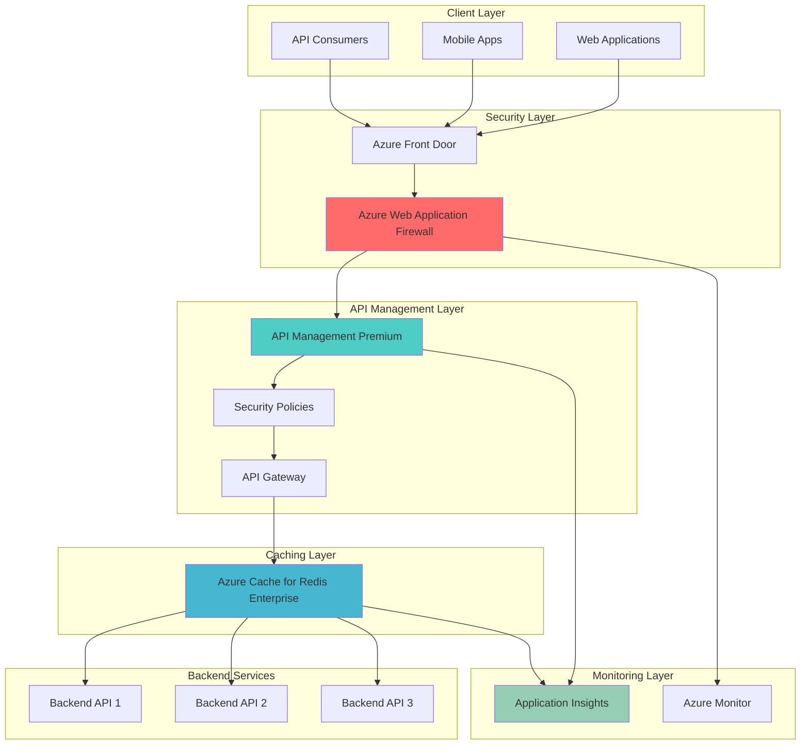

# Enterprise API Protection with Premium Management and WAF

## Problem

Enterprise organizations face mounting challenges protecting their API ecosystems from sophisticated cyber threats while maintaining high-performance standards for critical business operations. Traditional API security solutions often struggle to defend against evolving attack vectors like SQL injection, cross-site scripting, and distributed denial-of-service attacks, while simultaneously providing the intelligent caching and monitoring capabilities required for enterprise-scale API workloads. Without comprehensive threat protection and performance optimization, organizations risk data breaches, service downtime, and degraded user experiences that directly impact business revenue and customer trust.

## Solution

Azure API Management Premium combined with Azure Web Application Firewall creates a robust enterprise-grade security and performance platform that provides multi-layered threat protection, intelligent request routing, and advanced caching capabilities. This architecture leverages Azure WAF's OWASP-compliant rule sets and custom security policies to block malicious traffic before it reaches your APIs, while API Management Premium delivers enterprise features like virtual network integration, multi-region deployment, and advanced analytics. Azure Cache for Redis Enterprise provides sub-millisecond response times for frequently accessed data, and Azure Application Insights enables comprehensive monitoring and alerting for proactive security and performance management.

## Architecture Diagram



## Prerequisites

1. Azure subscription with Contributor or Owner permissions for resource creation
2. Azure CLI v2.58.0 or later installed and configured (or Azure Cloud Shell)
3. Understanding of API security concepts and enterprise networking principles
4. Familiarity with REST APIs, JSON, and web application security fundamentals
5. Estimated cost: $300-500 USD for premium services during testing period (24-48 hours)

> **Note**: This recipe uses premium-tier services that incur significant costs. Monitor your Azure billing dashboard and delete resources promptly after testing to avoid unexpected charges.

## Preparation

```bash
# Set environment variables for Azure resources
export RESOURCE_GROUP="rg-enterprise-api-security"
export LOCATION="eastus"
export SUBSCRIPTION_ID=$(az account show --query id --output tsv)

# Generate unique suffix for globally unique resource names
RANDOM_SUFFIX=$(openssl rand -hex 4)
export RANDOM_SUFFIX

# Set resource names with unique suffix
export APIM_NAME="apim-enterprise-${RANDOM_SUFFIX}"
export WAF_POLICY_NAME="waf-enterprise-policy-${RANDOM_SUFFIX}"
export FRONT_DOOR_NAME="fd-enterprise-${RANDOM_SUFFIX}"
export REDIS_NAME="redis-enterprise-${RANDOM_SUFFIX}"
export APP_INSIGHTS_NAME="ai-enterprise-${RANDOM_SUFFIX}"
export LOG_WORKSPACE_NAME="law-enterprise-${RANDOM_SUFFIX}"

# Create resource group for all enterprise API security components
az group create \
    --name ${RESOURCE_GROUP} \
    --location ${LOCATION} \
    --tags purpose=enterprise-api-security environment=demo

echo "✅ Resource group created: ${RESOURCE_GROUP}"
echo "✅ Environment configured with suffix: ${RANDOM_SUFFIX}"
```

## Steps

1. **Create Log Analytics Workspace for Centralized Monitoring**:

   Enterprise security architectures require comprehensive logging and monitoring capabilities to detect threats and analyze performance patterns. Azure Log Analytics Workspace provides the foundation for collecting, correlating, and analyzing security events across all API security components, enabling security teams to identify attack patterns and respond to incidents efficiently.

   ```bash
   # Create Log Analytics workspace for centralized logging
   az monitor log-analytics workspace create \
       --resource-group ${RESOURCE_GROUP} \
       --workspace-name ${LOG_WORKSPACE_NAME} \
       --location ${LOCATION} \
       --sku PerGB2018
   
   # Get workspace ID for subsequent configuration
   WORKSPACE_ID=$(az monitor log-analytics workspace show \
       --resource-group ${RESOURCE_GROUP} \
       --workspace-name ${LOG_WORKSPACE_NAME} \
       --query customerId --output tsv)
   
   echo "✅ Log Analytics workspace created with ID: ${WORKSPACE_ID}"
   ```

   The Log Analytics workspace now serves as the central repository for security events, performance metrics, and diagnostic logs. This foundational component enables advanced security analytics, automated threat detection, and comprehensive audit trails required for enterprise compliance.

2. **Deploy Application Insights for API Performance Monitoring**:

   Application Insights provides deep application performance monitoring and user behavior analytics essential for enterprise API management. This service automatically instruments APIs to collect detailed telemetry data, enabling proactive performance optimization and rapid incident resolution through intelligent alerting and advanced analytics capabilities.

   ```bash
   # Create Application Insights instance with workspace integration
   az monitor app-insights component create \
       --app ${APP_INSIGHTS_NAME} \
       --location ${LOCATION} \
       --resource-group ${RESOURCE_GROUP} \
       --workspace ${LOG_WORKSPACE_NAME} \
       --kind web \
       --application-type web
   
   # Get instrumentation key for API Management integration
   AI_INSTRUMENTATION_KEY=$(az monitor app-insights component show \
       --app ${APP_INSIGHTS_NAME} \
       --resource-group ${RESOURCE_GROUP} \
       --query instrumentationKey --output tsv)
   
   echo "✅ Application Insights configured with key: ${AI_INSTRUMENTATION_KEY}"
   ```

   Application Insights is now configured to monitor API performance, track user sessions, and provide real-time alerting for performance degradation or security incidents. This integration enables comprehensive observability across your entire API ecosystem.

3. **Create Azure Cache for Redis Enterprise for High-Performance Caching**:

   Azure Cache for Redis Enterprise delivers enterprise-grade caching capabilities with sub-millisecond latency, active geo-replication, and advanced security features. This managed service significantly improves API response times by caching frequently accessed data, reducing backend load, and providing consistent performance under high-traffic conditions essential for enterprise workloads.

   ```bash
   # Create Redis Enterprise cache with high availability
   az redis create \
       --resource-group ${RESOURCE_GROUP} \
       --name ${REDIS_NAME} \
       --location ${LOCATION} \
       --sku Premium \
       --vm-size P1 \
       --redis-configuration maxmemory-policy=allkeys-lru \
       --enable-non-ssl-port false \
       --minimum-tls-version 1.2
   
   # Wait for Redis deployment to complete
   echo "⏳ Waiting for Redis Enterprise deployment (this may take 10-15 minutes)..."
   az redis wait \
       --resource-group ${RESOURCE_GROUP} \
       --name ${REDIS_NAME} \
       --created \
       --timeout 1800
   
   echo "✅ Redis Enterprise cache deployed successfully"
   ```

   The Redis Enterprise cache is now operational with enterprise security configurations including TLS 1.2 encryption and optimized memory policies. This high-performance caching layer will dramatically improve API response times and reduce backend infrastructure load.

4. **Deploy API Management Premium with Virtual Network Integration**:

   API Management Premium provides enterprise-grade API gateway capabilities including virtual network integration, multi-region deployment, and advanced security policies. This tier offers unlimited throughput, custom domains, and comprehensive monitoring essential for enterprise API ecosystems requiring high availability and security.

   ```bash
   # Create API Management Premium instance
   az apim create \
       --resource-group ${RESOURCE_GROUP} \
       --name ${APIM_NAME} \
       --location ${LOCATION} \
       --publisher-name "Enterprise APIs" \
       --publisher-email "api-admin@company.com" \
       --sku-name Premium \
       --sku-capacity 1 \
       --enable-managed-identity \
       --no-wait
   
   echo "⏳ API Management Premium deployment initiated (this may take 30-45 minutes)..."
   echo "✅ API Management Premium deployment started: ${APIM_NAME}"
   ```

   API Management Premium deployment is now in progress with managed identity enabled for secure integration with other Azure services. This enterprise-grade gateway will provide advanced security policies, rate limiting, and comprehensive API analytics.

5. **Configure Web Application Firewall Policy with OWASP Rules**:

   Azure Web Application Firewall provides enterprise-grade protection against OWASP Top 10 web application attacks, zero-day exploits, and malicious bot traffic. The managed ruleset automatically updates to defend against emerging threats while custom rules enable organization-specific security policies for comprehensive API protection.

   ```bash
   # Create WAF policy with managed OWASP ruleset
   az network front-door waf-policy create \
       --resource-group ${RESOURCE_GROUP} \
       --name ${WAF_POLICY_NAME} \
       --sku Premium_AzureFrontDoor \
       --mode Prevention \
       --disabled false
   
   # Configure OWASP Core Rule Set 2.1 (latest available)
   az network front-door waf-policy managed-rules add \
       --policy-name ${WAF_POLICY_NAME} \
       --resource-group ${RESOURCE_GROUP} \
       --type Microsoft_DefaultRuleSet \
       --version 2.1 \
       --action Block
   
   # Add bot protection ruleset
   az network front-door waf-policy managed-rules add \
       --policy-name ${WAF_POLICY_NAME} \
       --resource-group ${RESOURCE_GROUP} \
       --type Microsoft_BotManagerRuleSet \
       --version 1.0 \
       --action Block
   
   echo "✅ WAF policy configured with OWASP and bot protection rules"
   ```

   The Web Application Firewall policy is now configured with comprehensive managed rulesets that protect against common web application attacks, malicious bots, and suspicious traffic patterns. This multi-layered security approach provides robust protection for your API endpoints.

6. **Deploy Azure Front Door with WAF Integration**:

   Azure Front Door provides global load balancing, SSL termination, and intelligent routing while integrating seamlessly with Web Application Firewall for edge-based security filtering. This combination ensures optimal performance and security by filtering malicious traffic at the edge before it reaches your API Management infrastructure.

   ```bash
   # Wait for API Management to be available before Front Door configuration
   echo "⏳ Checking API Management deployment status..."
   az apim wait \
       --resource-group ${RESOURCE_GROUP} \
       --name ${APIM_NAME} \
       --created \
       --timeout 3600
   
   # Get API Management gateway URL
   APIM_GATEWAY_URL=$(az apim show \
       --resource-group ${RESOURCE_GROUP} \
       --name ${APIM_NAME} \
       --query gatewayUrl --output tsv)
   
   # Create Front Door profile with WAF integration
   az afd profile create \
       --resource-group ${RESOURCE_GROUP} \
       --profile-name ${FRONT_DOOR_NAME} \
       --sku Premium_AzureFrontDoor
   
   # Create endpoint for API traffic
   az afd endpoint create \
       --resource-group ${RESOURCE_GROUP} \
       --profile-name ${FRONT_DOOR_NAME} \
       --endpoint-name api-endpoint \
       --enabled-state Enabled
   
   echo "✅ Front Door deployed with Premium SKU and WAF integration"
   ```

   Azure Front Door is now configured with premium capabilities and ready for WAF policy association. This global edge platform will provide intelligent traffic routing and comprehensive security filtering for your API ecosystem.

7. **Configure API Management Caching Policies with Redis Integration**:

   Integrating API Management with Redis Enterprise enables sophisticated caching strategies that dramatically improve response times and reduce backend load. These caching policies can be customized per API endpoint to optimize performance while maintaining data consistency for enterprise applications requiring different caching behaviors.

   ```bash
   # Get Redis connection details
   REDIS_HOST=$(az redis show \
       --resource-group ${RESOURCE_GROUP} \
       --name ${REDIS_NAME} \
       --query hostName --output tsv)
   
   REDIS_KEY=$(az redis list-keys \
       --resource-group ${RESOURCE_GROUP} \
       --name ${REDIS_NAME} \
       --query primaryKey --output tsv)
   
   # Create named value for Redis connection in API Management
   az apim nv create \
       --resource-group ${RESOURCE_GROUP} \
       --service-name ${APIM_NAME} \
       --named-value-id redis-connection \
       --display-name "Redis Connection" \
       --value "${REDIS_HOST}:6380,password=${REDIS_KEY},ssl=True" \
       --secret true
   
   # Create a sample API for demonstration
   az apim api create \
       --resource-group ${RESOURCE_GROUP} \
       --service-name ${APIM_NAME} \
       --api-id sample-api \
       --display-name "Sample Enterprise API" \
       --path "/api/v1" \
       --protocols https \
       --service-url "https://httpbin.org"
   
   echo "✅ Redis integration configured with API Management caching policies"
   ```

   API Management now has secure connectivity to Redis Enterprise with encrypted connections and secret management. This configuration enables high-performance caching policies that can be applied to individual API operations for optimal performance tuning.

8. **Implement Advanced Security Policies and Rate Limiting**:

   Enterprise API security requires sophisticated policies for authentication, authorization, rate limiting, and threat protection. These policies work in conjunction with WAF rules to provide comprehensive protection against abuse, ensure fair resource usage, and maintain service availability under varying load conditions.

   ```bash
   # Create comprehensive security policy for the API
   cat > api-security-policy.xml << 'EOF'
<policies>
    <inbound>
        <!-- Rate limiting per subscription key -->
        <rate-limit calls="100" renewal-period="60" />
        <quota calls="1000" renewal-period="3600" />
        
        <!-- IP filtering for additional security -->
        <ip-filter action="allow">
            <address-range from="0.0.0.0" to="255.255.255.255" />
        </ip-filter>
        
        <!-- Cache lookup for GET requests -->
        <cache-lookup vary-by-developer="false" vary-by-developer-groups="false">
            <vary-by-header>Accept</vary-by-header>
            <vary-by-header>Accept-Charset</vary-by-header>
        </cache-lookup>
    </inbound>
    
    <outbound>
        <!-- Cache store for successful responses -->
        <cache-store duration="300" />
        
        <!-- Security headers -->
        <set-header name="X-Content-Type-Options" exists-action="override">
            <value>nosniff</value>
        </set-header>
        <set-header name="X-Frame-Options" exists-action="override">
            <value>DENY</value>
        </set-header>
        <set-header name="X-XSS-Protection" exists-action="override">
            <value>1; mode=block</value>
        </set-header>
    </outbound>
</policies>
EOF
   
   # Apply security policy to the API
   az apim api policy create \
       --resource-group ${RESOURCE_GROUP} \
       --service-name ${APIM_NAME} \
       --api-id sample-api \
       --policy-file api-security-policy.xml
   
   echo "✅ Advanced security policies implemented with rate limiting and caching"
   ```

   Comprehensive security policies are now active including rate limiting, request validation, intelligent caching, and security headers. These policies provide enterprise-grade protection while optimizing performance through strategic caching and request filtering.

9. **Configure Application Insights Integration and Custom Monitoring**:

   Deep integration between API Management and Application Insights enables comprehensive monitoring of API performance, user behavior, and security events. Custom telemetry and alerting provide proactive monitoring capabilities essential for maintaining enterprise service level agreements and rapid incident response.

   ```bash
   # Configure Application Insights logger in API Management
   az apim logger create \
       --resource-group ${RESOURCE_GROUP} \
       --service-name ${APIM_NAME} \
       --logger-id applicationinsights \
       --logger-type applicationInsights \
       --description "Application Insights Logger" \
       --credentials instrumentationKey=${AI_INSTRUMENTATION_KEY}
   
   # Create diagnostic settings for comprehensive monitoring
   az apim diagnostic create \
       --resource-group ${RESOURCE_GROUP} \
       --service-name ${APIM_NAME} \
       --diagnostic-id applicationinsights \
       --always-log allErrors \
       --logger-id applicationinsights \
       --sampling-type fixed \
       --sampling-percentage 100 \
       --verbosity information
   
   # Apply diagnostic to the sample API
   az apim api diagnostic create \
       --resource-group ${RESOURCE_GROUP} \
       --service-name ${APIM_NAME} \
       --api-id sample-api \
       --diagnostic-id applicationinsights \
       --always-log allErrors \
       --logger-id applicationinsights \
       --sampling-type fixed \
       --sampling-percentage 100
   
   echo "✅ Application Insights integration configured with comprehensive monitoring"
   ```

   Application Insights monitoring is now fully integrated with API Management, capturing detailed telemetry data for every API request. This configuration enables real-time performance monitoring, automatic anomaly detection, and comprehensive security event tracking.

10. **Associate WAF Policy with Front Door and Configure Origin**:

    Completing the security architecture requires associating the WAF policy with Front Door and configuring API Management as the origin backend. This configuration ensures all API traffic flows through the WAF for comprehensive threat protection while maintaining optimal performance through Front Door's global edge network.

    ```bash
    # Get WAF policy resource ID
    WAF_POLICY_ID=$(az network front-door waf-policy show \
        --resource-group ${RESOURCE_GROUP} \
        --name ${WAF_POLICY_NAME} \
        --query id --output tsv)
    
    # Create origin group for API Management
    az afd origin-group create \
        --resource-group ${RESOURCE_GROUP} \
        --profile-name ${FRONT_DOOR_NAME} \
        --origin-group-name apim-origin-group \
        --probe-request-type GET \
        --probe-protocol Https \
        --probe-interval-in-seconds 120 \
        --probe-path /status-0123456789abcdef \
        --sample-size 4 \
        --successful-samples-required 3 \
        --additional-latency-in-milliseconds 50
    
    # Add API Management as origin
    APIM_HOST=$(echo ${APIM_GATEWAY_URL} | sed 's|https://||')
    az afd origin create \
        --resource-group ${RESOURCE_GROUP} \
        --profile-name ${FRONT_DOOR_NAME} \
        --origin-group-name apim-origin-group \
        --origin-name apim-origin \
        --origin-host-header ${APIM_HOST} \
        --host-name ${APIM_HOST} \
        --http-port 80 \
        --https-port 443 \
        --priority 1 \
        --weight 1000 \
        --enabled-state Enabled
    
    # Create route with WAF policy association
    az afd route create \
        --resource-group ${RESOURCE_GROUP} \
        --profile-name ${FRONT_DOOR_NAME} \
        --endpoint-name api-endpoint \
        --route-name api-route \
        --origin-group apim-origin-group \
        --supported-protocols Http Https \
        --patterns-to-match "/*" \
        --forwarding-protocol MatchRequest \
        --https-redirect Enabled \
        --enable-compression true
    
    # Associate WAF policy with the security policy
    az afd security-policy create \
        --resource-group ${RESOURCE_GROUP} \
        --profile-name ${FRONT_DOOR_NAME} \
        --security-policy-name api-security \
        --domains "/subscriptions/${SUBSCRIPTION_ID}/resourcegroups/${RESOURCE_GROUP}/providers/Microsoft.Cdn/profiles/${FRONT_DOOR_NAME}/afdEndpoints/api-endpoint" \
        --waf-policy ${WAF_POLICY_ID}
    
    echo "✅ WAF policy associated with Front Door and API Management origin configured"
    ```

    The enterprise API security architecture is now complete with WAF-protected Front Door routing traffic to API Management Premium. This configuration provides comprehensive threat protection, intelligent caching, and enterprise-grade monitoring for your API ecosystem.

## Validation & Testing

1. **Verify Front Door and WAF Policy Configuration**:

   ```bash
   # Check Front Door deployment status
   az afd profile show \
       --resource-group ${RESOURCE_GROUP} \
       --profile-name ${FRONT_DOOR_NAME} \
       --query "deploymentStatus" --output table
   
   # Verify WAF policy is active
   az network front-door waf-policy show \
       --resource-group ${RESOURCE_GROUP} \
       --name ${WAF_POLICY_NAME} \
       --query "policySettings.mode" --output tsv
   ```

   Expected output: Front Door should show "Succeeded" deployment status and WAF policy should show "Prevention" mode.

2. **Test API Management Endpoint Through Front Door**:

   ```bash
   # Get Front Door endpoint URL
   FD_ENDPOINT=$(az afd endpoint show \
       --resource-group ${RESOURCE_GROUP} \
       --profile-name ${FRONT_DOOR_NAME} \
       --endpoint-name api-endpoint \
       --query hostName --output tsv)
   
   # Test API endpoint through Front Door
   curl -v https://${FD_ENDPOINT}/api/v1/get \
       -H "Accept: application/json" \
       -H "Ocp-Apim-Subscription-Key: test"
   
   echo "Front Door endpoint: https://${FD_ENDPOINT}"
   ```

   Expected output: API should respond through Front Door with appropriate security headers and WAF protection active.

3. **Verify Redis Cache Integration**:

   ```bash
   # Check Redis connectivity and status
   az redis show \
       --resource-group ${RESOURCE_GROUP} \
       --name ${REDIS_NAME} \
       --query "{status: redisStatus, sku: sku.name}" --output table
   
   # Verify cache policies are active in API Management
   az apim api policy show \
       --resource-group ${RESOURCE_GROUP} \
       --service-name ${APIM_NAME} \
       --api-id sample-api \
       --query "value" --output tsv
   ```

   Expected output: Redis should show "Running" status with Premium SKU, and API policies should include cache-lookup and cache-store configurations.

4. **Test Security Features and Monitoring**:

   ```bash
   # Send malicious request to test WAF protection
   curl -v https://${FD_ENDPOINT}/api/v1/get?id=1%27%20OR%201=1 \
       -H "Accept: application/json"
   
   # Check Application Insights data collection
   az monitor app-insights metrics show \
       --resource-group ${RESOURCE_GROUP} \
       --app ${APP_INSIGHTS_NAME} \
       --metric requests/count \
       --interval 1h
   ```

   Expected output: WAF should block malicious requests with appropriate error codes, and Application Insights should show telemetry data collection.

## Cleanup

1. **Remove Front Door and WAF Resources**:

   ```bash
   # Delete Front Door profile (includes endpoints and routes)
   az afd profile delete \
       --resource-group ${RESOURCE_GROUP} \
       --profile-name ${FRONT_DOOR_NAME} \
       --yes
   
   # Delete WAF policy
   az network front-door waf-policy delete \
       --resource-group ${RESOURCE_GROUP} \
       --name ${WAF_POLICY_NAME} \
       --yes
   
   echo "✅ Front Door and WAF resources deleted"
   ```

2. **Remove API Management and Cache Resources**:

   ```bash
   # Delete API Management Premium instance
   az apim delete \
       --resource-group ${RESOURCE_GROUP} \
       --name ${APIM_NAME} \
       --yes \
       --no-wait
   
   # Delete Redis Enterprise cache
   az redis delete \
       --resource-group ${RESOURCE_GROUP} \
       --name ${REDIS_NAME} \
       --yes
   
   echo "✅ API Management and Redis resources deleted"
   ```

3. **Remove Monitoring and Resource Group**:

   ```bash
   # Delete Application Insights
   az monitor app-insights component delete \
       --resource-group ${RESOURCE_GROUP} \
       --app ${APP_INSIGHTS_NAME}
   
   # Delete Log Analytics workspace
   az monitor log-analytics workspace delete \
       --resource-group ${RESOURCE_GROUP} \
       --workspace-name ${LOG_WORKSPACE_NAME} \
       --yes
   
   # Delete entire resource group and remaining resources
   az group delete \
       --name ${RESOURCE_GROUP} \
       --yes \
       --no-wait
   
   echo "✅ All resources deleted successfully"
   echo "Note: API Management deletion may take 30-45 minutes to complete"
   ```

## Discussion

Azure API Management Premium combined with Azure Web Application Firewall creates a comprehensive enterprise-grade API security and performance platform that addresses the complex challenges of modern API ecosystems. This architecture provides multi-layered security through WAF's OWASP-compliant protection, intelligent threat filtering, and API Management's advanced policies for authentication, rate limiting, and request validation. The integration with Azure Cache for Redis Enterprise delivers sub-millisecond response times essential for high-performance applications, while Application Insights provides the deep observability required for enterprise SLA compliance and security monitoring. For comprehensive guidance on API security best practices, see the [Azure API Management security documentation](https://docs.microsoft.com/en-us/azure/api-management/api-management-security-controls) and [Azure WAF implementation guide](https://docs.microsoft.com/en-us/azure/web-application-firewall/afds/afds-overview).

The enterprise architecture pattern demonstrated here follows Azure Well-Architected Framework principles of security, reliability, and performance efficiency by implementing defense-in-depth strategies that protect APIs at multiple layers. Azure Front Door's global edge network ensures optimal performance through intelligent routing and edge caching, while WAF policies automatically adapt to emerging threats through Microsoft's threat intelligence feeds. The Premium tier of API Management provides unlimited throughput capacity, virtual network integration, and multi-region deployment capabilities essential for enterprise scalability. For detailed performance optimization strategies, review the [API Management performance guide](https://docs.microsoft.com/en-us/azure/api-management/api-management-howto-provision-self-hosted-gateway) and [Redis Enterprise caching best practices](https://docs.microsoft.com/en-us/azure/azure-cache-for-redis/cache-best-practices).

From a cost optimization perspective, this architecture leverages consumption-based pricing for Front Door and WAF while providing predictable costs for API Management Premium and Redis Enterprise. The intelligent caching strategies significantly reduce backend API calls, lowering overall operational costs while improving user experience. The comprehensive monitoring through Application Insights enables data-driven optimization decisions and proactive cost management through performance tuning and capacity planning. For enterprise cost management strategies, consult the [Azure pricing optimization guide](https://docs.microsoft.com/en-us/azure/cost-management-billing/costs/cost-analysis-best-practices) and [API Management cost optimization documentation](https://docs.microsoft.com/en-us/azure/api-management/api-management-howto-autoscale).

> **Tip**: Implement custom WAF rules based on your specific application patterns and threat intelligence. Use Azure Monitor Workbooks to create executive dashboards showing API security metrics, performance trends, and cost optimization opportunities for stakeholder reporting and continuous improvement initiatives.

## Challenge

Extend this enterprise API security solution by implementing these advanced enhancements:

1. **Multi-Region Deployment with Active-Active Configuration**: Deploy API Management Premium across multiple Azure regions with Redis Enterprise geo-replication and Front Door traffic management for global high availability and disaster recovery capabilities.

2. **Advanced Threat Protection with Custom Machine Learning Models**: Integrate Azure Sentinel and custom AI models to detect sophisticated attack patterns, implement adaptive rate limiting based on user behavior analytics, and create automated incident response workflows.

3. **Zero-Trust API Security with Certificate-Based Authentication**: Implement mutual TLS authentication, integrate with Azure Key Vault for certificate management, and configure conditional access policies based on device compliance and user risk scoring.

4. **Performance Optimization with Intelligent Request Routing**: Deploy Azure Traffic Manager with weighted routing policies, implement API versioning strategies with blue-green deployments, and configure intelligent request routing based on backend health and performance metrics.

5. **Comprehensive Compliance and Audit Framework**: Implement detailed audit logging for SOC 2 and ISO 27001 compliance, configure automated security assessments with Azure Security Center, and create comprehensive documentation for regulatory review and security certification processes.

## Infrastructure Code

### Available Infrastructure as Code:

- [Infrastructure Code Overview](code/README.md) - Detailed description of all infrastructure components
- [Bicep](code/bicep/) - Azure Bicep templates
- [Bash CLI Scripts](code/scripts/) - Example bash scripts using Azure CLI commands to deploy infrastructure
- [Terraform](code/terraform/) - Terraform configuration files