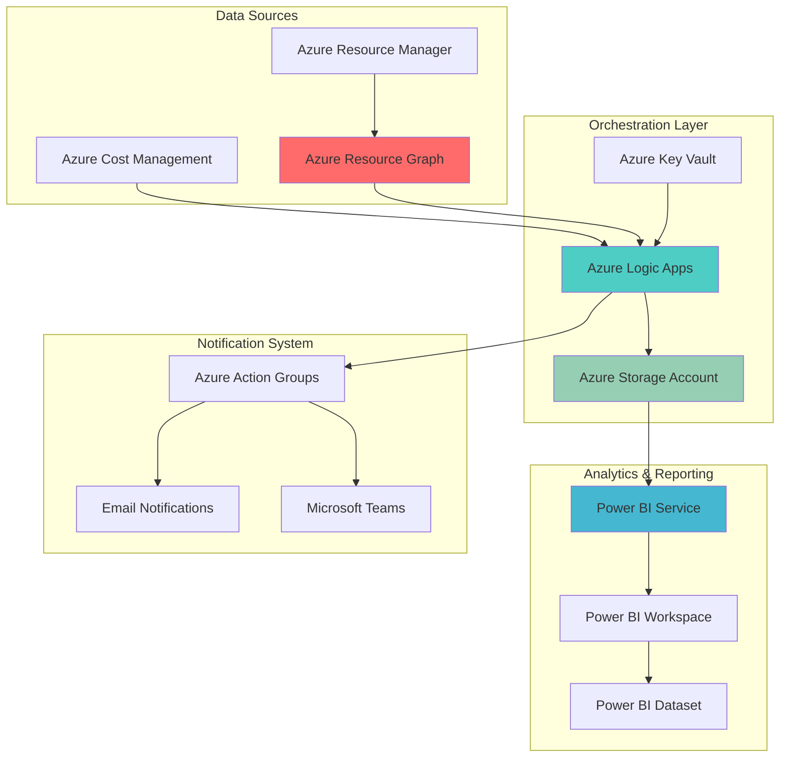

# Enterprise Cost Governance Dashboard with Resource Graph

## Problem

Organizations with multi-subscription Azure environments struggle to maintain visibility and control over cloud spending, often discovering cost overruns only after monthly bills arrive. Traditional cost management approaches lack real-time insights, automated alerting, and executive-level reporting, making it difficult to enforce budget policies and identify optimization opportunities across distributed teams and resources.

## Solution

This solution creates a comprehensive cost governance system that leverages Azure Resource Graph for real-time resource querying, Azure Cost Management APIs for spending data, and Power BI for executive dashboards. Azure Logic Apps orchestrates automated workflows that monitor spending patterns, trigger alerts when thresholds are exceeded, and generate detailed reports for proactive cost optimization and policy enforcement.

## Architecture Diagram



## Prerequisites

1. Azure subscription with Owner or Contributor permissions across multiple subscriptions
2. Azure CLI v2.50.0 or later installed and configured
3. Power BI Pro or Premium license for advanced analytics
4. Resource Graph Reader role at management group or subscription level
5. Cost Management Reader role for billing scope access
6. Estimated cost: $50-100/month for Logic Apps, Storage, and Power BI Premium

> **Note**: This solution requires permissions across multiple Azure subscriptions to provide comprehensive cost governance. Ensure you have the necessary RBAC assignments before proceeding.

## Preparation

```bash
# Set environment variables for Azure resources
export RESOURCE_GROUP="rg-cost-governance-${RANDOM_SUFFIX}"
export LOCATION="eastus"
export SUBSCRIPTION_ID=$(az account show --query id --output tsv)
export TENANT_ID=$(az account show --query tenantId --output tsv)

# Generate unique suffix for resource names
RANDOM_SUFFIX=$(openssl rand -hex 3)

# Set resource names with unique identifiers
export STORAGE_ACCOUNT="stcostgov${RANDOM_SUFFIX}"
export LOGIC_APP_NAME="la-cost-governance-${RANDOM_SUFFIX}"
export KEY_VAULT_NAME="kv-cost-gov-${RANDOM_SUFFIX}"
export ACTION_GROUP_NAME="ag-cost-alerts-${RANDOM_SUFFIX}"

# Create resource group for cost governance solution
az group create \
    --name ${RESOURCE_GROUP} \
    --location ${LOCATION} \
    --tags purpose=cost-governance environment=production

echo "✅ Resource group created: ${RESOURCE_GROUP}"

# Create storage account for data persistence
az storage account create \
    --name ${STORAGE_ACCOUNT} \
    --resource-group ${RESOURCE_GROUP} \
    --location ${LOCATION} \
    --sku Standard_LRS \
    --kind StorageV2 \
    --access-tier Hot

echo "✅ Storage account created: ${STORAGE_ACCOUNT}"
```

## Steps

1. **Configure Azure Key Vault for Secure Configuration**:

   Azure Key Vault provides centralized, secure storage for sensitive configuration data including API keys, connection strings, and cost thresholds. This managed service eliminates the need to store sensitive information in application code while ensuring compliance with enterprise security policies and providing audit logging for all access operations.

   ```bash
   # Create Key Vault for secure configuration storage
   az keyvault create \
       --name ${KEY_VAULT_NAME} \
       --resource-group ${RESOURCE_GROUP} \
       --location ${LOCATION} \
       --sku standard \
       --enable-rbac-authorization true
   
   # Grant Key Vault Secrets Officer role to current user
   USER_OBJECT_ID=$(az ad signed-in-user show --query id --output tsv)
   az role assignment create \
       --role "Key Vault Secrets Officer" \
       --assignee ${USER_OBJECT_ID} \
       --scope "/subscriptions/${SUBSCRIPTION_ID}/resourceGroups/${RESOURCE_GROUP}/providers/Microsoft.KeyVault/vaults/${KEY_VAULT_NAME}"
   
   # Store cost governance configuration secrets
   az keyvault secret set \
       --vault-name ${KEY_VAULT_NAME} \
       --name "cost-threshold-monthly" \
       --value "10000"
   
   az keyvault secret set \
       --vault-name ${KEY_VAULT_NAME} \
       --name "cost-threshold-daily" \
       --value "500"
   
   echo "✅ Key Vault configured with cost governance secrets"
   ```

   The Key Vault now securely stores cost thresholds and configuration data that will be accessed by Logic Apps for automated cost monitoring. This approach follows Azure security best practices by separating sensitive configuration from application logic while maintaining compliance audit trails.

2. **Set Up Azure Resource Graph Query Infrastructure**:

   Azure Resource Graph provides a powerful query service that enables efficient exploration of Azure resources at scale across multiple subscriptions. By creating optimized queries for cost-related resource analysis, we establish the foundation for real-time cost governance that can identify spending patterns, resource utilization, and optimization opportunities across the entire Azure estate.

   ```bash
   # Install Azure Resource Graph extension
   az extension add --name resource-graph
   
   # Create container in storage account for Resource Graph query results
   STORAGE_KEY=$(az storage account keys list \
       --account-name ${STORAGE_ACCOUNT} \
       --resource-group ${RESOURCE_GROUP} \
       --query '[0].value' --output tsv)
   
   az storage container create \
       --name resource-graph-data \
       --account-name ${STORAGE_ACCOUNT} \
       --account-key ${STORAGE_KEY} \
       --public-access off
   
   # Test Resource Graph query for cost-relevant resources
   az graph query \
       --query "resources | where type in~ ['microsoft.compute/virtualmachines', 'microsoft.storage/storageaccounts', 'microsoft.sql/servers'] | project name, type, resourceGroup, location, subscriptionId | limit 10"
   
   echo "✅ Resource Graph infrastructure configured and tested"
   ```

   The Resource Graph extension is now installed and configured to query cost-relevant resources across subscriptions. This capability enables the automated identification of resources that contribute significantly to Azure costs, forming the basis for targeted cost optimization recommendations.

3. **Create Azure Logic Apps for Cost Monitoring Automation**:

   Azure Logic Apps provides serverless workflow orchestration that can automatically monitor costs, execute Resource Graph queries, and trigger alerts based on predefined thresholds. This automation eliminates manual cost monitoring tasks while ensuring rapid response to cost anomalies and budget threshold breaches across multi-subscription environments.

   ```bash
   # Create Logic App for cost monitoring workflows
   az logic workflow create \
       --name ${LOGIC_APP_NAME} \
       --resource-group ${RESOURCE_GROUP} \
       --location ${LOCATION} \
       --definition '{
           "definition": {
               "$schema": "https://schema.management.azure.com/providers/Microsoft.Logic/schemas/2016-06-01/workflowdefinition.json#",
               "contentVersion": "1.0.0.0",
               "parameters": {},
               "triggers": {
                   "Recurrence": {
                       "recurrence": {
                           "frequency": "Hour",
                           "interval": 6
                       },
                       "type": "Recurrence"
                   }
               },
               "actions": {
                   "Initialize_variable": {
                       "inputs": {
                           "variables": [
                               {
                                   "name": "costThreshold",
                                   "type": "integer",
                                   "value": 10000
                               }
                           ]
                       },
                       "runAfter": {},
                       "type": "InitializeVariable"
                   }
               },
               "outputs": {}
           }
       }'
   
   # Create managed identity for Logic App
   az logic workflow identity assign \
       --name ${LOGIC_APP_NAME} \
       --resource-group ${RESOURCE_GROUP} \
       --system-assigned
   
   echo "✅ Logic App created with managed identity for secure authentication"
   ```

   The Logic App is now configured with a managed identity and scheduled to run every 6 hours for continuous cost monitoring. This serverless approach ensures cost-effective operations while providing automated governance capabilities that scale with your Azure environment.

4. **Configure Cost Management API Integration**:

   Azure Cost Management APIs provide programmatic access to detailed cost and usage data across subscriptions and billing scopes. By integrating these APIs with our Logic Apps workflow, we enable automated cost data collection, analysis, and reporting that forms the foundation for executive dashboards and automated cost governance policies.

   ```bash
   # Grant necessary permissions for Cost Management API access
   LOGIC_APP_PRINCIPAL_ID=$(az logic workflow identity show \
       --name ${LOGIC_APP_NAME} \
       --resource-group ${RESOURCE_GROUP} \
       --query principalId --output tsv)
   
   # Assign Cost Management Reader role to Logic App
   az role assignment create \
       --role "Cost Management Reader" \
       --assignee ${LOGIC_APP_PRINCIPAL_ID} \
       --scope "/subscriptions/${SUBSCRIPTION_ID}"
   
   # Assign Reader role for Resource Graph access
   az role assignment create \
       --role "Reader" \
       --assignee ${LOGIC_APP_PRINCIPAL_ID} \
       --scope "/subscriptions/${SUBSCRIPTION_ID}"
   
   # Create sample cost query for testing
   az rest \
       --method POST \
       --url "https://management.azure.com/subscriptions/${SUBSCRIPTION_ID}/providers/Microsoft.CostManagement/query?api-version=2021-10-01" \
       --headers "Content-Type=application/json" \
       --body '{
           "type": "Usage",
           "timeframe": "MonthToDate",
           "dataset": {
               "granularity": "Daily",
               "aggregation": {
                   "totalCost": {
                       "name": "PreTaxCost",
                       "function": "Sum"
                   }
               },
               "grouping": [
                   {
                       "type": "Dimension",
                       "name": "ResourceGroupName"
                   }
               ]
           }
       }'
   
   echo "✅ Cost Management API integration configured with proper permissions"
   ```

   The Logic App now has the necessary permissions to access Cost Management APIs and query cost data across subscriptions. This integration enables automated cost analysis and threshold monitoring that drives the governance workflows.

5. **Create Action Groups for Cost Alert Notifications**:

   Azure Action Groups provide centralized notification management for cost-related alerts, supporting multiple communication channels including email, SMS, and Microsoft Teams integration. This notification infrastructure ensures that cost threshold breaches and optimization opportunities are communicated to appropriate stakeholders in real-time, enabling rapid response to cost governance issues.

   ```bash
   # Create Action Group for cost alerts
   az monitor action-group create \
       --name ${ACTION_GROUP_NAME} \
       --resource-group ${RESOURCE_GROUP} \
       --short-name CostAlerts \
       --action email cost-admin admin@company.com \
       --action webhook cost-webhook https://hooks.slack.com/services/YOUR/WEBHOOK/URL
   
   # Create budget alert for monthly cost threshold
   az consumption budget create \
       --budget-name "monthly-cost-governance" \
       --amount 10000 \
       --time-grain Monthly \
       --time-period-start-date "2025-01-01" \
       --time-period-end-date "2025-12-31" \
       --resource-group ${RESOURCE_GROUP} \
       --notifications '{
           "Actual_GreaterThan_80_Percent": {
               "enabled": true,
               "operator": "GreaterThan",
               "threshold": 80,
               "contactEmails": ["admin@company.com"],
               "contactRoles": ["Owner"],
               "contactGroups": ["/subscriptions/'${SUBSCRIPTION_ID}'/resourceGroups/'${RESOURCE_GROUP}'/providers/microsoft.insights/actionGroups/'${ACTION_GROUP_NAME}'"]
           },
           "Forecasted_GreaterThan_100_Percent": {
               "enabled": true,
               "operator": "GreaterThan",
               "threshold": 100,
               "contactEmails": ["admin@company.com"],
               "contactRoles": ["Owner"],
               "contactGroups": ["/subscriptions/'${SUBSCRIPTION_ID}'/resourceGroups/'${RESOURCE_GROUP}'/providers/microsoft.insights/actionGroups/'${ACTION_GROUP_NAME}'"]
           }
       }'
   
   echo "✅ Action Group and budget alerts configured for cost governance"
   ```

   The Action Group now provides multi-channel notification capabilities for cost alerts, while the budget configuration ensures proactive monitoring of monthly spending with alerts at 80% actual and 100% forecasted thresholds. This creates a comprehensive early warning system for cost governance.

6. **Configure Power BI Data Source and Refresh**:

   Power BI provides enterprise-grade analytics and visualization capabilities that transform raw cost data into actionable insights for executive reporting. By configuring automated data refresh from Azure storage and Resource Graph, we create dynamic dashboards that provide real-time visibility into cost trends, optimization opportunities, and governance compliance across the Azure estate.

   ```bash
   # Create additional storage containers for Power BI data
   az storage container create \
       --name powerbi-datasets \
       --account-name ${STORAGE_ACCOUNT} \
       --account-key ${STORAGE_KEY} \
       --public-access off
   
   az storage container create \
       --name cost-reports \
       --account-name ${STORAGE_ACCOUNT} \
       --account-key ${STORAGE_KEY} \
       --public-access off
   
   # Generate sample cost data for Power BI testing
   az graph query \
       --query "resources | where type in~ ['microsoft.compute/virtualmachines', 'microsoft.storage/storageaccounts'] | project name, type, resourceGroup, location, subscriptionId, tags | limit 100" \
       --output table > /tmp/resource-inventory.csv
   
   # Upload sample data to storage for Power BI consumption
   az storage blob upload \
       --file /tmp/resource-inventory.csv \
       --container-name powerbi-datasets \
       --name "resource-inventory-$(date +%Y%m%d).csv" \
       --account-name ${STORAGE_ACCOUNT} \
       --account-key ${STORAGE_KEY}
   
   # Create SAS token for Power BI access
   STORAGE_SAS=$(az storage container generate-sas \
       --name powerbi-datasets \
       --account-name ${STORAGE_ACCOUNT} \
       --account-key ${STORAGE_KEY} \
       --permissions r \
       --expiry $(date -d "+1 year" +%Y-%m-%d) \
       --output tsv)
   
   echo "✅ Power BI data sources configured with automated refresh capabilities"
   echo "Storage URL: https://${STORAGE_ACCOUNT}.blob.core.windows.net/powerbi-datasets"
   echo "SAS Token: ${STORAGE_SAS}"
   ```

   The Power BI data infrastructure is now established with automated data refresh capabilities from Azure storage. This configuration enables real-time dashboard updates and executive reporting that drives data-driven cost governance decisions.

7. **Deploy Resource Graph Queries for Cost Analysis**:

   Advanced Resource Graph queries enable sophisticated cost analysis by identifying resource patterns, utilization trends, and optimization opportunities. These queries form the analytical foundation for automated cost governance, providing detailed insights into resource distribution, tag compliance, and potential cost optimization targets across multi-subscription environments.

   ```bash
   # Create comprehensive Resource Graph query for cost analysis
   cat > /tmp/cost-analysis-query.kql << 'EOF'
   resources
   | where type in~ [
       'microsoft.compute/virtualmachines',
       'microsoft.storage/storageaccounts',
       'microsoft.sql/servers',
       'microsoft.web/sites',
       'microsoft.containerinstance/containergroups',
       'microsoft.kubernetes/connectedclusters'
   ]
   | extend costCenter = tostring(tags['CostCenter'])
   | extend environment = tostring(tags['Environment'])
   | extend owner = tostring(tags['Owner'])
   | project 
       name,
       type,
       resourceGroup,
       location,
       subscriptionId,
       costCenter,
       environment,
       owner,
       tags
   | where isnotempty(name)
   | order by type, name
   EOF
   
   # Execute cost analysis query and save results
   az graph query \
       --query "$(cat /tmp/cost-analysis-query.kql)" \
       --output json > /tmp/cost-analysis-results.json
   
   # Upload query results to storage for Power BI
   az storage blob upload \
       --file /tmp/cost-analysis-results.json \
       --container-name cost-reports \
       --name "cost-analysis-$(date +%Y%m%d-%H%M).json" \
       --account-name ${STORAGE_ACCOUNT} \
       --account-key ${STORAGE_KEY}
   
   # Create tag compliance query
   cat > /tmp/tag-compliance-query.kql << 'EOF'
   resources
   | where type in~ [
       'microsoft.compute/virtualmachines',
       'microsoft.storage/storageaccounts',
       'microsoft.sql/servers'
   ]
   | extend hasOwnerTag = isnotempty(tags['Owner'])
   | extend hasCostCenterTag = isnotempty(tags['CostCenter'])
   | extend hasEnvironmentTag = isnotempty(tags['Environment'])
   | summarize 
       TotalResources = count(),
       ResourcesWithOwner = countif(hasOwnerTag),
       ResourcesWithCostCenter = countif(hasCostCenterTag),
       ResourcesWithEnvironment = countif(hasEnvironmentTag)
   by type, subscriptionId
   | extend 
       OwnerTagCompliance = round(100.0 * ResourcesWithOwner / TotalResources, 2),
       CostCenterTagCompliance = round(100.0 * ResourcesWithCostCenter / TotalResources, 2),
       EnvironmentTagCompliance = round(100.0 * ResourcesWithEnvironment / TotalResources, 2)
   EOF
   
   # Execute tag compliance analysis
   az graph query \
       --query "$(cat /tmp/tag-compliance-query.kql)" \
       --output json > /tmp/tag-compliance-results.json
   
   az storage blob upload \
       --file /tmp/tag-compliance-results.json \
       --container-name cost-reports \
       --name "tag-compliance-$(date +%Y%m%d-%H%M).json" \
       --account-name ${STORAGE_ACCOUNT} \
       --account-key ${STORAGE_KEY}
   
   echo "✅ Resource Graph queries deployed for comprehensive cost analysis"
   ```

   The Resource Graph queries are now deployed and executing automated cost analysis across your Azure environment. These queries identify resource patterns, tag compliance, and provide the data foundation for executive dashboards and automated cost governance policies.

8. **Configure Logic Apps Workflow for Automated Reporting**:

   The Logic Apps workflow orchestrates the entire cost governance process by combining Resource Graph queries, Cost Management API data, and automated reporting. This serverless automation ensures consistent cost monitoring, threshold enforcement, and stakeholder communication without manual intervention, scaling automatically with your Azure environment.

   ```bash
   # Update Logic App with comprehensive cost governance workflow
   az logic workflow update \
       --name ${LOGIC_APP_NAME} \
       --resource-group ${RESOURCE_GROUP} \
       --definition '{
           "definition": {
               "$schema": "https://schema.management.azure.com/providers/Microsoft.Logic/schemas/2016-06-01/workflowdefinition.json#",
               "contentVersion": "1.0.0.0",
               "parameters": {
                   "storageAccountName": {
                       "type": "string",
                       "defaultValue": "'${STORAGE_ACCOUNT}'"
                   },
                   "keyVaultName": {
                       "type": "string",
                       "defaultValue": "'${KEY_VAULT_NAME}'"
                   }
               },
               "triggers": {
                   "Recurrence": {
                       "recurrence": {
                           "frequency": "Hour",
                           "interval": 6
                       },
                       "type": "Recurrence"
                   }
               },
               "actions": {
                   "Get_Cost_Threshold": {
                       "inputs": {
                           "authentication": {
                               "type": "ManagedServiceIdentity"
                           },
                           "method": "GET",
                           "uri": "https://@{parameters('keyVaultName')}.vault.azure.net/secrets/cost-threshold-daily?api-version=2016-10-01"
                       },
                       "runAfter": {},
                       "type": "Http"
                   },
                   "Execute_Resource_Graph_Query": {
                       "inputs": {
                           "authentication": {
                               "type": "ManagedServiceIdentity"
                           },
                           "body": {
                               "query": "resources | where type in~ ['microsoft.compute/virtualmachines', 'microsoft.storage/storageaccounts'] | summarize count() by type, subscriptionId"
                           },
                           "method": "POST",
                           "uri": "https://management.azure.com/providers/Microsoft.ResourceGraph/resources?api-version=2021-03-01"
                       },
                       "runAfter": {
                           "Get_Cost_Threshold": [
                               "Succeeded"
                           ]
                       },
                       "type": "Http"
                   },
                   "Store_Results": {
                       "inputs": {
                           "authentication": {
                               "type": "ManagedServiceIdentity"
                           },
                           "body": "@body('Execute_Resource_Graph_Query')",
                           "headers": {
                               "x-ms-blob-type": "BlockBlob"
                           },
                           "method": "PUT",
                           "uri": "https://@{parameters('storageAccountName')}.blob.core.windows.net/cost-reports/resource-summary-@{utcnow()}.json"
                       },
                       "runAfter": {
                           "Execute_Resource_Graph_Query": [
                               "Succeeded"
                           ]
                       },
                       "type": "Http"
                   }
               },
               "outputs": {}
           }
       }'
   
   # Grant additional permissions for Logic App Key Vault access
   az keyvault set-policy \
       --name ${KEY_VAULT_NAME} \
       --object-id ${LOGIC_APP_PRINCIPAL_ID} \
       --secret-permissions get list
   
   # Grant storage account access to Logic App
   az role assignment create \
       --role "Storage Blob Data Contributor" \
       --assignee ${LOGIC_APP_PRINCIPAL_ID} \
       --scope "/subscriptions/${SUBSCRIPTION_ID}/resourceGroups/${RESOURCE_GROUP}/providers/Microsoft.Storage/storageAccounts/${STORAGE_ACCOUNT}"
   
   # Test Logic App workflow execution
   az logic workflow trigger run \
       --name ${LOGIC_APP_NAME} \
       --resource-group ${RESOURCE_GROUP} \
       --trigger-name Recurrence
   
   echo "✅ Logic Apps workflow configured for automated cost governance"
   ```

   The Logic Apps workflow is now fully configured to execute automated cost governance processes, including threshold monitoring, Resource Graph analysis, and data storage for Power BI reporting. This serverless orchestration ensures consistent and scalable cost management across your Azure environment.

## Validation & Testing

1. **Verify Resource Graph Query Execution**:

   ```bash
   # Test Resource Graph connectivity and query execution
   az graph query \
       --query "resources | summarize count() by type | order by count_ desc | limit 10"
   
   # Verify tag compliance query results
   az graph query \
       --query "resources | where type =~ 'microsoft.compute/virtualmachines' | extend hasOwnerTag = isnotempty(tags['Owner']) | summarize VMs = count(), TaggedVMs = countif(hasOwnerTag) by subscriptionId"
   ```

   Expected output: Table showing resource counts by type and tag compliance statistics.

2. **Test Cost Management API Integration**:

   ```bash
   # Verify Cost Management API access
   az rest \
       --method POST \
       --url "https://management.azure.com/subscriptions/${SUBSCRIPTION_ID}/providers/Microsoft.CostManagement/query?api-version=2021-10-01" \
       --headers "Content-Type=application/json" \
       --body '{
           "type": "Usage",
           "timeframe": "WeekToDate",
           "dataset": {
               "granularity": "Daily",
               "aggregation": {
                   "totalCost": {
                       "name": "PreTaxCost",
                       "function": "Sum"
                   }
               }
           }
       }'
   ```

   Expected output: JSON response containing cost data for the current week.

3. **Validate Storage Account and Data Flow**:

   ```bash
   # List blobs in cost reports container
   az storage blob list \
       --container-name cost-reports \
       --account-name ${STORAGE_ACCOUNT} \
       --account-key ${STORAGE_KEY} \
       --output table
   
   # Check Power BI datasets container
   az storage blob list \
       --container-name powerbi-datasets \
       --account-name ${STORAGE_ACCOUNT} \
       --account-key ${STORAGE_KEY} \
       --output table
   ```

   Expected output: Lists of uploaded data files ready for Power BI consumption.

4. **Test Logic App Workflow Execution**:

   ```bash
   # Check Logic App run history
   az logic workflow list-runs \
       --name ${LOGIC_APP_NAME} \
       --resource-group ${RESOURCE_GROUP} \
       --output table
   
   # Get detailed run information
   RUN_ID=$(az logic workflow list-runs \
       --name ${LOGIC_APP_NAME} \
       --resource-group ${RESOURCE_GROUP} \
       --query '[0].name' --output tsv)
   
   az logic workflow show-run \
       --name ${LOGIC_APP_NAME} \
       --resource-group ${RESOURCE_GROUP} \
       --run-name ${RUN_ID} \
       --output json
   ```

   Expected output: Successful workflow execution with all actions completed.

5. **Verify Action Group and Alert Configuration**:

   ```bash
   # Test Action Group notification
   az monitor action-group test-notifications \
       --action-group-name ${ACTION_GROUP_NAME} \
       --resource-group ${RESOURCE_GROUP} \
       --alert-type "servicehealth" \
       --notification-type "email"
   
   # Check budget alert configuration
   az consumption budget show \
       --budget-name "monthly-cost-governance" \
       --resource-group ${RESOURCE_GROUP} \
       --output json
   ```

   Expected output: Test notification sent and budget configuration displayed.

## Cleanup

1. **Remove Logic App and associated resources**:

   ```bash
   # Delete Logic App workflow
   az logic workflow delete \
       --name ${LOGIC_APP_NAME} \
       --resource-group ${RESOURCE_GROUP} \
       --yes
   
   echo "✅ Logic App deleted"
   ```

2. **Remove Action Group and budget alerts**:

   ```bash
   # Delete Action Group
   az monitor action-group delete \
       --name ${ACTION_GROUP_NAME} \
       --resource-group ${RESOURCE_GROUP}
   
   # Delete budget configuration
   az consumption budget delete \
       --budget-name "monthly-cost-governance" \
       --resource-group ${RESOURCE_GROUP}
   
   echo "✅ Action Group and budget alerts removed"
   ```

3. **Clean up storage and Key Vault resources**:

   ```bash
   # Delete storage account
   az storage account delete \
       --name ${STORAGE_ACCOUNT} \
       --resource-group ${RESOURCE_GROUP} \
       --yes
   
   # Delete Key Vault
   az keyvault delete \
       --name ${KEY_VAULT_NAME} \
       --resource-group ${RESOURCE_GROUP}
   
   echo "✅ Storage and Key Vault resources cleaned up"
   ```

4. **Remove resource group and all remaining resources**:

   ```bash
   # Delete resource group and all contained resources
   az group delete \
       --name ${RESOURCE_GROUP} \
       --yes \
       --no-wait
   
   echo "✅ Resource group deletion initiated: ${RESOURCE_GROUP}"
   echo "Note: Complete deletion may take several minutes"
   
   # Clean up local temporary files
   rm -f /tmp/cost-analysis-query.kql \
         /tmp/cost-analysis-results.json \
         /tmp/tag-compliance-query.kql \
         /tmp/tag-compliance-results.json \
         /tmp/resource-inventory.csv
   
   echo "✅ Local temporary files cleaned up"
   ```

## Discussion

This automated cost governance solution demonstrates the power of combining Azure Resource Graph's querying capabilities with Cost Management APIs and Power BI's visualization platform. The architecture provides real-time visibility into Azure spending patterns while enabling proactive cost management through automated alerts and executive reporting. This approach is particularly valuable for organizations with complex, multi-subscription Azure environments where manual cost monitoring becomes impractical and error-prone.

The Resource Graph integration enables sophisticated resource analysis that goes beyond simple cost aggregation. By querying resource metadata, tags, and configurations, organizations can identify cost optimization opportunities such as underutilized resources, improperly sized instances, and tag compliance issues that impact cost allocation and chargeback processes. The [Azure Resource Graph documentation](https://docs.microsoft.com/en-us/azure/governance/resource-graph/) provides comprehensive guidance on advanced querying capabilities and best practices for large-scale resource analysis.

Azure Logic Apps serves as the orchestration layer that transforms static queries into dynamic, automated workflows. The serverless nature of Logic Apps ensures cost-effective operations while providing the reliability and scalability needed for enterprise cost governance. Integration with Azure Key Vault ensures secure handling of sensitive configuration data, while managed identities eliminate the need for credential management. For detailed Logic Apps patterns and best practices, refer to the [Azure Logic Apps documentation](https://docs.microsoft.com/en-us/azure/logic-apps/).

The Power BI integration creates executive-level dashboards that translate technical resource data into business insights. By automating data refresh from Azure storage, the solution ensures that cost reports remain current and actionable. The combination of Resource Graph data with Cost Management APIs provides a comprehensive view of both resource inventory and associated costs, enabling data-driven decision making for cost optimization initiatives. The [Power BI Azure connectors documentation](https://docs.microsoft.com/en-us/power-bi/connect-data/service-azure-and-power-bi) offers additional guidance on advanced analytics scenarios and visualization best practices.

> **Tip**: Implement tag governance policies using Azure Policy before deploying this solution to ensure consistent resource tagging that supports accurate cost allocation and reporting. The [Azure Policy documentation](https://docs.microsoft.com/en-us/azure/governance/policy/) provides comprehensive guidance on policy definitions and enforcement strategies.

## Challenge

Extend this cost governance solution by implementing these advanced capabilities:

1. **Predictive Cost Analytics**: Integrate Azure Machine Learning to analyze historical cost patterns and predict future spending trends, enabling proactive budget planning and resource optimization recommendations.

2. **Multi-Cloud Cost Governance**: Expand the solution to include AWS and Google Cloud Platform cost data, creating a unified cost governance dashboard for hybrid and multi-cloud environments.

3. **Automated Cost Optimization**: Implement Logic Apps workflows that automatically respond to cost anomalies by scaling down resources, moving data to cheaper storage tiers, or scheduling non-production resource shutdown.

4. **Advanced Compliance Reporting**: Create detailed compliance reports that track cost allocation by department, project, or cost center, with automated variance analysis and exception reporting for budget overruns.

5. **Real-time Cost Streaming**: Implement Azure Event Grid integration to create real-time cost event streaming that triggers immediate alerts and automated responses to significant cost changes or policy violations.

## Infrastructure Code

*Infrastructure code will be generated after recipe approval.*