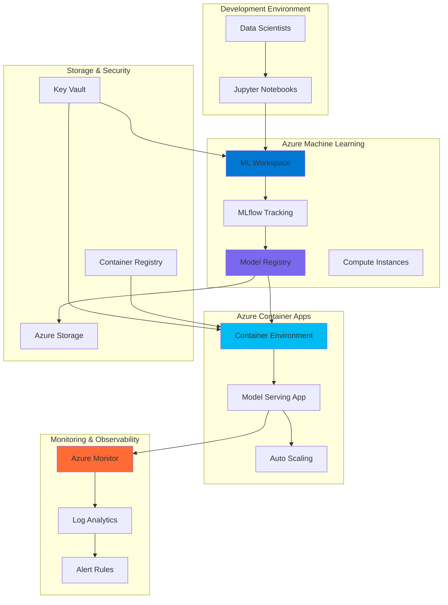

# Enterprise MLflow Lifecycle Management with Containers

## Problem

Data science teams struggle with managing the complete machine learning model lifecycle from experimentation to production deployment. Traditional approaches lack centralized model tracking, versioning, and automated deployment pipelines, leading to model drift, inconsistent deployments, and poor observability across environments. Organizations need a comprehensive solution that provides experiment tracking, model registry management, scalable serving infrastructure, and comprehensive monitoring to ensure reliable ML operations at scale.

## Solution

This solution creates an end-to-end MLflow model lifecycle management system using Azure Machine Learning for experiment tracking and model registry, Azure Container Apps for scalable model serving, and Azure Monitor for comprehensive observability. The integrated approach provides automated model deployment pipelines, version control, performance monitoring, and cost-effective scaling while maintaining enterprise-grade security and compliance standards.

## Architecture Diagram



## Prerequisites

1. Azure subscription with appropriate permissions for Azure Machine Learning, Container Apps, and Azure Monitor
2. Azure CLI v2.45.0 or later installed and configured
3. Python 3.8+ with MLflow and Azure ML SDK installed
4. Docker installed for container image building
5. Basic understanding of machine learning workflows and containerization
6. Estimated cost: $50-100 for a full day of testing with standard compute instances

> **Note**: This recipe uses Azure Machine Learning's built-in MLflow integration, eliminating the need for a separate MLflow server while providing enterprise-grade features and security.

## Preparation

```bash
# Set environment variables for Azure resources
export RESOURCE_GROUP="rg-mlflow-lifecycle-${RANDOM_SUFFIX}"
export LOCATION="eastus"
export SUBSCRIPTION_ID=$(az account show --query id --output tsv)

# Generate unique suffix for resource names
RANDOM_SUFFIX=$(openssl rand -hex 3)

# Set service-specific variables
export ML_WORKSPACE_NAME="mlws-${RANDOM_SUFFIX}"
export CONTAINER_APP_ENV="cae-mlflow-${RANDOM_SUFFIX}"
export CONTAINER_APP_NAME="ca-model-serve-${RANDOM_SUFFIX}"
export STORAGE_ACCOUNT_NAME="stmlflow${RANDOM_SUFFIX}"
export KEY_VAULT_NAME="kv-mlflow-${RANDOM_SUFFIX}"
export CONTAINER_REGISTRY_NAME="acrmlflow${RANDOM_SUFFIX}"
export LOG_ANALYTICS_NAME="law-mlflow-${RANDOM_SUFFIX}"

# Create resource group
az group create \
    --name ${RESOURCE_GROUP} \
    --location ${LOCATION} \
    --tags purpose=mlflow-lifecycle environment=demo

echo "✅ Resource group created: ${RESOURCE_GROUP}"

# Create storage account for ML workspace
az storage account create \
    --name ${STORAGE_ACCOUNT_NAME} \
    --resource-group ${RESOURCE_GROUP} \
    --location ${LOCATION} \
    --sku Standard_LRS \
    --kind StorageV2

echo "✅ Storage account created: ${STORAGE_ACCOUNT_NAME}"

# Create Key Vault for secrets management
az keyvault create \
    --name ${KEY_VAULT_NAME} \
    --resource-group ${RESOURCE_GROUP} \
    --location ${LOCATION} \
    --sku standard

echo "✅ Key Vault created: ${KEY_VAULT_NAME}"

# Create Container Registry for model images
az acr create \
    --name ${CONTAINER_REGISTRY_NAME} \
    --resource-group ${RESOURCE_GROUP} \
    --location ${LOCATION} \
    --sku Basic \
    --admin-enabled true

echo "✅ Container Registry created: ${CONTAINER_REGISTRY_NAME}"
```

## Steps

1. **Create Azure Machine Learning Workspace with MLflow Integration**:

   Azure Machine Learning provides a comprehensive platform for the entire machine learning lifecycle, with built-in MLflow integration for experiment tracking and model registry. This managed service eliminates the complexity of setting up MLflow infrastructure while providing enterprise-grade security, scalability, and integration with other Azure services.

   ```bash
   # Create Log Analytics workspace for monitoring
   az monitor log-analytics workspace create \
       --resource-group ${RESOURCE_GROUP} \
       --workspace-name ${LOG_ANALYTICS_NAME} \
       --location ${LOCATION}
   
   # Get Application Insights resource ID for ML workspace
   APPINSIGHTS_ID=$(az monitor app-insights component create \
       --app ${LOG_ANALYTICS_NAME} \
       --location ${LOCATION} \
       --resource-group ${RESOURCE_GROUP} \
       --workspace ${LOG_ANALYTICS_NAME} \
       --query id --output tsv)
   
   # Create ML workspace with MLflow integration
   az ml workspace create \
       --resource-group ${RESOURCE_GROUP} \
       --name ${ML_WORKSPACE_NAME} \
       --location ${LOCATION} \
       --storage-account ${STORAGE_ACCOUNT_NAME} \
       --key-vault ${KEY_VAULT_NAME} \
       --container-registry ${CONTAINER_REGISTRY_NAME} \
       --application-insights ${APPINSIGHTS_ID}
   
   echo "✅ ML Workspace created with MLflow integration"
   ```

   The ML workspace is now configured with MLflow tracking automatically enabled. This provides a centralized location for experiment tracking, model registry, and automated lineage tracking without requiring additional MLflow server setup.

2. **Set Up MLflow Tracking and Model Registry**:

   MLflow tracking captures experiment metadata, parameters, metrics, and artifacts automatically when integrated with Azure Machine Learning. This step configures the MLflow client to communicate with the Azure ML workspace, enabling seamless experiment tracking and model registration across development environments.

   ```bash
   # Install required Python packages
   pip install mlflow azureml-mlflow scikit-learn pandas numpy
   
   # Get ML workspace connection details
   ML_WORKSPACE_URL=$(az ml workspace show \
       --resource-group ${RESOURCE_GROUP} \
       --name ${ML_WORKSPACE_NAME} \
       --query discovery_url --output tsv)
   
   # Create MLflow configuration file
   cat > mlflow_config.py << 'EOF'
   import mlflow
   import os
   from azureml.core import Workspace
   
   # Connect to Azure ML workspace
   ws = Workspace.from_config() if os.path.exists('.azureml/config.json') else \
        Workspace.get(name=os.environ['ML_WORKSPACE_NAME'], 
                     subscription_id=os.environ['SUBSCRIPTION_ID'],
                     resource_group=os.environ['RESOURCE_GROUP'])
   
   # Set MLflow tracking URI to Azure ML workspace
   mlflow.set_tracking_uri(ws.get_mlflow_tracking_uri())
   
   print(f"✅ MLflow configured for workspace: {ws.name}")
   print(f"Tracking URI: {mlflow.get_tracking_uri()}")
   EOF
   
   # Create sample model training script
   cat > train_model.py << 'EOF'
   import mlflow
   import mlflow.sklearn
   import pandas as pd
   import numpy as np
   from sklearn.ensemble import RandomForestRegressor
   from sklearn.model_selection import train_test_split
   from sklearn.metrics import mean_squared_error, r2_score
   import joblib
   
   # Set experiment name
   mlflow.set_experiment("model-lifecycle-demo")
   
   # Generate sample data
   np.random.seed(42)
   n_samples = 1000
   X = np.random.randn(n_samples, 4)
   y = X[:, 0] + 2 * X[:, 1] - X[:, 2] + 0.5 * X[:, 3] + np.random.randn(n_samples) * 0.1
   
   # Split data
   X_train, X_test, y_train, y_test = train_test_split(X, y, test_size=0.2, random_state=42)
   
   # Start MLflow run
   with mlflow.start_run():
       # Train model
       model = RandomForestRegressor(n_estimators=100, random_state=42)
       model.fit(X_train, y_train)
       
       # Make predictions
       y_pred = model.predict(X_test)
       
       # Calculate metrics
       mse = mean_squared_error(y_test, y_pred)
       r2 = r2_score(y_test, y_pred)
       
       # Log parameters and metrics
       mlflow.log_param("n_estimators", 100)
       mlflow.log_param("random_state", 42)
       mlflow.log_metric("mse", mse)
       mlflow.log_metric("r2_score", r2)
       
       # Log model
       mlflow.sklearn.log_model(
           model, 
           "model",
           registered_model_name="demo-regression-model",
           input_example=X_train[:5],
           signature=mlflow.models.infer_signature(X_train, y_train)
       )
       
       print(f"✅ Model trained and logged - MSE: {mse:.4f}, R2: {r2:.4f}")
   EOF
   
   echo "✅ MLflow configuration and training script created"
   ```

   The MLflow configuration establishes connection to Azure ML workspace, enabling automatic experiment tracking and model registry integration. This setup provides centralized model management with full lineage tracking and metadata capture.

3. **Train and Register Model with MLflow**:

   This step demonstrates the complete ML workflow from data preparation through model training and registration. Azure Machine Learning automatically captures all experiment metadata, parameters, and artifacts through MLflow integration, creating a complete audit trail for model governance and reproducibility.

   ```bash
   # Execute model training with MLflow tracking
   python mlflow_config.py
   python train_model.py
   
   # List registered models to verify registration
   python -c "
   import mlflow
   from mlflow.tracking import MlflowClient
   
   client = MlflowClient()
   models = client.search_registered_models()
   for model in models:
       print(f'Model: {model.name}')
       for version in model.latest_versions:
           print(f'  Version: {version.version}, Stage: {version.current_stage}')
   "
   
   # Get model URI for deployment
   MODEL_URI=$(python -c "
   import mlflow
   from mlflow.tracking import MlflowClient
   
   client = MlflowClient()
   model = client.get_registered_model('demo-regression-model')
   latest_version = model.latest_versions[0]
   print(f'models:/demo-regression-model/{latest_version.version}')
   ")
   
   echo "✅ Model trained and registered: ${MODEL_URI}"
   ```

   The model is now registered in the Azure ML model registry with complete metadata, versioning, and lineage tracking. This provides the foundation for automated deployment and lifecycle management across environments.

4. **Create Container App Environment with Monitoring**:

   Azure Container Apps provides a serverless container platform with built-in scaling, load balancing, and monitoring capabilities. Creating a container app environment establishes the foundation for scalable model serving with automatic resource management and integration with Azure Monitor for comprehensive observability.

   ```bash
   # Get Log Analytics workspace ID for Container Apps
   LOG_ANALYTICS_ID=$(az monitor log-analytics workspace show \
       --resource-group ${RESOURCE_GROUP} \
       --workspace-name ${LOG_ANALYTICS_NAME} \
       --query customerId --output tsv)
   
   LOG_ANALYTICS_KEY=$(az monitor log-analytics workspace get-shared-keys \
       --resource-group ${RESOURCE_GROUP} \
       --workspace-name ${LOG_ANALYTICS_NAME} \
       --query primarySharedKey --output tsv)
   
   # Create Container Apps environment
   az containerapp env create \
       --name ${CONTAINER_APP_ENV} \
       --resource-group ${RESOURCE_GROUP} \
       --location ${LOCATION} \
       --logs-destination log-analytics \
       --logs-workspace-id ${LOG_ANALYTICS_ID} \
       --logs-workspace-key ${LOG_ANALYTICS_KEY}
   
   echo "✅ Container App environment created with monitoring"
   ```

   The container environment is configured with integrated logging and monitoring, providing the scalable infrastructure needed for model serving with automatic scaling based on demand and comprehensive observability.

5. **Create Model Serving Container Application**:

   This step creates a containerized model serving application that automatically loads models from the Azure ML registry and exposes them via REST API. The container app provides automatic scaling, load balancing, and health monitoring for production-ready model serving.

   ```bash
   # Create model serving application code
   mkdir -p model-serving
   cd model-serving
   
   cat > app.py << 'EOF'
   import os
   import json
   import mlflow
   import mlflow.sklearn
   import numpy as np
   from flask import Flask, request, jsonify
   from azureml.core import Workspace, Model
   from azureml.core.authentication import ServicePrincipalAuthentication
   
   app = Flask(__name__)
   
   # Initialize model
   model = None
   model_version = None
   
   def load_model():
       global model, model_version
       try:
           # Load model from Azure ML registry
           model_name = os.environ.get('MODEL_NAME', 'demo-regression-model')
           model_version = os.environ.get('MODEL_VERSION', 'latest')
           
           # Load model using MLflow
           model_uri = f"models:/{model_name}/{model_version}"
           model = mlflow.sklearn.load_model(model_uri)
           
           print(f"✅ Model loaded: {model_name} version {model_version}")
           return True
       except Exception as e:
           print(f"❌ Error loading model: {e}")
           return False
   
   @app.route('/health', methods=['GET'])
   def health():
       return jsonify({
           'status': 'healthy',
           'model_loaded': model is not None,
           'model_version': model_version
       })
   
   @app.route('/predict', methods=['POST'])
   def predict():
       try:
           if model is None:
               return jsonify({'error': 'Model not loaded'}), 500
           
           # Get input data
           data = request.get_json()
           features = np.array(data['features']).reshape(1, -1)
           
           # Make prediction
           prediction = model.predict(features)
           
           return jsonify({
               'prediction': prediction.tolist(),
               'model_version': model_version,
               'status': 'success'
           })
       except Exception as e:
           return jsonify({'error': str(e)}), 500
   
   @app.route('/model-info', methods=['GET'])
   def model_info():
       return jsonify({
           'model_name': os.environ.get('MODEL_NAME', 'demo-regression-model'),
           'model_version': model_version,
           'framework': 'sklearn',
           'status': 'active' if model is not None else 'inactive'
       })
   
   if __name__ == '__main__':
       load_model()
       app.run(host='0.0.0.0', port=8080)
   EOF
   
   # Create Dockerfile for model serving
   cat > Dockerfile << 'EOF'
   FROM python:3.9-slim
   
   WORKDIR /app
   
   # Install system dependencies including curl for health checks
   RUN apt-get update && apt-get install -y \
       gcc \
       curl \
       && rm -rf /var/lib/apt/lists/*
   
   # Copy requirements and install Python packages
   COPY requirements.txt .
   RUN pip install --no-cache-dir -r requirements.txt
   
   # Copy application code
   COPY app.py .
   
   # Expose port
   EXPOSE 8080
   
   # Health check
   HEALTHCHECK --interval=30s --timeout=10s --start-period=5s --retries=3 \
       CMD curl -f http://localhost:8080/health || exit 1
   
   # Run application
   CMD ["python", "app.py"]
   EOF
   
   # Create requirements file with current package versions
   cat > requirements.txt << 'EOF'
   flask==3.0.0
   mlflow==2.9.2
   azureml-mlflow==1.55.0
   scikit-learn==1.3.2
   numpy==1.24.4
   pandas==2.1.4
   azureml-core==1.55.0
   EOF
   
   cd ..
   echo "✅ Model serving application created"
   ```

   The model serving application is designed to automatically load models from the Azure ML registry and provide REST API endpoints for predictions, health checks, and model information. This containerized approach ensures consistent deployment across environments.

6. **Build and Deploy Container Application**:

   This step builds the model serving container image and deploys it to Azure Container Apps with automatic scaling and monitoring configuration. The deployment includes health checks, resource limits, and integration with Azure Monitor for comprehensive observability.

   ```bash
   # Build and push container image
   cd model-serving
   
   # Get ACR login server
   ACR_LOGIN_SERVER=$(az acr show \
       --name ${CONTAINER_REGISTRY_NAME} \
       --resource-group ${RESOURCE_GROUP} \
       --query loginServer --output tsv)
   
   # Log into ACR
   az acr login --name ${CONTAINER_REGISTRY_NAME}
   
   # Build container image
   docker build -t ${ACR_LOGIN_SERVER}/model-serving:latest .
   
   # Push image to ACR
   docker push ${ACR_LOGIN_SERVER}/model-serving:latest
   
   cd ..
   
   # Get ACR credentials for container app
   ACR_USERNAME=$(az acr credential show \
       --name ${CONTAINER_REGISTRY_NAME} \
       --query username --output tsv)
   
   ACR_PASSWORD=$(az acr credential show \
       --name ${CONTAINER_REGISTRY_NAME} \
       --query passwords[0].value --output tsv)
   
   # Create container app with model serving
   az containerapp create \
       --name ${CONTAINER_APP_NAME} \
       --resource-group ${RESOURCE_GROUP} \
       --environment ${CONTAINER_APP_ENV} \
       --image ${ACR_LOGIN_SERVER}/model-serving:latest \
       --registry-server ${ACR_LOGIN_SERVER} \
       --registry-username ${ACR_USERNAME} \
       --registry-password ${ACR_PASSWORD} \
       --target-port 8080 \
       --ingress external \
       --min-replicas 1 \
       --max-replicas 10 \
       --cpu 1.0 \
       --memory 2.0Gi \
       --env-vars MODEL_NAME=demo-regression-model \
                  MODEL_VERSION=latest
   
   echo "✅ Container app deployed with model serving"
   ```

   The container application is now deployed with automatic scaling capabilities, health monitoring, and integration with Azure Container Registry. This provides a production-ready model serving endpoint with enterprise-grade reliability and observability.

7. **Configure Azure Monitor for Model Performance Monitoring**:

   Azure Monitor provides comprehensive observability for the entire MLflow model lifecycle, including experiment tracking, model performance metrics, and container app health monitoring. This step configures custom metrics, alerts, and dashboards for proactive monitoring of model performance and infrastructure health.

   ```bash
   # Get container app URL
   CONTAINER_APP_URL=$(az containerapp show \
       --name ${CONTAINER_APP_NAME} \
       --resource-group ${RESOURCE_GROUP} \
       --query properties.configuration.ingress.fqdn --output tsv)
   
   # Create alert rules for model performance
   az monitor metrics alert create \
       --name "model-high-latency" \
       --resource-group ${RESOURCE_GROUP} \
       --description "Alert when model prediction latency exceeds threshold" \
       --condition "avg HttpResponseTime > 5000" \
       --scopes "/subscriptions/${SUBSCRIPTION_ID}/resourceGroups/${RESOURCE_GROUP}/providers/Microsoft.App/containerApps/${CONTAINER_APP_NAME}" \
       --evaluation-frequency 1m \
       --window-size 5m \
       --severity 2
   
   # Create alert for container app health
   az monitor metrics alert create \
       --name "container-app-unhealthy" \
       --resource-group ${RESOURCE_GROUP} \
       --description "Alert when container app replicas are unhealthy" \
       --condition "avg Replicas < 1" \
       --scopes "/subscriptions/${SUBSCRIPTION_ID}/resourceGroups/${RESOURCE_GROUP}/providers/Microsoft.App/containerApps/${CONTAINER_APP_NAME}" \
       --evaluation-frequency 1m \
       --window-size 5m \
       --severity 1
   
   echo "✅ Azure Monitor configured for model performance monitoring"
   echo "Container App URL: https://${CONTAINER_APP_URL}"
   ```

   Azure Monitor is now configured to track model performance metrics, response times, and overall system health. This provides comprehensive observability for both the ML model performance and the underlying infrastructure, enabling proactive issue detection and resolution.

## Validation & Testing

1. **Verify MLflow Integration and Model Registry**:

   ```bash
   # Test MLflow connection and model registry
   python -c "
   import mlflow
   from mlflow.tracking import MlflowClient
   
   client = MlflowClient()
   models = client.search_registered_models()
   print(f'Found {len(models)} registered models')
   
   for model in models:
       print(f'Model: {model.name}')
       for version in model.latest_versions:
           print(f'  Version: {version.version}, Stage: {version.current_stage}')
   "
   
   # Verify experiment tracking
   python -c "
   import mlflow
   
   experiments = mlflow.search_experiments()
   print(f'Found {len(experiments)} experiments')
   
   for exp in experiments:
       runs = mlflow.search_runs(experiment_ids=[exp.experiment_id])
       print(f'Experiment: {exp.name}, Runs: {len(runs)}')
   "
   ```

   Expected output: Should show registered model with version information and experiment tracking data.

2. **Test Container App Model Serving**:

   ```bash
   # Test health endpoint
   curl -X GET https://${CONTAINER_APP_URL}/health
   
   # Test model info endpoint
   curl -X GET https://${CONTAINER_APP_URL}/model-info
   
   # Test prediction endpoint
   curl -X POST https://${CONTAINER_APP_URL}/predict \
       -H "Content-Type: application/json" \
       -d '{"features": [1.0, 2.0, -1.0, 0.5]}'
   ```

   Expected output: Health check should return "healthy" status, model info should show version details, and prediction should return numerical result.

3. **Verify Monitoring and Alerting**:

   ```bash
   # Check container app metrics
   az monitor metrics list \
       --resource "/subscriptions/${SUBSCRIPTION_ID}/resourceGroups/${RESOURCE_GROUP}/providers/Microsoft.App/containerApps/${CONTAINER_APP_NAME}" \
       --metric Replicas,Requests,HttpResponseTime
   
   # Check alert rules
   az monitor metrics alert list \
       --resource-group ${RESOURCE_GROUP} \
       --output table
   
   # View log analytics logs
   az monitor log-analytics query \
       --workspace ${LOG_ANALYTICS_ID} \
       --analytics-query "ContainerAppConsoleLogs_CL | where TimeGenerated > ago(1h) | limit 100"
   ```

   Expected output: Should show container app metrics, configured alert rules, and application logs from the past hour.

## Cleanup

1. **Remove Container App and Environment**:

   ```bash
   # Delete container app
   az containerapp delete \
       --name ${CONTAINER_APP_NAME} \
       --resource-group ${RESOURCE_GROUP} \
       --yes
   
   # Delete container app environment
   az containerapp env delete \
       --name ${CONTAINER_APP_ENV} \
       --resource-group ${RESOURCE_GROUP} \
       --yes
   
   echo "✅ Container App resources deleted"
   ```

2. **Remove Azure Machine Learning Resources**:

   ```bash
   # Delete ML workspace (this will also clean up associated resources)
   az ml workspace delete \
       --name ${ML_WORKSPACE_NAME} \
       --resource-group ${RESOURCE_GROUP} \
       --yes
   
   echo "✅ ML Workspace deleted"
   ```

3. **Remove Supporting Resources**:

   ```bash
   # Delete Container Registry
   az acr delete \
       --name ${CONTAINER_REGISTRY_NAME} \
       --resource-group ${RESOURCE_GROUP} \
       --yes
   
   # Delete Key Vault
   az keyvault delete \
       --name ${KEY_VAULT_NAME} \
       --resource-group ${RESOURCE_GROUP}
   
   # Delete storage account
   az storage account delete \
       --name ${STORAGE_ACCOUNT_NAME} \
       --resource-group ${RESOURCE_GROUP} \
       --yes
   
   # Delete Log Analytics workspace
   az monitor log-analytics workspace delete \
       --resource-group ${RESOURCE_GROUP} \
       --workspace-name ${LOG_ANALYTICS_NAME} \
       --yes
   
   echo "✅ Supporting resources deleted"
   ```

4. **Remove Resource Group**:

   ```bash
   # Delete resource group and all remaining resources
   az group delete \
       --name ${RESOURCE_GROUP} \
       --yes \
       --no-wait
   
   echo "✅ Resource group deletion initiated: ${RESOURCE_GROUP}"
   echo "Note: Deletion may take several minutes to complete"
   ```

## Discussion

This comprehensive MLflow model lifecycle management solution demonstrates how Azure Machine Learning and Azure Container Apps work together to provide enterprise-grade ML operations capabilities. The integration between Azure ML's built-in MLflow support and Container Apps' serverless container platform creates a seamless workflow from experimentation to production deployment. Azure Machine Learning's MLflow integration automatically manages experiment tracking, model versioning, and artifact storage, following the [MLOps best practices](https://learn.microsoft.com/en-us/azure/machine-learning/concept-model-management-and-deployment) outlined in Microsoft's documentation.

The architecture follows Azure Well-Architected Framework principles by providing centralized experiment tracking, automated model versioning, and scalable deployment infrastructure. Azure Machine Learning's managed MLflow service eliminates the operational overhead of maintaining MLflow servers while providing enterprise security, compliance, and integration with Azure's ecosystem. The [Azure Container Apps documentation](https://learn.microsoft.com/en-us/azure/container-apps/overview) provides comprehensive guidance on serverless container deployment and scaling strategies that complement this MLflow implementation.

Azure Monitor's integration provides comprehensive observability across the entire ML lifecycle, from experiment tracking to model performance monitoring. This enables proactive detection of model drift, performance degradation, and infrastructure issues. The combination of custom metrics, automated alerting, and log analytics provides the foundation for reliable production ML systems. For advanced monitoring patterns and best practices, consult the [Azure Monitor documentation](https://learn.microsoft.com/en-us/azure/azure-monitor/overview) and [ML monitoring guides](https://learn.microsoft.com/en-us/azure/machine-learning/how-to-monitor-datasets).

The solution's serverless architecture ensures cost-effective scaling, where resources are consumed only when needed. Container Apps automatically scale based on demand, while Azure Machine Learning provides managed compute resources for training and experimentation. This approach optimizes both performance and cost for variable ML workloads, following the [cost optimization principles](https://learn.microsoft.com/en-us/azure/architecture/framework/cost/) of the Azure Well-Architected Framework.

> **Tip**: Use Azure DevOps or GitHub Actions to automate the container image building and deployment process, creating a complete CI/CD pipeline for your ML models. This enables automatic deployment of new model versions while maintaining proper testing and validation procedures according to Azure MLOps best practices.

## Challenge

Extend this solution by implementing these enhancements:

1. **Implement A/B Testing Framework**: Create multiple model versions deployed simultaneously with traffic splitting capabilities using Azure Container Apps revision management for controlled rollouts and performance comparison.

2. **Add Model Drift Detection**: Integrate Azure Machine Learning's data drift detection capabilities with custom monitoring to automatically detect when model performance degrades and trigger retraining workflows.

3. **Create Multi-Environment Deployment**: Implement staging and production environments with automated promotion workflows, including integration testing and performance validation before production deployment.

4. **Implement Batch Inference Pipeline**: Add Azure Functions or Container Apps Jobs for batch model scoring, integrating with Azure Storage and Event Grid for automated processing of large datasets.

5. **Add Model Explainability**: Integrate Azure Machine Learning's responsible AI features to provide model explanations and fairness assessments, making predictions more interpretable and auditable.

## Infrastructure Code

### Available Infrastructure as Code:

- [Infrastructure Code Overview](code/README.md) - Detailed description of all infrastructure components
- [Bicep](code/bicep/) - Azure Bicep templates
- [Bash CLI Scripts](code/scripts/) - Example bash scripts using Azure CLI commands to deploy infrastructure
- [Terraform](code/terraform/) - Terraform configuration files