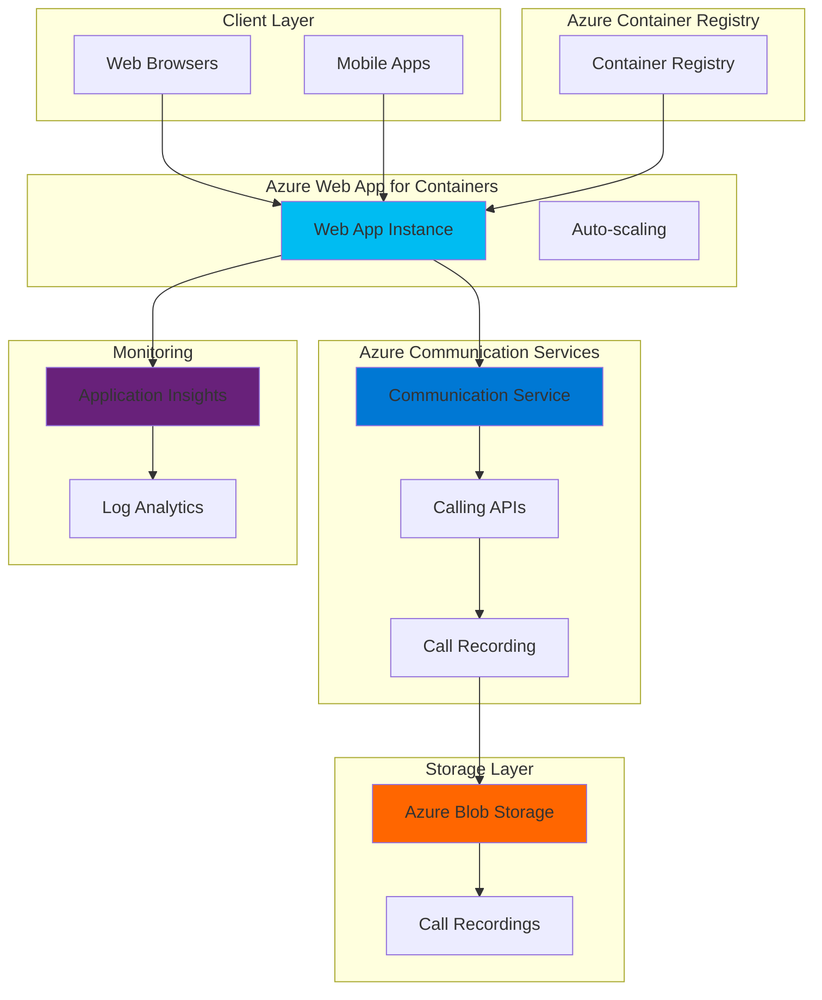

# Enterprise Video Conferencing with Container Deployment

## Problem

Organizations need to integrate video conferencing capabilities into their applications while maintaining control over user experience, call recording, and scalability. Traditional solutions require complex infrastructure management and limited customization options, preventing businesses from delivering branded, feature-rich conferencing experiences that scale automatically based on demand.

## Solution

Deploy a containerized web application using Azure Web App for Containers that integrates with Azure Communication Services for video conferencing capabilities. This architecture provides automatic scaling, call recording functionality, and persistent storage for recordings using Azure Blob Storage, enabling enterprise-grade video conferencing solutions.

## Architecture Diagram



## Prerequisites

1. Azure subscription with appropriate permissions to create Communication Services, Web Apps, and Storage accounts
2. Azure CLI v2.67.0 or higher installed and configured (or Azure Cloud Shell)
3. Docker installed locally for container development and testing
4. Basic knowledge of containerization, JavaScript/Node.js, and video conferencing concepts
5. Git for version control and deployment
6. Estimated cost: $15-50/month for development and testing (depends on usage and storage)

> **Note**: Azure Communication Services Call Recording provides short-term media storage for 24 hours. For production environments, implement automated processes to transfer recordings to long-term storage. Review the [Azure Communication Services pricing](https://docs.microsoft.com/en-us/azure/communication-services/concepts/pricing) for accurate cost estimates.

## Preparation

```bash
# Set environment variables for consistent resource naming
export RESOURCE_GROUP="rg-video-conferencing-app"
export LOCATION="eastus"
export SUBSCRIPTION_ID=$(az account show --query id --output tsv)

# Generate unique suffix for resource names
RANDOM_SUFFIX=$(openssl rand -hex 3)
export STORAGE_ACCOUNT="stvideoconf${RANDOM_SUFFIX}"
export COMMUNICATION_SERVICE="cs-video-conferencing-${RANDOM_SUFFIX}"
export WEBAPP_NAME="webapp-video-conferencing-${RANDOM_SUFFIX}"
export CONTAINER_REGISTRY="acrvideo${RANDOM_SUFFIX}"
export APP_SERVICE_PLAN="asp-video-conferencing-${RANDOM_SUFFIX}"

# Create resource group with appropriate tags
az group create \
    --name ${RESOURCE_GROUP} \
    --location ${LOCATION} \
    --tags purpose=video-conferencing environment=demo

echo "✅ Resource group created: ${RESOURCE_GROUP}"

# Install Communication Services extension if not already installed
az extension add --name communication
echo "✅ Communication Services extension installed"
```

## Steps

1. **Create Azure Container Registry for Application Images**:

   Azure Container Registry provides secure, private container image storage with built-in security scanning and geo-replication capabilities. This managed service eliminates the need for self-hosted registries while providing integration with Azure Web App for Containers for automated deployments.

   ```bash
   # Create container registry for storing application images
   az acr create \
       --resource-group ${RESOURCE_GROUP} \
       --name ${CONTAINER_REGISTRY} \
       --sku Basic \
       --admin-enabled true \
       --location ${LOCATION}
   
   # Get registry login server
   ACR_LOGIN_SERVER=$(az acr show \
       --name ${CONTAINER_REGISTRY} \
       --query loginServer --output tsv)
   
   echo "✅ Container registry created: ${ACR_LOGIN_SERVER}"
   ```

   The Container Registry is now ready to store your application images with admin access enabled for simplified authentication. This foundational component enables automated container deployment workflows and supports the CI/CD pipeline for your video conferencing application.

2. **Create Azure Communication Services Resource**:

   Azure Communication Services provides APIs for voice, video, chat, and SMS capabilities with global reach and enterprise-grade security. The service handles complex real-time media processing, enabling developers to focus on application logic rather than infrastructure management.

   ```bash
   # Create Communication Services resource
   az communication create \
       --name ${COMMUNICATION_SERVICE} \
       --resource-group ${RESOURCE_GROUP} \
       --location "Global" \
       --data-location "UnitedStates"
   
   # Get connection string for application configuration
   ACS_CONNECTION_STRING=$(az communication list-key \
       --name ${COMMUNICATION_SERVICE} \
       --resource-group ${RESOURCE_GROUP} \
       --query primaryConnectionString --output tsv)
   
   echo "✅ Communication Services resource created: ${COMMUNICATION_SERVICE}"
   ```

   The Communication Services resource provides the foundation for video calling, call recording, and user management features. This service automatically scales to handle varying call volumes and provides global connectivity with low latency.

3. **Create Azure Blob Storage for Call Recordings**:

   Azure Blob Storage provides scalable, cost-effective storage for call recordings with multiple access tiers and lifecycle management. This storage solution ensures recordings are securely stored and easily accessible for playback, compliance, and analytics purposes.

   ```bash
   # Create storage account for call recordings
   az storage account create \
       --name ${STORAGE_ACCOUNT} \
       --resource-group ${RESOURCE_GROUP} \
       --location ${LOCATION} \
       --sku Standard_LRS \
       --kind StorageV2 \
       --access-tier Hot
   
   # Create container for recordings
   az storage container create \
       --name recordings \
       --account-name ${STORAGE_ACCOUNT} \
       --public-access off
   
   # Get storage connection string
   STORAGE_CONNECTION_STRING=$(az storage account show-connection-string \
       --name ${STORAGE_ACCOUNT} \
       --resource-group ${RESOURCE_GROUP} \
       --query connectionString --output tsv)
   
   echo "✅ Storage account created: ${STORAGE_ACCOUNT}"
   ```

   The storage account provides secure, persistent storage for call recordings with private access controls. This setup ensures recordings are protected while remaining accessible to authorized application components for processing and playback.

4. **Create App Service Plan for Web App**:

   Azure App Service Plans define the computing resources and scaling capabilities for your web applications. Using a Linux-based plan enables container deployment with automatic scaling, built-in security features, and integrated monitoring capabilities.

   ```bash
   # Create Linux App Service Plan for containers
   az appservice plan create \
       --name ${APP_SERVICE_PLAN} \
       --resource-group ${RESOURCE_GROUP} \
       --location ${LOCATION} \
       --is-linux \
       --sku P1V2 \
       --number-of-workers 1
   
   echo "✅ App Service Plan created: ${APP_SERVICE_PLAN}"
   ```

   The App Service Plan provides the compute foundation for your containerized application with automatic scaling capabilities. This managed service handles infrastructure provisioning, load balancing, and health monitoring for your video conferencing application.

5. **Create Application Insights for Monitoring**:

   Application Insights provides comprehensive application performance monitoring, user analytics, and diagnostic capabilities. This service enables real-time monitoring of video conferencing sessions, performance optimization, and proactive issue detection.

   ```bash
   # Create Application Insights workspace
   az monitor app-insights component create \
       --app video-conferencing-insights \
       --location ${LOCATION} \
       --resource-group ${RESOURCE_GROUP} \
       --application-type web \
       --kind web
   
   # Get instrumentation key
   APPINSIGHTS_INSTRUMENTATION_KEY=$(az monitor app-insights component show \
       --app video-conferencing-insights \
       --resource-group ${RESOURCE_GROUP} \
       --query instrumentationKey --output tsv)
   
   echo "✅ Application Insights created with key: ${APPINSIGHTS_INSTRUMENTATION_KEY}"
   ```

   Application Insights provides real-time visibility into application performance, user behavior, and system health. This monitoring capability is essential for maintaining high-quality video conferencing experiences and identifying optimization opportunities.

6. **Create Sample Application Container**:

   A containerized Node.js application provides the foundation for integrating Azure Communication Services with your video conferencing interface. This approach enables consistent deployment across environments and simplified scaling management.

   ```bash
   # Create application directory structure
   mkdir -p video-conferencing-app/src
   cd video-conferencing-app
   
   # Create package.json
   cat > package.json << 'EOF'
   {
     "name": "video-conferencing-app",
     "version": "1.0.0",
     "description": "Scalable video conferencing with Azure Communication Services",
     "main": "src/server.js",
     "scripts": {
       "start": "node src/server.js",
       "dev": "nodemon src/server.js"
     },
     "dependencies": {
       "express": "^4.18.2",
       "@azure/communication-common": "^2.3.0",
       "@azure/communication-identity": "^1.3.0",
       "@azure/communication-calling": "^1.13.1",
       "@azure/storage-blob": "^12.17.0",
       "applicationinsights": "^2.9.1",
       "dotenv": "^16.3.1"
     },
     "engines": {
       "node": ">=18.0.0"
     }
   }
   EOF
   
   # Create main server file
   cat > src/server.js << 'EOF'
   const express = require('express');
   const { CommunicationIdentityClient } = require('@azure/communication-identity');
   const { BlobServiceClient } = require('@azure/storage-blob');
   const appInsights = require('applicationinsights');
   require('dotenv').config();
   
   // Initialize Application Insights
   appInsights.setup(process.env.APPINSIGHTS_INSTRUMENTATION_KEY);
   appInsights.start();
   
   const app = express();
   const port = process.env.PORT || 3000;
   
   // Initialize clients
   const identityClient = new CommunicationIdentityClient(process.env.ACS_CONNECTION_STRING);
   const blobServiceClient = BlobServiceClient.fromConnectionString(process.env.STORAGE_CONNECTION_STRING);
   
   app.use(express.json());
   app.use(express.static('public'));
   
   // Generate Communication Services access token
   app.post('/token', async (req, res) => {
     try {
       const user = await identityClient.createUser();
       const tokenResponse = await identityClient.getToken(user, ['voip']);
       res.json({
         token: tokenResponse.token,
         expiresOn: tokenResponse.expiresOn,
         user: user
       });
     } catch (error) {
       console.error('Token generation failed:', error);
       res.status(500).json({ error: 'Failed to generate token' });
     }
   });
   
   // Start call recording
   app.post('/start-recording', async (req, res) => {
     try {
       const { serverCallId } = req.body;
       // Call recording logic would be implemented here
       res.json({ success: true, recordingId: 'sample-recording-id' });
     } catch (error) {
       console.error('Recording start failed:', error);
       res.status(500).json({ error: 'Failed to start recording' });
     }
   });
   
   // Health check endpoint
   app.get('/health', (req, res) => {
     res.json({ status: 'healthy', timestamp: new Date().toISOString() });
   });
   
   app.listen(port, () => {
     console.log(`Video conferencing app listening on port ${port}`);
   });
   EOF
   
   # Create public directory for client-side files
   mkdir -p public
   cat > public/index.html << 'EOF'
   <!DOCTYPE html>
   <html>
   <head>
     <title>Video Conferencing App</title>
     <script src="https://skype.azureedge.net/sdk/calling/1.13.1/calling.js"></script>
   </head>
   <body>
     <h1>Azure Communication Services Video Conferencing</h1>
     <div id="call-container">
       <button id="start-call">Start Call</button>
       <button id="end-call">End Call</button>
       <button id="start-recording">Start Recording</button>
       <div id="video-container"></div>
     </div>
     <script>
       // Video conferencing client logic would be implemented here
       console.log('Video conferencing application loaded');
     </script>
   </body>
   </html>
   EOF
   
   echo "✅ Application structure created"
   ```

   The application provides a foundation for video conferencing with token generation, call recording integration, and health monitoring. This containerized approach ensures consistent deployment and easy scaling across different environments.

7. **Create Dockerfile for Container Deployment**:

   A well-structured Dockerfile enables consistent, reproducible deployments across different environments. The multi-stage build process optimizes image size while including all necessary dependencies for production deployment.

   ```bash
   # Create Dockerfile for containerization
   cat > Dockerfile << 'EOF'
   FROM node:18-alpine AS build
   
   # Set working directory
   WORKDIR /app
   
   # Copy package files
   COPY package*.json ./
   
   # Install dependencies
   RUN npm ci --only=production
   
   # Copy application files
   COPY . .
   
   # Create production image
   FROM node:18-alpine
   
   # Install dumb-init for proper signal handling
   RUN apk add --no-cache dumb-init
   
   # Create non-root user
   RUN addgroup -g 1001 -S nodejs
   RUN adduser -S nodejs -u 1001
   
   # Set working directory
   WORKDIR /app
   
   # Copy application and dependencies
   COPY --from=build --chown=nodejs:nodejs /app .
   
   # Switch to non-root user
   USER nodejs
   
   # Expose port
   EXPOSE 3000
   
   # Health check
   HEALTHCHECK --interval=30s --timeout=10s --start-period=5s --retries=3 \
     CMD node -e "require('http').get('http://localhost:3000/health', (res) => { process.exit(res.statusCode === 200 ? 0 : 1) })"
   
   # Start application
   ENTRYPOINT ["dumb-init", "--"]
   CMD ["node", "src/server.js"]
   EOF
   
   # Create .dockerignore file
   cat > .dockerignore << 'EOF'
   node_modules
   .git
   .gitignore
   README.md
   .env
   .nyc_output
   coverage
   .vscode
   EOF
   
   echo "✅ Dockerfile created with security best practices"
   ```

   The Dockerfile implements security best practices including non-root user execution, multi-stage builds, and health checks. This approach ensures optimal performance and security for production deployments.

8. **Build and Push Container to Registry**:

   Building and pushing the container image to Azure Container Registry enables automated deployment workflows. This process creates a versioned, scannable image that can be deployed consistently across environments.

   ```bash
   # Build container image
   docker build -t ${ACR_LOGIN_SERVER}/video-conferencing-app:latest .
   
   # Login to Azure Container Registry
   az acr login --name ${CONTAINER_REGISTRY}
   
   # Push image to registry
   docker push ${ACR_LOGIN_SERVER}/video-conferencing-app:latest
   
   echo "✅ Container image pushed to registry"
   cd ..
   ```

   The container image is now stored in Azure Container Registry with security scanning enabled. This centralized image management enables automated deployments and ensures consistent application versions across environments.

9. **Deploy Web App for Containers**:

   Azure Web App for Containers provides a fully managed platform for deploying containerized applications with automatic scaling, load balancing, and integrated monitoring. This service eliminates infrastructure management while providing enterprise-grade capabilities.

   ```bash
   # Create Web App for Containers
   az webapp create \
       --resource-group ${RESOURCE_GROUP} \
       --plan ${APP_SERVICE_PLAN} \
       --name ${WEBAPP_NAME} \
       --deployment-container-image-name ${ACR_LOGIN_SERVER}/video-conferencing-app:latest
   
   # Configure container registry credentials
   az webapp config container set \
       --name ${WEBAPP_NAME} \
       --resource-group ${RESOURCE_GROUP} \
       --container-image-name ${ACR_LOGIN_SERVER}/video-conferencing-app:latest \
       --container-registry-url https://${ACR_LOGIN_SERVER} \
       --container-registry-user ${CONTAINER_REGISTRY} \
       --container-registry-password $(az acr credential show --name ${CONTAINER_REGISTRY} --query passwords[0].value --output tsv)
   
   echo "✅ Web App for Containers deployed: ${WEBAPP_NAME}"
   ```

   The Web App for Containers is now configured with automatic container deployment from your registry. This setup enables continuous deployment workflows and provides scalable hosting for your video conferencing application.

10. **Configure Application Settings**:

    Application settings provide secure configuration management for connection strings, API keys, and environment-specific variables. These settings are encrypted at rest and available as environment variables to your application.

    ```bash
    # Configure application settings
    az webapp config appsettings set \
        --resource-group ${RESOURCE_GROUP} \
        --name ${WEBAPP_NAME} \
        --settings \
        ACS_CONNECTION_STRING="${ACS_CONNECTION_STRING}" \
        STORAGE_CONNECTION_STRING="${STORAGE_CONNECTION_STRING}" \
        APPINSIGHTS_INSTRUMENTATION_KEY="${APPINSIGHTS_INSTRUMENTATION_KEY}" \
        NODE_ENV="production"
    
    # Enable container logging
    az webapp log config \
        --resource-group ${RESOURCE_GROUP} \
        --name ${WEBAPP_NAME} \
        --docker-container-logging filesystem
    
    # Get application URL
    WEBAPP_URL=$(az webapp show \
        --resource-group ${RESOURCE_GROUP} \
        --name ${WEBAPP_NAME} \
        --query defaultHostName --output tsv)
    
    echo "✅ Application configured and available at: https://${WEBAPP_URL}"
    ```

    The application is now configured with secure access to Azure Communication Services and storage resources. Application logging is enabled for monitoring and troubleshooting production deployments.

11. **Configure Auto-scaling Rules**:

    Auto-scaling ensures your video conferencing application can handle varying loads efficiently while optimizing costs. These rules automatically adjust capacity based on CPU usage, memory consumption, and custom metrics.

    ```bash
    # Create auto-scaling profile
    az monitor autoscale create \
        --resource-group ${RESOURCE_GROUP} \
        --resource "/subscriptions/${SUBSCRIPTION_ID}/resourceGroups/${RESOURCE_GROUP}/providers/Microsoft.Web/serverfarms/${APP_SERVICE_PLAN}" \
        --name "video-conferencing-autoscale" \
        --min-count 1 \
        --max-count 10 \
        --count 2
    
    # Add CPU-based scaling rule (scale out)
    az monitor autoscale rule create \
        --resource-group ${RESOURCE_GROUP} \
        --autoscale-name "video-conferencing-autoscale" \
        --condition "Percentage CPU > 70 avg 5m" \
        --scale out 1
    
    # Add CPU-based scaling rule (scale in)
    az monitor autoscale rule create \
        --resource-group ${RESOURCE_GROUP} \
        --autoscale-name "video-conferencing-autoscale" \
        --condition "Percentage CPU < 30 avg 5m" \
        --scale in 1
    
    echo "✅ Auto-scaling rules configured"
    ```

    Auto-scaling is now configured to maintain optimal performance during peak usage while reducing costs during low-activity periods. These rules ensure your video conferencing application can handle sudden increases in concurrent users.

## Validation & Testing

1. **Verify Web Application Deployment**:

   ```bash
   # Check application health
   curl -f https://${WEBAPP_URL}/health
   
   # Expected output: {"status":"healthy","timestamp":"2025-07-12T..."}
   ```

2. **Test Communication Services Integration**:

   ```bash
   # Test token generation endpoint
   curl -X POST https://${WEBAPP_URL}/token \
       -H "Content-Type: application/json"
   
   # Expected output: {"token":"...", "expiresOn":"...", "user":"..."}
   ```

3. **Verify Container Registry Integration**:

   ```bash
   # Check container deployment status
   az webapp config container show \
       --name ${WEBAPP_NAME} \
       --resource-group ${RESOURCE_GROUP}
   
   # Verify auto-scaling configuration
   az monitor autoscale show \
       --resource-group ${RESOURCE_GROUP} \
       --name "video-conferencing-autoscale"
   ```

4. **Test Application Insights Monitoring**:

   ```bash
   # Check Application Insights telemetry
   az monitor app-insights component show \
       --app video-conferencing-insights \
       --resource-group ${RESOURCE_GROUP} \
       --query "instrumentationKey"
   ```

## Cleanup

1. **Remove Auto-scaling Configuration**:

   ```bash
   # Delete auto-scaling rules
   az monitor autoscale delete \
       --resource-group ${RESOURCE_GROUP} \
       --name "video-conferencing-autoscale"
   
   echo "✅ Auto-scaling configuration removed"
   ```

2. **Delete Web App and App Service Plan**:

   ```bash
   # Delete Web App
   az webapp delete \
       --name ${WEBAPP_NAME} \
       --resource-group ${RESOURCE_GROUP}
   
   # Delete App Service Plan
   az appservice plan delete \
       --name ${APP_SERVICE_PLAN} \
       --resource-group ${RESOURCE_GROUP} \
       --yes
   
   echo "✅ Web App and App Service Plan deleted"
   ```

3. **Remove Container Registry**:

   ```bash
   # Delete Container Registry
   az acr delete \
       --name ${CONTAINER_REGISTRY} \
       --resource-group ${RESOURCE_GROUP} \
       --yes
   
   echo "✅ Container Registry deleted"
   ```

4. **Delete Storage and Communication Services**:

   ```bash
   # Delete Storage Account
   az storage account delete \
       --name ${STORAGE_ACCOUNT} \
       --resource-group ${RESOURCE_GROUP} \
       --yes
   
   # Delete Communication Services
   az communication delete \
       --name ${COMMUNICATION_SERVICE} \
       --resource-group ${RESOURCE_GROUP} \
       --yes
   
   echo "✅ Storage and Communication Services deleted"
   ```

5. **Remove Resource Group**:

   ```bash
   # Delete entire resource group
   az group delete \
       --name ${RESOURCE_GROUP} \
       --yes \
       --no-wait
   
   echo "✅ Resource group deletion initiated"
   ```

## Discussion

Azure Web App for Containers combined with Azure Communication Services provides a powerful platform for building scalable video conferencing applications. This architecture leverages the benefits of containerization while utilizing Azure's managed services for real-time communication capabilities. The solution automatically scales based on demand and provides integrated monitoring through Application Insights.

The containerized approach offers several advantages including consistent deployment across environments, simplified dependency management, and enhanced security through isolation. Azure Web App for Containers handles the underlying infrastructure while providing features like auto-scaling, load balancing, and integrated monitoring. For comprehensive container deployment strategies, refer to the [Azure App Service documentation](https://docs.microsoft.com/en-us/azure/app-service/containers/) and [container best practices guide](https://docs.microsoft.com/en-us/azure/app-service/configure-custom-container).

Azure Communication Services provides enterprise-grade video calling capabilities with global reach and low latency. The service includes call recording functionality that automatically stores recordings for 24 hours, enabling businesses to implement compliance and training scenarios. The Call Recording APIs support both mixed and unmixed audio/video formats, allowing for flexible post-processing workflows. For detailed information about call recording capabilities, see the [Azure Communication Services Call Recording documentation](https://docs.microsoft.com/en-us/azure/communication-services/concepts/voice-video-calling/call-recording).

From a scalability perspective, this architecture can handle thousands of concurrent users through automatic scaling and load distribution. The combination of Azure Web App for Containers' auto-scaling capabilities and Azure Communication Services' global infrastructure ensures optimal performance during peak usage periods. Cost optimization is achieved through scaling rules that adjust capacity based on actual demand, following [Azure Well-Architected Framework](https://docs.microsoft.com/en-us/azure/architecture/framework/) principles for cost optimization and performance efficiency.

> **Tip**: Implement Event Grid subscriptions to receive notifications when call recordings are ready for download. This enables automated workflows for processing, archiving, or analyzing recorded content. Consider using Azure Functions for processing recording notifications and implementing custom retention policies based on business requirements.

## Challenge

Extend this solution by implementing these enhancements:

1. **Implement advanced call recording features** by adding support for mixed and unmixed recording formats, automatic transcription using Azure Cognitive Services Speech-to-Text, and custom retention policies with Azure Blob Storage lifecycle management.

2. **Add real-time analytics and monitoring** by integrating Azure SignalR Service for live call statistics, implementing custom Application Insights dashboards for call quality metrics, and creating automated alerts for system performance issues.

3. **Enhance security and compliance** by implementing Azure Key Vault for secure credential management, adding Azure AD authentication for user management, and implementing data encryption at rest for stored recordings.

4. **Scale to multi-region deployment** by setting up Azure Front Door for global load balancing, implementing cross-region container registry replication, and configuring geo-redundant storage for high availability.

5. **Integrate with Microsoft Teams** by implementing Teams interoperability features, adding support for Teams calling capabilities, and creating hybrid meeting scenarios that connect internal and external participants.

## Infrastructure Code

*Infrastructure code will be generated after recipe approval.*