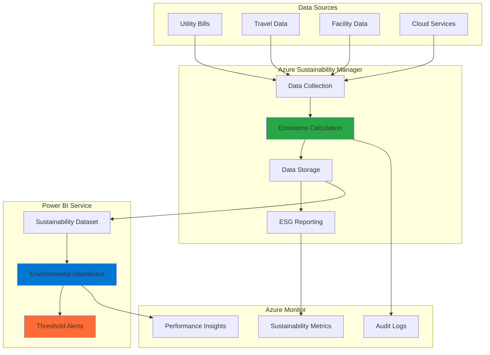

# Environmental Impact Dashboards with Azure Sustainability Manager and Power BI

## Problem

Organizations beginning their sustainability journey lack visibility into their carbon footprint and environmental impact across their operations. Manual tracking through spreadsheets and disparate systems makes it difficult to accurately measure emissions, identify improvement opportunities, and meet increasingly stringent environmental reporting requirements. Without automated data collection and comprehensive visualization, companies struggle to make data-driven decisions about their sustainability initiatives and demonstrate progress to stakeholders.

## Solution

Microsoft Sustainability Manager provides centralized carbon footprint tracking and environmental data management, while Power BI creates interactive dashboards for comprehensive sustainability reporting. This solution automates data collection from various sources, calculates emissions across all scopes, and presents insights through customizable visualizations that enable organizations to track progress, identify trends, and make informed decisions about their environmental impact reduction strategies.

## Architecture Diagram



## Prerequisites

1. Azure subscription with appropriate permissions to create resources
2. Power BI Pro license or Premium Per User (PPU) license
3. Basic understanding of sustainability metrics and carbon accounting
4. Microsoft Cloud for Sustainability license (required for Sustainability Manager)
5. Estimated cost: $200-500/month depending on data volume and Power BI licensing

> **Note**: Microsoft Cloud for Sustainability requires specific licensing. Contact your Microsoft representative for pricing and availability in your region.

## Preparation

```bash
# Set environment variables for Azure resources
export RESOURCE_GROUP="rg-sustainability-${RANDOM_SUFFIX}"
export LOCATION="eastus"
export SUBSCRIPTION_ID=$(az account show --query id --output tsv)
export POWERBI_WORKSPACE="sustainability-workspace"

# Generate unique suffix for resource names
RANDOM_SUFFIX=$(openssl rand -hex 3)

# Create resource group for sustainability resources
az group create \
    --name ${RESOURCE_GROUP} \
    --location ${LOCATION} \
    --tags purpose=sustainability environment=production

echo "✅ Resource group created: ${RESOURCE_GROUP}"

# Create Log Analytics workspace for monitoring
export LOG_WORKSPACE="law-sustainability-${RANDOM_SUFFIX}"
az monitor log-analytics workspace create \
    --resource-group ${RESOURCE_GROUP} \
    --workspace-name ${LOG_WORKSPACE} \
    --location ${LOCATION} \
    --sku PerGB2018

echo "✅ Log Analytics workspace created: ${LOG_WORKSPACE}"
```

## Steps

1. **Configure Microsoft Cloud for Sustainability Environment**:

   Microsoft Cloud for Sustainability provides the foundation for enterprise-scale environmental data management. This configuration establishes the core data model and organizational structure needed for comprehensive sustainability tracking. The system automatically applies industry-standard emissions factors and calculation methodologies, ensuring accurate and consistent carbon accounting across all operational activities.

   ```bash
   # Note: Microsoft Cloud for Sustainability requires manual setup through M365 admin center
   # This cannot be automated via Azure CLI
   
   # Create storage account for sustainability data
   export STORAGE_ACCOUNT="stsustain${RANDOM_SUFFIX}"
   az storage account create \
       --name ${STORAGE_ACCOUNT} \
       --resource-group ${RESOURCE_GROUP} \
       --location ${LOCATION} \
       --sku Standard_LRS \
       --kind StorageV2 \
       --access-tier Hot
   
   echo "✅ Storage account created for sustainability data"
   ```

   The storage account provides secure, scalable storage for all environmental data collected by Sustainability Manager. This foundational step ensures data integrity and supports future expansion of your sustainability tracking capabilities.

2. **Set Up Data Collection Sources**:

   Sustainability Manager excels at integrating diverse data sources to create a comprehensive view of organizational environmental impact. This step establishes automated data connectors that eliminate manual data entry and ensure real-time visibility into emissions across all operational scopes. The system supports structured data imports from utility bills, travel systems, and facility management platforms.

   ```bash
   # Create Azure Data Factory for data ingestion
   export DATA_FACTORY="adf-sustainability-${RANDOM_SUFFIX}"
   az datafactory create \
       --resource-group ${RESOURCE_GROUP} \
       --name ${DATA_FACTORY} \
       --location ${LOCATION}
   
   # Create container for raw sustainability data
   export CONTAINER_NAME="sustainability-data"
   az storage container create \
       --name ${CONTAINER_NAME} \
       --account-name ${STORAGE_ACCOUNT} \
       --auth-mode login
   
   echo "✅ Data collection infrastructure configured"
   ```

   The Data Factory enables automated ingestion from multiple sources, while the storage container provides organized data lake capabilities for all environmental metrics. This architecture supports both batch and real-time data processing requirements.

3. **Configure Emissions Calculation Engine**:

   The emissions calculation engine is the core of Sustainability Manager, applying scientifically validated methodologies to convert activity data into accurate carbon footprint measurements. This configuration ensures compliance with international standards like the GHG Protocol and supports both location-based and market-based calculations for comprehensive Scope 1, 2, and 3 emissions tracking.

   ```bash
   # Create Function App for custom emission calculations
   export FUNCTION_APP="func-sustainability-${RANDOM_SUFFIX}"
   az functionapp create \
       --resource-group ${RESOURCE_GROUP} \
       --consumption-plan-location ${LOCATION} \
       --runtime python \
       --runtime-version 3.11 \
       --name ${FUNCTION_APP} \
       --storage-account ${STORAGE_ACCOUNT} \
       --functions-version 4
   
   # Configure application settings for emissions factors
   az functionapp config appsettings set \
       --name ${FUNCTION_APP} \
       --resource-group ${RESOURCE_GROUP} \
       --settings "EMISSIONS_FACTOR_SOURCE=EPA" \
                  "CALCULATION_METHOD=GHG_PROTOCOL" \
                  "STORAGE_CONNECTION_STRING=DefaultEndpointsProtocol=https;AccountName=${STORAGE_ACCOUNT};EndpointSuffix=core.windows.net"
   
   echo "✅ Emissions calculation engine configured"
   ```

   The Function App provides serverless compute for custom emission factor calculations and data transformations. This enables real-time processing of sustainability data and supports advanced analytics scenarios for environmental impact assessment.

4. **Create Power BI Workspace and Dataset**:

   Power BI provides enterprise-grade business intelligence capabilities specifically designed for sustainability reporting. This workspace configuration establishes the foundation for collaborative dashboard development and ensures proper data governance for environmental metrics. The dedicated workspace enables controlled access to sustainability insights across different organizational roles.

   ```bash
   # Create App Service Plan for Power BI Embedded (if needed)
   export APP_SERVICE_PLAN="asp-powerbi-${RANDOM_SUFFIX}"
   az appservice plan create \
       --name ${APP_SERVICE_PLAN} \
       --resource-group ${RESOURCE_GROUP} \
       --location ${LOCATION} \
       --sku B1 \
       --is-linux
   
   # Create Key Vault for Power BI credentials
   export KEY_VAULT="kv-sustain-${RANDOM_SUFFIX}"
   az keyvault create \
       --name ${KEY_VAULT} \
       --resource-group ${RESOURCE_GROUP} \
       --location ${LOCATION} \
       --sku standard
   
   echo "✅ Power BI infrastructure components created"
   ```

   The App Service Plan provides scalable hosting for Power BI embedded scenarios, while Key Vault ensures secure credential management for data source connections. This architecture supports both self-service analytics and embedded reporting scenarios.

5. **Configure Automated Data Refresh**:

   Automated data refresh ensures that sustainability dashboards always reflect the most current environmental performance data. This configuration establishes scheduled data processing pipelines that maintain data freshness while optimizing resource consumption. The system supports both incremental and full refresh patterns based on data source characteristics and reporting requirements.

   ```bash
   # Create Logic App for automated data refresh
   export LOGIC_APP="la-sustainability-${RANDOM_SUFFIX}"
   az logic workflow create \
       --resource-group ${RESOURCE_GROUP} \
       --name ${LOGIC_APP} \
       --location ${LOCATION} \
       --definition '{
           "definition": {
               "$schema": "https://schema.management.azure.com/providers/Microsoft.Logic/schemas/2016-06-01/workflowdefinition.json#",
               "triggers": {
                   "Recurrence": {
                       "type": "Recurrence",
                       "recurrence": {
                           "frequency": "Day",
                           "interval": 1,
                           "startTime": "2024-01-01T06:00:00Z"
                       }
                   }
               },
               "actions": {
                   "RefreshDataset": {
                       "type": "Http",
                       "inputs": {
                           "method": "POST",
                           "uri": "https://api.powerbi.com/v1.0/myorg/datasets/refresh"
                       }
                   }
               }
           }
       }'
   
   echo "✅ Automated data refresh configured"
   ```

   The Logic App orchestrates daily data refresh operations, ensuring that sustainability dashboards reflect the latest environmental performance data. This automation reduces manual overhead and ensures consistent reporting across all stakeholder groups.

6. **Set Up Environmental Monitoring and Alerting**:

   Azure Monitor provides comprehensive observability for sustainability data processing and dashboard performance. This monitoring configuration enables proactive identification of data quality issues, processing delays, and system performance bottlenecks. The alerting system ensures rapid response to any issues that might impact environmental reporting accuracy.

   ```bash
   # Create Application Insights for monitoring
   export APP_INSIGHTS="ai-sustainability-${RANDOM_SUFFIX}"
   az monitor app-insights component create \
       --app ${APP_INSIGHTS} \
       --resource-group ${RESOURCE_GROUP} \
       --location ${LOCATION} \
       --kind web \
       --application-type web
   
   # Create alert rule for data processing failures
   az monitor metrics alert create \
       --name "sustainability-data-processing-alert" \
       --resource-group ${RESOURCE_GROUP} \
       --scopes "/subscriptions/${SUBSCRIPTION_ID}/resourceGroups/${RESOURCE_GROUP}/providers/Microsoft.Web/sites/${FUNCTION_APP}" \
       --condition "count 'FunctionExecutionCount' > 10" \
       --description "Alert when function execution count exceeds threshold" \
       --evaluation-frequency 5m \
       --window-size 15m \
       --severity 2
   
   echo "✅ Environmental monitoring and alerting configured"
   ```

   Application Insights provides detailed telemetry for all sustainability data processing activities, while the alert rule ensures immediate notification of any processing anomalies. This comprehensive monitoring approach maintains high data quality standards for environmental reporting.

## Validation & Testing

1. **Verify Sustainability Manager Data Collection**:

   ```bash
   # Check storage account for collected data
   az storage blob list \
       --container-name ${CONTAINER_NAME} \
       --account-name ${STORAGE_ACCOUNT} \
       --auth-mode login \
       --output table
   ```

   Expected output: List of data files organized by date and source type, confirming successful data collection from configured sources.

2. **Test Emissions Calculation Functions**:

   ```bash
   # Verify Function App deployment
   az functionapp show \
       --name ${FUNCTION_APP} \
       --resource-group ${RESOURCE_GROUP} \
       --query "{name:name,state:state,hostNames:defaultHostName}" \
       --output table
   
   # Check function logs
   az functionapp logs tail \
       --name ${FUNCTION_APP} \
       --resource-group ${RESOURCE_GROUP}
   ```

   Expected output: Function App showing "Running" state with successful execution logs indicating proper emissions calculations.

3. **Validate Power BI Integration**:

   ```bash
   # Check Key Vault access
   az keyvault secret list \
       --vault-name ${KEY_VAULT} \
       --output table
   
   # Verify Logic App execution
   az logic workflow show \
       --resource-group ${RESOURCE_GROUP} \
       --name ${LOGIC_APP} \
       --query "{name:name,state:state}" \
       --output table
   ```

   Expected output: Key Vault containing Power BI credentials and Logic App in "Enabled" state with successful recent executions.

## Cleanup

1. **Remove Power BI workspace and datasets**:

   ```bash
   # Note: Power BI workspace cleanup requires manual action in Power BI Service
   echo "Manual cleanup required: Delete Power BI workspace '${POWERBI_WORKSPACE}' from Power BI Service"
   
   # Delete Logic App
   az logic workflow delete \
       --resource-group ${RESOURCE_GROUP} \
       --name ${LOGIC_APP} \
       --yes
   
   echo "✅ Logic App deleted"
   ```

2. **Remove Azure monitoring resources**:

   ```bash
   # Delete Application Insights
   az monitor app-insights component delete \
       --app ${APP_INSIGHTS} \
       --resource-group ${RESOURCE_GROUP}
   
   # Delete alert rules
   az monitor metrics alert delete \
       --name "sustainability-data-processing-alert" \
       --resource-group ${RESOURCE_GROUP}
   
   echo "✅ Monitoring resources deleted"
   ```

3. **Remove core infrastructure**:

   ```bash
   # Delete Function App
   az functionapp delete \
       --name ${FUNCTION_APP} \
       --resource-group ${RESOURCE_GROUP}
   
   # Delete Key Vault
   az keyvault delete \
       --name ${KEY_VAULT} \
       --resource-group ${RESOURCE_GROUP}
   
   # Delete Data Factory
   az datafactory delete \
       --name ${DATA_FACTORY} \
       --resource-group ${RESOURCE_GROUP}
   
   echo "✅ Core infrastructure deleted"
   ```

4. **Remove resource group and all remaining resources**:

   ```bash
   # Delete resource group and all contained resources
   az group delete \
       --name ${RESOURCE_GROUP} \
       --yes \
       --no-wait
   
   echo "✅ Resource group deletion initiated: ${RESOURCE_GROUP}"
   echo "Note: Deletion may take several minutes to complete"
   ```

## Discussion

Microsoft Cloud for Sustainability and Power BI create a powerful combination for environmental impact tracking that addresses the growing need for comprehensive ESG reporting. This solution enables organizations to move beyond manual spreadsheet-based tracking to automated, real-time monitoring of their carbon footprint and environmental performance. The integration supports both operational efficiency and regulatory compliance, making it ideal for companies beginning their sustainability journey or looking to enhance existing environmental programs. For detailed implementation guidance, see the [Microsoft Cloud for Sustainability documentation](https://docs.microsoft.com/en-us/industry/sustainability/) and [Power BI sustainability templates](https://docs.microsoft.com/en-us/power-bi/connect-data/service-connect-to-sustainability).

The architecture follows the [Azure Well-Architected Framework](https://docs.microsoft.com/en-us/azure/architecture/framework/) sustainability pillar, emphasizing efficient resource utilization and minimal environmental impact. By leveraging serverless computing and managed services, the solution automatically scales based on demand while optimizing energy consumption. The centralized data model ensures consistency across all sustainability metrics, enabling accurate benchmarking and progress tracking against environmental targets.

From a cost perspective, the consumption-based pricing model for Azure Functions and Logic Apps ensures you only pay for actual data processing activities. Power BI's flexible licensing options allow organizations to start with basic reporting and scale to advanced analytics as their sustainability program matures. The solution's ability to integrate with existing business systems reduces implementation complexity and accelerates time-to-value for sustainability initiatives. For cost optimization strategies, review the [Azure sustainability cost management guide](https://docs.microsoft.com/en-us/azure/cost-management-billing/cost-management-billing-overview).

The dashboard capabilities enable stakeholders across the organization to access relevant sustainability insights, from executive summaries for leadership to detailed operational metrics for facility managers. Power BI's collaboration features support cross-functional sustainability teams by providing shared workspaces and automated report distribution. This comprehensive approach to environmental data management positions organizations to meet increasing stakeholder expectations for transparency and accountability in sustainability performance.

> **Tip**: Use Azure Monitor and Application Insights to track data quality metrics and identify optimization opportunities. The [monitoring best practices guide](https://docs.microsoft.com/en-us/azure/azure-monitor/best-practices) provides comprehensive guidance on setting up effective alerting and performance tracking for sustainability data pipelines.

## Challenge

Extend this solution by implementing these enhancements:

1. **Advanced Analytics Integration**: Implement Azure Machine Learning models to predict future emissions based on historical data and business growth patterns, enabling proactive sustainability planning.

2. **Supply Chain Emissions Tracking**: Integrate with supplier APIs and third-party data sources to track Scope 3 emissions across the entire value chain, providing comprehensive carbon footprint visibility.

3. **Regulatory Reporting Automation**: Build automated report generation for specific regulatory frameworks (CDP, TCFD, EU Taxonomy) with templated outputs and submission workflows.

4. **Real-time Facility Monitoring**: Connect IoT sensors and smart building systems to provide real-time energy consumption and environmental impact data for immediate optimization opportunities.

5. **Multi-tenant Architecture**: Extend the solution to support multiple business units or subsidiaries with role-based access controls and consolidated reporting capabilities for enterprise-wide sustainability management.

## Infrastructure Code

*Infrastructure code will be generated after recipe approval.*