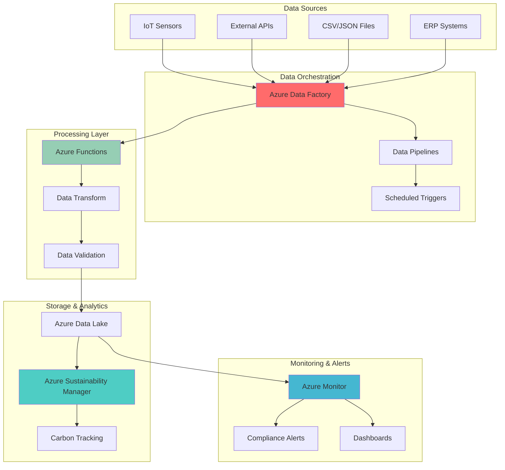

# Environmental Sustainability Data Pipelines with Data Factory and Sustainability Manager

## Problem

Organizations today face increasing pressure to meet environmental compliance requirements and demonstrate progress toward sustainability goals. Manual collection and processing of environmental data from multiple sources creates bottlenecks, increases error rates, and makes it difficult to respond quickly to compliance threshold breaches. Traditional approaches often result in fragmented data silos, delayed reporting, and missed opportunities for proactive environmental management.

## Solution

Azure Data Factory orchestrates automated data pipelines that continuously collect, transform, and analyze environmental sustainability metrics from diverse sources. Integrated with Azure Sustainability Manager for carbon tracking and Azure Monitor for real-time alerts, this solution enables organizations to maintain comprehensive environmental oversight while ensuring rapid response to compliance threshold violations and sustainability performance issues.

## Architecture Diagram



## Prerequisites

1. Azure subscription with appropriate permissions for Data Factory, Sustainability Manager, and Monitor
2. Azure CLI v2.50.0 or later installed and configured (or Azure Cloud Shell)
3. Basic understanding of ETL processes and environmental data management
4. Access to environmental data sources (IoT sensors, APIs, or sample data files)
5. Estimated cost: $50-100/month for development workloads (varies by data volume and processing frequency)

> **Note**: Azure Sustainability Manager is part of Microsoft Cloud for Sustainability and may require additional licensing. Review the [Microsoft Cloud for Sustainability documentation](https://learn.microsoft.com/en-us/industry/sustainability/overview) for detailed requirements.

## Preparation

```bash
# Set environment variables for Azure resources
export RESOURCE_GROUP="rg-env-data-pipeline-${RANDOM_SUFFIX}"
export LOCATION="eastus"
export SUBSCRIPTION_ID=$(az account show --query id --output tsv)

# Generate unique suffix for resource names
RANDOM_SUFFIX=$(openssl rand -hex 3)
export DATA_FACTORY_NAME="adf-env-pipeline-${RANDOM_SUFFIX}"
export STORAGE_ACCOUNT_NAME="stenvdata${RANDOM_SUFFIX}"
export FUNCTION_APP_NAME="func-env-transform-${RANDOM_SUFFIX}"
export LOG_ANALYTICS_NAME="log-env-monitor-${RANDOM_SUFFIX}"

# Create resource group
az group create \
    --name ${RESOURCE_GROUP} \
    --location ${LOCATION} \
    --tags purpose=environmental-data environment=demo

echo "✅ Resource group created: ${RESOURCE_GROUP}"

# Create storage account for data lake
az storage account create \
    --name ${STORAGE_ACCOUNT_NAME} \
    --resource-group ${RESOURCE_GROUP} \
    --location ${LOCATION} \
    --sku Standard_LRS \
    --kind StorageV2 \
    --hierarchical-namespace true

echo "✅ Storage account created with Data Lake Gen2 capabilities"

# Create storage container for environmental data
az storage container create \
    --name environmental-data \
    --account-name ${STORAGE_ACCOUNT_NAME} \
    --auth-mode login

echo "✅ Storage container created for environmental data"
```

## Steps

1. **Create Azure Data Factory instance**:

   Azure Data Factory serves as the central orchestration platform for environmental data pipelines, providing managed ETL capabilities with built-in monitoring and scaling. The service handles complex data workflows while maintaining enterprise-grade security and compliance features essential for environmental data processing.

   ```bash
   # Create Data Factory instance
   az datafactory create \
       --resource-group ${RESOURCE_GROUP} \
       --name ${DATA_FACTORY_NAME} \
       --location ${LOCATION}
   
   # Store Data Factory resource ID for later use
   export ADF_RESOURCE_ID=$(az datafactory show \
       --resource-group ${RESOURCE_GROUP} \
       --name ${DATA_FACTORY_NAME} \
       --query id --output tsv)
   
   echo "✅ Data Factory created: ${DATA_FACTORY_NAME}"
   ```

   The Data Factory is now ready to orchestrate environmental data pipelines with built-in integration capabilities for various data sources. This foundation enables automated data collection from IoT sensors, APIs, and file systems while maintaining data lineage and audit trails required for environmental compliance reporting.

2. **Create Log Analytics workspace for monitoring**:

   Log Analytics provides centralized logging and monitoring capabilities essential for tracking environmental data pipeline performance and compliance metrics. This managed service enables real-time analysis of data processing activities and supports automated alerting for environmental threshold breaches.

   ```bash
   # Create Log Analytics workspace
   az monitor log-analytics workspace create \
       --resource-group ${RESOURCE_GROUP} \
       --workspace-name ${LOG_ANALYTICS_NAME} \
       --location ${LOCATION} \
       --sku pergb2018
   
   # Get workspace ID for Data Factory integration
   export WORKSPACE_ID=$(az monitor log-analytics workspace show \
       --resource-group ${RESOURCE_GROUP} \
       --workspace-name ${LOG_ANALYTICS_NAME} \
       --query customerId --output tsv)
   
   echo "✅ Log Analytics workspace created: ${LOG_ANALYTICS_NAME}"
   ```

   The Log Analytics workspace now provides comprehensive monitoring capabilities for environmental data pipelines. This centralized logging solution enables tracking of data processing metrics, error rates, and performance indicators essential for maintaining reliable environmental monitoring systems.

3. **Create Azure Function for data transformation**:

   Azure Functions provides serverless compute capabilities for real-time data transformation and validation of environmental metrics. This event-driven architecture automatically scales based on data volume while maintaining cost efficiency through consumption-based pricing.

   ```bash
   # Create Function App for data processing
   az functionapp create \
       --resource-group ${RESOURCE_GROUP} \
       --consumption-plan-location ${LOCATION} \
       --runtime python \
       --functions-version 4 \
       --name ${FUNCTION_APP_NAME} \
       --storage-account ${STORAGE_ACCOUNT_NAME} \
       --os-type Linux
   
   # Configure Function App with monitoring integration
   az functionapp config appsettings set \
       --resource-group ${RESOURCE_GROUP} \
       --name ${FUNCTION_APP_NAME} \
       --settings "FUNCTIONS_WORKER_RUNTIME=python" \
               "AzureWebJobsStorage=$(az storage account show-connection-string \
                   --resource-group ${RESOURCE_GROUP} \
                   --name ${STORAGE_ACCOUNT_NAME} \
                   --query connectionString --output tsv)"
   
   echo "✅ Function App created: ${FUNCTION_APP_NAME}"
   ```

   The Function App is now configured for processing environmental data with integrated monitoring and storage connectivity. This serverless computing platform enables real-time data transformation, validation, and enrichment while automatically handling scaling and availability requirements for environmental data processing workflows.

4. **Create data pipeline in Azure Data Factory**:

   Data Factory pipelines orchestrate the end-to-end flow of environmental data from source systems through transformation and loading into analytics platforms. This managed service provides visual authoring capabilities, scheduling, and monitoring for complex data workflows essential for environmental compliance reporting.

   ```bash
   # Create a linked service for storage account
   az datafactory linked-service create \
       --resource-group ${RESOURCE_GROUP} \
       --factory-name ${DATA_FACTORY_NAME} \
       --linked-service-name "StorageLinkedService" \
       --properties '{
           "type": "AzureBlobStorage",
           "typeProperties": {
               "connectionString": {
                   "type": "SecureString",
                   "value": "'$(az storage account show-connection-string \
                       --resource-group ${RESOURCE_GROUP} \
                       --name ${STORAGE_ACCOUNT_NAME} \
                       --query connectionString --output tsv)'"
               }
           }
       }'
   
   # Create dataset for environmental data
   az datafactory dataset create \
       --resource-group ${RESOURCE_GROUP} \
       --factory-name ${DATA_FACTORY_NAME} \
       --dataset-name "EnvironmentalDataSet" \
       --properties '{
           "type": "DelimitedText",
           "linkedServiceName": {
               "referenceName": "StorageLinkedService",
               "type": "LinkedServiceReference"
           },
           "typeProperties": {
               "location": {
                   "type": "AzureBlobStorageLocation",
                   "container": "environmental-data",
                   "fileName": "*.csv"
               },
               "columnDelimiter": ",",
               "firstRowAsHeader": true
           }
       }'
   
   echo "✅ Data Factory linked service and dataset created"
   ```

   The Data Factory now has configured data connections and dataset definitions for environmental data processing. This pipeline foundation enables automated data ingestion from multiple sources while maintaining data quality and lineage tracking essential for environmental reporting and compliance verification.

5. **Create Function linked service for pipeline integration**:

   The Function linked service enables Data Factory pipelines to invoke Azure Functions for data transformation activities. This integration provides seamless connectivity between the orchestration layer and serverless compute resources while maintaining security and performance for environmental data processing workflows.

   ```bash
   # Create linked service for Azure Functions
   az datafactory linked-service create \
       --resource-group ${RESOURCE_GROUP} \
       --factory-name ${DATA_FACTORY_NAME} \
       --linked-service-name "FunctionLinkedService" \
       --properties '{
           "type": "AzureFunction",
           "typeProperties": {
               "functionAppUrl": "https://'${FUNCTION_APP_NAME}'.azurewebsites.net",
               "authentication": "Anonymous"
           }
       }'
   
   echo "✅ Function linked service created for pipeline integration"
   ```

   The Function linked service now enables Data Factory pipelines to seamlessly invoke serverless functions for environmental data transformation. This integration provides the foundation for scalable, event-driven data processing while maintaining security and monitoring capabilities essential for environmental compliance workflows.

6. **Create environmental data processing pipeline**:

   The pipeline orchestrates the complete data flow from ingestion through transformation to analytics, incorporating business logic for environmental metric calculations and compliance threshold monitoring. This automated workflow ensures consistent data processing while maintaining audit trails for regulatory compliance.

   ```bash
   # Create the main data processing pipeline
   az datafactory pipeline create \
       --resource-group ${RESOURCE_GROUP} \
       --factory-name ${DATA_FACTORY_NAME} \
       --pipeline-name "EnvironmentalDataPipeline" \
       --properties '{
           "activities": [
               {
                   "name": "CopyEnvironmentalData",
                   "type": "Copy",
                   "inputs": [
                       {
                           "referenceName": "EnvironmentalDataSet",
                           "type": "DatasetReference"
                       }
                   ],
                   "outputs": [
                       {
                           "referenceName": "EnvironmentalDataSet",
                           "type": "DatasetReference"
                       }
                   ],
                   "typeProperties": {
                       "source": {
                           "type": "DelimitedTextSource"
                       },
                       "sink": {
                           "type": "DelimitedTextSink"
                       }
                   }
               },
               {
                   "name": "ProcessEnvironmentalMetrics",
                   "type": "AzureFunctionActivity",
                   "dependsOn": [
                       {
                           "activity": "CopyEnvironmentalData",
                           "dependencyConditions": ["Succeeded"]
                       }
                   ],
                   "typeProperties": {
                       "functionName": "ProcessEnvironmentalData",
                       "method": "POST",
                       "body": "Environmental data processing request"
                   },
                   "linkedServiceName": {
                       "referenceName": "FunctionLinkedService",
                       "type": "LinkedServiceReference"
                   }
               }
           ]
       }'
   
   echo "✅ Environmental data processing pipeline created"
   ```

   The pipeline now orchestrates environmental data processing with built-in dependency management and error handling. This automated workflow ensures reliable data processing while maintaining comprehensive logging and monitoring capabilities essential for environmental compliance and sustainability reporting.

7. **Configure pipeline triggers for automation**:

   Automated triggers ensure environmental data pipelines execute on schedule or in response to data availability, maintaining continuous monitoring capabilities essential for environmental compliance. These triggers support both time-based and event-driven execution patterns while maintaining reliability and monitoring.

   ```bash
   # Create schedule trigger for daily data processing
   az datafactory trigger create \
       --resource-group ${RESOURCE_GROUP} \
       --factory-name ${DATA_FACTORY_NAME} \
       --trigger-name "DailyEnvironmentalDataTrigger" \
       --properties '{
           "type": "ScheduleTrigger",
           "typeProperties": {
               "recurrence": {
                   "frequency": "Day",
                   "interval": 1,
                   "startTime": "'$(date -u +%Y-%m-%dT06:00:00Z)'",
                   "timeZone": "UTC"
               }
           },
           "pipelines": [
               {
                   "pipelineReference": {
                       "referenceName": "EnvironmentalDataPipeline",
                       "type": "PipelineReference"
                   }
               }
           ]
       }'
   
   # Start the trigger
   az datafactory trigger start \
       --resource-group ${RESOURCE_GROUP} \
       --factory-name ${DATA_FACTORY_NAME} \
       --trigger-name "DailyEnvironmentalDataTrigger"
   
   echo "✅ Daily trigger configured and started"
   ```

   The automated trigger system now ensures continuous environmental data processing with reliable scheduling and monitoring capabilities. This foundation enables real-time sustainability tracking while maintaining the consistency and audit trails required for environmental compliance reporting.

8. **Create Azure Monitor alerts for compliance thresholds**:

   Azure Monitor provides intelligent alerting capabilities that automatically detect when environmental metrics exceed compliance thresholds, enabling proactive response to sustainability issues. This monitoring solution integrates with various notification channels while maintaining detailed audit logs for compliance reporting.

   ```bash
   # Create action group for alert notifications
   az monitor action-group create \
       --resource-group ${RESOURCE_GROUP} \
       --name "EnvironmentalAlerts" \
       --short-name "EnvAlerts" \
       --email-receivers name=admin email=admin@company.com
   
   # Create alert rule for pipeline failures
   az monitor metrics alert create \
       --resource-group ${RESOURCE_GROUP} \
       --name "EnvironmentalPipelineFailures" \
       --description "Alert when environmental data pipeline fails" \
       --scopes ${ADF_RESOURCE_ID} \
       --condition "count PipelineFailedRuns > 0" \
       --window-size 5m \
       --evaluation-frequency 1m \
       --severity 2 \
       --action EnvironmentalAlerts
   
   # Create alert for data processing delays
   az monitor metrics alert create \
       --resource-group ${RESOURCE_GROUP} \
       --name "EnvironmentalDataProcessingDelay" \
       --description "Alert when environmental data processing is delayed" \
       --scopes ${ADF_RESOURCE_ID} \
       --condition "average PipelineRunDuration > 1800" \
       --window-size 15m \
       --evaluation-frequency 5m \
       --severity 3 \
       --action EnvironmentalAlerts
   
   echo "✅ Environmental monitoring alerts configured"
   ```

   The intelligent alerting system now provides proactive monitoring of environmental data pipelines with automatic notification of compliance threshold breaches and operational issues. This comprehensive monitoring solution ensures rapid response to environmental incidents while maintaining detailed audit trails for regulatory compliance.

9. **Configure diagnostic settings for comprehensive monitoring**:

   Diagnostic settings enable comprehensive logging and monitoring of environmental data pipelines, providing detailed insights into data processing activities and compliance metrics. This configuration ensures all pipeline activities are tracked and auditable for environmental reporting requirements.

   ```bash
   # Enable diagnostic settings for Data Factory
   az monitor diagnostic-settings create \
       --resource ${ADF_RESOURCE_ID} \
       --name "EnvironmentalDataFactoryDiagnostics" \
       --workspace ${WORKSPACE_ID} \
       --logs '[
           {
               "category": "PipelineRuns",
               "enabled": true,
               "retentionPolicy": {
                   "enabled": true,
                   "days": 90
               }
           },
           {
               "category": "ActivityRuns",
               "enabled": true,
               "retentionPolicy": {
                   "enabled": true,
                   "days": 90
               }
           },
           {
               "category": "TriggerRuns",
               "enabled": true,
               "retentionPolicy": {
                   "enabled": true,
                   "days": 90
               }
           }
       ]' \
       --metrics '[
           {
               "category": "AllMetrics",
               "enabled": true,
               "retentionPolicy": {
                   "enabled": true,
                   "days": 30
               }
           }
       ]'
   
   echo "✅ Comprehensive diagnostic settings configured"
   ```

   The diagnostic settings now provide complete visibility into environmental data pipeline operations with detailed logging and metrics collection. This comprehensive monitoring foundation enables effective troubleshooting, performance optimization, and compliance reporting for environmental data processing systems.

## Validation & Testing

1. **Verify Data Factory pipeline deployment**:

   ```bash
   # Check Data Factory status
   az datafactory show \
       --resource-group ${RESOURCE_GROUP} \
       --name ${DATA_FACTORY_NAME} \
       --query "{name:name, location:location}" \
       --output table
   
   # List all pipelines in the Data Factory
   az datafactory pipeline list \
       --resource-group ${RESOURCE_GROUP} \
       --factory-name ${DATA_FACTORY_NAME} \
       --output table
   ```

   Expected output: Data Factory should be listed with the environmental data pipeline showing as available.

2. **Test pipeline execution manually**:

   ```bash
   # Manually trigger the pipeline for testing
   PIPELINE_RUN_ID=$(az datafactory pipeline create-run \
       --resource-group ${RESOURCE_GROUP} \
       --factory-name ${DATA_FACTORY_NAME} \
       --pipeline-name "EnvironmentalDataPipeline" \
       --query runId --output tsv)
   
   echo "Pipeline run initiated with ID: ${PIPELINE_RUN_ID}"
   
   # Check pipeline run status
   az datafactory pipeline-run show \
       --resource-group ${RESOURCE_GROUP} \
       --factory-name ${DATA_FACTORY_NAME} \
       --run-id ${PIPELINE_RUN_ID} \
       --query "{status:status, runStart:runStart, runEnd:runEnd}" \
       --output table
   ```

   Expected output: Pipeline run should show successful execution status with start and end times.

3. **Verify monitoring and alerting configuration**:

   ```bash
   # Check alert rules
   az monitor metrics alert list \
       --resource-group ${RESOURCE_GROUP} \
       --query "[].{name:name, enabled:enabled, severity:severity}" \
       --output table
   
   # Verify Log Analytics workspace connection
   az monitor log-analytics workspace show \
       --resource-group ${RESOURCE_GROUP} \
       --workspace-name ${LOG_ANALYTICS_NAME} \
       --query "{name:name, sku:sku.name, provisioningState:provisioningState}" \
       --output table
   ```

   Expected output: Alert rules should be listed as "Enabled" with Log Analytics workspace showing "Succeeded" provisioning state.

## Cleanup

1. **Remove monitoring alerts and action groups**:

   ```bash
   # Delete alert rules
   az monitor metrics alert delete \
       --resource-group ${RESOURCE_GROUP} \
       --name "EnvironmentalPipelineFailures"
   
   az monitor metrics alert delete \
       --resource-group ${RESOURCE_GROUP} \
       --name "EnvironmentalDataProcessingDelay"
   
   # Delete action group
   az monitor action-group delete \
       --resource-group ${RESOURCE_GROUP} \
       --name "EnvironmentalAlerts"
   
   echo "✅ Monitoring alerts and action groups deleted"
   ```

2. **Remove Data Factory and related resources**:

   ```bash
   # Delete Data Factory
   az datafactory delete \
       --resource-group ${RESOURCE_GROUP} \
       --name ${DATA_FACTORY_NAME} \
       --yes
   
   # Delete Function App
   az functionapp delete \
       --resource-group ${RESOURCE_GROUP} \
       --name ${FUNCTION_APP_NAME}
   
   echo "✅ Data Factory and Function App deleted"
   ```

3. **Remove storage and monitoring resources**:

   ```bash
   # Delete storage account
   az storage account delete \
       --resource-group ${RESOURCE_GROUP} \
       --name ${STORAGE_ACCOUNT_NAME} \
       --yes
   
   # Delete Log Analytics workspace
   az monitor log-analytics workspace delete \
       --resource-group ${RESOURCE_GROUP} \
       --workspace-name ${LOG_ANALYTICS_NAME} \
       --yes
   
   echo "✅ Storage and monitoring resources deleted"
   ```

4. **Remove resource group and all remaining resources**:

   ```bash
   # Delete resource group and all contained resources
   az group delete \
       --name ${RESOURCE_GROUP} \
       --yes \
       --no-wait
   
   echo "✅ Resource group deletion initiated: ${RESOURCE_GROUP}"
   echo "Note: Deletion may take several minutes to complete"
   ```

## Discussion

Azure Data Factory provides a comprehensive platform for orchestrating environmental data pipelines that seamlessly integrates with Azure's broader sustainability and monitoring ecosystem. The service's managed nature eliminates infrastructure management overhead while providing enterprise-grade reliability and security features essential for environmental compliance. For organizations implementing sustainability initiatives, the [Azure Data Factory documentation](https://docs.microsoft.com/en-us/azure/data-factory/) provides detailed guidance on advanced pipeline patterns and integration options that follow Azure Well-Architected Framework principles.

The integration between Azure Data Factory and Azure Monitor creates a powerful foundation for proactive environmental monitoring and compliance management. Azure Monitor's intelligent alerting capabilities enable organizations to respond rapidly to environmental threshold breaches while maintaining comprehensive audit trails required for regulatory compliance. The [Azure Monitor documentation](https://docs.microsoft.com/en-us/azure/azure-monitor/) offers extensive guidance on configuring advanced monitoring scenarios and integrating with external notification systems for comprehensive environmental incident response workflows.

Azure Functions serve as the transformation layer, providing serverless compute capabilities that automatically scale based on data volume while maintaining cost efficiency through consumption-based pricing. This event-driven architecture pattern is particularly effective for environmental data processing because it handles variable workloads efficiently while maintaining low latency for real-time alerts and compliance monitoring. The [Azure Functions documentation](https://docs.microsoft.com/en-us/azure/azure-functions/) provides comprehensive guidance on implementing complex data transformation logic and integrating with external environmental monitoring systems.

The combination of these services creates a robust foundation for environmental compliance that follows Azure Well-Architected Framework principles of reliability, security, and cost optimization. Organizations can leverage this architecture to build comprehensive sustainability reporting systems that meet regulatory requirements while providing actionable insights for environmental performance improvement. For detailed implementation guidance, refer to the [Azure Architecture Center](https://docs.microsoft.com/en-us/azure/architecture/) and the [Microsoft Cloud for Sustainability documentation](https://docs.microsoft.com/en-us/industry/sustainability/overview) for industry-specific best practices.

> **Tip**: Use Azure Policy to enforce consistent environmental data governance across your organization. The [Azure Policy documentation](https://docs.microsoft.com/en-us/azure/governance/policy/) provides guidance on implementing automated compliance checks and resource management policies that support environmental sustainability goals while maintaining security and operational excellence.

## Challenge

Extend this environmental data pipeline solution by implementing these enhancements:

1. **Multi-source data integration**: Add connectors for additional environmental data sources such as weather APIs, energy management systems, and carbon footprint databases to create a comprehensive environmental data lake with real-time streaming capabilities.

2. **Advanced analytics with Azure Synapse**: Integrate Azure Synapse Analytics to perform complex environmental trend analysis, carbon footprint calculations, and sustainability forecasting using machine learning models with predictive analytics capabilities.

3. **Real-time dashboard creation**: Build Power BI dashboards that display real-time environmental metrics, compliance status, and sustainability KPIs with automatic refresh capabilities, mobile-friendly interfaces, and interactive drill-down capabilities.

4. **Automated compliance reporting**: Implement automated report generation that creates regulatory compliance documents, sustainability reports, and audit trails with configurable templates, scheduling, and multi-format output capabilities.

5. **Integration with Microsoft Sustainability Manager**: Connect the pipeline to Microsoft Sustainability Manager for advanced carbon accounting, emissions tracking, and sustainability reporting capabilities aligned with industry standards like GRI and SASB frameworks.

## Infrastructure Code

### Available Infrastructure as Code:

- [Infrastructure Code Overview](code/README.md) - Detailed description of all infrastructure components
- [Bicep](code/bicep/) - Azure Bicep templates
- [Bash CLI Scripts](code/scripts/) - Example bash scripts using Azure CLI commands to deploy infrastructure
- [Terraform](code/terraform/) - Terraform configuration files