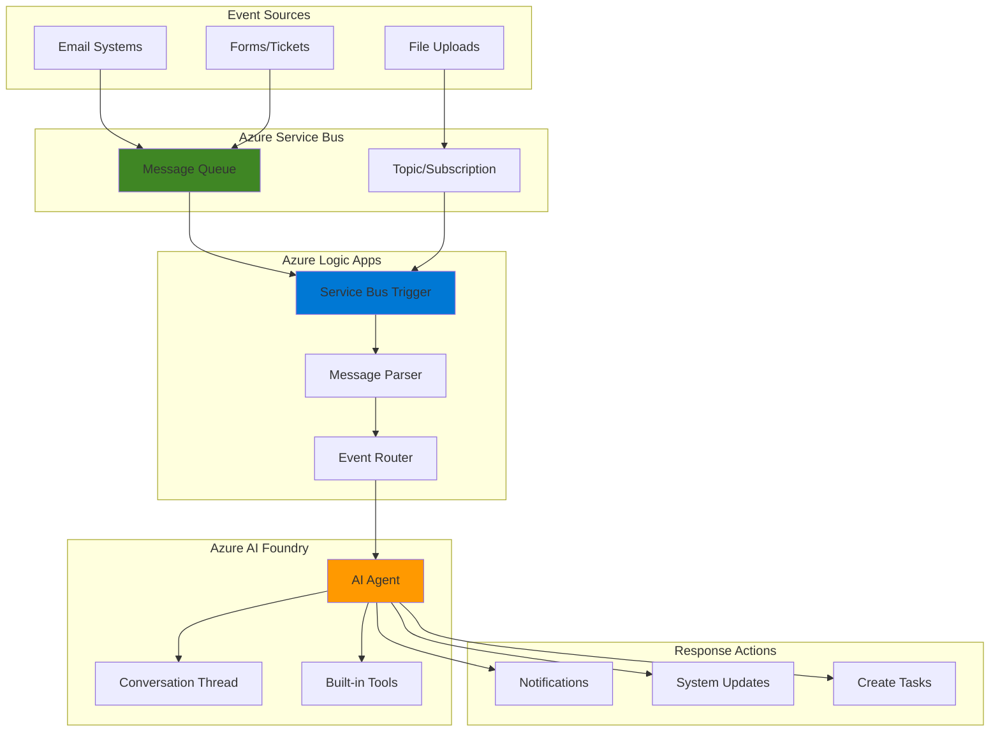

# Event-Driven AI Agent Workflows with AI Foundry and Logic Apps

## Problem

Modern businesses receive hundreds of events daily—new support tickets, customer emails, file uploads, and form submissions—that require intelligent processing and routing. Traditional automation handles simple rule-based tasks but struggles with unstructured data, context understanding, and dynamic decision-making. Manual processing of these events leads to delayed responses, inconsistent handling, and overwhelmed support teams who spend valuable time on repetitive tasks instead of strategic work.

## Solution

Build intelligent event-driven automation using Azure AI Foundry Agent Service with Logic Apps and Service Bus to create AI agents that automatically respond to business events. This serverless architecture combines Logic Apps' extensive connectivity with AI Foundry's intelligent processing capabilities, enabling automated workflows that understand context, make intelligent decisions, and take appropriate actions based on event content and business rules.

## Architecture Diagram



## Prerequisites

1. Azure subscription with appropriate permissions for AI services, Logic Apps, and Service Bus
2. Azure CLI installed and configured (or Azure Cloud Shell)
3. Basic understanding of event-driven architectures and AI concepts
4. Experience with Azure portal and resource management
5. Estimated cost: $20-40 for resources created during this recipe

> **Note**: Azure AI Foundry Agent Service is currently in preview and may incur additional charges. Review the [Azure AI Foundry pricing](https://azure.microsoft.com/pricing/details/ai-foundry/) for current rates.

## Preparation

```bash
# Set environment variables for Azure resources
export RESOURCE_GROUP="rg-ai-workflows-${RANDOM_SUFFIX}"
export LOCATION="eastus"
export SUBSCRIPTION_ID=$(az account show --query id --output tsv)

# Generate unique suffix for resource names
RANDOM_SUFFIX=$(openssl rand -hex 3)

# Set resource names with unique suffix
export AI_FOUNDRY_HUB="aihub-workflows-${RANDOM_SUFFIX}"
export AI_FOUNDRY_PROJECT="aiproject-workflows-${RANDOM_SUFFIX}"
export SERVICE_BUS_NAMESPACE="sb-workflows-${RANDOM_SUFFIX}"
export LOGIC_APP_NAME="la-ai-workflows-${RANDOM_SUFFIX}"

# Create resource group
az group create \
    --name ${RESOURCE_GROUP} \
    --location ${LOCATION} \
    --tags purpose=recipe environment=demo

echo "✅ Resource group created: ${RESOURCE_GROUP}"

# Create Service Bus namespace
az servicebus namespace create \
    --name ${SERVICE_BUS_NAMESPACE} \
    --resource-group ${RESOURCE_GROUP} \
    --location ${LOCATION} \
    --sku Standard \
    --tags purpose=recipe environment=demo

echo "✅ Service Bus namespace created: ${SERVICE_BUS_NAMESPACE}"
```

## Steps

1. **Create AI Foundry Hub and Project**:

   Azure AI Foundry provides the foundation for building intelligent agents with built-in governance, security, and observability. The hub acts as a central management point for AI resources, while projects provide isolated workspaces for specific agent implementations. This architecture ensures proper resource isolation and access control for enterprise AI deployments.

   ```bash
   # Create AI Foundry hub
   az ml workspace create \
       --name ${AI_FOUNDRY_HUB} \
       --resource-group ${RESOURCE_GROUP} \
       --location ${LOCATION} \
       --kind Hub \
       --tags purpose=recipe environment=demo
   
   # Create AI project within the hub
   az ml workspace create \
       --name ${AI_FOUNDRY_PROJECT} \
       --resource-group ${RESOURCE_GROUP} \
       --location ${LOCATION} \
       --kind Project \
       --hub-id "/subscriptions/${SUBSCRIPTION_ID}/resourceGroups/${RESOURCE_GROUP}/providers/Microsoft.MachineLearningServices/workspaces/${AI_FOUNDRY_HUB}" \
       --tags purpose=recipe environment=demo
   
   echo "✅ AI Foundry hub and project created successfully"
   ```

   The AI Foundry workspace is now configured with enterprise-grade security and governance features. This setup provides the managed infrastructure needed for deploying production-ready AI agents with built-in monitoring and compliance capabilities.

2. **Configure Service Bus Queue and Topic**:

   Service Bus provides reliable message queuing with advanced routing capabilities for event-driven architectures. Creating both queues and topics enables flexible message distribution patterns—queues for point-to-point communication and topics for publish-subscribe scenarios where multiple subscribers can process the same event.

   ```bash
   # Create queue for direct event processing
   az servicebus queue create \
       --name "event-processing-queue" \
       --namespace-name ${SERVICE_BUS_NAMESPACE} \
       --resource-group ${RESOURCE_GROUP} \
       --max-size 1024 \
       --default-message-time-to-live "P14D"
   
   # Create topic for event distribution
   az servicebus topic create \
       --name "business-events-topic" \
       --namespace-name ${SERVICE_BUS_NAMESPACE} \
       --resource-group ${RESOURCE_GROUP} \
       --max-size 1024 \
       --default-message-time-to-live "P14D"
   
   # Create subscription for AI agent processing
   az servicebus topic subscription create \
       --name "ai-agent-subscription" \
       --topic-name "business-events-topic" \
       --namespace-name ${SERVICE_BUS_NAMESPACE} \
       --resource-group ${RESOURCE_GROUP} \
       --max-delivery-count 10
   
   # Get Service Bus connection string
   SERVICE_BUS_CONNECTION=$(az servicebus namespace \
       authorization-rule keys list \
       --name RootManageSharedAccessKey \
       --namespace-name ${SERVICE_BUS_NAMESPACE} \
       --resource-group ${RESOURCE_GROUP} \
       --query primaryConnectionString --output tsv)
   
   echo "✅ Service Bus messaging infrastructure configured"
   ```

   The Service Bus infrastructure now supports both direct message processing and fan-out scenarios. The configured time-to-live and delivery count settings ensure reliable message handling with proper dead-letter queue support for failed processing attempts.

3. **Create AI Agent in AI Foundry**:

   Azure AI Foundry Agent Service provides the runtime for intelligent automation with built-in tools for data grounding, web search, and workflow integration. Creating an agent through the portal enables visual configuration of tools, instructions, and behavior patterns that define how the agent responds to different event types.

   ```bash
   # Get AI Foundry project details for agent creation
   AI_PROJECT_ENDPOINT=$(az ml workspace show \
       --name ${AI_FOUNDRY_PROJECT} \
       --resource-group ${RESOURCE_GROUP} \
       --query discovery_url --output tsv)
   
   echo "AI Foundry Project Endpoint: ${AI_PROJECT_ENDPOINT}"
   echo "📋 Next steps require Azure portal configuration:"
   echo "1. Navigate to Azure AI Foundry portal: https://ai.azure.com"
   echo "2. Select your project: ${AI_FOUNDRY_PROJECT}"
   echo "3. Create a new agent with the following settings:"
   echo "   - Name: BusinessEventProcessor"
   echo "   - Model: GPT-4o (or latest available)"
   echo "   - System Instructions: Process business events intelligently"
   echo "   - Tools: Enable Grounding with Bing Search, Azure Logic Apps"
   
   echo "✅ AI Foundry project ready for agent creation"
   ```

   The AI agent configuration defines the intelligence layer that processes events and determines appropriate responses. The system instructions and enabled tools provide the agent with capabilities to understand context, search for additional information, and trigger business workflows based on event content.

4. **Install Logic Apps CLI Extension and Create Workflow**:

   Logic Apps provides serverless workflow orchestration with built-in Service Bus connectivity. The Azure CLI Logic Apps extension enables command-line management of Consumption logic app workflows, allowing automated deployment and configuration of event-driven workflows that scale automatically.

   ```bash
   # Install Azure CLI Logic Apps extension
   az extension add --name logic
   
   # Create workflow definition file for Service Bus trigger
   cat > logic-app-definition.json << 'EOF'
   {
       "$schema": "https://schema.management.azure.com/providers/Microsoft.Logic/schemas/2016-06-01/workflowdefinition.json#",
       "contentVersion": "1.0.0.0",
       "parameters": {},
       "triggers": {
           "When_a_message_is_received_in_a_queue": {
               "type": "ServiceBus",
               "inputs": {
                   "host": {
                       "connection": {
                           "name": "@parameters('$connections')['servicebus']['connectionId']"
                       }
                   },
                   "method": "get",
                   "path": "//@{encodeURIComponent(encodeURIComponent('event-processing-queue'))}/messages/head",
                   "queries": {
                       "queueType": "Main"
                   }
               },
               "recurrence": {
                   "frequency": "Minute",
                   "interval": 1
               }
           }
       },
       "actions": {
           "Parse_Event_Content": {
               "type": "ParseJson",
               "inputs": {
                   "content": "@base64ToString(triggerBody()?['ContentData'])",
                   "schema": {
                       "type": "object",
                       "properties": {
                           "eventType": {"type": "string"},
                           "content": {"type": "string"},
                           "metadata": {"type": "object"}
                       }
                   }
               }
           },
           "HTTP_Call_to_AI_Agent": {
               "type": "Http",
               "inputs": {
                   "method": "POST",
                   "uri": "https://api.example.com/process-event",
                   "headers": {
                       "Content-Type": "application/json"
                   },
                   "body": {
                       "eventData": "@body('Parse_Event_Content')",
                       "timestamp": "@utcNow()"
                   }
               },
               "runAfter": {
                   "Parse_Event_Content": ["Succeeded"]
               }
           }
       },
       "outputs": {}
   }
   EOF
   
   # Create Logic App workflow using Azure CLI
   az logic workflow create \
       --resource-group ${RESOURCE_GROUP} \
       --location ${LOCATION} \
       --name ${LOGIC_APP_NAME} \
       --definition logic-app-definition.json \
       --tags purpose=recipe environment=demo
   
   echo "✅ Logic App workflow created: ${LOGIC_APP_NAME}"
   ```

   The Logic App workflow is now configured with a Service Bus trigger that automatically processes incoming messages. This serverless approach provides automatic scaling and pay-per-execution pricing, making it cost-effective for variable event volumes.

5. **Configure AI Agent Tools and Actions**:

   AI agents become powerful through tool integration that extends their capabilities beyond text processing. Configuring Logic Apps as an action tool enables the agent to trigger additional workflows, send notifications, update systems, and perform complex business operations based on intelligent analysis of event content and context.

   ```bash
   echo "📋 Configure AI Agent Tools in Azure AI Foundry Portal:"
   echo "1. Navigate to https://ai.azure.com and open ${AI_FOUNDRY_PROJECT}"
   echo "2. Select your BusinessEventProcessor agent"
   echo "3. In the Setup section, add the following tools:"
   echo "   - Grounding with Bing Search (for external context)"
   echo "   - Azure Logic Apps (for workflow automation)"
   echo "   - Function Calling (for custom business logic)"
   echo ""
   echo "4. Configure Logic Apps integration:"
   echo "   - Select 'Add' in Actions section"
   echo "   - Choose 'Azure Logic Apps'"
   echo "   - Create workflows for common responses:"
   echo "     * Send notification emails"
   echo "     * Create support tickets"
   echo "     * Update CRM systems"
   echo "     * Generate reports"
   echo ""
   echo "5. Set agent instructions:"
   echo "   'Analyze business events and take appropriate automated actions."
   echo "   For support requests, create tickets and send acknowledgments."
   echo "   For urgent issues, escalate immediately with notifications."
   echo "   For routine tasks, process automatically and update systems.'"
   
   echo "✅ AI agent tool configuration guidance provided"
   ```

   The configured tools transform the AI agent into a comprehensive business automation platform capable of understanding events, gathering additional context, and executing complex multi-step workflows that would traditionally require human intervention.

6. **Test Event Processing Pipeline**:

   Testing validates the complete event-driven AI workflow from message ingestion through intelligent processing to automated responses. This verification ensures proper integration between Service Bus, Logic Apps, and AI Foundry while demonstrating the system's ability to handle various event types with appropriate automated responses.

   ```bash
   # Send test message to Service Bus queue
   az servicebus message send \
       --namespace-name ${SERVICE_BUS_NAMESPACE} \
       --queue-name "event-processing-queue" \
       --body '{
           "eventType": "support-request",
           "content": "Customer reporting login issues with urgent priority",
           "metadata": {
               "customerId": "CUST-12345",
               "timestamp": "'$(date -u +%Y-%m-%dT%H:%M:%SZ)'",
               "priority": "high"
           }
       }'
   
   echo "✅ Test message sent to Service Bus queue"
   
   # Send another test message for different event type
   az servicebus message send \
       --namespace-name ${SERVICE_BUS_NAMESPACE} \
       --queue-name "event-processing-queue" \
       --body '{
           "eventType": "document-upload",
           "content": "New contract document uploaded requiring review and approval",
           "metadata": {
               "documentId": "DOC-67890",
               "uploadedBy": "user@company.com",
               "timestamp": "'$(date -u +%Y-%m-%dT%H:%M:%SZ)'",
               "category": "legal"
           }
       }'
   
   echo "✅ Second test message sent for document processing"
   echo "📋 Monitor workflow execution:"
   echo "1. Check Logic App runs in Azure portal"
   echo "2. Verify AI agent thread creation in AI Foundry"
   echo "3. Review automated actions taken by the agent"
   ```

   The test messages simulate real business events that trigger the complete AI-driven automation pipeline. This validation confirms that events flow properly through Service Bus, trigger Logic App workflows, and activate AI agents for intelligent processing and automated response generation.

## Validation & Testing

1. **Verify Service Bus Message Processing**:

   ```bash
   # Check message processing status
   az servicebus queue show \
       --name "event-processing-queue" \
       --namespace-name ${SERVICE_BUS_NAMESPACE} \
       --resource-group ${RESOURCE_GROUP} \
       --query "messageCount"
   
   # List recent messages (if any remain)
   az servicebus message peek \
       --namespace-name ${SERVICE_BUS_NAMESPACE} \
       --queue-name "event-processing-queue" \
       --max-count 5
   ```

   Expected output: Message count should be 0 if successfully processed, or show remaining messages if processing is in progress.

2. **Monitor Logic App Workflow Execution**:

   ```bash
   # Get Logic App workflow run history
   az logic workflow list-runs \
       --name ${LOGIC_APP_NAME} \
       --resource-group ${RESOURCE_GROUP} \
       --top 5
   
   # Check latest run status
   LATEST_RUN=$(az logic workflow list-runs \
       --name ${LOGIC_APP_NAME} \
       --resource-group ${RESOURCE_GROUP} \
       --top 1 \
       --query "[0].name" --output tsv)
   
   echo "Latest workflow run: ${LATEST_RUN}"
   ```

   Expected output: Successful workflow runs with status "Succeeded" and proper action execution.

3. **Validate AI Agent Processing**:

   Navigate to the Azure AI Foundry portal and verify:
   - Agent threads were created for each processed event
   - Conversation history shows proper event analysis
   - Agent tools were invoked appropriately
   - Automated actions were triggered based on event content

4. **Test End-to-End Automation**:

   ```bash
   # Send test messages with different priority levels
   for priority in "low" "medium" "high" "critical"; do
       az servicebus message send \
           --namespace-name ${SERVICE_BUS_NAMESPACE} \
           --queue-name "event-processing-queue" \
           --body "{
               \"eventType\": \"test-event\",
               \"content\": \"Test event with ${priority} priority level\",
               \"metadata\": {
                   \"priority\": \"${priority}\",
                   \"timestamp\": \"$(date -u +%Y-%m-%dT%H:%M:%SZ)\"
               }
           }"
       
       sleep 2
   done
   
   echo "✅ Multiple priority test events sent"
   ```

   Verify that different priority levels trigger appropriate automated responses through the AI agent's intelligent processing.

## Cleanup

1. **Remove Logic App Workflow**:

   ```bash
   # Delete Logic App workflow
   az logic workflow delete \
       --name ${LOGIC_APP_NAME} \
       --resource-group ${RESOURCE_GROUP} \
       --yes
   
   echo "✅ Logic App workflow deleted"
   ```

2. **Delete Service Bus Resources**:

   ```bash
   # Delete Service Bus namespace (includes all queues and topics)
   az servicebus namespace delete \
       --name ${SERVICE_BUS_NAMESPACE} \
       --resource-group ${RESOURCE_GROUP}
   
   echo "✅ Service Bus namespace deleted"
   ```

3. **Remove AI Foundry Resources**:

   ```bash
   # Delete AI project
   az ml workspace delete \
       --name ${AI_FOUNDRY_PROJECT} \
       --resource-group ${RESOURCE_GROUP} \
       --yes
   
   # Delete AI hub
   az ml workspace delete \
       --name ${AI_FOUNDRY_HUB} \
       --resource-group ${RESOURCE_GROUP} \
       --yes
   
   echo "✅ AI Foundry resources deleted"
   ```

4. **Delete Resource Group**:

   ```bash
   # Delete resource group and all remaining resources
   az group delete \
       --name ${RESOURCE_GROUP} \
       --yes \
       --no-wait
   
   echo "✅ Resource group deletion initiated: ${RESOURCE_GROUP}"
   echo "Note: Complete deletion may take several minutes"
   
   # Clean up environment variables
   unset RESOURCE_GROUP LOCATION SUBSCRIPTION_ID RANDOM_SUFFIX
   unset AI_FOUNDRY_HUB AI_FOUNDRY_PROJECT SERVICE_BUS_NAMESPACE LOGIC_APP_NAME
   ```

## Discussion

Event-driven AI agent workflows represent a significant evolution in business process automation, combining the reliability of traditional event processing with the intelligence of modern AI systems. This architecture addresses the growing need for systems that can handle unstructured data, make contextual decisions, and adapt to changing business requirements without constant human intervention.

The integration between Azure AI Foundry Agent Service and Logic Apps creates a powerful automation platform that scales automatically and processes events with human-like intelligence. Service Bus provides the reliable messaging foundation that ensures no events are lost, while Logic Apps orchestrates the workflow with built-in retry logic and error handling. The AI agent adds the crucial intelligence layer that can understand context, analyze content, and make appropriate decisions based on business rules and learned patterns.

This serverless architecture offers significant cost advantages over traditional automation approaches by eliminating the need for always-on infrastructure while providing automatic scaling to handle event spikes. The pay-per-execution model of Logic Apps combined with the AI Foundry's managed runtime creates a cost-effective solution that scales from zero to enterprise-level processing volumes. Organizations can start small with simple event processing and gradually add more sophisticated AI capabilities as their automation requirements evolve.

The security and governance features built into Azure AI Foundry ensure that AI agents operate within defined boundaries with proper audit trails and compliance controls. This enterprise-grade foundation is essential for production deployments where AI agents make decisions that impact business operations and customer experiences. For detailed security guidance, see the [Azure AI Foundry security documentation](https://learn.microsoft.com/en-us/azure/ai-foundry/security) and [Logic Apps security best practices](https://learn.microsoft.com/en-us/azure/logic-apps/logic-apps-securing-a-logic-app).

> **Tip**: Monitor AI agent performance and decision quality through Azure Monitor and AI Foundry's built-in observability features. Use this data to refine agent instructions and improve automation accuracy over time.

## Challenge

Extend this event-driven AI automation solution with these advanced capabilities:

1. **Multi-Modal Event Processing**: Configure the AI agent to process different content types including images, documents, and audio files by integrating Azure Cognitive Services for document analysis, speech-to-text, and computer vision capabilities.

2. **Intelligent Event Routing**: Implement dynamic routing logic that uses AI to classify events and route them to specialized agents based on content analysis, sentiment, urgency, and business context rather than simple rule-based routing.

3. **Human-in-the-Loop Workflow**: Add approval workflows for high-stakes decisions by integrating Microsoft Teams or Outlook connectors that request human approval for certain automated actions before execution.

4. **Advanced Analytics and Learning**: Implement feedback loops that capture the effectiveness of automated actions and use this data to improve agent decision-making through reinforcement learning patterns and performance optimization.

5. **Cross-System Integration**: Extend the solution to integrate with external systems like CRM, ERP, and ticketing systems using custom connectors and OpenAPI specifications, creating a comprehensive business automation platform.

## Infrastructure Code

*Infrastructure code will be generated after recipe approval.*