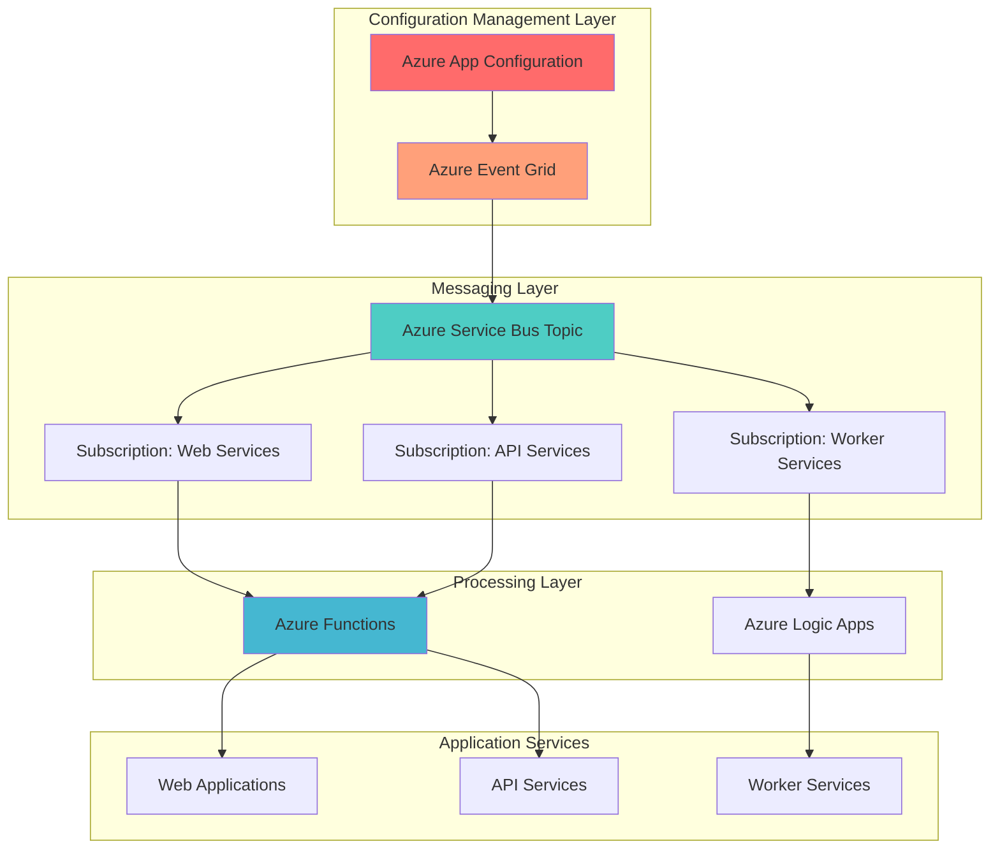

# Event-Driven Configuration with App Configuration and Service Bus

## Problem

Modern distributed microservices architectures require centralized configuration management that can instantly propagate changes across multiple services without manual intervention or service restarts. Traditional configuration management approaches rely on polling mechanisms that create unnecessary delays and resource consumption, while manual configuration updates across dozens of services lead to deployment bottlenecks and potential inconsistencies that can cause service outages.

## Solution

Build an event-driven configuration management system using Azure App Configuration as the centralized configuration store, Azure Service Bus for reliable message routing, and Azure Functions for automated configuration change processing. This solution eliminates polling overhead by leveraging Azure Event Grid to trigger immediate notifications when configuration changes occur, ensuring real-time consistency across all services.

## Architecture Diagram



## Prerequisites

1. Azure subscription with appropriate permissions for creating resource groups and Azure services
2. Azure CLI v2.37.0 or later installed and configured (or Azure Cloud Shell)
3. Basic understanding of Azure App Configuration, Service Bus messaging patterns, and event-driven architectures
4. Knowledge of Azure Functions development and deployment processes
5. Estimated cost: $15-25 per month for development/testing workloads (depends on message volume and function execution frequency)

> **Warning**: Remember to clean up resources after testing to avoid unnecessary charges. Service Bus Standard tier and App Configuration Standard tier have ongoing costs even when not actively used.

> **Note**: This solution follows Azure Well-Architected Framework principles for reliability and scalability. See the [Azure Architecture Center](https://learn.microsoft.com/en-us/azure/architecture/) for comprehensive guidance on event-driven architectures.

## Preparation

```bash
# Generate unique suffix for resource names first
RANDOM_SUFFIX=$(openssl rand -hex 3)

# Set environment variables for Azure resources
export RESOURCE_GROUP="rg-config-management-${RANDOM_SUFFIX}"
export LOCATION="eastus"
export SUBSCRIPTION_ID=$(az account show --query id --output tsv)

# Set resource names with unique suffixes
export APP_CONFIG_NAME="appconfig-${RANDOM_SUFFIX}"
export SERVICE_BUS_NAMESPACE="sb-config-${RANDOM_SUFFIX}"
export SERVICE_BUS_TOPIC="configuration-changes"
export FUNCTION_APP_NAME="func-config-processor-${RANDOM_SUFFIX}"
export STORAGE_ACCOUNT_NAME="stconfig${RANDOM_SUFFIX}"
export LOGIC_APP_NAME="logic-config-workflow-${RANDOM_SUFFIX}"

# Create resource group
az group create \
    --name ${RESOURCE_GROUP} \
    --location ${LOCATION} \
    --tags purpose=configuration-management environment=demo

echo "✅ Resource group created: ${RESOURCE_GROUP}"
```

## Steps

1. **Create Azure App Configuration Store**:

   Azure App Configuration provides centralized configuration management with built-in versioning, feature flags, and point-in-time snapshots. This managed service eliminates the complexity of maintaining custom configuration infrastructure while providing enterprise-grade security, compliance, and integration capabilities that are essential for production workloads.

   ```bash
   # Create App Configuration store
   az appconfig create \
       --name ${APP_CONFIG_NAME} \
       --resource-group ${RESOURCE_GROUP} \
       --location ${LOCATION} \
       --sku standard \
       --enable-public-network true \
       --assign-identity
   
   # Store connection string for later use
   export APP_CONFIG_CONNECTION_STRING=$(az appconfig credential list \
       --name ${APP_CONFIG_NAME} \
       --resource-group ${RESOURCE_GROUP} \
       --query "[0].connectionString" \
       --output tsv)
   
   echo "✅ App Configuration store created: ${APP_CONFIG_NAME}"
   ```

   The App Configuration store is now ready to manage your application settings with enterprise-grade security and global availability. This foundational component provides the centralized configuration repository that will trigger events when configuration changes occur.

2. **Create Azure Service Bus Namespace and Topic**:

   Azure Service Bus provides reliable message queuing and publish-subscribe capabilities that are essential for event-driven architectures. The topic-based messaging pattern enables multiple services to independently consume configuration change events while maintaining guaranteed message delivery and built-in retry mechanisms.

   ```bash
   # Create Service Bus namespace
   az servicebus namespace create \
       --name ${SERVICE_BUS_NAMESPACE} \
       --resource-group ${RESOURCE_GROUP} \
       --location ${LOCATION} \
       --sku Standard \
       --mi-system-assigned
   
   # Create Service Bus topic for configuration changes
   az servicebus topic create \
       --name ${SERVICE_BUS_TOPIC} \
       --namespace-name ${SERVICE_BUS_NAMESPACE} \
       --resource-group ${RESOURCE_GROUP} \
       --max-size 1024 \
       --enable-duplicate-detection true
   
   # Store connection string for later use
   export SERVICE_BUS_CONNECTION_STRING=$(az servicebus namespace \
       authorization-rule keys list \
       --namespace-name ${SERVICE_BUS_NAMESPACE} \
       --resource-group ${RESOURCE_GROUP} \
       --name RootManageSharedAccessKey \
       --query primaryConnectionString \
       --output tsv)
   
   echo "✅ Service Bus namespace and topic created: ${SERVICE_BUS_NAMESPACE}"
   ```

   The Service Bus infrastructure is now configured to handle configuration change events with guaranteed delivery and message deduplication. This messaging layer provides the reliable communication backbone between configuration changes and service updates.

3. **Create Service Bus Subscriptions for Different Service Types**:

   Service Bus subscriptions enable message filtering and routing based on message properties, allowing different types of services to receive only relevant configuration changes. This selective message delivery reduces network traffic and processing overhead while ensuring each service receives appropriate configuration updates.

   ```bash
   # Create subscription for web services
   az servicebus topic subscription create \
       --name "web-services" \
       --topic-name ${SERVICE_BUS_TOPIC} \
       --namespace-name ${SERVICE_BUS_NAMESPACE} \
       --resource-group ${RESOURCE_GROUP} \
       --max-delivery-count 10 \
       --lock-duration PT5M
   
   # Create subscription for API services
   az servicebus topic subscription create \
       --name "api-services" \
       --topic-name ${SERVICE_BUS_TOPIC} \
       --namespace-name ${SERVICE_BUS_NAMESPACE} \
       --resource-group ${RESOURCE_GROUP} \
       --max-delivery-count 10 \
       --lock-duration PT5M
   
   # Create subscription for worker services
   az servicebus topic subscription create \
       --name "worker-services" \
       --topic-name ${SERVICE_BUS_TOPIC} \
       --namespace-name ${SERVICE_BUS_NAMESPACE} \
       --resource-group ${RESOURCE_GROUP} \
       --max-delivery-count 10 \
       --lock-duration PT5M
   
   echo "✅ Service Bus subscriptions created for different service types"
   ```

   The subscription infrastructure now enables selective message routing based on service categories. This architecture allows for targeted configuration updates and reduces unnecessary processing across your microservices ecosystem.

4. **Create Storage Account for Azure Functions**:

   Azure Functions requires a storage account for managing function metadata, triggers, and bindings. This storage account serves as the persistent storage layer for function execution contexts and provides the necessary infrastructure for serverless configuration processing workflows.

   ```bash
   # Create storage account for Functions
   az storage account create \
       --name ${STORAGE_ACCOUNT_NAME} \
       --resource-group ${RESOURCE_GROUP} \
       --location ${LOCATION} \
       --sku Standard_LRS \
       --kind StorageV2 \
       --access-tier Hot
   
   # Get storage account connection string
   export STORAGE_CONNECTION_STRING=$(az storage account show-connection-string \
       --name ${STORAGE_ACCOUNT_NAME} \
       --resource-group ${RESOURCE_GROUP} \
       --query connectionString \
       --output tsv)
   
   echo "✅ Storage account created: ${STORAGE_ACCOUNT_NAME}"
   ```

   The storage account is now configured to support Azure Functions execution and provides the necessary backing store for serverless configuration processing operations.

5. **Create Azure Functions App for Configuration Processing**:

   Azure Functions provides serverless event processing that automatically scales based on configuration change events. This consumption-based model ensures cost-effective processing while maintaining high availability and performance for configuration updates across your distributed services.

   ```bash
   # Create Function App
   az functionapp create \
       --name ${FUNCTION_APP_NAME} \
       --resource-group ${RESOURCE_GROUP} \
       --storage-account ${STORAGE_ACCOUNT_NAME} \
       --consumption-plan-location ${LOCATION} \
       --runtime node \
       --runtime-version 18 \
       --functions-version 4 \
       --assign-identity
   
   # Configure Function App settings
   az functionapp config appsettings set \
       --name ${FUNCTION_APP_NAME} \
       --resource-group ${RESOURCE_GROUP} \
       --settings \
       "ServiceBusConnection=${SERVICE_BUS_CONNECTION_STRING}" \
       "AppConfigConnection=${APP_CONFIG_CONNECTION_STRING}"
   
   echo "✅ Function App created: ${FUNCTION_APP_NAME}"
   ```

   The Function App is now configured with the necessary connection strings and runtime environment to process configuration change events from Service Bus and interact with App Configuration for retrieving updated settings. The system-assigned managed identity provides secure authentication without storing credentials in code.

6. **Create Azure Logic Apps for Complex Configuration Workflows**:

   Azure Logic Apps provides visual workflow orchestration for complex configuration management scenarios that require multiple steps, conditional logic, and integration with external systems. This low-code approach enables rapid development of sophisticated configuration automation workflows.

   ```bash
   # Create Logic App with Consumption plan
   az logicapp create \
       --name ${LOGIC_APP_NAME} \
       --resource-group ${RESOURCE_GROUP} \
       --storage-account ${STORAGE_ACCOUNT_NAME}
   
   # Note: Logic App workflow definition will be configured through Azure portal
   # or ARM template for complex Service Bus integration
   
   echo "✅ Logic App created: ${LOGIC_APP_NAME}"
   ```

   The Logic App provides a visual workflow engine for complex configuration management scenarios, enabling integration with external systems and sophisticated business logic processing.

7. **Set Up Event Grid Subscription for App Configuration Changes**:

   Azure Event Grid provides event-driven integration between App Configuration and Service Bus, enabling real-time notification of configuration changes. This push-based model eliminates polling overhead and ensures immediate propagation of configuration updates across all dependent services.

   ```bash
   # Get Service Bus topic resource ID
   export SERVICE_BUS_TOPIC_ID=$(az servicebus topic show \
       --name ${SERVICE_BUS_TOPIC} \
       --namespace-name ${SERVICE_BUS_NAMESPACE} \
       --resource-group ${RESOURCE_GROUP} \
       --query id \
       --output tsv)
   
   # Create Event Grid subscription for App Configuration changes
   az eventgrid event-subscription create \
       --name "config-changes-to-servicebus" \
       --source-resource-id "/subscriptions/${SUBSCRIPTION_ID}/resourceGroups/${RESOURCE_GROUP}/providers/Microsoft.AppConfiguration/configurationStores/${APP_CONFIG_NAME}" \
       --endpoint-type servicebustopic \
       --endpoint ${SERVICE_BUS_TOPIC_ID} \
       --included-event-types \
       "Microsoft.AppConfiguration.KeyValueModified" \
       "Microsoft.AppConfiguration.KeyValueDeleted" \
       --subject-begins-with "config/"
   
   echo "✅ Event Grid subscription created for configuration changes"
   ```

   The Event Grid subscription now automatically forwards App Configuration changes to Service Bus, establishing the event-driven pipeline that enables real-time configuration propagation across your distributed services.

8. **Create Sample Configuration Keys in App Configuration**:

   Sample configuration keys demonstrate the system's capabilities and provide test data for validating the event-driven configuration management workflow. These keys represent typical application settings that would trigger configuration change events.

   ```bash
   # Create sample configuration keys
   az appconfig kv set \
       --name ${APP_CONFIG_NAME} \
       --key "config/web/app-title" \
       --value "My Web Application" \
       --content-type "text/plain"
   
   az appconfig kv set \
       --name ${APP_CONFIG_NAME} \
       --key "config/api/max-connections" \
       --value "100" \
       --content-type "application/json"
   
   az appconfig kv set \
       --name ${APP_CONFIG_NAME} \
       --key "config/worker/batch-size" \
       --value "50" \
       --content-type "application/json"
   
   # Create a feature flag
   az appconfig feature set \
       --name ${APP_CONFIG_NAME} \
       --feature "config/features/enable-notifications" \
       --yes
   
   echo "✅ Sample configuration keys and feature flag created"
   ```

   The sample configuration keys are now available in App Configuration and will trigger events when modified. These keys provide a foundation for testing the event-driven configuration management system.

9. **Deploy Function Code for Configuration Processing**:

   The Function code provides the core logic for processing configuration change events and updating dependent services. This serverless processing layer handles event deserialization, configuration retrieval, and service notification workflows automatically.

   ```bash
   # Create a simple Function code package
   mkdir -p /tmp/function-code
   cd /tmp/function-code
   
   # Create function.json
   cat > function.json << 'EOF'
   {
     "bindings": [
       {
         "name": "mySbMsg",
         "type": "serviceBusTrigger",
         "direction": "in",
         "topicName": "configuration-changes",
         "subscriptionName": "web-services",
         "connection": "ServiceBusConnection"
       }
     ]
   }
   EOF
   
   # Create index.js
   cat > index.js << 'EOF'
   module.exports = async function (context, mySbMsg) {
     context.log('Configuration change event received:', mySbMsg);
     
     // Parse the event data
     const eventData = mySbMsg.data || mySbMsg;
     context.log('Event data:', eventData);
     
     // Process configuration change
     if (eventData.key && eventData.key.startsWith('config/')) {
       context.log(`Processing configuration change for key: ${eventData.key}`);
       
       // Here you would implement logic to:
       // 1. Retrieve the new configuration value
       // 2. Update dependent services
       // 3. Log the configuration change
       
       context.log('Configuration change processed successfully');
     }
   };
   EOF
   
   # Create package.json
   cat > package.json << 'EOF'
   {
     "name": "config-processor",
     "version": "1.0.0",
     "description": "Configuration change processor",
     "main": "index.js",
     "dependencies": {
       "@azure/app-configuration": "^1.4.0"
     }
   }
   EOF
   
   # Deploy function code
   zip -r function.zip .
   az functionapp deployment source config-zip \
       --name ${FUNCTION_APP_NAME} \
       --resource-group ${RESOURCE_GROUP} \
       --src function.zip
   
   echo "✅ Function code deployed for configuration processing"
   ```

   The Function code is now deployed and ready to process configuration change events. This serverless processor will automatically handle configuration updates and notify dependent services when changes occur.

## Validation & Testing

1. **Verify App Configuration Store and Initial Settings**:

   ```bash
   # Check App Configuration store status
   az appconfig show \
       --name ${APP_CONFIG_NAME} \
       --resource-group ${RESOURCE_GROUP} \
       --query "{name:name,provisioningState:provisioningState,endpoint:endpoint}" \
       --output table
   
   # List configuration keys
   az appconfig kv list \
       --name ${APP_CONFIG_NAME} \
       --query "[].{key:key,value:value,contentType:contentType}" \
       --output table
   ```

   Expected output: App Configuration store in "Succeeded" state with sample configuration keys displayed.

2. **Test Service Bus Topic and Subscriptions**:

   ```bash
   # Verify Service Bus topic exists
   az servicebus topic show \
       --name ${SERVICE_BUS_TOPIC} \
       --namespace-name ${SERVICE_BUS_NAMESPACE} \
       --resource-group ${RESOURCE_GROUP} \
       --query "{name:name,status:status,subscriptionCount:subscriptionCount}" \
       --output table
   
   # Check subscription details
   az servicebus topic subscription list \
       --topic-name ${SERVICE_BUS_TOPIC} \
       --namespace-name ${SERVICE_BUS_NAMESPACE} \
       --resource-group ${RESOURCE_GROUP} \
       --query "[].{name:name,messageCount:messageCount,status:status}" \
       --output table
   ```

   Expected output: Service Bus topic in "Active" status with three subscriptions created.

3. **Test Configuration Change Event Flow**:

   ```bash
   # Update a configuration value to trigger event
   az appconfig kv set \
       --name ${APP_CONFIG_NAME} \
       --key "config/web/app-title" \
       --value "Updated Web Application Title" \
       --content-type "text/plain"
   
   # Wait for event propagation
   sleep 30
   
   # Check Function App logs (may take a few minutes to appear)
   az monitor app-insights query \
       --app ${FUNCTION_APP_NAME} \
       --analytics-query "traces | where timestamp > ago(10m) | order by timestamp desc" \
       --resource-group ${RESOURCE_GROUP} || \
   az functionapp logs tail \
       --name ${FUNCTION_APP_NAME} \
       --resource-group ${RESOURCE_GROUP}
   ```

   Expected output: Function logs showing configuration change event received and processed.

4. **Validate Event Grid Subscription**:

   ```bash
   # Check Event Grid subscription status
   az eventgrid event-subscription show \
       --name "config-changes-to-servicebus" \
       --source-resource-id "/subscriptions/${SUBSCRIPTION_ID}/resourceGroups/${RESOURCE_GROUP}/providers/Microsoft.AppConfiguration/configurationStores/${APP_CONFIG_NAME}" \
       --query "{name:name,provisioningState:provisioningState,destination:destination}" \
       --output table
   ```

   Expected output: Event Grid subscription in "Succeeded" state with Service Bus topic as destination.

## Cleanup

1. **Remove Event Grid Subscription**:

   ```bash
   # Delete Event Grid subscription
   az eventgrid event-subscription delete \
       --name "config-changes-to-servicebus" \
       --source-resource-id "/subscriptions/${SUBSCRIPTION_ID}/resourceGroups/${RESOURCE_GROUP}/providers/Microsoft.AppConfiguration/configurationStores/${APP_CONFIG_NAME}"
   
   echo "✅ Event Grid subscription deleted"
   ```

2. **Delete Function App, Logic App, and Storage Account**:

   ```bash
   # Delete Function App
   az functionapp delete \
       --name ${FUNCTION_APP_NAME} \
       --resource-group ${RESOURCE_GROUP}
   
   # Delete Logic App
   az logicapp delete \
       --name ${LOGIC_APP_NAME} \
       --resource-group ${RESOURCE_GROUP}
   
   # Delete Storage Account
   az storage account delete \
       --name ${STORAGE_ACCOUNT_NAME} \
       --resource-group ${RESOURCE_GROUP} \
       --yes
   
   echo "✅ Function App, Logic App, and Storage Account deleted"
   ```

3. **Remove Service Bus Resources**:

   ```bash
   # Delete Service Bus namespace (includes topics and subscriptions)
   az servicebus namespace delete \
       --name ${SERVICE_BUS_NAMESPACE} \
       --resource-group ${RESOURCE_GROUP}
   
   echo "✅ Service Bus namespace and all contained resources deleted"
   ```

4. **Delete App Configuration Store**:

   ```bash
   # Delete App Configuration store
   az appconfig delete \
       --name ${APP_CONFIG_NAME} \
       --resource-group ${RESOURCE_GROUP} \
       --yes
   
   echo "✅ App Configuration store deleted"
   ```

5. **Remove Resource Group**:

   ```bash
   # Delete resource group and all remaining resources
   az group delete \
       --name ${RESOURCE_GROUP} \
       --yes \
       --no-wait
   
   echo "✅ Resource group deletion initiated: ${RESOURCE_GROUP}"
   echo "Note: Deletion may take several minutes to complete"
   ```

## Discussion

This event-driven configuration management architecture demonstrates the power of Azure's managed services for building scalable, responsive configuration systems. Azure App Configuration provides the centralized configuration store with enterprise-grade features including versioning, point-in-time restore, and feature flags, while Azure Service Bus ensures reliable message delivery even under high load conditions. The combination eliminates the polling overhead common in traditional configuration management approaches and provides near-instantaneous configuration propagation across distributed services. For comprehensive guidance on event-driven architectures, see the [Azure Event-Driven Architecture documentation](https://learn.microsoft.com/en-us/azure/architecture/guide/architecture-styles/event-driven) and [Azure App Configuration best practices](https://learn.microsoft.com/en-us/azure/azure-app-configuration/howto-best-practices).

The integration between Azure Event Grid and Service Bus creates a robust event routing infrastructure that can handle thousands of configuration changes per second while maintaining message ordering and delivery guarantees. This architecture follows the Azure Well-Architected Framework principles by implementing proper retry mechanisms, dead letter queues, and monitoring capabilities. The use of Azure Functions for event processing provides automatic scaling and cost optimization, ensuring that configuration processing resources are only consumed when needed.

From an operational perspective, this solution significantly reduces the complexity of managing configuration changes across large-scale microservices deployments. The event-driven approach enables advanced scenarios such as configuration validation, approval workflows, and rollback mechanisms through Azure Logic Apps integration. For monitoring and observability, consider integrating with Azure Monitor and Application Insights to track configuration change patterns and system health. The [Azure Monitor documentation](https://learn.microsoft.com/en-us/azure/azure-monitor/) provides comprehensive guidance on implementing monitoring strategies for event-driven architectures.

> **Tip**: Use Azure App Configuration's feature flags capability to implement gradual rollouts of configuration changes. This approach allows you to test configuration changes with a subset of users before applying them system-wide, reducing the risk of configuration-related incidents.

## Challenge

Extend this solution by implementing these enhancements:

1. **Implement Configuration Approval Workflows**: Create an Azure Logic Apps workflow that routes critical configuration changes through an approval process before propagating them to production services, including integration with Microsoft Teams for notifications.

2. **Add Configuration Validation and Testing**: Build automated validation functions that test configuration changes in a staging environment before applying them to production, including rollback capabilities if validation fails.

3. **Create Configuration Change Auditing**: Implement comprehensive logging and auditing of all configuration changes using Azure Monitor Logs, including change tracking, user attribution, and impact analysis.

4. **Develop Multi-Environment Configuration Management**: Extend the system to manage configuration across multiple environments (development, staging, production) with environment-specific override capabilities and promotion workflows.

5. **Implement Configuration Encryption and Secrets Management**: Integrate with Azure Key Vault to securely manage sensitive configuration values and implement automatic secret rotation workflows triggered by configuration changes.

## Infrastructure Code

*Infrastructure code will be generated after recipe approval.*