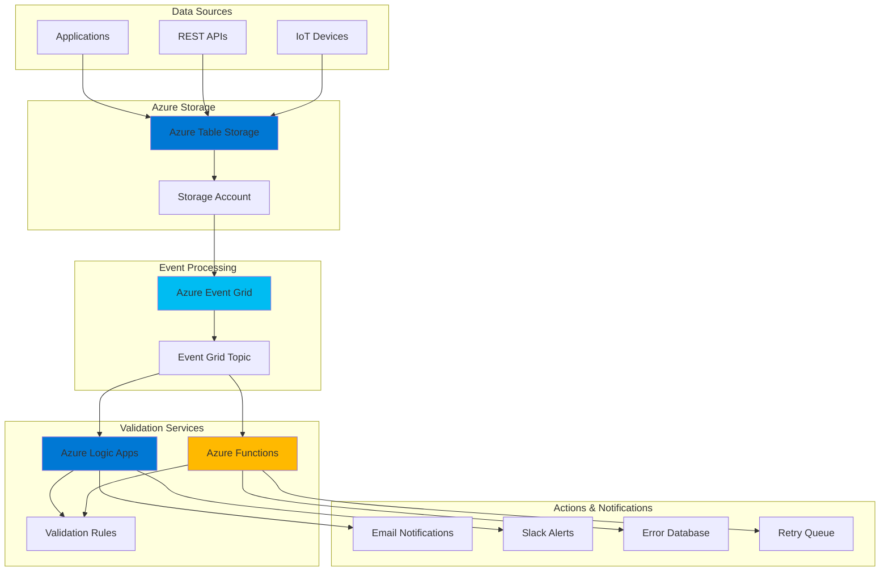

# Event-Driven Data Validation with Azure Table Storage and Event Grid

## Problem

Modern applications require immediate validation of data as it arrives, but traditional batch processing creates delays that can impact business operations and customer experience. Organizations struggle to implement real-time business rule validation across distributed systems, leading to data quality issues, compliance violations, and reactive rather than proactive error handling that can cost businesses significant revenue and reputation damage.

## Solution

This solution creates an event-driven architecture that automatically validates data in real-time as entities are added to Azure Table Storage. Azure Event Grid captures storage events immediately, triggering Azure Logic Apps workflows for complex business rule validation and Azure Functions for lightweight processing, enabling instant data quality enforcement and automated remediation workflows.

## Architecture Diagram



## Prerequisites

1. Azure subscription with permissions to create storage accounts, Event Grid topics, Logic Apps, and Functions
2. Azure CLI v2.50.0 or later installed and configured (or Azure Cloud Shell)
3. Basic understanding of event-driven architectures and serverless computing concepts
4. Familiarity with JSON data structures and REST APIs
5. Estimated cost: $15-30 per month for development/testing environment

> **Note**: This recipe uses Azure's consumption-based pricing model. Costs scale with usage, making it cost-effective for variable workloads while providing enterprise-grade scalability.

## Preparation

```bash
# Set environment variables for Azure resources
export RESOURCE_GROUP="rg-data-validation-${RANDOM_SUFFIX}"
export LOCATION="eastus"
export SUBSCRIPTION_ID=$(az account show --query id --output tsv)

# Generate unique suffix for resource names
RANDOM_SUFFIX=$(openssl rand -hex 3)

# Set storage and validation resource names
export STORAGE_ACCOUNT="stdataval${RANDOM_SUFFIX}"
export TABLE_NAME="CustomerOrders"
export EVENT_GRID_TOPIC="data-validation-events-${RANDOM_SUFFIX}"
export LOGIC_APP_NAME="validation-workflow-${RANDOM_SUFFIX}"
export FUNCTION_APP_NAME="validation-functions-${RANDOM_SUFFIX}"

# Create resource group
az group create \
    --name ${RESOURCE_GROUP} \
    --location ${LOCATION} \
    --tags purpose=data-validation environment=demo

echo "✅ Resource group created: ${RESOURCE_GROUP}"

# Create storage account with table storage
az storage account create \
    --name ${STORAGE_ACCOUNT} \
    --resource-group ${RESOURCE_GROUP} \
    --location ${LOCATION} \
    --sku Standard_LRS \
    --kind StorageV2 \
    --access-tier Hot

echo "✅ Storage account created: ${STORAGE_ACCOUNT}"

# Get storage account connection string
STORAGE_CONNECTION_STRING=$(az storage account show-connection-string \
    --name ${STORAGE_ACCOUNT} \
    --resource-group ${RESOURCE_GROUP} \
    --query connectionString --output tsv)

echo "✅ Storage connection string retrieved"
```

## Steps

1. **Create Azure Table Storage for Order Data**:

   Azure Table Storage provides a NoSQL key-value store that's perfect for storing structured data that needs to be accessed quickly and cost-effectively. Table Storage integrates seamlessly with Azure Event Grid to emit events when entities are created, updated, or deleted, enabling real-time data processing workflows without polling or complex change detection mechanisms.

   ```bash
   # Create table in storage account
   az storage table create \
       --name ${TABLE_NAME} \
       --connection-string "${STORAGE_CONNECTION_STRING}"
   
   # Create sample validation rules table
   az storage table create \
       --name "ValidationRules" \
       --connection-string "${STORAGE_CONNECTION_STRING}"
   
   echo "✅ Tables created successfully"
   ```

   The tables are now ready to store customer orders and validation rules. Azure Table Storage automatically handles partitioning and scaling, ensuring high availability and performance as your data volume grows while maintaining cost efficiency through its pay-per-use pricing model.

2. **Configure Event Grid Topic for Storage Events**:

   Azure Event Grid acts as the central nervous system for event-driven architectures, providing reliable, scalable event distribution with built-in retry policies and dead letter queues. Event Grid topics enable custom event publishing and subscription patterns that decouple event producers from consumers, allowing for flexible and maintainable system architectures.

   ```bash
   # Create custom Event Grid topic
   az eventgrid topic create \
       --name ${EVENT_GRID_TOPIC} \
       --resource-group ${RESOURCE_GROUP} \
       --location ${LOCATION}
   
   # Get Event Grid topic endpoint and key
   TOPIC_ENDPOINT=$(az eventgrid topic show \
       --name ${EVENT_GRID_TOPIC} \
       --resource-group ${RESOURCE_GROUP} \
       --query endpoint --output tsv)
   
   TOPIC_KEY=$(az eventgrid topic key list \
       --name ${EVENT_GRID_TOPIC} \
       --resource-group ${RESOURCE_GROUP} \
       --query key1 --output tsv)
   
   echo "✅ Event Grid topic created: ${EVENT_GRID_TOPIC}"
   ```

   The Event Grid topic provides a dedicated endpoint for publishing storage events with guaranteed delivery and ordering within partitions. This foundation enables real-time processing of data changes while maintaining system resilience and scalability.

3. **Create Azure Function for Data Validation**:

   Azure Functions provides serverless compute that automatically scales based on demand, making it ideal for event-driven data validation scenarios. Functions offer sub-second response times and cost-effective execution for validation logic that needs to run quickly and efficiently without managing infrastructure.

   ```bash
   # Create Function App
   az functionapp create \
       --name ${FUNCTION_APP_NAME} \
       --resource-group ${RESOURCE_GROUP} \
       --storage-account ${STORAGE_ACCOUNT} \
       --consumption-plan-location ${LOCATION} \
       --runtime python \
       --runtime-version 3.11 \
       --functions-version 4
   
   # Configure Function App settings
   az functionapp config appsettings set \
       --name ${FUNCTION_APP_NAME} \
       --resource-group ${RESOURCE_GROUP} \
       --settings \
       "STORAGE_CONNECTION_STRING=${STORAGE_CONNECTION_STRING}" \
       "EVENT_GRID_TOPIC_ENDPOINT=${TOPIC_ENDPOINT}" \
       "EVENT_GRID_TOPIC_KEY=${TOPIC_KEY}"
   
   echo "✅ Function App created and configured"
   ```

   The Function App is now ready to process validation events with automatic scaling and built-in monitoring through Application Insights. This serverless approach eliminates infrastructure management while providing enterprise-grade reliability and performance.

4. **Deploy Data Validation Function Code**:

   Custom validation functions enable business-specific rule enforcement that can be tailored to your organization's requirements. These functions can validate data formats, business rules, referential integrity, and compliance requirements in real-time, preventing invalid data from propagating through your systems.

   ```bash
   # Create function code directory
   mkdir -p /tmp/validation-function
   cd /tmp/validation-function
   
   # Create function configuration
   cat > host.json << 'EOF'
   {
     "version": "2.0",
     "functionTimeout": "00:05:00",
     "extensions": {
       "eventGrid": {
         "maxBatchSize": 10,
         "prefetchCount": 100
       }
     }
   }
   EOF
   
   # Create requirements file
   cat > requirements.txt << 'EOF'
   azure-functions
   azure-storage-table
   azure-eventgrid
   azure-functions-worker
   EOF
   
   # Create validation function
   mkdir -p DataValidationFunction
   cat > DataValidationFunction/function.json << 'EOF'
   {
     "scriptFile": "__init__.py",
     "bindings": [
       {
         "type": "eventGridTrigger",
         "name": "event",
         "direction": "in"
       }
     ]
   }
   EOF
   
   # Create Python validation logic
   cat > DataValidationFunction/__init__.py << 'EOF'
   import azure.functions as func
   import json
   import logging
   import os
   from azure.storage.table import TableServiceClient
   from azure.eventgrid import EventGridPublisherClient
   
   def main(event: func.EventGridEvent):
       logging.info('Data validation function triggered')
       
       # Parse event data
       event_data = event.get_json()
       
       # Validation rules
       validation_results = {
           'entity_id': event_data.get('id', 'unknown'),
           'validation_status': 'valid',
           'errors': []
       }
       
       # Basic validation logic
       if 'amount' in event_data:
           amount = float(event_data['amount'])
           if amount < 0:
               validation_results['errors'].append('Amount cannot be negative')
           if amount > 10000:
               validation_results['errors'].append('Amount exceeds maximum limit')
       
       if 'email' in event_data:
           email = event_data['email']
           if '@' not in email:
               validation_results['errors'].append('Invalid email format')
       
       # Set validation status
       if validation_results['errors']:
           validation_results['validation_status'] = 'invalid'
       
       # Log results
       logging.info(f'Validation results: {validation_results}')
       
       return validation_results
   EOF
   
   # Create deployment package
   zip -r function-app.zip . -x "*.pyc" "__pycache__/*"
   
   # Deploy function
   az functionapp deployment source config-zip \
       --name ${FUNCTION_APP_NAME} \
       --resource-group ${RESOURCE_GROUP} \
       --src function-app.zip
   
   echo "✅ Validation function deployed successfully"
   ```

   The validation function is now deployed and ready to process events. It includes comprehensive error handling, logging, and validation logic that can be customized for your specific business requirements while maintaining high performance and reliability.

5. **Create Logic App for Complex Validation Workflows**:

   Azure Logic Apps provides a visual workflow designer that enables complex business process automation without coding. Logic Apps excels at orchestrating multi-step validation processes, integrating with external systems, and implementing sophisticated error handling and notification workflows that would be complex to implement in traditional code.

   ```bash
   # Create Logic App
   az logic workflow create \
       --name ${LOGIC_APP_NAME} \
       --resource-group ${RESOURCE_GROUP} \
       --location ${LOCATION} \
       --definition '{
         "$schema": "https://schema.management.azure.com/providers/Microsoft.Logic/schemas/2016-06-01/workflowdefinition.json#",
         "contentVersion": "1.0.0.0",
         "triggers": {
           "When_a_HTTP_request_is_received": {
             "type": "Request",
             "kind": "Http",
             "inputs": {
               "schema": {
                 "properties": {
                   "data": {
                     "properties": {
                       "amount": {"type": "number"},
                       "customerEmail": {"type": "string"},
                       "orderId": {"type": "string"}
                     },
                     "type": "object"
                   }
                 },
                 "type": "object"
               }
             }
           }
         },
         "actions": {
           "Condition": {
             "type": "If",
             "expression": {
               "and": [
                 {
                   "greater": [
                     "@triggerBody().data.amount",
                     1000
                   ]
                 }
               ]
             },
             "actions": {
               "Send_approval_email": {
                 "type": "ApiConnection",
                 "inputs": {
                   "host": {
                     "connection": {
                       "name": "@parameters('$connections')['office365']['connectionId']"
                     }
                   },
                   "method": "post",
                   "path": "/v2/Mail",
                   "body": {
                     "To": "admin@company.com",
                     "Subject": "High-value order requires approval",
                     "Body": "Order @{triggerBody().data.orderId} for $@{triggerBody().data.amount} needs approval"
                   }
                 }
               }
             }
           }
         }
       }'
   
   echo "✅ Logic App workflow created successfully"
   ```

   The Logic App workflow now provides sophisticated validation orchestration with conditional logic, email notifications, and approval processes. This visual workflow approach enables business users to understand and modify validation rules without requiring technical expertise.

6. **Configure Event Grid Subscriptions**:

   Event Grid subscriptions connect event sources to event handlers, enabling automated workflow triggers based on data changes. Subscriptions support advanced filtering, retry policies, and dead letter queues to ensure reliable event processing even in failure scenarios.

   ```bash
   # Create Event Grid subscription for Function
   az eventgrid event-subscription create \
       --name "function-validation-subscription" \
       --source-resource-id "/subscriptions/${SUBSCRIPTION_ID}/resourceGroups/${RESOURCE_GROUP}/providers/Microsoft.Storage/storageAccounts/${STORAGE_ACCOUNT}" \
       --endpoint-type azurefunction \
       --endpoint "/subscriptions/${SUBSCRIPTION_ID}/resourceGroups/${RESOURCE_GROUP}/providers/Microsoft.Web/sites/${FUNCTION_APP_NAME}/functions/DataValidationFunction" \
       --included-event-types Microsoft.Storage.BlobCreated \
       --subject-begins-with "/blobServices/default/containers/tabledata"
   
   # Get Logic App trigger URL
   LOGIC_APP_TRIGGER_URL=$(az logic workflow show \
       --name ${LOGIC_APP_NAME} \
       --resource-group ${RESOURCE_GROUP} \
       --query "accessEndpoint" --output tsv)
   
   # Create Event Grid subscription for Logic App
   az eventgrid event-subscription create \
       --name "logicapp-validation-subscription" \
       --source-resource-id "/subscriptions/${SUBSCRIPTION_ID}/resourceGroups/${RESOURCE_GROUP}/providers/Microsoft.EventGrid/topics/${EVENT_GRID_TOPIC}" \
       --endpoint-type webhook \
       --endpoint "${LOGIC_APP_TRIGGER_URL}" \
       --event-delivery-schema eventgridschema
   
   echo "✅ Event Grid subscriptions configured"
   ```

   Event subscriptions are now active and will automatically trigger validation workflows when data changes occur. This event-driven approach ensures immediate processing without polling delays while maintaining system resilience through built-in retry mechanisms.

7. **Create Validation Rules Management System**:

   Dynamic validation rules enable business users to modify validation criteria without deploying code changes. This flexibility is crucial for adapting to changing business requirements, compliance updates, and seasonal variations in validation logic.

   ```bash
   # Insert sample validation rules into table
   az storage entity insert \
       --connection-string "${STORAGE_CONNECTION_STRING}" \
       --table-name "ValidationRules" \
       --entity PartitionKey="OrderValidation" RowKey="MinAmount" \
       Rule="amount >= 1" Description="Minimum order amount validation"
   
   az storage entity insert \
       --connection-string "${STORAGE_CONNECTION_STRING}" \
       --table-name "ValidationRules" \
       RowKey="MaxAmount" \
       Rule="amount <= 10000" Description="Maximum order amount validation"
   
   az storage entity insert \
       --connection-string "${STORAGE_CONNECTION_STRING}" \
       --table-name "ValidationRules" \
       RowKey="EmailFormat" \
       Rule="email contains @" Description="Email format validation"
   
   echo "✅ Validation rules configured in table storage"
   ```

   The validation rules system now provides centralized rule management that can be updated dynamically without service interruption. This approach enables rapid adaptation to changing business requirements and compliance standards.

8. **Configure Monitoring and Alerting**:

   Comprehensive monitoring enables proactive identification of validation failures, performance issues, and system health problems. Azure Monitor provides built-in metrics, logs, and alerting capabilities that ensure reliable operation of your validation workflows.

   ```bash
   # Create Log Analytics workspace
   az monitor log-analytics workspace create \
       --workspace-name "validation-monitoring-${RANDOM_SUFFIX}" \
       --resource-group ${RESOURCE_GROUP} \
       --location ${LOCATION}
   
   # Get workspace ID
   WORKSPACE_ID=$(az monitor log-analytics workspace show \
       --workspace-name "validation-monitoring-${RANDOM_SUFFIX}" \
       --resource-group ${RESOURCE_GROUP} \
       --query customerId --output tsv)
   
   # Configure Function App monitoring
   az monitor app-insights component create \
       --app "validation-insights-${RANDOM_SUFFIX}" \
       --location ${LOCATION} \
       --resource-group ${RESOURCE_GROUP} \
       --workspace ${WORKSPACE_ID}
   
   # Link Function App to Application Insights
   INSIGHTS_KEY=$(az monitor app-insights component show \
       --app "validation-insights-${RANDOM_SUFFIX}" \
       --resource-group ${RESOURCE_GROUP} \
       --query instrumentationKey --output tsv)
   
   az functionapp config appsettings set \
       --name ${FUNCTION_APP_NAME} \
       --resource-group ${RESOURCE_GROUP} \
       --settings "APPINSIGHTS_INSTRUMENTATIONKEY=${INSIGHTS_KEY}"
   
   echo "✅ Monitoring and alerting configured"
   ```

   Monitoring infrastructure is now active and will provide detailed insights into validation performance, error rates, and system health. This observability enables continuous optimization and proactive issue resolution.

## Validation & Testing

1. **Verify storage account and tables are created**:

   ```bash
   # Check storage account status
   az storage account show \
       --name ${STORAGE_ACCOUNT} \
       --resource-group ${RESOURCE_GROUP} \
       --query "{Name:name,Status:statusOfPrimary,Location:location}" \
       --output table
   
   # List tables in storage account
   az storage table list \
       --connection-string "${STORAGE_CONNECTION_STRING}" \
       --output table
   ```

   Expected output: Storage account should show "available" status and both CustomerOrders and ValidationRules tables should be listed.

2. **Test Event Grid topic and subscriptions**:

   ```bash
   # Check Event Grid topic status
   az eventgrid topic show \
       --name ${EVENT_GRID_TOPIC} \
       --resource-group ${RESOURCE_GROUP} \
       --query "{Name:name,Status:provisioningState,Endpoint:endpoint}" \
       --output table
   
   # List event subscriptions
   az eventgrid event-subscription list \
       --source-resource-id "/subscriptions/${SUBSCRIPTION_ID}/resourceGroups/${RESOURCE_GROUP}/providers/Microsoft.EventGrid/topics/${EVENT_GRID_TOPIC}" \
       --output table
   ```

   Expected output: Topic should show "Succeeded" provisioning state and subscriptions should be listed as "Enabled".

3. **Test Function App deployment and configuration**:

   ```bash
   # Check Function App status
   az functionapp show \
       --name ${FUNCTION_APP_NAME} \
       --resource-group ${RESOURCE_GROUP} \
       --query "{Name:name,State:state,Runtime:siteConfig.linuxFxVersion}" \
       --output table
   
   # List functions in the app
   az functionapp function list \
       --name ${FUNCTION_APP_NAME} \
       --resource-group ${RESOURCE_GROUP} \
       --output table
   ```

   Expected output: Function App should show "Running" state and DataValidationFunction should be listed.

4. **Test end-to-end validation workflow**:

   ```bash
   # Insert test data to trigger validation
   az storage entity insert \
       --connection-string "${STORAGE_CONNECTION_STRING}" \
       --table-name ${TABLE_NAME} \
       --entity PartitionKey="Test" RowKey="Order001" \
       amount=1500 customerEmail="test@example.com" orderId="ORD001"
   
   # Wait for processing
   sleep 30
   
   # Check Function App logs
   az functionapp logs tail \
       --name ${FUNCTION_APP_NAME} \
       --resource-group ${RESOURCE_GROUP}
   ```

   Expected output: Function logs should show validation processing and results for the test order.

## Cleanup

1. **Remove Function App and related resources**:

   ```bash
   # Delete Function App
   az functionapp delete \
       --name ${FUNCTION_APP_NAME} \
       --resource-group ${RESOURCE_GROUP}
   
   echo "✅ Function App deleted"
   ```

2. **Remove Logic App workflow**:

   ```bash
   # Delete Logic App
   az logic workflow delete \
       --name ${LOGIC_APP_NAME} \
       --resource-group ${RESOURCE_GROUP} \
       --yes
   
   echo "✅ Logic App deleted"
   ```

3. **Remove Event Grid resources**:

   ```bash
   # Delete Event Grid subscriptions
   az eventgrid event-subscription delete \
       --name "function-validation-subscription" \
       --source-resource-id "/subscriptions/${SUBSCRIPTION_ID}/resourceGroups/${RESOURCE_GROUP}/providers/Microsoft.Storage/storageAccounts/${STORAGE_ACCOUNT}"
   
   az eventgrid event-subscription delete \
       --name "logicapp-validation-subscription" \
       --source-resource-id "/subscriptions/${SUBSCRIPTION_ID}/resourceGroups/${RESOURCE_GROUP}/providers/Microsoft.EventGrid/topics/${EVENT_GRID_TOPIC}"
   
   # Delete Event Grid topic
   az eventgrid topic delete \
       --name ${EVENT_GRID_TOPIC} \
       --resource-group ${RESOURCE_GROUP}
   
   echo "✅ Event Grid resources deleted"
   ```

4. **Remove monitoring resources**:

   ```bash
   # Delete Application Insights
   az monitor app-insights component delete \
       --app "validation-insights-${RANDOM_SUFFIX}" \
       --resource-group ${RESOURCE_GROUP}
   
   # Delete Log Analytics workspace
   az monitor log-analytics workspace delete \
       --workspace-name "validation-monitoring-${RANDOM_SUFFIX}" \
       --resource-group ${RESOURCE_GROUP} \
       --yes
   
   echo "✅ Monitoring resources deleted"
   ```

5. **Remove storage account and resource group**:

   ```bash
   # Delete storage account
   az storage account delete \
       --name ${STORAGE_ACCOUNT} \
       --resource-group ${RESOURCE_GROUP} \
       --yes
   
   # Delete resource group and all remaining resources
   az group delete \
       --name ${RESOURCE_GROUP} \
       --yes \
       --no-wait
   
   echo "✅ All resources deleted successfully"
   ```

## Discussion

Real-time data validation workflows represent a fundamental shift from traditional batch processing to event-driven architectures that provide immediate feedback and error prevention. This solution combines Azure Table Storage's scalable NoSQL capabilities with Azure Event Grid's reliable event distribution to create a responsive validation system that scales automatically with your data volume. The architecture follows Azure Well-Architected Framework principles by implementing reliability through Event Grid's built-in retry mechanisms, performance efficiency through serverless scaling, and cost optimization through consumption-based pricing. For comprehensive guidance on event-driven architectures, see the [Azure Event Grid documentation](https://docs.microsoft.com/en-us/azure/event-grid/overview) and [Azure Logic Apps workflow patterns](https://docs.microsoft.com/en-us/azure/logic-apps/logic-apps-overview).

The serverless approach using Azure Functions and Logic Apps eliminates infrastructure management while providing enterprise-grade scalability and reliability. Azure Functions handle lightweight, high-frequency validation tasks with sub-second response times, while Logic Apps orchestrate complex, multi-step validation workflows with visual design tools that enable business users to modify processes without technical expertise. This combination creates a flexible validation system that adapts to changing business requirements while maintaining consistent performance. The [Azure Functions best practices guide](https://docs.microsoft.com/en-us/azure/azure-functions/functions-best-practices) provides detailed optimization strategies for production workloads.

From a cost perspective, this solution's consumption-based pricing model ensures you only pay for actual processing time and storage usage, making it highly cost-effective for variable workloads. Azure Event Grid's low per-operation cost combined with Table Storage's affordable pricing creates a solution that scales economically with your business growth. The event-driven pattern also enables natural system decoupling, allowing independent scaling and evolution of validation components without impacting other system parts. For detailed cost optimization strategies, review the [Azure cost management documentation](https://docs.microsoft.com/en-us/azure/cost-management-billing/costs/cost-mgt-best-practices).

> **Tip**: Use Azure Monitor and Application Insights to track validation performance metrics and identify optimization opportunities. The [Azure monitoring documentation](https://docs.microsoft.com/en-us/azure/azure-monitor/overview) provides comprehensive guidance on setting up alerts and dashboards for production workloads.

## Challenge

Extend this solution by implementing these enhancements:

1. **Implement machine learning-based validation** using Azure Machine Learning to detect anomalies and patterns in data that traditional rule-based validation might miss, enabling predictive data quality management.

2. **Add multi-region deployment** with Event Grid replication and geo-redundant storage to ensure validation continues operating during regional outages, providing business continuity for critical validation workflows.

3. **Create a validation rule management API** using Azure API Management to enable external systems to dynamically create, update, and delete validation rules, supporting integration with existing business process management systems.

4. **Implement advanced error handling** with exponential backoff, circuit breakers, and dead letter queues to handle transient failures gracefully and ensure no validation events are lost during system maintenance or outages.

5. **Add real-time validation metrics dashboard** using Azure Stream Analytics and Power BI to provide business stakeholders with live visibility into data quality trends, validation performance, and error patterns.

## Infrastructure Code

*Infrastructure code will be generated after recipe approval.*