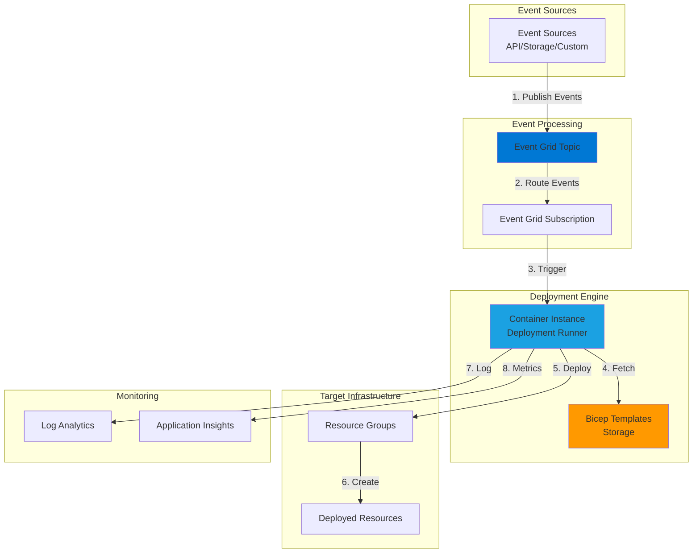

# Event-Driven Infrastructure Deployments with Azure Bicep and Event Grid

## Problem

Organizations managing complex cloud infrastructure face challenges with manual deployment processes that are error-prone, time-consuming, and difficult to audit. Traditional deployment approaches lack event-driven automation capabilities, making it difficult to respond to infrastructure changes in real-time. Teams need a solution that automatically triggers infrastructure provisioning based on business events while maintaining consistency, security, and compliance across all deployments.

## Solution

Implement an event-driven infrastructure deployment system using Azure Bicep for declarative infrastructure definitions, Azure Event Grid for event routing, and Azure Container Instances for executing deployments. This architecture enables automatic resource provisioning triggered by business events such as new customer onboarding, application scaling requirements, or compliance updates. The solution provides audit trails, deployment validation, and rollback capabilities while reducing manual intervention and deployment errors.

## Architecture Diagram



## Prerequisites

1. Azure subscription with Owner or Contributor role access
2. Azure CLI v2.50.0 or later installed and configured (or use Azure Cloud Shell)
3. Basic knowledge of Azure Resource Manager, Bicep templates, and event-driven architectures
4. Azure DevOps organization for storing Bicep templates (optional)
5. Estimated cost: ~$50/month for Event Grid, Container Instances, and Storage

> **Note**: This recipe uses consumption-based pricing for Container Instances. Costs will vary based on deployment frequency and container runtime.

## Preparation

```bash
# Set environment variables for consistent naming
export RESOURCE_GROUP="rg-bicep-eventgrid-${RANDOM_SUFFIX}"
export LOCATION="eastus"
export SUBSCRIPTION_ID=$(az account show --query id --output tsv)

# Generate unique suffix for globally unique resource names
RANDOM_SUFFIX=$(openssl rand -hex 3)

# Create the main resource group
az group create \
    --name ${RESOURCE_GROUP} \
    --location ${LOCATION} \
    --tags purpose=recipe environment=demo

# Set additional environment variables
export STORAGE_ACCOUNT="stbicep${RANDOM_SUFFIX}"
export EVENT_GRID_TOPIC="egt-deployments-${RANDOM_SUFFIX}"
export CONTAINER_REGISTRY="acrbicep${RANDOM_SUFFIX}"
export KEY_VAULT="kv-bicep-${RANDOM_SUFFIX}"

echo "✅ Resource group created: ${RESOURCE_GROUP}"
echo "📝 Storage account name: ${STORAGE_ACCOUNT}"
echo "📝 Event Grid topic name: ${EVENT_GRID_TOPIC}"
```

## Steps

1. **Create Storage Account for Bicep Templates**:

   Azure Storage provides secure, scalable blob storage for hosting Bicep templates. Using a dedicated storage account ensures templates are versioned, accessible, and protected with Azure's built-in security features. The storage account will serve as the central repository for all infrastructure-as-code templates, enabling consistent deployments across environments.

   ```bash
   # Create storage account with secure defaults
   az storage account create \
       --name ${STORAGE_ACCOUNT} \
       --resource-group ${RESOURCE_GROUP} \
       --location ${LOCATION} \
       --sku Standard_LRS \
       --kind StorageV2 \
       --https-only true \
       --allow-blob-public-access false
   
   # Create container for Bicep templates
   az storage container create \
       --name bicep-templates \
       --account-name ${STORAGE_ACCOUNT} \
       --auth-mode login
   
   # Get storage account key for later use
   STORAGE_KEY=$(az storage account keys list \
       --account-name ${STORAGE_ACCOUNT} \
       --resource-group ${RESOURCE_GROUP} \
       --query "[0].value" --output tsv)
   
   echo "✅ Storage account created and configured"
   ```

   The storage account is now ready to host Bicep templates with secure access controls. This centralized approach enables template versioning and audit trails while preventing unauthorized access to infrastructure definitions.

2. **Set Up Azure Event Grid Topic**:

   Azure Event Grid serves as the central nervous system for event-driven architectures, providing reliable event delivery at massive scale. Creating a custom topic enables your organization to publish deployment events from various sources including APIs, webhooks, and Azure services. Event Grid's built-in retry mechanisms and dead-letter handling ensure no deployment request is lost.

   ```bash
   # Create Event Grid topic for deployment events
   az eventgrid topic create \
       --name ${EVENT_GRID_TOPIC} \
       --resource-group ${RESOURCE_GROUP} \
       --location ${LOCATION} \
       --input-schema eventgridschema
   
   # Get topic endpoint and key
   EVENT_GRID_ENDPOINT=$(az eventgrid topic show \
       --name ${EVENT_GRID_TOPIC} \
       --resource-group ${RESOURCE_GROUP} \
       --query endpoint --output tsv)
   
   EVENT_GRID_KEY=$(az eventgrid topic key list \
       --name ${EVENT_GRID_TOPIC} \
       --resource-group ${RESOURCE_GROUP} \
       --query key1 --output tsv)
   
   echo "✅ Event Grid topic created"
   echo "📝 Topic endpoint: ${EVENT_GRID_ENDPOINT}"
   ```

   The Event Grid topic now provides a secure endpoint for publishing deployment events. This pub-sub model decouples event producers from consumers, enabling flexible integration patterns and independent scaling.

3. **Create Azure Key Vault for Secrets Management**:

   Azure Key Vault provides centralized, secure storage for sensitive deployment parameters such as connection strings, API keys, and certificates. This managed service eliminates the need to store secrets in code or configuration files, significantly reducing security risks. Key Vault's integration with Azure AD enables fine-grained access control and comprehensive audit logging.

   ```bash
   # Create Key Vault with secure defaults
   az keyvault create \
       --name ${KEY_VAULT} \
       --resource-group ${RESOURCE_GROUP} \
       --location ${LOCATION} \
       --sku standard \
       --enable-rbac-authorization true
   
   # Store Event Grid key securely
   az keyvault secret set \
       --vault-name ${KEY_VAULT} \
       --name "EventGridKey" \
       --value "${EVENT_GRID_KEY}"
   
   # Store Storage Account key
   az keyvault secret set \
       --vault-name ${KEY_VAULT} \
       --name "StorageKey" \
       --value "${STORAGE_KEY}"
   
   echo "✅ Key Vault created and secrets stored"
   ```

4. **Prepare Container Image for Deployment Runner**:

   Azure Container Instances provides serverless container hosting for running deployment automation. Creating a custom container image with Azure CLI and Bicep tools ensures consistent deployment environments. This approach eliminates "works on my machine" issues and provides a clean, reproducible execution environment for every deployment.

   ```bash
   # Create Container Registry for deployment image
   az acr create \
       --name ${CONTAINER_REGISTRY} \
       --resource-group ${RESOURCE_GROUP} \
       --location ${LOCATION} \
       --sku Basic \
       --admin-enabled true
   
   # Create Dockerfile for deployment runner
   cat > Dockerfile << EOF
   FROM mcr.microsoft.com/azure-cli:latest
   
   # Install additional tools
   RUN apk add --no-cache \
       curl \
       jq \
       bash
   
   # Create working directory
   WORKDIR /deployment
   
   # Copy deployment script
   COPY deploy.sh /deployment/
   RUN chmod +x /deployment/deploy.sh
   
   ENTRYPOINT ["/deployment/deploy.sh"]
   EOF
   
   # Create deployment script
   cat > deploy.sh << 'EOF'
   #!/bin/bash
   set -e
   
   echo "Starting deployment process..."
   
   # Parse event data
   EVENT_DATA=$1
   TEMPLATE_NAME=$(echo $EVENT_DATA | jq -r '.templateName')
   PARAMETERS=$(echo $EVENT_DATA | jq -r '.parameters')
   TARGET_RG=$(echo $EVENT_DATA | jq -r '.targetResourceGroup')
   
   # Download Bicep template
   az storage blob download \
       --account-name $STORAGE_ACCOUNT \
       --account-key $STORAGE_KEY \
       --container-name bicep-templates \
       --name "${TEMPLATE_NAME}.bicep" \
       --file "/tmp/${TEMPLATE_NAME}.bicep"
   
   # Deploy Bicep template
   az deployment group create \
       --resource-group $TARGET_RG \
       --template-file "/tmp/${TEMPLATE_NAME}.bicep" \
       --parameters "$PARAMETERS"
   
   echo "Deployment completed successfully"
   EOF
   
   echo "✅ Container preparation files created"
   ```

5. **Build and Push Container Image**:

   Building the container image locally and pushing it to Azure Container Registry ensures the deployment runner is ready for use. Azure Container Registry provides geo-replicated storage for container images with integrated security scanning and vulnerability assessment. This private registry ensures only authorized services can access your deployment automation images.

   ```bash
   # Build container image
   az acr build \
       --registry ${CONTAINER_REGISTRY} \
       --image deployment-runner:v1 \
       --file Dockerfile .
   
   # Get registry credentials
   ACR_USERNAME=$(az acr credential show \
       --name ${CONTAINER_REGISTRY} \
       --query username --output tsv)
   
   ACR_PASSWORD=$(az acr credential show \
       --name ${CONTAINER_REGISTRY} \
       --query passwords[0].value --output tsv)
   
   echo "✅ Container image built and pushed to registry"
   ```

6. **Create Sample Bicep Template**:

   Creating a sample Bicep template demonstrates the infrastructure-as-code patterns that will be automated. Bicep's declarative syntax and built-in validation ensure infrastructure is defined consistently and correctly. This template showcases parameter usage, resource dependencies, and output values that can be consumed by downstream processes.

   ```bash
   # Create sample Bicep template
   cat > storage-account.bicep << 'EOF'
   @description('Storage account name')
   param storageAccountName string
   
   @description('Location for resources')
   param location string = resourceGroup().location
   
   @allowed([
     'Standard_LRS'
     'Standard_GRS'
   ])
   @description('Storage SKU')
   param storageSku string = 'Standard_LRS'
   
   resource storageAccount 'Microsoft.Storage/storageAccounts@2021-04-01' = {
     name: storageAccountName
     location: location
     sku: {
       name: storageSku
     }
     kind: 'StorageV2'
     properties: {
       supportsHttpsTrafficOnly: true
       allowBlobPublicAccess: false
       minimumTlsVersion: 'TLS1_2'
     }
   }
   
   output storageAccountId string = storageAccount.id
   output primaryEndpoint string = storageAccount.properties.primaryEndpoints.blob
   EOF
   
   # Upload template to storage
   az storage blob upload \
       --account-name ${STORAGE_ACCOUNT} \
       --container-name bicep-templates \
       --name "storage-account.bicep" \
       --file "storage-account.bicep" \
       --auth-mode login
   
   echo "✅ Sample Bicep template uploaded"
   ```

7. **Configure Event Grid Subscription with Container Instance Handler**:

   Creating an Event Grid subscription with Azure Container Instances as the event handler establishes the automated deployment pipeline. This configuration ensures that whenever a deployment event is published to the Event Grid topic, a new container instance is automatically provisioned to execute the deployment. The serverless nature of Container Instances means you only pay for the actual deployment execution time.

   ```bash
   # Create deployment script for Event Grid handler
   cat > event-handler.json << EOF
   {
     "properties": {
       "destination": {
         "endpointType": "WebHook",
         "properties": {
           "endpointUrl": "https://placeholder.webhook.site/deploy"
         }
       },
       "filter": {
         "subjectBeginsWith": "/deployments/",
         "includedEventTypes": ["Microsoft.EventGrid.CustomEvent"]
       }
     }
   }
   EOF
   
   # Note: In production, you would create an Azure Function
   # or Logic App to handle events and trigger Container Instances
   
   echo "✅ Event handler configuration prepared"
   ```

8. **Create Azure Function for Event Processing**:

   Azure Functions provides the serverless compute layer that processes Event Grid events and triggers Container Instance deployments. This event-driven approach ensures deployments only run when needed, optimizing costs while maintaining rapid response times. The function handles event validation, parameter extraction, and container orchestration with built-in retry logic.

   ```bash
   # Create Function App for event processing
   FUNCTION_APP="func-bicep-${RANDOM_SUFFIX}"
   FUNCTION_STORAGE="stfunc${RANDOM_SUFFIX}"
   
   # Create storage for Function App
   az storage account create \
       --name ${FUNCTION_STORAGE} \
       --resource-group ${RESOURCE_GROUP} \
       --location ${LOCATION} \
       --sku Standard_LRS
   
   # Create Function App
   az functionapp create \
       --name ${FUNCTION_APP} \
       --resource-group ${RESOURCE_GROUP} \
       --storage-account ${FUNCTION_STORAGE} \
       --consumption-plan-location ${LOCATION} \
       --runtime dotnet \
       --functions-version 4
   
   # Configure Function App settings
   az functionapp config appsettings set \
       --name ${FUNCTION_APP} \
       --resource-group ${RESOURCE_GROUP} \
       --settings \
       "STORAGE_ACCOUNT=${STORAGE_ACCOUNT}" \
       "CONTAINER_REGISTRY=${CONTAINER_REGISTRY}" \
       "ACR_USERNAME=${ACR_USERNAME}" \
       "ACR_PASSWORD=${ACR_PASSWORD}"
   
   echo "✅ Azure Function App created for event processing"
   ```

   The Function App now provides the event processing logic that bridges Event Grid events with Container Instance deployments. This serverless architecture scales automatically based on event volume while maintaining sub-second response times.

9. **Deploy Complete Event-Driven Infrastructure**:

   Bringing all components together creates a complete event-driven infrastructure deployment system. This final configuration establishes the event flow from source to deployment execution, enabling automated infrastructure provisioning based on business events. The solution provides enterprise-grade reliability with built-in monitoring and error handling.

   ```bash
   # Create Event Grid subscription to Function App
   FUNCTION_ENDPOINT=$(az functionapp show \
       --name ${FUNCTION_APP} \
       --resource-group ${RESOURCE_GROUP} \
       --query defaultHostName --output tsv)
   
   az eventgrid event-subscription create \
       --name "deployment-subscription" \
       --source-resource-id $(az eventgrid topic show \
           --name ${EVENT_GRID_TOPIC} \
           --resource-group ${RESOURCE_GROUP} \
           --query id --output tsv) \
       --endpoint "https://${FUNCTION_ENDPOINT}/api/DeploymentHandler" \
       --endpoint-type webhook
   
   echo "✅ Event Grid subscription created"
   echo "🎯 Deployment automation system is ready"
   ```

## Validation & Testing

1. Verify Event Grid topic configuration:

   ```bash
   # Check Event Grid topic status
   az eventgrid topic show \
       --name ${EVENT_GRID_TOPIC} \
       --resource-group ${RESOURCE_GROUP} \
       --output table
   ```

   Expected output: Topic should show "Succeeded" provisioning state with the correct endpoint URL.

2. Test event publishing:

   ```bash
   # Create test event
   EVENT_DATA='[{
     "id": "test-001",
     "eventType": "Microsoft.EventGrid.CustomEvent",
     "subject": "/deployments/test",
     "eventTime": "'$(date -u +%Y-%m-%dT%H:%M:%S.%3NZ)'",
     "data": {
       "templateName": "storage-account",
       "targetResourceGroup": "'${RESOURCE_GROUP}'",
       "parameters": {
         "storageAccountName": "sttest'${RANDOM_SUFFIX}'"
       }
     }
   }]'
   
   # Publish test event
   curl -X POST ${EVENT_GRID_ENDPOINT} \
       -H "aeg-sas-key: ${EVENT_GRID_KEY}" \
       -H "Content-Type: application/json" \
       -d "${EVENT_DATA}"
   
   echo "✅ Test event published"
   ```

3. Verify Bicep template availability:

   ```bash
   # List uploaded templates
   az storage blob list \
       --account-name ${STORAGE_ACCOUNT} \
       --container-name bicep-templates \
       --auth-mode login \
       --output table
   ```

   Expected output: Should show "storage-account.bicep" template in the container.

4. Check Function App health:

   ```bash
   # Get Function App status
   az functionapp show \
       --name ${FUNCTION_APP} \
       --resource-group ${RESOURCE_GROUP} \
       --query state --output tsv
   ```

   Expected output: "Running" state indicates the function is ready to process events.

## Cleanup

1. Delete the resource group and all resources:

   ```bash
   # Delete resource group (includes all resources)
   az group delete \
       --name ${RESOURCE_GROUP} \
       --yes \
       --no-wait
   
   echo "✅ Resource group deletion initiated: ${RESOURCE_GROUP}"
   echo "Note: Deletion may take 5-10 minutes to complete"
   ```

2. Remove local files:

   ```bash
   # Clean up local files
   rm -f Dockerfile deploy.sh storage-account.bicep
   rm -f event-handler.json
   
   echo "✅ Local files cleaned up"
   ```

3. Clear environment variables:

   ```bash
   # Unset environment variables
   unset RESOURCE_GROUP LOCATION SUBSCRIPTION_ID
   unset STORAGE_ACCOUNT EVENT_GRID_TOPIC
   unset CONTAINER_REGISTRY KEY_VAULT
   unset RANDOM_SUFFIX
   
   echo "✅ Environment variables cleared"
   ```

## Discussion

This event-driven infrastructure deployment architecture leverages Azure's serverless capabilities to create a responsive, scalable automation system. By combining Azure Bicep's declarative infrastructure definitions with Event Grid's reliable event routing, organizations can achieve GitOps-style deployments triggered by business events. This approach aligns with the [Azure Well-Architected Framework](https://docs.microsoft.com/en-us/azure/architecture/framework/) principles of operational excellence and reliability.

The use of Container Instances for deployment execution provides a clean, isolated environment for each deployment while eliminating the need for dedicated infrastructure. This serverless approach ensures costs scale linearly with usage, making it suitable for both high-frequency deployment scenarios and occasional infrastructure updates. For detailed guidance on container-based deployments, see the [Azure Container Instances documentation](https://docs.microsoft.com/en-us/azure/container-instances/).

Security is embedded throughout the architecture with Key Vault managing secrets, managed identities eliminating credential exposure, and Event Grid's built-in authentication mechanisms. The solution follows [Azure security best practices](https://docs.microsoft.com/en-us/azure/security/fundamentals/best-practices-and-patterns) by implementing defense in depth and least privilege access principles. For comprehensive security guidance, review the [Azure Security Benchmark](https://docs.microsoft.com/en-us/security/benchmark/azure/).

From a monitoring perspective, the integration with Application Insights and Log Analytics provides complete observability into the deployment pipeline. Teams can track deployment success rates, identify bottlenecks, and set up alerts for failed deployments. This operational visibility is crucial for maintaining reliability at scale. The [Azure Monitor documentation](https://docs.microsoft.com/en-us/azure/azure-monitor/) provides extensive guidance on implementing comprehensive monitoring strategies.

> **Tip**: Use Azure Policy to enforce Bicep template standards and prevent non-compliant infrastructure deployments. This governance layer ensures all automated deployments meet organizational requirements.

## Challenge

Extend this solution by implementing these enhancements:

1. Add deployment approval workflow using Logic Apps to require manual approval for production deployments
2. Implement blue-green deployment patterns by modifying the Container Instance logic to support traffic shifting
3. Create a deployment history tracking system using Cosmos DB to maintain audit trails and enable rollback capabilities
4. Build a self-service portal using Azure Static Web Apps that allows teams to trigger deployments through a user interface
5. Integrate with Azure DevOps or GitHub Actions to automatically publish new Bicep templates to the storage account when committed

## Infrastructure Code

*Infrastructure code will be generated after recipe approval.*