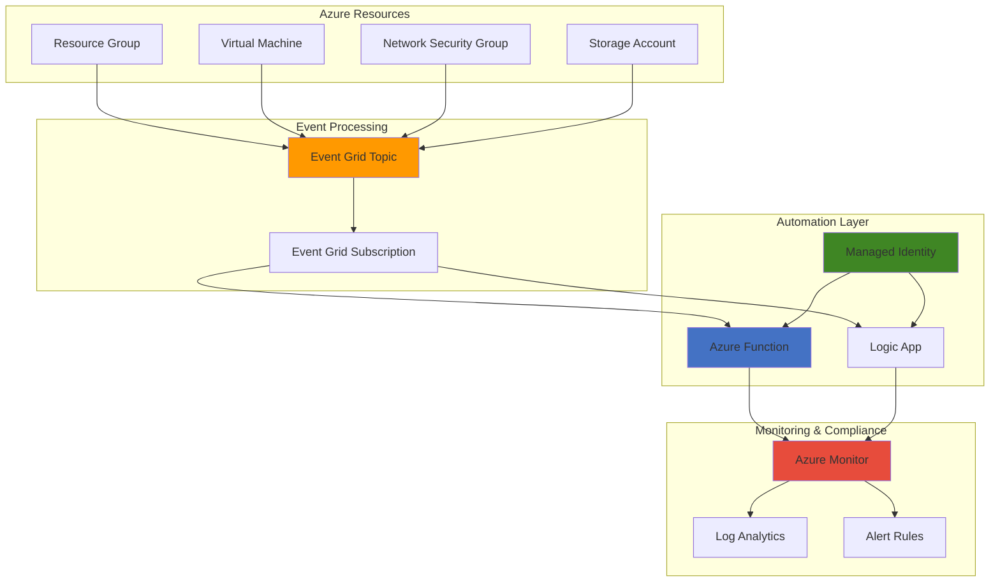

# Event-Driven Security Governance with Event Grid and Managed Identity

## Problem

Enterprise organizations struggle with maintaining continuous security compliance across their Azure environments due to rapid resource deployment and configuration changes. Manual security audits and remediation processes cannot keep pace with cloud-native development cycles, leading to compliance gaps, security vulnerabilities, and potential regulatory violations that pose significant business and financial risks.

## Solution

Build an event-driven security governance system using Azure Event Grid to automatically detect resource changes and Azure Managed Identity to securely execute compliance checks and remediation actions. This solution eliminates credential management overhead while providing real-time security monitoring and automated response capabilities for maintaining continuous compliance posture.

## Architecture Diagram



## Prerequisites

1. Azure subscription with Contributor permissions
2. Azure CLI v2.50.0 or later installed and configured
3. Basic understanding of Azure Event Grid and Managed Identity concepts
4. Knowledge of Azure Resource Manager and PowerShell/Bash scripting
5. Estimated cost: $5-15 per month for testing resources (varies by region and usage)

> **Note**: This recipe uses system-assigned managed identities for enhanced security. Review the [Azure Managed Identity documentation](https://docs.microsoft.com/en-us/azure/active-directory/managed-identities-azure-resources/overview) for detailed security considerations.

## Preparation

```bash
# Set environment variables for Azure resources
export RESOURCE_GROUP="rg-security-governance-${RANDOM_SUFFIX}"
export LOCATION="eastus"
export SUBSCRIPTION_ID=$(az account show --query id --output tsv)

# Generate unique suffix for resource names
RANDOM_SUFFIX=$(openssl rand -hex 3)

# Set specific resource names
export EVENT_GRID_TOPIC="eg-security-governance-${RANDOM_SUFFIX}"
export FUNCTION_APP="func-security-${RANDOM_SUFFIX}"
export STORAGE_ACCOUNT="stsecurity${RANDOM_SUFFIX}"
export LOG_ANALYTICS_WORKSPACE="law-security-${RANDOM_SUFFIX}"
export ACTION_GROUP="ag-security-${RANDOM_SUFFIX}"

# Create resource group with proper tags
az group create \
    --name ${RESOURCE_GROUP} \
    --location ${LOCATION} \
    --tags purpose=security-governance environment=demo \
           owner=admin compliance=required

echo "✅ Resource group created: ${RESOURCE_GROUP}"

# Create Log Analytics workspace for centralized logging
az monitor log-analytics workspace create \
    --resource-group ${RESOURCE_GROUP} \
    --workspace-name ${LOG_ANALYTICS_WORKSPACE} \
    --location ${LOCATION} \
    --tags purpose=compliance-monitoring

WORKSPACE_ID=$(az monitor log-analytics workspace show \
    --resource-group ${RESOURCE_GROUP} \
    --workspace-name ${LOG_ANALYTICS_WORKSPACE} \
    --query customerId --output tsv)

echo "✅ Log Analytics workspace created with ID: ${WORKSPACE_ID}"
```

## Steps

1. **Create Event Grid Custom Topic for Security Events**:

   Azure Event Grid provides the foundation for event-driven security workflows by capturing resource lifecycle events in real-time. A custom topic enables centralized event collection and routing, supporting multiple publishers and subscribers for comprehensive security monitoring across your Azure environment.

   ```bash
   # Create Event Grid custom topic
   az eventgrid topic create \
       --name ${EVENT_GRID_TOPIC} \
       --resource-group ${RESOURCE_GROUP} \
       --location ${LOCATION} \
       --tags purpose=security-events compliance=required
   
   # Get topic endpoint and access key
   TOPIC_ENDPOINT=$(az eventgrid topic show \
       --name ${EVENT_GRID_TOPIC} \
       --resource-group ${RESOURCE_GROUP} \
       --query endpoint --output tsv)
   
   TOPIC_KEY=$(az eventgrid topic key list \
       --name ${EVENT_GRID_TOPIC} \
       --resource-group ${RESOURCE_GROUP} \
       --query key1 --output tsv)
   
   echo "✅ Event Grid topic created at: ${TOPIC_ENDPOINT}"
   ```

   The Event Grid topic now serves as the central hub for security-related events. This configuration enables real-time event collection with built-in reliability, automatic retry mechanisms, and dead-letter handling for mission-critical security workflows.

2. **Create Storage Account for Function App**:

   Azure Functions requires a storage account for runtime operations, state management, and trigger coordination. This storage account also serves as a repository for compliance artifacts, audit logs, and temporary data processing during security remediation workflows.

   ```bash
   # Create storage account for Function App
   az storage account create \
       --name ${STORAGE_ACCOUNT} \
       --resource-group ${RESOURCE_GROUP} \
       --location ${LOCATION} \
       --sku Standard_LRS \
       --kind StorageV2 \
       --access-tier Hot \
       --tags purpose=function-storage compliance=required
   
   # Retrieve storage connection string
   STORAGE_CONNECTION=$(az storage account show-connection-string \
       --name ${STORAGE_ACCOUNT} \
       --resource-group ${RESOURCE_GROUP} \
       --query connectionString --output tsv)
   
   echo "✅ Storage account created for Function App support"
   ```

   The storage account provides the necessary backend infrastructure for Azure Functions with optimized performance for frequent access patterns. Hot access tier ensures low-latency operations for real-time security processing requirements.

3. **Create Azure Function App with System-Assigned Managed Identity**:

   Azure Functions provides serverless compute capabilities for processing security events with automatic scaling and cost efficiency. System-assigned managed identity eliminates credential management overhead while providing secure access to Azure resources for compliance checking and remediation actions.

   ```bash
   # Create Function App with consumption plan
   az functionapp create \
       --name ${FUNCTION_APP} \
       --resource-group ${RESOURCE_GROUP} \
       --storage-account ${STORAGE_ACCOUNT} \
       --consumption-plan-location ${LOCATION} \
       --runtime python \
       --runtime-version 3.11 \
       --functions-version 4 \
       --assign-identity \
       --tags purpose=security-automation compliance=required
   
   # Get the managed identity principal ID
   FUNCTION_PRINCIPAL_ID=$(az functionapp identity show \
       --name ${FUNCTION_APP} \
       --resource-group ${RESOURCE_GROUP} \
       --query principalId --output tsv)
   
   echo "✅ Function App created with managed identity: ${FUNCTION_PRINCIPAL_ID}"
   ```

   The Function App is now configured with system-assigned managed identity, providing secure, credential-free authentication to Azure services. This serverless architecture ensures cost-effective operation with automatic scaling based on security event volume.

4. **Assign RBAC Permissions to Managed Identity**:

   Role-Based Access Control (RBAC) assignments grant the Function App's managed identity specific permissions required for security governance tasks. These permissions follow the principle of least privilege while enabling comprehensive resource monitoring and limited remediation capabilities.

   ```bash
   # Assign Security Reader role for compliance checking
   az role assignment create \
       --assignee ${FUNCTION_PRINCIPAL_ID} \
       --role "Security Reader" \
       --scope "/subscriptions/${SUBSCRIPTION_ID}/resourceGroups/${RESOURCE_GROUP}"
   
   # Assign Contributor role for remediation actions
   az role assignment create \
       --assignee ${FUNCTION_PRINCIPAL_ID} \
       --role "Contributor" \
       --scope "/subscriptions/${SUBSCRIPTION_ID}/resourceGroups/${RESOURCE_GROUP}"
   
   # Assign Monitoring Contributor for Azure Monitor operations
   az role assignment create \
       --assignee ${FUNCTION_PRINCIPAL_ID} \
       --role "Monitoring Contributor" \
       --scope "/subscriptions/${SUBSCRIPTION_ID}/resourceGroups/${RESOURCE_GROUP}"
   
   echo "✅ RBAC permissions assigned to Function App managed identity"
   ```

   The managed identity now has appropriate permissions for security monitoring and automated remediation within the specified scope. These role assignments enable the Function App to read security configurations, modify non-compliant resources, and create monitoring alerts.

5. **Configure Function App Settings for Event Grid Integration**:

   Application settings configure the Function App runtime environment with necessary connection strings, endpoints, and configuration values. These settings enable seamless integration with Event Grid and other Azure services while maintaining security best practices for sensitive information management.

   ```bash
   # Configure Function App settings
   az functionapp config appsettings set \
       --name ${FUNCTION_APP} \
       --resource-group ${RESOURCE_GROUP} \
       --settings "EventGridTopicEndpoint=${TOPIC_ENDPOINT}" \
                  "EventGridTopicKey=${TOPIC_KEY}" \
                  "LogAnalyticsWorkspaceId=${WORKSPACE_ID}" \
                  "FUNCTIONS_WORKER_RUNTIME=python" \
                  "AzureWebJobsFeatureFlags=EnableWorkerIndexing"
   
   # Enable Application Insights for monitoring
   az functionapp config appsettings set \
       --name ${FUNCTION_APP} \
       --resource-group ${RESOURCE_GROUP} \
       --settings "APPINSIGHTS_INSTRUMENTATIONKEY=$(az monitor app-insights component create \
                      --app ${FUNCTION_APP}-insights \
                      --location ${LOCATION} \
                      --resource-group ${RESOURCE_GROUP} \
                      --workspace ${LOG_ANALYTICS_WORKSPACE} \
                      --query instrumentationKey --output tsv)"
   
   echo "✅ Function App configured with Event Grid and monitoring settings"
   ```

   The Function App configuration now includes all necessary connection details for Event Grid integration and comprehensive monitoring capabilities. Application Insights integration provides detailed telemetry for troubleshooting and performance optimization.

6. **Create Event Grid Subscription for Resource Changes**:

   Event Grid subscriptions define the routing and filtering logic for security-relevant events. This subscription captures resource lifecycle events and configuration changes, enabling real-time security assessment and automated response workflows based on organizational compliance requirements.

   ```bash
   # Create Event Grid subscription for resource events
   az eventgrid event-subscription create \
       --name "security-governance-subscription" \
       --source-resource-id "/subscriptions/${SUBSCRIPTION_ID}/resourceGroups/${RESOURCE_GROUP}" \
       --endpoint-type azurefunction \
       --endpoint "/subscriptions/${SUBSCRIPTION_ID}/resourceGroups/${RESOURCE_GROUP}/providers/Microsoft.Web/sites/${FUNCTION_APP}/functions/SecurityEventProcessor" \
       --included-event-types Microsoft.Resources.ResourceWriteSuccess \
                               Microsoft.Resources.ResourceDeleteSuccess \
                               Microsoft.Resources.ResourceActionSuccess \
       --advanced-filter data.operationName StringBeginsWith Microsoft.Compute/virtualMachines \
                          data.operationName StringBeginsWith Microsoft.Network/networkSecurityGroups \
                          data.operationName StringBeginsWith Microsoft.Storage/storageAccounts
   
   echo "✅ Event Grid subscription created for resource monitoring"
   ```

   The Event Grid subscription now actively monitors critical resource operations within the resource group. Advanced filtering ensures only security-relevant events trigger processing, optimizing performance and reducing unnecessary function executions while maintaining comprehensive coverage.

7. **Deploy Security Assessment Function Code**:

   The security assessment function implements the core compliance checking logic, evaluating resource configurations against security baselines and organizational policies. This serverless code processes Event Grid events and executes automated remediation actions when policy violations are detected.

   ```bash
   # Create function code directory
   mkdir -p security-function
   cd security-function
   
   # Create function configuration
   cat > function.json << 'EOF'
   {
     "scriptFile": "__init__.py",
     "bindings": [
       {
         "authLevel": "function",
         "type": "eventGridTrigger",
         "direction": "in",
         "name": "event"
       }
     ]
   }
   EOF
   
   # Create Python function code
   cat > __init__.py << 'EOF'
   import azure.functions as func
   import json
   import logging
   from azure.identity import DefaultAzureCredential
   from azure.mgmt.resource import ResourceManagementClient
   from azure.mgmt.monitor import MonitorManagementClient
   
   def main(event: func.EventGridEvent):
       logging.info(f'Processing security event: {event.get_json()}')
       
       # Parse event data
       event_data = event.get_json()
       resource_uri = event_data.get('subject', '')
       operation_name = event_data.get('data', {}).get('operationName', '')
       
       # Initialize Azure clients with managed identity
       credential = DefaultAzureCredential()
       
       # Perform security assessment based on resource type
       if 'Microsoft.Compute/virtualMachines' in operation_name:
           assess_vm_security(resource_uri, credential)
       elif 'Microsoft.Network/networkSecurityGroups' in operation_name:
           assess_nsg_security(resource_uri, credential)
       elif 'Microsoft.Storage/storageAccounts' in operation_name:
           assess_storage_security(resource_uri, credential)
   
   def assess_vm_security(resource_uri, credential):
       logging.info(f'Assessing VM security for: {resource_uri}')
       # Implementation for VM security checks
       
   def assess_nsg_security(resource_uri, credential):
       logging.info(f'Assessing NSG security for: {resource_uri}')
       # Implementation for NSG security checks
       
   def assess_storage_security(resource_uri, credential):
       logging.info(f'Assessing Storage security for: {resource_uri}')
       # Implementation for Storage security checks
   EOF
   
   # Create requirements file
   cat > requirements.txt << 'EOF'
   azure-functions
   azure-identity
   azure-mgmt-resource
   azure-mgmt-monitor
   azure-mgmt-storage
   azure-mgmt-compute
   azure-mgmt-network
   EOF
   
   # Package and deploy function
   zip -r ../security-function.zip .
   cd ..
   
   az functionapp deployment source config-zip \
       --name ${FUNCTION_APP} \
       --resource-group ${RESOURCE_GROUP} \
       --src security-function.zip
   
   echo "✅ Security assessment function deployed successfully"
   ```

   The security assessment function is now deployed and ready to process Event Grid events. This function leverages managed identity for secure Azure API access and implements extensible security checking logic that can be customized for specific organizational compliance requirements.

8. **Create Azure Monitor Alert Rules for Security Events**:

   Azure Monitor alert rules provide proactive notification and escalation capabilities for security violations and compliance failures. These rules complement automated remediation by alerting security teams to critical issues requiring human intervention or policy updates.

   ```bash
   # Create Action Group for alert notifications
   az monitor action-group create \
       --name ${ACTION_GROUP} \
       --resource-group ${RESOURCE_GROUP} \
       --short-name "SecAlert" \
       --email-receivers name="SecurityTeam" email="security@company.com"
   
   # Create alert rule for security violations using correct syntax
   az monitor metrics alert create \
       --name "SecurityViolationAlert" \
       --resource-group ${RESOURCE_GROUP} \
       --scopes "/subscriptions/${SUBSCRIPTION_ID}/resourceGroups/${RESOURCE_GROUP}/providers/Microsoft.Web/sites/${FUNCTION_APP}" \
       --condition "count FunctionExecutionCount > 5" \
       --window-size 5m \
       --evaluation-frequency 1m \
       --action ${ACTION_GROUP} \
       --description "Alert when security violations exceed threshold" \
       --severity 2
   
   # Create alert rule for function failures
   az monitor metrics alert create \
       --name "SecurityFunctionFailureAlert" \
       --resource-group ${RESOURCE_GROUP} \
       --scopes "/subscriptions/${SUBSCRIPTION_ID}/resourceGroups/${RESOURCE_GROUP}/providers/Microsoft.Web/sites/${FUNCTION_APP}" \
       --condition "count FunctionExecutionFailures > 0" \
       --window-size 5m \
       --evaluation-frequency 1m \
       --action ${ACTION_GROUP} \
       --description "Alert when security function executions fail" \
       --severity 1
   
   echo "✅ Azure Monitor alert rules configured for security governance"
   ```

   The monitoring infrastructure now provides comprehensive alerting for both security violations and system health issues. These alerts enable rapid response to security incidents while ensuring the governance system itself remains operational and effective.

## Validation & Testing

1. Verify Event Grid topic and subscription configuration:

   ```bash
   # Check Event Grid topic status
   az eventgrid topic show \
       --name ${EVENT_GRID_TOPIC} \
       --resource-group ${RESOURCE_GROUP} \
       --query "{name:name,endpoint:endpoint,provisioningState:provisioningState}"
   
   # List Event Grid subscriptions
   az eventgrid event-subscription list \
       --source-resource-id "/subscriptions/${SUBSCRIPTION_ID}/resourceGroups/${RESOURCE_GROUP}" \
       --query "[].{name:name,destination:destination.endpointType,provisioningState:provisioningState}"
   ```

   Expected output: Topic shows "Succeeded" provisioning state and subscription shows "azurefunction" endpoint type.

2. Test Function App managed identity and permissions:

   ```bash
   # Verify managed identity is enabled
   az functionapp identity show \
       --name ${FUNCTION_APP} \
       --resource-group ${RESOURCE_GROUP} \
       --query "{type:type,principalId:principalId,tenantId:tenantId}"
   
   # Check RBAC assignments
   az role assignment list \
       --assignee ${FUNCTION_PRINCIPAL_ID} \
       --query "[].{roleDefinitionName:roleDefinitionName,scope:scope}"
   ```

   Expected output: Identity type shows "SystemAssigned" and role assignments include Security Reader, Contributor, and Monitoring Contributor.

3. Validate security event processing by creating a test resource:

   ```bash
   # Create a test VM to trigger security events
   az vm create \
       --name "test-vm-${RANDOM_SUFFIX}" \
       --resource-group ${RESOURCE_GROUP} \
       --image Ubuntu2204 \
       --size Standard_B1s \
       --admin-username azureuser \
       --generate-ssh-keys \
       --tags purpose=security-test
   
   # Wait for event processing
   sleep 30
   
   # Check function execution logs
   az functionapp logs tail \
       --name ${FUNCTION_APP} \
       --resource-group ${RESOURCE_GROUP}
   ```

   Expected output: Function logs should show security event processing for the VM creation operation.

## Cleanup

1. Remove test resources and Function App:

   ```bash
   # Delete test VM
   az vm delete \
       --name "test-vm-${RANDOM_SUFFIX}" \
       --resource-group ${RESOURCE_GROUP} \
       --yes
   
   # Delete Function App
   az functionapp delete \
       --name ${FUNCTION_APP} \
       --resource-group ${RESOURCE_GROUP}
   
   echo "✅ Test resources and Function App deleted"
   ```

2. Remove Event Grid resources:

   ```bash
   # Delete Event Grid subscription
   az eventgrid event-subscription delete \
       --name "security-governance-subscription" \
       --source-resource-id "/subscriptions/${SUBSCRIPTION_ID}/resourceGroups/${RESOURCE_GROUP}"
   
   # Delete Event Grid topic
   az eventgrid topic delete \
       --name ${EVENT_GRID_TOPIC} \
       --resource-group ${RESOURCE_GROUP}
   
   echo "✅ Event Grid resources deleted"
   ```

3. Remove monitoring and storage resources:

   ```bash
   # Delete alert rules and action group
   az monitor metrics alert delete \
       --name "SecurityViolationAlert" \
       --resource-group ${RESOURCE_GROUP}
   
   az monitor metrics alert delete \
       --name "SecurityFunctionFailureAlert" \
       --resource-group ${RESOURCE_GROUP}
   
   az monitor action-group delete \
       --name ${ACTION_GROUP} \
       --resource-group ${RESOURCE_GROUP}
   
   # Delete Log Analytics workspace
   az monitor log-analytics workspace delete \
       --resource-group ${RESOURCE_GROUP} \
       --workspace-name ${LOG_ANALYTICS_WORKSPACE} \
       --yes
   
   # Delete storage account
   az storage account delete \
       --name ${STORAGE_ACCOUNT} \
       --resource-group ${RESOURCE_GROUP} \
       --yes
   
   echo "✅ Monitoring and storage resources deleted"
   ```

4. Remove resource group and all remaining resources:

   ```bash
   # Delete resource group and all contained resources
   az group delete \
       --name ${RESOURCE_GROUP} \
       --yes \
       --no-wait
   
   echo "✅ Resource group deletion initiated: ${RESOURCE_GROUP}"
   echo "Note: Deletion may take several minutes to complete"
   
   # Verify deletion (optional)
   az group exists --name ${RESOURCE_GROUP}
   ```

## Discussion

This automated security governance solution demonstrates the power of event-driven architecture for maintaining continuous compliance in Azure environments. Azure Event Grid provides reliable, low-latency event delivery that enables real-time security monitoring across your entire Azure footprint. The combination with Azure Managed Identity eliminates the security risks and operational overhead associated with traditional credential management while ensuring secure, authenticated access to Azure resources. For comprehensive guidance on event-driven architectures, see the [Azure Event Grid documentation](https://docs.microsoft.com/en-us/azure/event-grid/) and [managed identity best practices](https://docs.microsoft.com/en-us/azure/active-directory/managed-identities-azure-resources/overview).

The serverless architecture using Azure Functions provides cost-effective scaling that automatically adjusts to your security event volume, from small development environments to large enterprise deployments. Event Grid's advanced filtering capabilities ensure that only security-relevant events trigger processing, optimizing both performance and cost while maintaining comprehensive coverage. This approach aligns with the [Azure Well-Architected Framework](https://docs.microsoft.com/en-us/azure/architecture/framework/) principles of reliability, security, and cost optimization by automating manual processes and reducing human error in security operations.

From an operational perspective, this solution enables security teams to implement "shift-left" security practices by catching compliance violations immediately upon resource creation or modification. The automated remediation capabilities can enforce organizational security policies consistently across all environments, while the monitoring and alerting infrastructure ensures that security teams remain informed about both successful remediations and any issues requiring manual intervention. This proactive approach significantly reduces the mean time to detection (MTTD) and mean time to remediation (MTTR) for security compliance issues.

Integration with Azure Monitor and Log Analytics provides comprehensive visibility into both security events and the governance system's operational health. This observability enables continuous improvement of security policies and remediation logic based on actual deployment patterns and threat landscapes. For detailed monitoring strategies, review the [Azure Monitor documentation](https://docs.microsoft.com/en-us/azure/azure-monitor/) and [security monitoring best practices](https://docs.microsoft.com/en-us/azure/security/fundamentals/operational-best-practices).

> **Tip**: Implement gradual rollout of automated remediation by starting with monitoring-only mode, then enabling remediation for low-risk violations before expanding to critical security controls. Use Azure Policy integration for additional compliance checking capabilities and standardized policy definitions.

## Challenge

Extend this security governance solution by implementing these enhancements:

1. **Multi-Environment Compliance**: Configure cross-subscription Event Grid integration to monitor security compliance across development, staging, and production environments with environment-specific remediation rules and escalation workflows.

2. **Advanced Threat Detection**: Integrate with Azure Security Center and Azure Sentinel to correlate security events with threat intelligence, enabling automated response to detected attack patterns and suspicious resource modifications.

3. **Policy-as-Code Integration**: Implement Azure Policy and Azure Resource Manager template validation to prevent non-compliant resource deployments at creation time, combining preventive and detective security controls.

4. **Compliance Reporting Dashboard**: Build Power BI or Azure Dashboard visualizations showing compliance trends, remediation success rates, and security posture metrics with automated report generation for audit and management review.

5. **Self-Healing Infrastructure**: Develop advanced remediation logic that can automatically fix common security misconfigurations like open network security group rules, unencrypted storage accounts, and missing backup configurations while maintaining detailed audit trails.

## Infrastructure Code

### Available Infrastructure as Code:

- [Infrastructure Code Overview](code/README.md) - Detailed description of all infrastructure components
- [Bicep](code/bicep/) - Azure Bicep templates
- [Bash CLI Scripts](code/scripts/) - Example bash scripts using Azure CLI commands to deploy infrastructure
- [Terraform](code/terraform/) - Terraform configuration files