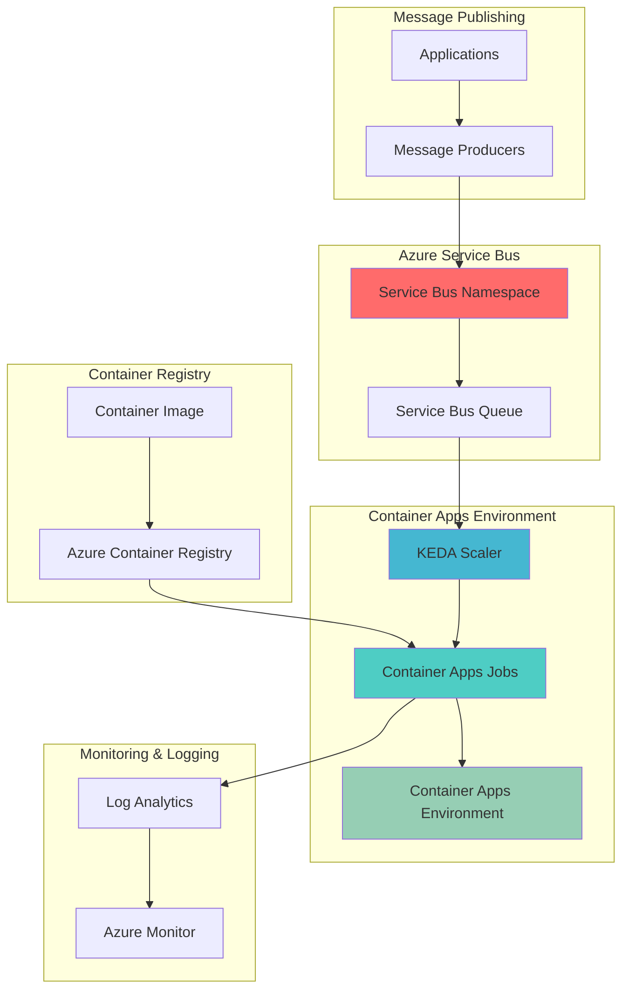

# Event-Driven Serverless Workflows with Azure Container Apps Jobs and Azure Service Bus

## Problem

Organizations need to process messages from queues at scale without managing underlying infrastructure, but traditional serverless solutions have limitations in handling complex containerized workloads. Development teams struggle with implementing event-driven architectures that can automatically scale based on message volume, process messages reliably with retry mechanisms, and maintain cost-effectiveness by only running when work is available.

## Solution

Azure Container Apps Jobs combined with Azure Service Bus creates a powerful event-driven serverless architecture that automatically scales containerized workloads based on queue depth. This solution leverages KEDA (Kubernetes Event-driven Autoscaling) to trigger job executions when messages arrive in Service Bus queues, providing automatic scaling, retry capabilities, and cost optimization through pay-per-execution pricing.

## Architecture Diagram



## Prerequisites

1. Azure subscription with Container Apps and Service Bus permissions
2. Azure CLI 2.51.0 or later installed and configured
3. Docker Desktop or equivalent container runtime (for local development)
4. Basic understanding of containerization and message queues
5. Estimated cost: $5-15 USD for tutorial completion (mostly Container Registry and Service Bus)

> **Note**: This recipe uses Azure Container Apps Jobs which leverage KEDA for event-driven scaling. Review the [KEDA Azure Service Bus scaler documentation](https://keda.sh/docs/scalers/azure-service-bus/) for advanced configuration options.

## Preparation

```bash
# Set environment variables for Azure resources
export RESOURCE_GROUP="rg-container-jobs-${RANDOM_SUFFIX}"
export LOCATION="eastus"
export ENVIRONMENT_NAME="env-container-jobs"
export QUEUE_NAME="message-processing-queue"
export JOB_NAME="message-processor-job"
export CONTAINER_IMAGE_NAME="message-processor:1.0"

# Generate unique suffix for global resources
RANDOM_SUFFIX=$(openssl rand -hex 3)
export SERVICE_BUS_NAMESPACE="sb-container-jobs-${RANDOM_SUFFIX}"
export CONTAINER_REGISTRY_NAME="acrjobs${RANDOM_SUFFIX}"

# Create resource group
az group create \
    --name ${RESOURCE_GROUP} \
    --location ${LOCATION} \
    --tags purpose=recipe environment=demo

echo "✅ Resource group created: ${RESOURCE_GROUP}"

# Register required resource providers
az provider register --namespace Microsoft.App --wait
az provider register --namespace Microsoft.ServiceBus --wait
az provider register --namespace Microsoft.ContainerRegistry --wait
az provider register --namespace Microsoft.OperationalInsights --wait

echo "✅ Resource providers registered successfully"
```

## Steps

1. **Create Azure Container Apps Environment**:

   The Azure Container Apps environment provides a secure, managed boundary for your containerized workloads and jobs. This environment includes integrated networking, logging, and monitoring capabilities that eliminate the need for manual infrastructure management. The environment acts as a logical grouping that enables resource sharing and simplified management across multiple container apps and jobs.

   ```bash
   # Create Container Apps environment with Log Analytics
   az containerapp env create \
       --name ${ENVIRONMENT_NAME} \
       --resource-group ${RESOURCE_GROUP} \
       --location ${LOCATION} \
       --logs-destination log-analytics
   
   echo "✅ Container Apps environment created: ${ENVIRONMENT_NAME}"
   ```

   The environment is now ready to host your containerized jobs with built-in monitoring and logging capabilities. This foundation provides the infrastructure abstraction necessary for serverless container execution while maintaining enterprise-grade security and observability.

2. **Create Azure Service Bus Namespace and Queue**:

   Azure Service Bus provides enterprise-grade messaging capabilities with guaranteed message delivery, dead-letter queues, and advanced features like message sessions and duplicate detection. Creating a dedicated namespace ensures isolation and provides a secure messaging foundation for your event-driven architecture.

   ```bash
   # Create Service Bus namespace
   az servicebus namespace create \
       --name ${SERVICE_BUS_NAMESPACE} \
       --resource-group ${RESOURCE_GROUP} \
       --location ${LOCATION} \
       --sku Standard
   
   # Create Service Bus queue
   az servicebus queue create \
       --name ${QUEUE_NAME} \
       --namespace-name ${SERVICE_BUS_NAMESPACE} \
       --resource-group ${RESOURCE_GROUP} \
       --max-delivery-count 5 \
       --lock-duration PT1M
   
   # Get Service Bus connection string
   SERVICE_BUS_CONNECTION_STRING=$(az servicebus namespace \
       authorization-rule keys list \
       --name RootManageSharedAccessKey \
       --namespace-name ${SERVICE_BUS_NAMESPACE} \
       --resource-group ${RESOURCE_GROUP} \
       --query primaryConnectionString \
       --output tsv)
   
   echo "✅ Service Bus namespace and queue created successfully"
   ```

   The Service Bus queue is now configured with retry policies and dead-letter capabilities, ensuring reliable message processing and fault tolerance for your event-driven workloads.

3. **Create Azure Container Registry**:

   Azure Container Registry provides secure, private storage for your container images with integrated security scanning, geo-replication, and Azure AD authentication. This managed registry service ensures your container images are stored securely and can be efficiently pulled by your Container Apps jobs.

   ```bash
   # Create Azure Container Registry
   az acr create \
       --name ${CONTAINER_REGISTRY_NAME} \
       --resource-group ${RESOURCE_GROUP} \
       --location ${LOCATION} \
       --sku Basic \
       --admin-enabled true
   
   # Get registry login credentials
   ACR_USERNAME=$(az acr credential show \
       --name ${CONTAINER_REGISTRY_NAME} \
       --query username \
       --output tsv)
   
   ACR_PASSWORD=$(az acr credential show \
       --name ${CONTAINER_REGISTRY_NAME} \
       --query passwords[0].value \
       --output tsv)
   
   echo "✅ Container Registry created: ${CONTAINER_REGISTRY_NAME}"
   ```

   The Container Registry is now ready to store your containerized applications with enterprise-grade security and access controls, providing the foundation for your serverless container deployments.

4. **Build and Push Container Image**:

   Building a container image from source code and pushing it to Azure Container Registry enables consistent, reproducible deployments across environments. The sample application demonstrates message processing patterns including queue interaction, logging, and graceful shutdown handling.

   ```bash
   # Create a sample message processor application
   mkdir -p message-processor
   cd message-processor
   
   # Create Dockerfile for message processor
   cat > Dockerfile << 'EOF'
   FROM mcr.microsoft.com/dotnet/sdk:8.0-alpine AS build
   WORKDIR /app
   
   # Copy project files
   COPY *.csproj .
   RUN dotnet restore
   
   # Copy source code and build
   COPY . .
   RUN dotnet publish -c Release -o out --no-restore
   
   # Runtime image
   FROM mcr.microsoft.com/dotnet/runtime:8.0-alpine
   WORKDIR /app
   COPY --from=build /app/out .
   
   # Set entry point
   ENTRYPOINT ["dotnet", "MessageProcessor.dll"]
   EOF
   
   # Create a sample .NET application
   cat > MessageProcessor.csproj << 'EOF'
   <Project Sdk="Microsoft.NET.Sdk">
     <PropertyGroup>
       <OutputType>Exe</OutputType>
       <TargetFramework>net8.0</TargetFramework>
       <ImplicitUsings>enable</ImplicitUsings>
       <Nullable>enable</Nullable>
     </PropertyGroup>
     <ItemGroup>
       <PackageReference Include="Azure.Messaging.ServiceBus" Version="7.18.1" />
       <PackageReference Include="Microsoft.Extensions.Hosting" Version="8.0.0" />
       <PackageReference Include="Microsoft.Extensions.Logging" Version="8.0.0" />
     </ItemGroup>
   </Project>
   EOF
   
   # Create sample message processor code
   cat > Program.cs << 'EOF'
   using Azure.Messaging.ServiceBus;
   using Microsoft.Extensions.Logging;
   
   var loggerFactory = LoggerFactory.Create(builder => 
       builder.AddConsole().SetMinimumLevel(LogLevel.Information));
   var logger = loggerFactory.CreateLogger<Program>();
   
   var connectionString = Environment.GetEnvironmentVariable("SERVICE_BUS_CONNECTION_STRING");
   var queueName = Environment.GetEnvironmentVariable("QUEUE_NAME");
   
   if (string.IsNullOrEmpty(connectionString) || string.IsNullOrEmpty(queueName))
   {
       logger.LogError("Missing required environment variables");
       Environment.Exit(1);
   }
   
   logger.LogInformation("Starting message processor for queue: {QueueName}", queueName);
   
   var client = new ServiceBusClient(connectionString);
   var processor = client.CreateProcessor(queueName);
   
   var messagesProcessed = 0;
   
   processor.ProcessMessageAsync += async args =>
   {
       var message = args.Message;
       logger.LogInformation("Processing message: {MessageId}, Body: {Body}", 
           message.MessageId, message.Body);
       
       try
       {
           // Simulate processing work
           await Task.Delay(1000);
           
           messagesProcessed++;
           logger.LogInformation("Message processed successfully: {MessageId} (Total: {Count})", 
               message.MessageId, messagesProcessed);
           
           await args.CompleteMessageAsync(message);
       }
       catch (Exception ex)
       {
           logger.LogError(ex, "Error processing message: {MessageId}", message.MessageId);
           await args.AbandonMessageAsync(message);
       }
   };
   
   processor.ProcessErrorAsync += args =>
   {
       logger.LogError(args.Exception, "Error processing message from source: {Source}", 
           args.ErrorSource);
       return Task.CompletedTask;
   };
   
   await processor.StartProcessingAsync();
   
   // Keep the job alive for processing messages
   await Task.Delay(TimeSpan.FromSeconds(30));
   
   await processor.StopProcessingAsync();
   await processor.DisposeAsync();
   await client.DisposeAsync();
   
   logger.LogInformation("Message processor completed. Total messages processed: {Count}", 
       messagesProcessed);
   EOF
   
   # Build and push image using ACR Build
   az acr build \
       --registry ${CONTAINER_REGISTRY_NAME} \
       --image ${CONTAINER_IMAGE_NAME} \
       --file Dockerfile \
       .
   
   cd ..
   
   echo "✅ Container image built and pushed to registry"
   ```

   The container image is now available in your private registry with a complete message processing application that can handle Service Bus messages, implement proper logging, and gracefully shut down after processing.

5. **Create Event-Driven Container Apps Job**:

   Azure Container Apps Jobs with event-driven triggers provide serverless execution that automatically scales based on message queue depth. The KEDA-based scaling ensures optimal resource utilization by starting job executions only when messages are available and scaling to zero when the queue is empty.

   ```bash
   # Create event-driven Container Apps job
   az containerapp job create \
       --name ${JOB_NAME} \
       --resource-group ${RESOURCE_GROUP} \
       --environment ${ENVIRONMENT_NAME} \
       --trigger-type "Event" \
       --replica-timeout "1800" \
       --replica-retry-limit "3" \
       --replica-completion-count "1" \
       --parallelism "5" \
       --min-executions "0" \
       --max-executions "10" \
       --polling-interval "30" \
       --scale-rule-name "servicebus-queue-rule" \
       --scale-rule-type "azure-servicebus" \
       --scale-rule-metadata \
           "queueName=${QUEUE_NAME}" \
           "namespace=${SERVICE_BUS_NAMESPACE}" \
           "messageCount=1" \
       --scale-rule-auth "connection=servicebus-connection-secret" \
       --image "${CONTAINER_REGISTRY_NAME}.azurecr.io/${CONTAINER_IMAGE_NAME}" \
       --cpu "0.5" \
       --memory "1Gi" \
       --secrets "servicebus-connection-secret=${SERVICE_BUS_CONNECTION_STRING}" \
       --registry-server "${CONTAINER_REGISTRY_NAME}.azurecr.io" \
       --registry-username "${ACR_USERNAME}" \
       --registry-password "${ACR_PASSWORD}" \
       --env-vars \
           "SERVICE_BUS_CONNECTION_STRING=secretref:servicebus-connection-secret" \
           "QUEUE_NAME=${QUEUE_NAME}"
   
   echo "✅ Event-driven Container Apps job created successfully"
   ```

   The Container Apps job is now configured to automatically trigger when messages arrive in the Service Bus queue, with built-in retry capabilities, parallel execution support, and secure credential management through Azure-managed secrets.

6. **Configure Job Monitoring and Logging**:

   Comprehensive monitoring and logging are essential for production workloads to ensure reliability, performance optimization, and troubleshooting capabilities. Azure Monitor and Log Analytics provide deep insights into job execution patterns, performance metrics, and error tracking.

   ```bash
   # Get the Log Analytics workspace associated with the environment
   LOG_ANALYTICS_WORKSPACE=$(az containerapp env show \
       --name ${ENVIRONMENT_NAME} \
       --resource-group ${RESOURCE_GROUP} \
       --query properties.appLogsConfiguration.logAnalyticsConfiguration.customerId \
       --output tsv)
   
   echo "✅ Monitoring and logging configured for Container Apps job"
   echo "Log Analytics Workspace ID: ${LOG_ANALYTICS_WORKSPACE}"
   ```

   The job now has comprehensive monitoring with Log Analytics integration, enabling proactive management and performance optimization of your event-driven workflows.

## Validation & Testing

1. **Create a simple test message sender**:

   Since Azure CLI doesn't provide direct message sending capabilities, we'll create a simple .NET application to send test messages to the Service Bus queue.

   ```bash
   # Create a test message sender application
   mkdir -p message-sender
   cd message-sender
   
   # Create project file for sender
   cat > MessageSender.csproj << 'EOF'
   <Project Sdk="Microsoft.NET.Sdk">
     <PropertyGroup>
       <OutputType>Exe</OutputType>
       <TargetFramework>net8.0</TargetFramework>
       <ImplicitUsings>enable</ImplicitUsings>
       <Nullable>enable</Nullable>
     </PropertyGroup>
     <ItemGroup>
       <PackageReference Include="Azure.Messaging.ServiceBus" Version="7.18.1" />
     </ItemGroup>
   </Project>
   EOF
   
   # Create message sender code
   cat > Program.cs << 'EOF'
   using Azure.Messaging.ServiceBus;
   
   var connectionString = Environment.GetEnvironmentVariable("SERVICE_BUS_CONNECTION_STRING");
   var queueName = Environment.GetEnvironmentVariable("QUEUE_NAME");
   
   if (string.IsNullOrEmpty(connectionString) || string.IsNullOrEmpty(queueName))
   {
       Console.WriteLine("Missing required environment variables");
       Environment.Exit(1);
   }
   
   await using var client = new ServiceBusClient(connectionString);
   ServiceBusSender sender = client.CreateSender(queueName);
   
   // Send test messages
   for (int i = 1; i <= 5; i++)
   {
       var message = new ServiceBusMessage($"Test message {i} - {DateTime.Now}");
       await sender.SendMessageAsync(message);
       Console.WriteLine($"Sent message {i}");
   }
   
   Console.WriteLine("✅ All test messages sent successfully");
   EOF
   
   # Build and run the sender
   dotnet build
   dotnet run
   
   cd ..
   
   echo "✅ Test messages sent to Service Bus queue"
   ```

2. **Monitor job executions**:

   ```bash
   # List job executions
   az containerapp job execution list \
       --name ${JOB_NAME} \
       --resource-group ${RESOURCE_GROUP} \
       --output table
   
   # Get the most recent job execution details
   JOB_EXECUTION_NAME=$(az containerapp job execution list \
       --name ${JOB_NAME} \
       --resource-group ${RESOURCE_GROUP} \
       --query '[0].name' \
       --output tsv)
   
   if [ ! -z "$JOB_EXECUTION_NAME" ]; then
       az containerapp job execution show \
           --name ${JOB_EXECUTION_NAME} \
           --job-name ${JOB_NAME} \
           --resource-group ${RESOURCE_GROUP}
   fi
   ```

3. **Check job execution logs**:

   ```bash
   # View job execution logs
   az containerapp job logs show \
       --name ${JOB_NAME} \
       --resource-group ${RESOURCE_GROUP} \
       --follow
   ```

   Expected output: Log entries showing message processing, execution timestamps, and successful completion status.

4. **Verify queue message processing**:

   ```bash
   # Check Service Bus queue metrics
   az servicebus queue show \
       --name ${QUEUE_NAME} \
       --namespace-name ${SERVICE_BUS_NAMESPACE} \
       --resource-group ${RESOURCE_GROUP} \
       --query '{ActiveMessageCount:messageCount, DeadLetterMessageCount:deadLetterMessageCount}'
   ```

   Expected output: `ActiveMessageCount` should be 0 if all messages were processed successfully.

## Cleanup

1. **Delete Container Apps job**:

   ```bash
   # Delete the Container Apps job
   az containerapp job delete \
       --name ${JOB_NAME} \
       --resource-group ${RESOURCE_GROUP} \
       --yes
   
   echo "✅ Container Apps job deleted"
   ```

2. **Delete Container Apps environment**:

   ```bash
   # Delete the Container Apps environment
   az containerapp env delete \
       --name ${ENVIRONMENT_NAME} \
       --resource-group ${RESOURCE_GROUP} \
       --yes
   
   echo "✅ Container Apps environment deleted"
   ```

3. **Delete Service Bus resources**:

   ```bash
   # Delete Service Bus namespace (includes queues)
   az servicebus namespace delete \
       --name ${SERVICE_BUS_NAMESPACE} \
       --resource-group ${RESOURCE_GROUP}
   
   echo "✅ Service Bus namespace and queue deleted"
   ```

4. **Delete Container Registry**:

   ```bash
   # Delete Container Registry
   az acr delete \
       --name ${CONTAINER_REGISTRY_NAME} \
       --resource-group ${RESOURCE_GROUP} \
       --yes
   
   echo "✅ Container Registry deleted"
   ```

5. **Delete resource group**:

   ```bash
   # Delete the entire resource group
   az group delete \
       --name ${RESOURCE_GROUP} \
       --yes \
       --no-wait
   
   echo "✅ Resource group deletion initiated"
   ```

## Discussion

Azure Container Apps Jobs with Azure Service Bus creates a powerful serverless event-driven architecture that combines the benefits of containerization with automatic scaling and cost optimization. This solution leverages KEDA (Kubernetes Event-driven Autoscaling) to provide sophisticated scaling capabilities based on queue depth, enabling efficient resource utilization and cost management. The integration supports complex containerized workloads while maintaining the serverless development experience through managed infrastructure and automatic scaling.

The event-driven pattern enables natural decoupling between message producers and consumers, allowing independent scaling and evolution of system components. Azure Service Bus provides enterprise-grade messaging with guaranteed delivery, dead-letter queues, and advanced features like message sessions and duplicate detection. When combined with Container Apps Jobs, this creates a robust foundation for processing workloads that can handle varying message volumes while maintaining reliability and performance. For comprehensive guidance on event-driven architectures, see the [Azure Container Apps documentation](https://docs.microsoft.com/en-us/azure/container-apps/jobs) and [Azure Service Bus messaging patterns](https://docs.microsoft.com/en-us/azure/service-bus-messaging/service-bus-messaging-overview).

From a cost perspective, the pay-per-execution model ensures you only pay for actual processing time, with automatic scaling to zero when no messages are present. This approach is particularly cost-effective for workloads with variable or unpredictable message volumes. The solution also provides built-in retry mechanisms, parallel execution capabilities, and comprehensive monitoring through Azure Monitor and Log Analytics, ensuring production-ready reliability and observability.

The KEDA-based scaling provides fine-grained control over scaling behavior, allowing you to configure parameters like message count thresholds, polling intervals, and maximum concurrent executions. This flexibility enables optimization for different workload patterns and performance requirements. For detailed scaling configuration options, review the [KEDA Azure Service Bus scaler documentation](https://keda.sh/docs/scalers/azure-service-bus/) and [Azure Container Apps scaling guidance](https://docs.microsoft.com/en-us/azure/container-apps/scale-app).

> **Tip**: Use Azure Monitor and Log Analytics to track job execution patterns and optimize scaling parameters. The Container Apps metrics provide insights into execution frequency, duration, and resource utilization, enabling data-driven optimization of your event-driven workflows.

## Challenge

Extend this solution by implementing these enhancements:

1. **Multi-Queue Processing**: Configure the job to process messages from multiple Service Bus queues or topics with different scaling rules and processing logic for each message type.

2. **Dead Letter Queue Handling**: Implement a separate Container Apps job that processes messages from dead letter queues, with custom retry logic and error notification capabilities.

3. **Message Routing and Filtering**: Add Service Bus topic subscriptions with message filtering rules to route different message types to specialized processing jobs, creating a sophisticated message routing architecture.

4. **Batch Processing Optimization**: Modify the job to process messages in batches rather than individually, implementing configurable batch sizes and timeout mechanisms to optimize throughput and cost.

5. **Cross-Region Disaster Recovery**: Implement a multi-region deployment with Service Bus geo-disaster recovery and Container Apps job replication across Azure regions for high availability and business continuity.

## Infrastructure Code

*Infrastructure code will be generated after recipe approval.*