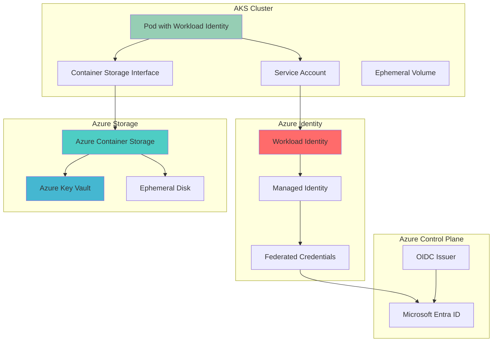

# Federated Container Storage Security with Azure Workload Identity and Container Storage

## Problem

Organizations running containerized workloads in Azure Kubernetes Service (AKS) face challenges securing access to ephemeral storage without embedding credentials in container images or configuration files. Traditional approaches require managing service principal secrets or certificates, creating security vulnerabilities and operational overhead. Ephemeral workloads that need high-performance, temporary storage access require identity-based authentication that scales dynamically without persistent credential management.

## Solution

Azure Workload Identity provides federated authentication for AKS pods using OpenID Connect (OIDC) token exchange, eliminating the need for stored secrets. Combined with Azure Container Storage for high-performance ephemeral volumes, this creates a secure, scalable solution for temporary workload storage needs. The solution uses Microsoft Entra ID managed identities with federated credentials to authenticate pods against Azure resources while maintaining zero-credential architecture.

## Architecture Diagram



## Prerequisites

1. Azure subscription with appropriate permissions for AKS, storage, and identity management
2. Azure CLI v2.47.0 or later installed and configured
3. kubectl command-line tool installed
4. Basic understanding of Kubernetes concepts and Azure identity management
5. Estimated cost: $30-50 for testing resources (delete after completion to avoid ongoing charges)

> **Note**: This recipe requires AKS version 1.22 or higher for Workload Identity support. Ensure your cluster meets this requirement before proceeding.

## Preparation

```bash
# Generate unique suffix for resource names
RANDOM_SUFFIX=$(openssl rand -hex 3)

# Set environment variables for Azure resources
export RESOURCE_GROUP="rg-workload-identity-${RANDOM_SUFFIX}"
export LOCATION="eastus"
export SUBSCRIPTION_ID=$(az account show --query id --output tsv)
export AKS_CLUSTER_NAME="aks-workload-identity-${RANDOM_SUFFIX}"
export KEY_VAULT_NAME="kv-workload-${RANDOM_SUFFIX}"

# Create resource group
az group create \
    --name ${RESOURCE_GROUP} \
    --location ${LOCATION} \
    --tags purpose=workload-identity-demo environment=test

echo "✅ Resource group created: ${RESOURCE_GROUP}"

# Register required Azure providers
az provider register --namespace Microsoft.ContainerService
az provider register --namespace Microsoft.Storage
az provider register --namespace Microsoft.KeyVault

# Install/upgrade required Azure CLI extensions
az extension add --upgrade --name k8s-extension

echo "✅ Azure providers registered and extensions installed"
```

## Steps

1. **Create AKS Cluster with Workload Identity and OIDC Issuer**:

   Azure Kubernetes Service provides native support for Workload Identity through OpenID Connect (OIDC) federation. Enabling the OIDC issuer creates a public endpoint that issues JWT tokens for service accounts, while Workload Identity integration allows these tokens to be exchanged for Azure AD tokens. This foundational step establishes the trust relationship between your AKS cluster and Azure identity services.

   ```bash
   # Create AKS cluster with Workload Identity enabled
   az aks create \
       --name ${AKS_CLUSTER_NAME} \
       --resource-group ${RESOURCE_GROUP} \
       --location ${LOCATION} \
       --node-count 3 \
       --node-vm-size Standard_D2s_v3 \
       --enable-oidc-issuer \
       --enable-workload-identity \
       --enable-managed-identity \
       --generate-ssh-keys \
       --tags purpose=workload-identity-demo
   
   # Get cluster credentials
   az aks get-credentials \
       --name ${AKS_CLUSTER_NAME} \
       --resource-group ${RESOURCE_GROUP} \
       --overwrite-existing
   
   # Retrieve OIDC issuer URL for federated credentials
   export OIDC_ISSUER=$(az aks show \
       --name ${AKS_CLUSTER_NAME} \
       --resource-group ${RESOURCE_GROUP} \
       --query "oidcIssuerProfile.issuerUrl" \
       --output tsv)
   
   echo "✅ AKS cluster created with OIDC issuer: ${OIDC_ISSUER}"
   ```

   The AKS cluster now has Workload Identity enabled and an OIDC issuer configured. This creates the foundation for secure, credential-free authentication between your pods and Azure resources using industry-standard JWT token exchange.

2. **Install Azure Container Storage Extension**:

   Azure Container Storage provides high-performance, ephemeral storage capabilities for containerized workloads. Installing the extension enables CSI drivers and storage classes for various backing storage types including local NVMe, temp SSD, and Azure Disks. This managed service automatically handles storage provisioning, scaling, and lifecycle management for temporary workload storage needs.

   ```bash
   # Install Azure Container Storage extension
   az k8s-extension create \
       --cluster-name ${AKS_CLUSTER_NAME} \
       --resource-group ${RESOURCE_GROUP} \
       --cluster-type managedClusters \
       --extension-type microsoft.azurecontainerstorage \
       --name azure-container-storage \
       --scope cluster \
       --release-train stable \
       --release-namespace acstor \
       --auto-upgrade-minor-version false
   
   # Wait for extension installation to complete
   echo "⏳ Waiting for Azure Container Storage extension to install..."
   while true; do
       STATUS=$(az k8s-extension show \
           --cluster-name ${AKS_CLUSTER_NAME} \
           --resource-group ${RESOURCE_GROUP} \
           --cluster-type managedClusters \
           --name azure-container-storage \
           --query "installState" \
           --output tsv)
       
       if [ "$STATUS" = "Installed" ]; then
           echo "✅ Azure Container Storage extension installed successfully"
           break
       elif [ "$STATUS" = "Failed" ]; then
           echo "❌ Extension installation failed"
           exit 1
       else
           sleep 30
       fi
   done
   
   # Verify extension installation
   kubectl get pods -n acstor
   ```

   The Container Storage extension is now running in your cluster, providing the necessary components for ephemeral storage provisioning. This includes CSI drivers, storage operators, and monitoring components that enable secure, high-performance temporary storage access.

3. **Create Azure Key Vault for Secrets Management**:

   Azure Key Vault provides centralized, secure storage for application secrets, keys, and certificates. In this workload identity scenario, Key Vault serves as the protected resource that demonstrates secure access patterns while storing encryption keys and secrets needed for ephemeral storage operations. The vault integrates with Azure Container Storage for secure key management and access control.

   ```bash
   # Create Key Vault with Azure RBAC enabled
   az keyvault create \
       --name ${KEY_VAULT_NAME} \
       --resource-group ${RESOURCE_GROUP} \
       --location ${LOCATION} \
       --enable-rbac-authorization \
       --sku standard \
       --tags purpose=workload-identity-demo
   
   # Get current user object ID for secret creation permission
   CURRENT_USER_ID=$(az ad signed-in-user show --query id --output tsv)
   
   # Grant Key Vault Secrets Officer role to current user for secret creation
   az role assignment create \
       --role "Key Vault Secrets Officer" \
       --assignee ${CURRENT_USER_ID} \
       --scope $(az keyvault show --name ${KEY_VAULT_NAME} --query id --output tsv)
   
   # Wait for role assignment to propagate
   sleep 30
   
   # Create a sample secret for testing
   az keyvault secret set \
       --vault-name ${KEY_VAULT_NAME} \
       --name "storage-encryption-key" \
       --value "demo-encryption-key-value"
   
   # Get Key Vault resource ID for role assignments
   export KEY_VAULT_ID=$(az keyvault show \
       --name ${KEY_VAULT_NAME} \
       --resource-group ${RESOURCE_GROUP} \
       --query id \
       --output tsv)
   
   echo "✅ Key Vault created: ${KEY_VAULT_NAME}"
   ```

   The Key Vault is now configured with Azure RBAC authorization, providing fine-grained access control for workload identity authentication. This secure foundation enables pods to retrieve secrets and encryption keys without storing credentials in container images or configuration files.

4. **Create User-Assigned Managed Identity**:

   User-assigned managed identities provide a stable, reusable identity for Azure resources that can be assigned to multiple resources. This managed identity will be federated with the Kubernetes service account, enabling seamless authentication between your pods and Azure services. The identity serves as the bridge between Kubernetes-native service accounts and Azure AD authentication.

   ```bash
   # Create user-assigned managed identity
   az identity create \
       --name "workload-identity-${RANDOM_SUFFIX}" \
       --resource-group ${RESOURCE_GROUP} \
       --location ${LOCATION} \
       --tags purpose=workload-identity-demo
   
   # Get identity details
   export IDENTITY_CLIENT_ID=$(az identity show \
       --name "workload-identity-${RANDOM_SUFFIX}" \
       --resource-group ${RESOURCE_GROUP} \
       --query clientId \
       --output tsv)
   
   export IDENTITY_OBJECT_ID=$(az identity show \
       --name "workload-identity-${RANDOM_SUFFIX}" \
       --resource-group ${RESOURCE_GROUP} \
       --query principalId \
       --output tsv)
   
   echo "✅ Managed identity created with Client ID: ${IDENTITY_CLIENT_ID}"
   ```

   The managed identity is now ready for federation with Kubernetes service accounts. This identity will authenticate against Azure resources on behalf of your pods, eliminating the need for stored credentials while maintaining strong security boundaries.

5. **Create Storage Pool for Ephemeral Workloads**:

   Azure Container Storage pools provide the foundation for dynamic volume provisioning with specific performance characteristics. Creating a storage pool with ephemeral disk backing enables high-performance, temporary storage that automatically scales based on workload demands. This storage is ideal for caching, temporary data processing, and other ephemeral workload patterns.

   ```bash
   # Create storage pool using local ephemeral disk
   kubectl apply -f - <<EOF
   apiVersion: containerstorage.azure.com/v1
   kind: StoragePool
   metadata:
     name: ephemeral-pool
     namespace: acstor
   spec:
     poolType:
       ephemeralDisk:
         diskType: temp
         diskSize: 100Gi
     nodePoolName: nodepool1
     reclaimPolicy: Delete
   EOF
   
   # Wait for storage pool to be ready
   kubectl wait --for=condition=Ready storagepool/ephemeral-pool \
       -n acstor --timeout=300s
   
   # Create storage class for ephemeral workloads
   kubectl apply -f - <<EOF
   apiVersion: storage.k8s.io/v1
   kind: StorageClass
   metadata:
     name: ephemeral-storage
   provisioner: containerstorage.csi.azure.com
   parameters:
     protocol: "nfs"
     storagePool: "ephemeral-pool"
     server: "ephemeral-pool.acstor.svc.cluster.local"
   volumeBindingMode: Immediate
   reclaimPolicy: Delete
   EOF
   
   echo "✅ Storage pool and storage class created for ephemeral workloads"
   ```

   The storage pool provides high-performance ephemeral storage backed by local temp SSD, optimized for temporary workload storage needs. The storage class enables dynamic provisioning of NFS volumes with automatic lifecycle management and secure access controls.

6. **Create Kubernetes Service Account with Workload Identity**:

   Kubernetes service accounts provide pod-level identity within the cluster. Annotating the service account with the managed identity client ID creates the linkage for workload identity federation. This enables pods using this service account to automatically receive Azure AD tokens through the OIDC token exchange process.

   ```bash
   # Create dedicated namespace for workload identity demo
   kubectl create namespace workload-identity-demo
   
   # Create service account with workload identity annotations
   kubectl apply -f - <<EOF
   apiVersion: v1
   kind: ServiceAccount
   metadata:
     name: workload-identity-sa
     namespace: workload-identity-demo
     annotations:
       azure.workload.identity/client-id: ${IDENTITY_CLIENT_ID}
     labels:
       azure.workload.identity/use: "true"
   EOF
   
   echo "✅ Service account created with workload identity annotations"
   ```

   The service account is now configured for workload identity federation. Pods using this service account will automatically receive projected service account tokens that can be exchanged for Azure AD access tokens, enabling secure authentication to Azure resources.

7. **Configure Federated Credentials**:

   Federated credentials establish the trust relationship between your AKS cluster's OIDC issuer and the Azure managed identity. This configuration enables Azure AD to accept JWT tokens issued by your cluster's OIDC endpoint and exchange them for Azure AD access tokens. The federation eliminates the need for stored secrets while maintaining strong authentication security.

   ```bash
   # Create federated credential for the service account
   az identity federated-credential create \
       --name "workload-identity-federation" \
       --identity-name "workload-identity-${RANDOM_SUFFIX}" \
       --resource-group ${RESOURCE_GROUP} \
       --issuer ${OIDC_ISSUER} \
       --subject system:serviceaccount:workload-identity-demo:workload-identity-sa \
       --audience api://AzureADTokenExchange
   
   echo "✅ Federated credential created for workload identity"
   ```

   The federated credential configuration now enables secure token exchange between your cluster and Azure AD. This establishes the trust relationship that allows pods to authenticate against Azure resources using their Kubernetes service account identity.

8. **Grant Key Vault Access to Managed Identity**:

   Azure Role-Based Access Control (RBAC) provides fine-grained permissions for managed identities to access Azure resources. Granting Key Vault Secrets User role to the managed identity enables workload-authenticated pods to retrieve secrets securely. This permission model ensures least-privilege access while supporting dynamic, credential-free authentication patterns.

   ```bash
   # Grant Key Vault Secrets User role to managed identity
   az role assignment create \
       --role "Key Vault Secrets User" \
       --assignee ${IDENTITY_OBJECT_ID} \
       --scope ${KEY_VAULT_ID}
   
   # Verify role assignment
   az role assignment list \
       --assignee ${IDENTITY_OBJECT_ID} \
       --scope ${KEY_VAULT_ID} \
       --output table
   
   echo "✅ Key Vault access granted to managed identity"
   ```

   The managed identity now has the necessary permissions to access Key Vault secrets on behalf of authenticated pods. This completes the security configuration, enabling workload identity-based access to protected Azure resources without stored credentials.

9. **Deploy Test Workload with Ephemeral Storage**:

   The test workload demonstrates the complete integration of workload identity authentication with ephemeral storage access. This deployment uses the Azure Identity SDK to authenticate against Key Vault while mounting high-performance ephemeral storage. The workload showcases secure, credential-free access patterns for temporary data processing scenarios.

   ```bash
   # Deploy test workload with ephemeral storage and workload identity
   kubectl apply -f - <<EOF
   apiVersion: apps/v1
   kind: Deployment
   metadata:
     name: workload-identity-test
     namespace: workload-identity-demo
   spec:
     replicas: 1
     selector:
       matchLabels:
         app: workload-identity-test
     template:
       metadata:
         labels:
           app: workload-identity-test
           azure.workload.identity/use: "true"
       spec:
         serviceAccountName: workload-identity-sa
         containers:
         - name: test-container
           image: mcr.microsoft.com/azure-cli:latest
           command: ["/bin/bash"]
           args:
           - -c
           - |
             echo "Installing Azure Identity SDK..."
             pip install azure-identity azure-keyvault-secrets
             echo "Starting workload identity test..."
             while true; do
               echo "Testing Key Vault access with workload identity..."
               python3 -c "
             from azure.identity import DefaultAzureCredential
             from azure.keyvault.secrets import SecretClient
             import os
             
             # Use workload identity for authentication
             credential = DefaultAzureCredential()
             vault_url = 'https://${KEY_VAULT_NAME}.vault.azure.net/'
             client = SecretClient(vault_url=vault_url, credential=credential)
             
             try:
                 secret = client.get_secret('storage-encryption-key')
                 print(f'Successfully retrieved secret: {secret.name}')
                 
                 # Test ephemeral storage access
                 with open('/ephemeral-storage/test-file.txt', 'w') as f:
                     f.write('Workload identity test successful!')
                 
                 with open('/ephemeral-storage/test-file.txt', 'r') as f:
                     content = f.read()
                 print(f'Ephemeral storage test: {content}')
                 
             except Exception as e:
                 print(f'Error: {e}')
               "
               echo "Test completed. Sleeping for 30 seconds..."
               sleep 30
             done
           volumeMounts:
           - name: ephemeral-storage
             mountPath: /ephemeral-storage
           env:
           - name: AZURE_CLIENT_ID
             value: ${IDENTITY_CLIENT_ID}
         volumes:
         - name: ephemeral-storage
           persistentVolumeClaim:
             claimName: ephemeral-pvc
   ---
   apiVersion: v1
   kind: PersistentVolumeClaim
   metadata:
     name: ephemeral-pvc
     namespace: workload-identity-demo
   spec:
     accessModes:
       - ReadWriteMany
     resources:
       requests:
         storage: 10Gi
     storageClassName: ephemeral-storage
   EOF
   
   echo "✅ Test workload deployed with ephemeral storage and workload identity"
   ```

   The test workload is now running with both workload identity authentication and ephemeral storage access. This demonstrates the complete integration of secure, credential-free authentication with high-performance temporary storage for containerized workloads.

## Validation & Testing

1. **Verify Workload Identity Authentication**:

   ```bash
   # Check pod status and logs
   kubectl get pods -n workload-identity-demo
   
   # View authentication logs
   kubectl logs -n workload-identity-demo -l app=workload-identity-test --tail=20
   ```

   Expected output: Logs showing successful Key Vault secret retrieval and ephemeral storage access without credential errors.

2. **Test Ephemeral Storage Performance**:

   ```bash
   # Test storage performance and access
   kubectl exec -n workload-identity-demo deployment/workload-identity-test -- \
       dd if=/dev/zero of=/ephemeral-storage/test-performance.dat bs=1M count=100
   
   # Verify storage pool utilization
   kubectl get storagepool -n acstor ephemeral-pool -o yaml
   ```

   Expected output: High-performance write operations completing successfully with storage pool showing appropriate utilization metrics.

3. **Validate Security Configuration**:

   ```bash
   # Verify no secrets are stored in pod specification
   kubectl get pod -n workload-identity-demo -o yaml | grep -i secret
   
   # Check federated credential configuration
   az identity federated-credential list \
       --identity-name "workload-identity-${RANDOM_SUFFIX}" \
       --resource-group ${RESOURCE_GROUP} \
       --output table
   ```

   Expected output: No hardcoded secrets in pod configuration and properly configured federated credentials.

## Cleanup

1. **Remove test workload and storage**:

   ```bash
   # Delete test deployment and PVC
   kubectl delete namespace workload-identity-demo
   
   # Remove storage pool and storage class
   kubectl delete storageclass ephemeral-storage
   kubectl delete storagepool ephemeral-pool -n acstor
   
   echo "✅ Test workload and storage resources removed"
   ```

2. **Remove Azure Container Storage extension**:

   ```bash
   # Uninstall Container Storage extension
   az k8s-extension delete \
       --cluster-name ${AKS_CLUSTER_NAME} \
       --resource-group ${RESOURCE_GROUP} \
       --cluster-type managedClusters \
       --name azure-container-storage \
       --yes
   
   echo "✅ Azure Container Storage extension removed"
   ```

3. **Delete Azure resources**:

   ```bash
   # Delete resource group and all contained resources
   az group delete \
       --name ${RESOURCE_GROUP} \
       --yes \
       --no-wait
   
   echo "✅ Resource group deletion initiated: ${RESOURCE_GROUP}"
   echo "Note: Deletion may take several minutes to complete"
   ```

## Discussion

Azure Workload Identity represents a significant advancement in cloud-native security, eliminating the need for stored secrets while providing seamless authentication between Kubernetes workloads and Azure resources. The integration with Azure Container Storage creates a powerful pattern for secure, high-performance ephemeral storage access that scales dynamically with workload demands. This architecture follows the principle of least privilege and zero-trust security models, ensuring that authentication tokens are short-lived and scoped to specific resources. For comprehensive documentation on workload identity patterns, see the [Azure Workload Identity overview](https://docs.microsoft.com/en-us/azure/aks/workload-identity-overview) and [Azure Container Storage documentation](https://docs.microsoft.com/en-us/azure/storage/container-storage/container-storage-introduction).

The ephemeral storage pattern is particularly valuable for data processing workloads, machine learning training jobs, and container builds that require high-performance temporary storage without persistent data requirements. Azure Container Storage's integration with various backing storage types (local NVMe, temp SSD, Azure Disks) provides flexibility for different performance and cost requirements. The CSI driver architecture ensures compatibility with standard Kubernetes storage APIs while delivering Azure-native performance optimizations. For detailed performance guidance, review the [Azure Container Storage performance documentation](https://docs.microsoft.com/en-us/azure/storage/container-storage/use-container-storage-with-local-disk).

From an operational perspective, this architecture significantly reduces the security overhead associated with credential management, key rotation, and access control. The federated credential approach leverages industry-standard OIDC protocols, making it compatible with existing security frameworks and audit requirements. The automatic token refresh and lifecycle management eliminate common security vulnerabilities associated with long-lived credentials. For enterprise security considerations, see the [Azure security best practices](https://docs.microsoft.com/en-us/azure/security/fundamentals/best-practices-and-patterns) and [Kubernetes security guidance](https://docs.microsoft.com/en-us/azure/aks/concepts-security).

> **Tip**: Use Azure Monitor and Container Insights to track workload identity authentication patterns and ephemeral storage utilization. The [monitoring documentation](https://docs.microsoft.com/en-us/azure/azure-monitor/containers/container-insights-overview) provides comprehensive guidance on observability for containerized workloads with workload identity authentication.

## Challenge

Extend this solution by implementing these enhancements:

1. **Multi-Region Workload Identity**: Configure workload identity federation across multiple AKS clusters in different regions, enabling global workload authentication patterns with regional ephemeral storage.

2. **Advanced Storage Policies**: Implement dynamic storage class selection based on workload requirements, integrating with Azure Policy for governance and compliance enforcement.

3. **Monitoring and Alerting**: Deploy comprehensive monitoring for workload identity authentication events, ephemeral storage utilization, and security audit trails using Azure Monitor and Log Analytics.

4. **Backup and Recovery**: Create automated backup strategies for critical ephemeral data using Azure Backup and implement disaster recovery procedures for workload identity configurations.

5. **Service Mesh Integration**: Integrate with Azure Service Mesh to provide additional security layers and observability for workload identity-authenticated services accessing ephemeral storage.

## Infrastructure Code

*Infrastructure code will be generated after recipe approval.*