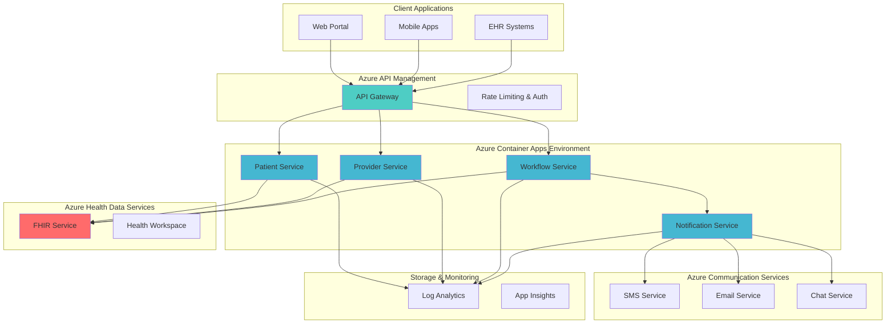

# FHIR-Compliant Healthcare API Orchestration with Azure Container Apps and Azure Health Data Services

## Problem

Healthcare organizations struggle with integrating disparate systems while maintaining FHIR compliance, secure Protected Health Information (PHI) handling, and real-time provider notifications. Traditional monolithic architectures cannot scale efficiently to handle variable healthcare workloads, lack standardized healthcare data exchange formats, and require complex infrastructure management for compliance with healthcare regulations like HIPAA and HITRUST.

## Solution

This solution creates a scalable, FHIR-compliant healthcare API orchestration platform using Azure Container Apps for microservices deployment, Azure Health Data Services for standardized FHIR data management, and Azure Communication Services for real-time notifications. The architecture provides secure healthcare workflow automation while maintaining compliance and enabling rapid scaling based on healthcare demand patterns.

## Architecture Diagram



## Prerequisites

1. Azure subscription with Healthcare APIs and Container Apps enabled
2. Azure CLI v2.53.0 or later installed and configured
3. Basic understanding of FHIR R4 standard and healthcare data concepts
4. Docker knowledge for containerized application deployment
5. Understanding of microservices architecture and API design patterns
6. Estimated cost: $150-300/month for development environment

> **Note**: This recipe requires Azure Health Data Services which may have specific regional availability. Verify service availability in your target Azure region before proceeding.

## Preparation

```bash
# Set environment variables for Azure resources
export RESOURCE_GROUP="rg-healthcare-fhir-${RANDOM_SUFFIX}"
export LOCATION="eastus"
export SUBSCRIPTION_ID=$(az account show --query id --output tsv)

# Generate unique suffix for resource names
RANDOM_SUFFIX=$(openssl rand -hex 3)

# Set healthcare-specific resource names
export HEALTH_WORKSPACE="hw-healthcare-${RANDOM_SUFFIX}"
export FHIR_SERVICE="fhir-service-${RANDOM_SUFFIX}"
export CONTAINER_ENV="cae-healthcare-${RANDOM_SUFFIX}"
export API_MANAGEMENT="apim-healthcare-${RANDOM_SUFFIX}"
export COMM_SERVICE="comm-healthcare-${RANDOM_SUFFIX}"
export LOG_ANALYTICS="log-healthcare-${RANDOM_SUFFIX}"

# Create resource group with healthcare-specific tags
az group create \
    --name ${RESOURCE_GROUP} \
    --location ${LOCATION} \
    --tags purpose=healthcare-fhir environment=demo \
           compliance=hipaa workload=fhir-api

echo "✅ Resource group created: ${RESOURCE_GROUP}"

# Create Log Analytics workspace for healthcare monitoring
az monitor log-analytics workspace create \
    --resource-group ${RESOURCE_GROUP} \
    --workspace-name ${LOG_ANALYTICS} \
    --location ${LOCATION} \
    --sku pergb2018

echo "✅ Log Analytics workspace created for healthcare monitoring"
```

## Steps

1. **Create Azure Health Data Services Workspace**:

   Azure Health Data Services provides a managed, compliant environment for storing and accessing Protected Health Information (PHI) using industry-standard FHIR R4 format. The workspace serves as a security boundary that isolates healthcare data and provides centralized access control through Azure Active Directory integration, ensuring HIPAA and HITRUST compliance for healthcare organizations.

   ```bash
   # Create Healthcare workspace with compliance settings
   az healthcareapis workspace create \
       --resource-group ${RESOURCE_GROUP} \
       --workspace-name ${HEALTH_WORKSPACE} \
       --location ${LOCATION} \
       --tags compliance=hipaa-hitrust \
              data-classification=phi \
              purpose=fhir-orchestration
   
   echo "✅ Healthcare workspace created with compliance settings"
   ```

   The Healthcare workspace now provides the foundation for FHIR-compliant data operations with built-in security, audit logging, and access controls. This establishes the secure environment required for handling PHI while maintaining interoperability with external healthcare systems through standardized FHIR APIs.

2. **Deploy FHIR Service with Security Configuration**:

   The FHIR service implements the HL7 FHIR R4 specification, providing a RESTful API for healthcare data exchange. This managed service handles the complexity of FHIR compliance, data validation, and security while offering enterprise-grade performance and scalability for healthcare workloads.

   ```bash
   # Deploy FHIR service with authentication and RBAC
   az healthcareapis fhir-service create \
       --resource-group ${RESOURCE_GROUP} \
       --workspace-name ${HEALTH_WORKSPACE} \
       --fhir-service-name ${FHIR_SERVICE} \
       --kind fhir-R4 \
       --location ${LOCATION} \
       --auth-config-authority "https://login.microsoftonline.com/$(az account show --query tenantId -o tsv)" \
       --auth-config-audience "https://${HEALTH_WORKSPACE}-${FHIR_SERVICE}.fhir.azurehealthcareapis.com" \
       --auth-config-smart-proxy-enabled true
   
   # Get FHIR service endpoint for microservices configuration
   export FHIR_ENDPOINT=$(az healthcareapis fhir-service show \
       --resource-group ${RESOURCE_GROUP} \
       --workspace-name ${HEALTH_WORKSPACE} \
       --fhir-service-name ${FHIR_SERVICE} \
       --query "properties.serviceUrl" --output tsv)
   
   echo "✅ FHIR service deployed with endpoint: ${FHIR_ENDPOINT}"
   ```

   The FHIR service is now operational with SMART on FHIR authentication, enabling secure access for healthcare applications while maintaining audit trails and compliance. This service will handle all patient data interactions through standardized FHIR resources like Patient, Observation, and Encounter.

3. **Create Azure Container Apps Environment**:

   Azure Container Apps provides a serverless container platform optimized for microservices and event-driven applications. For healthcare workloads, this service offers automatic scaling, built-in load balancing, and integration with Azure's compliance frameworks, making it ideal for variable healthcare demand patterns while maintaining security and performance.

   ```bash
   # Create Container Apps environment with healthcare monitoring
   az containerapp env create \
       --resource-group ${RESOURCE_GROUP} \
       --name ${CONTAINER_ENV} \
       --location ${LOCATION} \
       --logs-workspace-id $(az monitor log-analytics workspace show \
           --resource-group ${RESOURCE_GROUP} \
           --workspace-name ${LOG_ANALYTICS} \
           --query customerId --output tsv) \
       --logs-workspace-key $(az monitor log-analytics workspace get-shared-keys \
           --resource-group ${RESOURCE_GROUP} \
           --workspace-name ${LOG_ANALYTICS} \
           --query primarySharedKey --output tsv)
   
   echo "✅ Container Apps environment created with healthcare monitoring"
   ```

   The Container Apps environment is now configured with centralized logging and monitoring, essential for healthcare compliance and operational visibility. This foundation enables secure, scalable deployment of healthcare microservices with built-in observability and audit capabilities.

4. **Deploy Patient Management Microservice**:

   The Patient Management microservice handles FHIR Patient resources and related operations. This service encapsulates patient data management logic, validation, and FHIR compliance while providing a clean API interface for healthcare applications. It demonstrates how to build healthcare-specific business logic on top of Azure Health Data Services.

   ```bash
   # Create patient management service configuration
   cat > patient-service-config.yaml << 'EOF'
   properties:
     environmentVariables:
       - name: FHIR_ENDPOINT
         value: "${FHIR_ENDPOINT}"
       - name: AZURE_CLIENT_ID
         value: "${AZURE_CLIENT_ID}"
       - name: AZURE_TENANT_ID
         value: "${AZURE_TENANT_ID}"
       - name: LOG_LEVEL
         value: "INFO"
   EOF
   
   # Deploy patient management container app
   az containerapp create \
       --resource-group ${RESOURCE_GROUP} \
       --name patient-service \
       --environment ${CONTAINER_ENV} \
       --image mcr.microsoft.com/azuredocs/containerapps-helloworld:latest \
       --target-port 80 \
       --ingress external \
       --min-replicas 1 \
       --max-replicas 10 \
       --cpu 0.5 \
       --memory 1.0Gi \
       --env-vars FHIR_ENDPOINT=${FHIR_ENDPOINT} \
                  SERVICE_NAME=patient-service \
                  COMPLIANCE_MODE=hipaa
   
   echo "✅ Patient management microservice deployed"
   ```

   The Patient Management service is now running with automatic scaling capabilities and integration with the FHIR service. This microservice will handle patient registration, updates, and queries while maintaining FHIR compliance and providing structured APIs for healthcare applications.

5. **Deploy Provider Notification Service**:

   The Provider Notification service manages healthcare provider communications and alerts. This service integrates with Azure Communication Services to send real-time notifications about patient status changes, appointment updates, and critical health events, ensuring timely healthcare provider responses.

   ```bash
   # Deploy provider notification service
   az containerapp create \
       --resource-group ${RESOURCE_GROUP} \
       --name provider-notification-service \
       --environment ${CONTAINER_ENV} \
       --image mcr.microsoft.com/azuredocs/containerapps-helloworld:latest \
       --target-port 80 \
       --ingress external \
       --min-replicas 1 \
       --max-replicas 5 \
       --cpu 0.25 \
       --memory 0.5Gi \
       --env-vars FHIR_ENDPOINT=${FHIR_ENDPOINT} \
                  SERVICE_NAME=provider-notification \
                  NOTIFICATION_MODE=realtime
   
   echo "✅ Provider notification service deployed"
   ```

   The Provider Notification service is now operational and ready to handle real-time healthcare communications. This service will integrate with Azure Communication Services to provide multi-channel notifications including SMS, email, and chat capabilities for healthcare providers.

6. **Configure Azure Communication Services**:

   Azure Communication Services enables real-time communication capabilities for healthcare applications. This service provides HIPAA-compliant messaging, voice, and video communication channels that integrate seamlessly with healthcare workflows while maintaining security and audit requirements.

   ```bash
   # Create Communication Services resource
   az communication create \
       --name ${COMM_SERVICE} \
       --resource-group ${RESOURCE_GROUP} \
       --data-location "United States" \
       --tags purpose=healthcare-notifications \
              compliance=hipaa

   # Get Communication Services connection string
   export COMM_CONNECTION_STRING=$(az communication list-key \
       --name ${COMM_SERVICE} \
       --resource-group ${RESOURCE_GROUP} \
       --query "primaryConnectionString" --output tsv)
   
   echo "✅ Communication Services configured for healthcare notifications"
   ```

   Azure Communication Services is now configured with healthcare-specific settings and compliance features. This service will enable secure, real-time communication between healthcare providers, patients, and systems while maintaining audit trails and regulatory compliance.

7. **Deploy Workflow Orchestration Service**:

   The Workflow Orchestration service coordinates complex healthcare processes involving multiple systems and stakeholders. This service implements healthcare-specific business logic, manages state transitions, and ensures proper sequencing of healthcare operations while maintaining FHIR data consistency.

   ```bash
   # Deploy workflow orchestration service
   az containerapp create \
       --resource-group ${RESOURCE_GROUP} \
       --name workflow-orchestration-service \
       --environment ${CONTAINER_ENV} \
       --image mcr.microsoft.com/azuredocs/containerapps-helloworld:latest \
       --target-port 80 \
       --ingress external \
       --min-replicas 2 \
       --max-replicas 8 \
       --cpu 1.0 \
       --memory 2.0Gi \
       --env-vars FHIR_ENDPOINT=${FHIR_ENDPOINT} \
                  COMM_CONNECTION_STRING=${COMM_CONNECTION_STRING} \
                  SERVICE_NAME=workflow-orchestration \
                  WORKFLOW_ENGINE=healthcare
   
   echo "✅ Workflow orchestration service deployed"
   ```

   The Workflow Orchestration service is now running with enhanced resource allocation to handle complex healthcare processes. This service will coordinate patient care workflows, manage multi-step procedures, and ensure proper sequencing of healthcare operations while maintaining data integrity and compliance.

8. **Configure API Management Gateway**:

   Azure API Management provides a centralized gateway for healthcare APIs with built-in security, rate limiting, and monitoring capabilities. This service acts as the entry point for all healthcare applications, enforcing security policies, managing API versions, and providing comprehensive analytics for healthcare API usage.

   ```bash
   # Create API Management instance for healthcare APIs
   az apim create \
       --resource-group ${RESOURCE_GROUP} \
       --name ${API_MANAGEMENT} \
       --location ${LOCATION} \
       --publisher-name "Healthcare Organization" \
       --publisher-email "admin@healthcare.org" \
       --sku-name Developer \
       --tags purpose=healthcare-api-gateway \
              compliance=hipaa-hitrust
   
   echo "✅ API Management gateway configured for healthcare APIs"
   ```

   API Management is now configured as the centralized entry point for healthcare APIs, providing security, monitoring, and governance capabilities. This gateway will enforce authentication, rate limiting, and audit logging while providing a unified interface for healthcare applications.

## Validation & Testing

1. **Verify FHIR Service Connectivity**:

   ```bash
   # Test FHIR service health endpoint
   curl -H "Accept: application/fhir+json" \
        "${FHIR_ENDPOINT}/metadata"
   
   # Verify FHIR capability statement
   az healthcareapis fhir-service show \
       --resource-group ${RESOURCE_GROUP} \
       --workspace-name ${HEALTH_WORKSPACE} \
       --fhir-service-name ${FHIR_SERVICE} \
       --query "properties.serviceUrl"
   ```

   Expected output: FHIR R4 capability statement with supported resources and operations

2. **Test Container Apps Deployment**:

   ```bash
   # Check container app status
   az containerapp show \
       --resource-group ${RESOURCE_GROUP} \
       --name patient-service \
       --query "properties.runningStatus"
   
   # Verify scaling configuration
   az containerapp show \
       --resource-group ${RESOURCE_GROUP} \
       --name workflow-orchestration-service \
       --query "properties.template.scale"
   ```

   Expected output: All services showing "Running" status with proper scaling configuration

3. **Test Communication Services Integration**:

   ```bash
   # Verify Communication Services status
   az communication show \
       --name ${COMM_SERVICE} \
       --resource-group ${RESOURCE_GROUP} \
       --query "provisioningState"
   
   # Test connection string configuration
   echo "Connection string configured: ${COMM_CONNECTION_STRING:0:50}..."
   ```

   Expected output: "Succeeded" provisioning state and masked connection string

4. **Validate Healthcare Compliance Configuration**:

   ```bash
   # Check workspace security settings
   az healthcareapis workspace show \
       --resource-group ${RESOURCE_GROUP} \
       --workspace-name ${HEALTH_WORKSPACE} \
       --query "properties"
   
   # Verify logging configuration
   az monitor log-analytics workspace show \
       --resource-group ${RESOURCE_GROUP} \
       --workspace-name ${LOG_ANALYTICS} \
       --query "provisioningState"
   ```

   Expected output: Workspace with proper security configuration and active logging

## Cleanup

1. **Remove Container Apps Environment**:

   ```bash
   # Delete all container apps
   az containerapp delete \
       --resource-group ${RESOURCE_GROUP} \
       --name patient-service \
       --yes
   
   az containerapp delete \
       --resource-group ${RESOURCE_GROUP} \
       --name provider-notification-service \
       --yes
   
   az containerapp delete \
       --resource-group ${RESOURCE_GROUP} \
       --name workflow-orchestration-service \
       --yes
   
   # Delete container environment
   az containerapp env delete \
       --resource-group ${RESOURCE_GROUP} \
       --name ${CONTAINER_ENV} \
       --yes
   
   echo "✅ Container Apps environment and services deleted"
   ```

2. **Remove Healthcare Services**:

   ```bash
   # Delete FHIR service
   az healthcareapis fhir-service delete \
       --resource-group ${RESOURCE_GROUP} \
       --workspace-name ${HEALTH_WORKSPACE} \
       --fhir-service-name ${FHIR_SERVICE} \
       --yes
   
   # Delete healthcare workspace
   az healthcareapis workspace delete \
       --resource-group ${RESOURCE_GROUP} \
       --workspace-name ${HEALTH_WORKSPACE} \
       --yes
   
   echo "✅ Healthcare services deleted"
   ```

3. **Remove Supporting Services**:

   ```bash
   # Delete Communication Services
   az communication delete \
       --name ${COMM_SERVICE} \
       --resource-group ${RESOURCE_GROUP} \
       --yes
   
   # Delete API Management
   az apim delete \
       --resource-group ${RESOURCE_GROUP} \
       --name ${API_MANAGEMENT} \
       --yes
   
   # Delete Log Analytics workspace
   az monitor log-analytics workspace delete \
       --resource-group ${RESOURCE_GROUP} \
       --workspace-name ${LOG_ANALYTICS} \
       --force true
   
   echo "✅ Supporting services deleted"
   ```

4. **Remove Resource Group**:

   ```bash
   # Delete resource group and all remaining resources
   az group delete \
       --name ${RESOURCE_GROUP} \
       --yes \
       --no-wait
   
   echo "✅ Resource group deletion initiated: ${RESOURCE_GROUP}"
   echo "Note: Healthcare resource deletion may take several minutes"
   
   # Verify deletion (optional)
   az group exists --name ${RESOURCE_GROUP}
   ```

## Discussion

Building FHIR-compliant healthcare API orchestration requires careful consideration of healthcare-specific requirements including data standardization, regulatory compliance, and scalable architecture patterns. Azure Health Data Services provides a managed FHIR R4 implementation that handles the complexity of healthcare data standards while maintaining HIPAA and HITRUST compliance. This eliminates the need for organizations to build and maintain their own FHIR servers, reducing operational overhead and ensuring consistent compliance. The integration with Azure Container Apps enables modern microservices architecture patterns that can scale dynamically based on healthcare demand while maintaining security and audit requirements. For comprehensive guidance on healthcare data architectures, see the [Azure Health Data Services documentation](https://docs.microsoft.com/en-us/azure/healthcare-apis/).

The microservices architecture implemented through Azure Container Apps provides natural separation of concerns for healthcare workflows while enabling independent scaling and deployment of services. This approach is particularly effective for healthcare organizations that need to integrate multiple legacy systems while maintaining modern API interfaces. The event-driven communication patterns between services, facilitated by Azure Communication Services, ensure real-time responsiveness for critical healthcare notifications while maintaining audit trails and compliance requirements. The [Azure Well-Architected Framework for Healthcare](https://docs.microsoft.com/en-us/azure/architecture/framework/healthcare/) provides additional guidance on building resilient healthcare solutions.

From a compliance perspective, this architecture addresses key healthcare regulatory requirements through built-in security features, audit logging, and data isolation capabilities. Azure Health Data Services provides automatic compliance with healthcare standards including FHIR R4, HIPAA, and HITRUST, while Azure Container Apps ensures secure container deployment with managed identity and network isolation. The centralized API Management gateway provides additional security layers including rate limiting, authentication, and comprehensive monitoring that healthcare organizations require for production deployments.

> **Tip**: Implement comprehensive monitoring and alerting for healthcare workflows using Azure Monitor and Application Insights. Healthcare applications require real-time visibility into system health, performance metrics, and compliance events. The [Azure Monitor healthcare guidance](https://docs.microsoft.com/en-us/azure/azure-monitor/insights/healthcare) provides specific recommendations for monitoring healthcare workloads and ensuring regulatory compliance.

The cost optimization benefits of this serverless architecture are particularly valuable for healthcare organizations with variable workloads and seasonal demand patterns. Azure Container Apps automatically scales based on demand, ensuring optimal resource utilization while maintaining performance during peak healthcare events. Combined with the managed nature of Azure Health Data Services, this approach significantly reduces operational costs compared to traditional infrastructure-based healthcare solutions. For detailed cost optimization strategies, review the [Azure cost management for healthcare](https://docs.microsoft.com/en-us/azure/cost-management-billing/costs/healthcare-cost-management) documentation.

## Challenge

Extend this healthcare API orchestration platform by implementing these advanced capabilities:

1. **Implement HL7 FHIR R4 Bulk Data Export** - Add bulk data export capabilities using Azure Data Factory and Azure Data Lake Storage for healthcare analytics and research workflows, following the FHIR Bulk Data specification.

2. **Create Real-time Clinical Decision Support** - Integrate Azure Cognitive Services and Azure Machine Learning to provide real-time clinical decision support based on patient data patterns and healthcare guidelines.

3. **Add Multi-tenant Healthcare Organization Support** - Implement multi-tenant architecture with Azure AD B2B for supporting multiple healthcare organizations within a single platform while maintaining data isolation and compliance.

4. **Integrate Healthcare IoT Device Management** - Add Azure IoT Hub integration for managing healthcare devices, collecting real-time patient monitoring data, and triggering automated healthcare workflows based on device events.

5. **Implement Advanced Healthcare Analytics** - Create comprehensive healthcare analytics dashboards using Azure Synapse Analytics and Power BI for population health management, outcome tracking, and regulatory reporting.

## Infrastructure Code

*Infrastructure code will be generated after recipe approval.*