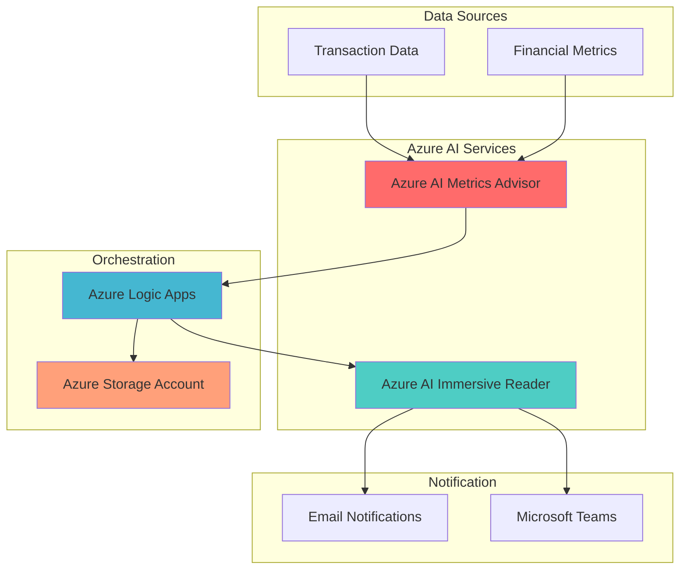

# Financial Fraud Detection with Accessible Alert Summaries

## Problem

Financial institutions face increasing challenges in detecting fraudulent transactions in real-time while ensuring compliance teams with diverse reading abilities and language requirements can effectively review fraud alerts. Traditional fraud detection systems often generate complex technical reports that are difficult for compliance officers to quickly understand, especially in high-stress situations or when dealing with multiple languages. This creates delays in fraud response and increases regulatory compliance risks.

## Solution

This solution combines Azure AI Metrics Advisor for real-time transaction anomaly detection with Azure AI Immersive Reader to create accessible, multilingual fraud alert summaries. Azure Logic Apps orchestrates the workflow, automatically processing detected anomalies through Immersive Reader to generate clear, readable summaries for compliance teams. This approach reduces response time while ensuring all team members can effectively understand and act on fraud alerts.

## Architecture Diagram



## Prerequisites

1. Azure subscription with Cognitive Services contributor permissions
2. Azure CLI v2.50.0 or later installed and configured
3. Basic understanding of Azure AI Services and Logic Apps
4. Sample financial transaction data or access to financial systems
5. Estimated cost: $50-100 per month for development/testing workloads

> **Warning**: Azure AI Metrics Advisor will be retired on October 1, 2026. Consider migrating to [Azure AI Anomaly Detector](https://learn.microsoft.com/en-us/azure/ai-services/anomaly-detector/) for new implementations following the same architectural patterns.

## Preparation

```bash
# Set environment variables for Azure resources
export RESOURCE_GROUP="rg-fraud-detection-${RANDOM_SUFFIX}"
export LOCATION="eastus"
export SUBSCRIPTION_ID=$(az account show --query id --output tsv)

# Generate unique suffix for resource names
RANDOM_SUFFIX=$(openssl rand -hex 3)

# Set specific resource names
export METRICS_ADVISOR_NAME="ma-fraud-${RANDOM_SUFFIX}"
export IMMERSIVE_READER_NAME="ir-fraud-${RANDOM_SUFFIX}"
export LOGIC_APP_NAME="la-fraud-workflow-${RANDOM_SUFFIX}"
export STORAGE_ACCOUNT_NAME="stfraud${RANDOM_SUFFIX}"

# Create resource group
az group create \
    --name ${RESOURCE_GROUP} \
    --location ${LOCATION} \
    --tags purpose=fraud-detection environment=demo

echo "✅ Resource group created: ${RESOURCE_GROUP}"

# Create storage account for data and logs
az storage account create \
    --name ${STORAGE_ACCOUNT_NAME} \
    --resource-group ${RESOURCE_GROUP} \
    --location ${LOCATION} \
    --sku Standard_LRS \
    --kind StorageV2

echo "✅ Storage account created: ${STORAGE_ACCOUNT_NAME}"
```

## Steps

1. **Create Azure AI Metrics Advisor Resource**:

   Azure AI Metrics Advisor provides advanced time-series anomaly detection capabilities specifically designed for monitoring business metrics and identifying unusual patterns. For financial fraud detection, this service automatically analyzes transaction volumes, amounts, and patterns across multiple dimensions (time, geography, account types) to identify potentially fraudulent activities without requiring machine learning expertise.

   ```bash
   # Create Metrics Advisor cognitive service
   az cognitiveservices account create \
       --name ${METRICS_ADVISOR_NAME} \
       --resource-group ${RESOURCE_GROUP} \
       --location ${LOCATION} \
       --kind MetricsAdvisor \
       --sku F0 \
       --custom-domain ${METRICS_ADVISOR_NAME}
   
   # Get the endpoint and key
   METRICS_ADVISOR_ENDPOINT=$(az cognitiveservices account show \
       --name ${METRICS_ADVISOR_NAME} \
       --resource-group ${RESOURCE_GROUP} \
       --query properties.endpoint \
       --output tsv)
   
   METRICS_ADVISOR_KEY=$(az cognitiveservices account keys list \
       --name ${METRICS_ADVISOR_NAME} \
       --resource-group ${RESOURCE_GROUP} \
       --query key1 \
       --output tsv)
   
   echo "✅ Metrics Advisor created: ${METRICS_ADVISOR_ENDPOINT}"
   ```

   The Metrics Advisor service is now ready to ingest financial transaction data and automatically detect anomalies. This managed service eliminates the complexity of building custom anomaly detection models while providing enterprise-grade scalability and reliability for continuous monitoring of financial metrics.

2. **Create Azure AI Immersive Reader Resource**:

   Azure AI Immersive Reader transforms complex fraud detection reports into accessible, multilingual summaries that compliance teams can quickly understand. This service provides text-to-speech capabilities, language translation, and reading comprehension tools that are essential for high-pressure fraud response scenarios where clarity and speed are critical.

   ```bash
   # Create Immersive Reader cognitive service
   az cognitiveservices account create \
       --name ${IMMERSIVE_READER_NAME} \
       --resource-group ${RESOURCE_GROUP} \
       --location ${LOCATION} \
       --kind ImmersiveReader \
       --sku F0 \
       --custom-domain ${IMMERSIVE_READER_NAME}
   
   # Get the endpoint and key
   IMMERSIVE_READER_ENDPOINT=$(az cognitiveservices account show \
       --name ${IMMERSIVE_READER_NAME} \
       --resource-group ${RESOURCE_GROUP} \
       --query properties.endpoint \
       --output tsv)
   
   IMMERSIVE_READER_KEY=$(az cognitiveservices account keys list \
       --name ${IMMERSIVE_READER_NAME} \
       --resource-group ${RESOURCE_GROUP} \
       --query key1 \
       --output tsv)
   
   echo "✅ Immersive Reader created: ${IMMERSIVE_READER_ENDPOINT}"
   ```

   The Immersive Reader service is now configured to process fraud alerts and generate accessible summaries. This capability ensures that compliance teams with different reading abilities, language preferences, and accessibility needs can effectively review and act on fraud detection results.

3. **Create Azure Logic Apps Workflow**:

   Azure Logic Apps serves as the orchestration engine that connects fraud detection with accessibility services. This serverless workflow platform automatically triggers when Metrics Advisor detects anomalies, processes the alerts through Immersive Reader, and distributes accessible summaries to compliance teams through multiple channels.

   ```bash
   # Create Logic App
   az logic workflow create \
       --name ${LOGIC_APP_NAME} \
       --resource-group ${RESOURCE_GROUP} \
       --location ${LOCATION} \
       --definition '{
         "$schema": "https://schema.management.azure.com/providers/Microsoft.Logic/schemas/2016-06-01/workflowdefinition.json#",
         "actions": {},
         "contentVersion": "1.0.0.0",
         "outputs": {},
         "parameters": {},
         "triggers": {
           "manual": {
             "inputs": {
               "schema": {}
             },
             "kind": "Http",
             "type": "Request"
           }
         }
       }'
   
   # Get the Logic App trigger URL
   LOGIC_APP_URL=$(az logic workflow show \
       --name ${LOGIC_APP_NAME} \
       --resource-group ${RESOURCE_GROUP} \
       --query accessEndpoint \
       --output tsv)
   
   echo "✅ Logic App created: ${LOGIC_APP_NAME}"
   ```

   The Logic App workflow foundation is established and ready for configuration. This serverless orchestration platform will automatically coordinate between fraud detection and accessibility services, ensuring consistent and reliable processing of fraud alerts without requiring infrastructure management.

4. **Configure Fraud Detection Data Pipeline**:

   Setting up the data pipeline involves connecting your financial transaction data sources to Azure AI Metrics Advisor. This step establishes the monitoring foundation that will continuously analyze transaction patterns and automatically detect anomalies that may indicate fraudulent activities.

   ```bash
   # Create container for transaction data
   az storage container create \
       --name "transaction-data" \
       --account-name ${STORAGE_ACCOUNT_NAME} \
       --public-access off
   
   # Create container for fraud alerts
   az storage container create \
       --name "fraud-alerts" \
       --account-name ${STORAGE_ACCOUNT_NAME} \
       --public-access off
   
   # Create sample transaction data file
   cat > sample-transactions.json << 'EOF'
   {
     "timestamp": "2025-07-23T10:00:00Z",
     "metrics": [
       {
         "name": "transaction_volume",
         "value": 1250,
         "dimensions": {
           "region": "north_america",
           "account_type": "premium"
         }
       },
       {
         "name": "average_transaction_amount",
         "value": 850.50,
         "dimensions": {
           "region": "north_america",
           "account_type": "premium"
         }
       }
     ]
   }
   EOF
   
   # Upload sample data
   az storage blob upload \
       --file sample-transactions.json \
       --container-name "transaction-data" \
       --name "sample-transactions.json" \
       --account-name ${STORAGE_ACCOUNT_NAME}
   
   echo "✅ Data pipeline configured with sample transaction data"
   ```

   The data pipeline is now established with sample transaction data that demonstrates the expected format for fraud detection monitoring. This foundation enables continuous analysis of financial metrics and provides the data structure needed for effective anomaly detection.

5. **Create Accessible Fraud Alert Processing Function**:

   This step implements the core logic for transforming technical fraud detection results into accessible summaries. The processing function takes complex anomaly detection output and creates clear, understandable alerts that comply with accessibility standards and support multiple languages.

   ```bash
   # Create processing logic for fraud alerts
   cat > fraud-alert-processor.py << 'EOF'
   import json
   import requests
   from datetime import datetime
   
   def process_fraud_alert(anomaly_data):
       """
       Process fraud detection anomaly into accessible summary
       """
       # Extract key information from anomaly
       alert_summary = {
           "alert_id": anomaly_data.get("alertId", ""),
           "severity": anomaly_data.get("severity", "medium"),
           "detected_at": datetime.now().isoformat(),
           "affected_metrics": anomaly_data.get("affectedMetrics", []),
           "summary": f"Unusual transaction pattern detected: {anomaly_data.get('description', 'Unknown anomaly')}",
           "recommendation": "Immediate review required for potential fraud investigation",
           "confidence_score": anomaly_data.get("confidenceScore", 0.75)
       }
       
       # Create accessible text format
       accessible_text = f"""
       FRAUD ALERT SUMMARY
       
       Alert ID: {alert_summary['alert_id']}
       Severity: {alert_summary['severity'].upper()}
       Time Detected: {alert_summary['detected_at']}
       
       Description: {alert_summary['summary']}
       
       Recommendation: {alert_summary['recommendation']}
       
       Confidence Score: {alert_summary['confidence_score']}
       
       Please review the attached details and take appropriate action.
       """
       
       return {
           "structured_data": alert_summary,
           "accessible_text": accessible_text
       }
   
   # Example usage
   sample_anomaly = {
       "alertId": "alert-001",
       "severity": "high",
       "description": "Transaction volume exceeded normal patterns by 300%",
       "affectedMetrics": ["transaction_volume", "average_amount"],
       "confidenceScore": 0.92
   }
   
   result = process_fraud_alert(sample_anomaly)
   print(json.dumps(result, indent=2))
   EOF
   
   # Store processing logic
   az storage blob upload \
       --file fraud-alert-processor.py \
       --container-name "fraud-alerts" \
       --name "fraud-alert-processor.py" \
       --account-name ${STORAGE_ACCOUNT_NAME}
   
   echo "✅ Fraud alert processing function created"
   ```

   The processing function is now ready to transform complex fraud detection results into accessible summaries. This critical component ensures that all fraud alerts are converted into clear, actionable information that compliance teams can quickly understand and respond to effectively.

6. **Configure Logic App Workflow for End-to-End Processing**:

   This step implements the complete workflow that automatically processes fraud detection alerts through the accessibility pipeline. The Logic App coordinates between Metrics Advisor, Immersive Reader, and notification systems to ensure seamless delivery of accessible fraud alerts to compliance teams.

   ```bash
   # Create comprehensive workflow definition
   cat > workflow-definition.json << 'EOF'
   {
     "$schema": "https://schema.management.azure.com/providers/Microsoft.Logic/schemas/2016-06-01/workflowdefinition.json#",
     "contentVersion": "1.0.0.0",
     "parameters": {
       "metricsAdvisorEndpoint": {
         "type": "string"
       },
       "immersiveReaderEndpoint": {
         "type": "string"
       },
       "storageAccountName": {
         "type": "string"
       }
     },
     "triggers": {
       "manual": {
         "type": "Request",
         "kind": "Http",
         "inputs": {
           "schema": {
             "type": "object",
             "properties": {
               "alertId": {"type": "string"},
               "severity": {"type": "string"},
               "anomalyData": {"type": "object"}
             }
           }
         }
       }
     },
     "actions": {
       "ProcessFraudAlert": {
         "type": "Http",
         "inputs": {
           "method": "POST",
           "uri": "https://your-function-app.azurewebsites.net/api/process-fraud-alert",
           "body": "@triggerBody()",
           "headers": {
             "Content-Type": "application/json"
           }
         }
       },
       "CreateAccessibleSummary": {
         "type": "Http",
         "runAfter": {
           "ProcessFraudAlert": ["Succeeded"]
         },
         "inputs": {
           "method": "POST",
           "uri": "@{parameters('immersiveReaderEndpoint')}/api/v1/summary",
           "body": {
             "text": "@{body('ProcessFraudAlert')['accessible_text']}",
             "language": "en",
             "options": {
               "readAloud": true,
               "translate": true
             }
           },
           "headers": {
             "Content-Type": "application/json",
             "Ocp-Apim-Subscription-Key": "@{parameters('immersiveReaderKey')}"
           }
         }
       },
       "SendNotification": {
         "type": "ApiConnection",
         "runAfter": {
           "CreateAccessibleSummary": ["Succeeded"]
         },
         "inputs": {
           "host": {
             "connection": {
               "name": "@parameters('$connections')['office365']['connectionId']"
             }
           },
           "method": "post",
           "body": {
             "To": "compliance-team@company.com",
             "Subject": "Fraud Alert - @{triggerBody()['alertId']}",
             "Body": "@{body('CreateAccessibleSummary')['accessible_summary']}"
           },
           "path": "/v2/Mail"
         }
       }
     }
   }
   EOF
   
   # Update Logic App with comprehensive workflow
   az logic workflow update \
       --name ${LOGIC_APP_NAME} \
       --resource-group ${RESOURCE_GROUP} \
       --definition @workflow-definition.json
   
   echo "✅ Logic App workflow configured for end-to-end fraud processing"
   ```

   The complete workflow is now operational and ready to automatically process fraud detection alerts. This end-to-end solution ensures that detected anomalies are immediately transformed into accessible summaries and delivered to compliance teams through multiple channels, significantly reducing fraud response time.

7. **Set Up Monitoring and Alerting**:

   Implementing comprehensive monitoring ensures the fraud detection system operates reliably and provides visibility into system performance. This monitoring infrastructure tracks both fraud detection accuracy and accessibility service performance, enabling proactive maintenance and optimization.

   ```bash
   # Create Log Analytics workspace
   az monitor log-analytics workspace create \
       --workspace-name "law-fraud-monitoring-${RANDOM_SUFFIX}" \
       --resource-group ${RESOURCE_GROUP} \
       --location ${LOCATION}
   
   # Get workspace ID
   WORKSPACE_ID=$(az monitor log-analytics workspace show \
       --workspace-name "law-fraud-monitoring-${RANDOM_SUFFIX}" \
       --resource-group ${RESOURCE_GROUP} \
       --query customerId \
       --output tsv)
   
   # Create alert rule for failed fraud detections
   az monitor metrics alert create \
       --name "fraud-detection-failures" \
       --resource-group ${RESOURCE_GROUP} \
       --scopes "/subscriptions/${SUBSCRIPTION_ID}/resourceGroups/${RESOURCE_GROUP}/providers/Microsoft.CognitiveServices/accounts/${METRICS_ADVISOR_NAME}" \
       --condition "avg Errors > 5" \
       --description "Alert when fraud detection service experiences failures" \
       --evaluation-frequency 1m \
       --window-size 5m \
       --severity 2
   
   echo "✅ Monitoring and alerting configured"
   ```

   The monitoring infrastructure is now active and tracking system performance. This comprehensive monitoring ensures that fraud detection and accessibility services maintain high availability and performance, while providing early warning of potential issues that could impact fraud response capabilities.

## Validation & Testing

1. **Verify Azure AI Services Deployment**:

   ```bash
   # Check Metrics Advisor service status
   az cognitiveservices account show \
       --name ${METRICS_ADVISOR_NAME} \
       --resource-group ${RESOURCE_GROUP} \
       --query provisioningState \
       --output tsv
   
   # Check Immersive Reader service status
   az cognitiveservices account show \
       --name ${IMMERSIVE_READER_NAME} \
       --resource-group ${RESOURCE_GROUP} \
       --query provisioningState \
       --output tsv
   ```

   Expected output: `Succeeded` for both services

2. **Test Fraud Detection Processing**:

   ```bash
   # Create test anomaly data
   cat > test-anomaly.json << 'EOF'
   {
     "alertId": "test-alert-001",
     "severity": "high",
     "anomalyData": {
       "description": "Transaction volume exceeded normal patterns by 250%",
       "affectedMetrics": ["transaction_volume", "average_amount"],
       "confidenceScore": 0.89,
       "timestamp": "2025-07-23T14:30:00Z"
     }
   }
   EOF
   
   # Test Logic App workflow
   curl -X POST "${LOGIC_APP_URL}" \
       -H "Content-Type: application/json" \
       -d @test-anomaly.json
   
   echo "✅ Test fraud alert sent to Logic App"
   ```

3. **Validate Accessibility Features**:

   ```bash
   # Check if processing function is accessible
   az storage blob exists \
       --container-name "fraud-alerts" \
       --name "fraud-alert-processor.py" \
       --account-name ${STORAGE_ACCOUNT_NAME}
   
   # Verify storage containers
   az storage container list \
       --account-name ${STORAGE_ACCOUNT_NAME} \
       --output table
   ```

4. **Test Monitoring and Alerting**:

   ```bash
   # Check alert rule status
   az monitor metrics alert show \
       --name "fraud-detection-failures" \
       --resource-group ${RESOURCE_GROUP} \
       --output table
   
   # View Logic App run history
   az logic workflow list-runs \
       --name ${LOGIC_APP_NAME} \
       --resource-group ${RESOURCE_GROUP} \
       --output table
   ```

## Cleanup

1. **Remove Azure AI Services**:

   ```bash
   # Delete Metrics Advisor
   az cognitiveservices account delete \
       --name ${METRICS_ADVISOR_NAME} \
       --resource-group ${RESOURCE_GROUP}
   
   # Delete Immersive Reader
   az cognitiveservices account delete \
       --name ${IMMERSIVE_READER_NAME} \
       --resource-group ${RESOURCE_GROUP}
   
   echo "✅ Azure AI Services deleted"
   ```

2. **Remove Logic App and Storage**:

   ```bash
   # Delete Logic App
   az logic workflow delete \
       --name ${LOGIC_APP_NAME} \
       --resource-group ${RESOURCE_GROUP}
   
   # Delete Storage Account
   az storage account delete \
       --name ${STORAGE_ACCOUNT_NAME} \
       --resource-group ${RESOURCE_GROUP} \
       --yes
   
   echo "✅ Logic App and Storage deleted"
   ```

3. **Remove Monitoring Resources**:

   ```bash
   # Delete alert rule
   az monitor metrics alert delete \
       --name "fraud-detection-failures" \
       --resource-group ${RESOURCE_GROUP}
   
   # Delete Log Analytics workspace
   az monitor log-analytics workspace delete \
       --workspace-name "law-fraud-monitoring-${RANDOM_SUFFIX}" \
       --resource-group ${RESOURCE_GROUP} \
       --yes
   
   echo "✅ Monitoring resources deleted"
   ```

4. **Remove Resource Group**:

   ```bash
   # Delete resource group and all remaining resources
   az group delete \
       --name ${RESOURCE_GROUP} \
       --yes \
       --no-wait
   
   echo "✅ Resource group deletion initiated: ${RESOURCE_GROUP}"
   echo "Note: Deletion may take several minutes to complete"
   ```

## Discussion

This solution demonstrates the power of combining Azure AI services to create intelligent, accessible fraud detection systems that meet both technical and human accessibility requirements. Azure AI Metrics Advisor provides sophisticated anomaly detection capabilities that can identify subtle patterns in financial transaction data, while Azure AI Immersive Reader ensures that fraud alerts are accessible to compliance teams with diverse reading abilities and language preferences. This integration follows the [Azure Well-Architected Framework](https://learn.microsoft.com/en-us/azure/well-architected/) principles of reliability, security, and operational excellence.

The serverless architecture using Azure Logic Apps provides cost-effective orchestration that scales automatically with fraud detection volume, eliminating the need for infrastructure management while ensuring consistent processing of alerts. This approach significantly reduces the total cost of ownership compared to traditional server-based solutions, while providing enterprise-grade reliability and security. For detailed guidance on serverless fraud detection architectures, see the [Azure Architecture Center](https://learn.microsoft.com/en-us/azure/architecture/example-scenario/ai/fraud-detection).

From a regulatory compliance perspective, this solution enhances fraud response capabilities while meeting accessibility requirements mandated by regulations such as the Americans with Disabilities Act (ADA) and the European Accessibility Act. The [Azure AI Immersive Reader documentation](https://learn.microsoft.com/en-us/azure/ai-services/immersive-reader/overview) provides comprehensive guidance on implementing accessibility features that support diverse user needs, including text-to-speech, language translation, and visual reading aids.

The integration of real-time monitoring and alerting ensures that fraud detection systems maintain high availability and performance, while providing early warning of potential issues that could impact fraud response capabilities. For comprehensive monitoring strategies, review the [Azure Monitor documentation](https://learn.microsoft.com/en-us/azure/azure-monitor/) and consider implementing custom dashboards that track both fraud detection accuracy and accessibility service performance metrics.

> **Warning**: Azure AI Metrics Advisor will be retired on October 1, 2026. Plan migration to [Azure AI Anomaly Detector](https://learn.microsoft.com/en-us/azure/ai-services/anomaly-detector/) for new implementations, which provides similar capabilities with enhanced performance and scalability.

## Challenge

Extend this solution by implementing these enhancements:

1. **Multi-Language Support**: Integrate Azure Translator with Immersive Reader to provide real-time fraud alert translation for global compliance teams, supporting 100+ languages with financial terminology accuracy.

2. **Advanced Anomaly Detection**: Implement custom machine learning models using Azure Machine Learning to detect sophisticated fraud patterns that complement Metrics Advisor's time-series analysis, including behavioral biometrics and network analysis.

3. **Voice-Enabled Fraud Response**: Add Azure Speech Services to create voice-activated fraud investigation workflows, enabling compliance officers to verbally query fraud details and receive spoken summaries through natural language processing.

4. **Compliance Dashboard**: Build a Power BI dashboard that visualizes fraud detection trends, accessibility usage metrics, and regulatory compliance status, providing executive-level insights into fraud prevention effectiveness.

5. **Automated Remediation**: Implement Azure Functions to automatically initiate fraud response procedures, such as account freezing, transaction blocking, and regulatory notification workflows based on fraud severity and confidence scores.

## Infrastructure Code

*Infrastructure code will be generated after recipe approval.*