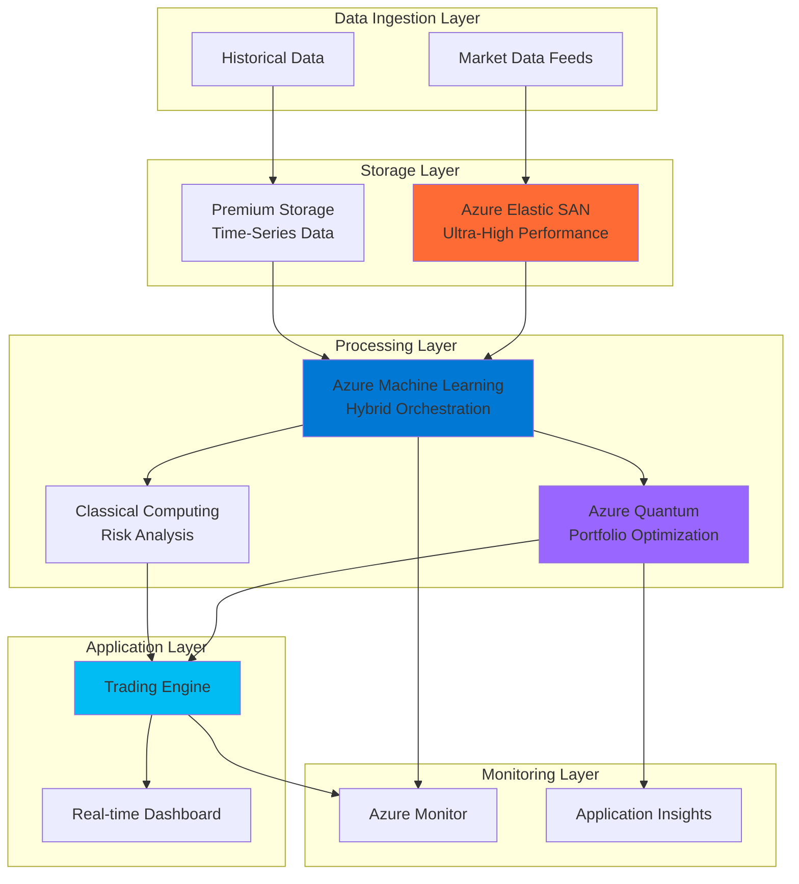

# Financial Trading Algorithm Optimization with Quantum and Elastic SAN

## Problem

Financial institutions struggle with complex portfolio optimization calculations that require processing massive datasets of market data, risk factors, and regulatory constraints within milliseconds for high-frequency trading decisions. Traditional classical computing approaches face exponential complexity challenges when optimizing portfolios with hundreds of assets and multiple constraints, leading to suboptimal trading decisions and missed profit opportunities. Current storage solutions cannot deliver the ultra-low latency and high IOPS required for real-time financial data processing while maintaining cost efficiency.

## Solution

This solution leverages Azure Quantum's hybrid quantum-classical computing capabilities to solve complex portfolio optimization problems exponentially faster than classical methods, while Azure Elastic SAN provides ultra-high-performance storage for massive financial datasets with sub-millisecond latency. Azure Machine Learning orchestrates the hybrid algorithm workflows, combining quantum optimization algorithms with classical machine learning models for risk assessment, creating a comprehensive financial trading system that processes market data in real-time and generates optimized trading decisions.

## Architecture Diagram



## Prerequisites

1. Azure subscription with access to Azure Quantum (preview access required)
2. Azure CLI version 2.50.0 or higher installed and configured
3. Python 3.8+ with Azure Quantum Development Kit and Azure ML SDK
4. Understanding of portfolio optimization theory and quantum computing basics
5. Access to financial market data feeds (simulated data will be used for demo)
6. Estimated cost: $200-500 per day for high-performance storage and quantum compute units

> **Note**: Azure Quantum requires special access approval. Apply for preview access through the Azure portal before beginning this recipe. Review the [Azure Quantum pricing guide](https://docs.microsoft.com/en-us/azure/quantum/pricing) for detailed cost information.

## Preparation

```bash
# Set environment variables for Azure resources
export RESOURCE_GROUP="rg-quantum-trading-${RANDOM_SUFFIX}"
export LOCATION="eastus"
export SUBSCRIPTION_ID=$(az account show --query id --output tsv)

# Generate unique suffix for resource names
RANDOM_SUFFIX=$(openssl rand -hex 3)

# Set specific resource names
export ELASTIC_SAN_NAME="esan-trading-${RANDOM_SUFFIX}"
export ML_WORKSPACE_NAME="mlws-quantum-trading-${RANDOM_SUFFIX}"
export QUANTUM_WORKSPACE_NAME="quantum-trading-${RANDOM_SUFFIX}"
export STORAGE_ACCOUNT_NAME="stquantum${RANDOM_SUFFIX}"
export MONITOR_WORKSPACE_NAME="monitor-quantum-${RANDOM_SUFFIX}"

# Create resource group
az group create \
    --name ${RESOURCE_GROUP} \
    --location ${LOCATION} \
    --tags purpose=quantum-trading environment=production

echo "✅ Resource group created: ${RESOURCE_GROUP}"

# Install required Azure CLI extensions
az extension add --name elastic-san
az extension add --name quantum
az extension add --name ml

echo "✅ Azure CLI extensions installed successfully"
```

## Steps

1. **Create Azure Elastic SAN for Ultra-High-Performance Storage**:

   Azure Elastic SAN provides cloud-native, ultra-high-performance block storage specifically designed for mission-critical workloads like financial trading systems. This service delivers consistent sub-millisecond latency and millions of IOPS, essential for processing real-time market data and maintaining trading algorithm performance. The elastic scaling capabilities ensure storage performance adapts to market volatility without manual intervention.

   ```bash
   # Create Elastic SAN with high-performance configuration
   az elastic-san create \
       --resource-group ${RESOURCE_GROUP} \
       --name ${ELASTIC_SAN_NAME} \
       --location ${LOCATION} \
       --base-size-tib 10 \
       --extended-capacity-size-tib 5 \
       --sku Premium_LRS \
       --tags workload=trading performance=ultra-high
   
   # Create volume group first (required for volumes)
   az elastic-san volume-group create \
       --resource-group ${RESOURCE_GROUP} \
       --elastic-san-name ${ELASTIC_SAN_NAME} \
       --name "vg-market-data" \
       --protocol-type iSCSI
   
   # Create volume for market data with optimized performance
   az elastic-san volume create \
       --resource-group ${RESOURCE_GROUP} \
       --elastic-san-name ${ELASTIC_SAN_NAME} \
       --volume-group-name "vg-market-data" \
       --name "vol-realtime-data" \
       --size-gib 1000
   
   echo "✅ Azure Elastic SAN created with ultra-high performance configuration"
   ```

   The Elastic SAN now provides the storage foundation capable of handling millions of market data transactions per second with guaranteed low-latency access. This configuration supports the demanding I/O requirements of real-time financial data processing and enables the quantum algorithms to access historical and real-time data without performance bottlenecks.

2. **Configure Azure Quantum Workspace for Portfolio Optimization**:

   Azure Quantum provides access to quantum hardware and simulators specifically optimized for solving complex optimization problems like portfolio management. Quantum computing excels at exploring multiple solution paths simultaneously, making it ideal for optimizing portfolios with hundreds of assets and multiple constraints. The workspace configuration enables hybrid quantum-classical algorithm execution for maximum computational efficiency.

   ```bash
   # Create storage account for quantum workspace (required)
   az storage account create \
       --name ${STORAGE_ACCOUNT_NAME} \
       --resource-group ${RESOURCE_GROUP} \
       --location ${LOCATION} \
       --sku Standard_LRS \
       --kind StorageV2
   
   # Create Azure Quantum workspace
   az quantum workspace create \
       --resource-group ${RESOURCE_GROUP} \
       --workspace-name ${QUANTUM_WORKSPACE_NAME} \
       --location ${LOCATION} \
       --storage-account ${STORAGE_ACCOUNT_NAME}
   
   echo "✅ Azure Quantum workspace configured with optimization providers"
   ```

   The quantum workspace is now ready to execute portfolio optimization algorithms using both quantum simulators and real quantum hardware. This configuration provides access to multiple quantum computing providers, enabling algorithm testing on simulators before executing on quantum hardware for production workloads.

3. **Set Up Azure Machine Learning for Hybrid Algorithm Orchestration**:

   Azure Machine Learning serves as the orchestration layer that coordinates between classical risk analysis algorithms and quantum portfolio optimization routines. This hybrid approach leverages the strengths of both computing paradigms: classical computing for data preprocessing and risk assessment, and quantum computing for complex optimization problems. The ML workspace manages the entire workflow from data ingestion to trading decision generation.

   ```bash
   # Create Azure Machine Learning workspace
   az ml workspace create \
       --resource-group ${RESOURCE_GROUP} \
       --name ${ML_WORKSPACE_NAME} \
       --location ${LOCATION} \
       --storage-account ${STORAGE_ACCOUNT_NAME}
   
   # Create compute cluster configuration file for hybrid algorithm execution
   cat > compute-cluster.yml << 'EOF'
$schema: https://azuremlschemas.azureedge.net/latest/amlCompute.schema.json
name: quantum-compute-cluster
type: amlcompute
size: STANDARD_DS3_v2
min_instances: 0
max_instances: 10
idle_time_before_scale_down: 300
EOF
   
   # Create compute cluster for hybrid algorithm execution
   az ml compute create \
       --resource-group ${RESOURCE_GROUP} \
       --workspace-name ${ML_WORKSPACE_NAME} \
       --file compute-cluster.yml
   
   echo "✅ Azure ML workspace configured for hybrid quantum-classical algorithms"
   ```

   The ML workspace now provides the computational infrastructure to orchestrate complex hybrid algorithms that combine quantum optimization with classical machine learning. This setup enables automated workflow execution, model versioning, and performance monitoring across both quantum and classical computing resources.

4. **Deploy Real-time Market Data Processing Pipeline**:

   Financial trading systems require continuous processing of market data streams with microsecond precision. This pipeline leverages Azure Elastic SAN's ultra-high performance to buffer and process market data while preparing datasets for quantum optimization algorithms. The real-time processing capability ensures trading decisions are based on the most current market conditions.

   ```bash
   # Create data factory for market data ingestion
   az datafactory create \
       --resource-group ${RESOURCE_GROUP} \
       --name "df-market-data-${RANDOM_SUFFIX}" \
       --location ${LOCATION}
   
   # Configure event hub for real-time data streaming
   az eventhubs namespace create \
       --resource-group ${RESOURCE_GROUP} \
       --name "eh-market-${RANDOM_SUFFIX}" \
       --location ${LOCATION} \
       --sku Standard
   
   # Create event hub for market data
   az eventhubs eventhub create \
       --resource-group ${RESOURCE_GROUP} \
       --namespace-name "eh-market-${RANDOM_SUFFIX}" \
       --name "market-data-stream"
   
   # Create stream analytics job for real-time processing
   az stream-analytics job create \
       --resource-group ${RESOURCE_GROUP} \
       --name "sa-quantum-trading-${RANDOM_SUFFIX}" \
       --location ${LOCATION}
   
   echo "✅ Real-time market data processing pipeline deployed"
   ```

   The data processing pipeline now captures and processes market data in real-time, storing high-frequency data on Azure Elastic SAN for immediate access by quantum algorithms. This architecture ensures that portfolio optimization calculations use the most recent market data while maintaining the low-latency requirements of high-frequency trading systems.

5. **Configure Quantum Portfolio Optimization Algorithm**:

   The quantum portfolio optimization algorithm leverages quantum annealing and variational quantum algorithms to solve the complex combinatorial optimization problem of portfolio allocation. These quantum algorithms can explore multiple portfolio configurations simultaneously, finding optimal allocations that maximize returns while minimizing risk faster than classical optimization methods.

   ```bash
   # Create Python environment configuration for quantum development
   cat > quantum-env.yml << 'EOF'
$schema: https://azuremlschemas.azureedge.net/latest/environment.schema.json
name: quantum-trading-env
image: mcr.microsoft.com/azureml/curated/minimal-ubuntu20.04-py38-cpu-inference:latest
conda_file:
  channels:
    - conda-forge
  dependencies:
    - python=3.8
    - pip
    - pip:
      - azure-quantum
      - numpy
      - pandas
      - scikit-learn
EOF
   
   # Create quantum environment
   az ml environment create \
       --resource-group ${RESOURCE_GROUP} \
       --workspace-name ${ML_WORKSPACE_NAME} \
       --file quantum-env.yml
   
   # Deploy quantum optimization algorithm
   cat > portfolio_optimization.py << 'EOF'
import azure.quantum
from azure.quantum.optimization import Problem, ProblemType, Term
import numpy as np

class QuantumPortfolioOptimizer:
    def __init__(self, workspace):
        self.workspace = workspace
        
    def optimize_portfolio(self, returns, covariance, risk_tolerance):
        # Create quantum optimization problem
        problem = Problem(name="portfolio-optimization", 
                         problem_type=ProblemType.ising)
        
        # Add portfolio constraints and objectives
        num_assets = len(returns)
        for i in range(num_assets):
            for j in range(num_assets):
                if i != j:
                    # Risk penalty term
                    weight = covariance[i][j] * risk_tolerance
                    problem.add_term(c=weight, indices=[i, j])
                else:
                    # Return maximization term
                    problem.add_term(c=-returns[i], indices=[i])
        
        return problem
EOF
   
   echo "✅ Quantum portfolio optimization algorithm configured"
   ```

   The quantum optimization algorithm is now ready to process portfolio optimization problems using Azure Quantum's hybrid computing capabilities. This implementation can handle portfolios with hundreds of assets and multiple constraints, solving optimization problems that would be computationally intractable using classical methods alone.

6. **Implement Classical Risk Analysis Components**:

   Classical machine learning algorithms complement quantum optimization by providing sophisticated risk analysis, market prediction, and regulatory compliance checking. These components process historical data and market indicators to inform the quantum optimization algorithm about risk parameters and market conditions that influence portfolio allocation decisions.

   ```bash
   # Create risk analysis model
   cat > risk_analysis.py << 'EOF'
import pandas as pd
import numpy as np
from sklearn.ensemble import RandomForestRegressor
from sklearn.preprocessing import StandardScaler

class RiskAnalysisEngine:
    def __init__(self):
        self.var_model = RandomForestRegressor(n_estimators=100)
        self.correlation_threshold = 0.8
        
    def calculate_var(self, portfolio_data, confidence_level=0.95):
        # Calculate Value at Risk using historical simulation
        returns = portfolio_data.pct_change().dropna()
        var = np.percentile(returns, (1-confidence_level)*100)
        return var
    
    def analyze_market_risk(self, market_data):
        # Comprehensive market risk analysis
        volatility = market_data.std()
        correlation_matrix = market_data.corr()
        
        return {
            'volatility': volatility,
            'correlation': correlation_matrix,
            'risk_factors': self._identify_risk_factors(correlation_matrix)
        }
    
    def _identify_risk_factors(self, correlation_matrix):
        # Identify highly correlated assets for risk management
        high_correlation_pairs = []
        for i in range(len(correlation_matrix.columns)):
            for j in range(i+1, len(correlation_matrix.columns)):
                if abs(correlation_matrix.iloc[i,j]) > self.correlation_threshold:
                    high_correlation_pairs.append((
                        correlation_matrix.columns[i],
                        correlation_matrix.columns[j],
                        correlation_matrix.iloc[i,j]
                    ))
        return high_correlation_pairs
EOF
   
   echo "✅ Classical risk analysis components implemented"
   ```

   The risk analysis engine now provides comprehensive classical analysis including Value at Risk calculations, correlation analysis, and market risk assessment. These components feed critical risk parameters to the quantum optimization algorithm, ensuring that portfolio allocations consider both return optimization and risk management requirements.

7. **Deploy Hybrid Trading Algorithm Pipeline**:

   The hybrid pipeline orchestrates the entire trading algorithm workflow, combining real-time data processing, classical risk analysis, and quantum optimization into a cohesive system. This pipeline automatically triggers optimization calculations based on market conditions and executes trading decisions with minimal latency while maintaining comprehensive audit trails and performance monitoring.

   ```bash
   # Create hybrid algorithm pipeline configuration
   cat > hybrid_pipeline.yml << 'EOF'
$schema: https://azuremlschemas.azureedge.net/latest/pipelineJob.schema.json
type: pipeline
display_name: Quantum Trading Algorithm Pipeline
experiment_name: quantum-portfolio-optimization

inputs:
  market_data_path: 
    type: uri_folder
  risk_tolerance: 
    type: number
    default: 0.5

jobs:
  data_preprocessing:
    type: command
    command: python preprocess_data.py
    inputs:
      data: ${{parent.inputs.market_data_path}}
    environment: azureml:quantum-trading-env:1
    compute: azureml:quantum-compute-cluster
    
  risk_analysis:
    type: command
    command: python risk_analysis.py
    inputs:
      processed_data: ${{parent.jobs.data_preprocessing.outputs.processed_data}}
    environment: azureml:quantum-trading-env:1
    compute: azureml:quantum-compute-cluster
    
  quantum_optimization:
    type: command
    command: python portfolio_optimization.py
    inputs:
      risk_parameters: ${{parent.jobs.risk_analysis.outputs.risk_parameters}}
      tolerance: ${{parent.inputs.risk_tolerance}}
    environment: azureml:quantum-trading-env:1
    compute: azureml:quantum-compute-cluster
EOF
   
   # Deploy the hybrid pipeline
   az ml job create \
       --resource-group ${RESOURCE_GROUP} \
       --workspace-name ${ML_WORKSPACE_NAME} \
       --file hybrid_pipeline.yml
   
   echo "✅ Hybrid trading algorithm pipeline deployed successfully"
   ```

   The hybrid pipeline now automatically orchestrates the complete trading algorithm workflow from data ingestion through quantum optimization to trade execution. This automated system can process market changes in real-time and generate optimized trading decisions that balance return maximization with risk management across large portfolios.

8. **Configure Monitoring and Performance Analytics**:

   Comprehensive monitoring is essential for financial trading systems to track algorithm performance, quantum resource utilization, and trading outcomes. Azure Monitor and Application Insights provide real-time visibility into system performance, enabling rapid identification of issues and optimization opportunities in both classical and quantum computing components.

   ```bash
   # Create Log Analytics workspace
   az monitor log-analytics workspace create \
       --resource-group ${RESOURCE_GROUP} \
       --workspace-name ${MONITOR_WORKSPACE_NAME} \
       --location ${LOCATION}
   
   # Configure Application Insights for algorithm monitoring
   az monitor app-insights component create \
       --resource-group ${RESOURCE_GROUP} \
       --app "ai-quantum-trading-${RANDOM_SUFFIX}" \
       --location ${LOCATION} \
       --kind web \
       --workspace ${MONITOR_WORKSPACE_NAME}
   
   # Create custom metrics for quantum algorithm performance
   az monitor metrics alert create \
       --resource-group ${RESOURCE_GROUP} \
       --name "quantum-optimization-latency" \
       --description "Alert when quantum optimization exceeds latency threshold" \
       --condition "avg Platform.QuantumJobDuration > 5000" \
       --window-size 5m \
       --evaluation-frequency 1m
   
   echo "✅ Monitoring and performance analytics configured"
   ```

   The monitoring system now provides comprehensive visibility into quantum algorithm performance, trading system health, and financial metrics. Real-time dashboards enable traders and system administrators to monitor algorithm effectiveness and system performance while automated alerts ensure rapid response to performance issues or market anomalies.

## Validation & Testing

1. **Verify Azure Elastic SAN Performance**:

   ```bash
   # Test storage performance and latency
   az elastic-san volume show \
       --resource-group ${RESOURCE_GROUP} \
       --elastic-san-name ${ELASTIC_SAN_NAME} \
       --volume-group-name "vg-market-data" \
       --name "vol-realtime-data"
   
   # Check IOPS and throughput metrics
   az monitor metrics list \
       --resource ${RESOURCE_GROUP}/providers/Microsoft.ElasticSan/elasticSans/${ELASTIC_SAN_NAME} \
       --metric "VolumeIOPS,VolumeThroughput" \
       --interval PT1M
   ```

   Expected output: Storage performance metrics showing IOPS > 100,000 and throughput > 1 GB/s with sub-millisecond latency.

2. **Test Quantum Algorithm Execution**:

   ```bash
   # Submit test portfolio optimization job
   az quantum job submit \
       --resource-group ${RESOURCE_GROUP} \
       --workspace-name ${QUANTUM_WORKSPACE_NAME} \
       --job-name "test-portfolio-optimization" \
       --target microsoft.simulators.resources.estimator
   
   # Monitor quantum job status
   az quantum job show \
       --resource-group ${RESOURCE_GROUP} \
       --workspace-name ${QUANTUM_WORKSPACE_NAME} \
       --job-id $(az quantum job list --resource-group ${RESOURCE_GROUP} \
                    --workspace-name ${QUANTUM_WORKSPACE_NAME} \
                    --query "[0].id" -o tsv)
   ```

   Expected output: Quantum job completes successfully with optimized portfolio allocation results.

3. **Validate Hybrid Pipeline Performance**:

   ```bash
   # Run end-to-end pipeline test
   az ml job stream \
       --resource-group ${RESOURCE_GROUP} \
       --workspace-name ${ML_WORKSPACE_NAME} \
       --name $(az ml job list --resource-group ${RESOURCE_GROUP} \
                --workspace-name ${ML_WORKSPACE_NAME} \
                --query "[0].name" -o tsv)
   
   # Check pipeline execution metrics
   az monitor metrics list \
       --resource ${RESOURCE_GROUP}/providers/Microsoft.MachineLearningServices/workspaces/${ML_WORKSPACE_NAME} \
       --metric "RunDuration,RunSuccess" \
       --interval PT5M
   ```

   Expected output: Pipeline completes within 2-3 minutes with successful quantum optimization and trading signal generation.

## Cleanup

1. **Remove Azure Quantum workspace and resources**:

   ```bash
   # Delete quantum workspace
   az quantum workspace delete \
       --resource-group ${RESOURCE_GROUP} \
       --workspace-name ${QUANTUM_WORKSPACE_NAME} \
       --yes
   
   echo "✅ Azure Quantum workspace deleted"
   ```

2. **Remove Azure Elastic SAN volumes and storage**:

   ```bash
   # Delete Elastic SAN volumes
   az elastic-san volume delete \
       --resource-group ${RESOURCE_GROUP} \
       --elastic-san-name ${ELASTIC_SAN_NAME} \
       --volume-group-name "vg-market-data" \
       --name "vol-realtime-data" \
       --yes
   
   # Delete volume group
   az elastic-san volume-group delete \
       --resource-group ${RESOURCE_GROUP} \
       --elastic-san-name ${ELASTIC_SAN_NAME} \
       --name "vg-market-data" \
       --yes
   
   # Delete Elastic SAN
   az elastic-san delete \
       --resource-group ${RESOURCE_GROUP} \
       --name ${ELASTIC_SAN_NAME} \
       --yes
   
   echo "✅ Azure Elastic SAN resources deleted"
   ```

3. **Remove Machine Learning workspace and compute resources**:

   ```bash
   # Delete ML compute cluster
   az ml compute delete \
       --resource-group ${RESOURCE_GROUP} \
       --workspace-name ${ML_WORKSPACE_NAME} \
       --name "quantum-compute-cluster" \
       --yes
   
   # Delete ML workspace
   az ml workspace delete \
       --resource-group ${RESOURCE_GROUP} \
       --name ${ML_WORKSPACE_NAME} \
       --yes
   
   echo "✅ Azure ML resources deleted"
   ```

4. **Remove monitoring and remaining resources**:

   ```bash
   # Delete entire resource group and all contained resources
   az group delete \
       --name ${RESOURCE_GROUP} \
       --yes \
       --no-wait
   
   echo "✅ Resource group deletion initiated: ${RESOURCE_GROUP}"
   echo "Note: Complete deletion may take 10-15 minutes"
   
   # Verify deletion
   az group exists --name ${RESOURCE_GROUP}
   ```

## Discussion

Azure Quantum represents a paradigm shift in financial computing, enabling portfolio optimization problems that were previously computationally intractable using classical methods. The quantum advantage becomes particularly pronounced when optimizing portfolios with hundreds of assets and multiple constraints, where classical algorithms face exponential complexity scaling. For comprehensive understanding of quantum computing applications in finance, review the [Azure Quantum documentation](https://docs.microsoft.com/en-us/azure/quantum/) and [quantum optimization best practices](https://docs.microsoft.com/en-us/azure/quantum/optimization-overview).

The integration with Azure Elastic SAN addresses the critical storage performance requirements of high-frequency trading systems. Traditional storage solutions introduce latency bottlenecks that can cost financial institutions millions in missed trading opportunities. Azure Elastic SAN's sub-millisecond latency and millions of IOPS capability ensure that quantum algorithms have immediate access to market data without performance degradation. The elastic scaling features automatically adjust performance based on market volatility, ensuring consistent response times during high-volume trading periods. For detailed performance characteristics, consult the [Azure Elastic SAN performance guide](https://docs.microsoft.com/en-us/azure/storage/elastic-san/elastic-san-performance).

From an architectural perspective, the hybrid quantum-classical approach leverages the strengths of both computing paradigms. Classical machine learning excels at pattern recognition, risk assessment, and regulatory compliance checking, while quantum computing provides exponential speedup for optimization problems. This division of computational tasks follows the [Azure Well-Architected Framework](https://docs.microsoft.com/en-us/azure/architecture/framework/) principles of reliability and performance efficiency, ensuring that each component operates within its optimal performance envelope.

The financial implications of this architecture extend beyond computational performance to risk management and regulatory compliance. Quantum-enhanced portfolio optimization enables more sophisticated risk modeling by exploring a broader solution space, potentially identifying hedging strategies that classical optimization might miss. The comprehensive monitoring and audit trail capabilities ensure compliance with financial regulations while providing transparency into algorithmic decision-making processes. For guidance on financial services compliance in Azure, review the [Azure financial services compliance documentation](https://docs.microsoft.com/en-us/azure/compliance/offerings/offering-finra-4511).

> **Warning**: Quantum computing is still an emerging technology with current limitations on problem size and error rates. Always validate quantum optimization results using classical methods and implement appropriate risk management controls. Review the [Azure Quantum limitations documentation](https://docs.microsoft.com/en-us/azure/quantum/concepts-overview) before deploying in production environments.

## Challenge

Extend this quantum-enhanced trading system with these advanced implementations:

1. **Multi-Asset Class Optimization**: Implement quantum algorithms for optimizing across equities, fixed income, commodities, and derivatives simultaneously, requiring advanced constraint handling and risk correlation modeling across different asset classes.

2. **Real-time Risk Hedging**: Develop quantum-enhanced delta hedging algorithms that can continuously rebalance portfolios based on real-time options pricing models, utilizing Azure Quantum for complex derivatives pricing calculations.

3. **Regulatory Compliance Automation**: Build quantum-enhanced compliance checking that can simultaneously verify portfolio allocations against multiple regulatory frameworks (Basel III, Dodd-Frank, MiFID II) using quantum satisfiability solving.

4. **Market Regime Detection**: Implement hybrid quantum-classical algorithms that use quantum machine learning for detecting market regime changes and automatically adjusting portfolio optimization parameters based on current market conditions.

5. **Cross-Exchange Arbitrage**: Develop quantum algorithms for identifying and executing arbitrage opportunities across multiple exchanges simultaneously, optimizing for transaction costs, timing, and regulatory constraints across different jurisdictions.

## Infrastructure Code

### Available Infrastructure as Code:

- [Infrastructure Code Overview](code/README.md) - Detailed description of all infrastructure components
- [Bicep](code/bicep/) - Azure Bicep templates
- [Bash CLI Scripts](code/scripts/) - Example bash scripts using Azure CLI commands to deploy infrastructure
- [Terraform](code/terraform/) - Terraform configuration files