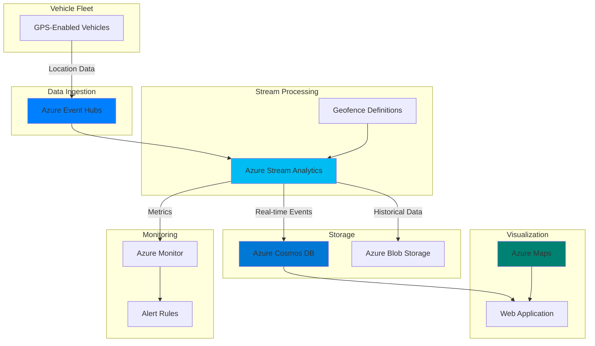

# Fleet Tracking with Geospatial Analytics

## Problem

Fleet management companies struggle to monitor vehicle locations in real-time, identify geo-fence violations, and optimize routes based on traffic conditions. Traditional batch processing systems introduce significant delays in detecting critical events like unauthorized vehicle movements or delivery delays, resulting in poor customer experiences and increased operational costs.

## Solution

Implement a real-time geospatial analytics platform using Azure Stream Analytics to process location data streams from vehicles, perform spatial analytics with built-in geospatial functions, and visualize results through Azure Maps. This serverless architecture automatically scales to handle millions of location updates while providing sub-second processing latency for immediate business insights.

## Architecture Diagram



## Prerequisites

1. Azure subscription with Owner or Contributor access
2. Azure CLI version 2.50.0 or later (or use Azure Cloud Shell)
3. Basic understanding of streaming analytics and SQL-like query language
4. Familiarity with JSON data formats and REST APIs
5. Estimated cost: ~$150/month for moderate workload (1000 vehicles, 1 update/minute)

> **Note**: This recipe uses consumption-based pricing for most services. Costs scale linearly with data volume and processing frequency.

## Preparation

```bash
# Set environment variables for Azure resources
export RESOURCE_GROUP="rg-geospatial-analytics-${RANDOM_SUFFIX}"
export LOCATION="eastus"
export SUBSCRIPTION_ID=$(az account show --query id --output tsv)

# Generate unique suffix for resource names
RANDOM_SUFFIX=$(openssl rand -hex 3)

# Set service-specific names
export EVENTHUB_NAMESPACE="ehns-fleet-${RANDOM_SUFFIX}"
export EVENTHUB_NAME="vehicle-locations"
export STORAGE_ACCOUNT="stfleet${RANDOM_SUFFIX}"
export ASA_JOB="asa-geospatial-${RANDOM_SUFFIX}"
export COSMOS_ACCOUNT="cosmos-fleet-${RANDOM_SUFFIX}"
export MAPS_ACCOUNT="maps-fleet-${RANDOM_SUFFIX}"

# Create resource group
az group create \
    --name ${RESOURCE_GROUP} \
    --location ${LOCATION} \
    --tags purpose=geospatial-analytics environment=demo

echo "✅ Resource group created: ${RESOURCE_GROUP}"

# Create storage account for Stream Analytics
az storage account create \
    --name ${STORAGE_ACCOUNT} \
    --resource-group ${RESOURCE_GROUP} \
    --location ${LOCATION} \
    --sku Standard_LRS \
    --kind StorageV2

echo "✅ Storage account created: ${STORAGE_ACCOUNT}"

# Create container for telemetry archive
az storage container create \
    --name telemetry-archive \
    --account-name ${STORAGE_ACCOUNT} \
    --public-access off

echo "✅ Storage container created for archival"
```

## Steps

1. **Create Event Hub for Location Data Ingestion**:

   Azure Event Hubs provides a highly scalable data streaming platform capable of ingesting millions of events per second. For fleet management scenarios, it serves as the entry point for real-time GPS location data from vehicles, providing built-in partitioning for parallel processing and guaranteed event ordering within partitions.

   ```bash
   # Create Event Hubs namespace
   az eventhubs namespace create \
       --name ${EVENTHUB_NAMESPACE} \
       --resource-group ${RESOURCE_GROUP} \
       --location ${LOCATION} \
       --sku Standard \
       --capacity 2
   
   # Create event hub for vehicle locations
   az eventhubs eventhub create \
       --name ${EVENTHUB_NAME} \
       --namespace-name ${EVENTHUB_NAMESPACE} \
       --resource-group ${RESOURCE_GROUP} \
       --partition-count 4 \
       --message-retention 1
   
   # Get connection string for Stream Analytics
   EVENTHUB_CONNECTION=$(az eventhubs namespace \
       authorization-rule keys list \
       --resource-group ${RESOURCE_GROUP} \
       --namespace-name ${EVENTHUB_NAMESPACE} \
       --name RootManageSharedAccessKey \
       --query primaryConnectionString \
       --output tsv)
   
   echo "✅ Event Hub created for location streaming"
   ```

   The Event Hub is now configured with 4 partitions for parallel processing and 1-day retention for replay scenarios. This setup can handle thousands of vehicles sending location updates every few seconds while maintaining low latency.

2. **Deploy Azure Cosmos DB for Real-Time Data Storage**:

   Azure Cosmos DB provides globally distributed, low-latency database services perfect for storing processed geospatial events. Its native support for geospatial queries and automatic indexing of location data makes it ideal for real-time fleet tracking applications requiring sub-10ms read latency worldwide.

   ```bash
   # Create Cosmos DB account with SQL API
   az cosmosdb create \
       --name ${COSMOS_ACCOUNT} \
       --resource-group ${RESOURCE_GROUP} \
       --locations regionName=${LOCATION} \
       --default-consistency-level Eventual \
       --enable-automatic-failover false
   
   # Create database
   az cosmosdb sql database create \
       --account-name ${COSMOS_ACCOUNT} \
       --resource-group ${RESOURCE_GROUP} \
       --name FleetAnalytics
   
   # Create container for location events
   az cosmosdb sql container create \
       --account-name ${COSMOS_ACCOUNT} \
       --resource-group ${RESOURCE_GROUP} \
       --database-name FleetAnalytics \
       --name LocationEvents \
       --partition-key-path /vehicleId \
       --throughput 400
   
   # Get connection details
   COSMOS_KEY=$(az cosmosdb keys list \
       --name ${COSMOS_ACCOUNT} \
       --resource-group ${RESOURCE_GROUP} \
       --query primaryKey \
       --output tsv)
   
   echo "✅ Cosmos DB deployed with geospatial support"
   ```

   The Cosmos DB container is partitioned by vehicleId for optimal query performance and uses 400 RU/s provisioned throughput. This configuration provides predictable performance for real-time dashboard queries while supporting geospatial indexing for location-based operations.

3. **Configure Azure Maps Account**:

   Azure Maps provides comprehensive mapping and location services including geocoding, routing, and traffic data. The service enables rich visualization of fleet movements, geofence boundaries, and real-time traffic conditions, essential for operational dashboards and customer-facing tracking applications.

   ```bash
   # Create Azure Maps account
   az maps account create \
       --name ${MAPS_ACCOUNT} \
       --resource-group ${RESOURCE_GROUP} \
       --sku S0
   
   # Get Maps primary key
   MAPS_KEY=$(az maps account keys list \
       --name ${MAPS_ACCOUNT} \
       --resource-group ${RESOURCE_GROUP} \
       --query primaryKey \
       --output tsv)
   
   # Create storage container for geofence data
   az storage container create \
       --name geofences \
       --account-name ${STORAGE_ACCOUNT} \
       --public-access off
   
   echo "✅ Azure Maps configured for visualization"
   ```

   The Maps account uses S0 pricing tier which includes 250,000 free transactions per month, suitable for development and testing. The geofence container stores polygon definitions that can be referenced by the Stream Analytics query for spatial operations.

4. **Create Stream Analytics Job with Geospatial Query**:

   Azure Stream Analytics provides real-time analytics on streaming data with built-in geospatial functions. These functions enable complex spatial operations like point-in-polygon checks for geofencing, distance calculations for proximity alerts, and route deviation detection—all executed in real-time on streaming data.

   ```bash
   # Create Stream Analytics job
   az stream-analytics job create \
       --job-name ${ASA_JOB} \
       --resource-group ${RESOURCE_GROUP} \
       --location ${LOCATION} \
       --output-error-policy Drop \
       --out-of-order-policy Adjust \
       --order-max-delay 5 \
       --arrival-max-delay 16
   
   # Configure Event Hub input using properties
   cat > input-properties.json << EOF
   {
       "type": "Stream",
       "datasource": {
           "type": "Microsoft.ServiceBus/EventHub",
           "properties": {
               "serviceBusNamespace": "${EVENTHUB_NAMESPACE}",
               "eventHubName": "${EVENTHUB_NAME}",
               "consumerGroupName": "\$Default",
               "sharedAccessPolicyName": "RootManageSharedAccessKey",
               "sharedAccessPolicyKey": "${EVENTHUB_CONNECTION##*SharedAccessKey=}"
           }
       },
       "serialization": {
           "type": "Json",
           "properties": {
               "encoding": "UTF8"
           }
       }
   }
   EOF
   
   az stream-analytics input create \
       --job-name ${ASA_JOB} \
       --resource-group ${RESOURCE_GROUP} \
       --input-name VehicleInput \
       --properties @input-properties.json
   
   echo "✅ Stream Analytics job created with input configured"
   ```

   The Stream Analytics job is configured with robust error handling policies that drop malformed events and adjust out-of-order events within a 5-second window. This ensures continuous processing even with irregular data arrival patterns common in mobile IoT scenarios.

5. **Define Geospatial Analytics Query**:

   The Stream Analytics query language extends SQL with temporal and geospatial functions specifically designed for streaming scenarios. This query demonstrates geofence monitoring, speed analysis, and anomaly detection—processing thousands of location updates per second with millisecond latency.

   ```bash
   # Create transformation with geospatial query
   cat > query.sql << 'EOF'
   WITH GeofencedData AS (
       SELECT
           vehicleId,
           location,
           speed,
           timestamp,
           ST_WITHIN(
               CreatePoint(CAST(location.longitude AS float), 
                         CAST(location.latitude AS float)),
               CreatePolygon(
                   CreatePoint(-122.135, 47.642),
                   CreatePoint(-122.135, 47.658),
                   CreatePoint(-122.112, 47.658),
                   CreatePoint(-122.112, 47.642),
                   CreatePoint(-122.135, 47.642)
               )
           ) AS isInZone,
           ST_DISTANCE(
               CreatePoint(CAST(location.longitude AS float), 
                         CAST(location.latitude AS float)),
               CreatePoint(-122.123, 47.650)
           ) AS distanceFromDepot
       FROM VehicleInput
   )
   SELECT
       vehicleId,
       location,
       speed,
       timestamp,
       isInZone,
       distanceFromDepot,
       CASE 
           WHEN speed > 80 THEN 'Speeding Alert'
           WHEN isInZone = 0 THEN 'Outside Geofence'
           ELSE 'Normal'
       END AS alertType
   INTO VehicleOutput
   FROM GeofencedData
   EOF
   
   # Create transformation using the query
   az stream-analytics transformation create \
       --job-name ${ASA_JOB} \
       --resource-group ${RESOURCE_GROUP} \
       --transformation-name Transformation \
       --streaming-units 6 \
       --saql @query.sql
   
   echo "✅ Geospatial query configured with transformation"
   ```

   This query performs real-time geofence monitoring and distance calculations for every incoming location update. The spatial functions process complex polygon intersections and distance computations at scale, enabling immediate detection of zone violations and proximity-based alerts.

6. **Configure Output to Cosmos DB**:

   Stream Analytics outputs enable processed events to flow into multiple destinations simultaneously. Cosmos DB serves as the primary real-time store for dashboard queries, while blob storage archives raw events for historical analysis and compliance requirements.

   ```bash
   # Configure Cosmos DB output
   cat > cosmos-output.json << EOF
   {
       "datasource": {
           "type": "Microsoft.Storage/DocumentDB",
           "properties": {
               "accountId": "${COSMOS_ACCOUNT}",
               "accountKey": "${COSMOS_KEY}",
               "database": "FleetAnalytics",
               "collectionNamePattern": "LocationEvents"
           }
       },
       "serialization": {
           "type": "Json",
           "properties": {
               "encoding": "UTF8",
               "format": "LineSeparated"
           }
       }
   }
   EOF
   
   az stream-analytics output create \
       --job-name ${ASA_JOB} \
       --resource-group ${RESOURCE_GROUP} \
       --output-name VehicleOutput \
       --datasource @cosmos-output.json \
       --serialization @cosmos-output.json
   
   # Configure blob storage output for archival
   STORAGE_KEY=$(az storage account keys list \
       --account-name ${STORAGE_ACCOUNT} \
       --resource-group ${RESOURCE_GROUP} \
       --query "[0].value" \
       --output tsv)
   
   cat > blob-output.json << EOF
   {
       "datasource": {
           "type": "Microsoft.Storage/Blob",
           "properties": {
               "storageAccounts": [{
                   "accountName": "${STORAGE_ACCOUNT}",
                   "accountKey": "${STORAGE_KEY}"
               }],
               "container": "telemetry-archive",
               "pathPattern": "vehicles/{date}/{time}",
               "dateFormat": "yyyy/MM/dd",
               "timeFormat": "HH"
           }
       },
       "serialization": {
           "type": "Json",
           "properties": {
               "encoding": "UTF8",
               "format": "LineSeparated"
           }
       }
   }
   EOF
   
   az stream-analytics output create \
       --job-name ${ASA_JOB} \
       --resource-group ${RESOURCE_GROUP} \
       --output-name ArchiveOutput \
       --datasource @blob-output.json \
       --serialization @blob-output.json
   
   echo "✅ Outputs configured for real-time and archival storage"
   ```

   The dual output configuration ensures both real-time access through Cosmos DB and long-term retention in blob storage. The partitioned blob path pattern organizes data by date and hour for efficient querying and cost-effective lifecycle management.

7. **Start Stream Analytics Job**:

   Starting the Stream Analytics job initiates real-time processing of the configured query. The job automatically scales based on streaming load and maintains exactly-once processing semantics even during failures, ensuring no location events are lost or duplicated.

   ```bash
   # Start the Stream Analytics job
   az stream-analytics job start \
       --job-name ${ASA_JOB} \
       --resource-group ${RESOURCE_GROUP} \
       --output-start-mode JobStartTime
   
   # Wait for job to start and check status
   sleep 30
   JOB_STATUS=$(az stream-analytics job show \
       --name ${ASA_JOB} \
       --resource-group ${RESOURCE_GROUP} \
       --query jobState \
       --output tsv)
   
   echo "✅ Stream Analytics job status: ${JOB_STATUS}"
   ```

   The job starts with JobStartTime mode, processing events from the moment it begins running. With 6 streaming units configured, the job can handle high-throughput scenarios while maintaining low processing latency.

8. **Configure Monitoring and Alerts**:

   Azure Monitor provides comprehensive observability for the entire geospatial analytics pipeline. Setting up alerts for critical metrics like processing latency, error rates, and geofence violations ensures operational teams can respond quickly to issues affecting fleet operations.

   ```bash
   # Create action group for alerts
   az monitor action-group create \
       --name fleet-alerts \
       --resource-group ${RESOURCE_GROUP} \
       --short-name FleetOps
   
   # Create metric alert for high latency using new syntax
   ASA_RESOURCE_ID=$(az stream-analytics job show \
       --name ${ASA_JOB} \
       --resource-group ${RESOURCE_GROUP} \
       --query id --output tsv)
   
   az monitor metrics alert create \
       --name high-processing-latency \
       --resource-group ${RESOURCE_GROUP} \
       --scopes ${ASA_RESOURCE_ID} \
       --condition "avg SU.Memory.Utilization > 80" \
       --description "Alert when Stream Analytics memory usage exceeds 80%" \
       --evaluation-frequency 1m \
       --window-size 5m \
       --severity 2
   
   # Enable diagnostic logging
   az monitor diagnostic-settings create \
       --name asa-diagnostics \
       --resource ${ASA_RESOURCE_ID} \
       --logs '[{"category": "Execution", "enabled": true}]' \
       --metrics '[{"category": "AllMetrics", "enabled": true}]' \
       --storage-account ${STORAGE_ACCOUNT}
   
   echo "✅ Monitoring and alerts configured"
   ```

   The monitoring configuration includes both metric alerts for real-time notifications and diagnostic logging for troubleshooting. Memory utilization alerts help prevent processing delays during peak traffic periods.

## Validation & Testing

1. Simulate vehicle location data:

   ```bash
   # Create sample event data
   cat > sample-event.json << EOF
   {
       "vehicleId": "VEHICLE-001",
       "location": {
           "latitude": 47.645,
           "longitude": -122.120
       },
       "speed": 65,
       "timestamp": "$(date -u +%Y-%m-%dT%H:%M:%SZ)"
   }
   EOF
   
   echo "Sample event created: sample-event.json"
   echo "Use Event Hub REST API or SDK to send test events"
   ```

2. Verify Stream Analytics processing:

   ```bash
   # Check job metrics
   az monitor metrics list \
       --resource ${ASA_RESOURCE_ID} \
       --metric "IncomingEvents" \
       --interval PT1M \
       --output table
   ```

   Expected output: Metrics showing incoming events being processed

3. Query processed data in Cosmos DB:

   ```bash
   # Check if container exists and has data
   az cosmosdb sql container show \
       --account-name ${COSMOS_ACCOUNT} \
       --database-name FleetAnalytics \
       --name LocationEvents \
       --resource-group ${RESOURCE_GROUP} \
       --query "resource.id" \
       --output tsv
   ```

4. Verify Azure Maps configuration:

   ```bash
   # Test Maps API endpoint
   curl -X GET "https://atlas.microsoft.com/search/address/json?\
   api-version=1.0&query=Seattle&subscription-key=${MAPS_KEY}" \
   | jq '.results[0]'
   ```

## Cleanup

1. Stop Stream Analytics job:

   ```bash
   # Stop the job to prevent charges
   az stream-analytics job stop \
       --job-name ${ASA_JOB} \
       --resource-group ${RESOURCE_GROUP}
   
   echo "✅ Stream Analytics job stopped"
   ```

2. Delete all resources:

   ```bash
   # Delete entire resource group
   az group delete \
       --name ${RESOURCE_GROUP} \
       --yes \
       --no-wait
   
   echo "✅ Resource deletion initiated"
   echo "Note: Complete deletion may take 5-10 minutes"
   ```

3. Verify deletion status:

   ```bash
   # Check if resource group still exists
   az group exists --name ${RESOURCE_GROUP}
   ```

## Discussion

Real-time geospatial analytics combines the power of streaming data processing with spatial intelligence to enable immediate insights and actions. Azure Stream Analytics' native geospatial functions eliminate the complexity of implementing spatial algorithms, allowing developers to focus on business logic rather than computational geometry. This approach is particularly valuable for scenarios requiring sub-second response times, such as emergency vehicle dispatch or delivery route optimization. For detailed implementation patterns, see the [Azure Stream Analytics geospatial functions documentation](https://docs.microsoft.com/en-us/azure/stream-analytics/stream-analytics-geospatial-functions).

The architecture leverages Azure's managed services to minimize operational overhead while maximizing scalability. Event Hubs' partition-based design enables linear scaling—simply increase partitions to handle more vehicles or higher update frequencies. Stream Analytics automatically distributes processing across available compute resources, maintaining consistent performance even as data volumes grow. This serverless approach aligns with the [Azure Well-Architected Framework](https://docs.microsoft.com/en-us/azure/architecture/framework/) principles of operational excellence and performance efficiency.

From a cost optimization perspective, the consumption-based pricing model ensures costs scale with actual usage. During low-activity periods (nights, weekends), the system automatically scales down, reducing costs. The use of Cosmos DB's serverless tier for development environments can further reduce costs by up to 90% compared to provisioned throughput. For production workloads, review the [Azure Maps pricing guide](https://docs.microsoft.com/en-us/azure/azure-maps/azure-maps-pricing) and [Stream Analytics pricing documentation](https://docs.microsoft.com/en-us/azure/stream-analytics/stream-analytics-pricing) to optimize configuration based on your specific requirements.

Security considerations include using Azure Active Directory for authentication, enabling encryption at rest for all storage services, and implementing network security groups to restrict access. The solution follows Azure security best practices by using managed identities where possible and storing sensitive connection strings in Azure Key Vault for production deployments.

> **Warning**: Geospatial calculations in Stream Analytics use planar geometry, which may introduce errors for long distances. For global fleet management requiring high precision over continental distances, consider using Azure Maps Route API for accurate distance calculations.

## Challenge

Extend this solution by implementing these enhancements:

1. Add predictive analytics using Azure Machine Learning to forecast vehicle arrival times based on historical patterns and current traffic conditions
2. Implement dynamic geofencing that adjusts boundaries based on time of day, traffic conditions, or special events using Azure Maps Geofencing API
3. Create a real-time dashboard using Power BI with Azure Maps visual to display fleet positions, alerts, and KPIs with automatic refresh
4. Integrate with Azure Digital Twins to create a digital representation of your fleet for advanced simulation and what-if scenarios
5. Add voice-based alerts using Azure Cognitive Services Speech SDK to notify dispatchers of critical events through natural language

## Infrastructure Code

### Available Infrastructure as Code:

- [Infrastructure Code Overview](code/README.md) - Detailed description of all infrastructure components
- [Bicep](code/bicep/) - Azure Bicep templates
- [Bash CLI Scripts](code/scripts/) - Example bash scripts using Azure CLI commands to deploy infrastructure
- [Terraform](code/terraform/) - Terraform configuration files