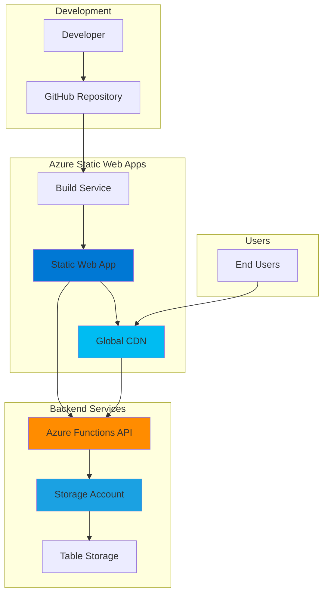

# Full-Stack Serverless Web Applications with Azure Static Web Apps and Azure Functions

## Problem

Modern web applications require scalable, cost-effective architecture that can handle variable traffic patterns without infrastructure management overhead. Development teams often struggle with deploying full-stack applications that require both frontend hosting and backend API services while maintaining continuous integration workflows. Traditional hosting solutions demand server provisioning, maintenance, and scaling management, increasing operational complexity and costs.

## Solution

Azure Static Web Apps provides a comprehensive serverless platform that automatically builds and deploys full-stack web applications directly from code repositories. By integrating Azure Functions for backend API services and Azure Storage Tables for data persistence, this architecture delivers a complete serverless solution that scales automatically, reduces operational overhead, and provides integrated CI/CD workflows with GitHub or Azure DevOps.

## Architecture Diagram



## Prerequisites

1. Azure account with active subscription and appropriate permissions for Static Web Apps, Functions, and Storage
2. Azure CLI v2.39.0 or later installed and configured (or Azure Cloud Shell)
3. Node.js 18.x or later and npm for local development
4. Git installed and configured with GitHub account
5. Basic knowledge of React, Node.js, and REST API development
6. Estimated cost: $0-20/month for development (Free tier available for Static Web Apps)

> **Note**: Azure Static Web Apps offers a generous free tier that includes 100GB bandwidth, custom domains, and integrated Azure Functions. Review the [pricing documentation](https://azure.microsoft.com/pricing/details/app-service/static/) for production usage estimates.

## Preparation

```bash
# Set environment variables for Azure resources
export RESOURCE_GROUP="rg-fullstack-serverless"
export LOCATION="eastus"
export STORAGE_ACCOUNT_NAME="stfullstack$(openssl rand -hex 6)"
export STATIC_WEB_APP_NAME="swa-fullstack-app"
export SUBSCRIPTION_ID=$(az account show --query id --output tsv)

# Generate unique suffix for resource names
RANDOM_SUFFIX=$(openssl rand -hex 3)

# Create resource group
az group create \
    --name ${RESOURCE_GROUP} \
    --location ${LOCATION} \
    --tags purpose=recipe environment=demo

echo "✅ Resource group created: ${RESOURCE_GROUP}"

# Create storage account for data persistence
az storage account create \
    --name ${STORAGE_ACCOUNT_NAME} \
    --resource-group ${RESOURCE_GROUP} \
    --location ${LOCATION} \
    --sku Standard_LRS \
    --kind StorageV2 \
    --tags purpose=recipe environment=demo

echo "✅ Storage account created: ${STORAGE_ACCOUNT_NAME}"

# Get storage account connection string
export STORAGE_CONNECTION_STRING=$(az storage account show-connection-string \
    --name ${STORAGE_ACCOUNT_NAME} \
    --resource-group ${RESOURCE_GROUP} \
    --query connectionString --output tsv)

echo "✅ Storage connection string retrieved"
```

## Steps

1. **Create React Frontend Application**:

   Modern serverless applications require a robust frontend framework that can efficiently consume backend APIs. React provides component-based architecture with excellent developer experience and build tooling. We'll create a task management application that demonstrates full CRUD operations against our serverless backend.

   ```bash
   # Create React application
   npx create-react-app fullstack-serverless-app
   cd fullstack-serverless-app
   
   # Install additional dependencies for API integration
   npm install axios @types/node
   
   echo "✅ React application created with necessary dependencies"
   ```

   The React application is now initialized with the necessary dependencies for API consumption. This foundation provides modern JavaScript tooling, hot reload capabilities, and optimized production builds that integrate seamlessly with Azure Static Web Apps' build pipeline.

2. **Develop Frontend Components and API Integration**:

   The frontend application needs to implement user interface components that interact with our Azure Functions backend through REST API calls. This step establishes the client-side application logic and data flow patterns.

   ```bash
   # Create components directory structure
   mkdir -p src/components src/services
   
   # Create API service for backend communication
   cat > src/services/api.js << 'EOF'
   import axios from 'axios';

   const API_BASE_URL = '/api';

   export const taskService = {
     async getTasks() {
       const response = await axios.get(`${API_BASE_URL}/tasks`);
       return response.data;
     },

     async createTask(task) {
       const response = await axios.post(`${API_BASE_URL}/tasks`, task);
       return response.data;
     },

     async updateTask(id, task) {
       const response = await axios.put(`${API_BASE_URL}/tasks/${id}`, task);
       return response.data;
     },

     async deleteTask(id) {
       await axios.delete(`${API_BASE_URL}/tasks/${id}`);
     }
   };
   EOF
   
   # Create main task component
   cat > src/components/TaskManager.js << 'EOF'
   import React, { useState, useEffect } from 'react';
   import { taskService } from '../services/api';
   
   const TaskManager = () => {
     const [tasks, setTasks] = useState([]);
     const [newTask, setNewTask] = useState({ title: '', description: '', completed: false });
     const [loading, setLoading] = useState(false);
   
     useEffect(() => {
       loadTasks();
     }, []);
   
     const loadTasks = async () => {
       try {
         setLoading(true);
         const data = await taskService.getTasks();
         setTasks(data);
       } catch (error) {
         console.error('Error loading tasks:', error);
       } finally {
         setLoading(false);
       }
     };
   
     const handleSubmit = async (e) => {
       e.preventDefault();
       try {
         await taskService.createTask(newTask);
         setNewTask({ title: '', description: '', completed: false });
         loadTasks();
       } catch (error) {
         console.error('Error creating task:', error);
       }
     };
   
     const handleToggle = async (id) => {
       try {
         const task = tasks.find(t => t.id === id);
         await taskService.updateTask(id, { ...task, completed: !task.completed });
         loadTasks();
       } catch (error) {
         console.error('Error updating task:', error);
       }
     };
   
     const handleDelete = async (id) => {
       try {
         await taskService.deleteTask(id);
         loadTasks();
       } catch (error) {
         console.error('Error deleting task:', error);
       }
     };
   
     return (
       <div className="task-manager">
         <h1>Serverless Task Manager</h1>
         
         <form onSubmit={handleSubmit} className="task-form">
           <input
             type="text"
             placeholder="Task title"
             value={newTask.title}
             onChange={(e) => setNewTask({ ...newTask, title: e.target.value })}
             required
           />
           <textarea
             placeholder="Task description"
             value={newTask.description}
             onChange={(e) => setNewTask({ ...newTask, description: e.target.value })}
           />
           <button type="submit">Add Task</button>
         </form>
   
         {loading ? (
           <p>Loading tasks...</p>
         ) : (
           <div className="task-list">
             {tasks.map(task => (
               <div key={task.id} className={`task-item ${task.completed ? 'completed' : ''}`}>
                 <h3>{task.title}</h3>
                 <p>{task.description}</p>
                 <button onClick={() => handleToggle(task.id)}>
                   {task.completed ? 'Mark Incomplete' : 'Mark Complete'}
                 </button>
                 <button onClick={() => handleDelete(task.id)}>Delete</button>
               </div>
             ))}
           </div>
         )}
       </div>
     );
   };
   
   export default TaskManager;
   EOF
   
   # Update App.js to use TaskManager
   cat > src/App.js << 'EOF'
   import React from 'react';
   import TaskManager from './components/TaskManager';
   import './App.css';
   
   function App() {
     return (
       <div className="App">
         <TaskManager />
       </div>
     );
   }
   
   export default App;
   EOF
   
   # Add basic styling
   cat > src/App.css << 'EOF'
   .App {
     text-align: center;
     padding: 20px;
   }
   
   .task-manager {
     max-width: 800px;
     margin: 0 auto;
   }
   
   .task-form {
     margin-bottom: 30px;
     padding: 20px;
     border: 1px solid #ddd;
     border-radius: 5px;
   }
   
   .task-form input,
   .task-form textarea,
   .task-form button {
     margin: 5px;
     padding: 10px;
     border: 1px solid #ddd;
     border-radius: 3px;
   }
   
   .task-form button {
     background-color: #0078d4;
     color: white;
     cursor: pointer;
   }
   
   .task-item {
     margin: 10px 0;
     padding: 15px;
     border: 1px solid #ddd;
     border-radius: 5px;
     text-align: left;
   }
   
   .task-item.completed {
     background-color: #f0f0f0;
     opacity: 0.7;
   }
   
   .task-item button {
     margin-right: 10px;
     padding: 5px 10px;
     border: none;
     border-radius: 3px;
     cursor: pointer;
   }
   EOF
   
   echo "✅ Frontend components and API integration implemented"
   ```

   The React application now includes complete CRUD functionality with proper state management and error handling. The API service abstraction enables clean separation of concerns and facilitates testing, while the component structure demonstrates modern React patterns suitable for serverless architectures.

3. **Initialize Azure Functions Backend API**:

   Azure Functions provides serverless compute capabilities that automatically scale based on demand. We'll create a Node.js-based API that handles HTTP requests and integrates with Azure Storage Tables for data persistence.

   ```bash
   # Create Azure Functions project
   mkdir -p api
   cd api
   
   # Initialize Functions project
   func init --worker-runtime node --language javascript
   
   # Create HTTP trigger function for tasks
   func new --name tasks --template "HTTP trigger" --authlevel anonymous
   
   echo "✅ Azure Functions project initialized"
   ```

   The Functions project structure is now established with the Azure Functions runtime configuration. This serverless backend will handle HTTP requests from our React frontend and provide the necessary API endpoints for task management operations.

4. **Implement Azure Functions API Endpoints**:

   The backend API must handle CRUD operations for tasks while integrating with Azure Storage Tables for persistence. Azure Functions' HTTP triggers enable REST API patterns with automatic scaling and pay-per-execution pricing models.

   ```bash
   # Create tasks API function
   cat > tasks/index.js << 'EOF'
   const { TableClient } = require('@azure/data-tables');
   
   // Initialize table client
   const tableClient = TableClient.fromConnectionString(
     process.env.STORAGE_CONNECTION_STRING,
     'tasks'
   );
   
   async function ensureTableExists() {
     try {
       await tableClient.createTable();
     } catch (error) {
       // Table might already exist
       if (error.statusCode !== 409) {
         throw error;
       }
     }
   }
   
   module.exports = async function (context, req) {
     context.log('Tasks API function processed a request.');
     
     // Ensure table exists
     await ensureTableExists();
     
     const method = req.method;
     const taskId = req.params.id;
     
     try {
       switch (method) {
         case 'GET':
           if (taskId) {
             // Get specific task
             const task = await tableClient.getEntity('tasks', taskId);
             context.res = {
               status: 200,
               body: {
                 id: task.rowKey,
                 title: task.title,
                 description: task.description,
                 completed: task.completed,
                 createdAt: task.createdAt
               }
             };
           } else {
             // Get all tasks
             const tasks = [];
             const entities = tableClient.listEntities();
             for await (const entity of entities) {
               tasks.push({
                 id: entity.rowKey,
                 title: entity.title,
                 description: entity.description,
                 completed: entity.completed,
                 createdAt: entity.createdAt
               });
             }
             context.res = {
               status: 200,
               body: tasks
             };
           }
           break;
   
         case 'POST':
           // Create new task
           const newTask = req.body;
           const taskEntity = {
             partitionKey: 'tasks',
             rowKey: Date.now().toString(),
             title: newTask.title,
             description: newTask.description || '',
             completed: newTask.completed || false,
             createdAt: new Date().toISOString()
           };
           
           await tableClient.createEntity(taskEntity);
           
           context.res = {
             status: 201,
             body: {
               id: taskEntity.rowKey,
               title: taskEntity.title,
               description: taskEntity.description,
               completed: taskEntity.completed,
               createdAt: taskEntity.createdAt
             }
           };
           break;
   
         case 'PUT':
           // Update existing task
           const updateTask = req.body;
           const existingTask = await tableClient.getEntity('tasks', taskId);
           
           const updatedEntity = {
             ...existingTask,
             title: updateTask.title || existingTask.title,
             description: updateTask.description || existingTask.description,
             completed: updateTask.completed !== undefined ? updateTask.completed : existingTask.completed,
             updatedAt: new Date().toISOString()
           };
           
           await tableClient.updateEntity(updatedEntity);
           
           context.res = {
             status: 200,
             body: {
               id: updatedEntity.rowKey,
               title: updatedEntity.title,
               description: updatedEntity.description,
               completed: updatedEntity.completed,
               createdAt: updatedEntity.createdAt
             }
           };
           break;
   
         case 'DELETE':
           // Delete task
           await tableClient.deleteEntity('tasks', taskId);
           
           context.res = {
             status: 204
           };
           break;
   
         default:
           context.res = {
             status: 405,
             body: { error: 'Method not allowed' }
           };
       }
     } catch (error) {
       context.log.error('Error in tasks API:', error);
       context.res = {
         status: 500,
         body: { error: 'Internal server error' }
       };
     }
   };
   EOF
   
   # Update function.json for proper routing
   cat > tasks/function.json << 'EOF'
   {
     "bindings": [
       {
         "authLevel": "anonymous",
         "type": "httpTrigger",
         "direction": "in",
         "name": "req",
         "methods": ["get", "post", "put", "delete"],
         "route": "tasks/{id?}"
       },
       {
         "type": "http",
         "direction": "out",
         "name": "res"
       }
     ]
   }
   EOF
   
   # Install Azure Tables SDK
   npm install @azure/data-tables
   
   echo "✅ Azure Functions API implementation completed"
   ```

   The Azure Functions API now provides complete CRUD operations with proper error handling and Azure Storage Tables integration. The serverless architecture automatically scales based on demand while maintaining stateless operation patterns essential for cloud-native applications.

5. **Configure Azure Static Web Apps Deployment**:

   Azure Static Web Apps requires specific configuration files to understand the application structure and deployment parameters. The staticwebapp.config.json file defines routing rules, API integration, and build settings.

   ```bash
   # Return to root directory
   cd ..
   
   # Create Static Web Apps configuration
   cat > staticwebapp.config.json << 'EOF'
   {
     "routes": [
       {
         "route": "/api/*",
         "allowedRoles": ["anonymous"]
       },
       {
         "route": "/*",
         "serve": "/index.html",
         "statusCode": 200
       }
     ],
     "navigationFallback": {
       "rewrite": "/index.html",
       "exclude": ["/api/*"]
     },
     "mimeTypes": {
       ".json": "application/json",
       ".js": "application/javascript",
       ".css": "text/css"
     },
     "globalHeaders": {
       "X-Content-Type-Options": "nosniff",
       "X-Frame-Options": "DENY",
       "X-XSS-Protection": "1; mode=block"
     }
   }
   EOF
   
   # Create GitHub Actions workflow (optional for manual deployment)
   mkdir -p .github/workflows
   cat > .github/workflows/azure-static-web-apps.yml << 'EOF'
   name: Azure Static Web Apps CI/CD
   
   on:
     push:
       branches:
         - main
     pull_request:
       types: [opened, synchronize, reopened, closed]
       branches:
         - main
   
   jobs:
     build_and_deploy_job:
       if: github.event_name == 'push' || (github.event_name == 'pull_request' && github.event.action != 'closed')
       runs-on: ubuntu-latest
       name: Build and Deploy Job
       steps:
         - uses: actions/checkout@v3
           with:
             submodules: true
         - name: Build And Deploy
           id: builddeploy
           uses: Azure/static-web-apps-deploy@v1
           with:
             azure_static_web_apps_api_token: ${{ secrets.AZURE_STATIC_WEB_APPS_API_TOKEN }}
             repo_token: ${{ secrets.GITHUB_TOKEN }}
             action: "upload"
             app_location: "/"
             api_location: "api"
             output_location: "build"
   
     close_pull_request_job:
       if: github.event_name == 'pull_request' && github.event.action == 'closed'
       runs-on: ubuntu-latest
       name: Close Pull Request Job
       steps:
         - name: Close Pull Request
           id: closepullrequest
           uses: Azure/static-web-apps-deploy@v1
           with:
             azure_static_web_apps_api_token: ${{ secrets.AZURE_STATIC_WEB_APPS_API_TOKEN }}
             action: "close"
   EOF
   
   echo "✅ Azure Static Web Apps configuration created"
   ```

   The configuration files establish the necessary routing rules, security headers, and deployment pipeline for Azure Static Web Apps. This configuration enables seamless integration between the React frontend and Azure Functions backend while maintaining security best practices.

6. **Create and Deploy Azure Static Web App**:

   Azure Static Web Apps provides integrated deployment capabilities that connect directly to code repositories. This service automatically builds, deploys, and serves both frontend and backend components while providing global CDN distribution.

   ```bash
   # Create Azure Static Web App
   az staticwebapp create \
       --name ${STATIC_WEB_APP_NAME} \
       --resource-group ${RESOURCE_GROUP} \
       --location ${LOCATION} \
       --source "https://github.com/YOUR_GITHUB_USERNAME/YOUR_REPO_NAME" \
       --branch "main" \
       --app-location "/" \
       --api-location "api" \
       --output-location "build" \
       --login-with-github
   
   # Get Static Web App details
   export STATIC_WEB_APP_URL=$(az staticwebapp show \
       --name ${STATIC_WEB_APP_NAME} \
       --resource-group ${RESOURCE_GROUP} \
       --query "defaultHostname" --output tsv)
   
   echo "✅ Azure Static Web App created: https://${STATIC_WEB_APP_URL}"
   ```

   The Static Web App is now provisioned with integrated GitHub Actions for continuous deployment. This configuration automatically builds and deploys both frontend and backend components whenever changes are pushed to the main branch.

7. **Configure Application Settings and Environment Variables**:

   Azure Static Web Apps requires configuration of application settings to enable proper integration with backend services. Environment variables must be configured to provide the Azure Functions access to storage and other Azure services.

   ```bash
   # Configure application settings for Azure Functions
   az staticwebapp appsettings set \
       --name ${STATIC_WEB_APP_NAME} \
       --resource-group ${RESOURCE_GROUP} \
       --setting-names STORAGE_CONNECTION_STRING="${STORAGE_CONNECTION_STRING}"
   
   # Set additional configuration
   az staticwebapp appsettings set \
       --name ${STATIC_WEB_APP_NAME} \
       --resource-group ${RESOURCE_GROUP} \
       --setting-names NODE_VERSION="18" \
       --setting-names FUNCTIONS_WORKER_RUNTIME="node"
   
   # Verify application settings
   az staticwebapp appsettings list \
       --name ${STATIC_WEB_APP_NAME} \
       --resource-group ${RESOURCE_GROUP} \
       --output table
   
   echo "✅ Application settings configured for Azure Functions integration"
   ```

   The application settings now provide the necessary configuration for Azure Functions to connect to Azure Storage Tables and operate with the correct runtime environment. This configuration ensures proper backend functionality and data persistence.

8. **Deploy Application Using Azure CLI**:

   While GitHub Actions provide automated deployment, Azure CLI offers direct deployment capabilities for immediate testing and validation. This approach enables rapid iteration during development phases.

   ```bash
   # Build React application for production
   npm run build
   
   # Deploy to Azure Static Web Apps using CLI
   az staticwebapp deploy \
       --name ${STATIC_WEB_APP_NAME} \
       --resource-group ${RESOURCE_GROUP} \
       --source . \
       --app-location "/" \
       --api-location "api" \
       --output-location "build"
   
   # Get deployment status
   az staticwebapp show \
       --name ${STATIC_WEB_APP_NAME} \
       --resource-group ${RESOURCE_GROUP} \
       --query "repositoryUrl" --output tsv
   
   echo "✅ Application deployed successfully"
   echo "🌐 Application URL: https://${STATIC_WEB_APP_URL}"
   ```

   The full-stack serverless application is now deployed and accessible through the Azure Static Web Apps URL. Both frontend and backend components are operational with integrated CI/CD capabilities and automatic scaling.

## Validation & Testing

1. **Verify Static Web App deployment and accessibility**:

   ```bash
   # Check Static Web App status
   az staticwebapp show \
       --name ${STATIC_WEB_APP_NAME} \
       --resource-group ${RESOURCE_GROUP} \
       --query "{name:name,status:repositoryUrl,defaultHostname:defaultHostname}" \
       --output table
   
   # Test web app accessibility
   curl -I https://${STATIC_WEB_APP_URL}
   ```

   Expected output: HTTP 200 status indicating successful deployment and accessibility.

2. **Test API endpoints functionality**:

   ```bash
   # Test GET tasks endpoint
   curl -X GET https://${STATIC_WEB_APP_URL}/api/tasks
   
   # Test POST task creation
   curl -X POST https://${STATIC_WEB_APP_URL}/api/tasks \
       -H "Content-Type: application/json" \
       -d '{"title":"Test Task","description":"Testing API functionality","completed":false}'
   
   # Test task retrieval after creation
   curl -X GET https://${STATIC_WEB_APP_URL}/api/tasks
   ```

   Expected output: JSON responses showing successful task creation and retrieval.

3. **Verify Storage Table integration**:

   ```bash
   # Check if tasks table was created
   az storage table exists \
       --name tasks \
       --connection-string "${STORAGE_CONNECTION_STRING}"
   
   # List table entities
   az storage entity query \
       --table-name tasks \
       --connection-string "${STORAGE_CONNECTION_STRING}"
   ```

   Expected output: Confirmation of table existence and task entities in storage.

4. **Test frontend-backend integration**:

   ```bash
   # Open application in browser for manual testing
   echo "🌐 Test the full application at: https://${STATIC_WEB_APP_URL}"
   echo "📋 Test creating, updating, and deleting tasks through the UI"
   ```

   Manual verification: Ensure all CRUD operations work correctly through the web interface.

## Cleanup

1. **Remove Azure Static Web App and associated resources**:

   ```bash
   # Delete Static Web App
   az staticwebapp delete \
       --name ${STATIC_WEB_APP_NAME} \
       --resource-group ${RESOURCE_GROUP} \
       --yes
   
   echo "✅ Azure Static Web App deleted"
   ```

2. **Remove storage account and data**:

   ```bash
   # Delete storage account
   az storage account delete \
       --name ${STORAGE_ACCOUNT_NAME} \
       --resource-group ${RESOURCE_GROUP} \
       --yes
   
   echo "✅ Storage account deleted"
   ```

3. **Remove resource group and all contained resources**:

   ```bash
   # Delete resource group
   az group delete \
       --name ${RESOURCE_GROUP} \
       --yes \
       --no-wait
   
   echo "✅ Resource group deletion initiated: ${RESOURCE_GROUP}"
   echo "Note: Deletion may take several minutes to complete"
   ```

4. **Clean up local development environment**:

   ```bash
   # Remove local application files
   cd ..
   rm -rf fullstack-serverless-app
   
   # Clear environment variables
   unset RESOURCE_GROUP LOCATION STORAGE_ACCOUNT_NAME STATIC_WEB_APP_NAME
   unset STORAGE_CONNECTION_STRING STATIC_WEB_APP_URL SUBSCRIPTION_ID
   
   echo "✅ Local environment cleaned up"
   ```

## Discussion

Azure Static Web Apps revolutionizes full-stack web application deployment by providing a unified platform that automatically handles both frontend hosting and backend API services. This serverless architecture eliminates traditional infrastructure concerns while maintaining enterprise-grade security, scalability, and performance characteristics. The integration with Azure Functions enables powerful backend capabilities without server management, while Azure Storage Tables provides NoSQL data persistence with automatic scaling and high availability. For comprehensive guidance on Static Web Apps features, see the [official documentation](https://docs.microsoft.com/en-us/azure/static-web-apps/overview).

The continuous integration and deployment capabilities built into Azure Static Web Apps streamline development workflows by automatically building and deploying applications whenever code changes are pushed to the configured repository branch. This approach follows DevOps best practices while reducing deployment complexity and enabling rapid iteration cycles. The global CDN distribution ensures optimal performance for users worldwide, while the integrated security features provide authentication, authorization, and custom domain support. For detailed CI/CD configuration options, review the [Azure Static Web Apps deployment documentation](https://docs.microsoft.com/en-us/azure/static-web-apps/deploy-nextjs).

From a cost perspective, Azure Static Web Apps offers exceptional value through its consumption-based pricing model and generous free tier allowances. The serverless architecture ensures you only pay for actual usage, making it ideal for applications with variable traffic patterns. Azure Functions' consumption plan provides automatic scaling from zero to thousands of concurrent executions, while Storage Tables offer cost-effective NoSQL storage with pay-per-transaction pricing. For cost optimization strategies, consult the [Azure Static Web Apps pricing guide](https://azure.microsoft.com/pricing/details/app-service/static/) and [Azure Functions cost optimization documentation](https://docs.microsoft.com/en-us/azure/azure-functions/functions-consumption-costs).

The architecture demonstrates modern cloud-native development patterns including microservices decomposition, API-first design, and infrastructure-as-code principles. Azure Static Web Apps' integration with GitHub Actions enables GitOps workflows that maintain version control over both application code and infrastructure configuration. This approach aligns with [Azure Well-Architected Framework](https://docs.microsoft.com/en-us/azure/architecture/framework/) principles of reliability, security, cost optimization, operational excellence, and performance efficiency.

> **Tip**: Use Azure Application Insights to monitor application performance and user behavior. The [monitoring documentation](https://docs.microsoft.com/en-us/azure/static-web-apps/monitor) provides comprehensive guidance on implementing observability for production workloads.

## Challenge

Extend this serverless application by implementing these enhancements:

1. **Add Authentication and Authorization**: Implement Azure Active Directory integration for user authentication and role-based access control, enabling multi-user task management with proper data isolation.

2. **Implement Real-time Updates**: Integrate Azure SignalR Service to provide real-time task updates across multiple users and devices, demonstrating modern collaborative application patterns.

3. **Add Advanced Data Operations**: Expand the data model to include task categories, due dates, and priority levels, implementing advanced querying and filtering capabilities using Azure Cosmos DB.

4. **Create Mobile Application**: Develop a React Native mobile application that consumes the same Azure Functions API, demonstrating cross-platform development with shared backend services.

5. **Implement Monitoring and Analytics**: Add comprehensive monitoring using Azure Application Insights, Azure Monitor, and custom telemetry to track application performance, user behavior, and business metrics.

## Infrastructure Code

*Infrastructure code will be generated after recipe approval.*