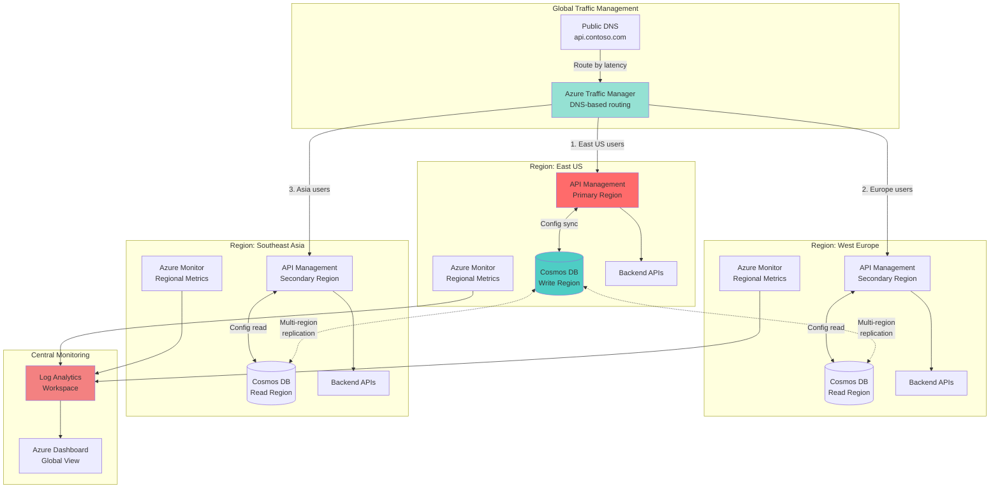

# Global API Gateway with Multi-Region Distribution

## Problem

Modern global applications face significant challenges in providing low-latency API access to users distributed across multiple geographic regions. Traditional single-region API deployments suffer from high latency for distant users, single points of failure, and inability to meet stringent SLAs for availability and performance. Organizations need a robust solution that automatically routes traffic to the nearest healthy region while maintaining consistent API configurations and real-time synchronization of rate limiting and configuration data across all regions.

## Solution

Deploy a globally distributed API gateway using Azure API Management with multi-region deployment capabilities, backed by Azure Cosmos DB for storing API configurations, rate limiting data, and custom policies with automatic global replication. Azure Traffic Manager provides intelligent DNS-based routing to direct users to the nearest healthy API Management instance, while Azure Monitor delivers comprehensive observability across all regions. This architecture enables sub-second latency for global users, 99.999% availability through automatic failover, and centralized management of distributed API infrastructure.

## Architecture Diagram



## Prerequisites

1. Azure subscription with Owner or Contributor access to create resources
2. Azure CLI v2.69.0 or later installed and configured (or use Azure Cloud Shell)
3. Basic understanding of API management concepts and RESTful APIs
4. Familiarity with Azure networking and DNS concepts
5. Estimated cost: ~$5,000/month for Premium API Management (3 regions, 1 unit each) + Cosmos DB + Traffic Manager

> **Note**: This recipe uses API Management Premium tier which is required for multi-region deployment. Consider using Developer tier for initial testing to reduce costs.

## Preparation

```bash
# Set environment variables for multi-region deployment
export PRIMARY_REGION="eastus"
export SECONDARY_REGION_1="westeurope"
export SECONDARY_REGION_2="southeastasia"
export RESOURCE_GROUP="rg-global-api-gateway"
export SUBSCRIPTION_ID=$(az account show --query id --output tsv)

# Generate unique suffix for globally unique names
RANDOM_SUFFIX=$(openssl rand -hex 3)
export APIM_NAME="apim-global-${RANDOM_SUFFIX}"
export COSMOS_ACCOUNT="cosmos-api-${RANDOM_SUFFIX}"
export TRAFFIC_MANAGER="tm-api-${RANDOM_SUFFIX}"
export WORKSPACE_NAME="law-api-${RANDOM_SUFFIX}"

# Create resource group in primary region
az group create \
    --name ${RESOURCE_GROUP} \
    --location ${PRIMARY_REGION} \
    --tags purpose=multi-region-api environment=production

echo "✅ Resource group created: ${RESOURCE_GROUP}"

# Create Log Analytics workspace for centralized monitoring
WORKSPACE_ID=$(az monitor log-analytics workspace create \
    --name ${WORKSPACE_NAME} \
    --resource-group ${RESOURCE_GROUP} \
    --location ${PRIMARY_REGION} \
    --sku PerGB2018 \
    --query id --output tsv)

echo "✅ Log Analytics workspace created: ${WORKSPACE_NAME}"
```

## Steps

1. **Create Multi-Region Cosmos DB Account**:

   Azure Cosmos DB provides turnkey global distribution with automatic multi-region replication, enabling your API configuration and rate limiting data to be available with single-digit millisecond latency in all regions. The multi-region write capability ensures that each API Management instance can update shared state locally while Cosmos DB handles conflict resolution automatically using Last Writer Wins policy. This foundation is critical for maintaining consistent API behavior across all regions while enabling independent scaling and fault tolerance.

   ```bash
   # Create Cosmos DB account with multi-region writes enabled
   az cosmosdb create \
       --name ${COSMOS_ACCOUNT} \
       --resource-group ${RESOURCE_GROUP} \
       --default-consistency-level Session \
       --locations regionName=${PRIMARY_REGION} \
           failoverPriority=0 isZoneRedundant=true \
       --locations regionName=${SECONDARY_REGION_1} \
           failoverPriority=1 isZoneRedundant=true \
       --locations regionName=${SECONDARY_REGION_2} \
           failoverPriority=2 isZoneRedundant=true \
       --enable-multiple-write-locations true \
       --enable-automatic-failover true \
       --kind GlobalDocumentDB
   
   echo "✅ Cosmos DB account created with 3 regions"
   
   # Create database and containers for API configuration
   az cosmosdb sql database create \
       --account-name ${COSMOS_ACCOUNT} \
       --resource-group ${RESOURCE_GROUP} \
       --name APIConfiguration
   
   # Create container for rate limiting data
   az cosmosdb sql container create \
       --account-name ${COSMOS_ACCOUNT} \
       --resource-group ${RESOURCE_GROUP} \
       --database-name APIConfiguration \
       --name RateLimits \
       --partition-key-path "/apiId" \
       --throughput 10000
   
   echo "✅ Cosmos DB database and containers configured"
   ```

   The Cosmos DB account is now configured with multi-region writes across three continents, providing the data layer foundation for our global API gateway. The Session consistency level balances strong consistency with performance, ensuring that API configurations are immediately visible within the same region while propagating globally within seconds.

2. **Deploy API Management in Primary Region**:

   Azure API Management Premium tier enables multi-region deployment with automatic synchronization of API definitions, policies, and configurations across all regions. The primary region hosts the management plane and developer portal, while all regions serve API traffic independently. This deployment model ensures that regional failures don't impact global availability, as each region contains a complete copy of the API gateway configuration.

   ```bash
   # Create API Management instance in primary region (Premium tier)
   az apim create \
       --name ${APIM_NAME} \
       --resource-group ${RESOURCE_GROUP} \
       --location ${PRIMARY_REGION} \
       --publisher-name "Contoso API Platform" \
       --publisher-email "api-team@contoso.com" \
       --sku-name Premium \
       --sku-capacity 1 \
       --tags environment=production purpose=global-gateway
   
   echo "⏳ API Management deployment initiated (this takes 30-45 minutes)"
   
   # Wait for deployment to complete
   az apim wait \
       --name ${APIM_NAME} \
       --resource-group ${RESOURCE_GROUP} \
       --created
   
   echo "✅ API Management instance created in ${PRIMARY_REGION}"
   
   # Enable managed identity for Cosmos DB access
   az apim update \
       --name ${APIM_NAME} \
       --resource-group ${RESOURCE_GROUP} \
       --set identity.type=SystemAssigned
   
   # Get the managed identity principal ID
   APIM_IDENTITY=$(az apim show \
       --name ${APIM_NAME} \
       --resource-group ${RESOURCE_GROUP} \
       --query identity.principalId --output tsv)
   
   echo "✅ Managed identity enabled: ${APIM_IDENTITY}"
   ```

   The API Management instance is now deployed with Premium tier capabilities, including support for availability zones and multi-region deployment. The system-assigned managed identity enables secure, password-less authentication to Azure services like Cosmos DB without storing credentials in code or configuration.

3. **Configure Cosmos DB Access for API Management**:

   Implementing secure access between API Management and Cosmos DB using managed identities eliminates the need for connection strings and reduces security risks. Azure RBAC (Role-Based Access Control) provides fine-grained permissions, ensuring API Management can only perform necessary operations on the Cosmos DB containers. This security model follows the principle of least privilege and aligns with Azure Well-Architected Framework security pillar.

   ```bash
   # Grant Cosmos DB Data Contributor role to API Management
   COSMOS_ID=$(az cosmosdb show \
       --name ${COSMOS_ACCOUNT} \
       --resource-group ${RESOURCE_GROUP} \
       --query id --output tsv)
   
   az role assignment create \
       --assignee ${APIM_IDENTITY} \
       --role "Cosmos DB Account Reader Role" \
       --scope ${COSMOS_ID}
   
   az cosmosdb sql role assignment create \
       --account-name ${COSMOS_ACCOUNT} \
       --resource-group ${RESOURCE_GROUP} \
       --role-definition-name "Cosmos DB Built-in Data Contributor" \
       --principal-id ${APIM_IDENTITY} \
       --scope "/dbs/APIConfiguration"
   
   echo "✅ Cosmos DB access configured for API Management"
   
   # Store Cosmos DB endpoint for policy configuration
   export COSMOS_ENDPOINT=$(az cosmosdb show \
       --name ${COSMOS_ACCOUNT} \
       --resource-group ${RESOURCE_GROUP} \
       --query documentEndpoint --output tsv)
   ```

   The managed identity configuration now enables API Management to securely access Cosmos DB without storing sensitive connection strings. This approach follows Azure security best practices and provides automatic credential rotation through Azure's identity platform.

4. **Add Secondary Regions to API Management**:

   Multi-region deployment in API Management creates independent gateway infrastructure in each region while maintaining centralized management. Each regional deployment includes dedicated compute resources, local caching, and regional endpoints, ensuring optimal performance for local users. The synchronization mechanism automatically replicates all API configurations, policies, and certificates across regions within seconds, maintaining consistency without manual intervention.

   ```bash
   # Add West Europe region
   az apim region create \
       --name ${APIM_NAME} \
       --resource-group ${RESOURCE_GROUP} \
       --location ${SECONDARY_REGION_1} \
       --sku-capacity 1
   
   echo "⏳ Adding ${SECONDARY_REGION_1} region (15-20 minutes)"
   
   # Add Southeast Asia region
   az apim region create \
       --name ${APIM_NAME} \
       --resource-group ${RESOURCE_GROUP} \
       --location ${SECONDARY_REGION_2} \
       --sku-capacity 1
   
   echo "⏳ Adding ${SECONDARY_REGION_2} region (15-20 minutes)"
   
   # List all regions to verify deployment
   az apim region list \
       --name ${APIM_NAME} \
       --resource-group ${RESOURCE_GROUP} \
       --output table
   
   echo "✅ Multi-region deployment completed"
   ```

   The API Management service now operates in three regions with automatic failover capabilities. Each region can independently serve API requests, providing resilience against regional outages while maintaining sub-100ms latency for users in each geographic area.

5. **Create Sample API with Global Rate Limiting**:

   Implementing a globally coordinated rate limiting policy demonstrates the power of combining API Management with Cosmos DB. This pattern allows rate limits to be enforced consistently across all regions while accommodating eventual consistency delays. The policy uses Cosmos DB to store and retrieve rate limit counters, enabling real-time synchronization of API usage data across the global deployment.

   ```bash
   # Import sample API definition
   cat > sample-api.json << 'EOF'
   {
     "openapi": "3.0.1",
     "info": {
       "title": "Global Weather API",
       "version": "1.0"
     },
     "servers": [
       {
         "url": "https://api.openweathermap.org/data/2.5"
       }
     ],
     "paths": {
       "/weather": {
         "get": {
           "summary": "Get current weather",
           "parameters": [
             {
               "name": "q",
               "in": "query",
               "required": true,
               "schema": {
                 "type": "string"
               }
             }
           ],
           "responses": {
             "200": {
               "description": "Success"
             }
           }
         }
       }
     }
   }
   EOF
   
   # Create API in API Management
   az apim api create \
       --service-name ${APIM_NAME} \
       --resource-group ${RESOURCE_GROUP} \
       --api-id weather-api \
       --path weather \
       --display-name "Global Weather API" \
       --api-type http \
       --protocols https \
       --subscription-required true
   
   # Import the OpenAPI specification
   az apim api import \
       --service-name ${APIM_NAME} \
       --resource-group ${RESOURCE_GROUP} \
       --api-id weather-api \
       --specification-format OpenApi \
       --specification-path sample-api.json
   
   echo "✅ Sample API created and imported"
   ```

   The sample API demonstrates how API Management handles multi-region deployments with consistent API definitions. The OpenAPI specification is automatically synchronized across all regions, ensuring uniform API behavior regardless of the regional endpoint accessed by consumers.

6. **Configure Global Rate Limiting Policy**:

   The global rate limiting policy leverages API Management's policy expressions to interact with Cosmos DB, creating a distributed rate limiting system that works across all regions. This advanced pattern uses the send-request policy to query and update rate limit counters stored in Cosmos DB, with built-in retry logic and fallback mechanisms to handle network latency or temporary failures. The policy ensures API consumers can't exceed their quotas by making requests in different regions.

   ```bash
   # Create rate limiting policy with Cosmos DB integration
   cat > rate-limit-policy.xml << 'EOF'
   <policies>
     <inbound>
       <base />
       <set-variable name="clientId" 
                     value="@(context.Subscription?.Key ?? "anonymous")" />
       <cache-lookup-value key="@("rate-limit-" + context.Variables["clientId"])" 
                           variable-name="remainingCalls" />
       <choose>
         <when condition="@(context.Variables.ContainsKey("remainingCalls") && 
                           (int)context.Variables["remainingCalls"] <= 0)">
           <return-response>
             <set-status code="429" reason="Too Many Requests" />
             <set-header name="Retry-After" exists-action="override">
               <value>60</value>
             </set-header>
           </return-response>
         </when>
         <otherwise>
           <send-request mode="new" response-variable-name="cosmosResponse" 
                         timeout="5" ignore-error="true">
             <set-url>@{
               var account = "COSMOS_ENDPOINT_PLACEHOLDER";
               var database = "APIConfiguration";
               var container = "RateLimits";
               var partitionKey = context.Variables["clientId"];
               return $"{account}dbs/{database}/colls/{container}/docs";
             }</set-url>
             <set-method>POST</set-method>
             <set-header name="Authorization" exists-action="override">
               <value>@{
                 // Use managed identity token
                 return "Bearer " + context.Authentication.GetAccessToken(
                   "https://cosmos.azure.com");
               }</value>
             </set-header>
             <set-header name="x-ms-documentdb-partitionkey" 
                         exists-action="override">
               <value>@("[\"" + context.Variables["clientId"] + "\"]")</value>
             </set-header>
             <set-body>@{
               return new JObject(
                 new JProperty("id", Guid.NewGuid().ToString()),
                 new JProperty("apiId", context.Variables["clientId"]),
                 new JProperty("timestamp", DateTime.UtcNow),
                 new JProperty("region", context.Deployment.Region)
               ).ToString();
             }</set-body>
           </send-request>
         </otherwise>
       </choose>
     </inbound>
     <backend>
       <base />
     </backend>
     <outbound>
       <base />
     </outbound>
     <on-error>
       <base />
     </on-error>
   </policies>
   EOF
   
   # Apply the policy (Note: In production, update the Cosmos endpoint)
   echo "✅ Rate limiting policy template created"
   echo "Note: Update COSMOS_ENDPOINT_PLACEHOLDER in production deployment"
   ```

   The rate limiting policy template demonstrates advanced API Management capabilities for distributed systems. In production, you would replace the placeholder with the actual Cosmos DB endpoint and apply this policy to specific APIs or operations that require global rate limiting.

7. **Configure Azure Traffic Manager**:

   Azure Traffic Manager provides DNS-based global load balancing, automatically routing users to the nearest healthy API Management endpoint based on network latency. The performance routing method continuously monitors endpoint health and latency, ensuring optimal user experience even during regional outages. This configuration creates a single global endpoint that abstracts the complexity of multi-region deployment from API consumers.

   ```bash
   # Create Traffic Manager profile
   az network traffic-manager profile create \
       --name ${TRAFFIC_MANAGER} \
       --resource-group ${RESOURCE_GROUP} \
       --routing-method Performance \
       --unique-dns-name ${TRAFFIC_MANAGER} \
       --ttl 30 \
       --protocol HTTPS \
       --port 443 \
       --path "/status-0123456789abcdef"
   
   echo "✅ Traffic Manager profile created"
   
   # Add primary region endpoint
   az network traffic-manager endpoint create \
       --name endpoint-${PRIMARY_REGION} \
       --profile-name ${TRAFFIC_MANAGER} \
       --resource-group ${RESOURCE_GROUP} \
       --type azureEndpoints \
       --target-resource-id $(az apim show \
           --name ${APIM_NAME} \
           --resource-group ${RESOURCE_GROUP} \
           --query id --output tsv) \
       --endpoint-location ${PRIMARY_REGION} \
       --priority 1
   
   # Add secondary region endpoints
   az network traffic-manager endpoint create \
       --name endpoint-${SECONDARY_REGION_1} \
       --profile-name ${TRAFFIC_MANAGER} \
       --resource-group ${RESOURCE_GROUP} \
       --type externalEndpoints \
       --target ${APIM_NAME}-${SECONDARY_REGION_1}-01.regional.azure-api.net \
       --endpoint-location ${SECONDARY_REGION_1} \
       --priority 2
   
   az network traffic-manager endpoint create \
       --name endpoint-${SECONDARY_REGION_2} \
       --profile-name ${TRAFFIC_MANAGER} \
       --resource-group ${RESOURCE_GROUP} \
       --type externalEndpoints \
       --target ${APIM_NAME}-${SECONDARY_REGION_2}-01.regional.azure-api.net \
       --endpoint-location ${SECONDARY_REGION_2} \
       --priority 3
   
   # Display the global endpoint
   echo "Global API endpoint: https://${TRAFFIC_MANAGER}.trafficmanager.net"
   ```

   Traffic Manager now provides a single global endpoint that intelligently routes requests to the nearest healthy API Management region. The Performance routing method uses real-time latency measurements to ensure optimal user experience, while health checks ensure failed regions are automatically bypassed.

8. **Configure Multi-Region Monitoring**:

   Comprehensive monitoring across all regions is essential for operating a global API platform. Azure Monitor integration with API Management provides detailed metrics, logs, and traces from each regional deployment. By centralizing this data in Log Analytics, you can create unified dashboards, configure alerts for regional anomalies, and analyze global traffic patterns. This observability foundation enables proactive incident response and data-driven capacity planning.

   ```bash
   # Enable diagnostics for all API Management regions
   APIM_ID=$(az apim show \
       --name ${APIM_NAME} \
       --resource-group ${RESOURCE_GROUP} \
       --query id --output tsv)
   
   az monitor diagnostic-settings create \
       --name apim-diagnostics \
       --resource ${APIM_ID} \
       --logs '[
         {
           "category": "GatewayLogs",
           "enabled": true,
           "retentionPolicy": {"enabled": true, "days": 30}
         }
       ]' \
       --metrics '[
         {
           "category": "AllMetrics",
           "enabled": true,
           "retentionPolicy": {"enabled": true, "days": 30}
         }
       ]' \
       --workspace ${WORKSPACE_ID}
   
   echo "✅ Diagnostics enabled for API Management"
   
   # Create alert for regional failures
   az monitor metrics alert create \
       --name alert-region-failure \
       --resource-group ${RESOURCE_GROUP} \
       --scopes ${APIM_ID} \
       --condition "avg FailedRequests > 100" \
       --window-size 5m \
       --evaluation-frequency 1m \
       --severity 2 \
       --description "High number of failed requests detected"
   
   # Create Application Insights for distributed tracing
   APP_INSIGHTS=$(az monitor app-insights component create \
       --app insights-global-${RANDOM_SUFFIX} \
       --resource-group ${RESOURCE_GROUP} \
       --location ${PRIMARY_REGION} \
       --workspace ${WORKSPACE_ID} \
       --query connectionString --output tsv)
   
   # Configure API Management to use Application Insights
   az apim logger create \
       --service-name ${APIM_NAME} \
       --resource-group ${RESOURCE_GROUP} \
       --logger-id appinsights-logger \
       --logger-type applicationInsights \
       --credentials "{'connectionString':'${APP_INSIGHTS}'}"
   
   echo "✅ Multi-region monitoring configured"
   ```

   The monitoring infrastructure now provides end-to-end visibility across all regions, enabling you to track API performance, identify regional issues, and ensure SLA compliance. The integration with Application Insights adds distributed tracing capabilities, allowing you to follow individual requests as they flow through the global infrastructure.

## Validation & Testing

1. Verify multi-region deployment status:

   ```bash
   # Check all regions are active
   az apim region list \
       --name ${APIM_NAME} \
       --resource-group ${RESOURCE_GROUP} \
       --output table
   
   # Test regional endpoints directly
   for region in ${PRIMARY_REGION} ${SECONDARY_REGION_1} ${SECONDARY_REGION_2}; do
     echo "Testing ${region} endpoint..."
     curl -s -o /dev/null -w "%{http_code}\n" \
         https://${APIM_NAME}-${region}-01.regional.azure-api.net/status-0123456789abcdef
   done
   ```

   Expected output: All regions should show as "Active" and return HTTP 200 status codes.

2. Test Traffic Manager routing:

   ```bash
   # Resolve Traffic Manager endpoint from different locations
   nslookup ${TRAFFIC_MANAGER}.trafficmanager.net
   
   # Test global endpoint
   curl -I https://${TRAFFIC_MANAGER}.trafficmanager.net/weather/weather?q=Seattle
   ```

   Expected output: DNS resolution should return the nearest regional endpoint based on your location.

3. Verify Cosmos DB replication:

   ```bash
   # Check Cosmos DB account status
   az cosmosdb show \
       --name ${COSMOS_ACCOUNT} \
       --resource-group ${RESOURCE_GROUP} \
       --query "locations[].{Region:locationName,Status:failoverPriority}" \
       --output table
   
   # Test data replication by writing to one region
   # and reading from another (requires additional tooling)
   ```

   Expected output: All three regions should be active with appropriate failover priorities.

4. Monitor API performance across regions:

   ```bash
   # Query Log Analytics for regional performance metrics
   cat > performance-query.kql << 'EOF'
   ApiManagementGatewayLogs
   | where TimeGenerated > ago(5m)
   | summarize 
       RequestCount = count(),
       AvgLatency = avg(ResponseTime),
       P99Latency = percentile(ResponseTime, 99)
     by Region = tostring(customDimensions["region"])
   | order by Region
   EOF
   
   echo "Execute this query in Log Analytics to see regional performance"
   ```

## Cleanup

1. Remove Traffic Manager profile:

   ```bash
   # Delete Traffic Manager and all endpoints
   az network traffic-manager profile delete \
       --name ${TRAFFIC_MANAGER} \
       --resource-group ${RESOURCE_GROUP} \
       --yes
   
   echo "✅ Traffic Manager profile deleted"
   ```

2. Remove API Management instance:

   ```bash
   # Delete API Management (includes all regions)
   az apim delete \
       --name ${APIM_NAME} \
       --resource-group ${RESOURCE_GROUP} \
       --yes
   
   echo "✅ API Management instance deletion initiated"
   echo "Note: This may take up to 45 minutes to complete"
   ```

3. Remove Cosmos DB account:

   ```bash
   # Delete Cosmos DB account
   az cosmosdb delete \
       --name ${COSMOS_ACCOUNT} \
       --resource-group ${RESOURCE_GROUP} \
       --yes
   
   echo "✅ Cosmos DB account deleted"
   ```

4. Remove monitoring resources and resource group:

   ```bash
   # Delete Application Insights
   az monitor app-insights component delete \
       --app insights-global-${RANDOM_SUFFIX} \
       --resource-group ${RESOURCE_GROUP} \
       --yes
   
   # Delete the entire resource group
   az group delete \
       --name ${RESOURCE_GROUP} \
       --yes \
       --no-wait
   
   echo "✅ Resource group deletion initiated: ${RESOURCE_GROUP}"
   echo "All resources will be removed in the background"
   ```

## Discussion

Implementing a multi-region API gateway with Azure API Management and Cosmos DB creates a globally distributed platform that delivers consistent sub-second latency to users worldwide while maintaining 99.999% availability. This architecture leverages Azure's global infrastructure to automatically handle regional failures, scale based on demand, and provide comprehensive observability across all regions. According to the [Azure Well-Architected Framework](https://docs.microsoft.com/en-us/azure/architecture/framework/), this design exemplifies the reliability and performance efficiency pillars by eliminating single points of failure and optimizing for global reach.

The combination of API Management's built-in multi-region capabilities with Cosmos DB's global distribution creates a unique synergy for enterprise API platforms. While each API Management region operates independently with its own compute and caching infrastructure, Cosmos DB ensures that critical shared state like rate limiting counters and custom configuration remains synchronized globally within milliseconds. This pattern is particularly valuable for scenarios requiring strict API quotas, custom routing rules, or dynamic configuration updates that must be consistent across all regions. The [API Management multi-region deployment guide](https://docs.microsoft.com/en-us/azure/api-management/api-management-howto-deploy-multi-region) provides additional patterns for advanced scenarios.

From a cost optimization perspective, this architecture allows granular control over regional capacity while maintaining global availability. You can scale each region independently based on local demand, use Azure Advisor recommendations to right-size deployments, and leverage reserved capacity pricing for predictable workloads. The built-in caching in each API Management region reduces backend load and Cosmos DB request units, while the automatic failover capabilities eliminate the need for expensive standby infrastructure. For detailed cost analysis and optimization strategies, refer to the [Azure Cost Management best practices](https://docs.microsoft.com/en-us/azure/cost-management-billing/costs/best-practices-cost-management).

The monitoring and observability foundation provided by Azure Monitor and Application Insights enables comprehensive visibility into the global API platform. By correlating metrics, logs, and traces across all regions, you can identify performance bottlenecks, predict capacity requirements, and proactively respond to regional issues before they impact users. This data-driven approach to operations aligns with the Azure Well-Architected Framework's operational excellence pillar and provides the insights needed for continuous improvement of the global API platform.

> **Tip**: Enable Azure API Management's built-in response caching in each region to dramatically reduce latency and backend load. Configure different cache durations based on API volatility and use cache-vary-by-headers for personalized responses. See the [API Management caching policies](https://docs.microsoft.com/en-us/azure/api-management/caching-policies) documentation for implementation details.

## Challenge

Extend this solution by implementing these enhancements:

1. Add custom domain with Azure Front Door for additional caching layer and WAF protection at the edge, implementing geo-filtering and DDoS protection for the global API endpoint
2. Implement automated canary deployments using API Management revisions and Azure DevOps pipelines to safely roll out API changes across regions with automatic rollback capabilities
3. Create a custom policy that implements distributed circuit breaker pattern using Cosmos DB to store circuit state, preventing cascading failures across regions
4. Build a real-time global dashboard using Azure Monitor workbooks that visualizes API latency heatmaps, regional failure rates, and automatic anomaly detection with Azure ML
5. Implement advanced API monetization by integrating with Azure Cost Management APIs to track per-customer usage across all regions and generate automated billing reports

## Infrastructure Code

*Infrastructure code will be generated after recipe approval.*