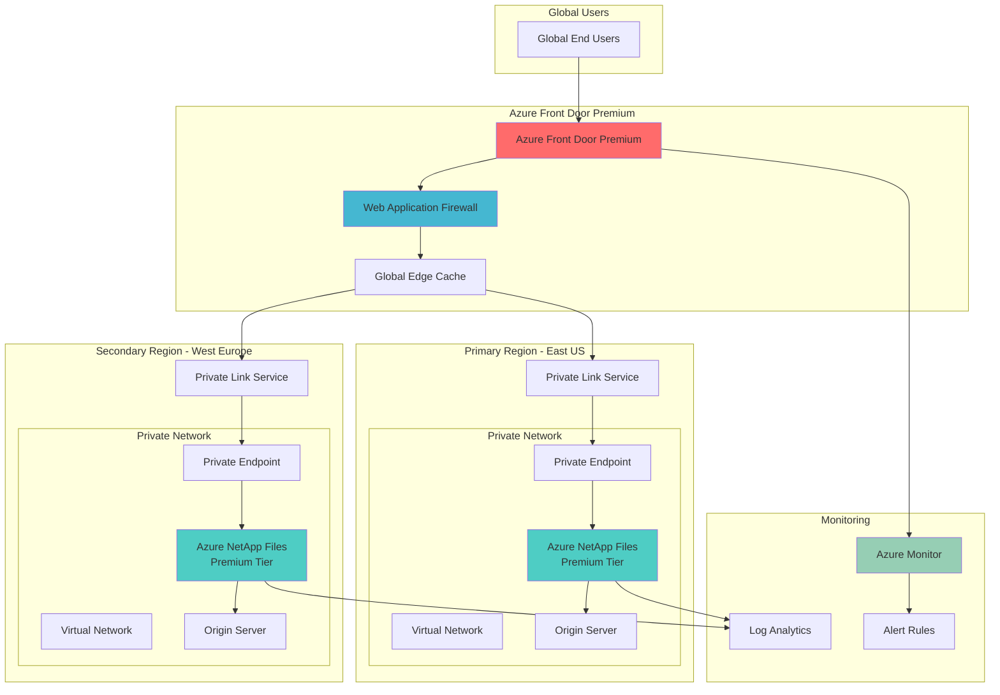

# Global Content Delivery with High-Performance Storage

## Problem

Enterprise organizations need to deliver high-volume content and media files to global audiences with millisecond latency requirements while maintaining enterprise-grade security and compliance. Traditional CDN solutions struggle with dynamic content and high-performance storage backends, often requiring complex caching strategies and lacking the throughput capabilities needed for bandwidth-intensive applications like video streaming, large file downloads, and real-time content distribution.

## Solution

This recipe implements a globally distributed content delivery architecture using Azure Front Door Premium as the edge distribution layer with Azure NetApp Files providing ultra-high-performance storage backend. The solution leverages Azure Private Link for secure connectivity, eliminating public internet exposure while maintaining enterprise compliance standards and comprehensive monitoring through Azure Monitor.

## Architecture Diagram



## Prerequisites

1. Azure subscription with Owner or Contributor permissions
2. Azure CLI v2.50.0 or later installed and configured
3. Understanding of Azure networking concepts (VNets, Private Endpoints, Private Link)
4. Knowledge of content delivery networks and caching strategies
5. Estimated cost: $200-400/month for test environment (varies by region and usage)

> **Note**: Azure NetApp Files requires registration and capacity pool minimum commitments. Review [Azure NetApp Files pricing](https://azure.microsoft.com/pricing/details/netapp/) for detailed cost information.

## Preparation

```bash
# Set environment variables for Azure resources
export RESOURCE_GROUP="rg-content-delivery-${RANDOM_SUFFIX}"
export LOCATION_PRIMARY="eastus"
export LOCATION_SECONDARY="westeurope"
export SUBSCRIPTION_ID=$(az account show --query id --output tsv)

# Generate unique suffix for resource names
RANDOM_SUFFIX=$(openssl rand -hex 3)

# NetApp Files specific variables
export ANF_ACCOUNT_PRIMARY="anf-primary-${RANDOM_SUFFIX}"
export ANF_ACCOUNT_SECONDARY="anf-secondary-${RANDOM_SUFFIX}"
export CAPACITY_POOL_NAME="pool-premium"
export VOLUME_NAME="content-volume"

# Front Door and networking variables
export FRONT_DOOR_NAME="fd-content-${RANDOM_SUFFIX}"
export VNET_PRIMARY="vnet-primary-${RANDOM_SUFFIX}"
export VNET_SECONDARY="vnet-secondary-${RANDOM_SUFFIX}"
export PRIVATE_LINK_NAME="pl-content-${RANDOM_SUFFIX}"

# Create resource group
az group create \
    --name ${RESOURCE_GROUP} \
    --location ${LOCATION_PRIMARY} \
    --tags purpose=content-delivery environment=production

echo "✅ Resource group created: ${RESOURCE_GROUP}"

# Register required resource providers
az provider register --namespace Microsoft.NetApp --wait
az provider register --namespace Microsoft.Cdn --wait
az provider register --namespace Microsoft.Network --wait

echo "✅ Resource providers registered successfully"
```

## Steps

1. **Create Virtual Networks and Subnets**:

   Virtual networking provides the foundational infrastructure for secure communication between Azure services. Creating dedicated virtual networks in multiple regions enables geo-distributed architectures while maintaining network isolation and security boundaries. The subnet configuration supports both Azure NetApp Files delegation and private endpoint connectivity.

   ```bash
   # Create primary region virtual network
   az network vnet create \
       --name ${VNET_PRIMARY} \
       --resource-group ${RESOURCE_GROUP} \
       --location ${LOCATION_PRIMARY} \
       --address-prefix 10.1.0.0/16 \
       --subnet-name anf-subnet \
       --subnet-prefix 10.1.1.0/24
   
   # Create subnet for private endpoints
   az network vnet subnet create \
       --name pe-subnet \
       --resource-group ${RESOURCE_GROUP} \
       --vnet-name ${VNET_PRIMARY} \
       --address-prefix 10.1.2.0/24
   
   # Create secondary region virtual network
   az network vnet create \
       --name ${VNET_SECONDARY} \
       --resource-group ${RESOURCE_GROUP} \
       --location ${LOCATION_SECONDARY} \
       --address-prefix 10.2.0.0/16 \
       --subnet-name anf-subnet \
       --subnet-prefix 10.2.1.0/24
   
   # Create subnet for private endpoints in secondary region
   az network vnet subnet create \
       --name pe-subnet \
       --resource-group ${RESOURCE_GROUP} \
       --vnet-name ${VNET_SECONDARY} \
       --address-prefix 10.2.2.0/24
   
   echo "✅ Virtual networks and subnets created in both regions"
   ```

   The virtual networks now provide isolated network environments with dedicated address spaces for each region. This network segmentation enables secure communication while supporting both Azure NetApp Files delegation and private endpoint connectivity patterns.

2. **Delegate Subnets to Azure NetApp Files**:

   Azure NetApp Files requires subnet delegation to manage network interfaces and enable high-performance storage connectivity. This delegation grants the NetApp service permission to create and manage network resources within the specified subnet, enabling direct storage network access with minimal latency overhead.

   ```bash
   # Delegate subnet to NetApp Files in primary region
   az network vnet subnet update \
       --name anf-subnet \
       --resource-group ${RESOURCE_GROUP} \
       --vnet-name ${VNET_PRIMARY} \
       --delegations Microsoft.NetApp/volumes
   
   # Delegate subnet to NetApp Files in secondary region
   az network vnet subnet update \
       --name anf-subnet \
       --resource-group ${RESOURCE_GROUP} \
       --vnet-name ${VNET_SECONDARY} \
       --delegations Microsoft.NetApp/volumes
   
   echo "✅ Subnets delegated to Azure NetApp Files"
   ```

   The subnet delegation enables Azure NetApp Files to provision dedicated network interfaces with optimal network performance characteristics. This configuration eliminates network virtualization overhead and provides direct storage access capabilities essential for high-throughput content delivery scenarios.

3. **Create Azure NetApp Files Accounts and Capacity Pools**:

   Azure NetApp Files accounts provide the management boundary for storage resources, while capacity pools define the performance tier and allocated storage capacity. The Premium tier offers up to 64 MiB/s per TiB throughput, making it ideal for content delivery workloads requiring consistent high-performance access to large media files.

   ```bash
   # Create NetApp Files account in primary region
   az netappfiles account create \
       --resource-group ${RESOURCE_GROUP} \
       --location ${LOCATION_PRIMARY} \
       --account-name ${ANF_ACCOUNT_PRIMARY}
   
   # Create NetApp Files account in secondary region
   az netappfiles account create \
       --resource-group ${RESOURCE_GROUP} \
       --location ${LOCATION_SECONDARY} \
       --account-name ${ANF_ACCOUNT_SECONDARY}
   
   # Create capacity pool in primary region (Premium tier)
   az netappfiles pool create \
       --resource-group ${RESOURCE_GROUP} \
       --location ${LOCATION_PRIMARY} \
       --account-name ${ANF_ACCOUNT_PRIMARY} \
       --pool-name ${CAPACITY_POOL_NAME} \
       --size 4 \
       --service-level Premium
   
   # Create capacity pool in secondary region (Premium tier)
   az netappfiles pool create \
       --resource-group ${RESOURCE_GROUP} \
       --location ${LOCATION_SECONDARY} \
       --account-name ${ANF_ACCOUNT_SECONDARY} \
       --pool-name ${CAPACITY_POOL_NAME} \
       --size 4 \
       --service-level Premium
   
   echo "✅ NetApp Files accounts and capacity pools created"
   ```

   The Premium tier capacity pools provide enterprise-grade performance with consistent throughput guarantees and submillisecond latency. This storage foundation supports demanding content delivery scenarios while maintaining cost efficiency through flexible capacity allocation.

4. **Create Azure NetApp Files Volumes**:

   Azure NetApp Files volumes provide the actual storage endpoints for content delivery applications. The NFS protocol enables high-performance file sharing across multiple compute instances, while the volume configuration optimizes for throughput and concurrent access patterns typical in content distribution scenarios.

   ```bash
   # Get subnet ID for primary region
   SUBNET_ID_PRIMARY=$(az network vnet subnet show \
       --name anf-subnet \
       --resource-group ${RESOURCE_GROUP} \
       --vnet-name ${VNET_PRIMARY} \
       --query id --output tsv)
   
   # Get subnet ID for secondary region
   SUBNET_ID_SECONDARY=$(az network vnet subnet show \
       --name anf-subnet \
       --resource-group ${RESOURCE_GROUP} \
       --vnet-name ${VNET_SECONDARY} \
       --query id --output tsv)
   
   # Create volume in primary region
   az netappfiles volume create \
       --resource-group ${RESOURCE_GROUP} \
       --location ${LOCATION_PRIMARY} \
       --account-name ${ANF_ACCOUNT_PRIMARY} \
       --pool-name ${CAPACITY_POOL_NAME} \
       --volume-name ${VOLUME_NAME} \
       --service-level Premium \
       --usage-threshold 1000 \
       --creation-token "content-primary" \
       --subnet ${SUBNET_ID_PRIMARY} \
       --protocol-types NFSv3
   
   # Create volume in secondary region
   az netappfiles volume create \
       --resource-group ${RESOURCE_GROUP} \
       --location ${LOCATION_SECONDARY} \
       --account-name ${ANF_ACCOUNT_SECONDARY} \
       --pool-name ${CAPACITY_POOL_NAME} \
       --volume-name ${VOLUME_NAME} \
       --service-level Premium \
       --usage-threshold 1000 \
       --creation-token "content-secondary" \
       --subnet ${SUBNET_ID_SECONDARY} \
       --protocol-types NFSv3
   
   echo "✅ NetApp Files volumes created with NFS protocol"
   ```

   The NFS volumes now provide high-performance storage endpoints with guaranteed throughput and low latency access. This storage configuration enables multiple origin servers to access shared content simultaneously while maintaining consistent performance characteristics.

5. **Create Azure Front Door Premium Profile**:

   Azure Front Door Premium provides advanced content delivery capabilities including integrated Web Application Firewall, Private Link origin connectivity, and enhanced routing rules engine. The Premium tier enables enterprise security features while maintaining global edge performance for content distribution.

   ```bash
   # Create Front Door Premium profile
   az afd profile create \
       --resource-group ${RESOURCE_GROUP} \
       --profile-name ${FRONT_DOOR_NAME} \
       --sku Premium_AzureFrontDoor
   
   # Create endpoint for content delivery
   az afd endpoint create \
       --resource-group ${RESOURCE_GROUP} \
       --profile-name ${FRONT_DOOR_NAME} \
       --endpoint-name "content-endpoint" \
       --enabled-state Enabled
   
   echo "✅ Front Door Premium profile and endpoint created"
   ```

   The Front Door Premium profile establishes the global distribution infrastructure with enhanced security and performance capabilities. This configuration provides the foundation for intelligent traffic routing and content caching across Microsoft's global edge network.

6. **Configure Private Link Service for Secure Connectivity**:

   Private Link Service enables secure connectivity between Azure Front Door Premium and origin servers without exposing traffic to the public internet. This architecture maintains enterprise security compliance while providing optimal performance through dedicated network paths and eliminating internet routing overhead.

   ```bash
   # Create load balancer for Private Link Service
   az network lb create \
       --resource-group ${RESOURCE_GROUP} \
       --name "lb-content-${RANDOM_SUFFIX}" \
       --location ${LOCATION_PRIMARY} \
       --sku Standard \
       --vnet-name ${VNET_PRIMARY} \
       --subnet anf-subnet \
       --frontend-ip-name frontend-ip \
       --private-ip-address 10.1.1.10
   
   # Create backend pool
   az network lb address-pool create \
       --resource-group ${RESOURCE_GROUP} \
       --lb-name "lb-content-${RANDOM_SUFFIX}" \
       --name backend-pool
   
   # Create health probe
   az network lb probe create \
       --resource-group ${RESOURCE_GROUP} \
       --lb-name "lb-content-${RANDOM_SUFFIX}" \
       --name health-probe \
       --protocol tcp \
       --port 80
   
   # Create load balancing rule
   az network lb rule create \
       --resource-group ${RESOURCE_GROUP} \
       --lb-name "lb-content-${RANDOM_SUFFIX}" \
       --name content-rule \
       --protocol tcp \
       --frontend-port 80 \
       --backend-port 80 \
       --frontend-ip-name frontend-ip \
       --backend-pool-name backend-pool \
       --probe-name health-probe
   
   echo "✅ Load balancer configured for Private Link Service"
   ```

   The load balancer provides the network infrastructure required for Private Link Service connectivity. This configuration enables secure, high-performance communication between Front Door Premium and origin servers while maintaining network isolation and compliance requirements.

7. **Create Origin Groups and Origins in Front Door**:

   Origin groups define the backend servers that Front Door routes traffic to, while origins represent the individual server endpoints. Configuring multiple origins across regions enables geographic load distribution and failover capabilities for high availability content delivery.

   ```bash
   # Create origin group
   az afd origin-group create \
       --resource-group ${RESOURCE_GROUP} \
       --profile-name ${FRONT_DOOR_NAME} \
       --origin-group-name "content-origins" \
       --probe-request-type GET \
       --probe-protocol Http \
       --probe-interval-in-seconds 60 \
       --probe-path "/" \
       --sample-size 4 \
       --successful-samples-required 3 \
       --additional-latency-in-milliseconds 50
   
   # Create primary origin
   az afd origin create \
       --resource-group ${RESOURCE_GROUP} \
       --profile-name ${FRONT_DOOR_NAME} \
       --origin-group-name "content-origins" \
       --origin-name "primary-origin" \
       --enabled-state Enabled \
       --host-name "10.1.1.10" \
       --http-port 80 \
       --https-port 443 \
       --origin-host-header "content.example.com" \
       --priority 1 \
       --weight 1000
   
   # Create secondary origin for failover
   az afd origin create \
       --resource-group ${RESOURCE_GROUP} \
       --profile-name ${FRONT_DOOR_NAME} \
       --origin-group-name "content-origins" \
       --origin-name "secondary-origin" \
       --enabled-state Enabled \
       --host-name "10.2.1.10" \
       --http-port 80 \
       --https-port 443 \
       --origin-host-header "content.example.com" \
       --priority 2 \
       --weight 1000
   
   echo "✅ Origin groups and origins configured"
   ```

   The origin configuration establishes intelligent routing and failover capabilities across multiple regions. This setup enables Front Door to automatically route traffic to the optimal origin based on health, performance, and geographic proximity while providing seamless failover protection.

8. **Configure Routes and Caching Rules**:

   Routes define how Front Door processes incoming requests and applies caching policies. Configuring appropriate caching rules optimizes content delivery performance by reducing origin server load and improving response times for frequently accessed content.

   ```bash
   # Create route for content delivery
   az afd route create \
       --resource-group ${RESOURCE_GROUP} \
       --profile-name ${FRONT_DOOR_NAME} \
       --endpoint-name "content-endpoint" \
       --route-name "content-route" \
       --origin-group "content-origins" \
       --supported-protocols Http Https \
       --patterns-to-match "/*" \
       --forwarding-protocol HttpsOnly \
       --link-to-default-domain Enabled \
       --https-redirect Enabled
   
   # Create rule set for caching policies
   az afd rule-set create \
       --resource-group ${RESOURCE_GROUP} \
       --profile-name ${FRONT_DOOR_NAME} \
       --rule-set-name "caching-rules"
   
   # Create caching rule for static content
   az afd rule create \
       --resource-group ${RESOURCE_GROUP} \
       --profile-name ${FRONT_DOOR_NAME} \
       --rule-set-name "caching-rules" \
       --rule-name "static-content" \
       --order 1 \
       --match-variable UrlFileExtension \
       --operator Equal \
       --match-values jpg jpeg png gif css js pdf mp4 mp3 \
       --action-name ModifyResponseHeader \
       --header-action Overwrite \
       --header-name "Cache-Control" \
       --header-value "public, max-age=31536000"
   
   echo "✅ Routes and caching rules configured"
   ```

   The routing configuration optimizes content delivery by implementing intelligent caching strategies and secure transport protocols. This setup ensures optimal performance for static content while maintaining security through HTTPS enforcement and appropriate cache control headers.

9. **Configure Web Application Firewall (WAF)**:

   Azure Front Door Premium includes integrated Web Application Firewall capabilities that protect against common web attacks and malicious traffic. WAF policies provide customizable security rules that filter requests before they reach origin servers, ensuring content delivery infrastructure remains secure and available.

   ```bash
   # Create WAF policy
   az network front-door waf-policy create \
       --resource-group ${RESOURCE_GROUP} \
       --name "wafcontentpolicy${RANDOM_SUFFIX}" \
       --mode Prevention \
       --enabled true \
       --sku Premium_AzureFrontDoor
   
   # Add managed rule set
   az network front-door waf-policy managed-rules add \
       --resource-group ${RESOURCE_GROUP} \
       --policy-name "wafcontentpolicy${RANDOM_SUFFIX}" \
       --type Microsoft_DefaultRuleSet \
       --version 2.1 \
       --action Block
   
   # Get WAF policy ID
   WAF_POLICY_ID=$(az network front-door waf-policy show \
       --resource-group ${RESOURCE_GROUP} \
       --name "wafcontentpolicy${RANDOM_SUFFIX}" \
       --query id --output tsv)
   
   # Create security policy to link WAF to Front Door
   az afd security-policy create \
       --resource-group ${RESOURCE_GROUP} \
       --profile-name ${FRONT_DOOR_NAME} \
       --security-policy-name "content-security-policy" \
       --domains "/subscriptions/${SUBSCRIPTION_ID}/resourceGroups/${RESOURCE_GROUP}/providers/Microsoft.Cdn/profiles/${FRONT_DOOR_NAME}/endpoints/content-endpoint" \
       --waf-policy ${WAF_POLICY_ID}
   
   echo "✅ WAF policy configured and linked to Front Door"
   ```

   The WAF configuration provides comprehensive protection against web-based attacks while maintaining optimal performance for legitimate traffic. The managed rule sets automatically update to protect against emerging threats, while the security policy ensures all traffic through Front Door is protected.

10. **Configure Azure Monitor and Diagnostics**:

    Azure Monitor provides comprehensive observability for content delivery infrastructure, including performance metrics, availability monitoring, and diagnostic logging. This monitoring foundation enables proactive issue detection and optimization opportunities for global content distribution performance.

    ```bash
    # Create Log Analytics workspace
    az monitor log-analytics workspace create \
        --resource-group ${RESOURCE_GROUP} \
        --workspace-name "law-content-${RANDOM_SUFFIX}" \
        --location ${LOCATION_PRIMARY} \
        --sku PerGB2018
    
    # Get workspace ID
    WORKSPACE_ID=$(az monitor log-analytics workspace show \
        --resource-group ${RESOURCE_GROUP} \
        --workspace-name "law-content-${RANDOM_SUFFIX}" \
        --query id --output tsv)
    
    # Get Front Door profile ID
    FRONT_DOOR_ID=$(az afd profile show \
        --resource-group ${RESOURCE_GROUP} \
        --profile-name ${FRONT_DOOR_NAME} \
        --query id --output tsv)
    
    # Enable diagnostic settings for Front Door
    az monitor diagnostic-settings create \
        --resource-group ${RESOURCE_GROUP} \
        --name "fd-diagnostics" \
        --resource ${FRONT_DOOR_ID} \
        --workspace ${WORKSPACE_ID} \
        --logs '[{"category":"FrontDoorAccessLog","enabled":true},{"category":"FrontDoorHealthProbeLog","enabled":true}]' \
        --metrics '[{"category":"AllMetrics","enabled":true}]'
    
    # Create alert rule for high request count
    az monitor metrics alert create \
        --resource-group ${RESOURCE_GROUP} \
        --name "high-request-count-alert" \
        --scopes ${FRONT_DOOR_ID} \
        --condition "avg RequestCount > 1000" \
        --description "Alert when request count exceeds threshold" \
        --evaluation-frequency 5m \
        --window-size 15m
    
    echo "✅ Monitoring and diagnostics configured"
    ```

    The monitoring configuration provides comprehensive visibility into content delivery performance and security events. This observability foundation enables data-driven optimization decisions and proactive issue resolution for maintaining optimal user experience.

## Validation & Testing

1. **Verify Azure NetApp Files Volume Availability**:

   ```bash
   # Check NetApp Files volume status
   az netappfiles volume show \
       --resource-group ${RESOURCE_GROUP} \
       --account-name ${ANF_ACCOUNT_PRIMARY} \
       --pool-name ${CAPACITY_POOL_NAME} \
       --volume-name ${VOLUME_NAME} \
       --query "provisioningState" --output tsv
   ```

   Expected output: `Succeeded`

2. **Test Front Door Endpoint Connectivity**:

   ```bash
   # Get Front Door endpoint hostname
   ENDPOINT_HOSTNAME=$(az afd endpoint show \
       --resource-group ${RESOURCE_GROUP} \
       --profile-name ${FRONT_DOOR_NAME} \
       --endpoint-name "content-endpoint" \
       --query "hostName" --output tsv)
   
   # Test endpoint response
   curl -I "https://${ENDPOINT_HOSTNAME}/" \
       --max-time 10
   ```

   Expected output: HTTP status codes indicating successful connection

3. **Validate WAF Policy Application**:

   ```bash
   # Check WAF policy status
   az network front-door waf-policy show \
       --resource-group ${RESOURCE_GROUP} \
       --name "wafcontentpolicy${RANDOM_SUFFIX}" \
       --query "policySettings.enabledState" --output tsv
   ```

   Expected output: `Enabled`

4. **Monitor Performance Metrics**:

   ```bash
   # Query Front Door metrics
   az monitor metrics list \
       --resource ${FRONT_DOOR_ID} \
       --resource-type Microsoft.Cdn/profiles \
       --resource-group ${RESOURCE_GROUP} \
       --metric "RequestCount" \
       --start-time $(date -u -d '1 hour ago' +%Y-%m-%dT%H:%M:%SZ) \
       --end-time $(date -u +%Y-%m-%dT%H:%M:%SZ)
   ```

## Cleanup

1. **Remove Front Door Profile and Associated Resources**:

   ```bash
   # Delete Front Door profile
   az afd profile delete \
       --resource-group ${RESOURCE_GROUP} \
       --profile-name ${FRONT_DOOR_NAME} \
       --yes
   
   echo "✅ Front Door profile deleted"
   ```

2. **Remove WAF Policy**:

   ```bash
   # Delete WAF policy
   az network front-door waf-policy delete \
       --resource-group ${RESOURCE_GROUP} \
       --name "wafcontentpolicy${RANDOM_SUFFIX}" \
       --yes
   
   echo "✅ WAF policy deleted"
   ```

3. **Remove Azure NetApp Files Resources**:

   ```bash
   # Delete volumes
   az netappfiles volume delete \
       --resource-group ${RESOURCE_GROUP} \
       --account-name ${ANF_ACCOUNT_PRIMARY} \
       --pool-name ${CAPACITY_POOL_NAME} \
       --volume-name ${VOLUME_NAME} \
       --yes
   
   az netappfiles volume delete \
       --resource-group ${RESOURCE_GROUP} \
       --account-name ${ANF_ACCOUNT_SECONDARY} \
       --pool-name ${CAPACITY_POOL_NAME} \
       --volume-name ${VOLUME_NAME} \
       --yes
   
   # Delete capacity pools
   az netappfiles pool delete \
       --resource-group ${RESOURCE_GROUP} \
       --account-name ${ANF_ACCOUNT_PRIMARY} \
       --pool-name ${CAPACITY_POOL_NAME} \
       --yes
   
   az netappfiles pool delete \
       --resource-group ${RESOURCE_GROUP} \
       --account-name ${ANF_ACCOUNT_SECONDARY} \
       --pool-name ${CAPACITY_POOL_NAME} \
       --yes
   
   # Delete NetApp accounts
   az netappfiles account delete \
       --resource-group ${RESOURCE_GROUP} \
       --account-name ${ANF_ACCOUNT_PRIMARY} \
       --yes
   
   az netappfiles account delete \
       --resource-group ${RESOURCE_GROUP} \
       --account-name ${ANF_ACCOUNT_SECONDARY} \
       --yes
   
   echo "✅ NetApp Files resources deleted"
   ```

4. **Remove Networking Resources**:

   ```bash
   # Delete load balancer
   az network lb delete \
       --resource-group ${RESOURCE_GROUP} \
       --name "lb-content-${RANDOM_SUFFIX}"
   
   # Delete virtual networks
   az network vnet delete \
       --resource-group ${RESOURCE_GROUP} \
       --name ${VNET_PRIMARY}
   
   az network vnet delete \
       --resource-group ${RESOURCE_GROUP} \
       --name ${VNET_SECONDARY}
   
   echo "✅ Networking resources deleted"
   ```

5. **Remove Monitoring Resources**:

   ```bash
   # Delete Log Analytics workspace
   az monitor log-analytics workspace delete \
       --resource-group ${RESOURCE_GROUP} \
       --workspace-name "law-content-${RANDOM_SUFFIX}" \
       --yes
   
   # Delete resource group
   az group delete \
       --name ${RESOURCE_GROUP} \
       --yes \
       --no-wait
   
   echo "✅ All resources deleted"
   ```

## Discussion

Azure Front Door Premium combined with Azure NetApp Files creates a powerful content delivery architecture that addresses enterprise requirements for performance, security, and scalability. This solution leverages Microsoft's global edge network with over 118 points of presence worldwide, providing millisecond-latency content delivery while maintaining enterprise-grade security through integrated WAF and Private Link connectivity. The architecture follows the [Azure Well-Architected Framework](https://docs.microsoft.com/en-us/azure/architecture/framework/) principles of reliability, security, cost optimization, operational excellence, and performance efficiency.

The integration of Azure NetApp Files Premium tier provides exceptional storage performance with up to 64 MiB/s per TiB throughput and submillisecond latency characteristics. This high-performance storage backend is particularly valuable for content delivery scenarios involving large media files, real-time streaming, and high-concurrency access patterns. The NFS protocol support enables seamless integration with existing content management systems and provides the scalability needed for enterprise content distribution requirements. For detailed performance characteristics and optimization guidance, refer to the [Azure NetApp Files performance documentation](https://docs.microsoft.com/en-us/azure/azure-netapp-files/azure-netapp-files-performance-considerations).

Private Link connectivity ensures that content delivery traffic remains within the Microsoft Azure backbone network, eliminating exposure to public internet routing and potential security vulnerabilities. This architecture pattern aligns with zero-trust security principles and provides the network isolation required for regulatory compliance in industries such as healthcare, finance, and government. The [Azure Private Link documentation](https://docs.microsoft.com/en-us/azure/private-link/private-link-overview) provides comprehensive guidance on implementing secure connectivity patterns.

From a cost optimization perspective, this architecture provides significant value through intelligent caching strategies, efficient global traffic routing, and premium storage performance that reduces the need for over-provisioning compute resources. Azure Front Door's anycast network automatically routes users to the nearest edge location, minimizing latency and improving user experience while reducing bandwidth costs. The combination of Azure NetApp Files' flexible service levels and Front Door's consumption-based pricing model enables cost-effective scaling based on actual usage patterns. For cost optimization strategies, review the [Azure Front Door pricing documentation](https://docs.microsoft.com/en-us/azure/frontdoor/front-door-pricing) and [Azure NetApp Files cost optimization guide](https://docs.microsoft.com/en-us/azure/azure-netapp-files/azure-netapp-files-cost-model).

> **Tip**: Use Azure Monitor Application Insights to track end-to-end performance metrics and identify optimization opportunities. Configure custom dashboards that correlate Front Door response times with NetApp Files throughput metrics to optimize the entire content delivery pipeline.

## Challenge

Extend this solution by implementing these enhancements:

1. **Implement Cross-Region Replication**: Configure Azure NetApp Files cross-region replication to maintain content synchronization between primary and secondary regions, enabling automatic failover and disaster recovery capabilities.

2. **Advanced Caching Strategies**: Develop intelligent caching policies using Azure Front Door Rules Engine that dynamically adjust cache behavior based on content type, user geography, and access patterns to optimize performance and reduce origin server load.

3. **Container-Based Origin Servers**: Deploy containerized origin servers using Azure Container Instances or Azure Kubernetes Service that can dynamically scale based on demand and integrate with Azure NetApp Files for persistent storage.

4. **Real-Time Analytics Dashboard**: Create comprehensive monitoring dashboards using Azure Monitor Workbooks that provide real-time insights into content delivery performance, user geography, cache hit ratios, and security events.

5. **Automated Content Optimization**: Implement Azure Functions-based workflows that automatically optimize content delivery by compressing images, generating multiple format variants, and implementing adaptive bitrate streaming for video content.

## Infrastructure Code

*Infrastructure code will be generated after recipe approval.*