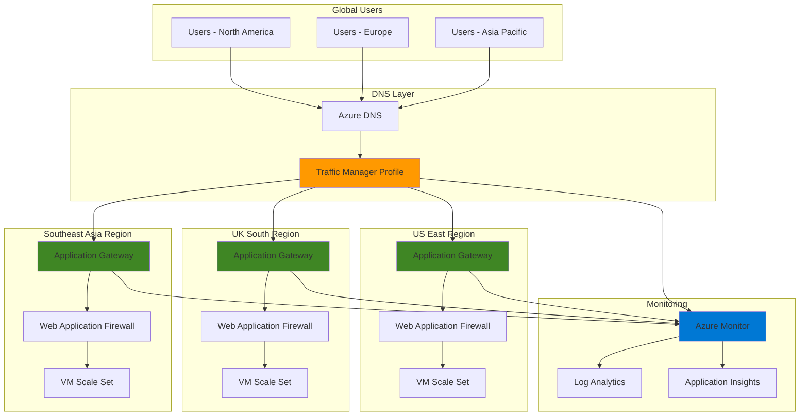

# Global Traffic Distribution with Traffic Manager and Application Gateway

## Problem

Global enterprises face significant challenges in delivering consistent, high-performance web applications to users distributed across multiple geographic regions. Traditional single-region deployments create latency issues for distant users, while manual failover processes result in extended downtime during outages. Organizations need an intelligent traffic distribution system that automatically routes users to the nearest healthy endpoint while providing centralized SSL termination and web application security.

## Solution

This solution combines Azure Traffic Manager's DNS-based global load balancing with Azure Application Gateway's regional application delivery capabilities. Traffic Manager intelligently routes users to the geographically closest healthy region using performance-based routing, while Application Gateway provides SSL termination, web application firewall protection, and layer-7 load balancing within each region. This architecture ensures optimal user experience through reduced latency and enhanced security.

## Architecture Diagram



## Prerequisites

1. Azure subscription with Global Administrator or Contributor permissions
2. Azure CLI v2.50.0 or later installed and configured (or Azure Cloud Shell)
3. Basic understanding of DNS, load balancing, and web application architecture
4. Knowledge of Azure networking concepts and resource groups
5. Estimated cost: $150-300 per month for multi-region deployment (varies by traffic volume and instance sizes)

> **Note**: This recipe deploys resources across multiple Azure regions, which may incur additional data transfer costs between regions. Review the [Azure Traffic Manager pricing](https://azure.microsoft.com/pricing/details/traffic-manager/) and [Application Gateway pricing](https://azure.microsoft.com/pricing/details/application-gateway/) for detailed cost information.

## Preparation

```bash
# Set environment variables for consistent resource naming
export RESOURCE_GROUP_PRIMARY="rg-global-traffic-primary"
export RESOURCE_GROUP_SECONDARY="rg-global-traffic-secondary"
export RESOURCE_GROUP_TERTIARY="rg-global-traffic-tertiary"
export LOCATION_PRIMARY="eastus"
export LOCATION_SECONDARY="uksouth"
export LOCATION_TERTIARY="southeastasia"

# Generate unique suffix for globally unique resources
RANDOM_SUFFIX=$(openssl rand -hex 3)
export RANDOM_SUFFIX

# Set Traffic Manager and Application Gateway names
export TRAFFIC_MANAGER_PROFILE="tm-global-app-${RANDOM_SUFFIX}"
export APP_GATEWAY_PRIMARY="agw-primary-${RANDOM_SUFFIX}"
export APP_GATEWAY_SECONDARY="agw-secondary-${RANDOM_SUFFIX}"
export APP_GATEWAY_TERTIARY="agw-tertiary-${RANDOM_SUFFIX}"

# Create resource groups in each region
az group create \
    --name ${RESOURCE_GROUP_PRIMARY} \
    --location ${LOCATION_PRIMARY} \
    --tags environment=production purpose=global-traffic-distribution

az group create \
    --name ${RESOURCE_GROUP_SECONDARY} \
    --location ${LOCATION_SECONDARY} \
    --tags environment=production purpose=global-traffic-distribution

az group create \
    --name ${RESOURCE_GROUP_TERTIARY} \
    --location ${LOCATION_TERTIARY} \
    --tags environment=production purpose=global-traffic-distribution

echo "✅ Resource groups created in all regions"
echo "Primary: ${RESOURCE_GROUP_PRIMARY} (${LOCATION_PRIMARY})"
echo "Secondary: ${RESOURCE_GROUP_SECONDARY} (${LOCATION_SECONDARY})"
echo "Tertiary: ${RESOURCE_GROUP_TERTIARY} (${LOCATION_TERTIARY})"
```

## Steps

1. **Create Virtual Networks and Subnets in Each Region**:

   Virtual networks provide the foundational networking infrastructure for each regional deployment. Each region requires a dedicated virtual network with specific subnets for Application Gateway and backend resources. This isolation ensures network security while enabling regional resource communication and proper traffic flow management.

   ```bash
   # Create virtual network in primary region (East US)
   az network vnet create \
       --resource-group ${RESOURCE_GROUP_PRIMARY} \
       --name vnet-primary \
       --address-prefix 10.1.0.0/16 \
       --subnet-name subnet-appgw \
       --subnet-prefix 10.1.1.0/24 \
       --location ${LOCATION_PRIMARY}
   
   # Create backend subnet for primary region
   az network vnet subnet create \
       --resource-group ${RESOURCE_GROUP_PRIMARY} \
       --vnet-name vnet-primary \
       --name subnet-backend \
       --address-prefix 10.1.2.0/24
   
   # Create virtual network in secondary region (UK South)
   az network vnet create \
       --resource-group ${RESOURCE_GROUP_SECONDARY} \
       --name vnet-secondary \
       --address-prefix 10.2.0.0/16 \
       --subnet-name subnet-appgw \
       --subnet-prefix 10.2.1.0/24 \
       --location ${LOCATION_SECONDARY}
   
   # Create backend subnet for secondary region
   az network vnet subnet create \
       --resource-group ${RESOURCE_GROUP_SECONDARY} \
       --vnet-name vnet-secondary \
       --name subnet-backend \
       --address-prefix 10.2.2.0/24
   
   # Create virtual network in tertiary region (Southeast Asia)
   az network vnet create \
       --resource-group ${RESOURCE_GROUP_TERTIARY} \
       --name vnet-tertiary \
       --address-prefix 10.3.0.0/16 \
       --subnet-name subnet-appgw \
       --subnet-prefix 10.3.1.0/24 \
       --location ${LOCATION_TERTIARY}
   
   # Create backend subnet for tertiary region
   az network vnet subnet create \
       --resource-group ${RESOURCE_GROUP_TERTIARY} \
       --vnet-name vnet-tertiary \
       --name subnet-backend \
       --address-prefix 10.3.2.0/24
   
   echo "✅ Virtual networks and subnets created in all regions"
   ```

   The virtual networks are now configured with dedicated subnets for Application Gateway and backend resources. This network segmentation provides security isolation and enables proper routing between Application Gateway and backend services while maintaining regional network boundaries.

2. **Create Public IP Addresses for Application Gateways**:

   Public IP addresses serve as the entry points for Application Gateways in each region. These static IP addresses enable external access and provide consistent endpoints for Traffic Manager health monitoring. Each region requires a dedicated public IP with standard SKU for enhanced security and availability features.

   ```bash
   # Create public IP for primary region Application Gateway
   az network public-ip create \
       --resource-group ${RESOURCE_GROUP_PRIMARY} \
       --name pip-appgw-primary \
       --location ${LOCATION_PRIMARY} \
       --allocation-method Static \
       --sku Standard \
       --zone 1 2 3
   
   # Create public IP for secondary region Application Gateway
   az network public-ip create \
       --resource-group ${RESOURCE_GROUP_SECONDARY} \
       --name pip-appgw-secondary \
       --location ${LOCATION_SECONDARY} \
       --allocation-method Static \
       --sku Standard \
       --zone 1 2 3
   
   # Create public IP for tertiary region Application Gateway
   az network public-ip create \
       --resource-group ${RESOURCE_GROUP_TERTIARY} \
       --name pip-appgw-tertiary \
       --location ${LOCATION_TERTIARY} \
       --allocation-method Static \
       --sku Standard \
       --zone 1 2 3
   
   # Store public IP addresses for later use
   export PIP_PRIMARY=$(az network public-ip show \
       --resource-group ${RESOURCE_GROUP_PRIMARY} \
       --name pip-appgw-primary \
       --query ipAddress --output tsv)
   
   export PIP_SECONDARY=$(az network public-ip show \
       --resource-group ${RESOURCE_GROUP_SECONDARY} \
       --name pip-appgw-secondary \
       --query ipAddress --output tsv)
   
   export PIP_TERTIARY=$(az network public-ip show \
       --resource-group ${RESOURCE_GROUP_TERTIARY} \
       --name pip-appgw-tertiary \
       --query ipAddress --output tsv)
   
   echo "✅ Public IP addresses created and stored"
   echo "Primary IP: ${PIP_PRIMARY}"
   echo "Secondary IP: ${PIP_SECONDARY}"
   echo "Tertiary IP: ${PIP_TERTIARY}"
   ```

   The public IP addresses are now configured with zone redundancy for high availability. These static IP addresses provide consistent endpoints for Traffic Manager to monitor and route traffic to the appropriate regional Application Gateway based on performance and health status.

3. **Create Virtual Machine Scale Sets for Backend Services**:

   Virtual Machine Scale Sets provide the scalable backend infrastructure for web applications in each region. These managed compute resources automatically scale based on demand and provide high availability through distribution across availability zones. Each scale set includes custom script extensions for application deployment and health monitoring.

   ```bash
   # Create VM Scale Set in primary region
   az vmss create \
       --resource-group ${RESOURCE_GROUP_PRIMARY} \
       --name vmss-primary \
       --image Ubuntu2204 \
       --instance-count 2 \
       --admin-username azureuser \
       --generate-ssh-keys \
       --vnet-name vnet-primary \
       --subnet subnet-backend \
       --vm-sku Standard_B2s \
       --zones 1 2 3 \
       --load-balancer "" \
       --public-ip-address ""
   
   # Create VM Scale Set in secondary region
   az vmss create \
       --resource-group ${RESOURCE_GROUP_SECONDARY} \
       --name vmss-secondary \
       --image Ubuntu2204 \
       --instance-count 2 \
       --admin-username azureuser \
       --generate-ssh-keys \
       --vnet-name vnet-secondary \
       --subnet subnet-backend \
       --vm-sku Standard_B2s \
       --zones 1 2 3 \
       --load-balancer "" \
       --public-ip-address ""
   
   # Create VM Scale Set in tertiary region
   az vmss create \
       --resource-group ${RESOURCE_GROUP_TERTIARY} \
       --name vmss-tertiary \
       --image Ubuntu2204 \
       --instance-count 2 \
       --admin-username azureuser \
       --generate-ssh-keys \
       --vnet-name vnet-tertiary \
       --subnet subnet-backend \
       --vm-sku Standard_B2s \
       --zones 1 2 3 \
       --load-balancer "" \
       --public-ip-address ""
   
   echo "✅ Virtual Machine Scale Sets created in all regions"
   ```

   The VM Scale Sets are now deployed across availability zones for maximum resilience. Each scale set provides automatic scaling capabilities and serves as the backend infrastructure for the Application Gateways, ensuring consistent application availability across all regions.

4. **Install Web Server Applications on Scale Sets**:

   Web server applications provide the actual service endpoints that users will access through the global traffic distribution system. Each region requires a functioning web application that responds to health checks and serves content. This step installs and configures nginx web servers with region-specific content for testing and identification.

   ```bash
   # Install nginx on primary region scale set
   az vmss extension set \
       --resource-group ${RESOURCE_GROUP_PRIMARY} \
       --vmss-name vmss-primary \
       --name customScript \
       --publisher Microsoft.Azure.Extensions \
       --version 2.1 \
       --settings '{
           "commandToExecute": "apt-get update && apt-get install -y nginx && systemctl start nginx && systemctl enable nginx && echo \"<h1>Primary Region - East US</h1><p>Server: $(hostname)</p><p>Region: East US</p>\" > /var/www/html/index.html"
       }'
   
   # Install nginx on secondary region scale set
   az vmss extension set \
       --resource-group ${RESOURCE_GROUP_SECONDARY} \
       --vmss-name vmss-secondary \
       --name customScript \
       --publisher Microsoft.Azure.Extensions \
       --version 2.1 \
       --settings '{
           "commandToExecute": "apt-get update && apt-get install -y nginx && systemctl start nginx && systemctl enable nginx && echo \"<h1>Secondary Region - UK South</h1><p>Server: $(hostname)</p><p>Region: UK South</p>\" > /var/www/html/index.html"
       }'
   
   # Install nginx on tertiary region scale set
   az vmss extension set \
       --resource-group ${RESOURCE_GROUP_TERTIARY} \
       --vmss-name vmss-tertiary \
       --name customScript \
       --publisher Microsoft.Azure.Extensions \
       --version 2.1 \
       --settings '{
           "commandToExecute": "apt-get update && apt-get install -y nginx && systemctl start nginx && systemctl enable nginx && echo \"<h1>Tertiary Region - Southeast Asia</h1><p>Server: $(hostname)</p><p>Region: Southeast Asia</p>\" > /var/www/html/index.html"
       }'
   
   echo "✅ Web server applications installed on all scale sets"
   ```

   The web server applications are now configured with region-specific content to demonstrate traffic routing effectiveness. Each nginx installation provides a healthy endpoint for Application Gateway health probes and serves as the foundation for the global application architecture.

5. **Create Application Gateways with Web Application Firewall**:

   Application Gateways provide layer-7 load balancing, SSL termination, and web application firewall protection within each region. The WAF_v2 SKU includes advanced security features to protect against common web attacks while maintaining high performance. Each gateway requires careful configuration of frontend IP, backend pools, and routing rules.

   ```bash
   # Create Application Gateway in primary region
   az network application-gateway create \
       --resource-group ${RESOURCE_GROUP_PRIMARY} \
       --name ${APP_GATEWAY_PRIMARY} \
       --location ${LOCATION_PRIMARY} \
       --vnet-name vnet-primary \
       --subnet subnet-appgw \
       --public-ip-address pip-appgw-primary \
       --capacity 2 \
       --sku WAF_v2 \
       --http-settings-cookie-based-affinity Disabled \
       --frontend-port 80 \
       --routing-rule-type Basic \
       --http-settings-port 80 \
       --http-settings-protocol Http \
       --zones 1 2 3
   
   # Create Application Gateway in secondary region
   az network application-gateway create \
       --resource-group ${RESOURCE_GROUP_SECONDARY} \
       --name ${APP_GATEWAY_SECONDARY} \
       --location ${LOCATION_SECONDARY} \
       --vnet-name vnet-secondary \
       --subnet subnet-appgw \
       --public-ip-address pip-appgw-secondary \
       --capacity 2 \
       --sku WAF_v2 \
       --http-settings-cookie-based-affinity Disabled \
       --frontend-port 80 \
       --routing-rule-type Basic \
       --http-settings-port 80 \
       --http-settings-protocol Http \
       --zones 1 2 3
   
   # Create Application Gateway in tertiary region
   az network application-gateway create \
       --resource-group ${RESOURCE_GROUP_TERTIARY} \
       --name ${APP_GATEWAY_TERTIARY} \
       --location ${LOCATION_TERTIARY} \
       --vnet-name vnet-tertiary \
       --subnet subnet-appgw \
       --public-ip-address pip-appgw-tertiary \
       --capacity 2 \
       --sku WAF_v2 \
       --http-settings-cookie-based-affinity Disabled \
       --frontend-port 80 \
       --routing-rule-type Basic \
       --http-settings-port 80 \
       --http-settings-protocol Http \
       --zones 1 2 3
   
   echo "✅ Application Gateways created with WAF protection in all regions"
   ```

   The Application Gateways are now configured with Web Application Firewall protection and zone redundancy. Each gateway provides secure, high-performance application delivery capabilities with automatic threat detection and mitigation, forming the regional entry points for the global traffic distribution system.

6. **Configure Application Gateway Backend Pools**:

   Backend pools define the target servers that Application Gateway will route traffic to within each region. These pools must be configured with the appropriate VM Scale Set instances to ensure proper traffic distribution. Dynamic backend pool membership ensures that scaling events are automatically reflected in the load balancing configuration.

   ```bash
   # Configure backend pool for primary region
   az network application-gateway address-pool update \
       --resource-group ${RESOURCE_GROUP_PRIMARY} \
       --gateway-name ${APP_GATEWAY_PRIMARY} \
       --name appGatewayBackendPool \
       --servers $(az vmss nic list \
           --resource-group ${RESOURCE_GROUP_PRIMARY} \
           --vmss-name vmss-primary \
           --query "[].ipConfigurations[0].privateIpAddress" \
           --output tsv | tr '\n' ' ')
   
   # Configure backend pool for secondary region
   az network application-gateway address-pool update \
       --resource-group ${RESOURCE_GROUP_SECONDARY} \
       --gateway-name ${APP_GATEWAY_SECONDARY} \
       --name appGatewayBackendPool \
       --servers $(az vmss nic list \
           --resource-group ${RESOURCE_GROUP_SECONDARY} \
           --vmss-name vmss-secondary \
           --query "[].ipConfigurations[0].privateIpAddress" \
           --output tsv | tr '\n' ' ')
   
   # Configure backend pool for tertiary region
   az network application-gateway address-pool update \
       --resource-group ${RESOURCE_GROUP_TERTIARY} \
       --gateway-name ${APP_GATEWAY_TERTIARY} \
       --name appGatewayBackendPool \
       --servers $(az vmss nic list \
           --resource-group ${RESOURCE_GROUP_TERTIARY} \
           --vmss-name vmss-tertiary \
           --query "[].ipConfigurations[0].privateIpAddress" \
           --output tsv | tr '\n' ' ')
   
   echo "✅ Application Gateway backend pools configured with VM Scale Set instances"
   ```

   The backend pools are now configured with the private IP addresses of the VM Scale Set instances. This configuration enables Application Gateway to distribute incoming traffic across healthy backend servers and provides the foundation for regional load balancing within the global traffic distribution architecture.

7. **Create Traffic Manager Profile with Performance Routing**:

   Traffic Manager provides DNS-based global load balancing that routes users to the optimal regional endpoint based on network performance. The performance routing method automatically selects the endpoint with the lowest latency from the user's perspective, ensuring optimal user experience across all geographic regions.

   ```bash
   # Create Traffic Manager profile with performance routing
   az network traffic-manager profile create \
       --resource-group ${RESOURCE_GROUP_PRIMARY} \
       --name ${TRAFFIC_MANAGER_PROFILE} \
       --routing-method Performance \
       --unique-dns-name ${TRAFFIC_MANAGER_PROFILE} \
       --ttl 30 \
       --protocol HTTP \
       --port 80 \
       --path "/" \
       --interval 30 \
       --timeout 10 \
       --max-failures 3
   
   # Get Traffic Manager profile FQDN
   export TRAFFIC_MANAGER_FQDN=$(az network traffic-manager profile show \
       --resource-group ${RESOURCE_GROUP_PRIMARY} \
       --name ${TRAFFIC_MANAGER_PROFILE} \
       --query dnsConfig.fqdn \
       --output tsv)
   
   echo "✅ Traffic Manager profile created with performance routing"
   echo "Traffic Manager FQDN: ${TRAFFIC_MANAGER_FQDN}"
   ```

   The Traffic Manager profile is now configured with performance-based routing to automatically direct users to the fastest responding regional endpoint. This DNS-based load balancing provides global traffic distribution with automatic failover capabilities and optimal performance routing.

8. **Add Regional Endpoints to Traffic Manager**:

   Traffic Manager endpoints represent the regional Application Gateway instances that serve as entry points for each geographic region. Each endpoint is configured with appropriate priority, weight, and geographic location settings to enable intelligent traffic routing based on user location and endpoint health status.

   ```bash
   # Add primary region endpoint
   az network traffic-manager endpoint create \
       --resource-group ${RESOURCE_GROUP_PRIMARY} \
       --profile-name ${TRAFFIC_MANAGER_PROFILE} \
       --name endpoint-primary \
       --type externalEndpoints \
       --target ${PIP_PRIMARY} \
       --endpoint-location "East US" \
       --priority 1 \
       --weight 100
   
   # Add secondary region endpoint
   az network traffic-manager endpoint create \
       --resource-group ${RESOURCE_GROUP_PRIMARY} \
       --profile-name ${TRAFFIC_MANAGER_PROFILE} \
       --name endpoint-secondary \
       --type externalEndpoints \
       --target ${PIP_SECONDARY} \
       --endpoint-location "UK South" \
       --priority 2 \
       --weight 100
   
   # Add tertiary region endpoint
   az network traffic-manager endpoint create \
       --resource-group ${RESOURCE_GROUP_PRIMARY} \
       --profile-name ${TRAFFIC_MANAGER_PROFILE} \
       --name endpoint-tertiary \
       --type externalEndpoints \
       --target ${PIP_TERTIARY} \
       --endpoint-location "Southeast Asia" \
       --priority 3 \
       --weight 100
   
   echo "✅ Regional endpoints added to Traffic Manager profile"
   echo "Primary endpoint: ${PIP_PRIMARY} (East US)"
   echo "Secondary endpoint: ${PIP_SECONDARY} (UK South)"
   echo "Tertiary endpoint: ${PIP_TERTIARY} (Southeast Asia)"
   ```

   The Traffic Manager endpoints are now configured to route traffic to the appropriate regional Application Gateway based on performance metrics and health status. This configuration enables automatic failover and intelligent traffic distribution across all three regions.

9. **Configure Web Application Firewall Policies**:

   Web Application Firewall policies provide centralized security rule management for protecting applications against common web attacks. Each region requires a comprehensive WAF policy that includes OWASP rule sets, custom rules, and appropriate security configurations to protect against threats while maintaining application performance.

   ```bash
   # Create WAF policy for primary region
   az network application-gateway waf-policy create \
       --resource-group ${RESOURCE_GROUP_PRIMARY} \
       --name waf-policy-primary \
       --location ${LOCATION_PRIMARY} \
       --type OWASP \
       --version 3.2 \
       --mode Prevention \
       --state Enabled
   
   # Create WAF policy for secondary region
   az network application-gateway waf-policy create \
       --resource-group ${RESOURCE_GROUP_SECONDARY} \
       --name waf-policy-secondary \
       --location ${LOCATION_SECONDARY} \
       --type OWASP \
       --version 3.2 \
       --mode Prevention \
       --state Enabled
   
   # Create WAF policy for tertiary region
   az network application-gateway waf-policy create \
       --resource-group ${RESOURCE_GROUP_TERTIARY} \
       --name waf-policy-tertiary \
       --location ${LOCATION_TERTIARY} \
       --type OWASP \
       --version 3.2 \
       --mode Prevention \
       --state Enabled
   
   echo "✅ WAF policies created and configured for all regions"
   ```

   The WAF policies are now configured with OWASP rule sets in prevention mode, providing comprehensive protection against common web attacks including SQL injection, cross-site scripting, and other security threats. These policies enhance the security posture of the global application infrastructure.

10. **Enable Monitoring and Diagnostics**:

    Monitoring and diagnostics provide essential visibility into the performance and health of the global traffic distribution system. Azure Monitor, Log Analytics, and Application Insights work together to provide comprehensive monitoring capabilities, enabling proactive issue detection and performance optimization across all regions.

    ```bash
    # Create Log Analytics workspace
    az monitor log-analytics workspace create \
        --resource-group ${RESOURCE_GROUP_PRIMARY} \
        --workspace-name law-global-traffic \
        --location ${LOCATION_PRIMARY} \
        --sku PerGB2018
    
    # Get Log Analytics workspace ID
    export WORKSPACE_ID=$(az monitor log-analytics workspace show \
        --resource-group ${RESOURCE_GROUP_PRIMARY} \
        --workspace-name law-global-traffic \
        --query id --output tsv)
    
    # Enable diagnostics for Traffic Manager
    az monitor diagnostic-settings create \
        --resource $(az network traffic-manager profile show \
            --resource-group ${RESOURCE_GROUP_PRIMARY} \
            --name ${TRAFFIC_MANAGER_PROFILE} \
            --query id --output tsv) \
        --name traffic-manager-diagnostics \
        --workspace ${WORKSPACE_ID} \
        --metrics '[{"category": "AllMetrics", "enabled": true}]' \
        --logs '[{"category": "ProbeHealthStatusEvents", "enabled": true}]'
    
    # Enable diagnostics for Application Gateways
    az monitor diagnostic-settings create \
        --resource $(az network application-gateway show \
            --resource-group ${RESOURCE_GROUP_PRIMARY} \
            --name ${APP_GATEWAY_PRIMARY} \
            --query id --output tsv) \
        --name appgw-primary-diagnostics \
        --workspace ${WORKSPACE_ID} \
        --metrics '[{"category": "AllMetrics", "enabled": true}]' \
        --logs '[{"category": "ApplicationGatewayAccessLog", "enabled": true}, {"category": "ApplicationGatewayPerformanceLog", "enabled": true}, {"category": "ApplicationGatewayFirewallLog", "enabled": true}]'
    
    echo "✅ Monitoring and diagnostics enabled for all components"
    echo "Log Analytics Workspace: law-global-traffic"
    ```

    The monitoring infrastructure is now configured to collect comprehensive telemetry data from Traffic Manager and Application Gateways. This monitoring capability provides essential insights into traffic patterns, performance metrics, and security events across the global distribution system.

## Validation & Testing

1. **Verify Traffic Manager Profile Status**:

   ```bash
   # Check Traffic Manager profile status
   az network traffic-manager profile show \
       --resource-group ${RESOURCE_GROUP_PRIMARY} \
       --name ${TRAFFIC_MANAGER_PROFILE} \
       --query "{Name:name, Status:profileStatus, RoutingMethod:trafficRoutingMethod, FQDN:dnsConfig.fqdn}" \
       --output table
   
   # Check endpoint health status
   az network traffic-manager endpoint list \
       --resource-group ${RESOURCE_GROUP_PRIMARY} \
       --profile-name ${TRAFFIC_MANAGER_PROFILE} \
       --query "[].{Name:name, Status:endpointStatus, Target:target, Location:endpointLocation}" \
       --output table
   ```

   Expected output: Profile status should be "Enabled" and all endpoints should show "Online" status.

2. **Test Application Gateway Health**:

   ```bash
   # Test primary region Application Gateway
   curl -I http://${PIP_PRIMARY}
   
   # Test secondary region Application Gateway
   curl -I http://${PIP_SECONDARY}
   
   # Test tertiary region Application Gateway
   curl -I http://${PIP_TERTIARY}
   ```

   Expected output: HTTP 200 responses from all Application Gateway endpoints.

3. **Test Global Traffic Distribution**:

   ```bash
   # Test Traffic Manager DNS resolution
   nslookup ${TRAFFIC_MANAGER_FQDN}
   
   # Test global endpoint access
   curl -H "Host: ${TRAFFIC_MANAGER_FQDN}" http://${TRAFFIC_MANAGER_FQDN}
   ```

   Expected output: DNS resolution should return the IP address of the closest regional endpoint based on your location.

4. **Verify WAF Protection**:

   ```bash
   # Test WAF with malicious request (should be blocked)
   curl -X POST "http://${PIP_PRIMARY}" \
       -H "Content-Type: application/x-www-form-urlencoded" \
       -d "test=<script>alert('xss')</script>"
   ```

   Expected output: WAF should block the request and return a 403 Forbidden response.

5. **Monitor Traffic Manager Performance**:

   ```bash
   # Query Traffic Manager metrics
   az monitor metrics list \
       --resource $(az network traffic-manager profile show \
           --resource-group ${RESOURCE_GROUP_PRIMARY} \
           --name ${TRAFFIC_MANAGER_PROFILE} \
           --query id --output tsv) \
       --metric "QpsByEndpoint" \
       --interval PT1H
   ```

   Expected output: Metrics showing query distribution across endpoints.

## Cleanup

1. **Remove Traffic Manager Profile and Endpoints**:

   ```bash
   # Delete Traffic Manager profile (this removes all endpoints)
   az network traffic-manager profile delete \
       --resource-group ${RESOURCE_GROUP_PRIMARY} \
       --name ${TRAFFIC_MANAGER_PROFILE}
   
   echo "✅ Traffic Manager profile and endpoints deleted"
   ```

2. **Remove Application Gateways and WAF Policies**:

   ```bash
   # Delete Application Gateway in primary region
   az network application-gateway delete \
       --resource-group ${RESOURCE_GROUP_PRIMARY} \
       --name ${APP_GATEWAY_PRIMARY}
   
   # Delete Application Gateway in secondary region
   az network application-gateway delete \
       --resource-group ${RESOURCE_GROUP_SECONDARY} \
       --name ${APP_GATEWAY_SECONDARY}
   
   # Delete Application Gateway in tertiary region
   az network application-gateway delete \
       --resource-group ${RESOURCE_GROUP_TERTIARY} \
       --name ${APP_GATEWAY_TERTIARY}
   
   echo "✅ Application Gateways deleted from all regions"
   ```

3. **Remove Virtual Machine Scale Sets**:

   ```bash
   # Delete VM Scale Set in primary region
   az vmss delete \
       --resource-group ${RESOURCE_GROUP_PRIMARY} \
       --name vmss-primary
   
   # Delete VM Scale Set in secondary region
   az vmss delete \
       --resource-group ${RESOURCE_GROUP_SECONDARY} \
       --name vmss-secondary
   
   # Delete VM Scale Set in tertiary region
   az vmss delete \
       --resource-group ${RESOURCE_GROUP_TERTIARY} \
       --name vmss-tertiary
   
   echo "✅ Virtual Machine Scale Sets deleted from all regions"
   ```

4. **Remove Log Analytics Workspace**:

   ```bash
   # Delete Log Analytics workspace
   az monitor log-analytics workspace delete \
       --resource-group ${RESOURCE_GROUP_PRIMARY} \
       --workspace-name law-global-traffic \
       --force true
   
   echo "✅ Log Analytics workspace deleted"
   ```

5. **Remove All Resource Groups**:

   ```bash
   # Delete all resource groups
   az group delete \
       --name ${RESOURCE_GROUP_PRIMARY} \
       --yes \
       --no-wait
   
   az group delete \
       --name ${RESOURCE_GROUP_SECONDARY} \
       --yes \
       --no-wait
   
   az group delete \
       --name ${RESOURCE_GROUP_TERTIARY} \
       --yes \
       --no-wait
   
   echo "✅ All resource groups deletion initiated"
   echo "Note: Resource deletion may take several minutes to complete"
   ```

## Discussion

Azure Traffic Manager and Application Gateway provide a powerful combination for global traffic distribution that addresses the critical challenges of modern web application delivery. Traffic Manager uses DNS-based routing to direct users to the optimal regional endpoint based on real-time performance metrics, while Application Gateway provides advanced layer-7 capabilities including SSL termination, Web Application Firewall protection, and intelligent load balancing within each region. This architecture follows the [Azure Well-Architected Framework](https://docs.microsoft.com/en-us/azure/architecture/framework/) principles by ensuring reliability, security, performance efficiency, and cost optimization.

The performance routing method implemented in this solution continuously measures network latency between users and regional endpoints, automatically directing traffic to the fastest responding region. This dynamic routing capability significantly reduces application response times for global users while providing automatic failover in case of regional outages. The integration of Application Gateway's WAF capabilities adds an essential security layer that protects against common web attacks including SQL injection, cross-site scripting, and other OWASP top 10 threats. For comprehensive security best practices, refer to the [Azure Application Gateway security documentation](https://docs.microsoft.com/en-us/azure/application-gateway/security-baseline).

From an operational perspective, the combination of Azure Monitor, Log Analytics, and Application Insights provides comprehensive visibility into the global traffic distribution system. The monitoring solution tracks key performance indicators including response times, error rates, and threat detection events across all regions. This telemetry data enables proactive performance optimization and rapid incident response. The [Azure Traffic Manager monitoring guide](https://docs.microsoft.com/en-us/azure/traffic-manager/traffic-manager-monitoring) provides detailed information on endpoint health monitoring and alerting configurations.

> **Tip**: Implement custom health probes for Application Gateway backend pools to ensure more granular health monitoring of your applications. Configure probe intervals and thresholds based on your application's specific requirements to optimize failover times and reduce false positives.

## Challenge

Extend this global traffic distribution solution by implementing these advanced enhancements:

1. **SSL/TLS Termination and Certificate Management**: Configure Application Gateway with SSL certificates for HTTPS traffic, implement automatic certificate renewal using Azure Key Vault, and enable end-to-end SSL encryption between Application Gateway and backend services.

2. **Advanced WAF Rules and Bot Protection**: Create custom WAF rules tailored to your application's specific security requirements, implement rate limiting and bot protection policies, and integrate with Azure Sentinel for advanced threat detection and response.

3. **Multi-Region Database Synchronization**: Implement Azure Cosmos DB with multi-region write capabilities to ensure data consistency across all regions, configure conflict resolution policies, and optimize read/write performance based on regional traffic patterns.

4. **Intelligent Traffic Routing with Custom Rules**: Extend Traffic Manager with geographic routing policies for compliance requirements, implement weighted routing for A/B testing scenarios, and create custom health check endpoints that consider application-specific health metrics.

5. **Advanced Monitoring and Alerting**: Implement comprehensive monitoring dashboards using Azure Monitor Workbooks, create automated response actions using Azure Logic Apps, and establish SLA monitoring with custom metrics and alerting rules for proactive issue detection.

## Infrastructure Code

*Infrastructure code will be generated after recipe approval.*