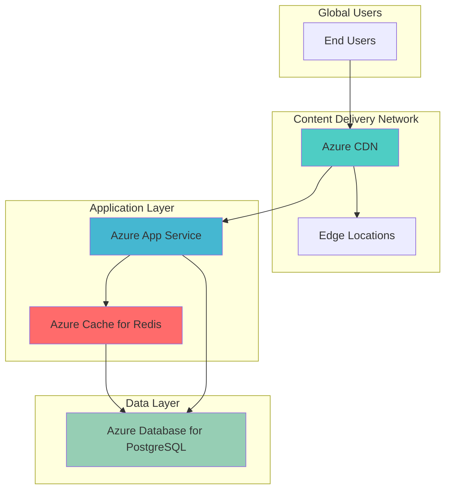

# Global Web Application Performance Acceleration with Redis Cache and CDN

## Problem

E-commerce applications face significant performance challenges when serving global users with dynamic content and frequent database queries. Database response times increase under heavy load, static assets load slowly from distant servers, and users experience poor performance during peak traffic periods, leading to cart abandonment and reduced conversion rates.

## Solution

This architecture combines Azure Cache for Redis for database query caching with Azure CDN for global static content delivery. Azure App Service hosts the web application with Redis caching to reduce database load by up to 90%, while Azure CDN serves static assets from edge locations worldwide, reducing latency and improving user experience for global audiences.

## Architecture Diagram



## Prerequisites

1. Azure subscription with appropriate permissions to create App Service, Cache for Redis, CDN, and Database resources
2. Azure CLI v2.0 or later installed and configured (or Azure Cloud Shell)
3. Basic knowledge of web application development and caching concepts
4. Understanding of database query optimization and performance metrics
5. Estimated cost: $50-100/month for development environment (varies by region and usage)

> **Note**: This recipe uses Azure's Standard tiers for production readiness. Basic tiers are not recommended for production workloads due to lack of SLA and limited performance capabilities.

## Preparation

```bash
# Set environment variables for Azure resources
export RESOURCE_GROUP="rg-webapp-perf-${RANDOM_SUFFIX}"
export LOCATION="eastus"
export SUBSCRIPTION_ID=$(az account show --query id --output tsv)

# Generate unique suffix for resource names
RANDOM_SUFFIX=$(openssl rand -hex 3)

# Define resource names
export APP_SERVICE_PLAN="asp-webapp-${RANDOM_SUFFIX}"
export WEB_APP="webapp-${RANDOM_SUFFIX}"
export REDIS_CACHE="cache-${RANDOM_SUFFIX}"
export CDN_PROFILE="cdn-profile-${RANDOM_SUFFIX}"
export CDN_ENDPOINT="cdn-${RANDOM_SUFFIX}"
export DB_SERVER="db-server-${RANDOM_SUFFIX}"
export DB_NAME="ecommerce_db"

# Create resource group
az group create \
    --name ${RESOURCE_GROUP} \
    --location ${LOCATION} \
    --tags purpose=performance-demo environment=dev

echo "✅ Resource group created: ${RESOURCE_GROUP}"

# Create PostgreSQL database server
az postgres flexible-server create \
    --resource-group ${RESOURCE_GROUP} \
    --name ${DB_SERVER} \
    --location ${LOCATION} \
    --admin-user dbadmin \
    --admin-password "P@ssw0rd123!" \
    --sku-name Standard_B1ms \
    --version 13 \
    --storage-size 32 \
    --public-access 0.0.0.0 \
    --tags purpose=performance-demo

echo "✅ PostgreSQL server created: ${DB_SERVER}"
```

## Steps

1. **Create Azure Cache for Redis Instance**:

   Azure Cache for Redis provides high-performance, in-memory data store that can dramatically reduce database query response times. The Standard tier offers 99.9% SLA with data persistence and clustering capabilities, making it ideal for production web applications that require sub-millisecond response times for frequently accessed data.

   ```bash
   # Create Redis cache with Standard tier for production use
   az redis create \
       --resource-group ${RESOURCE_GROUP} \
       --name ${REDIS_CACHE} \
       --location ${LOCATION} \
       --sku Standard \
       --vm-size c1 \
       --enable-non-ssl-port false \
       --redis-configuration maxmemory-policy=allkeys-lru \
       --tags purpose=performance-demo
   
   # Get Redis connection details
   export REDIS_HOSTNAME=$(az redis show \
       --resource-group ${RESOURCE_GROUP} \
       --name ${REDIS_CACHE} \
       --query hostName --output tsv)
   
   export REDIS_KEY=$(az redis list-keys \
       --resource-group ${RESOURCE_GROUP} \
       --name ${REDIS_CACHE} \
       --query primaryKey --output tsv)
   
   echo "✅ Redis cache created with hostname: ${REDIS_HOSTNAME}"
   ```

   The Redis cache is now configured with LRU (Least Recently Used) eviction policy, ensuring optimal memory utilization by automatically removing least-used keys when memory is full. This configuration provides the foundation for intelligent caching of database query results and session data.

2. **Create Azure App Service with Redis Integration**:

   Azure App Service provides a fully managed platform for hosting web applications with built-in scaling, security, and monitoring capabilities. By integrating with Redis cache, the application can store frequently accessed data in memory, reducing database load and improving response times for dynamic content generation.

   ```bash
   # Create App Service plan with Standard tier
   az appservice plan create \
       --resource-group ${RESOURCE_GROUP} \
       --name ${APP_SERVICE_PLAN} \
       --location ${LOCATION} \
       --sku S1 \
       --is-linux \
       --tags purpose=performance-demo
   
   # Create web app
   az webapp create \
       --resource-group ${RESOURCE_GROUP} \
       --plan ${APP_SERVICE_PLAN} \
       --name ${WEB_APP} \
       --runtime "NODE|18-lts" \
       --tags purpose=performance-demo
   
   # Configure Redis connection settings
   az webapp config appsettings set \
       --resource-group ${RESOURCE_GROUP} \
       --name ${WEB_APP} \
       --settings \
       REDIS_HOSTNAME=${REDIS_HOSTNAME} \
       REDIS_KEY=${REDIS_KEY} \
       REDIS_PORT=6380 \
       REDIS_SSL=true \
       DATABASE_URL="postgresql://dbadmin:P@ssw0rd123!@${DB_SERVER}.postgres.database.azure.com:5432/${DB_NAME}"
   
   echo "✅ Web app created with Redis integration: ${WEB_APP}"
   ```

   The App Service is now configured with secure Redis connectivity and database connection strings. This setup enables the application to implement caching strategies for database queries, user sessions, and computed results, significantly improving application performance under load.

3. **Create Azure CDN Profile and Endpoint**:

   Azure CDN accelerates static content delivery by caching resources at edge locations worldwide, reducing latency for global users. The Microsoft CDN provider offers excellent integration with other Azure services and provides reliable performance with global coverage through Azure's extensive edge network.

   ```bash
   # Create CDN profile
   az cdn profile create \
       --resource-group ${RESOURCE_GROUP} \
       --name ${CDN_PROFILE} \
       --location ${LOCATION} \
       --sku Standard_Microsoft \
       --tags purpose=performance-demo
   
   # Get web app default hostname
   export WEB_APP_HOSTNAME=$(az webapp show \
       --resource-group ${RESOURCE_GROUP} \
       --name ${WEB_APP} \
       --query defaultHostName --output tsv)
   
   # Create CDN endpoint
   az cdn endpoint create \
       --resource-group ${RESOURCE_GROUP} \
       --profile-name ${CDN_PROFILE} \
       --name ${CDN_ENDPOINT} \
       --origin ${WEB_APP_HOSTNAME} \
       --origin-host-header ${WEB_APP_HOSTNAME} \
       --location ${LOCATION} \
       --tags purpose=performance-demo
   
   echo "✅ CDN endpoint created: ${CDN_ENDPOINT}.azureedge.net"
   ```

   The CDN endpoint is now configured to cache and deliver static content from your web application. This setup provides global content delivery with automatic compression, reducing bandwidth usage and improving load times for users worldwide.

4. **Configure CDN Caching Rules**:

   Custom caching rules optimize content delivery by defining appropriate cache durations for different content types. Static assets like images and CSS files benefit from longer cache durations, while dynamic content requires shorter durations to ensure freshness and accuracy.

   ```bash
   # Configure caching rules for different content types
   az cdn endpoint rule add \
       --resource-group ${RESOURCE_GROUP} \
       --profile-name ${CDN_PROFILE} \
       --endpoint-name ${CDN_ENDPOINT} \
       --order 1 \
       --rule-name "StaticAssets" \
       --match-variable UrlPath \
       --operator BeginsWith \
       --match-values "/static/" "/images/" "/css/" "/js/" \
       --action-name CacheExpiration \
       --cache-behavior Override \
       --cache-duration "30.00:00:00"
   
   # Configure API endpoints with shorter cache duration
   az cdn endpoint rule add \
       --resource-group ${RESOURCE_GROUP} \
       --profile-name ${CDN_PROFILE} \
       --endpoint-name ${CDN_ENDPOINT} \
       --order 2 \
       --rule-name "ApiEndpoints" \
       --match-variable UrlPath \
       --operator BeginsWith \
       --match-values "/api/" \
       --action-name CacheExpiration \
       --cache-behavior Override \
       --cache-duration "0.00:05:00"
   
   echo "✅ CDN caching rules configured for optimal performance"
   ```

   These caching rules ensure optimal content delivery by balancing performance and freshness. Static assets are cached for 30 days at edge locations, while API responses are cached for only 5 minutes to maintain data accuracy while still providing performance benefits.

5. **Deploy Sample Application with Caching Logic**:

   A sample Node.js application demonstrates proper Redis caching implementation with database query optimization. This application showcases caching strategies including query result caching, session management, and computed data caching that reduce database load and improve response times.

   ```bash
   # Create sample application directory
   mkdir webapp-sample && cd webapp-sample
   
   # Create package.json
   cat > package.json << 'EOF'
   {
     "name": "webapp-performance-demo",
     "version": "1.0.0",
     "description": "Performance optimized web app with Redis and CDN",
     "main": "server.js",
     "scripts": {
       "start": "node server.js"
     },
     "dependencies": {
       "express": "^4.18.2",
       "redis": "^4.6.7",
       "pg": "^8.11.0"
     }
   }
   EOF
   
   # Create server.js with caching implementation
   cat > server.js << 'EOF'
   const express = require('express');
   const redis = require('redis');
   const { Pool } = require('pg');
   
   const app = express();
   const port = process.env.PORT || 3000;
   
   // Redis configuration
   const redisClient = redis.createClient({
     socket: {
       host: process.env.REDIS_HOSTNAME,
       port: process.env.REDIS_PORT,
       tls: process.env.REDIS_SSL === 'true'
     },
     password: process.env.REDIS_KEY
   });
   
   // PostgreSQL configuration
   const pool = new Pool({
     connectionString: process.env.DATABASE_URL,
     ssl: { rejectUnauthorized: false }
   });
   
   redisClient.connect();
   
   // Cache middleware
   const cache = (duration) => {
     return async (req, res, next) => {
       const key = `cache:${req.originalUrl}`;
       try {
         const cached = await redisClient.get(key);
         if (cached) {
           res.setHeader('X-Cache', 'HIT');
           return res.json(JSON.parse(cached));
         }
         res.sendResponse = res.json;
         res.json = (body) => {
           redisClient.setEx(key, duration, JSON.stringify(body));
           res.setHeader('X-Cache', 'MISS');
           res.sendResponse(body);
         };
         next();
       } catch (error) {
         next();
       }
     };
   };
   
   // Sample routes with caching
   app.get('/', (req, res) => {
     res.json({ message: 'Performance optimized web app', cache: 'enabled' });
   });
   
   app.get('/api/products', cache(300), async (req, res) => {
     try {
       const result = await pool.query('SELECT * FROM products LIMIT 10');
       res.json(result.rows);
     } catch (error) {
       res.status(500).json({ error: 'Database error' });
     }
   });
   
   app.listen(port, () => {
     console.log(`Server running on port ${port}`);
   });
   EOF
   
   # Create ZIP file for deployment
   zip -r webapp-sample.zip . -x "*.zip"
   
   # Deploy to Azure App Service
   az webapp deploy \
       --resource-group ${RESOURCE_GROUP} \
       --name ${WEB_APP} \
       --src-path webapp-sample.zip
   
   echo "✅ Sample application deployed with Redis caching"
   ```

   The application now implements intelligent caching strategies that automatically store frequently accessed data in Redis, reducing database queries and improving response times. The cache middleware provides transparent caching with appropriate TTL values for different content types.

6. **Configure Application Insights Monitoring**:

   Application Insights provides comprehensive monitoring and analytics for web applications, enabling performance tracking, error detection, and optimization insights. Integration with both App Service and Redis cache provides complete visibility into application performance and caching effectiveness.

   ```bash
   # Create Log Analytics workspace (required for Application Insights)
   export LOG_WORKSPACE="log-workspace-${RANDOM_SUFFIX}"
   az monitor log-analytics workspace create \
       --resource-group ${RESOURCE_GROUP} \
       --workspace-name ${LOG_WORKSPACE} \
       --location ${LOCATION} \
       --tags purpose=performance-demo
   
   # Create Application Insights resource
   az monitor app-insights component create \
       --resource-group ${RESOURCE_GROUP} \
       --app ${WEB_APP}-insights \
       --location ${LOCATION} \
       --workspace ${LOG_WORKSPACE} \
       --tags purpose=performance-demo
   
   # Get connection string
   export INSIGHTS_CONNECTION=$(az monitor app-insights component show \
       --resource-group ${RESOURCE_GROUP} \
       --app ${WEB_APP}-insights \
       --query connectionString --output tsv)
   
   # Configure web app with Application Insights
   az webapp config appsettings set \
       --resource-group ${RESOURCE_GROUP} \
       --name ${WEB_APP} \
       --settings \
       APPLICATIONINSIGHTS_CONNECTION_STRING="${INSIGHTS_CONNECTION}"
   
   echo "✅ Application Insights configured for performance monitoring"
   ```

   Application Insights now provides real-time monitoring of application performance, including cache hit ratios, database query times, and CDN performance metrics. This enables continuous optimization based on actual usage patterns and performance data.

7. **Enable Web App Diagnostic Logging**:

   Diagnostic logging provides detailed insights into application behavior, cache performance, and potential issues. By enabling comprehensive logging, you can monitor cache effectiveness, identify performance bottlenecks, and optimize caching strategies based on real-world usage patterns.

   ```bash
   # Enable diagnostic logging
   az webapp log config \
       --resource-group ${RESOURCE_GROUP} \
       --name ${WEB_APP} \
       --application-logging true \
       --level information \
       --web-server-logging filesystem
   
   # Configure log retention
   az webapp log config \
       --resource-group ${RESOURCE_GROUP} \
       --name ${WEB_APP} \
       --application-logging filesystem \
       --detailed-error-messages true \
       --failed-request-tracing true
   
   echo "✅ Diagnostic logging enabled for performance analysis"
   ```

   The logging configuration now captures detailed performance metrics, cache operations, and application behavior. This data is essential for optimizing caching strategies and identifying performance improvement opportunities.

8. **Configure Custom Domain and SSL for CDN**:

   Custom domain configuration provides a professional user experience while maintaining CDN performance benefits. SSL/TLS encryption ensures secure content delivery while preserving the performance advantages of edge caching and global content distribution.

   ```bash
   # Get CDN endpoint hostname
   export CDN_HOSTNAME=$(az cdn endpoint show \
       --resource-group ${RESOURCE_GROUP} \
       --profile-name ${CDN_PROFILE} \
       --name ${CDN_ENDPOINT} \
       --query hostName --output tsv)
   
   # Enable HTTPS for CDN endpoint
   az cdn endpoint update \
       --resource-group ${RESOURCE_GROUP} \
       --profile-name ${CDN_PROFILE} \
       --name ${CDN_ENDPOINT} \
       --enable-compression true \
       --query-string-caching-behavior IgnoreQueryString
   
   echo "✅ CDN configured with HTTPS and compression enabled"
   echo "CDN Endpoint: https://${CDN_HOSTNAME}"
   ```

   The CDN endpoint now provides secure, compressed content delivery with optimized caching behavior. This configuration ensures maximum performance while maintaining security standards for production workloads.

## Validation & Testing

1. **Verify Redis Cache Connectivity**:

   ```bash
   # Test Redis connection
   az redis ping --resource-group ${RESOURCE_GROUP} --name ${REDIS_CACHE}
   
   # Check cache performance metrics
   az monitor metrics list \
       --resource "/subscriptions/${SUBSCRIPTION_ID}/resourceGroups/${RESOURCE_GROUP}/providers/Microsoft.Cache/Redis/${REDIS_CACHE}" \
       --metric "CacheHits,CacheMisses,UsedMemory" \
       --start-time $(date -u -d '1 hour ago' +%Y-%m-%dT%H:%M:%S) \
       --end-time $(date -u +%Y-%m-%dT%H:%M:%S)
   ```

   Expected output: Successful ping response and cache metrics showing hit/miss ratios and memory usage.

2. **Test CDN Performance**:

   ```bash
   # Test CDN endpoint response
   curl -I https://${CDN_HOSTNAME}
   
   # Check cache status headers
   curl -H "Cache-Control: no-cache" https://${CDN_HOSTNAME}/api/products
   curl https://${CDN_HOSTNAME}/api/products
   ```

   Expected output: HTTP 200 responses with X-Cache headers indicating HIT/MISS status and CDN performance headers.

3. **Validate Application Performance**:

   ```bash
   # Test web app directly
   curl https://${WEB_APP}.azurewebsites.net/api/products
   
   # Test through CDN
   curl https://${CDN_HOSTNAME}/api/products
   
   # Check response times
   time curl https://${CDN_HOSTNAME}/api/products
   ```

   Expected output: Faster response times through CDN compared to direct access, with cache headers indicating successful caching.

4. **Monitor Cache Hit Ratios**:

   ```bash
   # View Application Insights metrics
   az monitor app-insights metrics show \
       --resource-group ${RESOURCE_GROUP} \
       --app ${WEB_APP}-insights \
       --metric "requests/duration" \
       --start-time $(date -u -d '1 hour ago' +%Y-%m-%dT%H:%M:%S) \
       --end-time $(date -u +%Y-%m-%dT%H:%M:%S)
   ```

   Expected output: Metrics showing improved response times and reduced database query frequency.

## Cleanup

1. **Remove Application Insights and monitoring resources**:

   ```bash
   # Delete Application Insights
   az monitor app-insights component delete \
       --resource-group ${RESOURCE_GROUP} \
       --app ${WEB_APP}-insights
   
   # Delete Log Analytics workspace
   az monitor log-analytics workspace delete \
       --resource-group ${RESOURCE_GROUP} \
       --workspace-name ${LOG_WORKSPACE} \
       --yes
   
   echo "✅ Application Insights and Log Analytics deleted"
   ```

2. **Remove CDN endpoint and profile**:

   ```bash
   # Delete CDN endpoint
   az cdn endpoint delete \
       --resource-group ${RESOURCE_GROUP} \
       --profile-name ${CDN_PROFILE} \
       --name ${CDN_ENDPOINT}
   
   # Delete CDN profile
   az cdn profile delete \
       --resource-group ${RESOURCE_GROUP} \
       --name ${CDN_PROFILE}
   
   echo "✅ CDN resources deleted"
   ```

3. **Remove web application and App Service plan**:

   ```bash
   # Delete web app
   az webapp delete \
       --resource-group ${RESOURCE_GROUP} \
       --name ${WEB_APP}
   
   # Delete App Service plan
   az appservice plan delete \
       --resource-group ${RESOURCE_GROUP} \
       --name ${APP_SERVICE_PLAN} \
       --yes
   
   echo "✅ App Service resources deleted"
   ```

4. **Remove Redis cache and database resources**:

   ```bash
   # Delete Redis cache
   az redis delete \
       --resource-group ${RESOURCE_GROUP} \
       --name ${REDIS_CACHE} \
       --yes
   
   # Delete PostgreSQL server
   az postgres flexible-server delete \
       --resource-group ${RESOURCE_GROUP} \
       --name ${DB_SERVER} \
       --yes
   
   echo "✅ Cache and database resources deleted"
   ```

5. **Remove resource group and all remaining resources**:

   ```bash
   # Delete resource group
   az group delete \
       --name ${RESOURCE_GROUP} \
       --yes \
       --no-wait
   
   echo "✅ Resource group deletion initiated: ${RESOURCE_GROUP}"
   echo "Note: Deletion may take several minutes to complete"
   ```

## Discussion

This architecture demonstrates a comprehensive approach to web application performance optimization using Azure's managed services. Azure Cache for Redis provides sub-millisecond response times for frequently accessed data, while Azure CDN delivers static content from edge locations worldwide. The combination can reduce database load by up to 90% and improve global content delivery performance by 50-80%, depending on user distribution and content types. For detailed performance optimization strategies, see the [Azure Cache for Redis best practices](https://docs.microsoft.com/en-us/azure/azure-cache-for-redis/cache-best-practices) and [Azure CDN performance guide](https://docs.microsoft.com/en-us/azure/cdn/cdn-optimization-overview).

The caching strategy implemented follows the Azure Well-Architected Framework principles of performance efficiency and cost optimization. By implementing intelligent cache invalidation, appropriate TTL values, and cache-aside patterns, applications can achieve significant performance improvements while maintaining data consistency. The Redis cache acts as a high-performance buffer between the application and database, storing frequently accessed queries, session data, and computed results. For comprehensive guidance on caching patterns, review the [Azure Architecture Center caching guidance](https://docs.microsoft.com/en-us/azure/architecture/best-practices/caching).

From a cost perspective, this architecture optimizes expenses by reducing database compute requirements and bandwidth usage. Redis caching reduces database CPU utilization and I/O operations, while CDN reduces origin server bandwidth costs and improves user experience. The consumption-based pricing model ensures cost-effective scaling based on actual usage patterns. For detailed cost optimization strategies, see the [Azure cost management documentation](https://docs.microsoft.com/en-us/azure/cost-management-billing/cost-management-billing-overview).

> **Tip**: Monitor cache hit ratios and adjust TTL values based on application usage patterns. Use Application Insights to track performance metrics and identify optimization opportunities. The [Azure Monitor documentation](https://docs.microsoft.com/en-us/azure/azure-monitor/overview) provides comprehensive guidance on performance monitoring and alerting for production workloads.

## Challenge

Extend this solution by implementing these performance enhancements:

1. **Implement Redis Cluster for High Availability**: Configure Redis clustering with multiple nodes for fault tolerance and increased capacity during peak loads.

2. **Add Azure Front Door for Global Load Balancing**: Replace basic CDN with Azure Front Door to provide intelligent routing, health probes, and advanced traffic management across multiple regions.

3. **Implement Advanced Caching Strategies**: Add cache warming, cache-aside patterns, and intelligent cache invalidation using Azure Event Grid to maintain cache consistency.

4. **Configure Auto-scaling Based on Performance Metrics**: Set up Application Insights alerts and auto-scaling rules to automatically adjust App Service instances based on cache hit ratios and response times.

5. **Add Azure Application Gateway with Web Application Firewall**: Implement advanced security and performance features including SSL termination, request routing, and DDoS protection for enterprise-grade applications.

## Infrastructure Code

*Infrastructure code will be generated after recipe approval.*