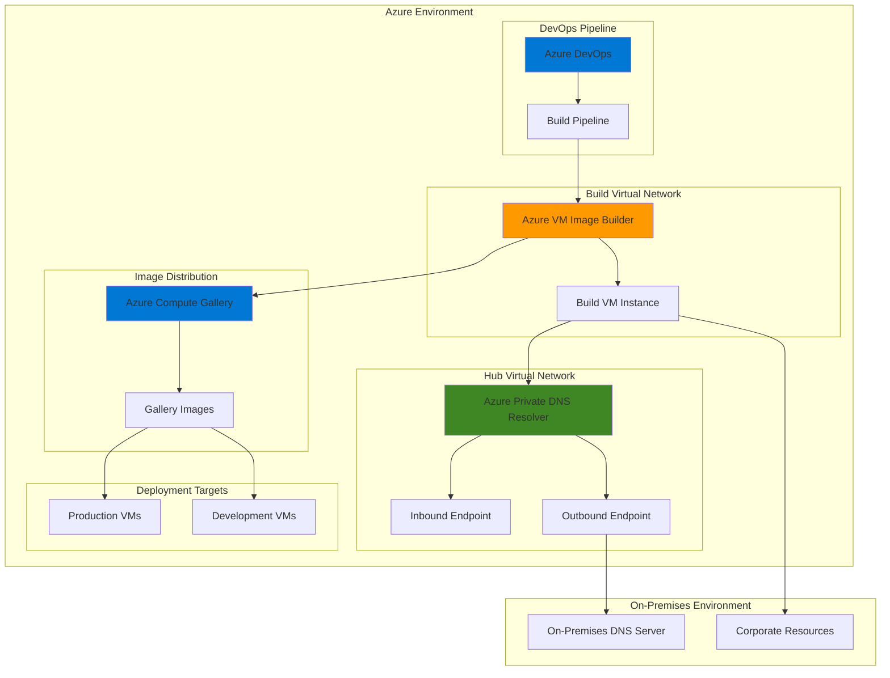

# Golden Image Automation with CI/CD Pipelines

## Problem

Organizations struggle with maintaining consistent, secure, and compliant virtual machine images across hybrid cloud environments. Traditional manual image creation processes are time-consuming, error-prone, and lack standardization. IT teams need to ensure virtual machines deployed in different environments maintain the same security baselines, software configurations, and compliance requirements. Without automated golden image pipelines, organizations face inconsistent deployments, security vulnerabilities, and operational overhead in managing image lifecycle across on-premises and cloud environments.

## Solution

Azure VM Image Builder combined with Azure Private DNS Resolver provides an automated, repeatable pipeline for creating standardized virtual machine images. This solution enables organizations to define infrastructure as code for image creation, integrate with existing CI/CD pipelines, and ensure consistent DNS resolution across hybrid environments. The automated pipeline builds golden images with embedded security configurations, compliance settings, and required software, while Private DNS Resolver ensures seamless connectivity to on-premises resources during the build process.

## Architecture Diagram



## Prerequisites

1. Azure subscription with appropriate permissions for VM Image Builder and Private DNS Resolver
2. Azure CLI v2.50.0 or later installed and configured
3. Azure DevOps organization with project administrator permissions
4. Existing virtual network infrastructure with connectivity to on-premises resources
5. On-premises DNS server with corporate domain resolution capabilities
6. Estimated cost: $50-100 for resources created during this tutorial

> **Note**: VM Image Builder requires specific Azure resource provider registrations and service principal permissions. Review the [VM Image Builder documentation](https://docs.microsoft.com/azure/virtual-machines/image-builder-overview) for detailed permission requirements.

## Preparation

```bash
# Set environment variables for Azure resources
export RESOURCE_GROUP="rg-golden-image-${RANDOM_SUFFIX}"
export LOCATION="eastus"
export SUBSCRIPTION_ID=$(az account show --query id --output tsv)

# Generate unique suffix for resource names
RANDOM_SUFFIX=$(openssl rand -hex 3)

# Define resource names
export HUB_VNET_NAME="vnet-hub-${RANDOM_SUFFIX}"
export BUILD_VNET_NAME="vnet-build-${RANDOM_SUFFIX}"
export PRIVATE_DNS_RESOLVER_NAME="pdns-resolver-${RANDOM_SUFFIX}"
export COMPUTE_GALLERY_NAME="gallery${RANDOM_SUFFIX}"
export IMAGE_TEMPLATE_NAME="template-ubuntu-${RANDOM_SUFFIX}"
export MANAGED_IDENTITY_NAME="id-image-builder-${RANDOM_SUFFIX}"

# Create resource group
az group create \
    --name ${RESOURCE_GROUP} \
    --location ${LOCATION} \
    --tags purpose=golden-image-pipeline environment=demo

# Register required resource providers
az provider register --namespace Microsoft.VirtualMachineImages --wait
az provider register --namespace Microsoft.Network --wait
az provider register --namespace Microsoft.Compute --wait

echo "✅ Resource group created: ${RESOURCE_GROUP}"
echo "✅ Resource providers registered successfully"
```

## Steps

1. **Create Hub Virtual Network and Private DNS Resolver**:

   Azure Private DNS Resolver acts as a bridge between Azure and on-premises DNS infrastructure, enabling seamless name resolution during the image building process. This hybrid DNS solution eliminates the need for custom DNS forwarder VMs while providing secure, managed DNS resolution for corporate resources accessed during image customization.

   ```bash
   # Create hub virtual network for DNS resolver
   az network vnet create \
       --name ${HUB_VNET_NAME} \
       --resource-group ${RESOURCE_GROUP} \
       --address-prefixes 10.0.0.0/16 \
       --subnet-name resolver-inbound-subnet \
       --subnet-prefixes 10.0.1.0/24
   
   # Create outbound subnet for DNS resolver
   az network vnet subnet create \
       --name resolver-outbound-subnet \
       --resource-group ${RESOURCE_GROUP} \
       --vnet-name ${HUB_VNET_NAME} \
       --address-prefixes 10.0.2.0/24
   
   # Create Azure Private DNS Resolver
   az dns-resolver create \
       --name ${PRIVATE_DNS_RESOLVER_NAME} \
       --resource-group ${RESOURCE_GROUP} \
       --vnet ${HUB_VNET_NAME} \
       --location ${LOCATION}
   
   echo "✅ Hub virtual network and Private DNS Resolver created"
   ```

   The Private DNS Resolver is now configured as the centralized DNS resolution point for the hub network. This foundational component enables bidirectional DNS resolution between Azure resources and on-premises infrastructure, ensuring that build processes can access corporate resources during image customization while maintaining network security boundaries.

2. **Configure DNS Resolver Endpoints**:

   DNS resolver endpoints define the ingress and egress points for DNS traffic between Azure and on-premises networks. The inbound endpoint allows on-premises resources to resolve Azure private DNS zones, while the outbound endpoint enables Azure resources to query on-premises DNS servers for corporate domain resolution.

   ```bash
   # Create inbound endpoint for on-premises to Azure DNS resolution
   az dns-resolver inbound-endpoint create \
       --name "inbound-endpoint" \
       --dns-resolver-name ${PRIVATE_DNS_RESOLVER_NAME} \
       --resource-group ${RESOURCE_GROUP} \
       --subnet-id $(az network vnet subnet show \
           --name resolver-inbound-subnet \
           --vnet-name ${HUB_VNET_NAME} \
           --resource-group ${RESOURCE_GROUP} \
           --query id --output tsv)
   
   # Create outbound endpoint for Azure to on-premises DNS resolution
   az dns-resolver outbound-endpoint create \
       --name "outbound-endpoint" \
       --dns-resolver-name ${PRIVATE_DNS_RESOLVER_NAME} \
       --resource-group ${RESOURCE_GROUP} \
       --subnet-id $(az network vnet subnet show \
           --name resolver-outbound-subnet \
           --vnet-name ${HUB_VNET_NAME} \
           --resource-group ${RESOURCE_GROUP} \
           --query id --output tsv)
   
   # Create DNS forwarding ruleset for on-premises domains
   az dns-resolver forwarding-ruleset create \
       --name "corporate-ruleset" \
       --resource-group ${RESOURCE_GROUP} \
       --outbound-endpoints $(az dns-resolver outbound-endpoint show \
           --name "outbound-endpoint" \
           --dns-resolver-name ${PRIVATE_DNS_RESOLVER_NAME} \
           --resource-group ${RESOURCE_GROUP} \
           --query id --output tsv)
   
   echo "✅ DNS resolver endpoints configured successfully"
   ```

   The DNS resolver endpoints establish the network connectivity required for hybrid DNS resolution. These endpoints now enable Azure VM Image Builder to resolve corporate domain names during the image building process, allowing access to internal software repositories, license servers, and configuration management systems.

3. **Create Build Virtual Network with DNS Integration**:

   The build virtual network provides an isolated environment for VM Image Builder operations while maintaining connectivity to corporate resources through the Private DNS Resolver. This network design ensures secure image building with access to necessary on-premises resources without exposing build infrastructure to external networks.

   ```bash
   # Create build virtual network for VM Image Builder
   az network vnet create \
       --name ${BUILD_VNET_NAME} \
       --resource-group ${RESOURCE_GROUP} \
       --address-prefixes 10.1.0.0/16 \
       --subnet-name build-subnet \
       --subnet-prefixes 10.1.1.0/24
   
   # Create virtual network peering from build to hub
   az network vnet peering create \
       --name "build-to-hub" \
       --resource-group ${RESOURCE_GROUP} \
       --vnet-name ${BUILD_VNET_NAME} \
       --remote-vnet ${HUB_VNET_NAME} \
       --allow-vnet-access
   
   # Create virtual network peering from hub to build
   az network vnet peering create \
       --name "hub-to-build" \
       --resource-group ${RESOURCE_GROUP} \
       --vnet-name ${HUB_VNET_NAME} \
       --remote-vnet ${BUILD_VNET_NAME} \
       --allow-vnet-access
   
   # Link DNS forwarding ruleset to build virtual network
   az dns-resolver forwarding-ruleset virtual-network-link create \
       --name "build-vnet-link" \
       --resource-group ${RESOURCE_GROUP} \
       --ruleset-name "corporate-ruleset" \
       --virtual-network-id $(az network vnet show \
           --name ${BUILD_VNET_NAME} \
           --resource-group ${RESOURCE_GROUP} \
           --query id --output tsv)
   
   echo "✅ Build virtual network created and linked to DNS resolver"
   ```

   The build virtual network is now configured with hybrid DNS resolution capabilities through the Private DNS Resolver. This setup enables VM Image Builder to access both Azure resources and on-premises corporate resources during the image building process, maintaining network isolation while providing necessary connectivity for comprehensive image customization.

4. **Create Azure Compute Gallery for Image Distribution**:

   Azure Compute Gallery provides centralized image management, versioning, and global distribution capabilities for golden images. This service enables organizations to maintain image lifecycle management, implement approval workflows, and distribute standardized images across multiple Azure regions for consistent deployment experiences.

   ```bash
   # Create Azure Compute Gallery for image distribution
   az sig create \
       --gallery-name ${COMPUTE_GALLERY_NAME} \
       --resource-group ${RESOURCE_GROUP} \
       --description "Corporate Golden Image Gallery" \
       --tags environment=production purpose=golden-images
   
   # Create image definition for Ubuntu server
   az sig image-definition create \
       --gallery-name ${COMPUTE_GALLERY_NAME} \
       --resource-group ${RESOURCE_GROUP} \
       --gallery-image-definition "ubuntu-server-hardened" \
       --publisher "CorporateIT" \
       --offer "UbuntuServer" \
       --sku "20.04-LTS-Hardened" \
       --os-type Linux \
       --os-state generalized \
       --description "Corporate hardened Ubuntu 20.04 LTS server image"
   
   # Create managed identity for VM Image Builder
   az identity create \
       --name ${MANAGED_IDENTITY_NAME} \
       --resource-group ${RESOURCE_GROUP}
   
   # Get managed identity details
   IDENTITY_ID=$(az identity show \
       --name ${MANAGED_IDENTITY_NAME} \
       --resource-group ${RESOURCE_GROUP} \
       --query id --output tsv)
   
   IDENTITY_PRINCIPAL_ID=$(az identity show \
       --name ${MANAGED_IDENTITY_NAME} \
       --resource-group ${RESOURCE_GROUP} \
       --query principalId --output tsv)
   
   echo "✅ Compute Gallery and managed identity created"
   ```

   The Azure Compute Gallery is now ready to host and distribute golden images across the organization. The managed identity provides VM Image Builder with the necessary permissions to create and manage images while maintaining security best practices through Azure RBAC and managed identities.

5. **Configure VM Image Builder Permissions**:

   VM Image Builder requires specific permissions to create images, access source images, and distribute results to the Compute Gallery. These permissions must be carefully configured to follow the principle of least privilege while enabling the service to perform its required functions across resource groups and subscriptions.

   ```bash
   # Assign required permissions to managed identity
   az role assignment create \
       --assignee ${IDENTITY_PRINCIPAL_ID} \
       --role "Virtual Machine Contributor" \
       --scope "/subscriptions/${SUBSCRIPTION_ID}/resourceGroups/${RESOURCE_GROUP}"
   
   az role assignment create \
       --assignee ${IDENTITY_PRINCIPAL_ID} \
       --role "Storage Account Contributor" \
       --scope "/subscriptions/${SUBSCRIPTION_ID}/resourceGroups/${RESOURCE_GROUP}"
   
   az role assignment create \
       --assignee ${IDENTITY_PRINCIPAL_ID} \
       --role "Network Contributor" \
       --scope "/subscriptions/${SUBSCRIPTION_ID}/resourceGroups/${RESOURCE_GROUP}"
   
   # Create custom role for Compute Gallery access
   cat > image-builder-role.json << EOF
{
    "Name": "Image Builder Gallery Role",
    "IsCustom": true,
    "Description": "Custom role for VM Image Builder to access Compute Gallery",
    "Actions": [
        "Microsoft.Compute/galleries/read",
        "Microsoft.Compute/galleries/images/read",
        "Microsoft.Compute/galleries/images/versions/read",
        "Microsoft.Compute/galleries/images/versions/write",
        "Microsoft.Compute/images/read",
        "Microsoft.Compute/images/write",
        "Microsoft.Compute/images/delete"
    ],
    "NotActions": [],
    "AssignableScopes": ["/subscriptions/${SUBSCRIPTION_ID}"]
}
EOF
   
   # Create and assign custom role
   az role definition create --role-definition image-builder-role.json
   
   az role assignment create \
       --assignee ${IDENTITY_PRINCIPAL_ID} \
       --role "Image Builder Gallery Role" \
       --scope "/subscriptions/${SUBSCRIPTION_ID}/resourceGroups/${RESOURCE_GROUP}"
   
   echo "✅ VM Image Builder permissions configured"
   ```

   The managed identity now has the appropriate permissions to create images, access the Compute Gallery, and manage required Azure resources. This RBAC configuration ensures VM Image Builder can perform its functions while maintaining security boundaries and following Azure security best practices.

6. **Create VM Image Builder Template**:

   VM Image Builder templates define the complete image creation process, including source images, customization steps, and distribution targets. Templates enable infrastructure as code practices for image creation and provide repeatability and version control for golden image definitions.

   ```bash
   # Create VM Image Builder template configuration
   cat > image-template.json << EOF
{
    "type": "Microsoft.VirtualMachineImages/imageTemplates",
    "apiVersion": "2022-02-14",
    "location": "${LOCATION}",
    "dependsOn": [],
    "tags": {
        "purpose": "golden-image",
        "environment": "production"
    },
    "identity": {
        "type": "UserAssigned",
        "userAssignedIdentities": {
            "${IDENTITY_ID}": {}
        }
    },
    "properties": {
        "buildTimeoutInMinutes": 80,
        "vmProfile": {
            "vmSize": "Standard_D2s_v3",
            "osDiskSizeGB": 30,
            "vnetConfig": {
                "subnetId": "$(az network vnet subnet show --name build-subnet --vnet-name ${BUILD_VNET_NAME} --resource-group ${RESOURCE_GROUP} --query id --output tsv)"
            }
        },
        "source": {
            "type": "PlatformImage",
            "publisher": "Canonical",
            "offer": "0001-com-ubuntu-server-focal",
            "sku": "20_04-lts-gen2",
            "version": "latest"
        },
        "customize": [
            {
                "type": "Shell",
                "name": "UpdateSystem",
                "inline": [
                    "sudo apt-get update -y",
                    "sudo apt-get upgrade -y",
                    "sudo apt-get install -y curl wget unzip"
                ]
            },
            {
                "type": "Shell",
                "name": "InstallSecurity",
                "inline": [
                    "sudo apt-get install -y fail2ban ufw",
                    "sudo ufw --force enable",
                    "sudo systemctl enable fail2ban",
                    "sudo systemctl start fail2ban"
                ]
            },
            {
                "type": "Shell",
                "name": "InstallMonitoring",
                "inline": [
                    "curl -sL https://aka.ms/InstallAzureCLIDeb | sudo bash",
                    "wget -q https://packages.microsoft.com/config/ubuntu/20.04/packages-microsoft-prod.deb",
                    "sudo dpkg -i packages-microsoft-prod.deb",
                    "sudo apt-get update",
                    "sudo apt-get install -y azure-cli"
                ]
            },
            {
                "type": "Shell",
                "name": "ConfigureCompliance",
                "inline": [
                    "sudo mkdir -p /etc/corporate",
                    "echo 'Golden Image Build Date: $(date)' | sudo tee /etc/corporate/build-info.txt",
                    "sudo chmod 644 /etc/corporate/build-info.txt"
                ]
            }
        ],
        "distribute": [
            {
                "type": "SharedImage",
                "galleryImageId": "/subscriptions/${SUBSCRIPTION_ID}/resourceGroups/${RESOURCE_GROUP}/providers/Microsoft.Compute/galleries/${COMPUTE_GALLERY_NAME}/images/ubuntu-server-hardened",
                "runOutputName": "ubuntu-hardened-image",
                "replicationRegions": ["${LOCATION}"],
                "storageAccountType": "Standard_LRS"
            }
        ]
    }
}
EOF
   
   # Replace subnet ID placeholder with actual value
   SUBNET_ID=$(az network vnet subnet show \
       --name build-subnet \
       --vnet-name ${BUILD_VNET_NAME} \
       --resource-group ${RESOURCE_GROUP} \
       --query id --output tsv)
   
   sed -i "s|\$(az network vnet subnet show.*tsv)|${SUBNET_ID}|g" image-template.json
   
   echo "✅ VM Image Builder template created"
   ```

   The VM Image Builder template defines a comprehensive image creation process that includes system updates, security hardening, monitoring tools installation, and compliance configuration. This template ensures consistent, repeatable image creation with corporate security standards and required software components.

7. **Deploy and Execute Image Builder Template**:

   Deploying the VM Image Builder template initiates the automated image creation process. The service creates a temporary build VM in the specified virtual network, executes the defined customization steps, and distributes the resulting image to the Compute Gallery for organizational use.

   ```bash
   # Deploy the image template
   az deployment group create \
       --resource-group ${RESOURCE_GROUP} \
       --template-file image-template.json \
       --parameters imageTemplateName=${IMAGE_TEMPLATE_NAME}
   
   # Start the image build process
   az image builder run \
       --name ${IMAGE_TEMPLATE_NAME} \
       --resource-group ${RESOURCE_GROUP}
   
   # Monitor build progress
   echo "Image build started. Monitoring progress..."
   
   # Wait for build completion (this can take 20-40 minutes)
   while true; do
       BUILD_STATUS=$(az image builder show \
           --name ${IMAGE_TEMPLATE_NAME} \
           --resource-group ${RESOURCE_GROUP} \
           --query properties.lastRunStatus.runState \
           --output tsv)
       
       echo "Build status: ${BUILD_STATUS}"
       
       if [ "${BUILD_STATUS}" == "Succeeded" ]; then
           echo "✅ Image build completed successfully"
           break
       elif [ "${BUILD_STATUS}" == "Failed" ]; then
           echo "❌ Image build failed"
           break
       fi
       
       sleep 60
   done
   ```

   The image build process is now executing, creating a golden image with the specified customizations. VM Image Builder handles the complex orchestration of creating a build VM, applying customizations, generalizing the image, and distributing it to the Compute Gallery while maintaining security and compliance requirements.

8. **Create Azure DevOps Pipeline for Automated Builds**:

   Azure DevOps integration enables automated golden image creation as part of CI/CD pipelines. This integration supports infrastructure as code practices, automated testing, and scheduled image updates to maintain security and compliance standards across the organization.

   ```bash
   # Create Azure DevOps pipeline YAML configuration
   cat > azure-pipelines.yml << EOF
trigger:
  branches:
    include:
    - main
  paths:
    include:
    - image-templates/*

pool:
  vmImage: 'ubuntu-latest'

variables:
  resourceGroup: '${RESOURCE_GROUP}'
  location: '${LOCATION}'
  imageTemplateName: '${IMAGE_TEMPLATE_NAME}'

stages:
- stage: ValidateTemplate
  displayName: 'Validate Image Template'
  jobs:
  - job: ValidateJob
    displayName: 'Validate'
    steps:
    - task: AzureCLI@2
      displayName: 'Validate Template Syntax'
      inputs:
        azureSubscription: 'Azure Service Connection'
        scriptType: 'bash'
        scriptLocation: 'inlineScript'
        inlineScript: |
          az deployment group validate \
            --resource-group \$(resourceGroup) \
            --template-file image-template.json \
            --parameters imageTemplateName=\$(imageTemplateName)

- stage: BuildImage
  displayName: 'Build Golden Image'
  dependsOn: ValidateTemplate
  condition: succeeded()
  jobs:
  - job: BuildJob
    displayName: 'Build'
    timeoutInMinutes: 120
    steps:
    - task: AzureCLI@2
      displayName: 'Deploy Image Template'
      inputs:
        azureSubscription: 'Azure Service Connection'
        scriptType: 'bash'
        scriptLocation: 'inlineScript'
        inlineScript: |
          az deployment group create \
            --resource-group \$(resourceGroup) \
            --template-file image-template.json \
            --parameters imageTemplateName=\$(imageTemplateName)

    - task: AzureCLI@2
      displayName: 'Start Image Build'
      inputs:
        azureSubscription: 'Azure Service Connection'
        scriptType: 'bash'
        scriptLocation: 'inlineScript'
        inlineScript: |
          az image builder run \
            --name \$(imageTemplateName) \
            --resource-group \$(resourceGroup)

    - task: AzureCLI@2
      displayName: 'Monitor Build Progress'
      inputs:
        azureSubscription: 'Azure Service Connection'
        scriptType: 'bash'
        scriptLocation: 'inlineScript'
        inlineScript: |
          while true; do
            BUILD_STATUS=\$(az image builder show \
              --name \$(imageTemplateName) \
              --resource-group \$(resourceGroup) \
              --query properties.lastRunStatus.runState \
              --output tsv)
            
            echo "Build status: \$BUILD_STATUS"
            
            if [ "\$BUILD_STATUS" == "Succeeded" ]; then
              echo "Image build completed successfully"
              break
            elif [ "\$BUILD_STATUS" == "Failed" ]; then
              echo "Image build failed"
              exit 1
            fi
            
            sleep 60
          done

- stage: PublishImage
  displayName: 'Publish Image Version'
  dependsOn: BuildImage
  condition: succeeded()
  jobs:
  - job: PublishJob
    displayName: 'Publish'
    steps:
    - task: AzureCLI@2
      displayName: 'Tag Image Version'
      inputs:
        azureSubscription: 'Azure Service Connection'
        scriptType: 'bash'
        scriptLocation: 'inlineScript'
        inlineScript: |
          VERSION=\$(date +%Y%m%d.%H%M%S)
          echo "Publishing image version: \$VERSION"
          # Additional tagging or metadata operations can be added here
EOF
   
   echo "✅ Azure DevOps pipeline configuration created"
   ```

   The Azure DevOps pipeline provides automated validation, building, and publishing of golden images with proper error handling and monitoring. This pipeline enables organizations to maintain consistent image creation processes, implement quality gates, and integrate image building into their broader DevOps workflows.

## Validation & Testing

1. **Verify Private DNS Resolver Configuration**:

   ```bash
   # Check Private DNS Resolver status
   az dns-resolver show \
       --name ${PRIVATE_DNS_RESOLVER_NAME} \
       --resource-group ${RESOURCE_GROUP} \
       --query "{Name:name, State:resourceState}" \
       --output table
   
   # Verify DNS endpoints
   az dns-resolver inbound-endpoint list \
       --dns-resolver-name ${PRIVATE_DNS_RESOLVER_NAME} \
       --resource-group ${RESOURCE_GROUP} \
       --query "[].{Name:name, State:provisioningState}" \
       --output table
   ```

   Expected output: DNS resolver and endpoints should show "Succeeded" provisioning state.

2. **Test Image Build Completion**:

   ```bash
   # Verify image template status
   az image builder show \
       --name ${IMAGE_TEMPLATE_NAME} \
       --resource-group ${RESOURCE_GROUP} \
       --query "{Name:name, Status:properties.lastRunStatus.runState}" \
       --output table
   
   # Check image version in Compute Gallery
   az sig image-version list \
       --gallery-name ${COMPUTE_GALLERY_NAME} \
       --gallery-image-definition "ubuntu-server-hardened" \
       --resource-group ${RESOURCE_GROUP} \
       --query "[].{Name:name, State:provisioningState}" \
       --output table
   ```

   Expected output: Image template should show "Succeeded" status and gallery should contain the new image version.

3. **Validate Golden Image Deployment**:

   ```bash
   # Deploy test VM from golden image
   LATEST_IMAGE_VERSION=$(az sig image-version list \
       --gallery-name ${COMPUTE_GALLERY_NAME} \
       --gallery-image-definition "ubuntu-server-hardened" \
       --resource-group ${RESOURCE_GROUP} \
       --query "[0].id" \
       --output tsv)
   
   # Create test VM from golden image
   az vm create \
       --name "test-vm-golden" \
       --resource-group ${RESOURCE_GROUP} \
       --image ${LATEST_IMAGE_VERSION} \
       --admin-username azureuser \
       --generate-ssh-keys \
       --size Standard_B2s \
       --vnet-name ${BUILD_VNET_NAME} \
       --subnet build-subnet
   
   echo "✅ Test VM created from golden image"
   ```

## Cleanup

1. **Remove test resources**:

   ```bash
   # Delete test VM
   az vm delete \
       --name "test-vm-golden" \
       --resource-group ${RESOURCE_GROUP} \
       --yes
   
   echo "✅ Test VM deleted"
   ```

2. **Remove VM Image Builder template**:

   ```bash
   # Delete image template
   az image builder delete \
       --name ${IMAGE_TEMPLATE_NAME} \
       --resource-group ${RESOURCE_GROUP}
   
   echo "✅ Image template deleted"
   ```

3. **Remove Azure resources**:

   ```bash
   # Delete resource group and all contained resources
   az group delete \
       --name ${RESOURCE_GROUP} \
       --yes \
       --no-wait
   
   echo "✅ Resource group deletion initiated: ${RESOURCE_GROUP}"
   echo "Note: Deletion may take several minutes to complete"
   
   # Clean up local files
   rm -f image-template.json image-builder-role.json azure-pipelines.yml
   
   echo "✅ Local configuration files cleaned up"
   ```

## Discussion

Azure VM Image Builder combined with Azure Private DNS Resolver creates a powerful foundation for automated golden image creation in hybrid cloud environments. This solution addresses the critical challenge of maintaining consistent, secure, and compliant virtual machine images across distributed infrastructure while enabling seamless integration with existing corporate DNS infrastructure. The architecture follows Azure Well-Architected Framework principles by implementing security best practices, operational excellence through automation, and cost optimization through managed services.

The integration of Private DNS Resolver eliminates the operational overhead of maintaining custom DNS forwarder virtual machines while providing secure, bidirectional DNS resolution between Azure and on-premises environments. This managed service approach reduces complexity and improves reliability compared to traditional hybrid DNS solutions. For comprehensive guidance on hybrid DNS architectures, see the [Azure Private DNS Resolver documentation](https://docs.microsoft.com/azure/dns/private-resolver-overview) and [hybrid DNS best practices](https://docs.microsoft.com/azure/dns/private-resolver-hybrid-dns).

VM Image Builder's integration with Azure Compute Gallery enables centralized image lifecycle management, versioning, and global distribution capabilities. This combination supports enterprise-scale image management with proper governance, compliance tracking, and automated distribution workflows. The service's infrastructure-as-code approach through ARM templates and Azure DevOps integration ensures repeatable, auditable image creation processes that align with modern DevOps practices.

The solution's network isolation model provides security boundaries while maintaining necessary connectivity for image customization. The build virtual network's peering relationship with the hub network containing the DNS resolver ensures that image building processes can access corporate resources without exposing build infrastructure to external networks. This architecture supports zero-trust network principles while enabling practical hybrid cloud operations.

> **Tip**: Use Azure Monitor and Log Analytics to track image build metrics and create alerts for build failures. The [VM Image Builder monitoring guide](https://docs.microsoft.com/azure/virtual-machines/image-builder-troubleshoot) provides comprehensive guidance on implementing observability for image creation pipelines.

## Challenge

Extend this solution by implementing these enhancements:

1. **Multi-Region Image Distribution**: Configure the Compute Gallery to replicate images across multiple Azure regions and implement region-specific customizations based on compliance requirements.

2. **Automated Security Scanning**: Integrate vulnerability scanning tools into the image build process using Azure Security Center or third-party security solutions to validate image compliance before distribution.

3. **Advanced DevOps Integration**: Implement automated testing of golden images using Azure DevTest Labs or Azure Container Instances to validate functionality and performance before production deployment.

4. **Configuration Management Integration**: Integrate with configuration management tools like Ansible, Chef, or Puppet to apply complex organizational policies and software configurations during image creation.

5. **Cost Optimization Automation**: Implement automated cleanup of old image versions and build artifacts using Azure Automation or Logic Apps to optimize storage costs while maintaining required retention policies.

## Infrastructure Code

*Infrastructure code will be generated after recipe approval.*