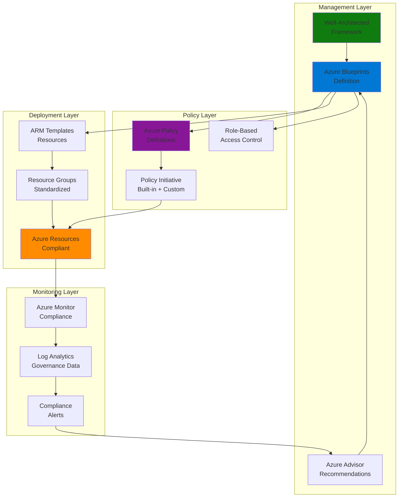

# Governance Automation with Blueprints and Well-Architected Framework

## Problem

Enterprise organizations struggle with maintaining consistent governance, compliance, and security standards across multiple Azure subscriptions and environments. Manual enforcement of organizational policies leads to configuration drift, security vulnerabilities, and compliance violations that can result in regulatory fines and operational inefficiencies. Without automated governance frameworks, development teams often deploy resources that don't align with enterprise standards, creating technical debt and increasing operational overhead.

## Solution

Azure Blueprints provides a declarative way to orchestrate the deployment of resource templates, policies, and role assignments that automatically enforce Well-Architected Framework principles across enterprise environments. This solution combines Azure Blueprints with Azure Policy and Azure Resource Manager templates to create repeatable, compliant environments that automatically implement governance controls, cost optimization measures, and security best practices at scale.

## Architecture Diagram



## Prerequisites

1. Azure subscription with Owner or Contributor permissions at the Management Group level
2. Azure CLI v2.50.0 or later installed and configured (or Azure Cloud Shell)
3. Understanding of Azure Policy concepts and JSON template syntax
4. Familiarity with Azure Resource Manager templates and governance principles
5. Knowledge of Azure Well-Architected Framework pillars (Reliability, Security, Cost Optimization, Operational Excellence, Performance Efficiency)
6. Estimated cost: $10-50 per month depending on resources deployed and monitoring scope

> **Note**: Azure Blueprints is being deprecated on July 11, 2026. Microsoft recommends migrating to Template Specs and Deployment Stacks for future governance automation. This recipe demonstrates current best practices while preparing for the transition.

## Preparation

```bash
# Set environment variables for Azure resources
export RESOURCE_GROUP="rg-governance-${RANDOM_SUFFIX}"
export LOCATION="eastus"
export SUBSCRIPTION_ID=$(az account show --query id --output tsv)
export BLUEPRINT_NAME="enterprise-governance-blueprint"
export MANAGEMENT_GROUP_ID=$(az account management-group list \
    --query "[0].name" --output tsv)

# Generate unique suffix for resource names
RANDOM_SUFFIX=$(openssl rand -hex 3)

# Verify Azure CLI login and set subscription
az account show --output table
az account set --subscription ${SUBSCRIPTION_ID}

# Create resource group for governance resources
az group create \
    --name ${RESOURCE_GROUP} \
    --location ${LOCATION} \
    --tags purpose=governance environment=production \
           framework=well-architected

echo "✅ Resource group created: ${RESOURCE_GROUP}"

# Create Log Analytics workspace for governance monitoring
export LOG_WORKSPACE_NAME="law-governance-${RANDOM_SUFFIX}"
az monitor log-analytics workspace create \
    --resource-group ${RESOURCE_GROUP} \
    --workspace-name ${LOG_WORKSPACE_NAME} \
    --location ${LOCATION} \
    --sku Standard \
    --retention-in-days 30

echo "✅ Log Analytics workspace created for governance monitoring"
```

## Steps

1. **Create Custom Policy Definitions for Well-Architected Framework**:

   Azure Policy enables you to define and enforce organizational standards that align with Well-Architected Framework principles. Custom policies ensure that deployed resources meet specific compliance requirements for security, cost optimization, and operational excellence. These policies act as guardrails that prevent non-compliant resource configurations while providing developers with clear guidance on approved patterns.

   ```bash
   # Create custom policy for required tags (Cost Optimization pillar)
   cat > required-tags-policy.json << 'EOF'
   {
     "mode": "All",
     "policyRule": {
       "if": {
         "allOf": [
           {
             "field": "type",
             "equals": "Microsoft.Resources/subscriptions/resourceGroups"
           },
           {
             "anyOf": [
               {
                 "field": "tags['Environment']",
                 "exists": "false"
               },
               {
                 "field": "tags['CostCenter']",
                 "exists": "false"
               },
               {
                 "field": "tags['Owner']",
                 "exists": "false"
               }
             ]
           }
         ]
       },
       "then": {
         "effect": "deny"
       }
     },
     "parameters": {}
   }
   EOF

   # Create policy definition
   az policy definition create \
       --name "require-resource-tags" \
       --display-name "Require specific tags on resources" \
       --description "Enforces required tags for cost tracking and governance" \
       --rules required-tags-policy.json \
       --mode All \
       --subscription ${SUBSCRIPTION_ID}

   echo "✅ Custom policy definition created for required tags"
   ```

   The policy definition now enforces mandatory tagging that supports cost allocation and resource governance. This aligns with the Cost Optimization pillar by ensuring resources can be properly tracked and optimized based on their business context.

2. **Create Security-Focused Policy Initiative**:

   Policy initiatives group related policies together to simplify assignment and management. This security-focused initiative incorporates built-in Azure policies that enforce Security pillar requirements, including encryption, network security, and access controls. Initiatives provide a comprehensive approach to governance by addressing multiple compliance requirements simultaneously.

   ```bash
   # Create policy initiative definition combining built-in and custom policies
   cat > security-initiative.json << 'EOF'
   {
     "properties": {
       "displayName": "Enterprise Security and Governance Initiative",
       "description": "Comprehensive security policies aligned with Well-Architected Framework",
       "policyDefinitions": [
         {
           "policyDefinitionId": "/providers/Microsoft.Authorization/policyDefinitions/404c3081-a854-4457-ae30-26a93ef643f9",
           "parameters": {}
         },
         {
           "policyDefinitionId": "/providers/Microsoft.Authorization/policyDefinitions/1e30110a-5ceb-460c-a204-c1c3969c6d62",
           "parameters": {}
         },
         {
           "policyDefinitionId": "/subscriptions/${SUBSCRIPTION_ID}/providers/Microsoft.Authorization/policyDefinitions/require-resource-tags",
           "parameters": {}
         }
       ]
     }
   }
   EOF

   # Create the initiative
   az policy set-definition create \
       --name "enterprise-security-initiative" \
       --display-name "Enterprise Security and Governance Initiative" \
       --description "Comprehensive security policies for enterprise governance" \
       --definitions security-initiative.json \
       --subscription ${SUBSCRIPTION_ID}

   echo "✅ Security policy initiative created with built-in and custom policies"
   ```

   The policy initiative now provides a unified approach to security governance, combining encryption requirements, storage security, and tagging policies. This comprehensive framework ensures consistent security posture across all Azure resources.

3. **Create ARM Template for Compliant Resource Deployment**:

   ARM templates enable Infrastructure as Code that incorporates Well-Architected Framework principles from the start. This template defines a compliant storage account with encryption, access controls, and monitoring configured according to Security and Operational Excellence pillars. Template-based deployment ensures consistency and reduces configuration drift.

   ```bash
   # Create ARM template for compliant storage account
   cat > storage-template.json << 'EOF'
   {
     "$schema": "https://schema.management.azure.com/schemas/2019-04-01/deploymentTemplate.json#",
     "contentVersion": "1.0.0.0",
     "parameters": {
       "storageAccountName": {
         "type": "string",
         "metadata": {
           "description": "Name of the storage account"
         }
       },
       "location": {
         "type": "string",
         "defaultValue": "[resourceGroup().location]",
         "metadata": {
           "description": "Location for the storage account"
         }
       }
     },
     "variables": {
       "storageAccountName": "[parameters('storageAccountName')]"
     },
     "resources": [
       {
         "type": "Microsoft.Storage/storageAccounts",
         "apiVersion": "2023-01-01",
         "name": "[variables('storageAccountName')]",
         "location": "[parameters('location')]",
         "tags": {
           "Environment": "Production",
           "CostCenter": "IT",
           "Owner": "CloudTeam",
           "Compliance": "Required"
         },
         "sku": {
           "name": "Standard_LRS"
         },
         "kind": "StorageV2",
         "properties": {
           "supportsHttpsTrafficOnly": true,
           "encryption": {
             "services": {
               "file": {
                 "enabled": true
               },
               "blob": {
                 "enabled": true
               }
             },
             "keySource": "Microsoft.Storage"
           },
           "accessTier": "Hot",
           "minimumTlsVersion": "TLS1_2"
         }
       }
     ],
     "outputs": {
       "storageAccountId": {
         "type": "string",
         "value": "[resourceId('Microsoft.Storage/storageAccounts', variables('storageAccountName'))]"
       }
     }
   }
   EOF

   echo "✅ ARM template created with Well-Architected Framework compliance"
   ```

   The ARM template now defines a secure, compliant storage account with encryption, HTTPS enforcement, and proper tagging. This template serves as a foundation for consistent, governance-aligned resource deployment.

4. **Create and Define Azure Blueprint**:

   Azure Blueprints orchestrate the deployment of multiple governance artifacts including policies, role assignments, and resource templates. This blueprint definition combines all governance components into a single, repeatable package that can be assigned to subscriptions. Blueprints ensure that governance controls are applied consistently across environments while maintaining version control and audit trails.

   ```bash
   # Create blueprint definition
   az blueprint create \
       --name ${BLUEPRINT_NAME} \
       --display-name "Enterprise Governance Blueprint" \
       --description "Comprehensive governance blueprint implementing Well-Architected Framework" \
       --target-scope subscription \
       --subscription ${SUBSCRIPTION_ID}

   # Add policy assignment artifact to blueprint
   az blueprint artifact policy create \
       --blueprint-name ${BLUEPRINT_NAME} \
       --artifact-name "security-policy-assignment" \
       --display-name "Security Policy Assignment" \
       --description "Assigns security policies for governance" \
       --policy-definition-id "/subscriptions/${SUBSCRIPTION_ID}/providers/Microsoft.Authorization/policySetDefinitions/enterprise-security-initiative" \
       --subscription ${SUBSCRIPTION_ID}

   # Add role assignment artifact for governance team
   az blueprint artifact role create \
       --blueprint-name ${BLUEPRINT_NAME} \
       --artifact-name "governance-role-assignment" \
       --display-name "Governance Team Role Assignment" \
       --description "Assigns Policy Contributor role to governance team" \
       --role-definition-id "/subscriptions/${SUBSCRIPTION_ID}/providers/Microsoft.Authorization/roleDefinitions/b24988ac-6180-42a0-ab88-20f7382dd24c" \
       --principal-ids "$(az ad signed-in-user show --query id --output tsv)" \
       --subscription ${SUBSCRIPTION_ID}

   echo "✅ Blueprint created with policy and role assignment artifacts"
   ```

   The blueprint now contains governance artifacts that will be consistently deployed across target subscriptions. This ensures that security policies and appropriate role assignments are automatically applied when the blueprint is assigned.

5. **Publish Blueprint Version**:

   Blueprint publishing creates an immutable version that can be assigned to subscriptions. Versioning enables governance teams to track changes, roll back if needed, and maintain consistent deployment patterns. Published blueprints provide a stable foundation for enterprise governance while supporting evolutionary improvements.

   ```bash
   # Publish blueprint version
   az blueprint publish \
       --blueprint-name ${BLUEPRINT_NAME} \
       --version "1.0" \
       --change-notes "Initial enterprise governance blueprint with Well-Architected Framework alignment" \
       --subscription ${SUBSCRIPTION_ID}

   echo "✅ Blueprint version 1.0 published and ready for assignment"
   ```

   The blueprint is now published and available for assignment to subscriptions. This immutable version ensures consistent governance deployment while maintaining an audit trail of changes.

6. **Assign Blueprint to Subscription**:

   Blueprint assignment applies governance controls to a target subscription, creating all defined resources and policy assignments. The assignment process validates compliance requirements and ensures that the subscription meets organizational standards. This automated governance deployment reduces manual configuration effort while maintaining consistency.

   ```bash
   # Create blueprint assignment
   az blueprint assignment create \
       --name "enterprise-governance-assignment" \
       --blueprint-name ${BLUEPRINT_NAME} \
       --blueprint-version "1.0" \
       --location ${LOCATION} \
       --subscription ${SUBSCRIPTION_ID} \
       --display-name "Enterprise Governance Assignment" \
       --description "Applies enterprise governance controls to subscription"

   echo "✅ Blueprint assigned to subscription - governance controls are now active"
   ```

   The blueprint assignment is now active, automatically enforcing governance policies and security controls across the subscription. This ensures consistent compliance with Well-Architected Framework principles.

7. **Configure Azure Advisor for Governance Recommendations**:

   Azure Advisor provides personalized recommendations based on Well-Architected Framework principles, analyzing resource configurations to identify optimization opportunities. Integrating Advisor with governance workflows ensures continuous improvement of cost, security, and operational excellence. Custom configurations enable targeted recommendations that align with organizational priorities.

   ```bash
   # Configure Advisor recommendations for governance
   az advisor recommendation list \
       --subscription ${SUBSCRIPTION_ID} \
       --category Security \
       --output table

   # Create action group for governance alerts
   az monitor action-group create \
       --name "governance-alerts" \
       --resource-group ${RESOURCE_GROUP} \
       --short-name "govAlert" \
       --email-receiver name="governance-team" \
                       email-address="governance@company.com"

   # Configure Advisor alerts for high-impact recommendations
   az monitor activity-log alert create \
       --name "advisor-security-alert" \
       --resource-group ${RESOURCE_GROUP} \
       --condition category=Recommendation \
       --action-group "governance-alerts" \
       --description "Alert for high-impact security recommendations"

   echo "✅ Advisor configured for governance recommendations and alerts"
   ```

   Azure Advisor is now configured to provide governance-focused recommendations with automated alerting. This enables proactive optimization based on Well-Architected Framework principles.

8. **Create Governance Monitoring Dashboard**:

   Monitoring dashboards provide visibility into governance compliance and policy enforcement across the organization. Custom dashboards track key metrics like policy violations, cost optimization opportunities, and security recommendations. Real-time visibility enables rapid response to governance issues while providing executive reporting capabilities.

   ```bash
   # Create dashboard for governance monitoring
   cat > governance-dashboard.json << 'EOF'
   {
     "properties": {
       "lenses": {
         "0": {
           "order": 0,
           "parts": {
             "0": {
               "position": {
                 "x": 0,
                 "y": 0,
                 "colSpan": 6,
                 "rowSpan": 4
               },
               "metadata": {
                 "inputs": [],
                 "type": "Extension/HubsExtension/PartType/MonitorChartPart",
                 "settings": {
                   "content": {
                     "options": {
                       "chart": {
                         "metrics": [
                           {
                             "resourceMetadata": {
                               "id": "/subscriptions/${SUBSCRIPTION_ID}"
                             },
                             "name": "PolicyViolations",
                             "aggregationType": "Count",
                             "namespace": "Microsoft.PolicyInsights/policyStates"
                           }
                         ],
                         "title": "Policy Compliance Overview",
                         "titleKind": 1,
                         "visualization": {
                           "chartType": 3
                         }
                       }
                     }
                   }
                 }
               }
             }
           }
         }
       },
       "metadata": {
         "model": {
           "timeRange": {
             "value": {
               "relative": {
                 "duration": 24,
                 "timeUnit": 1
               }
             },
             "type": "MsPortalFx.Composition.Configuration.ValueTypes.TimeRange"
           }
         }
       }
     },
     "name": "Enterprise Governance Dashboard",
     "type": "Microsoft.Portal/dashboards",
     "location": "${LOCATION}",
     "tags": {
       "hidden-title": "Enterprise Governance Dashboard"
     }
   }
   EOF

   # Deploy governance dashboard
   az portal dashboard create \
       --input-path governance-dashboard.json \
       --resource-group ${RESOURCE_GROUP} \
       --name "enterprise-governance-dashboard" \
       --location ${LOCATION}

   echo "✅ Governance monitoring dashboard created and deployed"
   ```

   The governance dashboard provides real-time visibility into compliance status, policy violations, and optimization opportunities across the enterprise environment.

## Validation & Testing

1. **Verify Blueprint Assignment Status**:

   ```bash
   # Check blueprint assignment status
   az blueprint assignment show \
       --name "enterprise-governance-assignment" \
       --subscription ${SUBSCRIPTION_ID} \
       --output table

   # Verify policy assignments are active
   az policy assignment list \
       --subscription ${SUBSCRIPTION_ID} \
       --output table
   ```

   Expected output: Assignment should show "Succeeded" status with all policy assignments listed and active.

2. **Test Policy Enforcement**:

   ```bash
   # Attempt to create non-compliant resource (should fail)
   az storage account create \
       --name "testnoncomplientstorage${RANDOM_SUFFIX}" \
       --resource-group ${RESOURCE_GROUP} \
       --location ${LOCATION} \
       --sku Standard_LRS \
       --allow-blob-public-access true

   # This should fail due to policy enforcement
   echo "Expected: Policy violation preventing non-compliant resource creation"
   ```

   Expected output: Command should fail with policy violation error message.

3. **Validate Governance Compliance**:

   ```bash
   # Check policy compliance status
   az policy state list \
       --subscription ${SUBSCRIPTION_ID} \
       --resource-group ${RESOURCE_GROUP} \
       --output table

   # Review Advisor recommendations
   az advisor recommendation list \
       --subscription ${SUBSCRIPTION_ID} \
       --category Security \
       --output table
   ```

   Expected output: Compliance status should show policy evaluations and any violations, with Advisor providing relevant recommendations.

## Cleanup

1. **Remove Blueprint Assignment**:

   ```bash
   # Delete blueprint assignment
   az blueprint assignment delete \
       --name "enterprise-governance-assignment" \
       --subscription ${SUBSCRIPTION_ID} \
       --yes

   echo "✅ Blueprint assignment deleted"
   ```

2. **Clean Up Policy Definitions**:

   ```bash
   # Delete policy initiative
   az policy set-definition delete \
       --name "enterprise-security-initiative" \
       --subscription ${SUBSCRIPTION_ID}

   # Delete custom policy definition
   az policy definition delete \
       --name "require-resource-tags" \
       --subscription ${SUBSCRIPTION_ID}

   echo "✅ Policy definitions and initiatives deleted"
   ```

3. **Remove Blueprint Definition**:

   ```bash
   # Delete blueprint definition
   az blueprint delete \
       --name ${BLUEPRINT_NAME} \
       --subscription ${SUBSCRIPTION_ID} \
       --yes

   echo "✅ Blueprint definition deleted"
   ```

4. **Delete Resource Group and Resources**:

   ```bash
   # Delete resource group and all contained resources
   az group delete \
       --name ${RESOURCE_GROUP} \
       --yes \
       --no-wait

   echo "✅ Resource group deletion initiated: ${RESOURCE_GROUP}"
   echo "Note: Deletion may take several minutes to complete"
   ```

## Discussion

Azure Blueprints provides a powerful framework for implementing enterprise-grade governance automation that aligns with the Azure Well-Architected Framework principles. This solution demonstrates how organizations can establish consistent governance controls across multiple subscriptions while maintaining compliance with security, cost optimization, and operational excellence requirements. The blueprint approach ensures that governance is embedded in the infrastructure deployment process rather than applied as an afterthought, reducing the risk of configuration drift and policy violations.

The integration of Azure Policy with blueprints creates a comprehensive governance layer that automatically enforces organizational standards while providing developers with clear guidelines for compliant resource deployment. This approach follows the Operational Excellence pillar by establishing standardized processes that can be consistently applied across environments. The combination of built-in and custom policies enables organizations to address specific compliance requirements while leveraging Microsoft's expertise in cloud security best practices. For detailed policy authoring guidance, see the [Azure Policy documentation](https://docs.microsoft.com/en-us/azure/governance/policy/overview).

From a cost optimization perspective, the automated governance framework helps organizations avoid expensive misconfigurations and ensures that resources are properly tagged for cost allocation and optimization. Azure Advisor integration provides continuous recommendations for improving cost efficiency, security posture, and operational performance. The dashboard-based monitoring enables real-time visibility into governance compliance and helps identify optimization opportunities before they impact business operations. For comprehensive cost management strategies, review the [Azure Cost Management documentation](https://docs.microsoft.com/en-us/azure/cost-management-billing/).

The transition from Azure Blueprints to Template Specs and Deployment Stacks represents Microsoft's evolution toward more flexible governance patterns that support modern DevOps practices. Organizations should begin planning their migration strategy while continuing to leverage blueprints for immediate governance needs. The Well-Architected Framework principles remain consistent across these transitions, ensuring that governance investments provide long-term value. For migration guidance, see the [Azure Blueprints deprecation notice](https://docs.microsoft.com/en-us/azure/governance/blueprints/overview) and [Template Specs documentation](https://docs.microsoft.com/en-us/azure/azure-resource-manager/templates/template-specs).

> **Warning**: Azure Blueprints will be deprecated on July 11, 2026. Organizations should plan migration to Template Specs and Deployment Stacks to ensure continued governance automation capabilities. The governance principles and policy configurations demonstrated in this recipe remain applicable to the new deployment methods.

## Challenge

Extend this enterprise governance solution by implementing these enhancements:

1. **Multi-Environment Governance**: Create separate blueprint versions for development, staging, and production environments with environment-specific policies and resource configurations that maintain security while enabling developer productivity.

2. **Custom Compliance Frameworks**: Develop blueprint artifacts that implement specific regulatory compliance requirements (SOC 2, ISO 27001, GDPR) with automated evidence collection and reporting capabilities.

3. **Cost Governance Automation**: Implement budget controls and automated resource shutdown policies that trigger based on cost thresholds while maintaining business continuity for critical workloads.

4. **DevOps Integration**: Create CI/CD pipelines that automatically validate resource deployments against governance policies before deployment, with automated rollback capabilities for non-compliant changes.

5. **Advanced Monitoring and Alerting**: Implement machine learning-based anomaly detection for governance violations and cost optimization opportunities, with automated remediation workflows for common issues.

## Infrastructure Code

### Available Infrastructure as Code:

- [Infrastructure Code Overview](code/README.md) - Detailed description of all infrastructure components
- [Bicep](code/bicep/) - Azure Bicep templates
- [Bash CLI Scripts](code/scripts/) - Example bash scripts using Azure CLI commands to deploy infrastructure
- [Terraform](code/terraform/) - Terraform configuration files